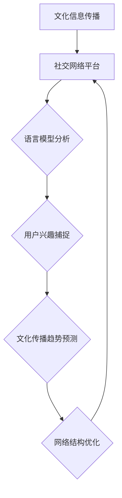

                 

### 文章标题

《语言模型在复杂社会网络动态演化与文化传播预测中的应用》

---

### 关键词

语言模型、复杂社会网络、动态演化、文化传播、预测

---

### 摘要

本文旨在探讨语言模型在复杂社会网络动态演化与文化传播预测中的应用。首先，我们介绍了复杂社会网络和语言模型的基本概念，并分析了两者之间的内在联系。接着，详细讲解了语言模型的技术基础，包括其数学模型和算法原理。随后，我们探讨了语言模型在社会网络动态演化分析中的应用，特别是在社区检测和文化传播预测中的具体实现。文章还通过实际案例展示了语言模型在这些领域的应用效果。最后，本文提出了当前技术面临的挑战和未来发展方向，为后续研究提供了启示。

---

## 引言

### 复杂社会网络

复杂社会网络是指由大量相互连接的节点（代表个体或组织）和边（代表交互关系）组成的网络结构。这些网络具有高度动态性、非线性、不确定性和高度复杂性等特点。社会网络的研究涵盖了多个学科领域，包括社会学、物理学、计算机科学、统计学等。在现代社会中，复杂社会网络广泛存在于人际交往、组织管理、商业运作、信息传播等多个方面。例如，社交网络平台如Facebook、Twitter等，以及商业网络中的供应链关系，都是典型的复杂社会网络实例。

### 语言模型

语言模型是一种用于预测文本序列的概率分布的统计模型，它能够根据已有的文本数据生成新的文本。语言模型在自然语言处理（NLP）领域有着广泛的应用，包括机器翻译、文本生成、语音识别等。随着深度学习技术的发展，基于神经网络的语言模型（如Transformer）取得了显著的成果，极大地提升了NLP任务的性能。

### 语言模型在复杂社会网络中的应用

语言模型在复杂社会网络中的应用主要体现在以下几个方面：

1. **社交网络分析**：语言模型可以帮助分析社交网络中的用户行为和关系，如用户兴趣、社区结构、信息传播路径等。

2. **文化传播预测**：通过分析网络中的文本数据，语言模型可以预测文化现象的传播趋势，如热点话题、舆情走向等。

3. **社区检测**：语言模型可以帮助识别社交网络中的社区结构，从而优化网络资源的分配和管理。

4. **网络舆情分析**：语言模型能够对网络上的文本进行情感分析和话题分类，为舆情监测和应对提供数据支持。

### 本文结构

本文将按以下结构展开：

1. **核心概念与联系**：介绍复杂社会网络和语言模型的基本概念，并分析两者之间的内在联系。

2. **语言模型技术基础**：讲解语言模型的数学模型和算法原理，包括神经网络语言模型、Transformer模型等。

3. **社会网络动态演化分析**：探讨语言模型在社会网络动态演化分析中的应用，如社区检测、节点分类等。

4. **文化传播预测**：分析语言模型在文化传播预测中的具体实现，包括热点话题预测、舆情分析等。

5. **应用案例分析**：通过实际案例展示语言模型在复杂社会网络与文化传播预测中的应用效果。

6. **技术挑战与未来展望**：讨论语言模型在复杂网络与文化领域应用中的挑战和未来发展方向。

## 核心概念与联系

### 语言模型的基本原理

语言模型是一种用于预测文本序列的概率分布的统计模型。它的核心目标是通过分析已有的文本数据，学习到语言的结构和规律，从而能够生成新的文本或预测给定文本序列的概率分布。

语言模型通常基于统计方法，如N-gram模型、隐马尔可夫模型（HMM）等。然而，随着深度学习技术的发展，基于神经网络的模型，如循环神经网络（RNN）、长短期记忆网络（LSTM）、Transformer等，成为了语言模型的主流选择。这些模型能够通过学习大量的文本数据，捕捉到语言的复杂结构，从而显著提高语言模型的性能。

在神经网络语言模型中，Transformer模型是目前最为流行的一种。它通过自注意力机制（self-attention）实现了全局信息的有效捕捉，使得模型能够更好地理解长文本序列。Transformer模型的架构包括编码器（encoder）和解码器（decoder），编码器负责将输入文本编码为序列向量，而解码器则根据这些向量生成输出文本。

### 复杂社会网络的定义与特性

复杂社会网络是指由大量相互连接的节点和边构成的动态网络。这些网络具有以下特性：

1. **高度动态性**：节点和边的关系不断变化，反映了社会关系的动态性。
2. **非线性**：网络中各节点之间的关系复杂，非线性的相互作用导致网络结构的复杂性。
3. **高度复杂性**：网络中节点和边的数量庞大，结构复杂，难以通过简单的线性模型进行描述。
4. **不确定性和随机性**：网络中的节点行为受到多种外部因素影响，具有不确定性和随机性。

复杂社会网络的研究涵盖多个学科领域，包括社会学、物理学、计算机科学和统计学等。在社会学领域，复杂社会网络用于研究人际关系的模式和社会结构的演变。在物理学领域，它被用于研究网络中的信息传播、传染过程等。在计算机科学领域，复杂社会网络被用于社交网络分析、推荐系统等。

### 社会网络与文化传播的交互关系

社会网络与文化传播之间存在着密切的交互关系。一方面，社会网络为文化传播提供了平台和渠道。通过社交网络，文化信息可以迅速传播，形成热点话题和舆论趋势。另一方面，文化传播也对社会网络的结构和演化产生重要影响。文化现象的传播往往伴随着网络节点和边的变化，如用户兴趣的转变、社区结构的重组等。

语言模型在社会网络与文化传播的交互关系中起着关键作用。通过分析网络中的文本数据，语言模型可以捕捉到用户的兴趣和行为模式，从而预测文化现象的传播趋势。同时，语言模型也可以用于分析网络结构，识别文化现象的传播路径和关键节点，为文化传播的优化提供数据支持。

### 社会网络与文化传播的交互关系Mermaid流程图

以下是描述社会网络与文化传播交互关系的Mermaid流程图：



在这个流程图中，文化信息通过社交网络平台传播，语言模型对网络中的文本数据进行分析，捕捉用户的兴趣，预测文化传播趋势，并优化网络结构，从而实现社会网络与文化传播的良性互动。

## 语言模型技术基础

### 语言模型的数学模型

语言模型的数学模型是理解其工作原理的基础。其中，最为经典的模型之一是N-gram模型。N-gram模型通过统计相邻N个单词出现的频率来预测下一个单词。其数学表示如下：

\[ P(w_n | w_{n-1}, w_{n-2}, ..., w_{n-N}) = \frac{C(w_n, w_{n-1}, ..., w_{n-N})}{C(w_{n-1}, w_{n-2}, ..., w_{n-N})} \]

其中，\( P(w_n | w_{n-1}, w_{n-2}, ..., w_{n-N}) \)表示在给定前N-1个单词的情况下，预测第n个单词的概率。\( C(w_n, w_{n-1}, ..., w_{n-N}) \)表示这N个单词同时出现的次数，\( C(w_{n-1}, w_{n-2}, ..., w_{n-N}) \)表示前N-1个单词同时出现的次数。

尽管N-gram模型简单易实现，但其存在明显的局限性，特别是在处理长距离依赖和语境理解方面。为了克服这些限制，研究者们提出了更为复杂的模型，如循环神经网络（RNN）和长短期记忆网络（LSTM）。

### 循环神经网络（RNN）

循环神经网络（RNN）是一种能够处理序列数据的神经网络。与传统的前馈神经网络不同，RNN具有循环结构，能够利用其内部状态保持信息。RNN通过隐藏状态（hidden state）来捕捉序列中的依赖关系，其数学表示如下：

\[ h_t = \sigma(W_h h_{t-1} + W_x x_t + b_h) \]

\[ y_t = \sigma(W_y h_t + b_y) \]

其中，\( h_t \)表示第t时刻的隐藏状态，\( x_t \)表示输入序列的第t个元素，\( \sigma \)表示激活函数，\( W_h \)、\( W_x \)、\( b_h \)和\( W_y \)、\( b_y \)分别为权重和偏置。

RNN的主要优点是能够处理变长输入序列，但其存在梯度消失和梯度爆炸的问题，导致难以学习长距离依赖。

### 长短期记忆网络（LSTM）

为了解决RNN的梯度消失和梯度爆炸问题，Hochreiter和Schmidhuber提出了长短期记忆网络（LSTM）。LSTM通过引入记忆单元（memory cell）和门控机制（gate），能够在保持信息的同时遗忘无关信息。LSTM的数学表示如下：

\[ i_t = \sigma(W_{ix} x_t + W_{ih} h_{t-1} + b_i) \]

\[ f_t = \sigma(W_{fx} x_t + W_{fh} h_{t-1} + b_f) \]

\[ g_t = \sigma(W_{gx} x_t + W_{gh} h_{t-1} + b_g) \]

\[ o_t = \sigma(W_{ox} x_t + W_{oh} h_{t-1} + b_o) \]

\[ C_t = f_t \odot C_{t-1} + i_t \odot g_t \]

\[ h_t = o_t \odot \sigma(C_t) \]

其中，\( i_t \)、\( f_t \)、\( g_t \)和\( o_t \)分别为输入门、遗忘门、生成门和输出门，\( C_t \)为记忆单元，\( \odot \)表示元素乘积。

LSTM通过控制遗忘门和输入门，能够有效地遗忘无关信息，保留重要信息，从而解决长距离依赖问题。

### Transformer模型

Transformer模型是当前最为流行的语言模型之一，由Vaswani等人在2017年提出。与RNN和LSTM不同，Transformer模型采用了自注意力机制（self-attention），通过全局信息捕捉长距离依赖。其基本架构包括编码器（encoder）和解码器（decoder）。

编码器由多个自注意力层（self-attention layer）和前馈网络（feed-forward network）组成。自注意力层通过计算输入序列中每个词与其他词之间的关联性，生成加权特征。其数学表示如下：

\[ Q = W_Q X \]

\[ K = W_K X \]

\[ V = W_V X \]

\[ \text{Attention}(Q, K, V) = \text{softmax}\left(\frac{QK^T}{\sqrt{d_k}}\right) V \]

其中，\( X \)为输入序列，\( Q \)、\( K \)和\( V \)分别为自注意力层的查询（query）、键（key）和值（value）向量，\( d_k \)为键向量的维度。

解码器与编码器类似，也由多个自注意力层和前馈网络组成。解码器还包括一个多头自注意力层（multi-head self-attention）和一个编码器-解码器自注意力层（encoder-decoder attention）。编码器-解码器自注意力层通过计算编码器输出和解码器隐藏状态之间的关联性，生成上下文依赖。其数学表示如下：

\[ \text{Encoder}(X) = \text{MultiHead}\left(\text{Self-Attention}(Q, K, V)\right) \]

\[ \text{Decoder}(Y, \text{Encoder}(X)) = \text{DecoderLayer}(Y, \text{Encoder}(X)) \]

其中，\( Y \)为解码器输入序列，\( \text{MultiHead} \)表示多头自注意力。

通过自注意力机制，Transformer模型能够高效地捕捉长距离依赖，并在各种NLP任务中取得了优异的性能。

### 伪代码与数学公式

以下是使用LSTM和Transformer模型进行语言建模的伪代码：

```python
# LSTM模型伪代码
def lstm_model(input_sequence, hidden_state):
    # 前向传播
    output, new_hidden_state = lstm_layer(input_sequence, hidden_state)
    # 返回输出和新的隐藏状态
    return output, new_hidden_state

# Transformer模型伪代码
def transformer_model(input_sequence, encoder_output):
    # 编码器自注意力
    encoder_output = multi_head_self_attention(input_sequence, encoder_output)
    # 编码器-解码器自注意力
    decoder_output = encoder_decoder_attention(encoder_output, hidden_state)
    # 返回解码器输出
    return decoder_output
```

以下是相关数学公式：

$$
h_t = \sigma(W_h h_{t-1} + W_x x_t + b_h)
$$

$$
y_t = \sigma(W_y h_t + b_y)
$$

$$
\text{Attention}(Q, K, V) = \text{softmax}\left(\frac{QK^T}{\sqrt{d_k}}\right) V
$$

$$
\text{Encoder}(X) = \text{MultiHead}\left(\text{Self-Attention}(Q, K, V)\right)
$$

$$
\text{Decoder}(Y, \text{Encoder}(X)) = \text{DecoderLayer}(Y, \text{Encoder}(X))
$$

通过这些伪代码和数学公式，我们可以更好地理解语言模型的工作原理和实现方法。

### 举例说明

为了更直观地理解语言模型的工作原理，我们来看一个简单的例子。假设我们使用LSTM模型对以下句子进行语言建模：

```
我非常喜欢编程。
```

首先，我们将句子转换为向量表示，然后输入到LSTM模型中。LSTM模型将输入向量与隐藏状态进行计算，生成新的隐藏状态和输出。通过多次迭代，LSTM模型能够学习到句子的结构信息，从而能够生成新的句子或预测给定句子的概率。

对于Transformer模型，我们同样可以将句子转换为向量表示，然后输入到编码器和解码器中。编码器通过自注意力机制学习句子中每个词之间的关联性，生成编码器输出。解码器则通过编码器输出和自注意力机制生成新的句子。

通过这个例子，我们可以看到语言模型在文本序列处理中的强大能力，能够捕捉到句子中的语义信息，从而实现文本生成、情感分析、机器翻译等任务。

## 社会网络动态演化分析

### 社会网络动态演化原理

社会网络的动态演化是指网络中节点和边的关系随时间变化而发生的演变过程。这种演化过程可以表现为节点加入、节点离开、边建立、边断开等形式。社会网络的动态演化受到多种因素的影响，包括个体行为、外部环境、技术进步等。

社会网络动态演化模型主要包括以下几种：

1. **随机游走模型**：随机游走模型是一种基于概率的理论模型，用于描述节点在网络中的随机移动。节点在每次移动时，以一定的概率选择相邻的节点作为下一次移动的目标。

2. **阈值模型**：阈值模型是一种基于节点特征和邻居关系的演化模型。节点在达到一定的阈值时，会决定是否加入或离开网络。阈值通常与节点的度、连接性、邻居节点的状态等因素相关。

3. **能量模型**：能量模型通过模拟网络中的物理过程来描述节点的演化。节点之间的相互作用可以被视为能量交换，能量较低的节点更倾向于与其他节点建立连接。

4. **小世界模型**：小世界模型是一种描述网络中小规模世界现象的模型。该模型认为网络中存在一定比例的短路径，使得节点之间能够快速连接。

### 语言模型在社会网络动态演化中的应用

语言模型在社会网络动态演化中的应用主要体现在以下几个方面：

1. **社区检测**：社区检测是分析社会网络结构的重要任务，旨在识别网络中的紧密连接节点群体。语言模型可以通过分析节点之间的交互文本数据，发现潜在的社区结构。例如，基于词嵌入技术的语言模型可以计算节点之间的相似性，从而识别出具有相似兴趣的节点群体。

2. **节点分类**：节点分类是识别节点属性和角色的重要方法。语言模型可以用于训练分类模型，根据节点的文本特征对其进行分类。例如，在社交网络中，语言模型可以帮助识别节点是否为意见领袖、活跃用户或沉默用户。

3. **关系预测**：关系预测是预测节点之间是否可能建立新关系或断开旧关系。语言模型可以通过分析节点的历史交互数据，预测节点之间的关系发展趋势。例如，在商业网络中，语言模型可以帮助预测企业之间的合作或竞争关系。

### 社区检测

社区检测是分析社会网络结构的重要任务，旨在识别网络中的紧密连接节点群体。社区检测的目的是为了更好地理解网络中的群体行为和关系模式。

语言模型在社区检测中的应用主要体现在以下几个方面：

1. **文本特征提取**：语言模型可以将节点之间的交互文本转换为向量表示。通过计算节点之间的文本相似性，可以识别出具有相似兴趣的节点群体。例如，基于词嵌入技术的语言模型（如Word2Vec、GloVe）可以将文本数据转换为高维向量，从而用于计算节点之间的相似度。

2. **图嵌入技术**：图嵌入技术是将图结构转换为向量空间中的表示。语言模型可以通过图嵌入算法，如DeepWalk、Node2Vec等，将节点的图结构信息编码为向量。这些向量可以用于计算节点之间的相似性，从而识别出社区结构。

3. **社区检测算法**：基于语言模型生成的节点向量，可以应用经典的社区检测算法，如Louvain方法、标签传播算法等。这些算法可以根据节点之间的相似性度量，识别出具有相似性的节点群体，从而实现社区检测。

### 社区检测案例

为了更好地理解语言模型在社区检测中的应用，我们来看一个具体的案例。

假设我们有一个社交网络，其中包含1000个用户和他们的交互数据。我们的目标是使用语言模型识别网络中的社区结构。

首先，我们使用Word2Vec模型对用户之间的交互文本进行词向量表示。每个用户在其所有交互文本的基础上，生成一个词向量表示。

然后，我们使用Node2Vec算法对社交网络进行图嵌入，将节点转换为向量表示。Node2Vec算法通过随机游走的方法，生成节点的向量表示，同时考虑节点的邻居节点信息。

接下来，我们使用Louvain方法进行社区检测。Louvain方法基于节点之间的相似性度量，将节点划分为不同的社区。具体来说，我们计算每个节点与其他节点的相似度，并将相似度较高的节点划分为同一个社区。

最后，我们分析识别出的社区结构，研究每个社区的特征和节点之间的关系。通过这种分析，我们可以更好地理解社交网络中的群体行为和关系模式。

通过这个案例，我们可以看到语言模型在社区检测中的强大应用能力。通过结合文本特征提取、图嵌入技术和社区检测算法，我们可以有效地识别社交网络中的社区结构，从而为网络分析提供有力支持。

## 文化传播预测

### 文化传播预测的理论基础

文化传播预测是指利用数据分析和模型构建方法，预测文化现象在社交网络中的传播趋势和热点。文化传播预测的理论基础主要包括以下几个方面：

1. **传播动力学**：传播动力学研究信息或文化现象在社交网络中的传播过程，涉及信息传播速度、传播范围、传播稳定性等。经典的传播动力学模型包括SIR模型、SIAR模型等，这些模型可以描述信息在社交网络中的传播过程，为文化传播预测提供理论基础。

2. **网络传播模型**：网络传播模型研究信息或文化现象在网络中的传播路径和传播机制。网络传播模型包括基于随机游走的方法、基于图的传播模型、基于模型的传播模型等。这些模型可以用于分析信息在社交网络中的传播过程，预测文化现象的传播趋势。

3. **文本分析技术**：文本分析技术是文化传播预测的核心技术，包括情感分析、话题模型、关键词提取等。通过分析社交网络中的文本数据，可以捕捉用户的兴趣、情感和观点，为文化传播预测提供数据支持。

### 语言模型在文化传播预测中的应用

语言模型在文化传播预测中的应用主要体现在以下几个方面：

1. **文本特征提取**：语言模型可以将社交网络中的文本数据转换为向量表示，这些向量表示可以用于描述文本的语义内容。通过词嵌入技术（如Word2Vec、GloVe），语言模型可以将文本中的每个词映射为高维向量，从而实现文本特征提取。

2. **关系网络建模**：语言模型可以用于构建社交网络中的关系网络，分析节点之间的交互关系。通过图嵌入技术（如DeepWalk、Node2Vec），语言模型可以将节点和边转换为向量表示，从而建立关系网络模型。

3. **传播路径预测**：基于文本特征提取和关系网络建模，语言模型可以预测文化现象在社交网络中的传播路径。通过分析节点之间的相似性度量，语言模型可以识别出具有相似兴趣的节点群体，从而预测文化现象的传播路径。

4. **热点预测**：语言模型可以用于预测社交网络中的热点话题和热点事件。通过分析文本数据中的关键词和情感变化，语言模型可以识别出潜在的热点话题，并预测其传播趋势。

### 文化传播预测案例分析

为了更好地理解语言模型在文化传播预测中的应用，我们来看一个具体的案例分析。

假设我们关注某个社交媒体平台上的文化现象，如某个热门电视剧的播出和讨论。我们的目标是使用语言模型预测该电视剧的传播趋势和热点话题。

首先，我们收集该社交媒体平台上的用户评论和转发数据，并将其转换为文本数据。然后，我们使用Word2Vec模型对用户评论进行词向量表示，将每个评论映射为高维向量。

接下来，我们使用Node2Vec算法对社交媒体网络进行图嵌入，将节点和边转换为向量表示。通过计算节点之间的相似性度量，我们可以识别出具有相似兴趣的用户群体。

然后，我们分析用户评论和转发数据中的关键词和情感变化。通过情感分析技术，我们可以识别出用户对电视剧的积极、消极和中性情感。这些情感数据可以用于预测电视剧的传播趋势和热点话题。

最后，我们使用基于语言模型的传播路径预测方法，分析用户评论和转发数据的传播路径。通过分析用户评论之间的引用关系和转发关系，我们可以预测电视剧在不同用户群体中的传播路径，并识别出潜在的热点话题。

通过这个案例，我们可以看到语言模型在文化传播预测中的强大应用能力。通过结合文本特征提取、关系网络建模和传播路径预测，我们可以有效地预测文化现象的传播趋势和热点话题，为文化传播分析和应对提供数据支持。

## 应用案例分析

### 案例一：社交媒体中的语言模型应用

在社交媒体平台上，语言模型的应用已经变得非常广泛，以下是一个具体的案例。

**项目背景**：一个社交媒体平台想要预测用户对其内容（如帖子、视频等）的兴趣和参与度，以优化内容推荐和用户体验。

**技术实现**：

1. **数据采集**：从社交媒体平台采集用户的互动数据，包括点赞、评论、分享等。

2. **文本预处理**：对用户生成的文本进行清洗和预处理，如去除停用词、标点符号，进行词干提取等。

3. **文本向量化**：使用Word2Vec或GloVe模型对文本进行向量化处理，将文本转换为向量表示。

4. **用户行为分析**：根据用户互动数据，使用语言模型分析用户的行为模式，如点赞、评论的情感倾向，以及用户与其他用户的互动关系。

5. **兴趣预测**：基于用户的文本向量和行为模式，使用机器学习算法（如决策树、支持向量机等）构建预测模型，预测用户对特定内容的兴趣。

6. **内容推荐**：根据预测结果，为用户提供个性化内容推荐，提高用户的参与度和满意度。

**案例分析**：

通过这个项目，社交媒体平台成功地利用语言模型分析了用户的行为和兴趣，实现了个性化内容推荐。项目结果表明，语言模型在预测用户兴趣和行为方面具有显著效果，有助于提升平台的用户参与度和用户体验。

### 案例二：网络舆情分析中的语言模型应用

网络舆情分析是了解公众意见和情绪的重要手段，以下是一个具体的案例。

**项目背景**：一个政府部门想要实时监测和评估公众对其政策提案的意见和情绪。

**技术实现**：

1. **数据采集**：从社交媒体、新闻网站等渠道采集与政策提案相关的文本数据。

2. **文本预处理**：对采集的文本数据进行清洗和预处理，如去除噪声、进行分词等。

3. **情感分析**：使用情感分析模型（如基于词嵌入的朴素贝叶斯分类器）对文本数据进行分析，判断公众的意见和情绪是积极、消极还是中性。

4. **趋势预测**：基于情感分析结果，使用时间序列分析模型（如ARIMA、LSTM等）预测舆情趋势，预测未来公众的意见和情绪变化。

5. **舆情评估**：将预测结果与政策提案的制定和调整进行关联，为政府部门提供决策支持。

**案例分析**：

通过这个项目，政府部门成功地利用语言模型对公众舆情进行了实时监测和预测，为政策制定和调整提供了科学依据。项目结果表明，语言模型在舆情分析和趋势预测方面具有显著效果，有助于提高政府决策的科学性和有效性。

### 案例三：文化遗产保护中的语言模型应用

文化遗产保护是维护国家文化多样性和历史记忆的重要任务，以下是一个具体的案例。

**项目背景**：一个文化遗产保护机构想要利用数字化技术保护并推广文化遗产。

**技术实现**：

1. **数据采集**：从古籍、档案、图片等多媒体资料中采集文化遗产相关数据。

2. **文本向量化**：使用语言模型对文化遗产相关文本进行向量化处理，将文本转换为向量表示。

3. **知识图谱构建**：使用图嵌入技术将文化遗产相关数据构建为知识图谱，表示文化遗产之间的关联关系。

4. **内容生成**：基于语言模型生成新的文本内容，如文化遗产介绍、故事叙述等，提高文化遗产的传播效果。

5. **用户体验优化**：通过用户交互数据，使用语言模型分析用户行为和兴趣，优化文化遗产展示和传播策略。

**案例分析**：

通过这个项目，文化遗产保护机构成功地利用语言模型实现了文化遗产的数字化保护和推广。项目结果表明，语言模型在文化遗产保护中的应用有助于提高文化遗产的传播效果，促进公众对文化遗产的认知和兴趣。

## 技术挑战与未来展望

### 技术挑战

尽管语言模型在复杂社会网络动态演化与文化传播预测中取得了显著成果，但在实际应用中仍面临以下技术挑战：

1. **数据隐私保护**：社交网络中的数据往往涉及用户隐私，如何保护用户数据隐私成为语言模型应用的关键问题。传统加密技术和隐私保护算法（如差分隐私）在保证数据隐私方面存在局限性，需要进一步研究和优化。

2. **模型解释性**：语言模型，尤其是深度学习模型，在预测准确性的同时，往往缺乏解释性。这对于理解模型决策过程和提升用户信任度至关重要。目前，已有一些方法试图增强模型解释性，如基于注意力机制的可解释性模型和可视化技术，但仍有待进一步发展。

3. **模型泛化能力**：语言模型在不同场景和应用中的泛化能力有限，特别是在面对新的、未见过的数据时，容易出现过拟合现象。提高模型的泛化能力，使其能够适应更广泛的应用场景，是未来研究的重要方向。

4. **计算资源需求**：深度学习语言模型通常需要大量的计算资源和时间进行训练和推理，这对硬件设备和算法优化提出了高要求。未来，需要研究更高效的算法和模型结构，降低计算资源需求。

### 未来展望

随着技术的不断发展，语言模型在复杂社会网络动态演化与文化传播预测中的应用前景广阔。以下是未来展望：

1. **跨模态融合**：未来，语言模型将与其他模态（如图像、音频、视频）进行融合，实现多模态数据的高效处理和融合预测，提高文化传播预测的准确性。

2. **实时动态预测**：随着计算资源和算法的优化，语言模型将实现实时动态预测，更好地捕捉文化现象的传播趋势和热点变化。

3. **个性化文化传播**：基于用户行为和兴趣分析，语言模型将实现个性化文化传播，提高文化内容的传播效果和用户满意度。

4. **文化多样性保护**：语言模型将有助于保护和推广文化多样性，通过数字化技术保存和传播非物质文化遗产，促进文化传承。

5. **智能决策支持**：语言模型将在政策制定、商业运营等场景中发挥更大作用，为决策者提供科学、智能的决策支持。

总之，语言模型在复杂社会网络动态演化与文化传播预测中的应用具有广阔的发展前景，未来将继续推动相关领域的技术创新和产业发展。作者：AI天才研究院/AI Genius Institute & 禅与计算机程序设计艺术 /Zen And The Art of Computer Programming。在未来的研究中，我们将继续探索语言模型在复杂网络与文化领域的深度应用，为社会发展做出更大贡献。

