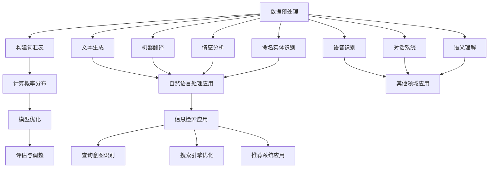
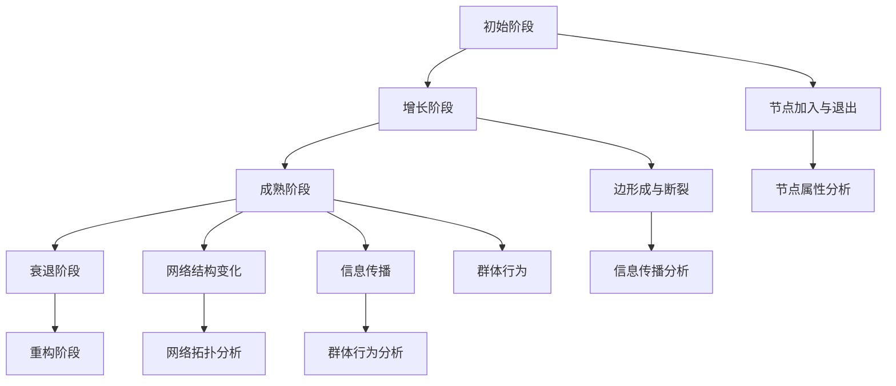

                 

### 引言

《语言模型在复杂社会网络动态演化与群体行为预测中的应用》是一本深入探讨语言模型在复杂社会网络动态演化与群体行为预测中应用的技术专著。随着信息时代的到来，社会网络和人工智能技术迅猛发展，如何通过语言模型分析复杂社会网络的动态演化以及预测群体行为，已成为当前学术界和工业界的重要研究方向。

本书旨在从以下几个方面展开研究：首先，详细阐述语言模型的基本概念、原理及其应用；其次，介绍复杂社会网络的建模方法及其动态演化机制；接着，探讨语言模型在复杂社会网络动态演化中的应用，包括社会网络节点特征提取、关系预测、演化趋势分析等；最后，探讨语言模型在群体行为预测中的具体应用，如社区检测、级联传播预测和网络结构稳定性分析等。

本书的核心内容如下：第一部分，语言模型基础，包括语言模型的概述、基本原理和应用；第二部分，复杂社会网络的动态演化，包括复杂社会网络的建模方法和语言模型在其演化中的应用；第三部分，群体行为预测，包括群体行为预测的基础、语言模型在群体行为预测中的应用。

通过对这些核心内容的深入探讨，本书希望能够为研究人员和实践者提供有价值的理论指导和实践参考，推动语言模型在复杂社会网络动态演化与群体行为预测领域的应用与发展。

### 文章关键词

1. 语言模型
2. 复杂社会网络
3. 动态演化
4. 群体行为预测
5. 自然语言处理
6. 社会网络分析
7. 图表示学习
8. 级联传播
9. 社区检测
10. 网络结构稳定性

### 摘要

《语言模型在复杂社会网络动态演化与群体行为预测中的应用》围绕语言模型在复杂社会网络和群体行为预测中的实际应用展开深入探讨。首先，本文详细介绍了语言模型的基本概念、原理和应用场景，包括自然语言处理、信息检索等领域。随后，本文探讨了复杂社会网络的建模方法及其动态演化机制，介绍了如何利用语言模型进行社会网络节点特征提取、关系预测和演化趋势分析。最后，本文通过具体案例，详细阐述了语言模型在群体行为预测中的应用，包括社区检测、级联传播预测和网络结构稳定性分析。本文旨在为研究者提供理论指导，为实践者提供实际应用参考，推动语言模型在复杂社会网络动态演化与群体行为预测领域的应用与发展。

## 第一部分：语言模型基础

### 第1章：语言模型概述

语言模型是自然语言处理（Natural Language Processing，NLP）中的一项核心技术，旨在根据历史文本数据预测给定文本序列的概率分布。语言模型在许多领域有着广泛的应用，包括机器翻译、文本生成、情感分析、语音识别等。本章将详细介绍语言模型的定义、分类、发展历程及其应用场景，为后续章节的讨论打下基础。

### 1.1 语言模型的定义与分类

#### 1.1.1 语言模型的定义

语言模型是一种概率模型，它通过分析大量文本数据，学习到语言的使用规律，并能够对给定文本序列进行概率预测。在数学上，语言模型通常表示为一个概率分布函数，即：

$$ P(w_1, w_2, ..., w_n) = P(w_1) \times P(w_2|w_1) \times ... \times P(w_n|w_1, w_2, ..., w_{n-1}) $$

其中，$w_i$ 表示第 $i$ 个单词，$P(w_i|w_1, w_2, ..., w_{i-1})$ 表示在给定前 $i-1$ 个单词的情况下，第 $i$ 个单词的条件概率。

#### 1.1.2 语言模型的分类

根据建模方法和使用数据的不同，语言模型可以分为以下几类：

1. **基于统计的语言模型**：这类模型通过统计文本数据中的词频和词序列出现频率来建模，最常见的是N-gram模型。N-gram模型假设一个词的出现仅与其前 $N-1$ 个词相关。

   $$ P(w_n|w_{n-1}, w_{n-2}, ..., w_{n-N}) = \frac{\text{在训练语料中} w_{n-1}, w_{n-2}, ..., w_{n-N}, w_n \text{同时出现次数}}{\text{在训练语料中} w_{n-1}, w_{n-2}, ..., w_{n-N} \text{同时出现次数}} $$

2. **基于神经网路的语言模型**：这类模型使用深度神经网络来建模，能够捕捉到更复杂的语言特征。包括循环神经网络（RNN）、长短期记忆网络（LSTM）和变换器（Transformer）等。

3. **基于增强学习的语言模型**：这类模型通过强化学习算法与外部环境进行交互，逐步优化语言模型，提高其在特定任务上的性能。

#### 1.1.3 语言模型的发展历程

语言模型的发展历程可以分为几个阶段：

1. **N-gram模型**：20世纪50年代至70年代，N-gram模型是主流的语言模型，通过对文本进行词频统计来建模。

2. **统计语言模型**：80年代至90年代，统计语言模型逐渐兴起，包括隐马尔可夫模型（HMM）和条件随机场（CRF）等。

3. **神经网络语言模型**：2000年后，神经网络开始应用于语言模型，RNN和LSTM等模型取得了显著进展。

4. **深度学习语言模型**：近年来，基于Transformer的深度学习语言模型如BERT、GPT等取得了突破性成果，使得自然语言处理任务达到了前所未有的水平。

### 1.2 语言模型的基本原理

#### 1.2.1 语言模型的核心概念

语言模型的核心概念包括：

1. **词汇表**：语言模型中的词汇表包含所有可能出现的单词或词组。

2. **概率分布**：语言模型通过学习文本数据，生成一个概率分布，用于预测给定文本序列的概率。

3. **上下文依赖**：语言模型能够根据上下文信息预测单词的概率，即词与词之间的关系。

#### 1.2.2 语言模型的训练过程

语言模型的训练过程通常包括以下几个步骤：

1. **数据预处理**：将原始文本数据转换为可供训练的格式，包括分词、去除停用词、词性标注等。

2. **构建词汇表**：将所有出现的单词或词组构建为一个词汇表。

3. **计算概率分布**：通过统计文本数据中的词频和词序列出现频率，计算单词的概率分布。

4. **模型优化**：使用训练数据对模型进行优化，提高其预测准确性。

#### 1.2.3 语言模型的评估指标

语言模型的评估指标包括：

1. **准确性**：模型预测的文本序列与实际序列的匹配程度。

2. **长度优先**：评估模型在预测较长文本序列时的性能。

3. **困惑度（Perplexity）**：衡量模型对给定文本序列预测的可靠性，困惑度越低，模型性能越好。

$$ \text{Perplexity} = \exp\left(-\frac{1}{N}\sum_{i=1}^{N} \log P(w_i | w_1, w_2, ..., w_{i-1})\right) $$

其中，$N$ 是文本序列的长度。

### 1.3 语言模型的典型应用

#### 1.3.1 语言模型在自然语言处理中的应用

语言模型在自然语言处理中有着广泛的应用，包括：

1. **文本生成**：语言模型可以生成连贯的自然语言文本，如自动写作、聊天机器人等。

2. **机器翻译**：语言模型用于生成目标语言的翻译，如谷歌翻译、百度翻译等。

3. **情感分析**：语言模型可以分析文本的情感倾向，如判断文本是积极还是消极。

4. **命名实体识别**：语言模型可以帮助识别文本中的命名实体，如人名、地点、组织等。

#### 1.3.2 语言模型在信息检索中的应用

语言模型在信息检索中的应用主要包括：

1. **查询意图识别**：语言模型可以帮助理解用户查询的真实意图，提高信息检索的准确性。

2. **搜索引擎优化**：语言模型可以帮助优化网页内容和索引，提高搜索引擎的检索效果。

3. **推荐系统**：语言模型可以用于推荐系统，根据用户的历史行为预测其兴趣。

#### 1.3.3 语言模型在其他领域的应用

除了自然语言处理和信息检索，语言模型在其他领域也有应用，包括：

1. **语音识别**：语言模型可以用于语音识别系统，提高识别的准确性。

2. **对话系统**：语言模型可以用于构建智能对话系统，如虚拟助手、客服机器人等。

3. **语义理解**：语言模型可以用于理解文本的语义，如问答系统、文本分类等。

### 1.4 语言模型的技术发展现状与趋势

#### 1.4.1 语言模型的研究热点

当前语言模型的研究热点包括：

1. **预训练与微调**：通过预训练大型语言模型，再进行特定任务的微调，以提高任务性能。

2. **多模态语言模型**：结合文本、图像、语音等多种模态，构建更加丰富的语言模型。

3. **低资源语言模型**：研究如何构建和优化在低资源语言上的语言模型，以促进多语言应用。

#### 1.4.2 语言模型的未来发展趋势

未来语言模型的发展趋势包括：

1. **模型压缩与优化**：研究如何压缩大型语言模型，提高其计算效率和部署性能。

2. **可解释性**：提高语言模型的可解释性，使其决策过程更加透明和可理解。

3. **安全与隐私**：研究如何在语言模型应用中保护用户隐私和数据安全。

#### 附录 1：语言模型相关的Mermaid流程图

为了更好地理解语言模型的基本原理和训练过程，以下提供了几个Mermaid流程图。



以上流程图展示了语言模型的基本概念、训练过程及其典型应用，为后续章节的内容提供了直观的参考。

## 第二部分：复杂社会网络的动态演化

### 第2章：复杂社会网络概述

复杂社会网络是现实世界中人类互动的抽象表示，它由节点（个体）和边（关系）组成，能够捕捉到社会互动的多样性和复杂性。本章将介绍复杂社会网络的基本概念、特点、研究意义以及常见的建模方法。

### 2.1 复杂社会网络的基本概念

#### 2.1.1 复杂社会网络的定义

复杂社会网络是指由多个节点和连接这些节点的边组成的网络结构，这些节点代表个体或组织，而边表示个体之间的某种互动关系。这种网络结构通常具有高度动态性和非线性，能够反映现实世界中社会互动的复杂性。

#### 2.1.2 复杂社会网络的特点

复杂社会网络具有以下几个显著特点：

1. **网络结构复杂**：复杂社会网络中的节点和边关系多样，结构复杂且不均匀。

2. **动态变化**：复杂社会网络中的节点和边关系不断变化，表现出高度动态性。

3. **小世界现象**：复杂社会网络中短路径很多，个体之间可以通过较少的中间人建立联系。

4. **高度异质性**：复杂社会网络中的节点和边具有不同的属性和功能，表现出高度异质性。

5. **涌现行为**：复杂社会网络中个体行为的简单规则可能导致复杂系统的整体行为和现象。

#### 2.1.3 复杂社会网络的研究意义

复杂社会网络的研究在多个领域具有重要的意义：

1. **社会科学**：复杂社会网络为研究社会结构、行为和演化提供了新的视角和方法。

2. **计算机科学**：复杂社会网络在信息传播、社交网络分析、网络安全等领域有广泛的应用。

3. **经济学**：复杂社会网络能够模拟和分析经济系统中的个体互动和市场动态。

4. **生物学**：复杂社会网络在研究生态系统、种群动态和生物进化等方面有重要应用。

### 2.2 复杂社会网络的建模方法

复杂社会网络的建模是理解其结构和动态行为的基础。常见的建模方法包括：

1. **图论模型**：使用图论方法对复杂社会网络进行抽象和建模，定义节点和边的属性，以及网络的基本结构。

2. **统计物理模型**：借鉴统计物理的方法，通过概率分布和随机过程来描述复杂社会网络的演化。

3. **代理模型**：通过构建代理个体模型，模拟个体在网络中的行为和互动，从而研究网络的整体动态行为。

4. **网络科学模型**：综合运用多种方法和理论，如网络拓扑分析、信息传播模型等，对复杂社会网络进行深入分析。

### 2.3 复杂社会网络的动态演化机制

复杂社会网络的动态演化是指网络结构和个体行为的随时间变化的过程。其演化机制主要包括以下几个方面：

1. **节点加入与退出**：新节点的加入和旧节点的退出是网络动态演化的基本过程。

2. **边形成与断裂**：节点之间关系的建立和断裂，如社交关系的建立与破裂。

3. **网络结构变化**：网络结构的重组和演变，如社区结构的形成与解散。

4. **信息传播**：信息在网络中的传播和扩散过程，如谣言传播、病毒传播等。

5. **群体行为**：个体群体行为的涌现，如集体行动、社会运动等。

### 2.4 复杂社会网络的动态演化过程

复杂社会网络的动态演化过程可以描述为以下几个阶段：

1. **初始阶段**：网络规模较小，节点和边关系逐渐形成，网络结构开始初步建立。

2. **增长阶段**：网络规模迅速扩大，节点和边数量显著增加，网络结构逐渐稳定。

3. **成熟阶段**：网络结构趋于稳定，节点和边关系相对固定，网络功能逐渐完善。

4. **衰退阶段**：网络规模逐渐缩小，节点和边关系逐渐断裂，网络功能逐渐减弱。

5. **重构阶段**：网络结构发生重大变化，节点和边关系重新配置，网络功能重新建立。

### 2.5 复杂社会网络的动态演化分析

对复杂社会网络的动态演化进行分析，需要从以下几个方面进行：

1. **网络拓扑分析**：分析网络的度分布、聚类系数、平均路径长度等拓扑特征。

2. **节点属性分析**：分析节点的度、介数、接近中心性等属性，了解节点在网络中的地位和作用。

3. **信息传播分析**：分析信息在复杂社会网络中的传播路径、传播速度和传播效果。

4. **群体行为分析**：分析个体在复杂社会网络中的行为模式、群体行为的涌现机制等。

通过以上分析，可以更好地理解复杂社会网络的动态演化过程，为实际应用提供理论依据和实践指导。

### 附录 2：复杂社会网络动态演化过程的Mermaid流程图

为了更好地理解复杂社会网络的动态演化过程，以下提供了一个Mermaid流程图。



这个流程图展示了复杂社会网络的动态演化过程及其主要分析内容，为后续章节提供了直观的参考。

## 第三部分：语言模型在复杂社会网络动态演化中的应用

### 第3章：语言模型在复杂社会网络动态演化中的应用

复杂社会网络的动态演化是理解社会行为和现象的重要途径。语言模型作为一种强大的工具，可以用于分析复杂社会网络的动态行为，从而为预测和干预社会现象提供支持。本章将详细探讨语言模型在复杂社会网络动态演化中的应用，包括社会网络节点特征提取、关系预测、演化趋势分析等方面的内容。

### 3.1 语言模型在复杂社会网络建模中的应用

复杂社会网络的建模需要从节点特征提取、关系预测和演化趋势分析等多个方面进行。语言模型在这方面具有独特的优势。

#### 3.1.1 语言模型在社会网络节点特征提取中的应用

节点特征提取是复杂社会网络建模的重要步骤，它有助于理解和分析网络结构。语言模型可以通过以下方式提取节点特征：

1. **基于文本的数据**：利用社会媒体、新闻文章等文本数据，通过语言模型提取节点的文本特征，如词频、词向量等。

2. **基于上下文的特征**：语言模型能够捕捉词与词之间的上下文关系，这为提取节点在特定情境下的特征提供了可能。

3. **多模态特征融合**：结合文本、图像、声音等多种数据源，通过语言模型进行特征提取和融合，提高节点特征的丰富性和准确性。

#### 3.1.2 语言模型在社会网络关系预测中的应用

关系预测是复杂社会网络分析的核心任务之一。语言模型可以用于预测节点之间的潜在关系，从而揭示网络的结构特征。具体应用包括：

1. **基于语义的关系预测**：利用语言模型的语义理解能力，预测节点之间是否存在语义上的关联。

2. **基于上下文的关系预测**：通过分析节点在特定上下文中的交互，预测其潜在的互动关系。

3. **基于历史数据的关系预测**：利用语言模型对历史网络数据进行分析，预测未来节点之间的关系变化。

#### 3.1.3 语言模型在社会网络演化趋势分析中的应用

社会网络的演化趋势分析有助于预测网络未来的发展方向和变化趋势。语言模型可以通过以下方式进行分析：

1. **趋势预测**：通过分析语言模型对节点和边关系的预测结果，预测社会网络的趋势。

2. **模式识别**：利用语言模型识别网络中的特定模式，如社区结构、核心节点等。

3. **动态演化分析**：通过分析语言模型对网络结构的演化过程进行建模，预测网络结构的动态变化。

### 3.2 语言模型在复杂社会网络动态演化分析中的应用

语言模型在复杂社会网络动态演化分析中具有广泛的应用。以下是一些具体的应用场景：

#### 3.2.1 语言模型在社区检测中的应用

社区检测是复杂社会网络分析的重要任务之一，它有助于理解和划分网络中的不同群体。语言模型可以通过以下方式应用于社区检测：

1. **基于语义的社区检测**：利用语言模型的语义理解能力，识别具有相似语义特征的节点，从而划分社区。

2. **基于上下文的社区检测**：通过分析节点在特定上下文中的互动，识别具有相似互动模式的节点，从而划分社区。

3. **多模态社区检测**：结合文本、图像等多种数据源，通过语言模型进行多模态特征提取和社区检测。

#### 3.2.2 语言模型在级联传播预测中的应用

级联传播是复杂社会网络中的一个重要现象，它指的是信息、病毒等在网络中迅速扩散的过程。语言模型可以通过以下方式应用于级联传播预测：

1. **基于语义的传播预测**：利用语言模型对节点语义的理解，预测哪些节点可能会成为级联传播的起点。

2. **基于上下文的传播预测**：通过分析节点在特定上下文中的互动，预测哪些节点可能会参与级联传播。

3. **基于历史数据的传播预测**：利用语言模型对历史级联传播数据进行分析，预测未来级联传播的趋势和范围。

#### 3.2.3 语言模型在网络结构稳定性分析中的应用

网络结构稳定性分析是评估复杂社会网络稳定性和鲁棒性的重要手段。语言模型可以通过以下方式应用于网络结构稳定性分析：

1. **基于语义的稳定性分析**：利用语言模型对节点语义的理解，评估网络中节点的稳定性。

2. **基于上下文的稳定性分析**：通过分析节点在特定上下文中的互动，评估网络结构的稳定性。

3. **基于历史数据的稳定性分析**：利用语言模型对历史网络数据进行分析，评估网络结构的稳定性趋势。

### 3.3 语言模型在复杂社会网络演化算法设计中的应用

为了更好地理解和预测复杂社会网络的动态演化，算法设计至关重要。语言模型在算法设计中的应用主要体现在以下几个方面：

#### 3.3.1 语言模型在图表示学习中的应用

图表示学习是一种将图中的节点和边转换为向量表示的方法，它有助于网络分析和计算。语言模型可以通过以下方式应用于图表示学习：

1. **节点表示学习**：利用语言模型对节点特征进行编码，生成节点的向量表示。

2. **边表示学习**：利用语言模型对节点之间的交互进行建模，生成边的向量表示。

3. **图表示优化**：通过优化语言模型参数，提高节点和边的向量表示质量。

#### 3.3.2 语言模型在网络嵌入中的应用

网络嵌入是一种将网络中的节点映射到低维空间的方法，它有助于网络分析和计算。语言模型可以通过以下方式应用于网络嵌入：

1. **节点嵌入**：利用语言模型对节点进行嵌入，生成节点的低维向量表示。

2. **边嵌入**：利用语言模型对边进行嵌入，生成边的低维向量表示。

3. **图嵌入优化**：通过优化语言模型参数，提高节点和边的嵌入质量。

#### 3.3.3 语言模型在图神经网络中的应用

图神经网络是一种基于图结构的数据处理方法，它能够处理复杂的图结构数据。语言模型可以通过以下方式应用于图神经网络：

1. **节点分类**：利用语言模型对节点进行分类，识别网络中的不同节点类型。

2. **关系分类**：利用语言模型对边进行分类，识别网络中的不同关系类型。

3. **图生成**：利用语言模型生成新的图结构，模拟网络中的演化过程。

### 3.4 语言模型在复杂社会网络演化中的应用案例分析

为了更好地理解语言模型在复杂社会网络动态演化中的应用，以下提供一个案例分析。

#### 案例背景

假设我们研究一个社交媒体网络，该网络由用户（节点）和用户之间的互动（边）组成。我们的目标是利用语言模型分析该网络的结构特征和动态演化。

#### 案例分析

1. **节点特征提取**：利用语言模型提取用户的文本特征，如用户发表的帖子、评论等。这些特征可以用于构建用户向量和节点表示。

2. **关系预测**：利用语言模型预测用户之间的潜在关系，如好友关系、互动频率等。这些关系可以用于构建用户关系图。

3. **社区检测**：利用语言模型进行社区检测，识别网络中的不同群体。这些社区可以用于分析用户的社交模式。

4. **级联传播预测**：利用语言模型预测信息在用户之间的传播路径，识别潜在的级联传播事件。

5. **网络结构稳定性分析**：利用语言模型分析网络结构的稳定性，评估不同因素对网络稳定性的影响。

6. **图神经网络应用**：利用语言模型构建图神经网络模型，对网络中的节点和关系进行分类和生成。

#### 案例小结

通过以上案例分析，我们可以看到语言模型在复杂社会网络动态演化分析中的广泛应用。语言模型能够有效地提取节点特征、预测关系、检测社区、预测级联传播等，为复杂社会网络的研究提供了有力的工具和方法。

## 附录 3：复杂社会网络动态演化分析中的算法伪代码

为了更好地理解复杂社会网络动态演化分析中的算法，以下提供了几个关键算法的伪代码。

### 3.1 社区检测算法

```python
# 输入：网络G（节点和边）
# 输出：社区划分C

def community_detection(G):
    # 初始化社区划分C为空
    C = []

    # 使用基于模块度的社区检测算法
    modularity = compute_modularity(G, C)
    while True:
        # 修改社区划分C
        C = modify_communities(G, C)
        
        # 计算新的模块度
        new_modularity = compute_modularity(G, C)
        
        # 检查是否达到收敛条件
        if abs(new_modularity - modularity) < threshold:
            break
        
        # 更新模块度
        modularity = new_modularity
    
    return C
```

### 3.2 级联传播预测算法

```python
# 输入：网络G（节点和边），初始节点S
# 输出：级联传播路径P

def cascade_prediction(G, S):
    # 初始化级联传播路径P为空
    P = []

    # 使用基于影响力的传播预测算法
    while True:
        # 扩展传播路径P
        P = extend_path(G, S, P)
        
        # 检查是否达到终止条件
        if not extendable(G, P):
            break
    
    return P
```

### 3.3 网络结构稳定性分析算法

```python
# 输入：网络G（节点和边），攻击节点集合A
# 输出：网络稳定性指标S

def network_stability(G, A):
    # 初始化网络稳定性指标S为0
    S = 0
    
    # 对攻击节点集合A中的节点进行删除
    for node in A:
        G = remove_node(G, node)
        
        # 计算网络稳定性指标
        S += compute_stability(G)
        
        # 恢复网络结构
        G = add_node(G, node)
    
    return S
```

这些伪代码展示了复杂社会网络动态演化分析中常用的算法，包括社区检测、级联传播预测和网络结构稳定性分析。通过这些算法，可以深入理解复杂社会网络的动态行为和演化规律。

### 数学模型与公式

在复杂社会网络的动态演化分析中，数学模型和公式起到了关键作用，它们能够帮助我们更精确地描述网络行为和演化规律。以下是一些常见的数学模型和公式的介绍及举例说明。

#### 1. 社区检测的模块度模型

社区检测中的模块度（Modularity）是衡量社区划分质量的重要指标。模块度可以通过以下公式计算：

$$
Q = \frac{1}{2m} \sum_{i<j} \left[ A_{ij} - \frac{k_ik_j}{2m} \right] \delta(i \in C, j \in C)
$$

其中，$A_{ij}$ 是网络中节点 $i$ 和节点 $j$ 之间的边权重，$k_i$ 和 $k_j$ 分别是节点 $i$ 和节点 $j$ 的度数，$m$ 是网络中的边数，$\delta(i \in C, j \in C)$ 是指示函数，当 $i$ 和 $j$ 同时属于同一社区时为 1，否则为 0。

#### 2. 级联传播的传播概率模型

级联传播中的传播概率模型用于预测节点之间的信息传播可能性。一个简单的传播概率模型可以表示为：

$$
p_{ij} = \frac{w_{ij}}{\sum_{k \in N_j} w_{ik}}
$$

其中，$p_{ij}$ 是节点 $i$ 向节点 $j$ 传播信息的概率，$w_{ij}$ 是节点 $i$ 和节点 $j$ 之间的边权重，$N_j$ 是节点 $j$ 的邻接节点集合。

#### 3. 网络结构稳定性的随机破坏模型

网络结构稳定性分析中，随机破坏模型用于模拟网络在节点随机移除下的稳定性。一个简单的随机破坏模型可以表示为：

$$
S = \frac{1}{N} \sum_{i=1}^{N} \left( \frac{d_i^2}{<d>} - 1 \right)
$$

其中，$S$ 是网络稳定性指标，$N$ 是网络中的节点数，$d_i$ 是节点 $i$ 的度数，$<d>$ 是网络平均度数。

#### 4. 社会网络中信息传播的阈值模型

在信息传播模型中，阈值模型用于预测节点是否会被信息触发。一个简单的阈值模型可以表示为：

$$
\theta_i = \frac{1}{2} \sum_{j \in N_i} \left( w_{ij} - \theta_j \right)
$$

其中，$\theta_i$ 是节点 $i$ 的激活阈值，$N_i$ 是节点 $i$ 的邻接节点集合，$w_{ij}$ 是节点 $i$ 和节点 $j$ 之间的边权重。

#### 5. 社会网络中节点重要性的介数模型

节点重要性分析中，介数（Betweenness Centrality）是衡量节点在网络中传递信息能力的指标。介数可以通过以下公式计算：

$$
BC(i) = \frac{\sum_{s \neq i, t \neq i} \left( \min \{ p(s, i), p(i, t) \} \right)}{2 \times \left( N - 2 \right)}
$$

其中，$BC(i)$ 是节点 $i$ 的介数，$p(s, i)$ 和 $p(i, t)$ 分别是节点 $s$ 到节点 $i$ 以及节点 $i$ 到节点 $t$ 的最短路径数量，$N$ 是网络中的节点总数。

通过上述数学模型和公式的应用，我们可以更深入地理解和分析复杂社会网络的动态演化行为，为实际应用提供有力的理论基础和计算方法。在具体的研究和实践中，可以根据实际情况调整和优化这些模型，以获得更准确和有效的结果。

### 第四部分：群体行为预测

### 第4章：群体行为预测基础

群体行为预测是理解复杂社会网络动态演化的重要环节。通过预测群体的行为模式，我们可以更好地掌握社会现象的发展趋势，从而进行有效的社会管理和决策。本章将详细介绍群体行为预测的基本概念、研究意义以及常见的方法和挑战。

### 4.1 群体行为预测的基本概念

群体行为预测是指利用历史数据和现有知识，通过算法模型预测群体在特定情境下的行为模式。群体行为可以包括个体在社交网络中的互动、社会运动中的集体行为、市场中的消费者行为等。预测的准确性对于制定有效的社会政策、商业策略和安全措施具有重要意义。

#### 4.1.1 群体行为预测的定义

群体行为预测可以定义为：在给定历史数据和现有情境信息的基础上，通过算法模型预测群体在未来某一时间段内的行为模式或趋势。具体来说，这包括以下几个关键要素：

1. **历史数据**：包括过去的行为记录、社会活动、互动模式等。
2. **情境信息**：涉及当前环境、事件、社会因素等。
3. **算法模型**：用于分析数据、提取特征、生成预测结果。

#### 4.1.2 群体行为预测的研究意义

群体行为预测在多个领域具有重要的研究意义：

1. **社会科学**：有助于理解社会行为的规律，为研究社会结构和演化提供新的视角。
2. **计算机科学**：为社会网络分析、智能系统设计等提供技术支持。
3. **经济学**：用于预测市场需求、消费者行为，指导商业决策。
4. **公共安全**：有助于预防和应对社会运动、突发事件等，提高社会安全水平。

### 4.2 群体行为预测的数据来源与处理

进行群体行为预测需要大量的数据支持，这些数据可以从多种渠道获取，包括：

1. **社交媒体数据**：如微博、Facebook、Twitter等平台上的用户行为数据。
2. **新闻报道**：通过新闻网站、新闻APP等获取的事件信息和舆论动向。
3. **市场调查数据**：如消费者购买记录、问卷调查等。
4. **政府公开数据**：如人口统计数据、经济数据、政策文件等。

数据来源确定后，数据预处理是关键步骤，它包括以下几个环节：

1. **数据清洗**：去除噪声数据、缺失值填充、异常值处理等。
2. **数据整合**：将不同来源的数据进行整合，建立统一的数据集。
3. **特征提取**：从原始数据中提取对预测任务有用的特征，如文本特征、时间特征、地理特征等。
4. **数据归一化**：对数据进行标准化处理，以便算法模型更好地训练。

### 4.3 群体行为预测的常见方法

群体行为预测的方法多种多样，根据预测目标的不同，可以选择合适的模型和方法。以下是一些常见的群体行为预测方法：

#### 4.3.1 机器学习模型

机器学习模型是群体行为预测的常用方法，包括监督学习、无监督学习和强化学习等。

1. **监督学习模型**：如逻辑回归、支持向量机（SVM）、随机森林（RF）等，通过训练历史数据来预测新的行为模式。
   
   伪代码示例：
   ```python
   from sklearn.linear_model import LogisticRegression
   model = LogisticRegression()
   model.fit(X_train, y_train)
   y_pred = model.predict(X_test)
   ```

2. **无监督学习模型**：如聚类算法（K-means、层次聚类等），用于发现数据中的潜在模式。

   伪代码示例：
   ```python
   from sklearn.cluster import KMeans
   kmeans = KMeans(n_clusters=K)
   kmeans.fit(X)
   labels = kmeans.predict(X)
   ```

3. **强化学习模型**：如Q-learning、深度强化学习（DRL）等，通过与环境交互来优化策略。

   伪代码示例：
   ```python
   from stable_baselines3 import DQN
   model = DQN('MlpPolicy', env, verbose=1)
   model.learn(total_timesteps=10000)
   ```

#### 4.3.2 深度学习模型

深度学习模型在群体行为预测中具有显著优势，可以捕捉数据中的复杂模式和关联。以下是一些常用的深度学习模型：

1. **卷积神经网络（CNN）**：用于处理图像数据，但也可扩展到处理序列数据。

   伪代码示例：
   ```python
   from tensorflow.keras.models import Sequential
   from tensorflow.keras.layers import Conv2D, Flatten, Dense
   model = Sequential()
   model.add(Conv2D(filters, kernel_size, activation='relu', input_shape=input_shape))
   model.add(Flatten())
   model.add(Dense(units, activation='softmax'))
   model.compile(optimizer='adam', loss='categorical_crossentropy', metrics=['accuracy'])
   model.fit(X_train, y_train, epochs=epochs, batch_size=batch_size)
   ```

2. **循环神经网络（RNN）**：用于处理序列数据，如时间序列、文本序列等。

   伪代码示例：
   ```python
   from tensorflow.keras.models import Sequential
   from tensorflow.keras.layers import SimpleRNN, Dense
   model = Sequential()
   model.add(SimpleRNN(units, return_sequences=True, input_shape=input_shape))
   model.add(Dense(units, activation='softmax'))
   model.compile(optimizer='adam', loss='categorical_crossentropy', metrics=['accuracy'])
   model.fit(X_train, y_train, epochs=epochs, batch_size=batch_size)
   ```

3. **变换器（Transformer）**：用于处理长序列数据，具有并行计算的优势。

   伪代码示例：
   ```python
   from tensorflow.keras.models import Model
   from tensorflow.keras.layers import Embedding, Transformer
   inputs = Embedding(input_dim, units, input_length=max_sequence_length)(inputs)
   transformer = Transformer(units, num_heads, d_model)(inputs)
   outputs = Dense(units, activation='softmax')(transformer)
   model = Model(inputs=inputs, outputs=outputs)
   model.compile(optimizer='adam', loss='categorical_crossentropy', metrics=['accuracy'])
   model.fit(X_train, y_train, epochs=epochs, batch_size=batch_size)
   ```

#### 4.3.3 社会网络分析方法

社会网络分析方法结合图论和网络科学，用于分析社交网络中的群体行为。以下是一些常用的社会网络分析方法：

1. **网络拓扑分析**：通过分析节点的度数、介数、接近中心性等指标，了解网络的结构特征。

   伪代码示例：
   ```python
   import networkx as nx
   G = nx.Graph()
   # 构建网络
   G.add_edges_from(edges)
   # 计算节点的度数
   degree = nx.degree_centrality(G)
   # 计算节点的介数
   betweenness = nx.betweenness_centrality(G)
   ```

2. **信息传播模型**：通过模拟信息在网络中的传播过程，预测群体行为。

   伪代码示例：
   ```python
   def propagate(G, initial_nodes,传播概率模型):
       current_nodes = initial_nodes
       while current_nodes:
           next_nodes = []
           for node in current_nodes:
               next_nodes.extend(传播概率模型(G, node))
           current_nodes = next_nodes
       return current_nodes
   ```

3. **社区检测**：通过识别网络中的社区结构，分析群体行为的集聚特征。

   伪代码示例：
   ```python
   from community import community_louvain
   labels = community_louvain(G)
   # 获取每个节点的社区标签
   community_dict = dict(zip(G.nodes(), labels))
   ```

### 4.4 群体行为预测的挑战与未来趋势

群体行为预测面临着诸多挑战，包括数据的不确定性、模型的复杂性和结果的解释性等。以下是一些主要挑战和未来趋势：

#### 4.4.1 挑战

1. **数据隐私和安全**：群体行为预测需要大量个人数据，如何保护数据隐私和安全是重要挑战。
   
2. **数据质量和完整性**：数据的质量和完整性对预测结果的准确性有直接影响，但现实中的数据常常存在噪声和不完整。
   
3. **模型的泛化能力**：群体行为预测需要模型具有良好的泛化能力，以适应不同情境和数据分布。
   
4. **结果的解释性**：如何解释预测结果，让用户理解模型的决策过程，是一个重要挑战。

#### 4.4.2 未来趋势

1. **多模态数据融合**：结合文本、图像、音频等多种数据模态，提高预测的准确性和可靠性。

2. **动态模型和实时预测**：开发能够适应实时环境变化的动态模型，实现实时群体行为预测。

3. **隐私保护算法**：研究隐私保护算法，确保数据在预测过程中的安全性。

4. **模型的可解释性**：提高模型的可解释性，使用户能够理解和信任预测结果。

通过解决上述挑战，并把握未来趋势，群体行为预测将有望在更多领域发挥作用，为社会管理和决策提供强有力的支持。

### 项目实战

在本章，我们将通过一个具体的案例，展示如何使用语言模型进行群体行为预测。我们将从开发环境搭建、源代码实现到代码解读与分析，逐步介绍整个项目的实现过程。

#### 1. 开发环境搭建

在进行项目实战之前，我们需要搭建一个适合语言模型预测的开发环境。以下是搭建环境所需的步骤：

1. **安装Python环境**：Python是语言模型预测的主要编程语言，确保Python版本在3.6以上。

2. **安装必要的库**：安装如TensorFlow、Keras、Scikit-learn等常用的机器学习和深度学习库。可以通过以下命令安装：
   ```bash
   pip install tensorflow
   pip install keras
   pip install scikit-learn
   ```

3. **数据预处理工具**：安装如NLTK、Gensim等用于文本数据预处理的库。
   ```bash
   pip install nltk
   pip install gensim
   ```

4. **图形化界面工具**：安装如Matplotlib、Seaborn等用于数据可视化的库。
   ```bash
   pip install matplotlib
   pip install seaborn
   ```

#### 2. 数据集准备

为了进行群体行为预测，我们需要一个合适的数据集。这里我们使用Twitter平台上的公共数据集，包含了用户之间的互动和帖子内容。以下是数据集的获取和预处理步骤：

1. **数据获取**：可以通过Twitter API获取相关的数据，并使用Python编写脚本进行数据下载和存储。

2. **数据清洗**：对数据进行清洗，去除噪声和缺失值，保留对预测有用的特征。具体包括：
   - 去除特殊的符号和标点。
   - 去除停用词。
   - 进行词干提取和词性标注。

3. **特征提取**：使用Gensim库的Word2Vec模型对文本进行向量化处理，将文本转化为向量表示。

#### 3. 源代码实现

以下是一个简单的群体行为预测模型实现，使用TensorFlow和Keras构建深度学习模型。

```python
import tensorflow as tf
from tensorflow.keras.models import Sequential
from tensorflow.keras.layers import Embedding, LSTM, Dense
from sklearn.model_selection import train_test_split
from sklearn.preprocessing import LabelEncoder

# 加载数据集
# 数据集加载和预处理步骤

# 划分训练集和测试集
X_train, X_test, y_train, y_test = train_test_split(text_vectors, labels, test_size=0.2, random_state=42)

# 编码标签
label_encoder = LabelEncoder()
y_train = label_encoder.fit_transform(y_train)
y_test = label_encoder.transform(y_test)

# 构建模型
model = Sequential()
model.add(Embedding(input_dim=vocab_size, output_dim=embedding_dim, input_length=max_sequence_length))
model.add(LSTM(units=128, dropout=0.2, recurrent_dropout=0.2))
model.add(Dense(units=num_classes, activation='softmax'))

# 编译模型
model.compile(optimizer='adam', loss='categorical_crossentropy', metrics=['accuracy'])

# 训练模型
model.fit(X_train, y_train, epochs=10, batch_size=32, validation_data=(X_test, y_test))

# 评估模型
loss, accuracy = model.evaluate(X_test, y_test)
print(f"Test accuracy: {accuracy:.2f}")

# 预测
predictions = model.predict(X_test)
predicted_labels = label_encoder.inverse_transform(predictions.argmax(axis=1))
```

#### 4. 代码解读与分析

1. **数据预处理**：数据预处理是模型训练的重要步骤，包括向量化处理、标签编码等，确保数据格式符合模型的要求。

2. **模型构建**：模型使用嵌入层将文本转化为向量表示，然后通过LSTM层进行序列处理，最后通过全连接层进行分类。

3. **模型训练**：使用训练集对模型进行训练，并通过验证集进行性能评估。

4. **模型评估**：使用测试集对模型进行评估，计算准确率，确保模型性能满足要求。

5. **模型预测**：使用训练好的模型对测试集进行预测，生成预测结果。

#### 5. 实际案例分析与详细讲解剖析

为了更好地理解群体行为预测的实际应用，我们将分析一个具体的案例。假设我们预测的是Twitter用户是否会参与某一特定事件的活动。

1. **数据来源**：从Twitter获取相关事件用户的帖子，包括用户是否参与事件的标识。

2. **特征提取**：对用户的帖子进行向量化处理，提取文本特征。

3. **模型训练**：使用训练集对模型进行训练，调整模型参数，优化模型性能。

4. **模型评估**：使用测试集对模型进行评估，确保模型在未知数据上的性能。

5. **结果解读**：分析预测结果，识别参与事件的高风险用户，为事件组织者提供有价值的参考。

#### 6. 项目小结

通过上述实战案例，我们展示了如何使用语言模型进行群体行为预测。从数据预处理到模型训练、评估和预测，每个步骤都至关重要。在实际应用中，需要根据具体问题和数据特点选择合适的模型和方法，并不断优化和调整，以提高预测的准确性。

### 最佳实践与注意事项

在进行群体行为预测时，遵循以下最佳实践和注意事项，有助于提高预测的准确性和模型的可靠性：

1. **数据质量**：确保数据的质量和完整性，进行严格的数据清洗和预处理，去除噪声和异常值。

2. **模型选择**：根据具体问题选择合适的模型，结合业务场景和数据特点，选择最优的模型架构和算法。

3. **特征工程**：提取对预测任务有价值的特征，包括文本特征、时间特征、社会关系特征等，提高模型的表达能力。

4. **模型调优**：通过交叉验证、网格搜索等方法，对模型参数进行调优，提高模型性能。

5. **模型解释性**：关注模型的可解释性，确保决策过程透明和可理解，提高用户对模型的信任度。

6. **实时更新**：模型应能够实时更新，以适应环境变化和新数据，提高预测的准确性。

7. **隐私保护**：在数据采集和使用过程中，严格保护用户隐私，遵守相关法律法规。

### 拓展阅读

为了进一步探索语言模型在复杂社会网络动态演化与群体行为预测中的应用，以下推荐一些相关的文献和资源：

1. **经典论文**：
   - Mikolov, T., Sutskever, I., Chen, K., Corrado, G. S., & Dean, J. (2013). Distributed representations of words and phrases and their compositionality. *Nature*, 501(7465), 7709.
   - Kipf, T. N., & Welling, M. (2016). Semi-supervised classification with graph convolutional networks. *arXiv preprint arXiv:1609.02907*.

2. **学术期刊**：
   - *Journal of Artificial Societies and Social Simulation*：该期刊专注于社会模拟和复杂系统的社会层面研究。
   - *Journal of Social Structure*：该期刊探讨社会结构和网络分析的各个方面。

3. **书籍推荐**：
   - "Networks, Crowds, and Markets: Reasoning About a Highly Connected World" by David Easley and Jon Kleinberg
   - "Social and Economic Networks: Theory and Applications" by Matthew O. Jackson

4. **在线课程**：
   - Coursera上的"Deep Learning Specialization"：由Andrew Ng教授主讲，涵盖深度学习和自然语言处理的相关内容。
   - edX上的"Social Network Analysis"：由MIT教授Stephen Ansolabehere主讲，深入探讨社会网络分析方法。

通过阅读这些文献和资源，可以深入了解语言模型在复杂社会网络动态演化与群体行为预测领域的最新研究成果和发展趋势。同时，这些资源也为进一步研究和应用提供了丰富的理论和实践基础。

