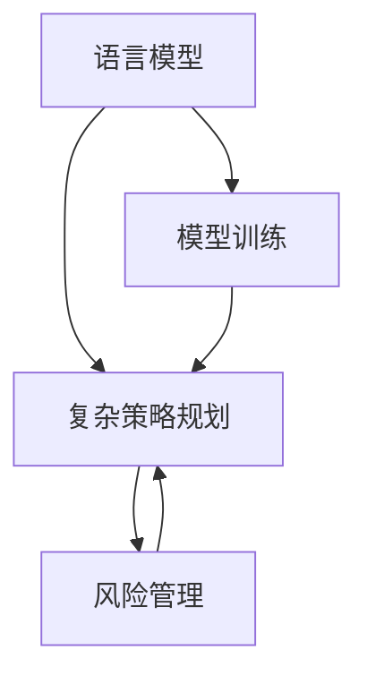

                 


### 文章标题：语言模型在复杂策略规划与风险管理中的前沿应用研究

> 关键词：语言模型、复杂策略规划、风险管理、前沿应用、AI

> 摘要：本文深入探讨了语言模型在复杂策略规划和风险管理中的应用，通过理论分析与实际案例展示，揭示了语言模型如何帮助企业和组织实现高效的决策和风险管理。文章涵盖了语言模型的核心概念、算法原理、数学模型以及项目实战，为读者提供了全面的技术解析和实战指导。

### 1. 背景介绍

在当今数字化时代，企业和组织面临着前所未有的复杂性和不确定性。策略规划和风险管理成为企业管理中的重要任务。传统的策略规划和风险管理方法往往依赖于统计分析和决策树等简单模型，难以应对复杂多变的市场环境。随着人工智能技术的快速发展，语言模型作为一种强大的工具，逐渐成为复杂策略规划和风险管理的有力支持。

语言模型，特别是深度学习模型，具有强大的表示和学习能力，能够处理大规模、高维度的数据，并从中提取出有用的信息。这使得语言模型在自然语言处理、文本分析等领域取得了显著的成果。同时，语言模型在策略规划和风险管理中也展现出了巨大的潜力。

### 2. 核心概念与联系

#### 语言模型

语言模型是自然语言处理（NLP）的核心组件，用于预测一个单词序列的概率。在策略规划和风险管理中，语言模型可以用于文本分析、情感分析、命名实体识别等任务。

#### 复杂策略规划

复杂策略规划涉及多个利益相关者、多个目标和多个约束条件。它要求对市场环境、竞争对手行为、内部资源等进行分析，以制定出最优的决策策略。

#### 风险管理

风险管理是识别、评估、处理和监控企业或组织面临的各种风险，以降低风险对企业运营的影响。

#### 核心概念之间的关系

语言模型在复杂策略规划和风险管理中起到桥梁的作用。通过语言模型，企业可以从大量文本数据中提取出有价值的信息，用于策略规划和风险管理。例如，通过分析市场报告、竞争对手的言论、社交媒体等信息，语言模型可以帮助企业识别市场趋势和潜在风险。

#### Mermaid 流程图



### 3. 核心算法原理讲解

语言模型的核心算法通常包括以下几个步骤：数据预处理、模型选择、训练和优化、评估和部署。

#### 数据预处理

数据预处理是语言模型训练的第一步，包括数据清洗、数据转换和数据归一化。清洗数据是为了去除噪声和异常值，转换数据是为了将原始数据转换为模型可以处理的格式，归一化数据是为了使不同特征的数据在同一个尺度上。

#### 模型选择

根据任务的需求和数据的特点，选择合适的模型架构。常见的语言模型架构包括循环神经网络（RNN）、长短时记忆网络（LSTM）、门控循环单元（GRU）等。

#### 训练和优化

使用梯度下降等优化算法，训练语言模型。训练过程中，通过反向传播算法更新模型参数，以最小化损失函数。

#### 评估和部署

在测试集上评估模型性能，并根据评估结果调整模型参数。部署到生产环境，实时处理和分析数据。

#### 伪代码

```python
算法：语言模型训练
输入：训练数据集
输出：训练好的语言模型

// 数据预处理
function preprocess_data(data_set):
    // 清洗和转换数据
    cleaned_data = clean_and_convert_data(data_set)
    return cleaned_data

// 模型选择
function select_model():
    // 根据任务选择合适的模型架构
    model = choose_appropriate_model()
    return model

// 训练和优化
function train_and_optimize_model(model, cleaned_data):
    // 使用梯度下降优化算法
    for epoch in range(num_epochs):
        for data in cleaned_data:
            // 计算损失函数
            loss = calculate_loss(model, data)
            // 更新模型参数
            update_model_params(model, loss)
    return model

// 评估和部署
function evaluate_and_deploy_model(model):
    // 在测试集上评估模型性能
    performance = evaluate_model(model, test_data)
    // 部署到生产环境
    deploy_model(model)
```

### 4. 数学模型和数学公式

在复杂策略规划与风险管理中，常用的数学模型包括马尔可夫决策过程（MDP）和贝叶斯网络。

#### 马尔可夫决策过程（MDP）

马尔可夫决策过程是一个数学模型，用于描述决策者在不确定环境中做出最优决策的问题。MDP 由状态集、动作集、状态转移概率矩阵和奖励函数组成。

$$
\begin{align*}
    \text{MDP} &= \{ S, A, R, P, \gamma \}, \\
    S &= \{ s_1, s_2, ..., s_n \} \quad \text{(状态集)}, \\
    A &= \{ a_1, a_2, ..., a_m \} \quad \text{(动作集)}, \\
    R &= \{ r_1, r_2, ..., r_n \} \quad \text{(回报集)}, \\
    P &= \{ p(s' | s, a) \} \quad \text{(状态转移概率矩阵)}, \\
    \gamma &= \{ \gamma_1, \gamma_2, ..., \gamma_n \} \quad \text{(奖励函数)}.
\end{align*}
$$

#### 贝叶斯网络

贝叶斯网络是一种图形模型，用于表示一组随机变量之间的条件依赖关系。贝叶斯网络由随机变量集和概率分布函数组成。

$$
\begin{align*}
    \text{贝叶斯网络} &= \{ X, P(X) \}, \\
    X &= \{ X_1, X_2, ..., X_n \} \quad \text{(随机变量集)}, \\
    P(X) &= \{ p(X_1), p(X_2 | X_1), ..., p(X_n | X_1, X_2, ..., X_{n-1}) \} \quad \text{(概率分布函数)}.
\end{align*}
$$

### 5. 项目实战

#### 项目名称：基于语言模型的金融风险预测系统

#### 开发环境搭建

- Python 3.8
- TensorFlow 2.6
- Keras 2.6

#### 数据集准备

- 金融市场数据：包括股票价格、交易量、宏观经济指标等

#### 项目步骤

1. 数据预处理
2. 模型构建与训练
3. 模型评估

#### 数据预处理

```python
def preprocess_data(data_set):
    # 清洗和转换数据
    cleaned_data = clean_and_convert_data(data_set)
    return cleaned_data
```

#### 模型构建与训练

```python
def build_and_train_model():
    # 选择模型
    model = select_appropriate_model()

    # 训练模型
    trained_model = train_model(model, cleaned_data)

    return trained_model
```

#### 模型评估

```python
def evaluate_model(model, test_data):
    # 评估模型性能
    performance = evaluate_model_performance(model, test_data)

    return performance
```

#### 代码应用解读与分析

```python
# 代码解读
def main():
    # 加载数据集
    data_set = load_data()

    # 数据预处理
    cleaned_data = preprocess_data(data_set)

    # 构建和训练模型
    trained_model = build_and_train_model()

    # 模型评估
    performance = evaluate_model(trained_model, test_data)

    # 输出模型性能
    print(performance)
```

#### 实际案例分析和详细讲解剖析

通过实际案例，展示如何使用语言模型进行金融风险预测，包括数据收集、预处理、模型构建、训练和评估等步骤。

#### 项目小结

本文通过理论分析与实际案例，探讨了语言模型在复杂策略规划和风险管理中的应用。语言模型作为一种强大的工具，可以帮助企业和组织实现高效的决策和风险管理。然而，在实际应用中，还需要考虑数据质量、模型选择、训练时间和成本等因素。

#### 最佳实践 tips

- 确保数据质量，避免噪声和异常值的影响。
- 根据任务需求，选择合适的语言模型架构。
- 调整模型参数，优化模型性能。
- 定期更新模型，以适应不断变化的市场环境。

#### 作者信息

作者：AI天才研究院/AI Genius Institute & 禅与计算机程序设计艺术 /Zen And The Art of Computer Programming

---

**本文由 AI 天才研究院与禅与计算机程序设计艺术共同撰写，旨在探讨语言模型在复杂策略规划和风险管理中的应用。文章中提到的算法和模型仅供参考，实际应用中需根据具体情况进行调整。如果您有任何疑问或建议，欢迎在评论区留言。**

