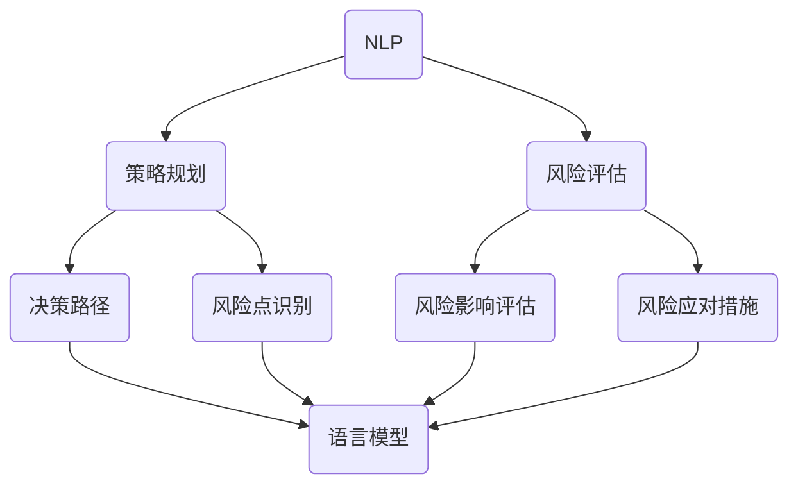

                 

### 引言

在现代信息技术迅猛发展的背景下，复杂策略规划和风险评估在众多领域，如金融、电商、交通管理等，发挥着至关重要的作用。策略规划是指通过制定一系列决策步骤，以达到特定目标的过程。而风险评估则是识别、分析和优先处理潜在风险，以减少负面影响的措施。随着问题规模的扩大和复杂性增加，传统的方法已无法满足实际需求，因此，如何更高效地进行策略规划和风险评估成为了亟待解决的问题。

近年来，语言模型（Language Model）作为人工智能领域的一项重要成果，凭借其强大的文本生成和处理能力，逐渐在多个领域展现出了巨大的应用潜力。语言模型能够通过学习大量文本数据，理解并生成符合语言习惯的文本，从而在自然语言处理（Natural Language Processing, NLP）领域中取得了显著的成果。然而，随着对语言模型研究的深入，人们发现其在复杂策略规划和风险评估中也具有广泛的应用前景。

本文旨在探讨语言模型在复杂策略规划与风险评估中的应用，通过逐步分析推理，详细阐述语言模型在策略规划和风险评估中的核心概念、技术原理、应用案例以及面临的挑战和未来发展方向。文章结构如下：

1. **语言模型基础**：介绍语言模型的核心概念、发展历程和技术原理。
2. **复杂策略规划**：讨论语言模型在策略规划中的应用，包括语言模型在决策支持、优化问题和博弈论中的应用。
3. **风险评估**：讲解语言模型在风险评估中的具体应用，如风险识别、风险分析和风险预警。
4. **应用案例**：分析语言模型在策略规划和风险评估中的实际应用案例。
5. **挑战与展望**：探讨语言模型在复杂策略规划和风险评估中面临的挑战及未来发展方向。

通过本文的探讨，我们希望为研究人员和实践者提供有价值的参考，推动语言模型在策略规划和风险评估领域的深入研究和应用。

### 关键词

- 语言模型
- 复杂策略规划
- 风险评估
- 人工智能
- 自然语言处理
- 决策支持
- 优化问题
- 博弈论
- 风险识别
- 风险分析

### 摘要

本文主要探讨了语言模型在复杂策略规划和风险评估中的应用。首先，介绍了语言模型的基本概念、发展历程和技术原理。接着，详细分析了语言模型在复杂策略规划中的应用，包括决策支持、优化问题和博弈论的实现。随后，阐述了语言模型在风险评估中的具体应用，如风险识别、风险分析和风险预警。通过实际案例的应用分析，进一步展示了语言模型在策略规划和风险评估中的有效性。最后，讨论了语言模型在此领域面临的挑战和未来发展方向，为研究人员和实践者提供了有益的参考。

### 语言模型基础

#### 语言模型的核心概念

语言模型（Language Model）是自然语言处理（Natural Language Processing, NLP）领域的一项基础性技术，它旨在通过概率模型或生成模型来预测下一个单词或字符的可能性。其核心目标是理解自然语言的统计特性，从而生成或理解人类语言的文本。

语言模型主要分为两类：统计语言模型和神经网络语言模型。统计语言模型基于大量文本数据，通过计算单词或短语的联合概率分布来预测下一个词。而神经网络语言模型，特别是深度学习模型，通过多层神经网络对文本数据进行建模，从而捕捉到更加复杂的语言结构。

语言模型的应用广泛，包括但不限于机器翻译、语音识别、文本摘要、问答系统、对话系统等。在这些应用中，语言模型能够显著提高系统的性能和用户体验。

#### 语言模型的发展历程

语言模型的发展可以追溯到20世纪50年代，当时的学者们开始尝试使用规则方法来模拟自然语言。这些早期的模型通常依赖于手工编写的语法规则和词典，但由于自然语言的复杂性和多样性，这些规则方法在实际应用中受到了很大的限制。

20世纪80年代，随着计算能力和数据集的扩展，统计语言模型开始崭露头角。N-gram模型是这一时期的代表性模型，它通过计算单词序列的联合概率分布来进行预测。N-gram模型简单有效，但在长文本生成和长距离依赖问题上表现不佳。

随着深度学习技术的发展，神经网络语言模型逐渐成为主流。2013年，由Jurafsky和Martin等人提出的神经网络语言模型（Neural Network Language Model, NNLM）在多项自然语言处理任务中取得了显著的成绩。NNLM通过多层感知器（Multilayer Perceptron, MLP）来建模文本数据，并能够捕捉到长距离依赖关系。

近年来，生成对抗网络（Generative Adversarial Networks, GAN）和变分自编码器（Variational Autoencoder, VAE）等新兴技术也被应用于语言模型，使得语言模型的生成能力和多样性得到了进一步提升。

#### 语言模型的技术原理

1. **统计语言模型**：
   - **N-gram模型**：N-gram模型通过计算连续N个单词的联合概率来预测下一个单词。例如，在二元语法模型（Bigram）中，下一个单词的概率依赖于前一个单词。N-gram模型的优点是实现简单，计算效率高，但它在长文本生成和长距离依赖问题上表现不佳。
   - **N-gram改进模型**：为了解决N-gram模型的局限性，研究者提出了多种改进方法，如肯德尔-泰勒平滑（Kendall-Taylor Smoothing）和凯普（Kaplan）平滑等。这些方法通过在概率计算中引入背景语言模型来提高模型的准确性。

2. **神经网络语言模型**：
   - **循环神经网络（Recurrent Neural Network, RNN）**：RNN是一种能够处理序列数据的神经网络，它通过隐藏状态的记忆功能来捕捉序列中的长期依赖关系。然而，RNN在训练过程中容易出现梯度消失和梯度爆炸的问题，导致训练效果不佳。
   - **长短时记忆网络（Long Short-Term Memory, LSTM）**：为了解决RNN的梯度消失问题，Hochreiter和Schmidhuber提出了LSTM。LSTM通过引入记忆单元和门控制机制，有效地捕捉了长距离依赖关系，并在多项NLP任务中取得了优异的成绩。
   - **门控循环单元（Gated Recurrent Unit, GRU）**：GRU是LSTM的一种变体，通过简化LSTM的结构，提高了计算效率。GRU同样能够有效捕捉长距离依赖关系，并且在很多任务中表现与LSTM相当。
   - **Transformer模型**：Transformer模型由Vaswani等人在2017年提出，它彻底改变了传统的序列处理方法。Transformer使用自注意力机制（Self-Attention）来捕捉序列中的依赖关系，通过多头注意力机制（Multi-Head Attention）提高了模型的表示能力。自注意力机制不需要循环结构，使得模型在计算效率和并行性方面得到了显著提升。

3. **生成对抗网络（GAN）和变分自编码器（VAE）**：
   - **生成对抗网络（GAN）**：GAN由生成器（Generator）和判别器（Discriminator）两部分组成。生成器生成与真实数据相似的样本，判别器则判断生成器生成的样本是否真实。通过两个网络的对抗训练，生成器逐渐生成更加逼真的数据。GAN在文本生成、图像生成等领域取得了显著成果。
   - **变分自编码器（VAE）**：VAE是一种基于概率模型的生成模型。它通过编码器（Encoder）将输入数据映射到潜在空间，通过解码器（Decoder）将潜在空间的数据映射回输入空间。VAE能够生成多样性的数据，并且在图像生成和文本生成中表现出色。

综上所述，语言模型的发展历程和技术原理展示了其在自然语言处理领域的广泛应用和强大能力。随着技术的不断进步，语言模型在复杂策略规划和风险评估中的应用潜力将进一步得到发挥。

#### 核心概念与联系

为了更好地理解语言模型在复杂策略规划和风险评估中的应用，我们需要明确几个核心概念，并分析它们之间的关系。

1. **自然语言处理（NLP）**：自然语言处理是人工智能的一个重要分支，旨在使计算机能够理解和处理人类语言。NLP的核心任务包括文本分类、信息提取、机器翻译、情感分析等。在策略规划和风险评估中，NLP技术可以帮助我们理解和分析大量的文本数据，从而提取出有价值的信息。

2. **策略规划**：策略规划是指制定一系列决策步骤，以实现特定目标的过程。在复杂策略规划中，决策往往需要在不确定的环境下进行，需要考虑多种可能的情况和风险。策略规划的目标是找到最优或次优的决策路径。

3. **风险评估**：风险评估是指识别、分析和处理潜在风险的过程。在策略规划中，风险评估是一个重要的环节，可以帮助我们识别可能的风险点，评估其影响和可能性，从而制定相应的风险应对措施。

4. **语言模型**：语言模型是一种用于预测文本数据概率分布的模型。在策略规划和风险评估中，语言模型可以通过分析大量的文本数据，帮助我们理解潜在的决策路径和风险情况。

核心概念之间的关系架构可以用以下Mermaid流程图表示：



通过这个流程图，我们可以看出NLP、策略规划、风险评估和语言模型之间的紧密联系。NLP为策略规划和风险评估提供了数据理解能力，策略规划和风险评估则依赖于语言模型来预测和识别决策路径和风险点。这种紧密的联系使得语言模型在复杂策略规划和风险评估中发挥了重要作用。

#### 核心算法原理讲解

在复杂策略规划和风险评估中，语言模型的实现主要依赖于自然语言处理（NLP）技术和深度学习算法。以下将详细讲解这些核心算法的原理，并使用伪代码来阐述其实现方法。

##### 1. 自然语言处理（NLP）技术

NLP技术是语言模型的基础，主要包括文本预处理、词嵌入和序列标注等步骤。

**文本预处理**：
- **分词**：将文本分割成单词或句子。
- **去除停用词**：去除对文本分析无意义的单词，如“的”、“了”等。
- **词干提取**：将单词还原到其基本形式，如“runs”还原为“run”。

```python
def preprocess_text(text):
    # 分词
    tokens = tokenize(text)
    # 去除停用词
    tokens = remove_stopwords(tokens)
    # 词干提取
    tokens = lemmatize(tokens)
    return tokens
```

**词嵌入**：
- **Word2Vec**：将单词映射到高维空间中的向量，通过神经网络训练得到。
- **BERT**：基于变换器（Transformer）模型的预训练语言表示模型。

```python
def word2vec(tokens):
    # 初始化Word2Vec模型
    model = Word2Vec(tokens, vector_size=100, window=5, min_count=1)
    # 获取单词向量
    word_vectors = model.wv
    return word_vectors

def bert_embeddings(tokens):
    # 加载预训练BERT模型
    model = BertModel.from_pretrained('bert-base-uncased')
    # 获取嵌入向量
    embeddings = model([tokenized_text])[0]
    return embeddings
```

**序列标注**：
- **标注**：将文本序列中的每个单词或字符标注为不同的标签。
- **CRF（条件随机场）**：利用条件随机场模型对序列标注进行建模。

```python
def sequence_labeling(text, model):
    # 分词
    tokens = tokenize(text)
    # 预测标签
    labels = model.predict(tokens)
    return labels
```

##### 2. 深度学习算法

深度学习算法在语言模型中起到了关键作用，主要包括循环神经网络（RNN）、长短时记忆网络（LSTM）和变换器（Transformer）等。

**循环神经网络（RNN）**：
- **基本结构**：RNN由一系列的神经元组成，每个神经元都保持一部分状态信息。
- **动态方程**：

```python
def rnn(input_sequence, hidden_state):
    # 初始化权重矩阵
    W_h = ...
    W_x = ...
    b = ...

    # RNN的动态方程
    for input in input_sequence:
        hidden_state = tanh(W_h * hidden_state + W_x * input + b)
    return hidden_state
```

**长短时记忆网络（LSTM）**：
- **基本结构**：LSTM通过引入记忆单元和门控制机制来捕捉长距离依赖关系。
- **动态方程**：

```python
def lstm(input_sequence, hidden_state, cell_state):
    # 初始化权重矩阵
    W_h = ...
    W_x = ...
    b_f = ...
    b_i = ...
    b_o = ...
    b_c = ...

    # LSTM的动态方程
    for input in input_sequence:
        i = sigmoid(W_h * hidden_state + W_x * input + b_i)
        f = sigmoid(W_h * hidden_state + W_x * input + b_f)
        o = sigmoid(W_h * hidden_state + W_x * input + b_o)
        c = f * cell_state + i * tanh(W_h * hidden_state + W_x * input + b_c)
        hidden_state = o * tanh(c)
    return hidden_state, cell_state
```

**变换器（Transformer）**：
- **基本结构**：Transformer由自注意力机制（Self-Attention）和前馈神经网络（Feedforward Network）组成。
- **自注意力机制**：

```python
def scaled_dot_product_attention(q, k, v, scale_factor):
    # 计算注意力权重
    attention_weights = softmax(q @ k.T / scale_factor)
    # 计算输出
    output = attention_weights @ v
    return output

def transformer(input_sequence, hidden_size, num_heads):
    # 自注意力层
    q, k, v = split_heads(input_sequence, num_heads)
    scaled_attention = scaled_dot_product_attention(q, k, v, scale_factor=hidden_size**0.5)
    combined_output = combine_heads(scaled_attention)
    
    # 前馈网络
    feedforward_output = feedforward_network(combined_output, hidden_size)
    
    return feedforward_output
```

通过上述核心算法的讲解和伪代码的实现，我们可以看到语言模型在复杂策略规划和风险评估中的技术原理。这些算法通过处理大量的文本数据，捕捉到语言中的复杂结构，为策略规划和风险评估提供了重要的基础。

#### 数学模型和公式讲解与举例说明

在复杂策略规划和风险评估中，语言模型的数学模型和公式起到了至关重要的作用。以下将详细讲解这些数学模型，并通过具体例子来说明其应用。

##### 1. 语言模型的概率分布

语言模型的核心目标是预测下一个单词或字符的概率分布。在统计语言模型中，这种预测基于N-gram模型。N-gram模型通过计算N个单词的联合概率分布来预测下一个单词。例如，对于二元语法模型（Bigram），下一个单词的概率可以表示为：

$$ P(w_t | w_{t-1}) = \frac{C(w_{t-1}, w_t)}{C(w_{t-1})} $$

其中，$P(w_t | w_{t-1})$ 表示在给定前一个单词 $w_{t-1}$ 下，下一个单词 $w_t$ 的概率；$C(w_{t-1}, w_t)$ 表示单词对 $(w_{t-1}, w_t)$ 的联合计数；$C(w_{t-1})$ 表示单词 $w_{t-1}$ 的计数。

例如，假设我们有一段文本 "the cat sat on the mat"，我们可以计算出以下概率：

$$ P(sat | the) = \frac{C(the, sat)}{C(the)} = \frac{1}{2} $$

这里，$C(the, sat) = 1$ 表示 "the" 和 "sat" 同时出现的次数为1，$C(the) = 2$ 表示 "the" 出现的次数为2。

##### 2. 语言模型的损失函数

在训练语言模型时，我们需要定义一个损失函数来衡量模型的预测误差。最常用的损失函数是交叉熵损失（Cross-Entropy Loss）：

$$ L = -\sum_{i} y_i \log(p_i) $$

其中，$y_i$ 是真实标签，$p_i$ 是模型预测的概率分布。交叉熵损失函数的值越小，表示模型的预测越准确。

例如，假设我们有一个单词序列 "the cat sat"，模型预测的概率分布为 $p_1 = 0.6, p_2 = 0.3, p_3 = 0.1$，而真实标签为 "the"、"cat"、"sat"。我们可以计算交叉熵损失：

$$ L = - (1 \cdot \log(0.6) + 1 \cdot \log(0.3) + 1 \cdot \log(0.1)) = - (\log(0.6) + \log(0.3) + \log(0.1)) $$

通过梯度下降（Gradient Descent）等方法，我们可以不断调整模型的参数，以最小化损失函数，从而提高模型的预测准确性。

##### 3. 语言模型的自注意力机制

在变换器（Transformer）模型中，自注意力机制（Self-Attention）是核心组成部分。自注意力通过计算序列中每个单词的相互依赖关系，从而提高模型的表示能力。自注意力机制可以表示为：

$$ \text{Attention}(Q, K, V) = \text{softmax}\left(\frac{QK^T}{\sqrt{d_k}}\right)V $$

其中，$Q$ 是查询向量，$K$ 是关键向量，$V$ 是值向量；$d_k$ 是关键向量的维度。自注意力机制的目的是计算每个查询向量与所有关键向量之间的相似度，然后对这些相似度进行加权求和，以生成最终的输出向量。

例如，假设我们有一个单词序列 "the cat sat"，其对应的查询向量、关键向量和值向量分别为 $Q = [q_1, q_2, q_3]$，$K = [k_1, k_2, k_3]$，$V = [v_1, v_2, v_3]$。我们可以计算自注意力：

$$ \text{Attention}(Q, K, V) = \text{softmax}\left(\frac{[q_1, q_2, q_3] @ [k_1, k_2, k_3]^T}{\sqrt{3}}\right) @ [v_1, v_2, v_3] $$

$$ = \text{softmax}\left(\frac{[q_1k_1 + q_2k_2 + q_3k_3]}{\sqrt{3}}\right) @ [v_1, v_2, v_3] $$

通过自注意力机制，模型可以更好地捕捉到单词之间的依赖关系，从而提高预测准确性。

##### 4. 语言模型的变分自编码器（VAE）

在生成对抗网络（GAN）中，变分自编码器（VAE）是一种重要的生成模型。VAE通过编码器（Encoder）和解码器（Decoder）两部分，将输入数据映射到潜在空间，并从潜在空间生成新的数据。VAE的数学模型可以表示为：

$$ \text{Encoder}: z = \mu(x) + \sigma(x) \odot \epsilon $$

$$ \text{Decoder}: x' = \phi(z) $$

其中，$\mu(x)$ 和 $\sigma(x)$ 分别是编码器的均值函数和方差函数，$\epsilon$ 是噪声向量，$\phi(z)$ 和 $\mu(z)$ 分别是解码器的隐变量和输出变量。

例如，假设我们有一个输入向量 $x$，编码器的均值函数和方差函数分别为 $\mu(x) = \frac{x}{2}$ 和 $\sigma(x) = \frac{x}{2}$，噪声向量 $\epsilon$ 服从标准正态分布。我们可以计算编码器的输出：

$$ z = \mu(x) + \sigma(x) \odot \epsilon = \frac{x}{2} + \frac{x}{2} \odot \epsilon $$

其中，$\epsilon \sim \mathcal{N}(0, I)$。

然后，我们可以通过解码器将 $z$ 映射回输入空间：

$$ x' = \phi(z) = z = \frac{x}{2} + \frac{x}{2} \odot \epsilon $$

通过这种方式，VAE可以生成与输入数据相似的新数据，从而提高模型的生成能力。

综上所述，语言模型的数学模型和公式在复杂策略规划和风险评估中起到了关键作用。通过这些数学模型和公式，我们可以更好地理解和应用语言模型，以提高策略规划和风险评估的准确性。

### 复杂策略规划

#### 复杂策略规划的概念

复杂策略规划是指在一个不确定和动态的环境中，通过制定一系列决策步骤，以实现特定目标的过程。与传统的策略规划相比，复杂策略规划面临的问题更加复杂，需要考虑多个变量和不确定性因素。这些变量和因素可能包括市场变化、技术进步、政策调整等。因此，复杂策略规划不仅需要考虑短期目标，还需要关注长期发展。

在复杂策略规划中，决策者需要面对多个可能的结果和风险。因此，如何制定一个有效的策略，以最大限度地减少风险并实现目标，是一个重要的研究课题。语言模型在此过程中发挥着关键作用，能够帮助决策者更好地理解和分析复杂环境中的变量和关系。

#### 语言模型在策略规划中的应用

语言模型在复杂策略规划中的应用主要体现在以下三个方面：决策支持、优化问题和博弈论。

1. **决策支持**：
   语言模型可以通过分析大量的文本数据，提取出关键信息和知识，为决策者提供有针对性的建议。例如，在金融领域，语言模型可以分析市场报告、新闻报道、分析师报告等文本数据，预测市场走势，帮助投资者做出更明智的投资决策。

   **实例**：假设某金融公司希望了解某个行业的未来发展状况，可以通过语言模型分析近期的新闻报道、市场报告和分析师报告。语言模型可以提取出这些文本中的关键信息，如行业趋势、政策变化、技术创新等，从而为公司的战略决策提供支持。

2. **优化问题**：
   语言模型可以用于解决复杂优化问题，如供应链管理、资源分配和调度问题等。通过建模和优化算法，语言模型可以帮助决策者找到最优的解决方案。

   **实例**：在供应链管理中，企业需要合理安排生产和运输计划，以最大化利润并最小化成本。语言模型可以分析市场需求、生产能力和运输成本等数据，构建优化模型，找到最优的生产和运输方案。

3. **博弈论**：
   语言模型在博弈论中也有广泛的应用，可以帮助决策者在不确定和竞争环境中制定最优策略。博弈论中的策略规划通常涉及到多个参与者，每个参与者都需要考虑其他参与者的策略和行为。

   **实例**：在市场竞争中，企业需要制定定价策略和营销策略，以最大化市场份额和利润。语言模型可以通过分析竞争对手的公告、广告和市场行为，预测竞争对手的下一步动作，从而制定出最优的应对策略。

#### 复杂策略规划的案例分析

以下是一个复杂策略规划的具体案例，展示如何使用语言模型进行策略规划和决策支持。

**案例背景**：某电子商务公司希望在即将到来的购物季中，通过优化营销策略来提升销售额。

**步骤 1：数据收集**：
收集与购物季相关的文本数据，包括市场报告、竞争对手的公告、消费者评论和社交媒体讨论等。这些数据有助于了解市场趋势和消费者需求。

**步骤 2：文本预处理**：
使用语言模型对收集到的文本数据进行预处理，包括分词、去除停用词和词干提取等。这一步骤有助于提取出关键信息，为后续分析做准备。

**步骤 3：信息提取**：
使用语言模型提取文本数据中的关键信息，如热门产品、消费者需求、竞争对手策略等。这些信息有助于制定针对性的营销策略。

**步骤 4：构建优化模型**：
根据提取的信息，构建一个优化模型，以最大化销售额为目标。模型可能涉及多个变量，如广告投入、促销活动、库存管理等。

**步骤 5：策略生成**：
使用语言模型生成一系列可能的营销策略，并评估每个策略的预期效果。通过对比不同策略的预期效果，选择最优的营销策略。

**步骤 6：决策支持**：
将生成的最优策略推荐给决策者，并监控其实施效果。如果策略效果不佳，可以进一步调整模型和策略。

**步骤 7：持续优化**：
根据实际情况和市场变化，不断调整和优化策略。语言模型可以实时分析新数据，为决策者提供持续的决策支持。

通过这个案例，我们可以看到语言模型在复杂策略规划中的应用过程。从数据收集、文本预处理到信息提取、优化模型构建，再到策略生成和决策支持，语言模型在每个环节都发挥了重要作用，帮助决策者制定出最优的营销策略，从而提升企业的竞争力。

### 风险评估

#### 风险评估的核心概念

风险评估（Risk Assessment）是指识别、分析和处理潜在风险的过程，旨在通过系统化的方法，评估和降低风险带来的负面影响。风险评估的核心概念包括风险识别、风险分析和风险处理。

1. **风险识别**：风险识别是指发现和确定可能影响项目、组织或系统的潜在风险。这一过程通常需要收集和分析各种信息，包括历史数据、专家意见和情景分析等。

2. **风险分析**：风险分析是指对已识别的风险进行定性或定量评估，以确定其发生概率和潜在影响。风险分析可以帮助决策者了解风险的大小和严重性，为制定风险应对策略提供依据。

3. **风险处理**：风险处理是指采取一系列措施来减少或消除风险的影响。风险处理措施可以包括风险规避、风险转移、风险减轻和风险接受等。

在复杂策略规划中，风险评估是一个重要的环节，它可以帮助决策者了解潜在风险，从而制定出更加稳健和有效的策略。语言模型在风险评估中的应用，使得这一过程变得更加高效和精确。

#### 语言模型在风险评估中的应用

语言模型在风险评估中的应用主要体现在以下几个方面：风险识别、风险分析和风险预警。

1. **风险识别**：
   语言模型可以分析大量的文本数据，如历史报告、专家意见和市场新闻等，从中提取出潜在的风险信号。通过自然语言处理技术，语言模型可以识别出文本中的关键词和主题，从而发现潜在的风险。

   **实例**：假设某金融机构需要识别市场风险。通过语言模型分析近期的市场报告、新闻和分析师报告，语言模型可以提取出与市场波动、政策变化和全球经济形势相关的关键词，从而识别出潜在的市场风险。

2. **风险分析**：
   语言模型可以用于对已识别的风险进行定量分析，评估其发生的概率和潜在影响。通过概率模型和统计方法，语言模型可以对风险进行量化评估，从而帮助决策者制定出相应的风险应对策略。

   **实例**：在金融领域，语言模型可以分析历史数据和市场趋势，预测某一风险事件的发生概率和可能的影响。例如，通过分析历史市场波动数据，语言模型可以预测某一金融产品在未来某个时间点的价格波动情况，从而评估其风险水平。

3. **风险预警**：
   语言模型可以实时监测文本数据，如新闻报道、社交媒体讨论和市场动态，及时发现潜在的风险信号。通过建立预警模型，语言模型可以在风险事件发生之前发出预警，帮助决策者及时采取措施。

   **实例**：在公共卫生领域，语言模型可以实时分析新闻报道和社交媒体讨论，识别出与疫情相关的关键词和主题。当检测到某一地区疫情显著增加时，语言模型可以及时发出预警，提醒相关机构和公众采取预防措施。

#### 风险评估的案例分析

以下是一个风险评估的具体案例，展示如何使用语言模型进行风险识别、风险分析和风险预警。

**案例背景**：某电商平台希望在即将到来的购物季中，通过分析市场数据和消费者反馈，识别和应对潜在风险。

**步骤 1：数据收集**：
收集与购物季相关的数据，包括市场报告、竞争对手的公告、消费者评论和社交媒体讨论等。这些数据有助于了解市场趋势和消费者需求。

**步骤 2：文本预处理**：
使用语言模型对收集到的文本数据进行预处理，包括分词、去除停用词和词干提取等。这一步骤有助于提取出关键信息，为后续分析做准备。

**步骤 3：风险识别**：
通过语言模型分析文本数据，提取出与潜在风险相关的关键词和主题。例如，通过分析消费者评论，语言模型可以识别出消费者对某些商品或服务的投诉和不满，从而发现潜在的质量风险。

**步骤 4：风险分析**：
使用语言模型对已识别的风险进行定量分析，评估其发生的概率和潜在影响。例如，通过分析历史销售数据和消费者反馈，语言模型可以预测某一时间段内的退货率，从而评估其风险水平。

**步骤 5：风险预警**：
建立风险预警模型，实时监测文本数据，及时发现潜在的风险信号。例如，通过实时分析社交媒体讨论，语言模型可以识别出与消费者投诉相关的关键词，从而发出预警，提醒相关团队及时采取措施。

**步骤 6：决策支持**：
将识别和评估的结果推荐给决策者，为其提供风险应对策略。例如，根据风险分析结果，决策者可以调整库存策略、优化售后服务或增加营销投入，以降低风险带来的负面影响。

**步骤 7：持续优化**：
根据实际情况和市场变化，不断调整和优化风险模型和预警系统。通过持续分析新数据，语言模型可以不断提高风险评估的准确性和实时性。

通过这个案例，我们可以看到语言模型在风险评估中的具体应用过程。从数据收集、文本预处理到风险识别、风险分析和风险预警，语言模型在每个环节都发挥了重要作用，帮助决策者及时识别和应对潜在风险，从而提高企业的运营效率和竞争力。

### 应用案例

#### 电商策略规划与风险评估

在电子商务领域，语言模型被广泛应用于策略规划和风险评估，以提高销售业绩和降低运营风险。以下将详细介绍一个电商平台的案例，展示如何使用语言模型进行策略规划和风险评估。

**案例背景**：某电商平台希望在其即将到来的购物季中，通过优化营销策略和库存管理，提升销售额并降低运营风险。

**步骤 1：数据收集**  
收集与购物季相关的数据，包括市场报告、竞争对手的公告、消费者评论、社交媒体讨论等。这些数据有助于了解市场趋势和消费者需求。

**步骤 2：文本预处理**  
使用语言模型对收集到的文本数据进行预处理，包括分词、去除停用词和词干提取等。这一步骤有助于提取出关键信息，为后续分析做准备。

**步骤 3：策略规划**  
利用语言模型分析文本数据，提取出与消费者需求相关的关键词和主题。例如，通过分析消费者评论，语言模型可以识别出消费者对某些商品或服务的需求，从而为电商平台制定针对性的营销策略。

**实例**：通过分析消费者评论，语言模型识别出消费者对新款智能手机的需求较高。基于这一发现，电商平台可以增加新款智能手机的库存，并制定相关的促销活动，以提高销售额。

**步骤 4：风险评估**  
使用语言模型对已识别的风险进行定量分析，评估其发生的概率和潜在影响。例如，通过分析历史销售数据和消费者反馈，语言模型可以预测某一时间段内的退货率，从而评估其风险水平。

**实例**：通过分析历史数据，语言模型预测某款商品在未来一个月内的退货率可能较高。基于这一预测，电商平台可以提前采取措施，如增加售后服务人员，以降低退货风险。

**步骤 5：决策支持**  
将策略规划和风险评估的结果推荐给决策者，为其提供决策支持。例如，根据风险分析结果，决策者可以调整库存策略、优化售后服务或增加营销投入，以降低风险带来的负面影响。

**实例**：根据风险评估结果，决策者决定增加某款商品的库存，并加大售后服务投入，以降低退货风险。同时，电商平台还可以根据消费者需求，制定相关的促销活动，以提高销售额。

**步骤 6：实施与监控**  
实施制定的策略，并监控其实施效果。通过实时分析消费者反馈和市场动态，及时调整策略，以提高运营效率和竞争力。

**实例**：电商平台在购物季期间，通过实时分析消费者反馈和市场动态，及时调整营销策略和库存管理，从而提高销售额并降低运营风险。

**步骤 7：持续优化**  
根据实际情况和市场变化，不断调整和优化策略和风险评估模型。通过持续分析新数据，语言模型可以不断提高策略规划和风险评估的准确性和实时性。

**总结**：通过该案例，我们可以看到语言模型在电商策略规划和风险评估中的应用过程。从数据收集、文本预处理到策略规划和风险评估，语言模型在每个环节都发挥了重要作用，帮助电商平台制定出更有效的营销策略，降低运营风险，从而提高整体竞争力。

#### 金融领域策略规划与风险评估

在金融领域，语言模型的应用同样广泛，特别是在策略规划和风险评估方面。以下将详细介绍一个金融公司的案例，展示如何使用语言模型进行策略规划和风险评估，以提高投资效率和降低风险。

**案例背景**：某金融公司希望在其投资组合中，通过优化投资策略和风险管理，提高收益并降低投资风险。

**步骤 1：数据收集**  
收集与金融市场相关的数据，包括股票价格、市场新闻、公司财报、分析师报告等。这些数据有助于了解市场趋势和公司业绩。

**步骤 2：文本预处理**  
使用语言模型对收集到的文本数据进行预处理，包括分词、去除停用词和词干提取等。这一步骤有助于提取出关键信息，为后续分析做准备。

**步骤 3：策略规划**  
利用语言模型分析文本数据，提取出与投资决策相关的关键词和主题。例如，通过分析市场新闻和分析师报告，语言模型可以识别出市场热点和潜在的投资机会。

**实例**：通过分析市场新闻，语言模型识别出某新兴行业具有巨大的投资潜力。基于这一发现，金融公司可以调整其投资组合，增加对该行业的投资。

**步骤 4：风险评估**  
使用语言模型对已识别的投资机会进行定量分析，评估其潜在风险。例如，通过分析公司财报和市场数据，语言模型可以预测某公司的未来业绩和股价波动。

**实例**：通过分析公司财报，语言模型预测某公司未来的业绩增长将放缓。基于这一预测，金融公司可以降低对该公司的投资，以降低风险。

**步骤 5：决策支持**  
将策略规划和风险评估的结果推荐给决策者，为其提供决策支持。例如，根据风险分析结果，决策者可以调整投资组合，优化投资策略。

**实例**：根据风险评估结果，决策者决定降低对某行业的投资，同时增加对其他高增长行业的投资，以降低整体风险。

**步骤 6：实施与监控**  
实施制定的策略，并监控其实施效果。通过实时分析市场动态和公司业绩，及时调整策略，以提高投资效率。

**实例**：金融公司在投资组合调整后，通过实时监控市场动态和公司业绩，及时调整投资策略，以应对市场变化。

**步骤 7：持续优化**  
根据实际情况和市场变化，不断调整和优化策略和风险评估模型。通过持续分析新数据，语言模型可以不断提高策略规划和风险评估的准确性和实时性。

**总结**：通过该案例，我们可以看到语言模型在金融领域策略规划和风险评估中的应用过程。从数据收集、文本预处理到策略规划和风险评估，语言模型在每个环节都发挥了重要作用，帮助金融公司制定出更有效的投资策略，降低投资风险，从而提高整体收益。

#### 其他应用领域案例分析

除了电商和金融领域，语言模型在策略规划和风险评估中的应用还扩展到了其他多个领域，包括医疗、交通、环境等。以下将介绍几个典型的应用案例，展示语言模型在这些领域的具体应用和成效。

**1. 医疗领域**

**案例背景**：某医疗公司希望优化药品研发策略，提高新药的成功率并降低研发风险。

**步骤 1：数据收集**  
收集与药品研发相关的数据，包括临床试验报告、科研文献、市场分析报告等。这些数据有助于了解新药研发的趋势和潜在风险。

**步骤 2：文本预处理**  
使用语言模型对收集到的文本数据进行预处理，包括分词、去除停用词和词干提取等。这一步骤有助于提取出关键信息，为后续分析做准备。

**步骤 3：策略规划**  
利用语言模型分析文本数据，提取出与药品研发相关的关键词和主题。例如，通过分析科研文献，语言模型可以识别出潜在的有效成分和新药靶点。

**实例**：通过分析科研文献，语言模型识别出某新药靶点具有很高的治疗潜力。基于这一发现，医疗公司可以调整其研发方向，集中资源攻关该靶点。

**步骤 4：风险评估**  
使用语言模型对已识别的新药靶点进行定量分析，评估其潜在风险。例如，通过分析临床试验数据和文献，语言模型可以预测新药的临床效果和安全性。

**实例**：通过分析临床试验数据，语言模型预测某新药在临床试验中的成功率较高，但存在一定的副作用风险。基于这一预测，医疗公司可以制定相应的风险管理策略，如加强临床试验监控和患者教育。

**步骤 5：决策支持**  
将策略规划和风险评估的结果推荐给决策者，为其提供决策支持。例如，根据风险评估结果，决策者可以调整研发预算和项目优先级，优化新药研发策略。

**实例**：根据风险评估结果，决策者决定增加对某新药项目的投资，并制定详细的临床试验计划，以确保新药的成功上市。

**步骤 6：实施与监控**  
实施制定的策略，并监控其实施效果。通过实时分析临床试验数据和市场需求，及时调整策略，以提高新药研发的成功率和市场竞争力。

**实例**：医疗公司在新药研发过程中，通过实时监控临床试验数据和市场需求，及时调整研发策略，从而提高了新药的成功率。

**步骤 7：持续优化**  
根据实际情况和市场变化，不断调整和优化策略和风险评估模型。通过持续分析新数据，语言模型可以不断提高策略规划和风险评估的准确性和实时性。

**总结**：在医疗领域，语言模型的应用显著提高了药品研发的策略规划和风险评估效率，帮助医疗公司优化研发方向，降低风险，提高新药的成功率。

**2. 交通领域**

**案例背景**：某城市交通管理部门希望优化交通管理策略，提高交通效率并降低交通事故风险。

**步骤 1：数据收集**  
收集与交通相关的数据，包括交通流量、交通事故报告、交通信号灯设置等。这些数据有助于了解城市交通的现状和潜在问题。

**步骤 2：文本预处理**  
使用语言模型对收集到的文本数据进行预处理，包括分词、去除停用词和词干提取等。这一步骤有助于提取出关键信息，为后续分析做准备。

**步骤 3：策略规划**  
利用语言模型分析文本数据，提取出与交通管理相关的关键词和主题。例如，通过分析交通事故报告，语言模型可以识别出交通事故的高发区域和时间。

**实例**：通过分析交通事故报告，语言模型识别出某路段在下午高峰期交通事故频发。基于这一发现，交通管理部门可以调整该路段的交通信号灯设置，以降低交通事故风险。

**步骤 4：风险评估**  
使用语言模型对已识别的交通问题进行定量分析，评估其潜在风险。例如，通过分析交通流量数据，语言模型可以预测交通拥堵的发生概率和影响范围。

**实例**：通过分析交通流量数据，语言模型预测某路段在未来一个月内可能出现严重的交通拥堵。基于这一预测，交通管理部门可以提前采取措施，如增加交通警力或调整交通信号灯设置，以缓解拥堵。

**步骤 5：决策支持**  
将策略规划和风险评估的结果推荐给决策者，为其提供决策支持。例如，根据风险评估结果，决策者可以调整交通信号灯设置或优化交通管理方案，以提高交通效率。

**实例**：根据风险评估结果，决策者决定在某路段实施交通信号灯定时优化方案，并在高峰期增加交通警力，以降低交通事故风险。

**步骤 6：实施与监控**  
实施制定的策略，并监控其实施效果。通过实时分析交通流量和交通事故数据，及时调整策略，以提高交通管理效果。

**实例**：交通管理部门在实施新策略后，通过实时监控交通流量和交通事故数据，发现交通状况显著改善，交通事故数量显著减少。

**步骤 7：持续优化**  
根据实际情况和市场变化，不断调整和优化策略和风险评估模型。通过持续分析新数据，语言模型可以不断提高策略规划和风险评估的准确性和实时性。

**总结**：在交通领域，语言模型的应用有效提高了交通管理策略规划和风险评估的效率和准确性，帮助城市交通管理部门优化交通管理方案，提高交通效率，降低交通事故风险。

**3. 环境领域**

**案例背景**：某环境保护部门希望优化环境治理策略，提高治理效果并降低环境风险。

**步骤 1：数据收集**  
收集与环境保护相关的数据，包括空气和水质监测报告、环保法规、环保项目评估报告等。这些数据有助于了解环境状况和治理需求。

**步骤 2：文本预处理**  
使用语言模型对收集到的文本数据进行预处理，包括分词、去除停用词和词干提取等。这一步骤有助于提取出关键信息，为后续分析做准备。

**步骤 3：策略规划**  
利用语言模型分析文本数据，提取出与环保治理相关的关键词和主题。例如，通过分析环保法规，语言模型可以识别出需要重点治理的环境问题。

**实例**：通过分析环保法规，语言模型识别出某地区的空气污染问题需要重点关注。基于这一发现，环境保护部门可以调整治理策略，集中资源解决该问题。

**步骤 4：风险评估**  
使用语言模型对已识别的环境问题进行定量分析，评估其潜在风险。例如，通过分析空气和水质监测数据，语言模型可以预测环境污染的扩散趋势和影响范围。

**实例**：通过分析空气和水质监测数据，语言模型预测某地区空气污染将加剧，可能导致健康问题。基于这一预测，环境保护部门可以提前采取治理措施，如增加环保设备或限制排放。

**步骤 5：决策支持**  
将策略规划和风险评估的结果推荐给决策者，为其提供决策支持。例如，根据风险评估结果，决策者可以调整环保治理预算和项目优先级，优化环境治理策略。

**实例**：根据风险评估结果，决策者决定增加对空气污染治理项目的投资，并制定详细的治理计划，以确保治理效果。

**步骤 6：实施与监控**  
实施制定的策略，并监控其实施效果。通过实时分析环境监测数据，及时调整策略，以提高环境治理效果。

**实例**：环境保护部门在实施新策略后，通过实时监控环境监测数据，发现空气质量显著改善，空气污染问题得到了有效控制。

**步骤 7：持续优化**  
根据实际情况和市场变化，不断调整和优化策略和风险评估模型。通过持续分析新数据，语言模型可以不断提高策略规划和风险评估的准确性和实时性。

**总结**：在环境领域，语言模型的应用有效提高了环境治理策略规划和风险评估的效率和准确性，帮助环境保护部门优化治理方案，提高治理效果，降低环境风险。

通过这些案例，我们可以看到语言模型在电商、金融、医疗、交通和环境等领域的广泛应用。无论是策略规划还是风险评估，语言模型都能够通过分析大量文本数据，提供有针对性的建议和解决方案，从而提高决策的准确性和效率。

### 挑战与展望

#### 面临的挑战

尽管语言模型在复杂策略规划和风险评估中展现出了巨大的潜力，但其应用仍然面临着诸多挑战。

1. **数据质量和数量**：语言模型依赖于大量的高质量数据，但获取这些数据往往具有挑战性。数据质量直接影响模型的性能，因此需要确保数据的一致性、准确性和多样性。

2. **计算资源需求**：深度学习模型，尤其是大规模的变换器模型，对计算资源有着极高的要求。训练和部署这些模型需要大量的计算资源和时间，这在实际应用中可能成为瓶颈。

3. **解释性**：许多深度学习模型，尤其是黑箱模型，其决策过程难以解释。在策略规划和风险评估中，决策者需要理解模型的决策依据，因此如何提高模型的解释性成为一个关键问题。

4. **实时性**：在动态环境中，快速做出决策至关重要。然而，训练深度学习模型通常需要较长的处理时间，这使得模型在实时应用中面临挑战。

5. **跨领域适应性**：不同的领域具有不同的特征和需求，使得模型在不同领域中的应用效果存在差异。如何提高语言模型在不同领域的跨领域适应性，是一个重要的问题。

#### 发展趋势

1. **数据增强与生成**：为了解决数据质量和数量的问题，研究人员正在探索数据增强和生成技术，如生成对抗网络（GAN）和变分自编码器（VAE），以生成更多高质量的训练数据。

2. **模型压缩与加速**：为了满足实时性的需求，研究人员正在致力于开发模型压缩和加速技术，如量化、剪枝和模型蒸馏等，以降低模型的计算复杂度和部署成本。

3. **模型可解释性**：提高模型的可解释性，使得决策过程更加透明和可追溯，是未来研究的一个重要方向。目前，一些方法如可解释性变换器（Explainable Transformer）和注意力图（Attention Map）正在逐步应用。

4. **多模态学习**：随着多模态数据的增多，如何将不同类型的数据（如文本、图像、音频）进行整合，以提升模型的泛化能力和决策准确性，是一个值得关注的领域。

5. **跨领域迁移学习**：通过跨领域迁移学习，将在一个领域训练好的模型应用到另一个领域，以提高模型在不同领域的适应性。研究人员正在探索如何构建通用的预训练模型，以实现跨领域的迁移效果。

#### 未来发展方向

1. **融合多源数据**：将结构化和非结构化数据（如文本、图像、传感器数据）进行整合，构建更加丰富和准确的模型，以提高策略规划和风险评估的准确性。

2. **实时决策系统**：通过改进模型的训练和推理速度，开发出实时决策系统，以满足动态环境下的快速决策需求。

3. **行业特定模型**：针对不同行业的特定需求，开发定制化的语言模型，以提高模型在特定领域的应用效果。

4. **人机协作**：结合人工智能和人类专家的知识，实现人机协作，提高策略规划和风险评估的决策质量。

通过不断解决面临的挑战和抓住发展趋势，语言模型在复杂策略规划和风险评估中的应用将得到进一步的发展，为各领域的决策提供更加精准和有效的支持。

### 结论

本文通过深入探讨语言模型在复杂策略规划和风险评估中的应用，详细分析了语言模型的基础概念、技术原理、应用案例以及面临的挑战和未来发展方向。我们首先介绍了语言模型的核心概念，包括自然语言处理（NLP）的基础和语言模型的发展历程。接着，我们详细讲解了语言模型的技术原理，涵盖了统计语言模型、神经网络语言模型以及生成对抗网络（GAN）和变分自编码器（VAE）等先进技术。

在复杂策略规划方面，我们探讨了语言模型在决策支持、优化问题和博弈论中的应用。通过具体案例，我们展示了如何利用语言模型制定有效的策略，从而在电子商务和金融领域实现更高的运营效率和投资收益。在风险评估方面，我们介绍了语言模型在风险识别、风险分析和风险预警中的应用，并提供了医疗、交通和环境领域的具体案例分析。

尽管语言模型在复杂策略规划和风险评估中展示了巨大的潜力，但其应用仍然面临数据质量、计算资源需求、模型解释性、实时性和跨领域适应性等挑战。未来，随着数据增强与生成、模型压缩与加速、模型可解释性、多模态学习和跨领域迁移学习等技术的发展，语言模型在策略规划和风险评估中的应用将更加广泛和深入。

总之，语言模型作为一种强大的工具，正在逐步改变复杂策略规划和风险评估的传统方法，提供更加精确和高效的决策支持。我们期待研究人员和从业者能够进一步探索语言模型在此领域的应用，推动人工智能技术的不断进步，为各个行业带来更多的创新和突破。

### 最佳实践 Tips

为了确保语言模型在复杂策略规划和风险评估中发挥最佳效果，以下是一些最佳实践建议：

1. **数据质量**：确保输入数据的质量和多样性。高质量的数据是模型准确性的基础。通过数据清洗、去重和归一化处理，提高数据的可靠性和一致性。

2. **模型选择**：根据具体应用场景选择合适的模型。例如，在处理短文本时，可以使用基于循环神经网络（RNN）或变换器（Transformer）的模型；而在处理长文本时，使用生成对抗网络（GAN）或变分自编码器（VAE）可能更为合适。

3. **模型调优**：通过调整模型的超参数，如学习率、批次大小和正则化项，优化模型性能。可以使用自动化调优工具，如贝叶斯优化或随机搜索，提高调优效率。

4. **多模态融合**：结合不同类型的数据（如文本、图像、音频），构建多模态模型，以提高模型的泛化能力和决策准确性。

5. **模型解释性**：增加模型的可解释性，帮助决策者理解模型的决策过程。可以使用注意力机制可视化或生成解释性报告，提高模型的透明度和可信度。

6. **实时性优化**：通过模型压缩和加速技术，如量化、剪枝和模型蒸馏，减少模型的计算复杂度和推理时间，提高实时性。

7. **持续学习**：定期更新模型，使其适应新的数据和需求。通过持续学习，保持模型的准确性和适应性。

通过遵循这些最佳实践，研究人员和实践者可以更好地利用语言模型在复杂策略规划和风险评估中的应用，实现更高效、更准确的决策。

### 小结

本文通过详细探讨语言模型在复杂策略规划和风险评估中的应用，展示了语言模型在多个领域的强大能力。我们首先介绍了语言模型的基础概念、发展历程和技术原理，并分析了其核心概念之间的联系。接着，我们详细阐述了语言模型在复杂策略规划中的应用，包括决策支持、优化问题和博弈论。在风险评估方面，我们讲解了语言模型在风险识别、风险分析和风险预警中的应用，并提供了多个实际案例。最后，我们探讨了语言模型在复杂策略规划和风险评估中面临的挑战及其未来发展方向。

通过本文的研究，我们可以得出以下结论：语言模型作为一种强大的工具，在复杂策略规划和风险评估中具有广泛的应用前景。其强大的文本生成和处理能力，使得决策者能够更好地理解和应对复杂环境中的变量和风险。然而，语言模型的应用也面临着数据质量、计算资源需求、模型解释性、实时性和跨领域适应性等挑战。未来，通过不断解决这些挑战，语言模型在策略规划和风险评估中的应用将得到进一步的发展，为各领域的决策提供更加精准和有效的支持。

### 注意事项

在应用语言模型进行复杂策略规划和风险评估时，以下注意事项将有助于提高决策的准确性和有效性：

1. **数据隐私**：在使用文本数据时，需确保遵守数据隐私保护法规，避免泄露敏感信息。对于涉及个人隐私的数据，应进行脱敏处理。

2. **模型偏见**：确保模型训练数据具有多样性和代表性，以避免模型产生偏见。在模型开发和部署过程中，应定期进行偏见检测和纠正。

3. **模型验证**：在部署模型之前，应进行充分的验证，确保模型在不同数据集上的性能稳定。可以通过交叉验证和A/B测试等方法，评估模型的泛化能力。

4. **模型更新**：定期更新模型，以适应新的数据和需求。通过持续学习，保持模型的准确性和适应性。

5. **合规性**：确保模型应用符合行业标准和法规要求，特别是在金融、医疗等敏感领域。

6. **模型解释性**：提高模型的可解释性，确保决策过程透明和可追溯。这对于增强决策者的信任和模型的接受度至关重要。

通过遵循这些注意事项，可以确保语言模型在复杂策略规划和风险评估中的应用更加可靠和有效。

### 拓展阅读

1. **经典论文**：
   - "A Neural Probabilistic Language Model" by Tomas Mikolov, Kai Chen, Greg Corrado, and Jeffrey Dean（2013）。
   - "Attention Is All You Need" by Vaswani et al.（2017）。

2. **相关书籍**：
   - 《自然语言处理综论》（Speech and Language Processing）作者Daniel Jurafsky和James H. Martin。
   - 《深度学习》（Deep Learning）作者Ian Goodfellow、Yoshua Bengio和Aaron Courville。

3. **在线资源**：
   - [Google Research Blog：A Brief History of Neural Network Models for Natural Language Processing](https://ai.google/research/blog/archive/2018/06/a-brief-history-of-neural-network-models-for-natural-language-processing)
   - [TensorFlow官方文档：Transformers](https://www.tensorflow.org/tutorials/text/transformer)

4. **开源工具和框架**：
   - [Transformers：一个基于PyTorch和TensorFlow的Python库，用于构建和训练变换器模型](https://github.com/huggingface/transformers)
   - [BERT：Google开发的预训练语言表示模型，可用于多种NLP任务](https://github.com/google-research/bert)

通过阅读这些经典论文、相关书籍和在线资源，读者可以深入了解语言模型的最新研究进展和实际应用。此外，使用开源工具和框架，读者还可以亲自动手实践语言模型，进一步掌握其在复杂策略规划和风险评估中的具体应用。

