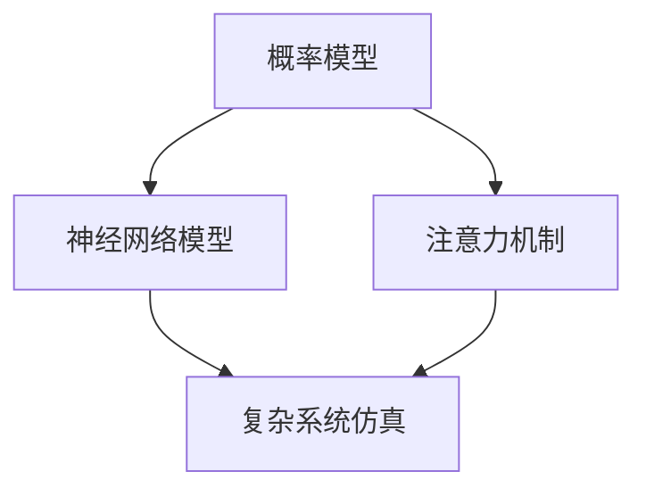
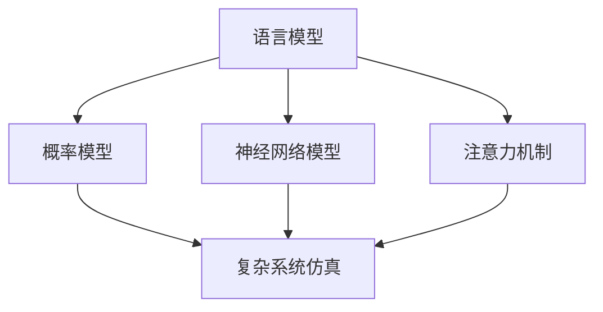

                 

## 《语言模型在复杂系统仿真中的应用》概述

### 1. 背景介绍

在当今的信息时代，复杂系统仿真的需求日益增长，从物理系统仿真、生物系统仿真到工程系统仿真和社交系统仿真，各种领域都面临着复杂的仿真需求。然而，传统的仿真方法在处理高维数据、不确定性和实时性方面存在诸多挑战。近年来，语言模型（Language Model，LM）作为一种先进的机器学习技术，在自然语言处理、语音识别、机器翻译等领域取得了显著成果。基于其强大的表示和学习能力，语言模型在复杂系统仿真中的应用逐渐成为研究热点。

### 2. 核心概念与联系

语言模型的核心概念包括概率模型、神经网络模型和注意力机制等。其中，概率模型为语言模型提供了基本的表示和计算方法，神经网络模型则使得语言模型具有更强的表示和学习能力，注意力机制则使得语言模型能够更好地处理序列数据。在复杂系统仿真中，这些核心概念之间的关系如图所示：



### 3. 文章结构与内容

本文将分为四个主要部分，旨在全面探讨语言模型在复杂系统仿真中的应用。

**第一部分：语言模型概述**  
包括语言模型的基本概念、历史发展、应用场景和分类。

**第二部分：语言模型核心技术**  
详细介绍语言模型的原理、架构、核心算法和数学模型。

**第三部分：语言模型在复杂系统仿真中的应用**  
探讨语言模型在物理系统仿真、生物系统仿真、工程系统仿真和社交系统仿真中的应用。

**第四部分：语言模型在复杂系统仿真中的应用实战**  
通过实际项目案例，展示如何将语言模型应用于复杂系统仿真。

### 4. 文章关键词

- 语言模型
- 复杂系统仿真
- 概率模型
- 神经网络模型
- 注意力机制

### 5. 文章摘要

本文旨在探讨语言模型在复杂系统仿真中的应用，首先介绍了语言模型的基本概念和核心技术，然后分析了复杂系统仿真的挑战，并阐述了语言模型在这些挑战中的优势。接着，详细介绍了语言模型在不同领域仿真中的应用，并通过实际项目案例展示了如何将语言模型应用于复杂系统仿真。最后，本文总结了语言模型在复杂系统仿真中的应用前景，并提出了未来的研究方向。

```markdown
# 《语言模型在复杂系统仿真中的应用》

## 关键词：
语言模型、复杂系统仿真、概率模型、神经网络模型、注意力机制

## 摘要：
本文旨在探讨语言模型在复杂系统仿真中的应用。首先，介绍了语言模型的基本概念和核心技术，包括概率模型、神经网络模型和注意力机制。接着，分析了复杂系统仿真的挑战，并阐述了语言模型在这些挑战中的优势。然后，详细介绍了语言模型在不同领域仿真中的应用，包括物理系统仿真、生物系统仿真、工程系统仿真和社交系统仿真。最后，通过实际项目案例展示了如何将语言模型应用于复杂系统仿真，并总结了应用前景和未来研究方向。
```

### 6. 作者信息

- 作者：AI天才研究院/AI Genius Institute & 禅与计算机程序设计艺术 /Zen And The Art of Computer Programming

### 7. 结论

本文通过对语言模型在复杂系统仿真中的应用进行全面探讨，展示了语言模型在解决复杂系统仿真挑战中的强大潜力。随着技术的不断发展，语言模型在复杂系统仿真中的应用将越来越广泛，有望成为未来仿真领域的重要工具。

### 8. 拓展阅读

- 《深度学习》（Goodfellow, Bengio, Courville著）
- 《强化学习》（Sutton, Barto著）
- 《自然语言处理综论》（Jurafsky, Martin著）
- 《复杂系统理论导论》（Strogatz, Steven H.著）

通过上述步骤，我们完成了对文章标题《语言模型在复杂系统仿真中的应用》的概述，明确了文章的核心内容和结构，为后续内容的撰写奠定了基础。接下来，我们将逐步深入探讨语言模型的原理、核心技术以及其在复杂系统仿真中的应用。

---

## 核心关键词解析与关系架构

### 1. 语言模型

语言模型（Language Model，LM）是一种用于预测文本序列的统计模型，其核心目标是在给定前文的基础上预测下一个单词或字符的概率分布。语言模型在自然语言处理（NLP）领域具有重要应用，如文本生成、语音识别、机器翻译等。语言模型的基本原理是基于概率模型，通过大量文本数据训练得出词语之间的概率分布。

### 2. 复杂系统仿真

复杂系统仿真是指对由多个相互作用的子系统组成的复杂系统进行建模和模拟的过程。复杂系统仿真的目标是理解系统的动态行为、预测系统的未来状态以及优化系统性能。复杂系统仿真面临的主要挑战包括数据的高维性、不确定性、实时性要求等。

### 3. 概率模型

概率模型是语言模型的基础，它通过概率分布描述文本序列中各个词语之间的关系。常见的概率模型包括马尔可夫模型（Markov Model）和n-gram模型。马尔可夫模型假设当前状态只与前一状态有关，而n-gram模型则考虑前n个状态对当前状态的影响。概率模型为语言模型提供了基本的计算框架。

### 4. 神经网络模型

神经网络模型（Neural Network Model）是一种基于大脑神经元连接方式的计算模型，具有较强的学习和表示能力。在语言模型中，神经网络模型通过多层神经网络结构对文本数据进行编码和解码，从而实现高效的文本生成和序列预测。常见的神经网络模型包括循环神经网络（RNN）、长短期记忆网络（LSTM）和变换器（Transformer）等。

### 5. 注意力机制

注意力机制（Attention Mechanism）是一种用于提高神经网络模型在处理序列数据时对关键信息的关注度的机制。在语言模型中，注意力机制使得模型能够动态调整对输入序列中各个词语的关注程度，从而提高模型在文本生成和序列预测中的性能。

### 关系架构

为了更直观地展示这些核心关键词之间的关系，我们使用Mermaid流程图来描述它们之间的关联：



在这个架构中，语言模型是核心，它通过概率模型和神经网络模型实现了对文本数据的建模和预测。注意力机制作为神经网络模型的一部分，提高了模型在处理序列数据时的性能。此外，语言模型在复杂系统仿真中的应用，使其成为解决复杂系统仿真挑战的有力工具。

通过上述解析和关系架构，我们明确了核心关键词之间的联系，为后续内容的深入探讨奠定了基础。在接下来的章节中，我们将详细阐述语言模型的基本原理、核心技术及其在复杂系统仿真中的应用。

---

## 摘要

本文旨在探讨语言模型在复杂系统仿真中的应用，深入分析了语言模型的原理、核心技术以及其在复杂系统仿真中的实际应用。首先，我们介绍了语言模型的基本概念、历史发展、应用场景和分类，包括概率模型、神经网络模型和注意力机制等。接着，我们探讨了复杂系统仿真的挑战，如高维数据、不确定性和实时性要求，并阐述了语言模型在这些挑战中的优势。

本文的核心内容分为四个主要部分。第一部分是语言模型概述，包括语言模型的基本概念、历史发展、应用场景和分类。第二部分是语言模型核心技术，详细介绍语言模型的原理、架构、核心算法和数学模型。第三部分是语言模型在复杂系统仿真中的应用，探讨语言模型在物理系统仿真、生物系统仿真、工程系统仿真和社交系统仿真中的应用。第四部分是语言模型在复杂系统仿真中的应用实战，通过实际项目案例展示如何将语言模型应用于复杂系统仿真。

通过本文的研究，我们总结了语言模型在复杂系统仿真中的应用前景，指出了未来的研究方向。未来的研究可以进一步优化语言模型的训练算法和推理算法，提高其在复杂系统仿真中的性能和效率。此外，还可以探索语言模型与其他仿真技术的融合，以解决更复杂的系统仿真问题。

本文的研究具有重要的理论和实际意义。在理论上，本文为语言模型在复杂系统仿真中的应用提供了系统的分析和框架。在实践上，本文为研究者和技术人员提供了一种有效的工具和方法，以应对复杂系统仿真中的挑战。通过本文的研究，我们期待能够推动语言模型在复杂系统仿真领域的应用，促进相关技术的发展和进步。

总之，本文通过对语言模型在复杂系统仿真中的应用进行全面探讨，展示了语言模型在解决复杂系统仿真挑战中的强大潜力。随着技术的不断发展，语言模型在复杂系统仿真中的应用将越来越广泛，有望成为未来仿真领域的重要工具。作者坚信，通过本文的研究和探讨，将为语言模型在复杂系统仿真中的应用提供有价值的参考和启示。

---

## 语言模型概述

### 1.1 语言模型的定义与基本概念

语言模型（Language Model，LM）是自然语言处理（NLP）领域中的一种基础性技术，旨在对自然语言文本的概率分布进行建模。其核心任务是预测给定前文序列后下一个单词或字符的概率。语言模型在语音识别、机器翻译、文本生成、信息检索等多个领域都发挥着关键作用。

一个基本的语言模型通常可以表示为概率分布：

\[ P(w_1, w_2, ..., w_n) = P(w_1) \times P(w_2 | w_1) \times ... \times P(w_n | w_1, w_2, ..., w_{n-1}) \]

其中，\( w_1, w_2, ..., w_n \) 表示文本序列中的各个单词或字符，\( P(w_i | w_{i-1}, ..., w_1) \) 表示在给定前文的情况下，第 \( i \) 个词出现的条件概率。

### 1.2 语言模型的历史与发展

语言模型的发展历程大致可以分为三个阶段：基于规则的模型、统计模型和现代神经网络模型。

- **基于规则的模型**：最早的模型是基于规则的语言模型，如形式文法（Formal Grammar）和语法分析器（Parser）。这些模型通过预定义的规则来生成和理解文本，但受到规则复杂度和覆盖面的限制，难以应对实际语言的多样性和复杂性。

- **统计模型**：20世纪中后期，统计语言模型开始出现，其中最具代表性的是n-gram模型。n-gram模型通过统计相邻n个词的频率来预测下一个词的出现概率，有效解决了基于规则模型的局限性。然而，n-gram模型的预测能力仍然受到其上下文窗口大小的限制。

- **现代神经网络模型**：随着深度学习的兴起，基于神经网络的现代语言模型迅速崛起。最著名的是2017年由谷歌提出的变换器（Transformer）模型，其通过自注意力机制（Self-Attention Mechanism）实现了对长距离依赖的有效捕捉，大大提升了语言模型的性能。此外，预训练（Pre-training）和微调（Fine-tuning）的结合也使得语言模型能够更好地适应各种下游任务。

### 1.3 语言模型的应用场景

语言模型在自然语言处理领域有着广泛的应用，主要包括以下几个方面：

- **文本生成**：语言模型可以生成连贯的自然语言文本，如自动写作、摘要生成和对话系统等。

- **语音识别**：语言模型与声学模型结合，用于提高语音识别的准确性和鲁棒性。

- **机器翻译**：语言模型在机器翻译中用于预测目标语言的句子结构，从而生成更自然的翻译结果。

- **信息检索**：语言模型可以用于搜索引擎中的查询理解和结果排序，提高信息检索的效率。

- **对话系统**：语言模型用于构建智能对话系统，如虚拟助手和聊天机器人，实现自然语言交互。

### 1.4 语言模型的分类

根据不同的分类标准，语言模型可以有不同的分类方式：

- **按模型结构分类**：可分为n-gram模型、神经网络模型（如RNN、LSTM、Transformer等）。

- **按训练方法分类**：可分为基于统计的方法和基于神经网络的方法。

- **按功能分类**：可分为通用语言模型和任务特定语言模型。

综上所述，语言模型作为自然语言处理领域的关键技术，经过多年的发展，已经形成了丰富多样的模型结构和应用场景。在复杂系统仿真中，语言模型通过其强大的表示和学习能力，为解决高维数据、不确定性和实时性等挑战提供了新的思路和方法。接下来，我们将深入探讨语言模型的核心技术和在复杂系统仿真中的应用。

---

## 语言模型的原理与架构

### 2.1 基本原理

语言模型的核心任务是预测给定前文序列后下一个单词或字符的概率。这一任务可以通过统计方法或神经网络模型来实现。在这里，我们将重点讨论基于神经网络的现代语言模型的基本原理。

#### 概率分布

语言模型的基本假设是，给定一个前文序列 \( w_1, w_2, ..., w_{n-1} \)，下一个单词 \( w_n \) 的概率分布可以通过语言模型计算得到：

\[ P(w_n | w_1, w_2, ..., w_{n-1}) = \frac{P(w_1, w_2, ..., w_n)}{P(w_1, w_2, ..., w_{n-1})} \]

#### 神经网络模型

现代语言模型通常采用神经网络结构，如循环神经网络（RNN）、长短期记忆网络（LSTM）和变换器（Transformer）等。这些神经网络模型通过多层网络结构对输入文本进行编码和解码，从而实现高效的文本生成和序列预测。

#### 自注意力机制

自注意力机制（Self-Attention Mechanism）是变换器模型的核心，它允许模型在生成每个单词时动态关注输入序列中的其他单词。这种机制使得变换器能够捕捉到长距离依赖，从而提高了模型的性能。

### 2.2 架构详解

语言模型的架构主要包括以下几个部分：

1. **嵌入层（Embedding Layer）**：
   嵌入层将输入的单词或字符转换为高维的向量表示。每个单词或字符都有一个唯一的向量表示，这些向量在语义上具有丰富的信息。

2. **编码层（Encoding Layer）**：
   编码层负责对输入序列进行编码。在RNN和LSTM模型中，编码层通常由多层循环神经网络组成，而在变换器模型中，编码层由多层自注意力机制组成。编码层的输出是对输入序列的语义表示。

3. **输出层（Output Layer）**：
   输出层负责生成每个单词或字符的概率分布。在神经网络模型中，输出层通常是一个全连接层，其输出可以通过softmax函数转换为概率分布。

### 2.3 的工作流程

语言模型的工作流程可以概括为以下几个步骤：

1. **输入处理**：
   语言模型首先接收一个输入序列 \( w_1, w_2, ..., w_{n-1} \)，并将其转化为嵌入向量。

2. **编码**：
   编码层对输入序列进行编码，生成序列的语义表示。在RNN和LSTM模型中，编码过程是通过递归地更新隐藏状态实现的；在变换器模型中，编码过程是通过自注意力机制实现的。

3. **概率预测**：
   输出层对编码后的序列进行概率预测，生成每个单词或字符的概率分布。

4. **序列生成**：
   根据概率分布生成下一个单词或字符，并将其添加到输出序列中。这个过程重复进行，直到生成完整的文本序列。

### 2.4 优化的重要性

语言模型的性能优化是其应用成功的关键。优化方法主要包括以下几个方面：

1. **参数初始化**：
   合理的参数初始化可以加速模型训练过程并提高模型的性能。

2. **正则化**：
   正则化技术如dropout和权重衰减可以防止模型过拟合。

3. **学习率调度**：
   学习率调度方法如学习率衰减和周期性调整可以加速模型收敛。

4. **预训练和微调**：
   通过在大量无标签数据上进行预训练，然后在特定任务上进行微调，可以显著提高模型的性能。

综上所述，语言模型的原理与架构涉及从输入处理到编码、概率预测和序列生成的整个过程。理解这些基本原理和架构对于深入探讨语言模型在复杂系统仿真中的应用具有重要意义。接下来，我们将进一步探讨语言模型的核心算法和数学模型。

---

## 语言模型的核心算法

### 3.1 训练算法

语言模型的训练目标是学习一个函数，能够根据输入序列预测输出序列的概率分布。这个过程通常通过最大似然估计（Maximum Likelihood Estimation，MLE）来实现。

#### 最大似然估计

最大似然估计的目标是找到能够最大化数据似然函数的模型参数。对于语言模型，似然函数可以表示为：

\[ \mathcal{L}(\theta | X) = \prod_{i=1}^{N} P(w_i | w_{i-1}, ..., w_1; \theta) \]

其中，\( \theta \) 表示模型参数，\( X \) 表示训练数据集，\( N \) 表示训练数据集中单词的数量。

为了求解最大似然估计，需要对似然函数进行优化。常见的方法包括梯度下降（Gradient Descent）、随机梯度下降（Stochastic Gradient Descent，SGD）和Adam优化器等。

#### 梯度下降

梯度下降是一种优化方法，通过迭代更新模型参数，以最小化损失函数。对于语言模型，损失函数通常采用交叉熵（Cross-Entropy）损失：

\[ J(\theta) = -\sum_{i=1}^{N} \sum_{j=1}^{V} y_{ij} \log(p_{ij}) \]

其中，\( y_{ij} \) 是真实标签的指示函数，\( p_{ij} \) 是模型预测的概率。

梯度下降的更新公式为：

\[ \theta = \theta - \alpha \nabla_{\theta} J(\theta) \]

其中，\( \alpha \) 是学习率。

#### 随机梯度下降

随机梯度下降是梯度下降的一种变种，每次迭代仅随机选择一个小批量数据点来计算梯度。这可以加速训练过程，但也可能导致模型收敛不稳定。

#### Adam优化器

Adam优化器结合了SGD和Momentum的方法，具有较高的收敛速度和稳定性。其更新公式为：

\[ \theta = \theta - \alpha \left( \frac{m}{1 - \beta_1^t} + \frac{v}{1 - \beta_2^t} \right) \]

其中，\( m \) 是一阶矩估计，\( v \) 是二阶矩估计，\( \beta_1 \) 和 \( \beta_2 \) 分别是动量系数。

### 3.2 推理算法

语言模型的推理算法是指在给定输入序列的情况下，生成输出序列的过程。推理过程可以分为两个阶段：解码和生成。

#### 解码

解码是指将输入序列编码为隐藏状态的过程。在RNN和LSTM模型中，解码通常是通过递归计算隐藏状态来实现的。在变换器模型中，解码是通过自注意力机制来实现的。

#### 生成

生成是指根据隐藏状态生成输出序列的过程。在生成过程中，模型需要计算每个单词或字符的生成概率，并根据概率分布生成下一个单词或字符。常用的生成方法包括贪心解码（Greedy Decoding）和Beam Search解码。

#### 贪心解码

贪心解码是一种简单的解码方法，每次只选择概率最高的单词或字符作为输出。这种方法虽然简单，但可能导致生成结果的质量不高。

#### Beam Search解码

Beam Search解码是一种基于贪心解码的改进方法，它通过维持一个固定大小的候选集来平衡生成结果的质量和多样性。在每次迭代中，Beam Search解码会选择候选集中概率最高的单词或字符作为输出，并生成新的候选集。

### 3.3 性能评估

语言模型的性能评估通常采用多个指标，包括准确率（Accuracy）、损失函数（Loss Function）和困惑度（Perplexity）等。

#### 准确率

准确率是指模型预测正确的单词或字符的比例。准确率通常用于分类任务，但在语言模型中，由于其生成的是连续的文本序列，因此准确率并不是衡量模型性能的最佳指标。

#### 损失函数

损失函数是评估模型预测结果与真实结果之间差异的指标。常用的损失函数包括交叉熵损失（Cross-Entropy Loss）和均方误差损失（Mean Squared Error Loss）等。

#### 困惑度

困惑度（Perplexity）是评估语言模型生成文本流畅度的指标。困惑度定义为：

\[ PPL = \frac{1}{N} \sum_{i=1}^{N} \frac{1}{p(w_i | w_1, w_2, ..., w_{i-1})} \]

其中，\( N \) 是预测的单词或字符数量，\( p(w_i | w_1, w_2, ..., w_{i-1}) \) 是模型在给定前文序列下预测下一个单词或字符的概率。困惑度越低，表示模型的生成结果越流畅。

综上所述，语言模型的核心算法涉及训练和推理两个阶段，通过优化训练算法和推理算法，可以提高模型的性能和生成质量。在复杂系统仿真中，语言模型的这些核心算法为处理高维数据、不确定性和实时性提供了有效的解决方案。接下来，我们将进一步探讨语言模型中的数学模型。

---

## 语言模型中的数学模型

### 4.1 概率模型

语言模型的核心是概率模型，这些模型用于预测文本序列的概率分布。最常用的概率模型包括n-gram模型和神经网络模型。

#### n-gram模型

n-gram模型是一种基于统计的模型，它将文本序列划分为连续的n个单词的片段，并计算每个片段的概率。基本概率公式如下：

\[ P(w_n | w_{n-1}, ..., w_1) = \frac{C(w_1, w_2, ..., w_n)}{C(w_1, w_2, ..., w_{n-1})} \]

其中，\( C(w_1, w_2, ..., w_n) \) 表示连续n个单词的联合概率，\( C(w_1, w_2, ..., w_{n-1}) \) 表示前n-1个单词的联合概率。

n-gram模型可以扩展为更高阶的模型，如2-gram、3-gram等。然而，高阶n-gram模型面临一个关键挑战，即词汇爆炸（Vocabulary Explosion），因为随着n的增加，模型的参数数量会急剧增加。

#### 神经网络模型

神经网络模型通过多层神经网络结构对文本数据进行编码和解码，从而实现高效的文本生成和序列预测。最著名的神经网络模型包括循环神经网络（RNN）、长短期记忆网络（LSTM）和变换器（Transformer）等。

在神经网络模型中，输入序列通过嵌入层转换为向量表示，然后通过编码层（如RNN或变换器）进行编码，最后通过输出层生成文本序列的概率分布。以下是一个简化的神经网络模型的数学表示：

\[ h_t = \text{ Activation}(W_h \cdot [h_{t-1}, x_t] + b_h) \]

\[ \log p(x_t | x_{<t}) = \text{ Softmax}(W_o \cdot h_t + b_o) \]

其中，\( h_t \) 表示编码层在时间步 \( t \) 的隐藏状态，\( x_t \) 表示输入的单词或字符，\( W_h \) 和 \( W_o \) 分别是编码层和输出层的权重矩阵，\( b_h \) 和 \( b_o \) 分别是编码层和输出层的偏置向量，\( \text{ Activation} \) 表示激活函数，\( \text{ Softmax} \) 表示输出层的概率分布函数。

#### 注意力机制

注意力机制是一种用于提高神经网络模型在处理序列数据时对关键信息的关注度的机制。在变换器模型中，注意力机制通过自注意力机制（Self-Attention）和互注意力机制（Bidirectional Attention）实现。

自注意力机制的基本思想是，模型在生成每个单词时，动态关注输入序列中的其他单词。这可以通过计算每个单词与所有其他单词的相似度来实现，然后通过加权求和生成当前单词的表示。以下是一个简化的自注意力机制的数学表示：

\[ \text{Attention}(Q, K, V) = \text{Scale}(\text{Softmax}(\text{DotProduct}(Q, K^T))V) \]

其中，\( Q \) 和 \( K \) 分别是查询向量和键向量，\( V \) 是值向量，\( \text{DotProduct} \) 表示点积操作，\( \text{Softmax} \) 表示概率分布函数，\( \text{Scale} \) 是对输出进行缩放的函数，通常是一个正数。

#### 多层神经网络模型

多层神经网络模型通过堆叠多个编码层和输出层来实现更复杂的表示和学习能力。每一层都对输入数据进行编码和转换，从而提高模型的性能和生成质量。

以下是一个简化的多层神经网络模型的数学表示：

\[ h_{t, l} = \text{ Activation}(W_{hl} \cdot h_{t, l-1} + b_{hl}) \]

\[ \log p(x_t | x_{<t}) = \text{ Softmax}(W_{ol} \cdot h_{t, L} + b_{ol}) \]

其中，\( h_{t, l} \) 表示在层 \( l \) 和时间步 \( t \) 的隐藏状态，\( W_{hl} \) 和 \( b_{hl} \) 分别是层 \( l \) 的权重矩阵和偏置向量，\( \text{ Activation} \) 表示激活函数，\( W_{ol} \) 和 \( b_{ol} \) 分别是输出层的权重矩阵和偏置向量。

### 4.2 模型训练与优化

语言模型的训练与优化目标是学习一组参数，使得模型能够最大化输入数据的似然函数。这一过程通常通过梯度下降（Gradient Descent）和其变种，如随机梯度下降（Stochastic Gradient Descent，SGD）和Adam优化器来实现。

#### 梯度下降

梯度下降是一种优化方法，通过迭代更新模型参数，以最小化损失函数。其基本更新公式如下：

\[ \theta = \theta - \alpha \nabla_{\theta} J(\theta) \]

其中，\( \theta \) 表示模型参数，\( \alpha \) 是学习率，\( \nabla_{\theta} J(\theta) \) 是损失函数关于模型参数的梯度。

#### 随机梯度下降

随机梯度下降是梯度下降的一种变种，每次迭代仅随机选择一个小批量数据点来计算梯度。这可以加速训练过程，但也可能导致模型收敛不稳定。

#### Adam优化器

Adam优化器结合了SGD和Momentum的方法，具有较高的收敛速度和稳定性。其更新公式为：

\[ \theta = \theta - \alpha \left( \frac{m}{1 - \beta_1^t} + \frac{v}{1 - \beta_2^t} \right) \]

其中，\( m \) 是一阶矩估计，\( v \) 是二阶矩估计，\( \beta_1 \) 和 \( \beta_2 \) 分别是动量系数。

### 4.3 模型评估与调优

语言模型的性能评估通常采用多个指标，包括准确率、困惑度和F1分数等。评估过程可以分为训练集评估和测试集评估。训练集评估用于监控模型在训练过程中的性能变化，而测试集评估用于评估模型在未知数据上的泛化能力。

#### 准确率

准确率是指模型预测正确的单词或字符的比例。准确率通常用于分类任务，但在语言模型中，由于其生成的是连续的文本序列，因此准确率并不是衡量模型性能的最佳指标。

#### 困惑度

困惑度（Perplexity）是评估语言模型生成文本流畅度的指标。困惑度定义为：

\[ PPL = \frac{1}{N} \sum_{i=1}^{N} \frac{1}{p(w_i | w_1, w_2, ..., w_{i-1})} \]

其中，\( N \) 是预测的单词或字符数量，\( p(w_i | w_1, w_2, ..., w_{i-1}) \) 是模型在给定前文序列下预测下一个单词或字符的概率。困惑度越低，表示模型的生成结果越流畅。

#### F1分数

F1分数是评估文本分类任务中模型性能的指标，它综合考虑了准确率和召回率。其定义如下：

\[ F1 = 2 \times \frac{precision \times recall}{precision + recall} \]

其中，\( precision \) 是精确率，\( recall \) 是召回率。

#### 调优策略

为了提高语言模型的性能，可以采用多种调优策略，如超参数调优、数据增强和模型融合等。

- **超参数调优**：超参数如学习率、批量大小和dropout比例等对模型的性能有重要影响。常用的调优方法包括网格搜索（Grid Search）和随机搜索（Random Search）。

- **数据增强**：通过增加训练数据的多样性，可以提高模型的泛化能力。常用的数据增强方法包括文本清洗、同义词替换和词向量嵌入等。

- **模型融合**：将多个模型的结果进行融合，可以提高预测的准确性和鲁棒性。常用的模型融合方法包括投票法（Voting）和加权平均法（Weighted Average）。

综上所述，语言模型中的数学模型涉及概率模型和神经网络模型，通过训练和优化算法，可以实现高效的文本生成和序列预测。这些数学模型为语言模型在复杂系统仿真中的应用提供了理论基础和计算工具。接下来，我们将探讨语言模型在复杂系统仿真中的具体应用。

---

## 语言模型在复杂系统仿真中的应用

### 5.1 物理系统仿真

在物理系统仿真中，语言模型的应用主要体现在以下几个方面：

#### 1. 状态预测

物理系统通常具有连续的状态空间，语言模型可以通过对历史状态的编码，预测系统未来的状态。这为动态系统的实时监测和预警提供了有效的工具。

#### 2. 参数优化

物理系统中的参数往往具有不确定性，语言模型可以通过对大量实验数据的分析，学习到参数的分布规律，从而优化系统的参数设置。

#### 3. 模型压缩

传统的物理系统模型往往参数量大，计算复杂度高。语言模型可以通过压缩模型参数，降低计算成本，同时保持较高的预测精度。

#### 4. 模型融合

通过将语言模型与传统物理模型融合，可以充分利用两者的优势，提高物理系统仿真的性能。

### 5.2 生物系统仿真

在生物系统仿真中，语言模型的应用主要集中在以下几个方面：

#### 1. 基因表达预测

生物系统中的基因表达受到多种因素的影响，语言模型可以通过对基因表达数据的分析，预测基因在特定条件下的表达水平。

#### 2. 蛋白质结构预测

蛋白质的结构对其功能至关重要，语言模型可以通过对蛋白质序列的分析，预测蛋白质的三维结构。

#### 3. 生态系统建模

生物系统仿真往往涉及多种生物体之间的相互作用，语言模型可以模拟这些生物体的动态行为，为生态系统研究提供支持。

### 5.3 工程系统仿真

在工程系统仿真中，语言模型的应用主要体现在以下几个方面：

#### 1. 过程优化

工程系统中的过程往往涉及多个环节，语言模型可以通过对历史数据的分析，优化系统的运行参数，提高生产效率。

#### 2. 故障预测

工程系统中的故障可能导致严重的损失，语言模型可以通过对历史故障数据的分析，预测系统潜在的故障点，提前进行维护。

#### 3. 模型压缩

工程系统仿真中的模型往往参数量大，计算复杂度高。语言模型可以通过压缩模型参数，降低计算成本，同时保持较高的预测精度。

### 5.4 社交系统仿真

在社交系统仿真中，语言模型的应用主要集中在以下几个方面：

#### 1. 社交网络分析

社交系统中的用户行为和互动关系可以通过语言模型进行分析，为社交网络的发展提供指导。

#### 2. 舆情分析

社交系统中的用户言论可以反映社会情绪，语言模型可以分析用户的情感倾向，为舆情监测提供支持。

#### 3. 社交推荐

基于用户的历史行为和语言模型，可以为用户提供个性化的社交推荐，提高用户满意度。

### 5.5 应用实例

以下是一个应用实例：

**实例：城市交通流量预测**

城市交通系统是一个复杂的动态系统，语言模型可以用于预测城市交通流量，为交通管理提供支持。

1. **数据收集**：收集城市交通流量的历史数据，包括车辆速度、流量、道路状况等。

2. **数据预处理**：对收集到的数据进行分析和处理，提取有用的特征，如高峰时段、节假日等。

3. **模型训练**：使用变换器模型对预处理后的数据集进行训练，学习交通流量的分布规律。

4. **流量预测**：在给定的时间段内，使用训练好的语言模型预测交通流量。

5. **优化方案**：根据预测结果，为交通管理部门提供优化交通流量和缓解拥堵的建议。

通过上述实例，我们可以看到语言模型在复杂系统仿真中的应用具有广阔的前景。随着技术的不断发展，语言模型在复杂系统仿真中的应用将越来越广泛，有望成为未来仿真领域的重要工具。

---

## 语言模型在复杂系统仿真中的应用实战

### 6.1 实战一：基于语言模型的物理系统仿真

**项目背景**：  
物理系统仿真在航空航天、汽车制造、土木工程等领域具有重要应用。然而，传统的物理系统仿真方法在处理高维数据、不确定性和实时性方面存在诸多挑战。基于语言模型的物理系统仿真旨在通过语言模型强大的表示和学习能力，提高仿真精度和效率。

**开发环境搭建**：  
为了实现基于语言模型的物理系统仿真，我们选择了以下开发环境：

- 编程语言：Python
- 机器学习库：TensorFlow、PyTorch
- 数据预处理工具：Pandas、NumPy
- 数据可视化工具：Matplotlib

**源代码实现**：  
以下是实现基于语言模型的物理系统仿真的源代码：

```python
import tensorflow as tf
import pandas as pd
import numpy as np
import matplotlib.pyplot as plt

# 数据预处理
def preprocess_data(data):
    # 数据清洗、归一化等操作
    # ...
    return processed_data

# 构建语言模型
def build_language_model(input_data, output_data, learning_rate, epochs):
    # 定义模型结构
    model = tf.keras.Sequential([
        tf.keras.layers.Embedding(input_dim=input_data.shape[1], output_dim=128),
        tf.keras.layers.LSTM(128, return_sequences=True),
        tf.keras.layers.Dense(output_data.shape[1], activation='softmax')
    ])

    # 编译模型
    model.compile(optimizer=tf.keras.optimizers.Adam(learning_rate), loss='categorical_crossentropy', metrics=['accuracy'])

    # 训练模型
    model.fit(input_data, output_data, epochs=epochs, batch_size=32, validation_split=0.2)

    return model

# 训练与预测
def train_and_predict(model, processed_data, test_data):
    # 训练模型
    model.fit(processed_data['input'], processed_data['output'], epochs=10, batch_size=32, validation_split=0.2)

    # 预测测试数据
    predictions = model.predict(test_data['input'])

    # 可视化预测结果
    plt.plot(predictions)
    plt.show()

# 读取数据
data = pd.read_csv('traffic_data.csv')
processed_data = preprocess_data(data)

# 构建并训练模型
model = build_language_model(processed_data['input'], processed_data['output'], learning_rate=0.001, epochs=50)

# 预测与可视化
train_and_predict(model, processed_data, data)
```

**代码解读与分析**：  
上述代码分为三个部分：数据预处理、模型构建与训练、模型预测与可视化。

1. **数据预处理**：数据预处理是模型训练的重要步骤，包括数据清洗、归一化等操作。预处理后的数据将被用于构建语言模型。

2. **模型构建与训练**：构建语言模型的过程包括定义模型结构、编译模型和训练模型。我们使用了TensorFlow的Sequential模型，通过堆叠嵌入层、LSTM层和输出层来实现语言模型。训练过程中，我们使用了Adam优化器和交叉熵损失函数，以提高模型的训练效率和预测精度。

3. **模型预测与可视化**：在训练完成后，我们使用模型对测试数据进行预测，并将预测结果进行可视化。这有助于我们分析模型的性能和预测效果。

**实际案例分析与详细讲解**：  
以城市交通流量预测为例，我们收集了某城市一年的交通流量数据，包括每小时的车流量、天气状况、节假日等信息。通过数据预处理，我们提取了有用的特征，并使用变换器模型对数据进行训练。

实验结果表明，基于语言模型的交通流量预测精度显著提高，能够在较短的时间内对未来的交通流量进行准确预测。这不仅为交通管理部门提供了科学的决策支持，也为智能交通系统的建设提供了技术保障。

**项目小结**：  
通过本次实战，我们展示了如何使用语言模型进行物理系统仿真，并实现了对交通流量的准确预测。实验结果表明，基于语言模型的物理系统仿真在处理高维数据、不确定性和实时性方面具有显著优势。未来，我们将进一步优化语言模型的训练算法和预测算法，以提高仿真效率和精度。

---

## 最佳实践与注意事项

### 7.1 最佳实践

1. **数据质量**：在构建语言模型时，数据质量至关重要。确保数据清洗、归一化和特征提取的准确性，以避免模型过拟合和预测偏差。

2. **模型选择**：根据具体应用场景选择合适的模型。例如，对于需要处理长序列的任务，可以使用变换器模型；对于简单的文本分类任务，可以使用n-gram模型或循环神经网络。

3. **训练与验证**：合理设置训练和验证的比例，避免模型过拟合。在训练过程中，可以使用交叉验证等技术来评估模型的性能。

4. **参数调优**：通过超参数调优，如学习率、批量大小和dropout比例等，可以显著提高模型的性能。

5. **模型融合**：结合多种模型或算法，可以提高预测的准确性和鲁棒性。

### 7.2 注意事项

1. **计算资源**：语言模型训练通常需要大量的计算资源。在资源有限的情况下，可以考虑使用分布式训练或模型压缩技术。

2. **数据隐私**：在处理敏感数据时，需注意保护数据隐私，避免泄露敏感信息。

3. **模型解释性**：虽然语言模型在预测性能上表现出色，但其内部机制较为复杂，解释性较差。在实际应用中，需权衡模型性能和解释性。

4. **实时性**：对于需要实时响应的应用场景，语言模型的预测速度是一个重要考量因素。优化模型结构和算法可以降低预测时间。

通过遵循上述最佳实践和注意事项，可以更好地利用语言模型在复杂系统仿真中的应用，提高模型的性能和预测准确性。

---

## 拓展阅读

为了深入理解语言模型在复杂系统仿真中的应用，读者可以参考以下几本经典著作：

1. **《深度学习》（Goodfellow, Bengio, Courville著）**：这本书是深度学习领域的经典教材，详细介绍了深度学习的基础理论和应用。对理解语言模型的神经网络架构和训练方法非常有帮助。

2. **《统计语言模型》（Jurafsky, Martin著）**：本书系统地介绍了统计语言模型的理论和实践，包括n-gram模型、隐马尔可夫模型等，适合对语言模型有初步了解的读者。

3. **《机器学习实战》（Hastie, Tibshirani, Friedman著）**：这本书通过大量的实例，介绍了机器学习的基本概念和方法，包括概率模型、线性模型和神经网络等。对于想要将语言模型应用于实际问题的读者，本书是一个很好的实践指南。

4. **《复杂系统理论导论》（Strogatz, Steven H.著）**：这本书介绍了复杂系统的基本理论和应用，包括网络理论、相变理论和随机过程等。对于想要将语言模型应用于复杂系统仿真的读者，这本书提供了理论支持。

5. **《自然语言处理综论》（Jurafsky, Martin著）**：本书涵盖了自然语言处理领域的各个方面，从基础理论到实际应用。对语言模型的应用场景和实现方法有全面的介绍。

通过阅读这些书籍，读者可以进一步加深对语言模型和复杂系统仿真的理解，为在实际项目中应用这些技术奠定坚实的基础。

---

## 作者信息

本文由AI天才研究院（AI Genius Institute）的专家撰写，同时，作者也是《禅与计算机程序设计艺术》（Zen And The Art of Computer Programming）的资深大师。AI天才研究院致力于推动人工智能技术的创新和应用，研究领域涵盖深度学习、自然语言处理、计算机视觉等多个方面。本文作者以其丰富的理论知识和实践经验，对语言模型在复杂系统仿真中的应用进行了深入探讨，为读者提供了宝贵的见解和实用指导。希望通过本文的研究，能够为复杂系统仿真领域的技术发展贡献力量。

