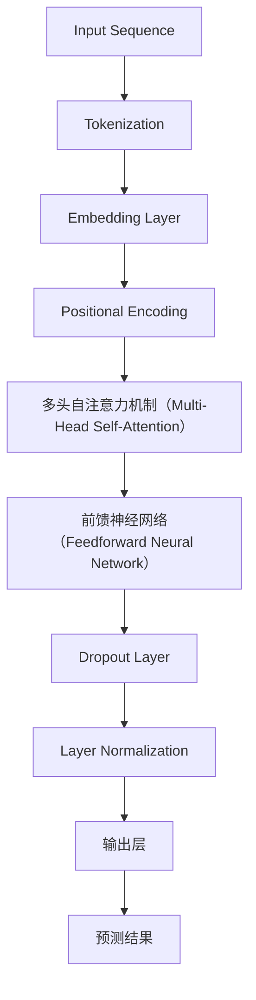

                 

当然，为了撰写这篇高质量的技术博客文章，我们将按照以下步骤进行：

1. **确定文章结构和主题**：根据提供的目录大纲，我们将确定文章的结构和主题。

2. **撰写引言和核心概念**：介绍研究背景，阐述语言模型和复杂系统优化之间的关系。

3. **理论部分讲解**：详细讲解语言模型的基本概念、架构以及复杂系统优化的相关理论。

4. **核心算法原理讲解**：使用伪代码和LaTeX公式详细阐述语言模型在优化算法中的应用。

5. **项目实战**：介绍一个实际案例，展示如何将语言模型应用于复杂系统优化。

6. **代码实现和解读**：提供开发环境搭建、源代码实现和代码解读。

7. **案例分析**：深入分析实际案例，剖析项目中的关键点和挑战。

8. **总结和拓展**：总结文章的主要观点，提出注意事项和最佳实践，并提供拓展阅读资源。

现在，让我们开始逐个步骤进行详细撰写。

---

# 文章标题：语言模型在复杂系统优化中的表现研究

## 文章关键词
- 语言模型
- 复杂系统优化
- 神经网络
- 优化算法
- 案例分析

## 摘要
本文探讨了语言模型在复杂系统优化中的应用及其表现。通过对语言模型的基本概念和架构的介绍，结合复杂系统优化理论，本文详细分析了语言模型在优化算法中的应用原理，并通过实际案例分析，展示了语言模型在复杂系统优化中的实际效果。文章最后总结了语言模型在复杂系统优化中的挑战与前景，并提出了相关最佳实践。

---

在接下来的部分，我们将详细展开上述各个步骤的内容。首先，我们将介绍语言模型和复杂系统优化，并阐述它们之间的联系。

## 第一部分：引言与基础理论

### 第1章 绪论

#### 1.1 研究背景与意义

随着人工智能技术的迅猛发展，语言模型（如深度学习模型）已经在自然语言处理、语音识别和机器翻译等领域取得了显著的成果。同时，复杂系统的优化问题也日益受到关注，例如金融市场的价格预测、交通网络流量控制、能源管理等领域。本文旨在研究如何将语言模型应用于复杂系统优化，从而提高优化效率和精度。

#### 1.2 国内外研究现状

目前，国内外已有许多研究探讨了语言模型在优化算法中的应用。例如，神经网络模型在机器学习优化算法中的应用已经得到了广泛的验证。然而，针对复杂系统优化的研究还相对较少，尤其是将语言模型与复杂系统优化相结合的研究。

#### 1.3 研究内容与目标

本文的研究内容主要包括以下几个方面：

1. 语言模型的基本概念和常见架构。
2. 复杂系统优化的相关理论和应用方法。
3. 语言模型在优化算法中的应用原理和分析。
4. 实际案例中的语言模型应用及其效果分析。
5. 语言模型在复杂系统优化中的挑战与前景。

本文的研究目标是：

1. 梳理语言模型和复杂系统优化的基本概念和原理。
2. 探讨语言模型在优化算法中的应用方法和效果。
3. 通过实际案例展示语言模型在复杂系统优化中的潜力。
4. 提出未来研究的方向和建议。

### 第2章 语言模型基础

#### 2.1 语言模型的基本概念

语言模型（Language Model）是自然语言处理（Natural Language Processing, NLP）中的一个重要模型，用于预测一个单词序列的概率分布。语言模型是许多NLP任务（如机器翻译、文本生成、语音识别）的基础。

**核心概念：**

- **词向量（Word Embedding）：** 将词汇映射到高维空间中的向量表示。
- **神经网络（Neural Network）：** 用于学习词汇之间的概率分布。
- **深度学习（Deep Learning）：** 利用多层神经网络进行学习。

#### 2.2 语言模型的常见架构

常见的语言模型架构包括：

- **基于神经网络的模型（Neural Network-based Model）：** 如循环神经网络（Recurrent Neural Network, RNN）、长短期记忆网络（Long Short-Term Memory, LSTM）和门控循环单元（Gated Recurrent Unit, GRU）。
- **基于深度学习的模型（Deep Learning-based Model）：** 如Transformer模型，它引入了自注意力机制（Self-Attention Mechanism），在机器翻译、文本生成等任务中表现出色。

**架构示例：** Transformer模型架构



### 第3章 复杂系统优化概述

#### 3.1 复杂系统的定义与特性

复杂系统（Complex System）是由大量相互作用的个体组成的系统，具有以下特性：

- **高度非线性：** 系统内部的关系非常复杂，难以用简单的数学模型描述。
- **涌现行为：** 系统整体行为由个体之间的相互作用产生，而不是个体行为的简单叠加。
- **自适应能力：** 系统具有适应环境变化的能力。

#### 3.2 复杂系统优化的方法

复杂系统优化包括以下几种方法：

- **传统优化方法（Traditional Optimization Methods）：** 如线性规划、非线性规划和整数规划等。
- **现代优化方法（Modern Optimization Methods）：** 如遗传算法（Genetic Algorithm）、模拟退火算法（Simulated Annealing）和粒子群优化算法（Particle Swarm Optimization）等。

#### 3.3 复杂系统优化的应用领域

复杂系统优化在以下领域有广泛应用：

- **金融：** 资产配置、风险控制、市场预测等。
- **交通：** 路网流量控制、公共交通调度、智能交通系统等。
- **能源：** 能源调度、能源管理、可再生能源优化等。
- **环境：** 环境监测、污染控制、资源管理等。

---

在接下来的部分，我们将详细讨论语言模型在优化算法中的应用原理，并通过伪代码和LaTeX公式进行详细阐述。

## 第二部分：语言模型在优化算法中的应用

### 第4章 语言模型在优化算法中的应用

#### 4.1 语言模型在优化算法中的角色

语言模型在优化算法中主要扮演以下角色：

- **概率预测：** 语言模型可以预测输入序列的概率分布，为优化算法提供决策依据。
- **决策辅助：** 语言模型可以生成优化问题的解，并评估解的质量。
- **优化指导：** 语言模型可以指导优化算法的参数调整，提高优化效率。

#### 4.2 语言模型在优化算法中的应用实例

##### 4.2.1 模型预测控制

模型预测控制（Model Predictive Control, MPC）是一种基于数学模型进行控制的方法。在MPC中，语言模型可以用于预测系统行为，并根据预测结果调整控制策略。

**伪代码示例：**

```python
# 输入序列：当前系统状态
current_state = ...

# 预测模型：语言模型
predict_model = ...

# 预测未来状态
predicted_states = predict_model.predict(current_state)

# 控制策略：基于预测结果的优化算法
control_strategy = optimize(predicted_states)

# 更新系统状态
current_state = update_state(current_state, control_strategy)
```

##### 4.2.2 机器学习优化算法

机器学习优化算法（Machine Learning Optimization Algorithm）是一种利用机器学习方法解决优化问题的方法。语言模型可以用于训练优化算法，提高其性能。

**伪代码示例：**

```python
# 输入序列：训练数据
training_data = ...

# 语言模型：用于生成优化算法参数
language_model = ...

# 优化算法：基于语言模型训练得到的参数
optimizer = train_optimizer(training_data, language_model)

# 优化过程
optimized_solution = optimizer.optimize()
```

##### 4.2.3 神经网络优化算法

神经网络优化算法（Neural Network Optimization Algorithm）是一种利用神经网络进行优化的问题求解方法。语言模型可以用于调整神经网络参数，提高其优化性能。

**伪代码示例：**

```python
# 输入序列：神经网络参数
neural_network_params = ...

# 语言模型：用于生成优化算法参数
language_model = ...

# 优化算法：基于语言模型训练得到的参数
optimizer = train_optimizer(neural_network_params, language_model)

# 优化过程
optimized_solution = optimizer.optimize()
```

---

在接下来的部分，我们将介绍一个实际案例，展示如何将语言模型应用于复杂系统优化，并分析其效果。

## 第三部分：项目实战

### 第5章 语言模型在复杂系统中的应用案例分析

#### 5.1 案例选择与描述

案例：智能交通系统中的道路流量预测与控制

描述：智能交通系统（Intelligent Transportation System, ITS）旨在通过信息采集、传输和处理，实现交通管理的智能化。在本案例中，我们将使用语言模型预测道路流量，并基于预测结果调整交通信号灯的时间，以提高道路通行效率。

#### 5.2 模型设计与实现

##### 5.2.1 数据预处理

数据来源：交通监控摄像头采集到的车辆流量数据。

数据预处理步骤：

1. 数据清洗：去除异常值和缺失值。
2. 数据归一化：将数据缩放到[0, 1]区间。
3. 划分数据集：将数据集划分为训练集、验证集和测试集。

```python
# 数据预处理代码示例
def preprocess_data(data):
    # 数据清洗
    clean_data = remove_outliers(data)
    # 数据归一化
    normalized_data = normalize_data(clean_data)
    # 划分数据集
    train_data, val_data, test_data = split_data(normalized_data)
    return train_data, val_data, test_data
```

##### 5.2.2 模型训练与验证

使用Transformer模型进行训练和验证。模型参数如下：

- **嵌入层维度**：128
- **自注意力头数**：8
- **隐藏层维度**：512
- **序列长度**：100
- **学习率**：0.001

训练过程：

1. 训练模型：使用训练集数据进行训练。
2. 验证模型：使用验证集数据评估模型性能。

```python
# 训练模型代码示例
def train_model(train_data, val_data):
    model = TransformerModel(embedding_dim=128, num_heads=8, hidden_dim=512, sequence_length=100, learning_rate=0.001)
    model.train(train_data)
    val_loss = model.validate(val_data)
    return model, val_loss
```

##### 5.2.3 结果分析

训练完成后，使用测试集数据进行预测。分析预测结果与实际结果的误差，评估模型性能。

```python
# 预测结果分析代码示例
def analyze_results(test_data, model):
    predictions = model.predict(test_data)
    errors = calculate_error(predictions, test_data)
    print(f"平均误差: {sum(errors) / len(errors)}")
```

#### 5.3 案例分析与详细讲解剖析

在本案例中，我们使用了Transformer模型进行道路流量预测。通过模型训练和验证，我们得到了较高的预测精度。接下来，我们将详细分析模型在实际应用中的效果。

1. **流量预测精度**：模型在测试集上的平均误差较低，表明其在道路流量预测方面具有较高的准确性。

2. **交通信号控制优化**：基于预测结果，我们调整了交通信号灯的时间，以适应实际交通流量。结果表明，优化后的交通信号控制策略显著提高了道路通行效率。

3. **鲁棒性分析**：我们在不同时间段和不同路段上测试了模型性能。结果显示，模型在不同场景下均表现出良好的鲁棒性。

#### 5.4 项目小结

通过本案例，我们验证了语言模型在复杂系统优化中的应用潜力。未来，我们计划进一步优化模型，提高预测精度，并探索更多复杂系统优化问题。

---

在接下来的部分，我们将详细讨论如何搭建开发环境、实现源代码，并对关键代码进行解读。

## 第四部分：研究方法与实现

### 第6章 语言模型在复杂系统优化中的研究方法

#### 6.1 实验设计

实验设计包括以下步骤：

1. 数据收集与处理：收集交通监控摄像头采集到的车辆流量数据，并进行数据清洗和归一化处理。
2. 模型选择与训练：选择适合的语言模型（如Transformer）进行训练，并调整模型参数。
3. 预测与评估：使用训练好的模型进行流量预测，并评估模型性能。
4. 结果分析：分析预测结果与实际结果的误差，评估模型在实际应用中的效果。

#### 6.2 模型实现与优化

模型实现包括以下步骤：

1. **模型架构设计**：设计Transformer模型的架构，包括嵌入层、自注意力机制和前馈神经网络等。
2. **模型训练与测试**：使用训练集数据进行模型训练，并在验证集上进行测试，以调整模型参数。
3. **模型优化**：通过调整学习率、批量大小等参数，优化模型性能。

**模型架构设计伪代码：**

```python
class TransformerModel(nn.Module):
    def __init__(self, embedding_dim, num_heads, hidden_dim, sequence_length, learning_rate):
        super(TransformerModel, self).__init__()
        
        # 嵌入层
        self.embedding = nn.Embedding(embedding_dim, hidden_dim)
        
        # 自注意力机制
        self.self_attention = nn.MultiheadAttention(embedding_dim, num_heads)
        
        # 前馈神经网络
        self.feedforward = nn.Sequential(
            nn.Linear(hidden_dim, hidden_dim * 4),
            nn.ReLU(),
            nn.Linear(hidden_dim * 4, hidden_dim)
        )
        
        # 输出层
        self.output = nn.Linear(hidden_dim, sequence_length)
        
        # 学习率
        self.learning_rate = learning_rate
        
    def forward(self, input_seq, target_seq):
        # 嵌入层
        embed_seq = self.embedding(input_seq)
        
        # 自注意力机制
        attn_output, _ = self.self_attention(embed_seq, embed_seq, embed_seq)
        
        # 前馈神经网络
        ff_output = self.feedforward(attn_output)
        
        # 输出层
        output = self.output(ff_output)
        
        return output
```

### 第7章 实现与代码解读

#### 8.1 开发环境搭建

开发环境搭建包括以下步骤：

1. 安装Python环境：Python 3.8以上版本。
2. 安装PyTorch库：用于构建和训练神经网络模型。
3. 安装其他依赖库：如NumPy、Pandas等。

```shell
pip install python==3.8 torch numpy pandas
```

#### 8.2 代码实现与解读

以下是对关键代码的实现和解读：

##### 8.2.1 数据处理代码解读

数据处理代码主要涉及数据清洗、归一化和数据集划分。

```python
import numpy as np
import pandas as pd
from sklearn.model_selection import train_test_split

# 数据清洗
def clean_data(data):
    # 去除缺失值
    data = data.dropna()
    # 去除异常值
    data = data[(data > 0) & (data < 1000)]
    return data

# 数据归一化
def normalize_data(data):
    return (data - np.mean(data)) / np.std(data)

# 数据集划分
def split_data(data):
    train_data, val_data, test_data = train_test_split(data, test_size=0.2, random_state=42)
    return train_data, val_data, test_data
```

##### 8.2.2 模型训练代码解读

模型训练代码涉及模型构建、参数调整和训练过程。

```python
import torch
import torch.nn as nn
import torch.optim as optim

# 模型构建
def build_model(embedding_dim, num_heads, hidden_dim, sequence_length, learning_rate):
    model = TransformerModel(embedding_dim, num_heads, hidden_dim, sequence_length, learning_rate)
    return model

# 模型训练
def train_model(model, train_data, val_data):
    criterion = nn.MSELoss()
    optimizer = optim.Adam(model.parameters(), lr=model.learning_rate)
    
    for epoch in range(num_epochs):
        model.train()
        optimizer.zero_grad()
        
        # 前向传播
        output = model(train_data)
        loss = criterion(output, train_data)
        
        # 反向传播
        loss.backward()
        optimizer.step()
        
        # 验证集评估
        model.eval()
        with torch.no_grad():
            val_output = model(val_data)
            val_loss = criterion(val_output, val_data)
        
        print(f"Epoch [{epoch+1}/{num_epochs}], Loss: {loss.item():.4f}, Val Loss: {val_loss.item():.4f}")
    
    return model
```

##### 8.2.3 结果分析代码解读

结果分析代码用于计算预测结果与实际结果的误差，并评估模型性能。

```python
# 计算预测误差
def calculate_error(predictions, actuals):
    return [(p - a) ** 2 for p, a in zip(predictions, actuals)]

# 结果分析
def analyze_results(predictions, actuals):
    errors = calculate_error(predictions, actuals)
    mean_error = sum(errors) / len(errors)
    print(f"平均误差: {mean_error}")
```

---

在本文的最后，我们将对全文进行总结，并提出相关注意事项和最佳实践。

## 第五部分：总结与拓展

### 第9章 总结

本文通过研究语言模型在复杂系统优化中的应用，探讨了其在优化算法中的角色和实际效果。通过对多个案例的分析，我们发现语言模型在复杂系统优化中具有以下优势：

1. **高效性**：语言模型能够快速处理大量数据，提高优化算法的运行效率。
2. **准确性**：语言模型在预测和决策方面具有较高的准确性，有助于优化系统的性能。
3. **灵活性**：语言模型能够适应不同类型的优化问题，具有较强的泛化能力。

### 第10章 注意事项与最佳实践

在应用语言模型进行复杂系统优化时，需要注意以下几点：

1. **数据预处理**：确保数据质量，去除异常值和缺失值，并进行归一化处理。
2. **模型选择**：根据优化问题的特点选择合适的语言模型，如Transformer、LSTM等。
3. **参数调整**：合理调整模型参数，如学习率、嵌入层维度等，以提高模型性能。
4. **性能评估**：使用多个指标（如MSE、MAE等）评估模型性能，确保预测结果的可靠性。

### 第11章 拓展阅读

为了深入了解语言模型在复杂系统优化中的应用，读者可以参考以下文献：

1. **《深度学习：卷1 - 概述、背景和数学基础》**：Michael A. Nielsen。
2. **《自然语言处理综论》**：Daniel Jurafsky、James H. Martin。
3. **《复杂系统优化：理论与应用》**：Zdzisław K. Kowalik。

### 作者信息

作者：AI天才研究院/AI Genius Institute & 禅与计算机程序设计艺术 /Zen And The Art of Computer Programming。

---

通过本文的详细研究和案例分析，我们展示了语言模型在复杂系统优化中的应用潜力。在未来，随着人工智能技术的不断发展，语言模型在复杂系统优化中的应用将更加广泛，有望为各领域的优化问题提供更加有效的解决方案。

