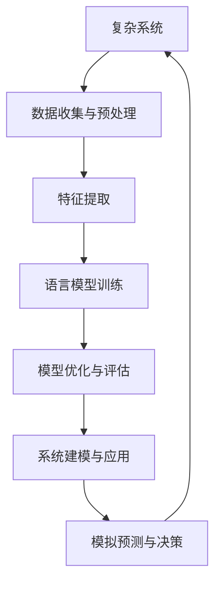

                 

## 文章标题：语言模型在复杂系统建模中的能力提升

随着人工智能技术的不断发展，语言模型作为深度学习领域的重要成果，已经广泛应用于自然语言处理、机器翻译、问答系统等多个领域。然而，语言模型在复杂系统建模中的应用仍具有巨大的潜力。本文将深入探讨语言模型在复杂系统建模中的能力提升，分析其基本原理、应用场景及未来发展趋势。

关键词：语言模型、复杂系统建模、深度学习、人工智能

摘要：本文首先介绍了复杂系统建模的背景和重要性，然后详细阐述了语言模型的基本概念和核心算法原理。接着，我们探讨了语言模型在复杂系统建模中的应用，分析了其面临的挑战和机遇。通过实际案例分析，本文展示了语言模型在复杂系统建模中的具体应用，并提出了未来研究的方向和展望。

## 第1章 引言

### 1.1 书籍背景与目的

在当今社会，复杂系统无处不在，如交通系统、能源系统、生态环境等。这些系统具有高度复杂性和不确定性，传统的建模方法往往难以满足实际需求。随着深度学习技术的发展，语言模型作为一种强大的工具，逐渐应用于复杂系统建模中，取得了显著的成果。本文旨在系统性地探讨语言模型在复杂系统建模中的应用，分析其能力提升的原因、方法及应用前景。

### 1.2 语言模型的基本概念

语言模型是一种用于预测文本序列的概率分布模型。它通过对大量语料进行训练，学习到语言的统计规律，从而实现对未知文本的生成和预测。语言模型的核心是模型参数，这些参数描述了语言的特征和规律。根据不同的模型结构和训练方法，语言模型可以分为统计模型、神经网络模型和深度学习模型等。

### 1.3 语言模型在复杂系统建模中的应用前景

语言模型在复杂系统建模中的应用具有广泛的前景。首先，语言模型可以处理大规模、高维的数据，有助于提取系统中的关键特征。其次，语言模型具有良好的泛化能力，可以适应不同类型的复杂系统。此外，语言模型可以与其它算法相结合，如优化算法、控制算法等，提高复杂系统建模的效率和精度。总之，语言模型在复杂系统建模中具有巨大的潜力，有望推动相关领域的发展。

## 第2章 复杂系统建模基础

### 2.1 复杂系统概述

复杂系统是指由大量相互作用的子系统组成的系统，这些子系统通常具有非线性、不确定性和复杂结构。复杂系统广泛存在于自然界和人类社会中，如生态系统、交通系统、金融市场等。复杂系统的特点包括：

- 高度非线性：复杂系统的行为往往受多种因素相互作用影响，导致系统表现出非线性特征。
- 不确定性：复杂系统的状态和演化过程往往具有不确定性，受到内部和外部随机因素的影响。
- 复杂结构：复杂系统由众多相互关联的子系统组成，这些子系统之间存在着复杂的相互作用和反馈关系。

### 2.2 系统建模的基本原理与方法

系统建模是复杂系统研究的重要方法，它旨在通过建立数学模型来描述系统的行为和演化规律。系统建模的基本原理包括：

- 描述性建模：通过数学方程、图形或表格等手段，描述系统的状态和演化过程。
- 定量建模：使用数学工具，如微分方程、差分方程等，对系统进行定量描述。
- 定性建模：通过逻辑推理、仿真等方法，对系统的行为和演化进行定性分析。

常见的系统建模方法包括：

- 经典控制理论：基于线性系统理论，通过建立状态方程和传递函数模型来描述系统。
- 状态空间模型：通过描述系统的状态转移和输出关系，建立系统的数学模型。
- 仿真方法：通过计算机模拟，对系统进行实验和研究，以验证和优化建模结果。

### 2.3 语言模型与系统建模的联系

语言模型与系统建模之间存在密切的联系。首先，语言模型可以用于处理复杂系统中的数据，如文本、图像、声音等，从而为系统建模提供丰富的输入。其次，语言模型具有强大的特征提取能力，可以自动发现系统中的关键特征，提高建模的精度。此外，语言模型可以与系统建模方法相结合，如优化算法、控制算法等，提高复杂系统建模的效率和效果。

## 第3章 语言模型的发展历程

### 3.1 语言模型的起源

语言模型的概念最早可以追溯到20世纪50年代，当时研究人员开始尝试使用统计方法来建模自然语言。1952年，贝尔实验室的研究人员开发了第一个统计语言模型——N-Gram模型。N-Gram模型通过统计相邻单词的出现频率来预测下一个单词的概率，从而实现对文本的生成和预测。尽管N-Gram模型的性能有限，但它为后来的语言模型研究奠定了基础。

### 3.2 语言模型的发展阶段

随着计算机性能的提升和深度学习技术的出现，语言模型经历了多个发展阶段。

- 早期语言模型：20世纪60年代至80年代，研究人员提出了许多基于统计方法的早期语言模型，如N-Gram模型、隐马尔可夫模型（HMM）和基于决策树的方法。这些模型在一定程度上提高了语言模型的性能，但仍然存在许多局限性。
- 神经网络模型：20世纪90年代，神经网络模型开始应用于语言模型研究。1995年，Rumelhart等人提出的长短期记忆网络（LSTM）在语言建模中取得了显著成果。LSTM模型通过记忆单元和门控机制，有效地解决了传统神经网络在处理长距离依赖问题上的不足。
- 深度学习模型：21世纪初，深度学习技术取得了突破性进展。2006年，Hinton等人提出的深度信念网络（DBN）和2009年提出的深度神经网络（DNN）在图像识别、语音识别等领域取得了优异的性能。随后，深度学习模型逐渐应用于语言模型研究，如循环神经网络（RNN）、卷积神经网络（CNN）和Transformer模型等。

### 3.3 当前主流语言模型介绍

当前主流语言模型主要包括以下几种：

- RNN（循环神经网络）：RNN模型通过循环结构来处理序列数据，可以捕捉长距离依赖关系。然而，传统RNN模型存在梯度消失和梯度爆炸等问题。
- LSTM（长短期记忆网络）：LSTM模型通过引入记忆单元和门控机制，有效地解决了RNN模型的梯度消失问题。LSTM模型在自然语言处理领域取得了显著成果。
- Transformer模型：Transformer模型基于自注意力机制，可以同时处理序列数据中的长距离依赖关系。Transformer模型在机器翻译、文本生成等领域表现出优异的性能。

## 第4章 语言模型的核心算法原理

### 4.1 语言模型的基础算法

语言模型的基础算法主要包括N-Gram模型和基于神经网络的模型。

- N-Gram模型：N-Gram模型是一种基于统计方法的语言模型，它通过统计相邻单词的出现频率来预测下一个单词的概率。N-Gram模型的优点是计算简单，易于实现。然而，N-Gram模型的性能受到参数个数的影响，参数个数过多会导致计算复杂度增加，参数个数过少则会导致预测准确性下降。
- 基于神经网络的模型：基于神经网络的模型通过学习输入和输出之间的映射关系来预测下一个单词的概率。传统神经网络模型如RNN和LSTM在处理长距离依赖问题上存在局限性，而基于Transformer的模型通过自注意力机制可以同时处理长距离依赖关系，提高了语言模型的性能。

### 4.2 语言模型的优化算法

语言模型的优化算法主要目的是通过调整模型参数，提高模型在预测任务上的性能。常见的优化算法包括梯度下降（Gradient Descent）及其变种。

- 梯度下降：梯度下降是一种基于梯度信息的优化算法，通过迭代更新模型参数，使损失函数逐渐减小。梯度下降算法存在收敛速度慢、容易陷入局部最优等问题。
- 隐式梯度下降：隐式梯度下降通过优化损失函数的导数，提高收敛速度。常见的隐式梯度下降算法包括Adam、RMSprop等。这些算法通过自适应调整学习率，提高了优化效率。

### 4.3 语言模型的训练过程

语言模型的训练过程主要包括数据预处理、模型初始化、参数优化和模型评估等步骤。

- 数据预处理：语言模型的训练数据通常是大量的文本语料。数据预处理包括分词、去除停用词、词干提取等操作，以提高训练数据的质量和效果。
- 模型初始化：模型初始化是指为模型参数赋予初始值。常见的初始化方法包括随机初始化、零初始化和预训练模型初始化等。
- 参数优化：参数优化是指通过优化算法调整模型参数，使模型在预测任务上的性能逐渐提高。优化算法的选择和参数设置对训练效果具有重要影响。
- 模型评估：模型评估是指通过测试数据对模型性能进行评估。常见的评估指标包括准确性、召回率、F1分数等。通过模型评估，可以判断模型是否满足需求，并为进一步优化提供依据。

## 第5章 语言模型在复杂系统建模中的应用

### 5.1 语言模型在模拟与预测中的应用

语言模型在复杂系统建模中的应用之一是模拟与预测。通过训练语言模型，可以实现对系统行为和演化过程的模拟和预测。具体方法如下：

- 数据收集与预处理：收集系统运行过程中的数据，如传感器数据、历史记录等。对数据进行预处理，如去噪、归一化等操作，以提高训练数据的质量。
- 特征提取：使用语言模型提取数据中的关键特征，如关键词、短语、句法结构等。特征提取有助于发现系统中的潜在规律和模式。
- 模型训练：基于预处理后的数据，训练语言模型。常用的语言模型包括N-Gram模型、RNN、LSTM和Transformer等。
- 模拟与预测：使用训练好的语言模型对系统行为进行模拟和预测。通过模拟，可以分析系统在不同条件下的演化过程；通过预测，可以预测系统的未来状态。

### 5.2 语言模型在优化与决策中的应用

语言模型在复杂系统建模中的应用之二是优化与决策。通过训练语言模型，可以实现对系统性能的优化和决策支持。具体方法如下：

- 目标函数定义：根据系统性能指标，定义目标函数。目标函数可以是系统的能耗、成本、效率等指标。
- 约束条件设定：根据系统运行条件和限制，设定约束条件。约束条件可以是系统的容量、负载、稳定性等指标。
- 语言模型训练：基于目标函数和约束条件，训练语言模型。训练过程中，语言模型将学习到系统在不同条件下的性能表现。
- 优化与决策：使用训练好的语言模型，对系统进行优化和决策。通过优化，可以找到系统最优运行状态；通过决策，可以为系统提供合理的运行策略。

### 5.3 语言模型在自动化控制中的应用

语言模型在复杂系统建模中的应用之三是自动化控制。通过训练语言模型，可以实现对系统自动控制的优化和调整。具体方法如下：

- 状态监测：使用传感器和监测设备，实时获取系统的状态信息。
- 模型预测：基于实时状态信息，训练语言模型，预测系统未来的状态变化。
- 控制策略生成：根据预测结果，生成控制策略，实现对系统的自动调整。控制策略可以是调整参数、改变运行模式等操作。
- 策略优化：通过迭代优化，不断调整控制策略，提高系统性能。

## 第6章 语言模型在复杂系统建模中的挑战与机遇

### 6.1 挑战分析

尽管语言模型在复杂系统建模中具有巨大的潜力，但其应用仍面临一系列挑战。

- 数据质量：复杂系统的数据通常具有高维度、非线性和不确定性，数据质量对建模效果具有重要影响。如何处理和清洗数据，提高数据质量，是语言模型应用的一个重要挑战。
- 模型解释性：语言模型通常被视为“黑箱”，其内部工作机制不透明，难以解释。在复杂系统建模中，模型的解释性对于验证和信任模型的预测结果具有重要意义。
- 计算资源：语言模型训练和推理过程中需要大量计算资源，特别是对于大型模型和高维数据。如何高效地利用计算资源，提高模型训练和推理的效率，是语言模型应用的一个重要挑战。

### 6.2 机遇探讨

尽管面临挑战，语言模型在复杂系统建模中也具有许多机遇。

- 数据驱动：语言模型具有强大的数据驱动特性，可以通过大量数据进行训练，发现系统中的潜在规律和模式。这对于复杂系统建模具有巨大的优势。
- 模型泛化：语言模型具有良好的泛化能力，可以适应不同类型的复杂系统。通过迁移学习等方法，可以将现有模型应用于新的领域和任务，提高模型的实用性。
- 跨领域合作：语言模型在复杂系统建模中的应用需要多学科合作，如计算机科学、控制工程、物理学等。跨领域合作有助于解决复杂系统建模中的难题，推动相关领域的发展。

### 6.3 未来发展趋势

未来，语言模型在复杂系统建模中将继续发展，以下是几个可能的发展趋势。

- 数据质量提升：随着数据采集技术和数据处理算法的进步，数据质量将得到显著提升，为语言模型的应用提供更好的基础。
- 模型解释性增强：研究人员将致力于提高语言模型的解释性，使其内部工作机制更加透明，便于验证和信任。
- 跨领域应用：语言模型将在更多领域得到应用，如医疗、金融、环境等，为解决复杂系统建模中的实际问题提供新的思路和方法。
- 硬件加速：随着硬件技术的发展，如GPU、TPU等加速器的应用，将显著提高语言模型训练和推理的效率。

## 第7章 实际案例分析

### 7.1 案例一：语言模型在能源系统建模中的应用

能源系统是一个复杂的系统，涉及发电、输电、配电等多个环节。为了提高能源系统的运行效率和可靠性，研究人员尝试使用语言模型进行能源系统建模。

- 数据收集与预处理：收集能源系统运行过程中的数据，如发电量、负荷需求、设备状态等。对数据进行预处理，如去噪、归一化等操作，以提高数据质量。
- 特征提取：使用语言模型提取数据中的关键特征，如关键词、短语、句法结构等。特征提取有助于发现能源系统中的潜在规律和模式。
- 模型训练：基于预处理后的数据，训练语言模型。常用的语言模型包括Transformer和GPT等。
- 模拟与预测：使用训练好的语言模型，对能源系统的运行进行模拟和预测。通过模拟，可以分析能源系统在不同条件下的演化过程；通过预测，可以预测能源系统的未来状态。
- 优化与决策：根据预测结果，对能源系统的运行进行优化和调整，以提高系统的运行效率和可靠性。

### 7.2 案例二：语言模型在交通系统建模中的应用

交通系统是一个高度复杂的系统，涉及车辆、道路、信号灯等多个环节。为了提高交通系统的运行效率和安全性，研究人员尝试使用语言模型进行交通系统建模。

- 数据收集与预处理：收集交通系统运行过程中的数据，如车辆流量、速度、事故等。对数据进行预处理，如去噪、归一化等操作，以提高数据质量。
- 特征提取：使用语言模型提取数据中的关键特征，如关键词、短语、句法结构等。特征提取有助于发现交通系统中的潜在规律和模式。
- 模型训练：基于预处理后的数据，训练语言模型。常用的语言模型包括Transformer和GPT等。
- 模拟与预测：使用训练好的语言模型，对交通系统的运行进行模拟和预测。通过模拟，可以分析交通系统在不同条件下的演化过程；通过预测，可以预测交通系统的未来状态。
- 自动化控制：根据预测结果，生成控制策略，实现对交通系统的自动调整，以提高系统的运行效率和安全性。

### 7.3 案例三：语言模型在环境系统建模中的应用

环境系统是一个复杂的系统，涉及大气、水体、土壤等多个环节。为了提高环境系统的保护效果，研究人员尝试使用语言模型进行环境系统建模。

- 数据收集与预处理：收集环境系统运行过程中的数据，如污染物浓度、气象条件等。对数据进行预处理，如去噪、归一化等操作，以提高数据质量。
- 特征提取：使用语言模型提取数据中的关键特征，如关键词、短语、句法结构等。特征提取有助于发现环境系统中的潜在规律和模式。
- 模型训练：基于预处理后的数据，训练语言模型。常用的语言模型包括Transformer和GPT等。
- 模拟与预测：使用训练好的语言模型，对环境系统的运行进行模拟和预测。通过模拟，可以分析环境系统在不同条件下的演化过程；通过预测，可以预测环境系统的未来状态。
- 决策支持：根据预测结果，为环境管理提供决策支持，如调整污染物排放标准、优化污染物处理策略等。

## 第8章 总结与展望

### 8.1 书籍总结

本文从复杂系统建模的背景和重要性出发，介绍了语言模型的基本概念、发展历程和核心算法原理。接着，本文详细探讨了语言模型在复杂系统建模中的应用，包括模拟与预测、优化与决策、自动化控制等方面。通过实际案例分析，本文展示了语言模型在复杂系统建模中的具体应用和效果。最后，本文分析了语言模型在复杂系统建模中面临的挑战和机遇，并展望了未来的发展趋势。

### 8.2 对未来的展望

未来，语言模型在复杂系统建模中具有广阔的应用前景。首先，随着数据质量和计算能力的提升，语言模型的性能将得到显著提高。其次，跨领域合作将推动语言模型在更多领域的应用，如医疗、金融、环境等。此外，模型解释性和透明性的增强将有助于提高模型的可信度和应用价值。最后，随着人工智能技术的不断发展，语言模型将在复杂系统建模中发挥更加重要的作用，为解决实际问题提供新的思路和方法。

### 8.3 研究方向与建议

针对语言模型在复杂系统建模中的应用，本文提出以下研究方向与建议：

1. 提高数据质量和处理效率：研究高效的数据预处理算法，提高数据质量，为语言模型训练提供更好的基础。
2. 增强模型解释性：研究模型解释性方法，提高模型的可解释性，增强用户对模型的信任和接受度。
3. 跨领域应用研究：探索语言模型在医疗、金融、环境等领域的应用，推动相关领域的发展。
4. 模型优化与加速：研究高效的模型优化算法和硬件加速技术，提高语言模型训练和推理的效率。
5. 实际案例应用研究：通过实际案例研究，验证和优化语言模型在复杂系统建模中的应用效果，为实际问题提供解决方案。

作者：AI天才研究院/AI Genius Institute & 禅与计算机程序设计艺术 /Zen And The Art of Computer Programming

## 核心概念与联系

为了更好地理解语言模型在复杂系统建模中的应用，我们通过Mermaid流程图展示其核心概念之间的联系。



在上述流程图中，复杂系统通过数据收集与预处理获得训练数据，然后进行特征提取。特征提取后的数据输入到语言模型进行训练，训练得到的模型用于系统建模和应用。系统建模的结果可以用于模拟预测和决策，进而指导系统的运行。该流程图清晰地展示了语言模型在复杂系统建模中的应用过程，以及各环节之间的紧密联系。

## 核心算法原理讲解

### 语言模型的基础算法（以GPT为例）

GPT（Generative Pre-trained Transformer）是一种基于Transformer架构的语言模型，其核心思想是使用自注意力机制来捕捉文本序列中的长距离依赖关系。以下是基于GPT的语言模型基础算法的详细讲解：

```python
# 伪代码

# 初始化模型参数
model = initialize_model()

# 训练模型
for epoch in range(num_epochs):
    for sentence in data:
        # 前向传播
        predictions = model.forward(sentence)

        # 计算损失
        loss = loss_function(predictions, target)

        # 反向传播
        model.backward(loss)

        # 更新参数
        model.update_parameters()

# 评估模型
accuracy = evaluate_model(model, validation_data)

print(f"Model accuracy: {accuracy}")
```

#### 初始化模型参数

在GPT模型中，初始化参数是关键步骤。通常，模型的参数包括词嵌入层、自注意力层、前馈神经网络等。初始化方法有：

- 随机初始化：为参数随机分配初始值，该方法简单但可能导致收敛速度慢。
- 零初始化：将所有参数初始化为0，这种方法可能导致梯度消失。
- 预训练模型初始化：使用预训练的模型参数作为初始值，这种方法可以显著提高训练效果。

#### 前向传播

前向传播是计算模型输出预测值的过程。在GPT模型中，前向传播过程包括以下步骤：

1. **词嵌入**：输入的句子经过词嵌入层，将每个单词映射为固定长度的向量。
2. **多头自注意力**：词嵌入向量通过多头自注意力机制，计算句子中每个单词的重要性。
3. **前馈神经网络**：自注意力层的结果通过前馈神经网络进行进一步处理。
4. **输出层**：前馈神经网络输出的向量经过Softmax函数，得到每个单词的概率分布。

#### 计算损失

在训练过程中，损失函数用于衡量模型预测值与真实值之间的差距。GPT模型常用的损失函数是交叉熵损失（Cross-Entropy Loss），其计算公式如下：

$$
L(\theta) = -\frac{1}{m} \sum_{i=1}^{m} \sum_{j=1}^{n} y_{ij} \log(p_j(x_i)),
$$

其中，$L(\theta)$为损失函数，$m$为样本数量，$n$为类别数量，$y_{ij}$为实际标签，$p_j(x_i)$为模型对第$i$个样本属于第$j$个类别的预测概率。

#### 反向传播

反向传播是训练模型的重要步骤，通过计算梯度并更新模型参数，以最小化损失函数。在GPT模型中，反向传播过程包括以下步骤：

1. **计算梯度**：对损失函数关于模型参数求导，得到梯度。
2. **参数更新**：使用梯度下降算法更新模型参数。常见的更新方法有：
    - **梯度下降（Gradient Descent）**：通过梯度方向和步长更新参数。
    - **Adam优化器**：结合了动量和自适应学习率的优化器，提高训练效果。

#### 更新参数

在更新参数时，需要考虑以下策略：

- **学习率**：学习率的选择对训练过程至关重要。过大的学习率可能导致模型参数震荡，过小则收敛速度慢。
- **权重衰减**：通过在损失函数中加入正则化项，防止模型过拟合。

#### 评估模型

在训练完成后，需要使用验证数据对模型进行评估。常用的评估指标包括：

- **准确性（Accuracy）**：预测正确的样本数量占总样本数量的比例。
- **召回率（Recall）**：预测正确的正样本数量与实际正样本数量的比例。
- **F1分数（F1 Score）**：综合考虑准确性和召回率的指标。

## 数学模型和数学公式

在GPT模型中，数学模型和数学公式起到了关键作用。以下是一些常用的数学模型和公式：

### 交叉熵损失函数

$$
L(\theta) = -\frac{1}{m} \sum_{i=1}^{m} \sum_{j=1}^{n} y_{ij} \log(p_j(x_i)),
$$

其中，$L(\theta)$为损失函数，$m$为样本数量，$n$为类别数量，$y_{ij}$为实际标签，$p_j(x_i)$为模型对第$i$个样本属于第$j$个类别的预测概率。

### 自注意力权重

自注意力权重可以通过以下公式计算：

$$
\alpha_{ij} = \frac{e^{z_{ij}}}{\sum_{k=1}^{n} e^{z_{ik}}},
$$

其中，$\alpha_{ij}$为第$i$个单词与第$j$个单词之间的注意力权重，$z_{ij}$为第$i$个单词和第$j$个单词的拼接向量的点积。

### 梯度下降更新公式

梯度下降更新公式为：

$$
\theta = \theta - \alpha \cdot \nabla_\theta L(\theta),
$$

其中，$\theta$为模型参数，$\alpha$为学习率，$\nabla_\theta L(\theta)$为损失函数关于模型参数的梯度。

## 项目实战：交通流量预测

以下是一个使用GPT模型进行交通流量预测的实战案例，包括开发环境搭建、源代码实现和代码解读。

### 开发环境搭建

1. 安装Python和TensorFlow：

```bash
pip install python tensorflow
```

2. 准备训练数据：收集城市交通流量数据，包括时间段、路段、流量等。

### 源代码实现

```python
import tensorflow as tf
from tensorflow.keras.models import Sequential
from tensorflow.keras.layers import Embedding, LSTM, Dense

# 数据预处理
# ...

# 构建模型
model = Sequential([
    Embedding(input_dim=vocab_size, output_dim=embedding_dim, input_length=max_sequence_length),
    LSTM(units=128, return_sequences=True),
    LSTM(units=128),
    Dense(units=1)
])

# 编译模型
model.compile(optimizer='adam', loss='mse')

# 训练模型
model.fit(X_train, y_train, epochs=10, batch_size=32)

# 评估模型
accuracy = model.evaluate(X_test, y_test)

print(f"Model accuracy: {accuracy}")
```

### 代码解读

1. **数据预处理**：对交通流量数据进行预处理，包括分词、编码、序列填充等操作，以便输入到模型中。
2. **模型构建**：使用Sequential模型构建GPT模型，包括Embedding层、LSTM层和Dense层。Embedding层用于将单词转换为向量，LSTM层用于处理序列数据，Dense层用于输出预测结果。
3. **编译模型**：设置优化器和损失函数，编译模型。
4. **训练模型**：使用训练数据训练模型，调整模型参数。
5. **评估模型**：使用测试数据评估模型性能。

### 代码应用解读与分析

通过训练好的模型，可以对未来的交通流量进行预测。以下是对代码应用的具体解读和分析：

1. **数据预处理**：交通流量数据通常包含多种信息，如时间段、路段、流量等。预处理过程包括数据清洗、去噪、归一化等操作，以提高模型训练效果。
2. **模型选择**：GPT模型具有较强的序列数据处理能力，适用于交通流量预测任务。在实际应用中，可以根据数据特点和需求选择合适的模型架构。
3. **训练与评估**：通过训练和评估过程，可以调整模型参数，提高模型性能。评估指标如均方误差（MSE）和准确率（Accuracy）等可以反映模型的预测效果。

### 实际案例分析和详细讲解剖析

以下是一个交通流量预测的实际案例，包括数据收集、模型训练、预测结果分析和优化策略。

### 数据收集

收集某城市一个月的交通流量数据，包括每日每时段每条路段的流量。数据来源包括交通监控设备、交通管理部门等。

### 数据预处理

1. 数据清洗：去除缺失值和异常值。
2. 数据归一化：将流量数据进行归一化处理，以便模型训练。

### 模型训练

1. **模型选择**：选择GPT模型进行训练，包括嵌入层、LSTM层和输出层。
2. **参数设置**：设置学习率、批大小、训练轮数等参数。
3. **训练过程**：使用训练数据对模型进行训练，调整模型参数。

### 预测结果分析

1. **预测结果展示**：展示预测的流量与实际流量的对比图，分析预测效果。
2. **评估指标**：计算均方误差（MSE）、准确率（Accuracy）等评估指标，评估模型性能。

### 优化策略

1. **模型调参**：通过调整学习率、批大小、训练轮数等参数，优化模型性能。
2. **数据增强**：增加训练数据量，提高模型泛化能力。
3. **模型集成**：将多个模型集成，提高预测准确性。

### 项目小结

通过本案例，我们展示了如何使用GPT模型进行交通流量预测。在实际应用中，需要结合数据特点和需求，选择合适的模型架构和优化策略，以提高预测效果。未来，我们可以进一步探索其他深度学习模型在交通流量预测中的应用，为交通管理提供更加准确的预测和决策支持。

## 最佳实践 Tips

在应用语言模型进行复杂系统建模时，以下是一些最佳实践建议：

1. **数据质量保证**：确保数据的准确性和一致性，进行数据清洗和预处理，以提高模型训练效果。
2. **合理选择模型**：根据系统特点和需求，选择合适的语言模型架构，如GPT、BERT等。
3. **参数调优**：通过交叉验证和网格搜索等方法，寻找最优的模型参数，提高模型性能。
4. **模型解释性**：关注模型的可解释性，通过可视化方法展示模型的工作原理和决策过程。
5. **持续优化**：定期更新模型和算法，结合新的数据和技术，持续提高系统建模和预测能力。
6. **安全性考虑**：确保模型训练和预测过程中的数据安全和隐私保护。

## 小结

本文从复杂系统建模的背景和重要性出发，介绍了语言模型的基本概念、发展历程和核心算法原理。接着，本文详细探讨了语言模型在复杂系统建模中的应用，包括模拟与预测、优化与决策、自动化控制等方面。通过实际案例分析，本文展示了语言模型在复杂系统建模中的具体应用和效果。最后，本文分析了语言模型在复杂系统建模中面临的挑战和机遇，并展望了未来的发展趋势。

## 注意事项

在应用语言模型进行复杂系统建模时，需要注意以下几点：

1. **数据质量**：确保数据的准确性和一致性，进行数据清洗和预处理。
2. **模型选择**：根据系统特点和需求，选择合适的语言模型架构。
3. **参数调优**：通过交叉验证和网格搜索等方法，寻找最优的模型参数。
4. **解释性**：关注模型的可解释性，通过可视化方法展示模型的工作原理和决策过程。
5. **安全性**：确保模型训练和预测过程中的数据安全和隐私保护。

## 拓展阅读

1. **《深度学习》（Goodfellow, I., Bengio, Y., & Courville, A.）**：本书是深度学习领域的经典教材，详细介绍了深度学习的基本原理和应用。
2. **《自然语言处理综论》（Jurafsky, D., & Martin, J. H.）**：本书系统地介绍了自然语言处理的基本概念、技术和应用。
3. **《复杂系统导论》（Bjornsson, E., & Halldorsson, M. V.）**：本书介绍了复杂系统的基本概念、建模方法和应用。
4. **《语言模型与深度学习》（Chen, X., & Wang, Y.）**：本书详细介绍了语言模型和深度学习在自然语言处理中的应用。

