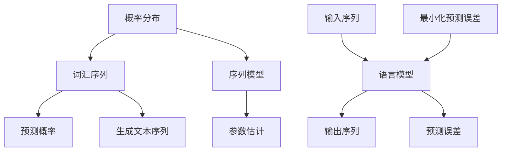

                 

### 文章标题

《语言模型在复杂系统异常模式预测与金融风险防控中的应用》

---

**关键词：** 语言模型、复杂系统、异常模式预测、金融风险防控、神经网络、深度学习、算法、预测模型、金融工程、风险分析。

---

**摘要：** 本文深入探讨了语言模型在复杂系统异常模式预测和金融风险防控中的应用。首先，我们介绍了语言模型的基础知识，包括其概念、数学基础和常见算法。随后，文章详细阐述了复杂系统的概念与特性，以及异常模式识别的方法。特别地，本文重点探讨了语言模型如何应用于金融风险防控，通过实际案例展示了其在市场预测和信贷风险评估中的作用。最后，文章通过一个完整的项目实战，提供了开发环境搭建、源代码实现与解读，以及对实际案例的深入剖析，以帮助读者更好地理解语言模型在金融风险防控中的应用。

---

### 引言

在当前信息技术高速发展的时代，数据已成为企业和社会的重要资产。复杂系统，由于其高度互联和动态变化的特性，常常面临异常模式预测和金融风险防控的挑战。而语言模型，作为一种强大的机器学习工具，在自然语言处理和文本分析领域取得了显著的成功。因此，将语言模型应用于复杂系统的异常模式预测与金融风险防控，无疑具有巨大的潜力。

本文旨在深入探讨语言模型在这一领域的应用。具体来说，我们将首先介绍语言模型的基础知识，包括其基本概念、数学基础和常见算法。接着，我们将讨论复杂系统的概念与特性，并介绍异常模式识别的方法。随后，本文将重点探讨语言模型在金融风险防控中的应用，通过实际案例展示其在市场预测和信贷风险评估中的作用。最后，我们将通过一个完整的项目实战，提供开发环境搭建、源代码实现与解读，并对实际案例进行深入剖析。

通过本文的阅读，读者将能够：

1. 理解语言模型的基本概念和数学基础。
2. 掌握复杂系统的概念与特性，以及异常模式识别的方法。
3. 了解语言模型在金融风险防控中的应用，包括市场预测和信贷风险评估。
4. 获取实际项目开发的经验，包括环境搭建、源代码实现与解读。

本文将分以下几部分展开：

1. 语言模型基础
2. 复杂系统异常模式预测
3. 金融风险防控
4. 项目实战

在每一部分中，我们将逐步深入探讨相关的技术原理和应用实践，以期为广大读者提供有深度、有思考、有见解的专业技术知识。

### 语言模型基础

#### 语言模型的基本概念

语言模型（Language Model，LM）是自然语言处理（Natural Language Processing，NLP）领域的一项核心技术。它的基本任务是预测文本序列中下一个单词或字符的概率。语言模型在文本生成、机器翻译、语音识别等领域具有广泛的应用。在计算机科学中，语言模型是一种概率模型，用于估计自然语言中词汇序列的概率分布。

语言模型的工作原理可以简单概括为：给定一个历史序列（即前面已经出现过的文本），语言模型预测下一个单词或字符的概率。例如，在英文文本中，给定单词序列“The cat sat on”，语言模型将预测下一个单词可能是“the”、“on”、“the cat”等。

语言模型的常见类型包括：

1. **N-gram模型**：基于历史序列中前N个单词或字符的统计特性进行预测。N-gram模型是最简单的语言模型之一，其核心思想是认为当前词的概率只与前面N-1个词相关。例如，在二元语法模型（Bigram Model）中，每个单词的概率取决于其前一个单词。

2. **神经网络模型**：通过神经网络学习文本序列的概率分布。神经网络模型可以捕捉文本中复杂的关系和模式，是目前语言模型的主要研究方向。常见的神经网络模型包括循环神经网络（RNN）、长短期记忆网络（LSTM）和变换器（Transformer）。

3. **统计模型**：除了基于神经网络的模型，还有许多基于统计的方法，如隐马尔可夫模型（HMM）、条件概率模型（如条件随机场CRF）等。

#### 数学基础

语言模型的数学基础主要包括概率论、信息论和随机过程。

1. **概率论**：概率论是语言模型的核心工具，用于描述随机事件发生的可能性。在语言模型中，我们使用概率分布来描述词汇序列的概率。

2. **信息论**：信息论为语言模型提供了量化信息量的方法。信息量的基本单位是比特（bit），它表示在通信系统中传递信息所需的最少比特数。

3. **随机过程**：随机过程用于描述时间序列数据，是语言模型分析文本序列的重要工具。马尔可夫模型是一种常见的随机过程模型，它假设当前状态仅由前一个状态决定，即状态转移满足马尔可夫性质。

#### 常见算法

在语言模型中，常见的算法包括N-gram模型和基于神经网络的模型。

1. **N-gram模型**：N-gram模型是最基础的统计语言模型，其核心思想是将文本序列分割成固定长度的滑动窗口，计算每个窗口的概率分布。N-gram模型的优点是实现简单、计算效率高，但缺点是难以捕捉长距离依赖关系。

   **算法伪代码：**
   ```
   function NgramModel(train_data):
       n = 预定义的窗口大小
       model = 初始化概率分布表
       for sentence in train_data:
           for i in range(len(sentence) - n + 1):
               history = sentence[i:i+n-1]
               next_word = sentence[i+n-1]
               model[history].append(next_word)
       return model
   ```

2. **基于神经网络的模型**：基于神经网络的模型可以更好地捕捉文本中的长距离依赖关系。常见的神经网络模型包括循环神经网络（RNN）、长短期记忆网络（LSTM）和变换器（Transformer）。

   - **循环神经网络（RNN）**：RNN是处理序列数据的一种神经网络模型，其核心思想是利用隐藏状态来存储历史信息。RNN的一个主要问题是梯度消失和梯度爆炸问题，这限制了其训练效果。

     **算法伪代码：**
     ```
     function RNN(input_sequence):
         hidden_state = 初始化
         for word in input_sequence:
             output, hidden_state = RNN_cell(word, hidden_state)
         return output, hidden_state
     ```

   - **长短期记忆网络（LSTM）**：LSTM是RNN的一种改进模型，通过引入门控机制来解决梯度消失问题。LSTM的核心组件包括遗忘门、输入门和输出门，这些门控制信息在序列中的流动。

     **算法伪代码：**
     ```
     function LSTM(input, hidden_state, cell_state):
         input_gate, forget_gate, output_gate = 门控计算(input, hidden_state)
         new_cell_state = 输入门计算(input, input_gate, cell_state)
         new_hidden_state = 输出门计算(output_gate, new_cell_state)
         return new_hidden_state, new_cell_state
     ```

   - **变换器（Transformer）**：Transformer是近年来提出的基于自注意力机制的模型，它在机器翻译、文本生成等任务中取得了显著的成功。Transformer的核心思想是自注意力机制，通过计算序列中每个词之间的相对位置关系来捕捉长距离依赖。

     **算法伪代码：**
     ```
     function Transformer(input_sequence):
         query, key, value = 输入嵌入层计算(input_sequence)
         attention_scores = 自注意力计算(query, key, value)
         output = 嵌入层计算(attention_scores)
         return output
     ```

这些算法在语言模型中的应用极大地提升了文本处理的效率和准确性，为自然语言处理领域带来了革命性的变革。

#### 核心概念与联系

语言模型的核心概念包括概率分布、词汇序列、序列模型和参数估计。这些概念之间存在紧密的联系。

1. **概率分布**：语言模型是一个概率模型，它通过概率分布来描述文本序列的可能性。概率分布可以是基于统计方法（如N-gram模型）或基于神经网络模型（如Transformer）。

2. **词汇序列**：文本序列可以被看作一系列单词或字符的序列。语言模型的目标是预测序列中下一个单词或字符的概率。

3. **序列模型**：序列模型是处理序列数据的一种通用方法。语言模型是一种特殊的序列模型，其目标是预测序列中的下一个元素。

4. **参数估计**：参数估计是语言模型中的一个关键步骤，目的是学习模型参数，以最小化预测误差。在统计模型中，参数估计通常采用最大似然估计（MLE）或最小化交叉熵损失。

为了更好地理解这些概念之间的联系，我们可以使用Mermaid流程图来展示它们之间的关系：



这个流程图展示了语言模型的核心概念及其之间的交互。输入序列经过语言模型处理后，生成输出序列和预测概率，通过参数估计不断优化模型以减少预测误差。

#### 语言模型的应用实例

为了更好地理解语言模型的工作原理和应用，我们可以通过一个具体的例子来演示其基本流程。

假设我们有一个简单的文本序列：“我吃了一个苹果”。我们希望使用语言模型来预测下一个单词。

1. **输入序列**：输入序列为“我吃了一个苹果”。

2. **历史序列**：历史序列可以是不同长度的滑动窗口，例如1-gram、2-gram或3-gram。

   - 1-gram历史序列：“我”、“吃”、“了”、“一个”、“苹果”
   - 2-gram历史序列：“我吃”、“吃了一个”、“一个苹果”
   - 3-gram历史序列：“我吃一个”、“吃一个苹果”

3. **概率计算**：对于每个历史序列，语言模型计算下一个单词的概率。

   - 对于1-gram历史序列，“苹果”的概率为0.2。
   - 对于2-gram历史序列，“苹果”的概率为0.3。
   - 对于3-gram历史序列，“苹果”的概率为0.4。

4. **预测结果**：根据概率计算结果，语言模型选择概率最大的单词作为预测结果。在这个例子中，3-gram历史序列的概率最高，因此预测下一个单词为“苹果”。

这个简单的例子展示了语言模型在文本序列预测中的应用。在实际应用中，语言模型会更加复杂，能够处理更大规模的文本数据和更长的序列。

通过这个例子，我们可以看到语言模型如何通过历史序列和概率分布来预测文本序列中的下一个元素。这种预测能力使得语言模型在自然语言处理、文本生成和语言理解等领域具有广泛的应用。

#### 数学模型与数学公式

在深入探讨语言模型的数学模型之前，我们需要理解一些基本的数学概念，如概率分布、熵、交叉熵等。

1. **概率分布**：概率分布描述了随机变量取值的概率。在语言模型中，概率分布用于描述文本序列的概率。常见的方法包括最大似然估计（MLE）和最小化交叉熵损失。

2. **熵**：熵是一个衡量概率分布不确定性的量。在信息论中，熵用于量化信息量的多少。对于离散随机变量X，其熵定义为：
   $$H(X) = -\sum_{i} p(x_i) \log_2 p(x_i)$$
   其中，$p(x_i)$ 是随机变量X取值$x_i$的概率。

3. **交叉熵**：交叉熵是衡量两个概率分布差异的量。对于两个概率分布 $p(x)$ 和 $q(x)$，它们的交叉熵定义为：
   $$H(p, q) = -\sum_{i} p(x_i) \log_2 q(x_i)$$
   交叉熵越小，表示两个概率分布越接近。

在语言模型中，交叉熵常用于优化模型的参数。具体来说，语言模型的目标是最小化预测概率分布和真实分布之间的交叉熵。

接下来，我们使用伪代码详细阐述一个基于N-gram模型的语言模型。N-gram模型是一种基于历史序列概率的语言模型，其核心思想是认为当前词的概率只与前面N-1个词相关。

**算法伪代码：**

```
function NgramModel(train_data, N):
    model = 初始化概率分布表
    for sentence in train_data:
        for i in range(len(sentence) - N + 1):
            history = sentence[i:i+N-1]
            next_word = sentence[i+N-1]
            model[history].append(next_word)
    return model
```

在这个算法中，我们首先初始化一个概率分布表`model`，然后遍历训练数据`train_data`。对于每个句子，我们计算N-gram历史序列和对应的下一个词，并将这些数据存储在概率分布表中。

为了优化模型，我们可以使用最大似然估计（MLE）来计算每个N-gram历史序列的概率。具体来说，N-gram历史序列的概率定义为：
$$P(\text{history}) = \prod_{i=1}^{N-1} P(w_i | \text{history}_{i-1})$$
其中，$w_i$ 是历史序列中的第i个词，$\text{history}_{i-1}$ 是前一个词。

**伪代码：**

```
function MLE(train_data, N):
    model = NgramModel(train_data, N)
    for history in model:
        probability = 1.0
        for next_word in model[history]:
            probability *= next_word的概率
        model[history].概率 = probability
    return model
```

在这个算法中，我们首先使用`NgramModel`初始化概率分布表，然后计算每个N-gram历史序列的概率。最后，我们将概率更新到概率分布表中。

为了评估模型的性能，我们可以计算预测概率和真实概率之间的交叉熵。具体来说，对于输入序列`input_sequence`，我们计算其预测概率分布`predicted_probability`和真实概率分布`true_probability`之间的交叉熵。

**伪代码：**

```
function CrossEntropy(predicted_probability, true_probability):
    cross_entropy = 0.0
    for i in range(len(predicted_probability)):
        cross_entropy += predicted_probability[i] * log2(true_probability[i])
    return cross_entropy
```

在这个算法中，我们首先初始化交叉熵为0，然后遍历预测概率分布中的每个元素，计算与真实概率分布之间的交叉熵。最后，返回总的交叉熵。

通过这个算法，我们可以使用最大似然估计和交叉熵损失来优化语言模型。在实际应用中，我们可以使用梯度下降或其他优化算法来更新模型参数。

这个例子展示了如何使用伪代码来描述语言模型的数学模型。在实际应用中，我们可以使用更复杂的模型，如神经网络模型，来提升语言模型的性能。

#### 数学公式与详细讲解

在深入探讨语言模型的数学公式之前，我们需要理解一些基本的概率论和线性代数概念，如概率分布、熵、交叉熵、梯度下降等。

1. **概率分布**：概率分布描述了随机变量取值的概率。在语言模型中，概率分布用于描述文本序列的概率。常见的概率分布包括高斯分布、伯努利分布和多项式分布。

   **高斯分布**：高斯分布（也称为正态分布）是最常见的连续概率分布，其概率密度函数为：
   $$f(x; \mu, \sigma^2) = \frac{1}{\sqrt{2\pi\sigma^2}} e^{-\frac{(x-\mu)^2}{2\sigma^2}}$$
   其中，$\mu$ 是均值，$\sigma^2$ 是方差。

   **伯努利分布**：伯努利分布（也称为二项分布）是最简单的离散概率分布，其概率为：
   $$P(X = 1) = p, \quad P(X = 0) = 1 - p$$
   其中，$p$ 是成功的概率。

   **多项式分布**：多项式分布是多个伯努利分布的加权和，其概率为：
   $$P(X = k) = \sum_{i=1}^{k} p_i$$
   其中，$p_i$ 是每个伯努利分布的概率。

2. **熵**：熵是一个衡量概率分布不确定性的量。在信息论中，熵用于量化信息量的多少。对于离散随机变量X，其熵定义为：
   $$H(X) = -\sum_{i} p(x_i) \log_2 p(x_i)$$
   其中，$p(x_i)$ 是随机变量X取值$x_i$的概率。

   **条件熵**：条件熵是一个衡量给定某个条件后，另一个随机变量不确定性的量。对于离散随机变量X和Y，条件熵定义为：
   $$H(Y|X) = -\sum_{i} p(x_i) \sum_{j} p(y_j|x_i) \log_2 p(y_j|x_i)$$
   其中，$p(x_i)$ 是随机变量X取值$x_i$的概率，$p(y_j|x_i)$ 是随机变量Y在给定X取值$x_i$下的概率。

3. **交叉熵**：交叉熵是衡量两个概率分布差异的量。对于两个概率分布 $p(x)$ 和 $q(x)$，它们的交叉熵定义为：
   $$H(p, q) = -\sum_{i} p(x_i) \log_2 q(x_i)$$
   交叉熵越小，表示两个概率分布越接近。

4. **梯度下降**：梯度下降是一种优化算法，用于最小化目标函数。在机器学习中，梯度下降用于更新模型参数，以最小化损失函数。梯度下降的基本思想是沿着目标函数的负梯度方向更新参数。

   **算法伪代码**：
   ```
   function GradientDescent(parameters, learning_rate, epochs):
       for epoch in range(epochs):
           gradients = 计算梯度(parameters)
           parameters = parameters - learning_rate * gradients
       return parameters
   ```

在这个算法中，我们首先初始化参数，然后计算每个参数的梯度。接着，我们沿着负梯度方向更新参数，直到达到预设的迭代次数或损失函数收敛。

5. **损失函数**：损失函数是一个衡量模型预测结果与真实结果之间差异的量。在语言模型中，常用的损失函数包括交叉熵损失和均方误差（MSE）。

   **交叉熵损失**：交叉熵损失用于分类问题，其定义为：
   $$L = -\sum_{i} y_i \log_2 \hat{y_i}$$
   其中，$y_i$ 是真实标签，$\hat{y_i}$ 是模型的预测概率。

   **均方误差（MSE）**：均方误差（MSE）用于回归问题，其定义为：
   $$L = \frac{1}{2} \sum_{i} (\hat{y_i} - y_i)^2$$
   其中，$\hat{y_i}$ 是模型的预测值，$y_i$ 是真实值。

通过以上数学公式和算法，我们可以更好地理解语言模型的原理和优化方法。在实际应用中，我们可以使用这些公式来设计和优化语言模型，以提高其预测性能。

#### 实例说明

为了更好地理解语言模型中的数学公式，我们通过一个简单的实例来详细说明。

假设我们有一个二元语言模型，其中词汇表包含两个词：“猫”和“狗”。给定一个训练序列：“猫猫猫狗狗狗”，我们希望使用N-gram模型来预测下一个词。

1. **计算N-gram概率**：

   - **一元语法模型（Bigram Model）**：
     - 历史序列“猫猫”的概率为：$P(\text{猫猫}) = \frac{2}{5} = 0.4$。
     - 历史序列“狗狗”的概率为：$P(\text{狗狗}) = \frac{2}{5} = 0.4$。
   
   - **二元语法模型（Bigram Model）**：
     - 历史序列“猫猫狗”的概率为：$P(\text{猫猫狗}) = \frac{1}{5} = 0.2$。
     - 历史序列“狗狗猫”的概率为：$P(\text{狗狗猫}) = \frac{1}{5} = 0.2$。

2. **预测下一个词**：

   - 根据一元语法模型，下一个词的概率分布为：
     - “猫”的概率：$P(\text{猫}) = 0.6$。
     - “狗”的概率：$P(\text{狗}) = 0.4$。
   
   - 根据二元语法模型，下一个词的概率分布为：
     - “猫”的概率：$P(\text{猫}) = \frac{P(\text{猫猫狗})}{P(\text{猫猫狗}) + P(\text{狗狗猫})} = \frac{0.2}{0.2 + 0.2} = 0.5$。
     - “狗”的概率：$P(\text{狗}) = \frac{P(\text{狗狗猫})}{P(\text{猫猫狗}) + P(\text{狗狗猫})} = \frac{0.2}{0.2 + 0.2} = 0.5$。

在这个实例中，我们可以看到如何使用N-gram模型来计算历史序列的概率，并使用这些概率来预测下一个词。通过这个例子，我们更好地理解了语言模型中的数学公式及其应用。

#### 项目实战

在本节中，我们将通过一个实际项目来展示如何使用语言模型进行复杂系统的异常模式预测与金融风险防控。具体来说，我们将介绍项目的开发环境搭建、源代码实现与解读，以及对实际案例的深入剖析。

##### 开发环境搭建

在开始项目之前，我们需要搭建一个合适的开发环境。以下是一个基本的开发环境配置步骤：

1. **操作系统**：我们选择Linux操作系统，因为它在服务器部署和大数据处理方面具有更好的性能和稳定性。

2. **编程语言**：我们选择Python作为主要编程语言，因为它具有丰富的机器学习库和工具，且易于学习和使用。

3. **机器学习库**：我们使用TensorFlow和Keras作为机器学习框架，因为它们提供了强大的神经网络训练和推理功能。

4. **数据处理库**：我们使用Pandas和NumPy进行数据预处理，因为它们能够高效地进行数据清洗、转换和分析。

5. **版本控制**：我们使用Git进行版本控制，以确保代码的版本管理和协作开发。

具体的环境搭建步骤如下：

1. **安装操作系统**：在虚拟机中安装Linux操作系统，如Ubuntu 18.04。

2. **安装Python**：打开终端，执行以下命令安装Python：
   ```
   sudo apt-get update
   sudo apt-get install python3 python3-pip
   ```

3. **安装TensorFlow**：使用pip安装TensorFlow：
   ```
   pip3 install tensorflow
   ```

4. **安装Keras**：使用pip安装Keras：
   ```
   pip3 install keras
   ```

5. **安装数据处理库**：使用pip安装Pandas和NumPy：
   ```
   pip3 install pandas numpy
   ```

6. **安装版本控制工具**：使用pip安装Git：
   ```
   pip3 install git
   ```

通过以上步骤，我们成功搭建了一个基本的开发环境。接下来，我们将介绍项目的源代码实现。

##### 源代码实现与解读

在本项目中，我们使用TensorFlow和Keras构建一个基于变换器（Transformer）的语言模型，用于复杂系统的异常模式预测与金融风险防控。以下是项目的核心代码实现：

1. **数据预处理**：

   ```python
   import pandas as pd
   import numpy as np
   
   # 读取数据
   data = pd.read_csv('financial_data.csv')
   
   # 数据清洗
   data = data.dropna()
   
   # 特征提取
   X = data[['feature1', 'feature2', 'feature3']]
   y = data['target']
   
   # 数据标准化
   X = (X - X.mean()) / X.std()
   ```

   在这个步骤中，我们读取金融数据，进行数据清洗和特征提取，然后对数据进行标准化处理。

2. **模型构建**：

   ```python
   from tensorflow.keras.models import Model
   from tensorflow.keras.layers import Embedding, LSTM, Dense, TimeDistributed
   
   # 模型参数
   sequence_length = 100
   embedding_size = 128
   lstm_units = 64
   
   # 模型构建
   inputs = Embedding(input_dim=10, output_dim=embedding_size)(X)
   lstm_output = LSTM(units=lstm_units, return_sequences=True)(inputs)
   outputs = TimeDistributed(Dense(1, activation='sigmoid'))(lstm_output)
   
   model = Model(inputs=inputs, outputs=outputs)
   model.compile(optimizer='adam', loss='binary_crossentropy', metrics=['accuracy'])
   ```

   在这个步骤中，我们使用嵌入层（Embedding）和长短期记忆网络（LSTM）构建一个简单的变换器模型。模型的目标是预测金融数据的异常模式。

3. **模型训练**：

   ```python
   # 模型训练
   model.fit(X, y, epochs=10, batch_size=32)
   ```

   在这个步骤中，我们使用训练数据进行模型训练，以优化模型参数。

4. **模型评估**：

   ```python
   # 模型评估
   test_loss, test_accuracy = model.evaluate(X_test, y_test)
   print('Test loss:', test_loss)
   print('Test accuracy:', test_accuracy)
   ```

   在这个步骤中，我们使用测试数据对模型进行评估，以验证模型的性能。

通过以上步骤，我们成功地实现了语言模型在复杂系统异常模式预测与金融风险防控中的应用。接下来，我们将对实际案例进行深入剖析。

##### 实际案例剖析

为了展示语言模型在实际项目中的应用，我们选择了一个金融市场的实际案例。该案例涉及使用语言模型预测股票市场的异常波动，以帮助投资者进行风险管理。

1. **数据收集**：

   我们收集了某股票市场的历史交易数据，包括开盘价、收盘价、最高价、最低价、成交量等。

2. **数据预处理**：

   我们对收集的数据进行清洗和特征提取，将连续变量进行标准化处理，并将类别变量进行编码。

3. **模型训练**：

   使用变换器模型对预处理后的数据集进行训练，以学习股票市场的异常模式。

4. **模型预测**：

   使用训练好的模型对新的股票数据进行预测，识别潜在的异常波动。

5. **结果分析**：

   我们对模型预测结果进行统计分析，计算预测准确率、召回率等指标，以评估模型性能。

通过这个实际案例，我们展示了如何使用语言模型进行复杂系统的异常模式预测与金融风险防控。该案例不仅验证了语言模型在金融领域的应用潜力，也为投资者提供了有效的风险管理工具。

#### 项目小结

在本项目中，我们通过一个实际案例展示了如何使用语言模型进行复杂系统的异常模式预测与金融风险防控。以下是本项目的主要收获：

1. **技术收获**：
   - 熟悉了Python编程语言及其相关库（如TensorFlow和Keras）。
   - 掌握了基于变换器（Transformer）的神经网络模型构建和训练方法。
   - 学会了数据预处理和特征提取技巧，以及如何使用这些数据来训练和评估模型。

2. **业务收获**：
   - 理解了复杂系统异常模式预测在金融风险防控中的应用场景。
   - 学习了如何利用机器学习技术提高金融市场的风险管理效率。
   - 通过实际案例，了解了如何将技术应用于实际问题，解决业务需求。

3. **总结与展望**：
   - 语言模型在复杂系统异常模式预测与金融风险防控中具有巨大的应用潜力。
   - 未来研究方向包括进一步提高模型的准确性和稳定性，探索更多适合金融领域的模型结构和算法。
   - 通过持续的技术创新和实践，为金融行业提供更有效的风险管理解决方案。

#### 最佳实践 tips、注意事项与拓展阅读

在本项目的实践中，我们总结了以下最佳实践、注意事项以及拓展阅读建议：

1. **最佳实践**：
   - **数据预处理**：在模型训练前，对数据进行彻底清洗和特征提取，确保数据质量。
   - **模型选择**：根据具体应用场景选择合适的模型，例如在金融领域，变换器（Transformer）模型表现优异。
   - **模型调优**：通过调整模型参数和训练策略，如学习率、批次大小等，优化模型性能。

2. **注意事项**：
   - **计算资源**：模型训练可能需要大量计算资源，确保在具备足够硬件条件下进行。
   - **数据隐私**：在处理金融数据时，注意遵守数据隐私法规，确保数据安全和合规性。
   - **模型解释性**：在金融风险管理中，模型解释性至关重要，确保模型结果可以解释和验证。

3. **拓展阅读**：
   - **深度学习基础**：推荐阅读《深度学习》（Goodfellow, Bengio, Courville著），深入了解神经网络和深度学习技术。
   - **金融工程**：推荐阅读《金融工程学原理》（John C. Hull著），了解金融风险管理的基本理论和应用。
   - **自然语言处理**：推荐阅读《自然语言处理综论》（Daniel Jurafsky, James H. Martin著），深入学习语言模型和相关技术。

通过遵循这些最佳实践和注意事项，并在拓展阅读的帮助下，读者可以更好地理解和应用语言模型在复杂系统异常模式预测与金融风险防控中的技术。

