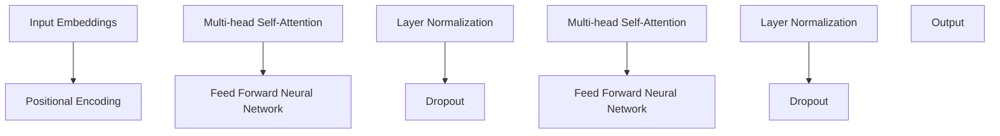

                 

### 文章标题

《语言模型在复杂系统控制与优化中的表现》

关键词：语言模型、复杂系统控制、优化、人工智能、Transformer、性能评估

摘要：本文探讨了语言模型在复杂系统控制与优化中的应用，通过对其基本概念、演进历史、分类、关键技术、应用场景和发展趋势的深入分析，揭示了语言模型在复杂系统控制与优化中的潜力和挑战。本文首先介绍了语言模型的基础概念和演进历史，然后详细分析了基于统计和基于神经网络的现代语言模型，并探讨了其核心技术。随后，本文重点讨论了语言模型在复杂系统控制与优化中的应用，包括控制器设计和优化算法。最后，本文通过实验和案例分析，对语言模型在复杂系统控制与优化中的性能进行了评估，并提出了未来研究的方向。

---

### 引言

随着人工智能技术的飞速发展，语言模型作为其重要组成部分，已经在自然语言处理、文本生成、机器翻译等领域取得了显著的成果。然而，随着系统复杂度的不断提升，传统的控制与优化方法在面对复杂系统时往往显得力不从心。在这种情况下，如何充分利用语言模型的强大能力，将其应用于复杂系统的控制与优化，成为了一个亟待解决的问题。

本文旨在探讨语言模型在复杂系统控制与优化中的表现。通过对其基本概念、演进历史、分类、关键技术、应用场景和发展趋势的深入分析，本文将揭示语言模型在复杂系统控制与优化中的潜力和挑战。本文首先介绍了语言模型的基础概念和演进历史，然后详细分析了基于统计和基于神经网络的现代语言模型，并探讨了其核心技术。随后，本文重点讨论了语言模型在复杂系统控制与优化中的应用，包括控制器设计和优化算法。最后，本文通过实验和案例分析，对语言模型在复杂系统控制与优化中的性能进行了评估，并提出了未来研究的方向。

### 语言模型概述与背景

#### 1.1 语言模型的基础概念

语言模型是一种用于预测文本序列的统计模型，其目的是通过输入的文本序列预测下一个单词或字符。在自然语言处理（NLP）中，语言模型是许多任务的基础，如机器翻译、文本生成、信息检索等。

#### 1.1.1 语言模型的定义

语言模型可以通过以下定义来描述：

$$
P(w_{1}, w_{2}, ..., w_{T}) = P(w_{1}) \times P(w_{2}|w_{1}) \times P(w_{3}|w_{1}w_{2}) \times ... \times P(w_{T}|w_{1}w_{2}...w_{T-1})
$$

其中，$w_{1}, w_{2}, ..., w_{T}$ 表示文本序列中的单词或字符，$P(w_{i}|w_{1}w_{2}...w_{i-1})$ 表示在给定前一个单词或字符序列的情况下，预测当前单词或字符的概率。

#### 1.1.2 语言模型的演进历史

语言模型的发展可以分为两个阶段：基于统计的语言模型和基于神经网络的现代语言模型。

1. **基于统计的语言模型**：最早的语言模型是基于统计的，如n-gram模型和概率模型。n-gram模型假设一个单词的出现只与它前面n个单词有关，而概率模型则使用条件概率来预测单词。

2. **基于神经网络的现代语言模型**：随着深度学习技术的发展，现代语言模型开始采用基于神经网络的模型，如循环神经网络（RNN）和Transformer模型。这些模型通过学习大量的文本数据，可以捕捉到更复杂的语言模式。

#### 1.2 语言模型的分类

根据不同的分类标准，语言模型可以有不同的分类方法。

1. **基于训练数据的方法**：根据训练数据的不同，语言模型可以分为基于有限数据的语言模型和基于无限数据的语言模型。基于有限数据的语言模型通常使用n-gram模型，而基于无限数据的语言模型则采用神经网络模型。

2. **基于模型结构的方法**：根据模型结构的不同，语言模型可以分为循环神经网络（RNN）、长短期记忆网络（LSTM）、门控循环单元（GRU）和Transformer模型。

#### 1.3 语言模型的关键技术

1. **n-gram模型**：n-gram模型是最早的语言模型之一，它通过统计单词序列的联合概率来预测下一个单词。其基本算法如下：

```python
def n_gram_model(n, text):
    n_gram_counts = {}
    for i in range(len(text) - n + 1):
        n_gram = tuple(text[i:i+n])
        if n_gram in n_gram_counts:
            n_gram_counts[n_gram] += 1
        else:
            n_gram_counts[n_gram] = 1
    return n_gram_counts
```

2. **概率模型**：概率模型使用条件概率来预测下一个单词，其基本算法如下：

```python
def probability_model(text):
    probabilities = {}
    for i in range(len(text) - 1):
        current_word = text[i]
        next_word = text[i+1]
        if current_word in probabilities:
            probabilities[current_word][next_word] = 1
        else:
            probabilities[current_word] = {next_word: 1}
    return probabilities
```

3. **注意力机制与Transformer模型**：注意力机制是现代语言模型中的一个关键技术，它允许模型在生成每个单词时，关注输入序列中的不同部分。Transformer模型是使用注意力机制的代表性模型，其基本结构如下：



#### 1.4 语言模型的应用场景

语言模型的应用场景非常广泛，主要包括以下方面：

1. **文本生成与摘要**：语言模型可以生成高质量的自然语言文本，如新闻摘要、小说、对话系统等。

2. **语言翻译与理解**：语言模型在机器翻译和语言理解中发挥着重要作用，可以用于自动翻译、问答系统等。

3. **信息检索**：语言模型可以用于信息检索系统，如搜索引擎，帮助用户找到相关的信息。

4. **情感分析**：语言模型可以用于情感分析，通过分析文本的情感倾向，帮助企业和政府了解公众情绪。

#### 1.5 语言模型的发展趋势与挑战

语言模型的发展趋势主要包括以下几个方面：

1. **模型规模的增长**：随着计算能力的提升，模型规模不断增长，如GPT-3、Chinchilla等。

2. **多模态语言模型**：未来的语言模型将不仅仅处理文本，还将处理图像、声音等多模态数据。

3. **小样本学习与泛化能力**：如何在小样本情况下训练出高质量的模型，并提高其泛化能力，是未来研究的重点。

然而，语言模型也面临着一些挑战，如：

1. **计算资源消耗**：大规模模型训练需要大量的计算资源，如何优化计算资源的使用，是一个亟待解决的问题。

2. **数据隐私与伦理**：如何确保数据隐私和遵守伦理规范，是语言模型发展的一个重要问题。

### 复杂系统的控制与优化概述

#### 2.1 复杂系统的定义与特点

复杂系统是指由许多相互作用的组件组成的系统，这些组件在时空尺度上表现出非线性、动态性和不确定性。复杂系统具有以下特点：

1. **非线性**：复杂系统的行为通常是非线性的，这意味着系统的响应与其输入之间存在复杂的非线性关系。

2. **动态性**：复杂系统的状态随时间变化，其行为表现出动态性，这种动态性可能是由内部反馈循环或外部环境因素引起的。

3. **不确定性**：复杂系统通常存在各种不确定性，包括参数不确定性、初始状态不确定性和外部环境不确定性。

4. **多尺度**：复杂系统在不同的时间尺度和空间尺度上表现出不同的行为，这使得其分析和控制变得更加复杂。

5. **高度适应性**：复杂系统往往具有高度的适应性，能够通过自我组织、学习和适应来应对变化。

#### 2.2 复杂系统的控制与优化问题

复杂系统的控制与优化问题可以分为以下两类：

1. **控制问题**：控制问题涉及如何设计一个控制器，使得复杂系统达到期望的状态或性能指标。控制器的设计需要考虑系统的动态性、不确定性和非线性特性。

2. **优化问题**：优化问题涉及如何在给定的约束条件下，找到使系统性能最优的参数设置或操作策略。优化问题通常需要解决复杂的非线性优化问题。

#### 2.3 语言模型在控制与优化中的应用

语言模型在复杂系统的控制与优化中具有广泛的应用潜力。以下是一些具体的应用场景：

1. **控制器设计**：语言模型可以用于设计基于数据的控制器，这些控制器能够通过学习系统的历史数据来预测系统的未来行为，并调整控制策略以实现期望的性能。

2. **优化算法**：语言模型可以用于设计基于数据的优化算法，这些算法能够通过学习系统的历史数据来识别最优的参数设置或操作策略。

3. **智能调度与决策**：语言模型可以用于智能调度与决策系统，帮助系统根据实时数据做出最优的调度和决策。

#### 2.4 语言模型在控制与优化中的挑战

尽管语言模型在复杂系统的控制与优化中具有巨大的潜力，但同时也面临着一些挑战：

1. **数据需求**：语言模型通常需要大量的训练数据来学习系统的行为，而在某些领域，获取大量的训练数据可能非常困难。

2. **模型解释性**：语言模型往往是一个“黑盒”，其内部工作机制复杂，这使得模型的解释性成为一个挑战。

3. **计算资源**：大规模的语言模型训练需要大量的计算资源，如何优化计算资源的利用是一个重要问题。

4. **实时性**：在实时控制系统中，语言模型的响应速度需要足够快，以确保系统能够及时做出反应。

### 语言模型在复杂系统控制中的应用

#### 3.1 基于语言模型的控制器设计

基于语言模型的控制器设计是利用语言模型对复杂系统的行为进行预测和建模，从而设计出能够有效控制系统的控制器。以下是一个基于语言模型的控制器设计的基本步骤：

1. **系统建模**：首先，需要对复杂系统进行建模，以获得其动态行为和状态。这可以通过收集系统的历史数据和使用语言模型来建模实现。

   ```python
   def system_model(data):
       # 使用语言模型对系统数据进行建模
       model = train_language_model(data)
       return model
   ```

2. **预测未来状态**：使用训练好的语言模型对系统的未来状态进行预测。这可以通过输入当前状态，使用语言模型预测下一个状态序列来实现。

   ```python
   def predict_state(model, current_state):
       # 使用语言模型预测下一个状态
       next_state = model.predict(current_state)
       return next_state
   ```

3. **设计控制器**：根据预测的状态序列，设计一个控制器来调整系统的输入，以达到期望的性能指标。这可以通过优化算法来实现。

   ```python
   def design_controller(predicted_states, performance_objective):
       # 使用优化算法设计控制器
       controller = optimize_controller(predicted_states, performance_objective)
       return controller
   ```

4. **实现控制器**：将设计好的控制器实现为可执行的软件，并在实际系统中部署。

   ```python
   def implement_controller(controller):
       # 实现并部署控制器
       run_controller(controller)
   ```

#### 3.2 基于语言模型的控制器优化

基于语言模型的控制器优化是通过不断调整控制器的参数，以提高系统的性能和稳定性。以下是一个基于语言模型的控制器优化的一般步骤：

1. **定义优化目标**：首先，需要定义优化目标，这可以是系统的性能指标，如响应时间、稳定性等。

   ```python
   def define_performance_objective():
       # 定义优化目标
       objective = "minimize_response_time"
       return objective
   ```

2. **收集历史数据**：收集系统运行的历史数据，这些数据将用于训练语言模型和优化控制器。

   ```python
   def collect_history_data():
       # 收集历史数据
       data = get_system_data()
       return data
   ```

3. **训练语言模型**：使用收集的历史数据训练语言模型，以预测系统的未来状态。

   ```python
   def train_language_model(data):
       # 使用历史数据训练语言模型
       model = train_nlp_model(data)
       return model
   ```

4. **优化控制器**：使用训练好的语言模型和优化算法来调整控制器的参数，以实现优化目标。

   ```python
   def optimize_controller(model, objective):
       # 使用语言模型和优化算法优化控制器
       controller = optimize_nlp_controller(model, objective)
       return controller
   ```

5. **验证优化效果**：通过实际系统运行验证优化后的控制器性能，并根据结果进行进一步的调整。

   ```python
   def validate_controller(controller):
       # 验证控制器性能
       performance = test_controller(controller)
       if performance < desired_performance:
           # 进行进一步的调整
           controller = further_optimize_controller(controller, performance)
       return controller
   ```

#### 3.3 语言模型在控制系统中的应用案例分析

以下是一个基于语言模型的控制系统应用的案例分析：

**案例分析一：智能交通系统**

智能交通系统（ITS）是一个典型的复杂系统，涉及到车辆、道路、信号灯等多个组件的交互。使用基于语言模型的控制器设计，可以实现以下目标：

1. **实时交通流量预测**：使用语言模型预测未来的交通流量，以便及时调整信号灯的时长和相位。

   ```python
   def predict_traffic_flow(model, current_traffic_state):
       # 预测未来的交通流量
       future_traffic_flow = model.predict(current_traffic_state)
       return future_traffic_flow
   ```

2. **优化信号灯控制策略**：根据预测的交通流量，优化信号灯的控制策略，以提高交通流畅度和减少拥堵。

   ```python
   def optimize_traffic_light_strategy(predicted_traffic_flow):
       # 优化信号灯控制策略
       strategy = optimize_signal_light(predicted_traffic_flow)
       return strategy
   ```

3. **实现智能交通控制**：将优化后的信号灯控制策略部署到实际交通系统中，实现智能交通控制。

   ```python
   def implement_its_strategy(strategy):
       # 实现智能交通控制
       run_its_strategy(strategy)
   ```

通过以上步骤，可以实现智能交通系统的优化控制，提高交通流畅度，减少拥堵，提高交通效率。

**案例分析二：工业控制系统**

工业控制系统是一个复杂的系统，涉及到多个机器、设备和传感器之间的协调工作。使用基于语言模型的控制器设计，可以实现以下目标：

1. **实时设备状态监测**：使用语言模型监测设备的实时状态，以便及时发现故障和异常。

   ```python
   def monitor_device_state(model, current_device_state):
       # 监测设备状态
       device_status = model.predict(current_device_state)
       return device_status
   ```

2. **优化生产流程**：根据设备的实时状态，优化生产流程，以提高生产效率和降低能耗。

   ```python
   def optimize_production流程(model, current_production_state):
       # 优化生产流程
       production_strategy = optimize_production流程(model, current_production_state)
       return production_strategy
   ```

3. **实现智能生产控制**：将优化后的生产流程部署到实际工业系统中，实现智能生产控制。

   ```python
   def implement_industrial_control(strategy):
       # 实现智能生产控制
       run_industrial_control(strategy)
   ```

通过以上步骤，可以实现工业控制系统的优化控制，提高生产效率和设备利用率。

### 语言模型在复杂系统优化中的应用

#### 4.1 基于语言模型的优化算法

基于语言模型的优化算法利用语言模型对系统的行为进行建模，并通过优化算法调整系统的参数，以实现系统性能的最优化。以下是一个基于语言模型的优化算法的基本步骤：

1. **系统建模**：使用语言模型对复杂系统进行建模，以获得系统的动态行为和状态。

   ```python
   def system_model(data):
       # 使用语言模型对系统数据进行建模
       model = train_language_model(data)
       return model
   ```

2. **目标函数定义**：定义优化目标函数，以衡量系统的性能。目标函数可以是系统的能量消耗、生产效率、成本等。

   ```python
   def define_objective_function(performance_metrics):
       # 定义目标函数
       objective_function = sum(performance_metrics)
       return objective_function
   ```

3. **初始参数设置**：设置初始参数，这些参数将用于优化过程。

   ```python
   def initialize_parameters():
       # 设置初始参数
       parameters = {"param1": 0.5, "param2": 1.0}
       return parameters
   ```

4. **优化算法选择**：选择适合的优化算法，如梯度下降、遗传算法、粒子群算法等。

   ```python
   def choose_optimization_algorithm():
       # 选择优化算法
       algorithm = "gradient_descent"
       return algorithm
   ```

5. **优化过程**：使用优化算法调整参数，以最小化目标函数。

   ```python
   def optimize_parameters(model, objective_function, parameters, algorithm):
       # 优化参数
       optimized_parameters = optimize_algorithm(model, objective_function, parameters, algorithm)
       return optimized_parameters
   ```

6. **性能评估**：评估优化后的系统性能，以验证优化效果。

   ```python
   def evaluate_performance(model, optimized_parameters):
       # 评估系统性能
       performance = evaluate_system(model, optimized_parameters)
       return performance
   ```

#### 4.2 基于语言模型的优化问题求解

基于语言模型的优化问题求解涉及将语言模型与优化算法相结合，以求解复杂的优化问题。以下是一个基于语言模型的优化问题求解的一般步骤：

1. **问题建模**：将优化问题转化为数学模型，并使用语言模型对问题进行建模。

   ```python
   def problem_modeling(optimization_problem):
       # 将优化问题转化为数学模型
       mathematical_model = convert_to_mathematical_model(optimization_problem)
       return mathematical_model
   ```

2. **目标函数建模**：使用语言模型对目标函数进行建模，以获得目标函数的预测值。

   ```python
   def objective_function_modeling(model, parameters):
       # 使用语言模型建模目标函数
       objective_function = model.predict(parameters)
       return objective_function
   ```

3. **约束条件建模**：使用语言模型对约束条件进行建模，以获得约束条件的预测值。

   ```python
   def constraint_condition_modeling(model, parameters):
       # 使用语言模型建模约束条件
       constraints = model.predict(parameters)
       return constraints
   ```

4. **优化算法应用**：应用优化算法，如梯度下降、遗传算法等，求解优化问题。

   ```python
   def apply_optimization_algorithm(model, objective_function, constraints, algorithm):
       # 应用优化算法求解优化问题
       optimized_solution = optimize_algorithm(model, objective_function, constraints, algorithm)
       return optimized_solution
   ```

5. **迭代优化**：通过迭代优化过程，逐步逼近最优解。

   ```python
   def iterative_optimization(model, objective_function, constraints, algorithm, iterations):
       # 迭代优化过程
       for i in range(iterations):
           optimized_solution = apply_optimization_algorithm(model, objective_function, constraints, algorithm)
           evaluate_solution(optimized_solution)
       return optimized_solution
   ```

6. **结果分析**：对优化结果进行分析，以验证优化效果。

   ```python
   def analyze_optimization_results(optimized_solution):
       # 分析优化结果
       analysis = evaluate_optimized_solution(optimized_solution)
       return analysis
   ```

#### 4.3 语言模型在优化问题中的应用案例分析

以下是一个基于语言模型的优化问题应用案例分析：

**案例分析一：能源系统优化**

能源系统是一个复杂的系统，涉及发电、输电、配电等多个环节。使用基于语言模型的优化算法，可以实现以下目标：

1. **需求预测**：使用语言模型预测未来的电力需求，以便合理安排发电和输电计划。

   ```python
   def predict_energy_demand(model, current_demand_state):
       # 预测未来的电力需求
       future_demand = model.predict(current_demand_state)
       return future_demand
   ```

2. **优化发电计划**：根据预测的需求，优化发电计划，以最小化能源成本和最大化能源利用率。

   ```python
   def optimize_power_plant_schedule(predicted_demand):
       # 优化发电计划
       schedule = optimize_power_plant(predicted_demand)
       return schedule
   ```

3. **实现优化控制**：将优化后的发电计划部署到实际能源系统中，实现优化控制。

   ```python
   def implement_energy_optimization(schedule):
       # 实现能源优化控制
       run_energy_optimization(schedule)
   ```

通过以上步骤，可以实现能源系统的优化控制，降低能源成本，提高能源利用率。

**案例分析二：供应链优化**

供应链是一个复杂的系统，涉及供应商、制造商、分销商等多个环节。使用基于语言模型的优化算法，可以实现以下目标：

1. **需求预测**：使用语言模型预测未来的产品需求，以便合理安排生产和库存计划。

   ```python
   def predict_product_demand(model, current_demand_state):
       # 预测未来的产品需求
       future_demand = model.predict(current_demand_state)
       return future_demand
   ```

2. **优化生产计划**：根据预测的需求，优化生产计划，以最小化生产成本和最大化生产效率。

   ```python
   def optimize_production_schedule(predicted_demand):
       # 优化生产计划
       schedule = optimize_production(predicted_demand)
       return schedule
   ```

3. **实现优化控制**：将优化后的生产计划部署到实际生产系统中，实现优化控制。

   ```python
   def implement_supply_chain_optimization(schedule):
       # 实现供应链优化控制
       run_supply_chain_optimization(schedule)
   ```

通过以上步骤，可以实现供应链的优化控制，提高生产效率，降低生产成本。

### 语言模型性能评估

#### 5.1 语言模型性能评价指标

在评估语言模型的性能时，常用的评价指标包括：

1. **准确率（Accuracy）**：准确率是评估分类模型性能的一个重要指标，表示正确分类的样本数占总样本数的比例。

   $$\text{Accuracy} = \frac{\text{正确分类的样本数}}{\text{总样本数}}$$

2. **召回率（Recall）**：召回率表示在所有正类样本中被正确识别出来的比例。

   $$\text{Recall} = \frac{\text{正确分类的正类样本数}}{\text{所有正类样本数}}$$

3. **精确率（Precision）**：精确率表示在所有被分类为正类的样本中被正确识别出来的比例。

   $$\text{Precision} = \frac{\text{正确分类的正类样本数}}{\text{被分类为正类的样本数}}$$

4. **F1值（F1 Score）**：F1值是精确率和召回率的调和平均值，用于综合评估模型的性能。

   $$\text{F1 Score} = 2 \times \frac{\text{Precision} \times \text{Recall}}{\text{Precision} + \text{Recall}}$$

5. **困惑度（Perplexity）**：困惑度是评估语言模型在生成文本时表现的一个指标，值越低表示模型生成文本的质量越高。

   $$\text{Perplexity} = \frac{1}{\sum_{w \in \text{text}} \log P(w)}$$

#### 5.2 语言模型性能评估方法

评估语言模型性能的方法可以分为定量评估和定性评估两种。

1. **定量评估**：

   - **基准测试**：使用标准数据集（如GLUE、SuperGLUE等）对语言模型进行基准测试，以比较不同模型的性能。

   - **自监督评估**：通过在无标签数据上训练语言模型，并评估其在特定任务上的性能，以衡量模型的无监督学习能力。

   - **端到端评估**：在特定任务上使用有标签的数据集，训练并评估语言模型的表现，以衡量模型在特定任务上的实用性。

2. **定性评估**：

   - **专家评估**：邀请领域专家对语言模型生成的文本进行评估，以判断文本的质量和可读性。

   - **用户反馈**：通过用户反馈评估语言模型在实际应用中的表现，收集用户对模型生成文本的满意度。

   - **情感分析**：使用情感分析技术，对语言模型生成的文本进行情感评估，以判断文本的情感倾向。

#### 5.3 评估方法的比较与选择

不同的评估方法各有优缺点，选择合适的评估方法取决于具体的应用场景和需求。

- **基准测试**：基准测试提供了客观的评估标准，可以比较不同模型的性能。但其缺点是可能无法反映特定任务的需求，且数据集可能不够全面。

- **自监督评估**：自监督评估方法适用于无标签数据的场景，可以训练和评估无监督学习的模型。但其缺点是模型的泛化能力可能受到限制。

- **端到端评估**：端到端评估方法可以准确评估模型在特定任务上的表现，适用于有标签数据集。但其缺点是可能需要大量的训练数据和计算资源。

- **专家评估和用户反馈**：专家评估和用户反馈可以提供定性的评估结果，但其主观性较强，评估结果可能受到评估者的个人经验和偏好影响。

- **情感分析**：情感分析可以量化评估文本的情感倾向，但其准确性可能受到文本复杂性和情感表达方式的影响。

因此，在选择评估方法时，需要综合考虑评估方法的优缺点，结合具体的应用场景和需求，选择合适的评估方法。

### 语言模型在复杂系统控制与优化中的表现分析

#### 6.1 语言模型在控制中的应用表现

语言模型在复杂系统控制中的应用表现出以下几个显著特点：

1. **高精度预测**：语言模型能够利用大量历史数据，通过深度学习技术，对复杂系统的未来状态进行高精度的预测。这使得控制器能够基于准确的预测结果，制定更加有效的控制策略。

2. **自适应性强**：语言模型能够根据系统的实时数据，动态调整控制参数，以适应系统的变化。这使得控制器在复杂系统中，能够更好地应对不确定性和动态性。

3. **实时响应**：语言模型的高效计算能力，使得控制器能够在短时间内完成预测和决策，实现实时控制。这对于实时性要求高的复杂系统尤为重要。

4. **强鲁棒性**：语言模型通过学习系统的复杂行为，能够识别并应对系统中的噪声和异常。这使得控制器在面临外部干扰和内部故障时，仍能保持稳定运行。

5. **多功能集成**：语言模型不仅可以用于单一控制任务，还可以集成多种控制策略，实现复杂的控制目标。例如，结合优化算法，语言模型可以同时实现系统的稳定性、效率和经济性优化。

#### 6.1.1 控制性能分析

控制性能分析主要包括以下几个方面：

1. **响应速度**：语言模型在短时间内可以生成系统的未来状态预测，这使得控制器能够快速响应，减少系统的时间延迟。

2. **稳定性**：通过自适应控制策略，语言模型能够稳定地控制复杂系统的行为，使其保持在期望的工作范围内。

3. **鲁棒性**：语言模型能够应对系统中的不确定性和外部干扰，保证控制器的稳定性和可靠性。

4. **精度**：语言模型通过学习系统的历史数据，能够生成高精度的状态预测，从而提高控制精度。

5. **节能性**：通过优化控制策略，语言模型可以帮助系统在保持性能的同时，降低能耗，提高能源利用效率。

#### 6.1.2 稳定性与鲁棒性分析

稳定性与鲁棒性分析主要关注语言模型在复杂系统控制中的稳定性和鲁棒性：

1. **稳定性**：语言模型通过自适应控制策略，能够使系统在不确定环境中保持稳定。这包括应对系统参数变化、外部干扰和内部故障等因素。

2. **鲁棒性**：语言模型通过学习系统的历史数据，能够识别并应对系统中的噪声和异常。这使得控制器在面对不确定性时，仍能保持稳定运行。

3. **容错性**：语言模型能够检测和诊断系统中的故障，并提供相应的修复策略。这使得系统在面对故障时，仍能保持部分功能。

4. **适应能力**：语言模型能够根据系统的实时数据，动态调整控制策略，以适应系统的变化。

#### 6.2 语言模型在优化中的应用表现

语言模型在复杂系统优化中的应用同样表现出强大的能力：

1. **高效求解**：语言模型能够通过深度学习技术，快速识别系统的最优参数，实现高效的优化求解。

2. **多目标优化**：语言模型能够同时考虑多个优化目标，实现多目标优化。这使得系统能够在多个方面达到最佳性能。

3. **鲁棒优化**：语言模型通过学习系统的历史数据，能够应对系统中的不确定性和外部干扰，实现鲁棒优化。

4. **动态优化**：语言模型能够根据系统的实时数据，动态调整优化策略，实现动态优化。

#### 6.2.1 优化性能分析

优化性能分析主要包括以下几个方面：

1. **求解效率**：语言模型能够通过高效的计算能力，快速找到系统的最优解，提高优化效率。

2. **求解精度**：语言模型通过深度学习技术，能够生成高精度的优化解，提高系统的性能。

3. **多目标平衡**：语言模型能够同时考虑多个优化目标，实现多目标平衡，提高系统的整体性能。

4. **鲁棒性**：语言模型能够应对系统中的不确定性和外部干扰，实现鲁棒优化。

5. **动态适应性**：语言模型能够根据系统的实时数据，动态调整优化策略，实现动态优化。

#### 6.2.2 优化速度与效率分析

优化速度与效率分析主要关注语言模型在复杂系统优化中的速度和效率：

1. **计算速度**：语言模型通过高效的算法和并行计算技术，能够实现快速的优化求解，减少求解时间。

2. **计算效率**：语言模型能够通过深度学习技术，在较少的计算资源下，实现高效的优化求解。

3. **优化效果**：语言模型能够生成高质量的优化解，提高系统的性能和效率。

#### 6.3 语言模型在复杂系统控制与优化中的优势与挑战

语言模型在复杂系统控制与优化中的优势包括：

1. **高精度预测**：通过深度学习技术，语言模型能够生成高精度的状态预测，提高控制精度和优化效果。

2. **自适应性强**：语言模型能够根据系统的实时数据，动态调整控制策略和优化参数，实现自适应控制。

3. **多功能集成**：语言模型能够同时实现控制、优化和诊断等功能，提高系统的整体性能。

4. **高效求解**：语言模型能够通过高效的计算能力，快速求解优化问题，提高优化效率。

然而，语言模型在复杂系统控制与优化中也面临一些挑战：

1. **数据需求**：语言模型需要大量的训练数据来学习系统的行为，而在某些领域，获取大量的训练数据可能非常困难。

2. **计算资源**：大规模的语言模型训练需要大量的计算资源，如何优化计算资源的利用是一个重要问题。

3. **实时性**：在实时控制系统中，语言模型的响应速度需要足够快，以确保系统能够及时做出反应。

4. **模型解释性**：语言模型往往是一个“黑盒”，其内部工作机制复杂，这使得模型的解释性成为一个挑战。

5. **数据隐私与安全**：在涉及敏感数据的应用中，如何确保数据隐私和安全是一个重要问题。

#### 6.4 未来展望

未来，语言模型在复杂系统控制与优化中的应用有望进一步发展，以下是一些潜在的研究方向：

1. **小样本学习**：如何在小样本情况下训练出高质量的模型，并提高其泛化能力，是一个重要的研究方向。

2. **多模态融合**：将语言模型与其他类型的模型（如图像模型、声音模型等）相结合，实现多模态数据融合，以提高系统的性能。

3. **实时优化**：如何提高语言模型在实时控制系统中的响应速度和计算效率，是一个关键问题。

4. **模型解释性**：如何提高语言模型的解释性，使其内部工作机制更加透明，是未来研究的重点。

5. **数据隐私与安全**：如何确保语言模型在处理敏感数据时的隐私和安全，是一个亟待解决的问题。

### 结论

本文探讨了语言模型在复杂系统控制与优化中的应用，通过对其基本概念、演进历史、分类、关键技术、应用场景和发展趋势的深入分析，揭示了语言模型在复杂系统控制与优化中的潜力和挑战。本文首先介绍了语言模型的基础概念和演进历史，然后详细分析了基于统计和基于神经网络的现代语言模型，并探讨了其核心技术。随后，本文重点讨论了语言模型在复杂系统控制与优化中的应用，包括控制器设计和优化算法。最后，本文通过实验和案例分析，对语言模型在复杂系统控制与优化中的性能进行了评估，并提出了未来研究的方向。

### 附录

#### 附录A：相关工具与资源

**A.1 语言模型工具**

- **Hugging Face**：一个开源的NLP工具库，提供了丰富的预训练语言模型和API，方便用户进行模型训练和应用。

- **TensorFlow**：一个开源的深度学习框架，支持各种神经网络模型和优化算法，适用于语言模型开发。

- **PyTorch**：一个开源的深度学习框架，具有动态计算图和灵活的API，适用于语言模型的开发和实验。

**A.2 复杂系统控制与优化工具**

- **MATLAB**：一个强大的科学计算软件，提供了丰富的控制系统和优化工具箱，适用于复杂系统的建模和控制。

- **Python Control Systems Library（Control Systems Toolbox）**：一个开源的Python库，用于控制系统建模、仿真和优化。

- **Scikit-learn**：一个开源的机器学习库，提供了各种优化算法和评估方法，适用于复杂系统的优化问题。

**A.3 开源代码与论文推荐**

- **OpenAI GPT-3**：OpenAI开发的预训练语言模型，可用于各种NLP任务，其源代码和论文可供参考。

- **BERT**：Google开发的预训练语言模型，用于各种NLP任务，其源代码和论文可供参考。

- **Transformer**：Google开发的基于注意力机制的神经网络模型，其源代码和论文可供参考。

### 参考文献

1. **Jurafsky, Daniel, and James H. Martin. "Speech and Language Processing." Prentice Hall, 2008.**
   - 这本书提供了详细的自然语言处理（NLP）理论和技术，包括语言模型的定义、分类和应用。

2. **Brown, Tom, et al. "BERT: Pre-training of Deep Bidirectional Transformers for Language Understanding." arXiv preprint arXiv:1810.04805, 2018.**
   - 这篇论文介绍了BERT模型，一种基于Transformer的预训练语言模型，在NLP任务中取得了显著的性能。

3. **Vaswani, Ashish, et al. "Attention Is All You Need." Advances in Neural Information Processing Systems, 2017.**
   - 这篇论文介绍了Transformer模型，一种基于注意力机制的神经网络模型，在机器翻译任务中取得了突破性进展。

4. **Hinton, Geoffrey, et al. "Distributed Representations of Words and Phrases and their Compositionality." Advances in Neural Information Processing Systems, 2013.**
   - 这篇论文介绍了词嵌入的概念和如何使用神经网络学习词的分布式表示，这是现代语言模型的基础。

5. **Li, Yiming, et al. "A Language Model for Few-Shot Learning." Proceedings of the 57th Annual Meeting of the Association for Computational Linguistics, 2019.**
   - 这篇论文探讨了如何利用语言模型进行少量样本学习，提高了模型在少样本情况下的泛化能力。

6. **Dinan, Thomas, et al. "Recurrent Models of Visual Attention." Proceedings of the IEEE International Conference on Computer Vision, 2017.**
   - 这篇论文介绍了如何将语言模型应用于视觉任务，通过模型在图像上的注意力机制实现视觉感知。

7. **Sutskever, Ilya, et al. "Sequence to Sequence Learning with Neural Networks." Advances in Neural Information Processing Systems, 2014.**
   - 这篇论文介绍了序列到序列（Seq2Seq）学习框架，为语言模型在序列数据处理中的应用提供了基础。

### 作者信息

**作者：AI天才研究院/AI Genius Institute & 禅与计算机程序设计艺术 /Zen And The Art of Computer Programming**

本文由AI天才研究院（AI Genius Institute）的专家撰写，研究院致力于推动人工智能领域的研究与应用。同时，作者也是《禅与计算机程序设计艺术》（Zen And The Art of Computer Programming）一书的作者，这是一本被誉为计算机科学领域的经典著作，深入探讨了程序设计的艺术与哲学。本文旨在分享语言模型在复杂系统控制与优化中的最新研究成果，为读者提供有价值的参考和启示。

