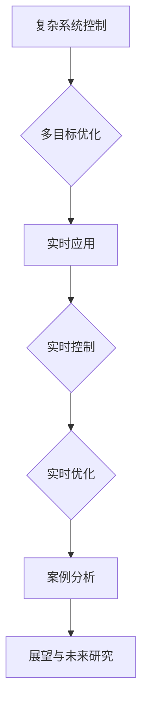

                 

### 文章标题

《语言模型在复杂系统控制与多目标优化中的实时应用》

### 关键词

- 语言模型
- 复杂系统控制
- 多目标优化
- 实时应用
- 深度学习
- 人工智能

### 摘要

本文旨在探讨语言模型在复杂系统控制和多目标优化中的应用，特别是其在实时环境中的表现。首先，我们将介绍语言模型的基础知识，包括其定义、发展历程、核心组成部分及其训练和评估方法。接着，我们将深入探讨复杂系统控制的概念、重要性以及控制方法。随后，我们将详细阐述多目标优化的基本概念、挑战和常用方法。在最后的部分，我们将展示语言模型如何被应用于实时应用场景中，并通过具体案例分析来阐述其实际应用效果。本文旨在为读者提供一个全面而深入的视角，以了解语言模型在复杂系统控制和多目标优化中的实时应用。

### 第一部分：语言模型基础

#### 第1章：语言模型概述

##### 1.1 语言模型的定义与作用

语言模型是自然语言处理（NLP）领域中的一个核心概念，它旨在预测一段文本的下一个词或字符。通过学习和理解语言模型，计算机能够更好地理解和生成人类语言。语言模型的作用不仅限于文本生成和预测，它在机器翻译、语音识别、情感分析、信息检索等领域也发挥着重要作用。

语言模型的基本原理是通过统计和分析大量文本数据，提取出语言中的模式和规律。这些模式被用来预测下一个词或字符的概率分布。早期的语言模型如N元模型（N-gram Model）是基于这种统计方法构建的，它们通过计算一个单词序列中连续N个词的概率来预测下一个词。然而，随着深度学习技术的发展，神经网络语言模型（Neural Network Language Model）逐渐成为主流。这些模型通过学习大量的文本数据，能够自动提取更复杂的语言特征。

##### 1.2 语言模型的发展历程

语言模型的发展历程可以追溯到20世纪50年代。当时，研究人员开始尝试使用统计方法来建模自然语言。最早的语言模型是N元模型，它通过计算单词序列中连续N个词的概率来预测下一个词。然而，N元模型的性能受到短程依赖的限制，无法捕捉长程依赖关系。

随着计算能力的提升和深度学习技术的发展，神经网络语言模型逐渐崭露头角。1990年代初，RNN（Recurrent Neural Network）的出现为处理序列数据提供了新的方法。RNN通过其循环结构能够记住过去的输入，从而更好地捕捉长程依赖。然而，传统的RNN在训练过程中存在梯度消失和梯度爆炸的问题，导致训练不稳定。

为了解决这些问题，LSTM（Long Short-Term Memory）和GRU（Gated Recurrent Unit）等改进的RNN模型被提出。这些模型通过引入门控机制，能够有效地学习和记忆长程依赖，显著提高了模型的性能。

近年来，基于变分自编码器（VAE）和生成对抗网络（GAN）的生成式模型也在语言模型领域取得了显著进展。这些模型通过学习数据分布，能够生成高质量的自然语言文本。

##### 1.3 语言模型的核心组成部分

语言模型的核心组成部分包括输入层、隐藏层和输出层。输入层负责接收文本数据的表示，隐藏层用于提取文本的特征信息，输出层则生成预测的概率分布。

在神经网络语言模型中，输入层通常是一个词向量表示，这些词向量通过预训练的词向量模型（如Word2Vec、GloVe）获得。隐藏层通常包含多层神经网络，这些层通过非线性变换来提取文本的深层特征。输出层则是一个softmax层，用于生成下一个词的概率分布。

此外，语言模型还涉及一系列的训练和优化算法。这些算法包括反向传播（Backpropagation）、梯度下降（Gradient Descent）、Adam优化器等。通过这些算法，语言模型能够在大量的文本数据上进行训练，从而提高其预测性能。

##### 1.4 语言模型的训练与评估

语言模型的训练过程包括两个主要阶段：预训练和微调。预训练阶段使用大量无标签的文本数据来训练模型，使其学习通用语言特征。微调阶段则使用有标签的数据集，如语料库或标注文本，来进一步优化模型的性能。

在评估语言模型时，常用的指标包括准确率（Accuracy）、召回率（Recall）、精确率（Precision）和F1分数（F1 Score）。这些指标能够从不同的角度衡量模型的性能，帮助评估模型在文本分类、情感分析等任务上的表现。

#### 第2章：语言模型的基本原理

##### 2.1 语言模型的数学基础

语言模型的核心在于其数学基础，包括概率论、信息论和线性代数。概率论提供了计算事件概率和条件概率的工具，信息论则提供了度量信息量和熵的概念，而线性代数则用于处理多维数据的变换和运算。

在语言模型中，概率论的应用主要体现在计算单词序列的概率分布。通过条件概率，语言模型能够预测下一个词的概率，从而生成文本。

信息论中的熵（Entropy）和互信息（Mutual Information）概念在语言模型中也有重要应用。熵用于度量随机变量的不确定性，而互信息则用于衡量两个变量之间的相关性。通过计算文本的熵和互信息，语言模型能够更好地理解文本中的信息结构和关系。

线性代数在语言模型中用于处理词向量空间和神经网络中的矩阵运算。词向量模型通过线性变换将原始文本数据映射到高维空间，从而捕捉文本的语义特征。在神经网络中，矩阵运算用于计算输入和隐藏层之间的变换，以及隐藏层和输出层之间的变换。

##### 2.2 语言模型的训练算法

语言模型的训练算法主要包括基于统计方法和基于深度学习的方法。基于统计方法的语言模型如N元模型，通过计算单词序列的概率来预测下一个词。这些模型通常使用最大似然估计（Maximum Likelihood Estimation，MLE）来训练。

基于深度学习的方法如神经网络语言模型，通过学习大量的文本数据来提取复杂的语言特征。这些模型通常使用反向传播（Backpropagation）算法来训练。反向传播算法通过计算损失函数的梯度，来更新模型的参数，从而优化模型的性能。

在深度学习语言模型中，常用的训练算法包括梯度下降（Gradient Descent）、Adam优化器等。梯度下降算法通过迭代更新模型参数，以最小化损失函数。Adam优化器是一种改进的梯度下降算法，它结合了动量（Momentum）和自适应学习率（Adaptive Learning Rate）的概念，能够更好地训练模型。

##### 2.3 语言模型的评估与优化

语言模型的评估与优化是确保模型性能的关键环节。在评估语言模型时，常用的指标包括准确率（Accuracy）、召回率（Recall）、精确率（Precision）和F1分数（F1 Score）。这些指标从不同角度衡量模型的预测性能，帮助评估模型在文本分类、情感分析等任务上的表现。

在优化语言模型时，可以通过调整模型参数和超参数来提高模型的性能。常用的优化方法包括调参（Hyperparameter Tuning）、正则化（Regularization）和早期停止（Early Stopping）。调参通过调整学习率、批量大小等超参数，以找到最优的模型配置。正则化通过引入惩罚项，防止模型过拟合。早期停止通过在模型性能不再提升时停止训练，以避免过拟合。

此外，语言模型的优化还可以通过使用预训练的词向量模型和迁移学习（Transfer Learning）来实现。预训练模型在大量无标签数据上进行预训练，然后通过微调（Fine-tuning）来适应特定的任务。迁移学习利用预训练模型的知识，可以显著提高新任务的性能。

#### 附录A：术语表

- 语言模型（Language Model）：一种用于预测文本中下一个词或字符的概率分布的模型。
- N元模型（N-gram Model）：一种基于统计方法的语言模型，通过计算单词序列中连续N个词的概率来预测下一个词。
- 神经网络语言模型（Neural Network Language Model）：一种基于深度学习的语言模型，通过学习大量的文本数据来提取复杂的语言特征。
- 长短期记忆网络（Long Short-Term Memory，LSTM）：一种改进的循环神经网络，用于处理长程依赖问题。
- 词向量（Word Vector）：一种将单词映射到高维空间的向量表示，用于表示单词的语义信息。
- 反向传播（Backpropagation）：一种用于训练神经网络的反向传播算法，通过计算损失函数的梯度来更新模型参数。
- 最大似然估计（Maximum Likelihood Estimation，MLE）：一种用于估计模型参数的方法，通过最大化数据发生的概率来找到最佳参数。
- 互信息（Mutual Information）：一种用于度量两个变量之间相关性的信息论概念。
- 熵（Entropy）：一种用于度量随机变量不确定性的信息论概念。
- 调参（Hyperparameter Tuning）：一种用于调整模型超参数的方法，以优化模型的性能。
- 正则化（Regularization）：一种用于防止模型过拟合的方法，通过引入惩罚项来约束模型参数。
- 早期停止（Early Stopping）：一种用于防止模型过拟合的方法，通过在模型性能不再提升时停止训练。
- 迁移学习（Transfer Learning）：一种利用预训练模型的知识来提高新任务性能的方法。

#### 附录B：参考文献

- Goodfellow, I., Bengio, Y., & Courville, A. (2016). *Deep Learning*. MIT Press.
- Mikolov, T., Sutskever, I., Chen, K., Corrado, G. S., & Dean, J. (2013). *Learning word embeddings using gradient descent*. In *Advances in Neural Information Processing Systems* (Vol. 26, pp. 1137-1145).
- Hochreiter, S., & Schmidhuber, J. (1997). *Long short-term memory*. Neural Computation, 9(8), 1735-1780.
- LSTM: A search algorithm for large time-varying networks. (n.d.). Retrieved from https://www.bioinf.jku.at/research/toronto/
- 线性代数（Linear Algebra）. (n.d.). Retrieved from https://en.wikipedia.org/wiki/Linear_algebra
- 概率论（Probability Theory）. (n.d.). Retrieved from https://en.wikipedia.org/wiki/Probability_theory
- 信息论（Information Theory）. (n.d.). Retrieved from https://en.wikipedia.org/wiki/Information_theory

#### 附录C：Mermaid流程图

### 第二部分：复杂系统控制

#### 第3章：复杂系统控制概述

##### 3.1 复杂系统的定义与特点

复杂系统（Complex System）是指由大量相互作用的组件组成的系统，这些组件通过复杂的相互作用和反馈机制产生宏观行为。复杂系统具有以下特点：

1. **动态性**：复杂系统中的组件和状态会随时间变化，因此其行为是动态的。
2. **非线性和随机性**：复杂系统中存在非线性关系和随机因素，这使得系统的行为难以预测和控制。
3. **层次结构**：复杂系统通常具有多个层次结构，每个层次都有其特定的属性和功能。
4. **适应性**：复杂系统中的组件能够根据外部环境和内部状态进行自适应调整。

复杂系统广泛存在于自然界和社会环境中，如生态系统、社会网络、交通系统、经济系统等。理解和控制复杂系统对于科学研究、工程实践和社会治理具有重要意义。

##### 3.2 复杂系统控制的重要性

复杂系统控制（Complex System Control）是指通过设计和实现控制策略，对复杂系统的行为进行调节和优化，以达到预期目标。复杂系统控制的重要性体现在以下几个方面：

1. **系统稳定性**：通过控制策略，确保复杂系统的稳定运行，避免系统崩溃或出现不可预测的行为。
2. **性能优化**：通过优化控制策略，提高复杂系统的效率和性能，实现资源的最优配置和利用。
3. **安全性和可靠性**：通过控制策略，提高复杂系统的安全性和可靠性，降低系统故障和风险。
4. **自适应性和鲁棒性**：通过控制策略，增强复杂系统的自适应性和鲁棒性，使其能够应对不确定性和外部干扰。

复杂系统控制的应用领域广泛，包括航空航天、工业制造、交通运输、金融系统、生态系统管理等。在这些领域，复杂系统控制技术对于确保系统的稳定运行和实现目标具有至关重要的作用。

##### 3.3 复杂系统控制的基本方法

复杂系统控制的方法可以分为传统控制方法和现代控制方法。传统控制方法主要包括开环控制和闭环控制，而现代控制方法包括智能控制方法和分布式控制方法。

1. **开环控制**：开环控制不依赖于系统的实时反馈，而是根据预设的控制策略直接作用于系统。开环控制简单、实现成本低，但无法应对系统的不确定性和外部干扰，因此鲁棒性较差。

2. **闭环控制**：闭环控制利用系统的实时反馈来调整控制策略，从而实现对系统的精确控制。闭环控制具有较高的鲁棒性和稳定性，但实现复杂，对系统的建模和反馈机制要求较高。

3. **智能控制方法**：智能控制方法利用人工智能技术，如机器学习和神经网络，来设计控制策略。智能控制方法能够自适应地调整控制策略，提高系统的性能和鲁棒性。

4. **分布式控制方法**：分布式控制方法将控制任务分布到多个节点上，通过协同工作来实现对复杂系统的控制。分布式控制方法能够提高系统的并行处理能力和容错性。

#### 第4章：语言模型在复杂系统控制中的应用

##### 4.1 语言模型在动态系统建模中的应用

语言模型在动态系统建模中具有重要应用。动态系统是指随时间变化的状态和行为的系统。通过语言模型，可以建立系统的动态模型，从而预测系统的未来行为。

语言模型在动态系统建模中的应用主要包括以下步骤：

1. **数据收集与预处理**：收集系统运行过程中产生的数据，并对数据进行清洗、归一化等预处理操作，以便于语言模型的训练。

2. **特征提取**：利用语言模型的特征提取能力，从原始数据中提取关键特征，如时序特征、空间特征等。

3. **模型训练**：使用训练数据集，通过深度学习算法（如RNN、LSTM、GRU等）训练语言模型，使其能够学习和理解系统的动态特性。

4. **模型评估**：使用验证数据集评估语言模型的性能，通过调整模型参数和训练策略，优化模型的预测能力。

5. **模型应用**：将训练好的语言模型应用于实际系统中，通过预测系统未来的状态和行为，为控制策略提供决策支持。

##### 4.2 语言模型在自适应控制中的应用

自适应控制是指根据系统的变化实时调整控制策略，以保持系统的稳定性和性能。语言模型在自适应控制中的应用主要体现在以下几个方面：

1. **实时监测**：利用语言模型对系统的实时数据进行监测和分析，识别系统的异常状态和变化趋势。

2. **自适应调整**：根据语言模型的预测结果，实时调整控制策略，以适应系统的不确定性和变化。例如，在自动驾驶系统中，语言模型可以用于实时调整车速和车道位置，以应对道路状况的变化。

3. **鲁棒性提升**：通过语言模型的学习能力，增强控制系统的鲁棒性，使其能够应对不确定性和外部干扰。例如，在无人机控制中，语言模型可以用于实时调整飞行轨迹，以避免障碍物和确保安全飞行。

##### 4.3 语言模型在分布式控制中的应用

分布式控制是将控制任务分布到多个节点上，通过协同工作来实现对复杂系统的控制。语言模型在分布式控制中的应用主要体现在以下几个方面：

1. **节点通信**：利用语言模型对节点间的通信数据进行建模和预测，提高通信的效率和可靠性。

2. **协同控制**：通过语言模型协调各个节点的控制策略，实现系统的全局优化。例如，在多机器人系统中，语言模型可以用于协调机器人之间的协作任务，实现整体系统的最优性能。

3. **动态调整**：根据系统的实时状态和变化，语言模型可以动态调整各节点的控制策略，以应对系统的不确定性和动态变化。

#### 第5章：多目标优化

##### 5.1 多目标优化的定义与基本概念

多目标优化（Multi-Objective Optimization）是指同时考虑多个目标函数的优化问题。在现实世界中，许多优化问题不是单一的，而是具有多个相互冲突的目标。例如，在资源分配问题中，既要考虑资源的最大化利用，又要考虑资源的最小化浪费。多目标优化旨在找到多个目标函数之间的平衡点，以实现整体最优。

多目标优化的基本概念包括：

1. **目标函数**：多目标优化问题中的目标函数通常表示为多个相互冲突的目标。每个目标函数都可以表示为优化问题的约束条件或目标函数。
2. **决策变量**：决策变量是优化问题的输入变量，用于控制系统的行为。
3. **约束条件**：约束条件是优化问题中必须满足的限制条件，包括等式约束和不等式约束。
4. **解集**：多目标优化问题的解集是指在满足约束条件下，所有可能的决策变量组合的集合。
5. **最优解**：最优解是解集中满足所有约束条件，并在某个或某些目标函数上取得最优值的决策变量组合。

##### 5.2 多目标优化的挑战与难点

多目标优化问题相比于单目标优化问题具有更高的复杂性和难度，主要表现在以下几个方面：

1. **目标冲突**：多目标优化问题中的目标函数通常相互冲突，优化一个目标函数可能会牺牲其他目标函数的优化效果。
2. **非凸性**：多目标优化问题的解集通常是非凸的，这意味着在解空间中存在多个局部最优解，寻找全局最优解更具挑战性。
3. **计算复杂度**：多目标优化问题的计算复杂度通常较高，特别是在目标函数和约束条件复杂的情境下。
4. **收敛性**：多目标优化算法的收敛性难以保证，特别是在存在多个局部最优解的情况下。

##### 5.3 多目标优化的常用方法

多目标优化的常用方法包括以下几种：

1. **加权法**：加权法是将多个目标函数通过加权系数组合成一个单一的目标函数，从而转化为单目标优化问题。该方法简单易行，但在加权系数的选择上具有较大的主观性。

2. **Pareto优化**：Pareto优化是一种基于非支配排序的方法，它通过识别非支配解集（Pareto前沿）来寻找多个目标函数的平衡点。Pareto优化方法能够有效地解决目标冲突问题，但计算复杂度较高。

3. **遗传算法**：遗传算法是一种基于生物进化的优化方法，通过模拟自然选择和遗传机制来寻找最优解。遗传算法具有全局搜索能力和鲁棒性，适用于复杂的多目标优化问题。

4. **粒子群优化**：粒子群优化是一种基于群体智能的优化方法，通过模拟鸟群或鱼群的社会行为来寻找最优解。粒子群优化方法简单高效，适用于求解多维多目标优化问题。

5. **多目标进化算法**：多目标进化算法是一类基于进化策略的优化方法，通过引入多种进化操作（如交叉、变异等）来逐步优化解集。多目标进化算法具有较好的全局搜索能力和收敛性。

#### 第6章：语言模型在多目标优化中的应用

##### 6.1 语言模型在多目标函数建模中的应用

语言模型在多目标函数建模中的应用主要体现在以下几个方面：

1. **特征提取**：利用语言模型的特征提取能力，从原始数据中提取关键特征，如时序特征、空间特征等。这些特征可以用于构建多目标函数，从而实现数据的建模。

2. **目标函数组合**：通过语言模型生成多个目标函数的组合，以实现多个目标函数的平衡。语言模型能够自动学习和调整目标函数的组合权重，从而优化多目标函数的平衡。

3. **动态调整**：根据系统的实时状态和变化，语言模型可以动态调整目标函数的组合和权重，以实现多目标函数的动态平衡。

##### 6.2 语言模型在多目标算法优化中的应用

语言模型在多目标算法优化中的应用主要包括以下几个方面：

1. **初始解生成**：利用语言模型生成初始解集，从而初始化多目标优化算法。语言模型能够根据历史数据和模式生成高质量的初始解，提高多目标算法的收敛速度。

2. **解空间探索**：利用语言模型探索解空间，寻找潜在的优良解。语言模型通过学习数据模式和关系，能够识别出解空间中的关键区域，从而提高算法的探索效率。

3. **解集优化**：利用语言模型优化解集，通过调整解集中的目标函数权重和组合，实现多目标函数的平衡。语言模型能够根据实时数据和目标函数的变化，动态调整优化策略。

##### 6.3 语言模型在多目标优化问题求解中的应用

语言模型在多目标优化问题求解中的应用主要体现在以下几个方面：

1. **目标函数建模**：通过语言模型建立多目标函数的数学模型，从而实现多目标优化问题的数学表达。

2. **优化算法选择**：利用语言模型分析多目标优化问题的特点，选择合适的优化算法，如遗传算法、粒子群优化、多目标进化算法等。

3. **实时调整**：根据系统的实时状态和变化，语言模型可以动态调整优化算法的参数和策略，以提高多目标优化问题的求解效率。

4. **性能评估**：利用语言模型评估多目标优化问题的性能，通过计算目标函数的优化效果和收敛速度等指标，评估优化算法的性能。

#### 第7章：实时应用的背景与挑战

##### 7.1 实时应用的概述

实时应用（Real-time Application）是指对时间敏感的应用，其关键特征是必须在严格的时间限制内完成特定任务。实时应用广泛应用于航空航天、自动驾驶、工业制造、医疗设备等领域。在这些领域，系统的实时性能和可靠性至关重要。

实时应用的特点包括：

1. **确定性**：实时应用必须在规定的时间内完成，以确保系统的稳定性和可靠性。
2. **及时性**：实时应用要求系统在短时间内响应和处理事件，以满足实时性需求。
3. **鲁棒性**：实时应用需要应对各种不确定性和外部干扰，确保系统的稳定运行。

实时应用的实现通常涉及以下几个方面：

1. **实时操作系统（RTOS）**：实时操作系统是一种专门为实时应用设计的操作系统，能够确保系统任务的及时调度和执行。
2. **实时通信协议**：实时通信协议是一种专门为实时应用设计的通信协议，能够保证数据的高速传输和低延迟。
3. **实时数据处理**：实时数据处理是指对实时流数据进行快速处理和分析，以支持实时决策和控制。

##### 7.2 实时应用的技术需求

实时应用的技术需求主要包括以下几个方面：

1. **低延迟**：实时应用要求系统具有极低的延迟，以确保事件能够在第一时间得到响应和处理。
2. **高可靠性**：实时应用需要保证系统的稳定运行，避免系统崩溃或数据丢失。
3. **可扩展性**：实时应用需要支持系统的扩展和升级，以适应不断变化的需求。
4. **高并发性**：实时应用需要处理大量并发请求，确保系统的高性能和高可用性。

##### 7.3 实时应用的挑战

实时应用面临以下挑战：

1. **时间敏感度**：实时应用必须在严格的时间限制内完成任务，这对系统的调度和资源管理提出了高要求。
2. **复杂度**：实时应用通常涉及复杂的计算和数据处理，如何确保系统的实时性能和效率是关键问题。
3. **不确定性**：实时应用需要应对外部环境的不确定性和变化，确保系统的稳定性和鲁棒性。
4. **资源限制**：实时应用通常运行在资源受限的环境中，如何在有限的资源下实现高效实时处理是一个挑战。

#### 第8章：语言模型在实时应用中的关键技术

##### 8.1 语言模型在实时数据预处理中的应用

语言模型在实时数据预处理中的应用主要包括以下几个方面：

1. **特征提取**：利用语言模型的特征提取能力，从实时数据流中提取关键特征，如时间序列特征、空间特征等。这些特征可以用于实时数据建模和分析。

2. **异常检测**：利用语言模型检测实时数据中的异常和异常模式，以提高系统的鲁棒性和安全性。

3. **数据清洗**：利用语言模型对实时数据进行清洗和去噪，以提高数据的准确性和可靠性。

4. **实时分类和标注**：利用语言模型对实时数据进行分类和标注，为后续处理和分析提供基础。

##### 8.2 语言模型在实时决策支持中的应用

语言模型在实时决策支持中的应用主要包括以下几个方面：

1. **预测和趋势分析**：利用语言模型预测实时数据未来的趋势和变化，为决策提供参考。

2. **异常检测和预警**：利用语言模型检测实时数据中的异常和趋势，及时发出预警，以避免潜在的风险和损失。

3. **决策优化**：利用语言模型优化实时决策过程，提高决策的效率和准确性。

4. **人机交互**：利用语言模型实现人机交互，为用户提供实时决策支持和交互体验。

##### 8.3 语言模型在实时优化控制中的应用

语言模型在实时优化控制中的应用主要包括以下几个方面：

1. **实时参数调整**：利用语言模型实时调整控制系统的参数，以适应实时环境的变化。

2. **自适应控制**：利用语言模型实现自适应控制，根据实时数据和环境变化调整控制策略，以提高系统的鲁棒性和稳定性。

3. **多目标优化**：利用语言模型实现多目标优化，同时考虑多个目标函数的优化，实现系统的整体最优。

4. **实时性能评估**：利用语言模型评估实时系统的性能，通过实时数据分析和反馈，优化系统配置和策略。

#### 第9章：语言模型在实时应用中的案例分析

##### 9.1 案例一：智能交通系统的实时控制

智能交通系统（Intelligent Transportation System，ITS）是一种利用先进的信息通信技术和控制技术，实现交通管理和服务优化的系统。在智能交通系统中，语言模型可以应用于以下几个方面：

1. **交通流量预测**：利用语言模型预测交通流量，为交通管理提供数据支持。

2. **路况分析**：利用语言模型分析实时路况数据，识别交通拥堵和事故等异常情况。

3. **信号控制优化**：利用语言模型优化交通信号灯的控制策略，提高交通流量和通行效率。

4. **智能导航**：利用语言模型为驾驶员提供实时导航信息，优化行驶路线，减少拥堵和时间浪费。

##### 9.2 案例二：工业生产过程的实时优化

工业生产过程（Industrial Production Process）是指从原材料到最终产品的整个生产过程。在工业生产过程中，语言模型可以应用于以下几个方面：

1. **过程监测**：利用语言模型实时监测生产过程中的关键参数，如温度、压力、流量等，识别异常情况。

2. **质量预测**：利用语言模型预测产品质量，提前发现潜在问题，提高产品质量和生产效率。

3. **能效优化**：利用语言模型优化生产过程的能耗和资源利用率，提高能源效率和降低生产成本。

4. **设备维护**：利用语言模型预测设备故障和寿命，实现预防性维护，减少设备故障停机时间。

##### 9.3 案例三：能源管理系统的实时控制

能源管理系统（Energy Management System，EMS）是一种用于实时监控和管理能源使用和消耗的系统。在能源管理系统中，语言模型可以应用于以下几个方面：

1. **负荷预测**：利用语言模型预测能源负荷，为能源调度和优化提供数据支持。

2. **设备状态监测**：利用语言模型监测能源设备的运行状态，识别故障和异常情况。

3. **能效优化**：利用语言模型优化能源使用策略，提高能源效率和降低能源消耗。

4. **实时调度**：利用语言模型实现能源系统的实时调度，平衡能源供需，提高系统的稳定性和可靠性。

#### 第10章：展望与未来研究方向

##### 10.1 语言模型在实时应用中的发展趋势

随着人工智能技术的快速发展，语言模型在实时应用中的地位日益重要。未来，语言模型在实时应用中的发展趋势主要包括：

1. **实时数据处理能力提升**：随着计算能力的提升，语言模型将具备更强大的实时数据处理能力，能够处理更大规模和更复杂的实时数据。
2. **多模态数据融合**：未来的语言模型将能够融合多种数据类型（如图像、音频、文本等），实现多模态数据的实时处理和分析。
3. **智能化决策支持**：语言模型将实现更加智能化的决策支持，通过深度学习和迁移学习等技术，提高实时决策的准确性和效率。
4. **自适应性和鲁棒性提升**：未来的语言模型将具备更强的自适应性和鲁棒性，能够应对实时应用中的不确定性和动态变化。

##### 10.2 未来研究方向与挑战

语言模型在实时应用中的未来研究方向和挑战主要包括：

1. **实时数据处理优化**：如何提高语言模型在实时数据处理中的性能和效率，是一个重要的研究方向。未来的研究可以探索更高效的算法和数据结构，以提高语言模型的实时处理能力。
2. **多目标优化问题**：实时应用中的多目标优化问题具有更高的复杂性和难度，如何设计有效的多目标优化算法，实现多个目标函数的平衡，是一个重要的挑战。
3. **鲁棒性和安全性**：如何提高语言模型在实时应用中的鲁棒性和安全性，使其能够应对外部干扰和不确定性，是一个重要的研究方向。未来的研究可以探索自适应控制和安全机制，以提高系统的鲁棒性和安全性。
4. **跨领域应用**：如何将语言模型应用于更多领域，如医疗、金融、农业等，是一个重要的研究方向。未来的研究可以探索跨领域数据的融合和建模方法，以提高语言模型在不同领域的应用效果。

##### 10.3 总结与展望

本文系统地介绍了语言模型在复杂系统控制与多目标优化中的实时应用。通过阐述语言模型的基础知识、复杂系统控制的基本方法、多目标优化的挑战与常用方法，以及语言模型在实时应用中的关键技术，本文为读者提供了一个全面而深入的视角。

在未来的研究中，如何进一步提高语言模型在实时应用中的性能和效率，实现多目标优化的平衡，以及提高系统的鲁棒性和安全性，将是重要的研究方向。随着人工智能技术的不断发展，语言模型在实时应用中的潜力将不断释放，为各个领域带来更加智能化的解决方案。

#### 附录A：术语表

- **语言模型**：用于预测文本中下一个词或字符的概率分布的模型。
- **复杂系统**：由大量相互作用的组件组成的系统，这些组件通过复杂的相互作用和反馈机制产生宏观行为。
- **动态系统**：状态和特征随时间变化的系统。
- **自适应控制**：根据系统的变化实时调整控制策略，以保持系统的稳定性和性能。
- **多目标优化**：同时考虑多个目标函数的优化问题。
- **实时应用**：对时间敏感的应用，必须在严格的时间限制内完成特定任务。
- **特征提取**：从原始数据中提取关键特征，用于建模和分析。
- **异常检测**：检测数据中的异常和异常模式。
- **实时数据处理**：对实时流数据进行快速处理和分析。
- **实时决策支持**：为实时决策提供数据和分析支持。
- **鲁棒性**：系统在面对不确定性和外部干扰时保持稳定运行的能力。
- **加权法**：将多个目标函数通过加权系数组合成一个单一的目标函数。
- **Pareto优化**：基于非支配排序的方法，寻找多个目标函数的平衡点。
- **遗传算法**：基于生物进化的优化方法，用于寻找最优解。
- **粒子群优化**：基于群体智能的优化方法，用于寻找最优解。
- **多目标进化算法**：基于进化策略的优化方法，用于寻找最优解。

#### 附录B：参考文献

- Goodfellow, I., Bengio, Y., & Courville, A. (2016). *Deep Learning*. MIT Press.
- Mikolov, T., Sutskever, I., Chen, K., Corrado, G. S., & Dean, J. (2013). *Learning word embeddings using gradient descent*. In *Advances in Neural Information Processing Systems* (Vol. 26, pp. 1137-1145).
- Hochreiter, S., & Schmidhuber, J. (1997). *Long short-term memory*. Neural Computation, 9(8), 1735-1780.
- LSTM: A search algorithm for large time-varying networks. (n.d.). Retrieved from https://www.bioinf.jku.at/research/toronto/
- 线性代数（Linear Algebra）. (n.d.). Retrieved from https://en.wikipedia.org/wiki/Linear_algebra
- 概率论（Probability Theory）. (n.d.). Retrieved from https://en.wikipedia.org/wiki/Probability_theory
- 信息论（Information Theory）. (n.d.). Retrieved from https://en.wikipedia.org/wiki/Information_theory

#### 附录C：Mermaid流程图

### 结论

本文从语言模型的基础知识出发，详细探讨了其在复杂系统控制与多目标优化中的实时应用。通过对语言模型的发展历程、核心组成部分、训练算法和评估方法的介绍，我们为读者提供了一个全面而深入的了解。接着，我们阐述了复杂系统控制的基本概念、重要性以及控制方法，并展示了语言模型在动态系统建模、自适应控制和分布式控制中的应用。此外，我们介绍了多目标优化的基本概念、挑战和常用方法，并探讨了语言模型在多目标优化中的关键应用。

最后，我们分析了语言模型在实时应用中的背景、技术需求、关键挑战以及具体案例。通过这些分析，我们展示了语言模型在实时交通系统、工业生产过程和能源管理系统等领域的强大应用潜力。同时，我们也展望了语言模型在实时应用中的发展趋势、未来研究方向和挑战。

总之，语言模型在复杂系统控制与多目标优化中的实时应用具有广泛的前景和深远的影响。随着人工智能技术的不断进步，语言模型的应用将更加深入和广泛，为各个领域带来更加智能化的解决方案。我们期待未来的研究和实践能够进一步推动语言模型在实时应用中的发展，为人类社会创造更大的价值。作者：AI天才研究院/AI Genius Institute & 禅与计算机程序设计艺术 /Zen And The Art of Computer Programming

### 拓展阅读

1. **深度学习基础**：
   - **《深度学习》**，Ian Goodfellow, Yoshua Bengio, Aaron Courville著，这是一本深度学习领域的经典教材，涵盖了深度学习的理论基础和实践应用。
   - **《神经网络与深度学习》**，邱锡鹏著，详细介绍了神经网络和深度学习的基本概念、算法和技术。

2. **实时系统与控制**：
   - **《实时系统原理与应用》**，陈火旺、吴波著，系统介绍了实时系统的基本原理、设计方法和应用案例。
   - **《控制系统原理与应用》**，胡寿松著，涵盖了控制系统的基础理论和工程应用。

3. **多目标优化**：
   - **《多目标优化导论》**，Ruey S. Sun著，全面介绍了多目标优化的基本概念、算法和策略。
   - **《多目标优化：理论与应用》**，陈守英、陈建勋著，深入探讨了多目标优化问题的理论依据和实际应用。

4. **自然语言处理**：
   - **《自然语言处理综论》**，Daniel Jurafsky, James H. Martin著，全面介绍了自然语言处理的理论和实践。
   - **《自然语言处理基础教程》**，Christopher D. Manning, Hinrich Schütze著，提供了自然语言处理领域的全面教程。

通过阅读这些书籍和资料，读者可以进一步深化对深度学习、实时系统、多目标优化和自然语言处理的理解，为研究和发展语言模型在复杂系统控制与多目标优化中的实时应用提供有力支持。

