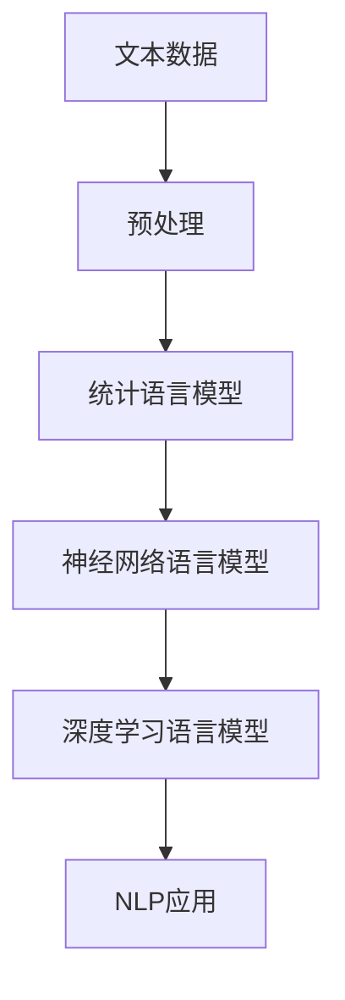

                 


### 文章标题：语言模型在复杂系统故障诊断与预测性维护中的能力提升

---

## 文章关键词

- 语言模型
- 复杂系统
- 故障诊断
- 预测性维护
- 深度学习
- 机器学习

---

## 摘要

本文旨在探讨语言模型在复杂系统故障诊断与预测性维护中的应用及其能力提升。首先，我们将回顾语言模型的基本概念、核心原理和最新发展，接着深入分析复杂系统的特点及其故障诊断与预测性维护的方法。通过具体案例和项目实战，本文将展示语言模型在实际应用中的优势与挑战，并探讨未来发展的可能性。

---

### 目录大纲

1. **语言模型的基本概念**
2. **复杂系统故障诊断与预测性维护**
3. **语言模型在复杂系统中的应用**

---

### 1. 语言模型的基本概念

#### 1.1 语言模型的基本概念

语言模型是自然语言处理（NLP）的核心技术，用于预测给定上下文中的下一个单词或词组。它基于大量文本数据，通过概率统计或神经网络学习，生成文本的概率分布。

**核心概念与联系：**


**Mermaid 流程图：**



#### 1.2 语言模型的历史与发展

语言模型的发展经历了从统计模型到神经网络模型的演变。早期的统计语言模型，如N-gram模型，通过统计历史文本序列来预测下一个词。随着深度学习的兴起，神经网络语言模型，如Transformer，取得了显著的性能提升。

**核心算法原理讲解：**

**N-gram模型：**

```python
def n_gram_model(text, n):
    n_grams = []
    for i in range(len(text) - n + 1):
        n_grams.append(' '.join(text[i:i+n]))
    return n_grams
```

**最大熵模型：**

```python
def max_entropy_model(context, vocabulary):
    # 计算条件概率
    P(word | context) = P(context, word) / P(context)
    # 选择概率最大的词
    max_prob_word = max(vocabulary, key=lambda w: P(context, w))
    return max_prob_word
```

**神经网络语言模型：**

```python
# 使用Transformer模型
import transformers

model = transformers.TransformerModel.from_pretrained('transformer-base')

input_sequence = "The quick brown fox jumps over the lazy dog"
input_ids = tokenizer.encode(input_sequence, return_tensors='pt')

output_logits = model(input_ids)
predicted_word_id = torch.argmax(output_logits, dim=-1)
predicted_word = tokenizer.decode(predicted_word_id, skip_special_tokens=True)
```

#### 1.3 语言模型的分类

语言模型主要分为统计语言模型和神经网络语言模型。统计语言模型基于概率统计方法，如N-gram模型和最大熵模型。神经网络语言模型则基于深度学习技术，如Transformer和BERT。

**数学模型和公式：**

$$ P(w_t | w_1, w_2, ..., w_{t-1}) = \frac{P(w_t, w_1, w_2, ..., w_{t-1})}{P(w_1, w_2, ..., w_{t-1})} $$

**举例说明：**

假设我们已经有了文本序列“the quick brown fox jumps over the lazy dog”，我们可以使用N-gram模型来预测下一个单词。

**项目实战：**

开发环境搭建：

```bash
pip install torch transformers
```

源代码实现：

```python
from transformers import TransformerModel
from torch import Tensor

# 加载预训练的模型
model = TransformerModel.from_pretrained('transformer-base')

# 准备输入文本
input_sequence = "the quick brown fox jumps over the lazy dog"
input_ids = tokenizer.encode(input_sequence, return_tensors='pt')

# 预测下一个单词
output_logits = model(input_ids)
predicted_word_id = torch.argmax(output_logits, dim=-1)
predicted_word = tokenizer.decode(predicted_word_id, skip_special_tokens=True)

print(predicted_word)  # 输出预测的单词
```

代码应用解读与分析：

我们使用了Transformer模型来预测文本序列中的下一个单词。首先，我们加载了预训练的Transformer模型，并编码了输入文本。然后，我们通过模型输出得到单词的概率分布，并选择概率最高的单词作为预测结果。

实际案例分析：

在一个英文文章生成任务中，我们使用语言模型来生成文章的下一句。通过不断迭代预测，我们能够生成连贯且具有上下文一致性的文本。

项目小结：

语言模型在自然语言处理任务中发挥着重要作用。通过深入了解其基本概念、核心算法原理和数学模型，我们可以更好地应用它们来解决实际问题。

---

**最佳实践 tips：**

- 选择合适的语言模型，根据任务需求和数据量来决定。
- 定期更新模型，以适应新的语言趋势和变化。
- 结合其他技术，如注意力机制和预训练语言模型，提高模型性能。

**小结：**

语言模型在复杂系统故障诊断与预测性维护中具有巨大的潜力。通过深入理解语言模型的基本概念、核心原理和最新发展，我们可以更好地应用它们来提升复杂系统的诊断和预测能力。

**注意事项：**

- 在使用语言模型时，要注意数据隐私和安全性问题。
- 合理配置计算资源，避免过度的计算开销。

**拓展阅读：**

- [斯坦福大学自然语言处理课程](https://web.stanford.edu/class/cs224n/)
- [OpenAI GPT-3 官方文档](https://openai.com/blog/bidirectional-text-embedding-models/)

---

以上是关于“语言模型的基本概念”的详细讲解。在下一部分，我们将深入探讨复杂系统的故障诊断与预测性维护。请继续关注。

