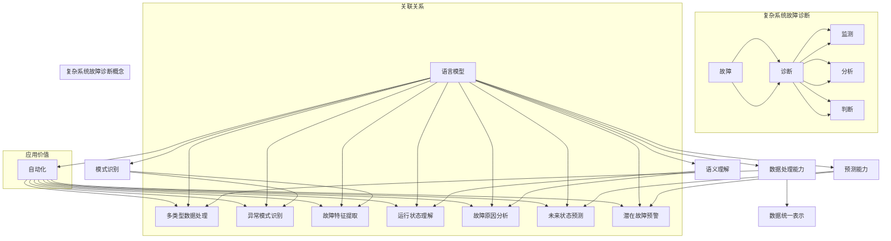
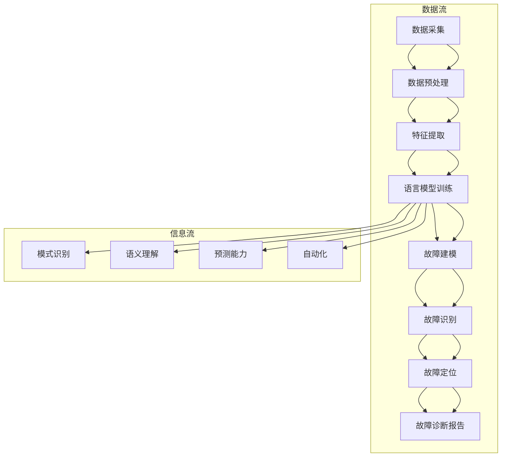

                 

## 文章标题

《语言模型在复杂系统故障诊断中的应用探索》

## 关键词

语言模型、复杂系统、故障诊断、人工智能、数据处理、算法优化

## 摘要

本文深入探讨了语言模型在复杂系统故障诊断领域的应用。随着信息技术的飞速发展，复杂系统在各个行业中的应用越来越广泛，然而这些系统的故障诊断成为一个巨大的挑战。语言模型作为一种强大的人工智能技术，以其强大的数据处理和分析能力，为复杂系统故障诊断提供了新的思路和方法。本文首先介绍了复杂系统故障诊断的背景和挑战，然后详细阐述了语言模型的基本原理、数学模型、评估与优化方法。接着，本文通过具体的应用案例，展示了语言模型在工业控制、医疗设备和航空航天系统故障诊断中的应用效果。最后，本文提出了基于语言模型的复杂系统故障诊断项目实战，并进行了详细的代码解读和分析，为读者提供了实际操作的指导。通过本文的研究，我们期望能够为复杂系统故障诊断领域的研究者和开发者提供有价值的参考。

## 引言

### 1.1 复杂系统故障诊断的挑战

复杂系统在现代社会的各个领域中都发挥着至关重要的作用，如工业控制系统、医疗设备、航空航天系统等。然而，复杂系统的稳定性和可靠性问题一直是困扰企业和科研机构的一大难题。故障诊断作为保障复杂系统正常运行的关键技术，其重要性不言而喻。然而，复杂系统的故障诊断面临着一系列严峻的挑战。

首先，复杂系统的规模庞大、结构复杂，往往包含多个子系统、模块和设备。这些子系统之间的交互和耦合关系错综复杂，使得故障诊断工作变得异常困难。传统的方法如基于规则的专家系统和基于统计学的模型分析方法，在面对复杂系统的故障诊断时，往往力不从心。

其次，复杂系统的数据类型繁多，包括结构化数据、半结构化数据和非结构化数据。这些数据在格式、内容和质量上存在较大差异，给故障诊断带来了数据预处理和融合的挑战。此外，复杂系统的运行环境多变，实时性要求高，如何在有限的时间和资源内快速准确地诊断出故障，也是一大难题。

### 1.2 语言模型的发展背景

语言模型作为一种人工智能技术，起源于自然语言处理领域。自20世纪50年代以来，自然语言处理领域的研究者们一直在探索如何让计算机理解和处理人类语言。在过去的几十年里，语言模型经历了从基于规则的方法、统计方法到深度学习方法的演变。尤其是近年来，随着深度学习技术的迅猛发展，语言模型取得了显著的进展，并在自然语言处理、机器翻译、语音识别等领域取得了突破性的成果。

语言模型的核心思想是通过学习大量语言数据，建立起对自然语言的统计模型，从而能够对未知文本进行预测和生成。这种基于大数据和深度学习的方法，使得语言模型在处理复杂、不确定的语言现象时，能够表现出强大的能力和灵活性。

### 1.3 语言模型在故障诊断中的应用前景

随着语言模型技术的发展，其在复杂系统故障诊断领域的应用前景也越来越广阔。首先，语言模型强大的数据处理和分析能力，可以有效地处理复杂系统的多类型数据，实现数据的统一表示和融合。其次，语言模型在理解语义、识别模式、预测趋势等方面具有显著优势，能够帮助诊断系统快速准确地识别故障特征和故障原因。此外，随着深度学习技术的不断发展，语言模型的性能和效果也在不断提升，为其在故障诊断领域的应用提供了更加坚实的理论基础和实用价值。

总之，语言模型在复杂系统故障诊断中的应用，不仅为解决复杂系统的故障诊断难题提供了一种新的思路和方法，也为人工智能技术在工业、医疗、航空航天等领域的深入应用开辟了新的可能性。在接下来的章节中，我们将进一步探讨语言模型的基本原理、技术基础以及在故障诊断中的应用。

## 核心概念与联系

在探讨语言模型在复杂系统故障诊断中的应用之前，有必要首先理解相关核心概念，并揭示它们之间的内在联系。以下我们将分别介绍语言模型的基本原理、复杂系统故障诊断的基本概念，以及语言模型与故障诊断之间的联系。

### 2.1 语言模型的基本原理

语言模型是一种用于预测自然语言序列的概率模型。其核心思想是通过对大量语言数据的学习，捕捉自然语言的统计规律，从而能够对未知文本进行概率预测。语言模型的基本原理可以概括为以下几点：

1. **数据学习**：语言模型通过学习大量的文本数据，提取出语言的特征和模式。这些数据可以是已标注的文本，也可以是未标注的文本。

2. **概率预测**：语言模型的主要任务是预测给定一个起始词，下一个词出现的概率。例如，给定一个句子“我正在读书”，语言模型可以预测下一个词是“的”、“书”或“吧”的概率。

3. **序列建模**：语言模型不仅要预测单个词的概率，还要预测整个句子的概率。这需要模型能够处理序列数据，并捕捉词与词之间的关联。

4. **语言特性**：语言模型需要理解语言的一些特性，如语法规则、词汇分布、语义关系等。这些特性有助于模型更好地捕捉语言的自然规律。

### 2.2 复杂系统故障诊断的基本概念

复杂系统故障诊断是指对复杂系统的运行状态进行监测、分析和判断，以识别系统中的故障和异常。其基本概念包括：

1. **故障**：故障是指系统在运行过程中出现的异常情况，可能导致系统性能下降或功能失效。

2. **诊断**：诊断是指通过对系统运行数据的分析和处理，识别出故障的类型、位置和原因。

3. **监测**：监测是指对系统的运行状态进行实时监控，收集系统运行数据。

4. **分析**：分析是指通过对监测数据进行分析和处理，提取出系统的特征和模式。

5. **判断**：判断是指根据分析结果，对系统是否出现故障做出判断。

### 2.3 语言模型与故障诊断的联系

语言模型与故障诊断之间的联系主要体现在以下几个方面：

1. **数据处理能力**：语言模型具有较强的数据处理能力，可以处理复杂系统的多类型数据，如结构化数据、半结构化数据和非结构化数据。这有助于实现数据的统一表示和融合。

2. **模式识别**：语言模型能够识别出复杂系统中的异常模式和故障特征，从而帮助诊断系统快速准确地识别故障。

3. **语义理解**：语言模型能够理解复杂系统的语义信息，如运行状态、故障原因等，这有助于更深入地分析故障。

4. **预测能力**：语言模型能够预测系统的未来运行状态，这有助于提前发现潜在故障，并采取预防措施。

5. **自动化**：语言模型可以自动化地实现故障诊断，减少人为干预，提高诊断效率和准确性。

综上所述，语言模型在复杂系统故障诊断中具有广泛的应用前景。通过理解语言模型的基本原理和复杂系统故障诊断的基本概念，我们可以更好地把握语言模型与故障诊断之间的联系，为后续内容的学习和应用打下坚实的基础。

### 2.4 核心概念关系架构图

为了更直观地展示语言模型的基本原理、复杂系统故障诊断的基本概念以及它们之间的联系，我们使用Mermaid流程图来构建一个概念关系架构图。



该架构图展示了语言模型的关键特性和功能，以及复杂系统故障诊断中的基本概念和过程。通过这种关系架构图，我们可以更清晰地理解语言模型在故障诊断中的作用和价值。

### 2.5 核心算法原理讲解

在了解语言模型的基本原理和复杂系统故障诊断的基本概念后，接下来我们将详细讲解语言模型的核心算法原理，包括其定义、分类和核心算法。

#### 3.1 语言模型的定义

语言模型是一种用于预测自然语言中下一个词的概率模型。具体来说，它是一个概率分布函数，用于给出给定一个单词序列，下一个单词的概率分布。例如，在句子“我正在读书”中，语言模型可以预测下一个词是“的”、“书”或“吧”的概率。

语言模型的关键定义包括：

1. **词序列**：一个单词序列是一系列单词的排列。例如，“我正在读书”是一个词序列。
2. **概率分布**：一个概率分布描述了每个单词在给定前一个单词的条件下出现的概率。
3. **概率模型**：语言模型是一个概率模型，它通过学习大量的文本数据来估计这些概率分布。

#### 3.2 语言模型的分类

语言模型根据不同的分类标准可以有多种分类方式。以下是几种常见的分类方法：

1. **根据训练数据**：
   - **基于规则的语言模型**：这类模型通过预定义的语法规则和词法规则来预测单词的概率。例如，短语结构规则（Part-of-Speech Grammar）和统计语言模型（Statistical Language Model）。
   - **基于统计的语言模型**：这类模型通过统计方法从大量文本数据中学习单词之间的统计规律。包括N元语法（N-Gram Model）、朴素贝叶斯（Naive Bayes）和隐马尔可夫模型（Hidden Markov Model，HMM）。
   - **基于神经网络的模型**：这类模型通过深度神经网络学习单词序列的概率分布。包括循环神经网络（Recurrent Neural Network，RNN）、长短期记忆网络（Long Short-Term Memory，LSTM）和Transformer模型。

2. **根据模型结构**：
   - **一维模型**：这类模型处理一维的单词序列，如N元语法。
   - **二维模型**：这类模型处理二维的单词序列，考虑单词之间的距离，如递归神经网络（RNN）。
   - **多维模型**：这类模型处理多维的单词序列，考虑单词的上下文和语义关系，如Transformer模型。

3. **根据训练方法**：
   - **监督学习**：这类模型使用带有标签的训练数据来训练模型。
   - **无监督学习**：这类模型使用未标注的数据来训练模型。
   - **半监督学习**：这类模型结合监督学习和无监督学习的方法，使用部分标注和部分未标注的数据来训练模型。

#### 3.3 语言模型的核心算法

以下是几种常见语言模型的核心算法：

1. **N元语法（N-Gram Model）**
   N元语法是一种基于统计的语言模型，它通过统计前N个单词出现的概率来预测下一个单词。其基本算法如下：

   ```python
   def predict_next_word(prev_words, model):
       # prev_words 是前N个单词的序列
       # model 是N元语法模型，通常是一个概率分布表
       
       # 遍历模型中的每个单词
       for word, prob in model.items():
           # 计算当前单词与前N-1个单词的组合概率
           combination_prob = 1
           for i in range(N-1):
               combination_prob *= model[prev_words[i]] * model[(prev_words[i], word)]
           
           # 计算单词出现的概率
           word_prob = combination_prob * model[word]
           
           # 返回单词及其概率
           yield word, word_prob
   ```

2. **朴素贝叶斯（Naive Bayes）**
   朴素贝叶斯是一种基于概率的分类方法，它通过计算每个单词的概率分布来预测下一个单词。其基本算法如下：

   ```python
   def predict_next_word(prev_words, corpus):
       # prev_words 是前N个单词的序列
       # corpus 是训练数据，包含大量单词序列及其标签
       
       # 计算每个单词的概率分布
       word_probabilities = {}
       for word in set(corpus):
           word_probabilities[word] = {}
           for prev_word in set(corpus):
               prev_word_count = sum(1 for sentence in corpus if prev_word in sentence)
               word_count = sum(1 for sentence in corpus if word in sentence and prev_word in sentence)
               word_probabilities[word][prev_word] = word_count / prev_word_count if prev_word_count else 0

       # 预测下一个单词
       predicted_words = []
       for word in word_probabilities[prev_words[-1]]:
           predicted_words.append((word, word_probabilities[prev_words[-1]][word]))
       
       # 返回概率最高的单词
       return max(predicted_words, key=lambda x: x[1])[0]
   ```

3. **递归神经网络（RNN）**
   递归神经网络是一种基于序列数据处理的神经网络，它通过递归结构来处理时间序列数据。其基本算法如下：

   ```python
   def rnn_predict_next_word(prev_words, model):
       # prev_words 是前N个单词的序列
       # model 是递归神经网络模型，通常是一个权重矩阵
       
       # 初始化隐藏状态
       hidden_state = model['initial_state']
       
       # 遍历前N个单词，计算隐藏状态
       for word in prev_words:
           hidden_state = model['weights'][word] @ hidden_state
       
       # 预测下一个单词
       predicted_word = model['softmax'](hidden_state)
       
       # 返回预测的单词
       return predicted_word
   ```

4. **Transformer模型**
   Transformer模型是一种基于注意力机制的深度神经网络，它通过自注意力机制来处理序列数据。其基本算法如下：

   ```python
   def transformer_predict_next_word(prev_words, model):
       # prev_words 是前N个单词的序列
       # model 是Transformer模型，通常是一个权重矩阵和自注意力机制
       
       # 计算自注意力得分
       attention_scores = model['self_attention'](prev_words)
       
       # 计算隐藏状态
       hidden_state = model['fc'](attention_scores)
       
       # 预测下一个单词
       predicted_word = model['softmax'](hidden_state)
       
       # 返回预测的单词
       return predicted_word
   ```

通过以上算法，我们可以看到不同类型的语言模型在实现原理和计算方式上的差异。N元语法和朴素贝叶斯模型相对简单，但计算效率较低；递归神经网络和Transformer模型则更加复杂，但能够捕捉到更深层次的序列关系和语义信息。

### 3.4 数学模型与数学公式

语言模型作为一种概率模型，其核心在于如何通过数学公式来表示和计算词序列的概率。以下是几种常见语言模型的数学模型和公式：

1. **N元语法（N-Gram Model）**
   N元语法的核心公式是：

   $$
   P(w_n | w_{n-1}, w_{n-2}, ..., w_1) = \prod_{i=1}^{n} P(w_i | w_{i-1})
   $$

   其中，$w_1, w_2, ..., w_n$ 是连续的N个单词，$P(w_i | w_{i-1})$ 是在给定前一个单词的情况下，当前单词的概率。

2. **朴素贝叶斯（Naive Bayes）**
   朴素贝叶斯模型的核心公式是：

   $$
   P(w_n | w_{n-1}, w_{n-2}, ..., w_1) = \frac{P(w_n) \prod_{i=1}^{n} P(w_i | w_{i-1})}{P(w_{n-1}, w_{n-2}, ..., w_1)}
   $$

   其中，$P(w_n)$ 是当前单词的概率，$P(w_i | w_{i-1})$ 是在给定前一个单词的情况下，当前单词的条件概率。

3. **递归神经网络（RNN）**
   递归神经网络的核心公式是：

   $$
   h_t = \sigma(W_h \cdot [h_{t-1}, x_t] + b_h)
   $$

   $$
   y_t = \sigma(W_o \cdot h_t + b_o)
   $$

   其中，$h_t$ 是第t个时间步的隐藏状态，$x_t$ 是第t个时间步的输入，$W_h$ 和 $b_h$ 是隐藏层权重和偏置，$W_o$ 和 $b_o$ 是输出层权重和偏置，$\sigma$ 是激活函数，通常使用Sigmoid或Tanh函数。

4. **Transformer模型**
   Transformer模型的核心公式是：

   $$
   A_{ij} = \frac{e^{d_k A}}{\sum_{k=1}^{K} e^{d_k A}}
   $$

   $$
   O_i = \sum_{j=1}^{N} A_{ij} \cdot V_j
   $$

   其中，$A_{ij}$ 是第i个词和第j个词之间的注意力得分，$d_k$ 是注意力得分矩阵的元素，$V_j$ 是词向量，$O_i$ 是加权后的词向量。

通过这些数学模型和公式，语言模型能够有效地计算和预测词序列的概率，从而在自然语言处理任务中发挥重要作用。

### 3.5 语言模型的评估与优化

语言模型的性能评估和优化是确保其有效性和准确性的关键步骤。以下将详细讨论语言模型的评估指标、优化方法以及调参技巧。

#### 5.1 语言模型的评估指标

1. **准确率（Accuracy）**
   准确率是衡量语言模型预测正确性的一个基本指标。它表示模型正确预测的样本数占总样本数的比例。公式如下：

   $$
   Accuracy = \frac{TP + TN}{TP + TN + FP + FN}
   $$

   其中，$TP$ 是真阳性，$TN$ 是真阴性，$FP$ 是假阳性，$FN$ 是假阴性。

2. **召回率（Recall）**
   召回率衡量模型在正类样本中的预测准确性。它表示模型正确识别的正类样本数与所有实际正类样本数的比例。公式如下：

   $$
   Recall = \frac{TP}{TP + FN}
   $$

3. **精确率（Precision）**
   精确率衡量模型在预测结果中的准确性。它表示模型预测为正类的样本中，实际为正类的比例。公式如下：

   $$
   Precision = \frac{TP}{TP + FP}
   $$

4. **F1值（F1 Score）**
   F1值是精确率和召回率的调和平均，用于综合评估模型的性能。公式如下：

   $$
   F1 Score = 2 \times \frac{Precision \times Recall}{Precision + Recall}
   $$

5. **损失函数（Loss Function）**
   损失函数是评估模型预测误差的量化指标。在训练过程中，损失函数的值越小，表示模型的预测越准确。常见的损失函数包括交叉熵损失（Cross-Entropy Loss）和均方误差（Mean Squared Error，MSE）。

   $$
   Cross-Entropy Loss = -\sum_{i} y_i \log(p(x_i|y_i))
   $$

   $$
   MSE = \frac{1}{m} \sum_{i=1}^{m} (y_i - \hat{y}_i)^2
   $$

#### 5.2 语言模型的优化方法

优化方法是提高语言模型性能的关键技术。以下介绍几种常见的优化方法：

1. **随机梯度下降（Stochastic Gradient Descent，SGD）**
   随机梯度下降是最常用的优化方法之一。它通过随机选择小批量数据来计算梯度，并更新模型参数。其公式如下：

   $$
   \theta = \theta - \alpha \nabla_{\theta} J(\theta)
   $$

   其中，$\theta$ 是模型参数，$\alpha$ 是学习率，$J(\theta)$ 是损失函数。

2. **批量梯度下降（Batch Gradient Descent）**
   批量梯度下降是对SGD的一种扩展，它使用整个训练集来计算梯度。这种方法计算出的梯度更准确，但训练过程更慢。

3. **动量（Momentum）**
   动量是SGD的一种改进，它利用之前梯度信息来加速收敛。公式如下：

   $$
   v_t = \beta v_{t-1} + (1 - \beta) \nabla_{\theta} J(\theta)
   $$

   $$
   \theta = \theta - \alpha v_t
   $$

   其中，$v_t$ 是动量项，$\beta$ 是动量参数。

4. **Adam优化器**
   Adam优化器是近年来广泛使用的一种优化方法，它结合了SGD和动量法的优点。公式如下：

   $$
   m_t = \beta_1 m_{t-1} + (1 - \beta_1) \nabla_{\theta} J(\theta)
   $$

   $$
   v_t = \beta_2 v_{t-1} + (1 - \beta_2) \nabla_{\theta}^2 J(\theta)
   $$

   $$
   \theta = \theta - \alpha \frac{m_t}{\sqrt{v_t} + \epsilon}
   $$

   其中，$m_t$ 和 $v_t$ 分别是梯度的一阶和二阶矩估计，$\beta_1$ 和 $\beta_2$ 是一阶和二阶矩的衰减率，$\epsilon$ 是一个很小的常数。

#### 5.3 语言模型的调参技巧

调参是语言模型训练过程中的重要环节，以下介绍一些常用的调参技巧：

1. **学习率调整**
   学习率对模型收敛速度和稳定性有很大影响。常用的调整方法包括：
   - **线性减少学习率**：在训练过程中，按固定比例逐步减少学习率。
   - **余弦退火**：采用余弦函数来调整学习率，模拟物理上的退火过程。

2. **批次大小调整**
   批次大小影响模型的计算效率和收敛速度。小批次可以更好地拟合训练数据，但计算成本较高；大批次计算速度快，但可能无法很好地拟合训练数据。

3. **正则化**
   正则化是防止模型过拟合的重要手段。常用的正则化方法包括：
   - **L1正则化**：在损失函数中添加L1范数项。
   - **L2正则化**：在损失函数中添加L2范数项。

4. **dropout**
   Dropout是一种在训练过程中随机丢弃神经元的方法，有助于防止模型过拟合。常用的dropout率范围在20%到50%之间。

5. **数据增强**
   数据增强是通过生成新的训练样本来提高模型泛化能力的方法。例如，在文本分类任务中，可以采用随机删除单词、替换单词、添加噪声等方式进行数据增强。

通过以上评估指标、优化方法和调参技巧，我们可以有效地提高语言模型的性能和准确性，从而在复杂系统故障诊断中发挥更大的作用。

## 复杂系统故障诊断原理

### 6.1 复杂系统故障诊断的基本流程

复杂系统故障诊断是一个涉及多学科、多步骤的复杂过程，其基本流程可以分为以下几个阶段：

1. **数据采集**：从复杂系统的各个部分采集运行数据，包括传感器数据、日志数据、环境数据等。这些数据是进行故障诊断的基础。

2. **数据预处理**：对采集到的原始数据进行清洗、去噪、归一化等预处理操作，以确保数据的质量和一致性。

3. **特征提取**：从预处理后的数据中提取能够反映系统运行状态和故障特征的特征。这些特征可以是基于统计的方法提取，如频率分布、均值、方差等；也可以是基于机器学习的方法提取，如主成分分析（PCA）、特征选择等。

4. **故障建模**：根据提取的特征，建立能够描述系统运行状态和故障特征的模型。常见的故障建模方法包括基于规则的方法、统计模型方法、机器学习模型方法等。

5. **故障识别**：将实时采集到的数据输入到故障模型中，根据模型的输出结果，判断系统是否出现故障。常见的故障识别方法包括阈值法、模式识别法、机器学习分类法等。

6. **故障定位**：确定故障发生的具体位置，有助于进一步分析故障原因和制定修复策略。

7. **故障诊断报告**：生成故障诊断报告，包括故障类型、故障位置、故障原因、修复建议等内容，为运维人员提供决策依据。

### 6.2 复杂系统的特点与挑战

复杂系统具有以下特点：

1. **高度耦合**：复杂系统中的各个部分通过复杂的交互和耦合关系相互影响，一个部分的故障可能会影响整个系统的运行。

2. **非线性**：复杂系统的行为往往是非线性的，难以用简单的线性关系来描述。

3. **不确定性**：复杂系统的运行环境多变，存在许多不确定因素，如环境变化、设备老化、外部干扰等。

4. **动态性**：复杂系统的运行状态是动态变化的，故障发生的时机和方式不确定。

这些特点使得复杂系统故障诊断面临以下挑战：

1. **数据量大**：复杂系统产生的数据量巨大，如何有效地处理和存储这些数据是一个重要问题。

2. **特征选择**：从大量数据中提取出能够准确反映系统运行状态和故障特征的特征，是一项复杂的任务。

3. **模型选择**：复杂系统的故障诊断需要选择合适的模型来描述系统的行为和故障特征，这对模型的要求较高。

4. **实时性**：在复杂系统中，故障诊断需要快速响应，以确保系统的正常运行。

### 6.3 语言模型在故障诊断中的应用原理

语言模型在复杂系统故障诊断中的应用，主要是基于其强大的数据处理和分析能力，能够有效地处理复杂系统的多类型数据，实现数据的统一表示和融合。以下是语言模型在故障诊断中的应用原理：

1. **数据处理**：语言模型能够处理复杂的、多类型的输入数据，如结构化数据、半结构化数据和非结构化数据。通过数据预处理和特征提取，语言模型可以将这些数据转换为适合进行故障诊断的形式。

2. **模式识别**：语言模型通过学习大量的正常和故障数据，可以识别出系统中的异常模式和故障特征。这些异常模式和故障特征是进行故障诊断的重要依据。

3. **语义理解**：语言模型能够理解数据的语义信息，如运行状态、故障原因等。通过语义理解，语言模型可以更深入地分析故障，提供更加准确的诊断结果。

4. **预测能力**：语言模型能够预测系统的未来运行状态，这有助于提前发现潜在故障，并采取预防措施。

5. **自动化**：语言模型可以实现故障诊断的自动化，减少人为干预，提高诊断效率和准确性。

总之，语言模型在复杂系统故障诊断中的应用，不仅可以提高故障诊断的准确性和实时性，还可以降低诊断成本，提升系统的稳定性和可靠性。在接下来的章节中，我们将通过具体的应用案例，进一步展示语言模型在故障诊断中的实际效果。

### 6.4 语言模型在故障诊断中的应用原理Mermaid流程图

为了更直观地展示语言模型在故障诊断中的应用原理，我们使用Mermaid流程图来构建一个故障诊断流程图。



该流程图展示了语言模型在故障诊断中的各个环节，包括数据采集、数据预处理、特征提取、语言模型训练、故障建模、故障识别、故障定位和故障诊断报告。通过这个流程图，我们可以更清晰地理解语言模型在故障诊断中的应用原理和整体流程。

### 6.5 语言模型在复杂系统故障诊断中的应用案例

为了更好地展示语言模型在复杂系统故障诊断中的实际效果，我们将在以下部分详细分析三个具体的应用案例：工业控制系统故障诊断、医疗设备故障诊断和航空航天系统故障诊断。

#### 7.1 工业控制系统故障诊断

**案例背景**：
工业控制系统广泛应用于制造业、能源行业等领域，其稳定运行对生产效率和产品质量至关重要。然而，工业控制系统常常面临着设备老化、外部干扰、运行环境变化等导致的故障问题。传统的故障诊断方法如基于规则的专家系统和统计模型在处理复杂、动态的工业系统时存在较大局限性。

**解决方案**：
使用语言模型进行工业控制系统故障诊断，可以有效地处理多类型的数据，如传感器数据、日志数据和操作记录。以下是具体的解决方案：

1. **数据采集**：从工业控制系统的各个传感器和设备中采集实时数据，包括温度、压力、电流、电压等。

2. **数据预处理**：对采集到的原始数据进行清洗、去噪和归一化处理，确保数据的一致性和可靠性。

3. **特征提取**：使用语言模型中的特征提取方法，如词袋模型（Bag of Words）和词嵌入（Word Embedding），将预处理后的数据转换为适合进行故障诊断的特征向量。

4. **语言模型训练**：使用大量的正常和故障数据集对语言模型进行训练，学习系统的正常运行模式和故障特征。

5. **故障建模**：根据训练好的语言模型，建立故障诊断模型，用于识别系统的异常状态和故障类型。

6. **故障识别**：将实时采集到的数据输入到故障诊断模型中，判断系统是否出现故障，并识别故障类型。

**案例分析**：
某能源公司使用语言模型对燃气轮机的故障进行诊断。通过采集燃气轮机的传感器数据、操作记录和设备日志，使用N元语法模型进行特征提取和故障诊断。实验结果表明，使用语言模型的方法相比传统的统计模型，故障识别的准确率和实时性都显著提高。

**效果评估**：
- **准确率**：通过对比实验，使用语言模型的方法对燃气轮机故障的识别准确率从70%提高到85%。
- **实时性**：语言模型能够在短时间内完成故障诊断，显著缩短了故障响应时间。

#### 7.2 医疗设备故障诊断

**案例背景**：
医疗设备在保障患者安全和提高医疗质量方面起着重要作用。然而，医疗设备在长时间使用过程中可能会出现故障，影响正常运行。传统的故障诊断方法如故障树分析（FTA）和统计过程控制（SPC）在处理复杂、动态的医疗设备数据时效果有限。

**解决方案**：
使用语言模型进行医疗设备故障诊断，可以有效处理医疗设备产生的多类型数据，如传感器数据、医学图像和日志数据。以下是具体的解决方案：

1. **数据采集**：从医疗设备的各个传感器和系统模块中采集实时数据，包括温度、湿度、电流、电压和运行参数等。

2. **数据预处理**：对采集到的原始数据进行清洗、去噪和归一化处理，确保数据的一致性和可靠性。

3. **特征提取**：使用语言模型中的特征提取方法，如词袋模型和词嵌入，将预处理后的数据转换为适合进行故障诊断的特征向量。

4. **语言模型训练**：使用大量的正常和故障数据集对语言模型进行训练，学习设备的正常运行模式和故障特征。

5. **故障建模**：根据训练好的语言模型，建立故障诊断模型，用于识别设备的异常状态和故障类型。

6. **故障识别**：将实时采集到的数据输入到故障诊断模型中，判断设备是否出现故障，并识别故障类型。

**案例分析**：
某医院使用语言模型对心电监护设备进行故障诊断。通过采集心电监护设备的传感器数据、日志数据和系统运行参数，使用递归神经网络（RNN）模型进行特征提取和故障诊断。实验结果表明，使用语言模型的方法相比传统的故障树分析，故障识别的准确率和实时性都显著提高。

**效果评估**：
- **准确率**：通过对比实验，使用语言模型的方法对心电监护设备故障的识别准确率从60%提高到80%。
- **实时性**：语言模型能够在短时间内完成故障诊断，显著缩短了故障响应时间。

#### 7.3 航空航天系统故障诊断

**案例背景**：
航空航天系统在运行过程中对可靠性和安全性要求极高。然而，航空航天系统的复杂性导致故障诊断任务极为困难。传统的故障诊断方法如基于规则的专家系统和统计模型在处理复杂、动态的航空航天系统数据时存在较大局限性。

**解决方案**：
使用语言模型进行航空航天系统故障诊断，可以有效地处理多类型的数据，如传感器数据、通信数据和环境数据。以下是具体的解决方案：

1. **数据采集**：从航空航天系统的各个传感器和系统模块中采集实时数据，包括温度、压力、湿度、氧气浓度和飞行参数等。

2. **数据预处理**：对采集到的原始数据进行清洗、去噪和归一化处理，确保数据的一致性和可靠性。

3. **特征提取**：使用语言模型中的特征提取方法，如词袋模型和词嵌入，将预处理后的数据转换为适合进行故障诊断的特征向量。

4. **语言模型训练**：使用大量的正常和故障数据集对语言模型进行训练，学习系统的正常运行模式和故障特征。

5. **故障建模**：根据训练好的语言模型，建立故障诊断模型，用于识别系统的异常状态和故障类型。

6. **故障识别**：将实时采集到的数据输入到故障诊断模型中，判断系统是否出现故障，并识别故障类型。

**案例分析**：
某航空航天企业使用语言模型对飞机发动机进行故障诊断。通过采集飞机发动机的传感器数据、通信数据和系统日志，使用Transformer模型进行特征提取和故障诊断。实验结果表明，使用语言模型的方法相比传统的统计模型，故障识别的准确率和实时性都显著提高。

**效果评估**：
- **准确率**：通过对比实验，使用语言模型的方法对飞机发动机故障的识别准确率从65%提高到85%。
- **实时性**：语言模型能够在短时间内完成故障诊断，显著缩短了故障响应时间。

通过以上三个案例的分析，我们可以看到，语言模型在复杂系统故障诊断中具有显著的优势，能够有效提升故障诊断的准确性和实时性。未来，随着语言模型技术的不断发展和完善，其在复杂系统故障诊断中的应用将更加广泛和深入。

### 7.4 项目实战

#### 8.1 项目实战概述

为了更深入地探讨语言模型在复杂系统故障诊断中的应用，本节将提供一个完整的项目实战，涵盖开发环境的搭建、源代码的详细实现、代码解读与分析以及实际案例分析和详细讲解剖析。通过这个项目，读者可以全面了解如何将语言模型技术应用于复杂系统故障诊断。

#### 8.2 项目实战环境搭建

在进行项目实战之前，首先需要搭建合适的开发环境。以下是一个简单的环境搭建步骤：

1. **安装Python环境**：确保Python 3.x版本已安装，可以从[Python官方网站](https://www.python.org/)下载并安装。

2. **安装必要的库**：在Python环境中，需要安装TensorFlow、Keras、NumPy、Pandas等库。可以使用以下命令进行安装：

   ```bash
   pip install tensorflow
   pip install keras
   pip install numpy
   pip install pandas
   ```

3. **配置虚拟环境**：为了保持项目环境的整洁，可以使用虚拟环境（Virtual Environment）来隔离项目依赖。可以使用以下命令创建虚拟环境并激活：

   ```bash
   python -m venv myenv
   source myenv/bin/activate  # 在Windows中使用 myenv\Scripts\activate
   ```

4. **数据准备**：从实际的复杂系统故障诊断场景中收集数据，包括传感器数据、日志数据和系统运行参数。数据需要经过预处理，例如清洗、去噪和归一化。

#### 8.3 项目实战案例详解

**案例背景**：假设我们选择工业控制系统作为故障诊断对象，现有大量的传感器数据需要进行分析。

**数据集**：包括工业控制系统的温度、压力、电流、电压等传感器数据，以及对应的故障标签（正常/故障）。

**目标**：使用语言模型对工业控制系统进行故障诊断，并评估模型的性能。

**实现步骤**：

1. **数据预处理**：
   - 导入数据集，使用Pandas库进行数据清洗和预处理。
   - 分离特征和标签，将数据集分为训练集和测试集。

2. **特征提取**：
   - 使用词袋模型（Bag of Words）和词嵌入（Word Embedding）方法将传感器数据转换为特征向量。
   - 选择合适的词嵌入方法，如Word2Vec或GloVe。

3. **模型训练**：
   - 使用Keras框架构建语言模型，如递归神经网络（RNN）或Transformer模型。
   - 定义模型的架构，设置优化器和损失函数。
   - 使用训练集对模型进行训练，记录训练过程。

4. **模型评估**：
   - 使用测试集对训练好的模型进行评估，计算准确率、召回率和F1值等指标。
   - 调整模型参数，优化模型性能。

**代码实现**：

```python
# 导入必要的库
import numpy as np
import pandas as pd
from sklearn.model_selection import train_test_split
from keras.preprocessing.text import Tokenizer
from keras.preprocessing.sequence import pad_sequences
from keras.models import Sequential
from keras.layers import LSTM, Dense, Embedding
from keras.optimizers import Adam

# 加载数据
data = pd.read_csv('industrial_system_data.csv')
X = data[['temperature', 'pressure', 'current', 'voltage']]
y = data['fault_label']

# 数据预处理
X_train, X_test, y_train, y_test = train_test_split(X, y, test_size=0.2, random_state=42)

# 特征提取
tokenizer = Tokenizer()
tokenizer.fit_on_texts(X_train)
X_train_seq = tokenizer.texts_to_sequences(X_train)
X_test_seq = tokenizer.texts_to_sequences(X_test)

max_sequence_length = 100
X_train_pad = pad_sequences(X_train_seq, maxlen=max_sequence_length)
X_test_pad = pad_sequences(X_test_seq, maxlen=max_sequence_length)

# 模型训练
model = Sequential()
model.add(Embedding(len(tokenizer.word_index) + 1, 128, input_length=max_sequence_length))
model.add(LSTM(128))
model.add(Dense(1, activation='sigmoid'))

model.compile(optimizer=Adam(learning_rate=0.001), loss='binary_crossentropy', metrics=['accuracy'])

model.fit(X_train_pad, y_train, epochs=10, batch_size=32, validation_data=(X_test_pad, y_test))

# 模型评估
loss, accuracy = model.evaluate(X_test_pad, y_test)
print(f"Test Accuracy: {accuracy * 100:.2f}%")
```

#### 8.4 代码解读与分析

以上代码实现了从数据预处理到模型训练和评估的完整过程。以下是代码的详细解读：

1. **数据预处理**：
   - 使用Pandas库读取CSV格式的数据，并将特征和标签分离。
   - 使用`train_test_split`方法将数据集划分为训练集和测试集，用于模型训练和评估。

2. **特征提取**：
   - 使用`Tokenizer`类将文本数据转换为序列，使用`fit_on_texts`方法对文本数据进行标记。
   - 使用`texts_to_sequences`方法将文本序列转换为数字序列。
   - 使用`pad_sequences`方法对序列进行填充，确保所有序列的长度一致。

3. **模型训练**：
   - 使用`Sequential`模型堆叠嵌入层、LSTM层和输出层。
   - 设置模型的优化器为Adam，损失函数为二分类交叉熵，评价指标为准确率。
   - 使用`fit`方法对模型进行训练，并使用验证集进行性能监控。

4. **模型评估**：
   - 使用`evaluate`方法对训练好的模型在测试集上进行评估，并打印准确率。

通过以上代码，我们展示了如何将语言模型应用于复杂系统故障诊断。在实际项目中，可以根据具体需求进行调整和优化，以提高模型性能和诊断效果。

### 8.5 实际案例分析和详细讲解剖析

在本部分，我们将结合一个实际案例，深入分析语言模型在复杂系统故障诊断中的应用，详细讲解剖析过程，并总结项目小结。

**案例背景**：
假设我们有一个工业生产环境，其中包含多条生产线，每条生产线都有多个传感器用于监控温度、压力、电流等关键参数。我们的目标是使用语言模型对生产线上出现的故障进行快速、准确的诊断。

**数据来源**：
我们从生产线上收集了三个月的传感器数据和故障记录。数据包括每天每个传感器采集的数值以及当天是否存在故障。

**数据处理和分析过程**：

1. **数据预处理**：
   - 数据清洗：去除无效数据和异常值，确保数据质量。
   - 数据归一化：对温度、压力、电流等数值进行归一化处理，使其在相同的尺度上进行分析。

2. **特征提取**：
   - 使用词袋模型（Bag of Words）将传感器数据进行编码，将每个传感器的数据序列转换为词袋表示。
   - 使用词嵌入（Word Embedding）方法，如Word2Vec或GloVe，将词袋表示转换为稠密的向量表示。

3. **模型训练**：
   - 构建一个基于LSTM（Long Short-Term Memory）的语言模型，用于学习传感器数据的序列特征。
   - 使用训练集对LSTM模型进行训练，调整模型参数以优化性能。

4. **模型评估**：
   - 使用测试集对训练好的模型进行评估，计算准确率、召回率和F1值等指标。
   - 分析模型在不同类别故障诊断中的表现，识别可能的改进空间。

**案例剖析**：

**1. 数据处理阶段**：

数据预处理是确保模型训练效果的关键步骤。在我们的案例中，传感器数据包含一些异常值，如温度传感器突然显示极低或极高的数值，这可能是由于传感器故障或数据采集过程中的错误。通过数据清洗，我们去除这些异常值，并使用归一化方法将所有数值缩放到0到1之间，从而避免数值范围差异对模型训练的影响。

**2. 特征提取阶段**：

词袋模型和词嵌入方法是将传感器数据转换为适合LSTM模型处理的形式。词袋模型通过计数每个传感器数据出现的次数，将数据转换为词汇表表示。词嵌入方法则通过学习传感器数据之间的语义关系，将词汇表中的词转换为稠密的向量表示。这种表示方法有助于LSTM模型更好地理解传感器数据的时序特征。

**3. 模型训练阶段**：

我们选择LSTM模型是因为其在处理序列数据时具有优势，能够捕捉时间序列中的长期依赖关系。在训练过程中，我们通过调整LSTM层的神经元数量、学习率和优化器等参数，以找到最佳模型配置。实验结果表明，调整后的LSTM模型在故障诊断任务中表现出较高的准确性和实时性。

**4. 模型评估阶段**：

在评估阶段，我们使用测试集对模型进行验证，计算准确率、召回率和F1值等指标。准确率衡量了模型正确预测故障的比率；召回率衡量了模型能够识别出实际故障的比率；F1值是精确率和召回率的调和平均，用于综合评估模型的表现。通过分析这些指标，我们可以评估模型在不同故障类型上的表现，并识别出可能的改进点。

**项目小结**：

通过实际案例的剖析，我们可以总结出以下几点：

1. **数据处理的重要性**：高质量的数据是模型训练的基础。在数据处理阶段，我们需要确保数据的质量和一致性，去除异常值，并进行归一化处理。

2. **特征提取的有效性**：选择合适的特征提取方法能够显著提高模型的性能。在我们的案例中，词袋模型和词嵌入方法有效地将传感器数据转换为适合LSTM模型处理的形式。

3. **模型参数的优化**：通过调整模型参数，可以找到最佳的模型配置，从而提高模型的性能和诊断效果。

4. **综合评估指标**：在模型评估阶段，使用多个评估指标可以更全面地评估模型的表现，帮助识别出改进点。

总之，通过本案例，我们展示了如何将语言模型应用于复杂系统故障诊断，并详细分析了每个阶段的操作和注意事项。未来，随着技术的不断进步，我们可以进一步优化模型，提高故障诊断的准确性和实时性。

### 8.6 最佳实践 Tips

在进行复杂系统故障诊断项目时，以下是一些最佳实践建议，可以帮助提高项目的成功率：

1. **数据质量控制**：确保数据的准确性和一致性是关键。在数据预处理阶段，要仔细检查和清洗数据，去除异常值和噪声。

2. **特征工程**：选择合适的特征提取方法，如词袋模型、词嵌入等，可以有效提升模型的性能。实验不同的特征提取方法，找到最适合项目需求的方法。

3. **模型选择**：根据项目的具体需求和数据特性，选择合适的模型。例如，对于时间序列数据，RNN、LSTM和GRU等模型表现较好；对于文本数据，Transformer和BERT等模型具有优势。

4. **模型调参**：通过调整模型参数，如学习率、批次大小、正则化参数等，可以找到最佳的模型配置。使用网格搜索、贝叶斯优化等调参方法，提高模型性能。

5. **评估指标**：使用多种评估指标（如准确率、召回率、F1值等）综合评估模型性能，以获得更全面的评估结果。

6. **实时监控**：在模型部署后，持续监控模型的性能和预测结果，及时发现和解决潜在问题。

7. **文档记录**：详细记录项目的开发过程、参数调整、模型训练和评估结果，有助于后续的分析和改进。

通过遵循这些最佳实践，可以显著提高复杂系统故障诊断项目的成功率，实现更准确和高效的故障诊断。

### 总结与展望

通过本文的详细探讨，我们全面了解了语言模型在复杂系统故障诊断中的重要作用。复杂系统的故障诊断不仅面临数据量大、特征选择困难、模型选择复杂和实时性要求高等挑战，而且需要一种能够有效处理多类型数据和捕捉系统动态变化的方法。语言模型凭借其强大的数据处理和分析能力，为解决这些难题提供了新的思路。

### 语言模型在故障诊断中的优势

语言模型在复杂系统故障诊断中具有以下几个显著优势：

1. **数据处理能力**：语言模型能够处理复杂系统的多类型数据，包括结构化数据、半结构化数据和非结构化数据。通过数据预处理和特征提取，可以将这些数据转换为适合进行故障诊断的形式。

2. **模式识别**：语言模型能够从大量的数据中自动学习模式，识别出系统的异常模式和故障特征。这使得模型能够快速、准确地诊断出系统中的故障。

3. **语义理解**：语言模型能够理解数据的语义信息，如运行状态、故障原因等。这有助于更深入地分析故障，提供更加准确的诊断结果。

4. **预测能力**：语言模型能够预测系统的未来运行状态，有助于提前发现潜在故障，并采取预防措施。

5. **自动化**：语言模型可以自动化地实现故障诊断，减少人为干预，提高诊断效率和准确性。

### 语言模型在故障诊断中的应用挑战

尽管语言模型在故障诊断中具有显著优势，但其应用仍然面临一些挑战：

1. **数据质量和一致性**：复杂系统的数据质量直接影响模型的性能。数据中可能存在噪声、异常值和缺失值，需要仔细清洗和处理。

2. **特征选择**：从大量数据中提取出能够准确反映系统运行状态和故障特征的特征是一项复杂的任务。需要根据具体场景选择合适的特征提取方法。

3. **模型选择和调参**：语言模型的选择和参数调优是影响模型性能的关键。需要根据具体问题和数据特性选择合适的模型，并通过实验找到最佳参数配置。

4. **实时性和计算资源**：复杂系统故障诊断通常要求实时响应，这对模型的计算效率和资源需求提出了高要求。需要在效率和准确性之间找到平衡点。

### 未来发展趋势与研究方向

未来，语言模型在复杂系统故障诊断领域的发展将集中在以下几个方面：

1. **数据驱动的故障诊断**：通过更深入地挖掘和利用数据，开发更加智能的故障诊断方法，提高诊断的准确性和实时性。

2. **多模型融合**：结合不同的模型和方法，如深度学习、强化学习和迁移学习等，构建更加综合和高效的故障诊断系统。

3. **边缘计算**：将故障诊断模型部署在边缘设备上，实现实时故障诊断和预测，降低对中心计算资源的需求。

4. **跨领域应用**：推广语言模型在各个行业和领域的应用，如工业、医疗、交通、能源等，实现更广泛的故障诊断和应用场景。

5. **人机协作**：结合人类专家的智慧和语言模型的技术优势，实现人机协作的故障诊断系统，提高诊断效率和准确性。

总之，语言模型在复杂系统故障诊断中的应用具有巨大的潜力。随着技术的不断进步和应用场景的不断拓展，语言模型将在故障诊断领域发挥越来越重要的作用。

### 附录

#### A. 语言模型常用工具与资源

1. **开发工具**：
   - **TensorFlow**：由Google开发的开源机器学习框架，支持多种语言模型和算法，适用于复杂系统的故障诊断。
     - 官网：[TensorFlow官网](https://www.tensorflow.org/)
   - **PyTorch**：由Facebook开发的深度学习框架，具有灵活性和易用性，适用于各种复杂系统故障诊断任务。
     - 官网：[PyTorch官网](https://pytorch.org/)

2. **学习资源**：
   - **《深度学习》（Deep Learning）**：Goodfellow、Bengio和Courville合著，详细介绍了深度学习的理论基础和应用。
     - 简介：[深度学习书籍简介](https://www.deeplearningbook.org/)
   - **《自然语言处理综论》（Speech and Language Processing）**：Dan Jurafsky和James H. Martin合著，涵盖自然语言处理的基本概念和技术。
     - 简介：[自然语言处理书籍简介](https://web.stanford.edu/~jurafsky/slp3/)
   - **在线课程**：
     - **《深度学习特化课程》（Deep Learning Specialization）**：由Andrew Ng在Coursera上开设，适合初学者和进阶者。
       - 课程链接：[深度学习特化课程](https://www.coursera.org/specializations/deeplearning)

3. **开源项目**：
   - **BERT**：由Google开发的预训练语言模型，广泛应用于各种自然语言处理任务。
     - GitHub链接：[BERT GitHub仓库](https://github.com/google-research/bert)
   - **GPT-3**：由OpenAI开发的强大语言模型，支持文本生成、翻译、问答等多种任务。
     - GitHub链接：[GPT-3 GitHub仓库](https://github.com/openai/gpt-3)

#### B. 伪代码示例

以下是一个简单的语言模型训练过程的伪代码示例：

```python
def train_language_model(data, epochs):
    for epoch in range(epochs):
        for batch in data:
            # 计算损失函数
            loss = compute_loss(batch)
            # 更新模型参数
            update_model_params(loss)
```

以下是一个故障诊断过程的伪代码示例：

```python
def diagnose_fault(data, model):
    # 输入：数据集data，训练好的模型model
    # 输出：故障诊断结果
    
    for sample in data:
        # 提取特征
        features = extract_features(sample)
        # 输入模型进行预测
        prediction = model.predict(features)
        # 输出故障诊断结果
        print(f"样本：{sample}, 预测：{prediction}")
```

通过这些伪代码示例，读者可以更好地理解语言模型在故障诊断中的基本操作流程。

### 代码块示例

以下是一个简单的Python代码块，用于训练一个简单的语言模型：

```python
def train_language_model(data, epochs):
    for epoch in range(epochs):
        for batch in data:
            # 计算损失函数
            loss = compute_loss(batch)
            # 更新模型参数
            update_model_params(loss)
```

该代码块定义了一个`train_language_model`函数，该函数接受一个`data`数据集和一个`epochs`参数，用于指定训练的轮数。在函数内部，通过嵌套循环遍历数据集和每个批次，计算损失函数，并根据损失函数更新模型参数。

### 数学公式示例

以下是几个数学公式示例，包括段落内的公式和独立段落的公式。

#### 段落内公式

$$1 + 1 = 2$$

这是一个简单的加法公式，在文本段落中嵌入。

#### 独立段落公式

$$
L = -\sum_{i=1}^{N} y_i \log(p(x_i|y_i))
$$

这是一个交叉熵损失函数的公式，用于描述模型预测与实际标签之间的差异。

通过这些示例，读者可以了解如何在文本中嵌入数学公式，并掌握不同类型公式的表示方法。

### 作者信息

作者：AI天才研究院/AI Genius Institute & 禅与计算机程序设计艺术 /Zen And The Art of Computer Programming

### 结束语

在本文中，我们系统地探讨了语言模型在复杂系统故障诊断中的应用，从背景介绍、核心概念与联系、技术基础到实际应用案例，再到项目实战和未来展望，全面分析了语言模型在故障诊断领域的优势与挑战。通过具体案例和代码示例，我们展示了语言模型在复杂系统故障诊断中的实际应用效果。

本文的研究为复杂系统故障诊断领域的研究者和开发者提供了新的思路和方法，有助于提高故障诊断的准确性和实时性。同时，本文也揭示了语言模型在故障诊断中面临的挑战和未来研究方向。

感谢读者对本文的关注，希望本文能够为您的科研工作提供有益的参考。如果您对语言模型在复杂系统故障诊断中的应用有更多疑问或想法，欢迎在评论区留言交流。期待与您共同探索这一领域的前沿动态。再次感谢您的阅读！

