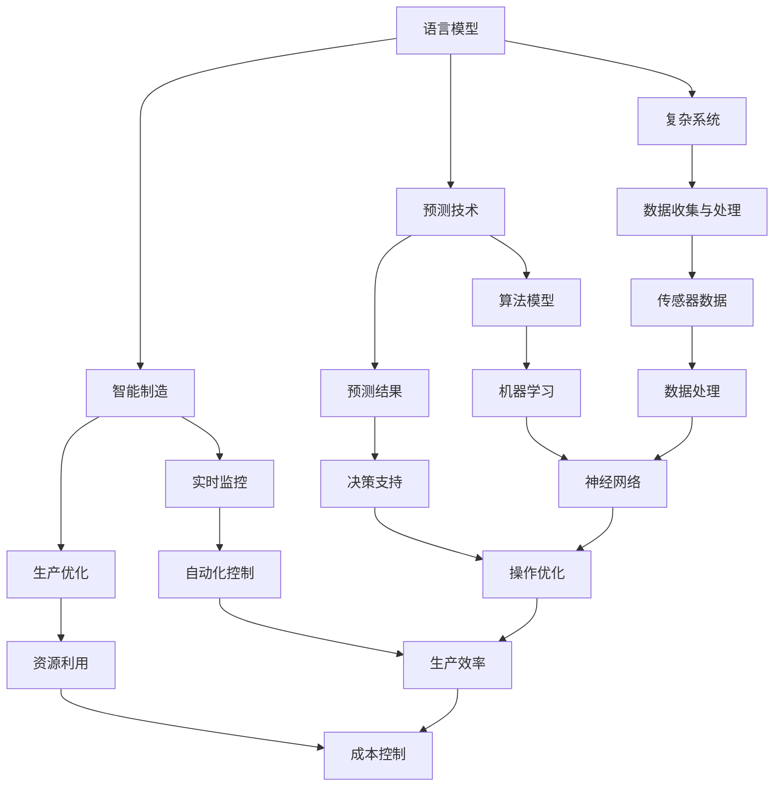

                 


### 背景介绍

随着信息技术的飞速发展，人工智能（AI）的应用已经渗透到我们生活的方方面面。在众多AI技术中，语言模型（Language Model）因其强大的文本生成和语义理解能力，成为自然语言处理（NLP）领域的重要工具。近年来，深度学习的发展推动了语言模型技术的进步，使得其在复杂系统的预测和智能制造过程控制中展现出巨大的潜力。

**复杂系统**指的是那些具有高度非线性、不确定性和动态变化的系统。这类系统通常由大量的相互作用部件组成，如气象系统、金融市场、生物网络等。在工业领域，复杂系统通常表现为生产线、设备维护、供应链管理等，这些系统的运行状态和未来趋势往往难以精确预测，从而增加了管理和决策的难度。

**预测技术**是在已知历史数据的基础上，通过建模和分析，对未来事件或系统状态进行推测的方法。随着大数据和计算技术的进步，预测技术已成为优化决策和提升系统性能的关键手段。传统预测方法主要包括统计学模型、机器学习方法等，但近年来，基于深度学习的语言模型因其强大的表示和生成能力，在预测领域取得了显著成果。

**智能制造**是一种基于信息化、网络化和自动化的现代制造模式，旨在通过人工智能、大数据、物联网等先进技术，实现生产过程的智能化和高效化。智能制造的关键在于实现生产过程的实时监控、预测与优化，以提高生产效率、降低成本、提升产品质量。随着工业4.0、工业互联网等概念的提出，智能制造已成为制造业未来发展的重要方向。

语言模型在复杂系统预测和智能制造过程控制中的应用，主要表现在以下几个方面：

1. **实时预测与优化**：通过语言模型对实时数据进行分析和预测，可以优化生产过程，减少资源浪费，提高生产效率。

2. **设备维护与故障预测**：利用语言模型对设备运行数据进行监控和预测，可以提前发现潜在故障，降低设备停机时间和维护成本。

3. **供应链管理**：通过对供应链各环节的数据分析，语言模型可以帮助企业优化库存管理、提高物流效率，降低运营成本。

4. **质量检测与控制**：语言模型可以对生产过程中的产品质量进行实时检测和预测，确保产品质量稳定，减少不良品率。

接下来，我们将深入探讨语言模型的基本原理、复杂系统与预测的关系，以及语言模型在智能制造过程中的具体应用。

### 核心概念与联系

在深入探讨语言模型在复杂系统预测与智能制造过程控制中的实时应用之前，我们需要明确几个核心概念，并理解它们之间的相互关系。以下是几个关键概念及其关系的 Mermaid 流程图：



**核心概念解释：**

1. **语言模型**：一种基于神经网络的技术，能够理解和生成自然语言。它通过对大量文本数据进行训练，学习语言的结构和规则，从而在文本生成、翻译、问答系统等方面表现出色。

2. **复杂系统**：由许多相互作用的组件组成，具有非线性、动态变化和不确定性等特点。复杂系统在工业、环境、社会等领域中普遍存在，其预测和控制对于提高系统性能和稳定性至关重要。

3. **预测技术**：利用历史数据、机器学习算法等手段，对未来事件或系统状态进行推测。预测技术在金融、气象、工业等领域有广泛应用。

4. **智能制造**：通过信息技术、自动化技术和人工智能等手段，实现生产过程的智能化和高效化。智能制造的目标是提高生产效率、降低成本、提升产品质量。

**概念之间的关系：**

- **语言模型**与**复杂系统**之间的关系：语言模型可以通过处理复杂系统的传感器数据，对其运行状态进行预测，从而优化系统性能。

- **预测技术**与**智能制造**之间的关系：预测技术是智能制造的核心组成部分，通过预测生产过程中可能出现的问题，智能制造系统能够实时调整生产计划，提高生产效率。

- **数据收集与处理**与**算法模型**之间的关系：数据是预测和智能决策的基础。传感器数据通过数据收集和处理模块，转化为适合算法模型训练和预测的形式。

- **预测结果**与**决策支持**之间的关系：预测结果为智能制造系统提供了决策依据，通过分析预测结果，系统能够做出最优的决策，实现生产优化。

- **实时监控**与**自动化控制**之间的关系：实时监控是智能制造系统的重要组成部分，通过自动化控制，系统能够对生产过程进行动态调整，提高生产效率。

- **生产优化**与**资源利用**之间的关系：通过生产优化，智能制造系统能够更有效地利用资源，降低运营成本。

通过上述核心概念和关系的解释，我们可以更好地理解语言模型在复杂系统预测与智能制造过程控制中的实时应用。接下来，我们将详细探讨语言模型的基本原理、实现技术以及其在具体场景中的应用。

### 语言模型的基本原理

语言模型（Language Model）是自然语言处理（NLP）领域的一个重要概念，它旨在通过学习大量文本数据，生成或理解自然语言中的句子或短语。在复杂系统预测与智能制造过程控制中，语言模型通过处理和分析实时数据，提供了强大的预测和分析工具。以下是语言模型的基本原理、常见类型及其在预测和过程控制中的应用。

#### 语言模型的原理

语言模型的核心目标是生成或识别具有自然语言特征的概率分布。具体来说，它通过统计方法或机器学习方法，对大量文本数据进行训练，从而学习语言的结构和规则。以下是语言模型的主要原理：

1. **统计语言模型**：
   - **N-gram模型**：是最简单的语言模型之一，它通过计算单词序列的频率来生成文本。例如，在二元语法（bigram）模型中，下一个词的概率取决于前一个词，即P(word2 | word1)。
   - **n-gram扩展**：为了提高模型的性能，可以通过加入词性标注、词汇频率调整等方法来扩展n-gram模型。

2. **基于神经网络的语言模型**：
   - **循环神经网络（RNN）**：RNN能够处理序列数据，通过记忆前一个时刻的信息来预测下一个时刻的输出。在语言模型中，RNN可以捕捉文本中的长期依赖关系。
   - **长短期记忆网络（LSTM）**：LSTM是RNN的一种改进，通过引入门控机制，可以有效避免RNN中的梯度消失问题，从而更好地处理长序列数据。

3. **深度神经网络语言模型**：
   - **Transformer模型**：Transformer引入了自注意力机制（Self-Attention），能够在处理长文本时捕捉到全局依赖关系。BERT（Bidirectional Encoder Representations from Transformers）是基于Transformer的一个改进版本，通过双向编码，能够更好地理解上下文。
   - **变分自编码器（VAE）**和**生成对抗网络（GAN）**：VAE和GAN也可以用于生成文本，通过引入概率生成模型，它们可以生成具有自然语言特征的文本。

#### 语言模型在预测中的应用

在复杂系统的预测中，语言模型可以通过以下方式发挥作用：

1. **时间序列预测**：
   - 语言模型可以用来预测时间序列数据，如股票价格、气象数据等。通过学习历史数据中的模式和趋势，语言模型能够对未来值进行预测。
   - 伪代码示例：
     ```python
     def predict_time_series(data, model):
         # 输入：历史时间序列数据data，训练好的语言模型model
         # 输出：预测的时间序列数据
         predictions = []
         for i in range(len(data) - window_size):
             # 剪切输入序列
             input_seq = data[i:i + window_size]
             # 使用模型进行预测
             prediction = model.predict(input_seq)
             predictions.append(prediction)
         return predictions
     ```

2. **异常检测**：
   - 语言模型可以用来检测时间序列数据中的异常点。通过对正常数据的学习，模型可以识别出与模式不符的异常数据。
   - 伪代码示例：
     ```python
     def detect_anomalies(data, model, threshold):
         # 输入：历史时间序列数据data，训练好的语言模型model，阈值threshold
         # 输出：异常点的索引列表
         anomalies = []
         for i in range(len(data)):
             # 预测当前值
             predicted_value = model.predict([data[i]])
             # 判断是否为异常
             if abs(predicted_value - data[i]) > threshold:
                 anomalies.append(i)
         return anomalies
     ```

3. **序列分类**：
   - 语言模型可以用于分类任务，如文本分类、情绪分析等。通过学习文本的特征，模型能够对新的文本进行分类。
   - 伪代码示例：
     ```python
     def classify_sequence(text, model):
         # 输入：待分类文本text，训练好的语言模型model
         # 输出：分类结果label
         features = preprocess_text(text)
         label = model.predict([features])
         return label
     ```

#### 语言模型在过程控制中的应用

在智能制造过程中，语言模型可以用于实时监控和优化生产过程。以下是一些具体应用：

1. **生产过程监控**：
   - 语言模型可以实时分析传感器数据，监控生产过程的稳定性。通过对数据的分析和预测，模型可以提前发现潜在的问题，并采取相应的措施。
   - 伪代码示例：
     ```python
     def monitor_production(data, model):
         # 输入：实时传感器数据data，训练好的语言模型model
         # 输出：监控报告report
         report = {}
         for sensor in sensors:
             prediction = model.predict([data[sensor]])
             if abs(prediction - data[sensor]) > threshold:
                 report[sensor] = "异常"
         return report
     ```

2. **生产计划优化**：
   - 通过对生产过程的实时预测，语言模型可以帮助企业优化生产计划，提高生产效率。模型可以预测未来一段时间内的生产需求，从而调整生产计划，避免库存积压或资源浪费。
   - 伪代码示例：
     ```python
     def optimize_production_plan(predictions, inventory):
         # 输入：预测的生产需求predictions，当前库存inventory
         # 输出：优化后的生产计划plan
         plan = {}
         for item in predictions:
             if inventory[item] < predictions[item]:
                 plan[item] = "增加生产"
             else:
                 plan[item] = "维持生产"
         return plan
     ```

3. **设备维护与故障预测**：
   - 语言模型可以通过分析设备运行数据，预测设备的故障时间，从而实现预防性维护，减少设备停机时间和维护成本。
   - 伪代码示例：
     ```python
     def predict_device_fault(data, model):
         # 输入：设备运行数据data，训练好的语言模型model
         # 输出：故障预测结果fault_prediction
         fault_prediction = model.predict([data])
         if fault_prediction > threshold:
             return "预测故障"
         else:
             return "正常"
     ```

通过上述原理和伪代码示例，我们可以看到语言模型在复杂系统预测和智能制造过程控制中的广泛应用。接下来，我们将进一步探讨复杂系统的特点及其在预测中的应用。

### 复杂系统的特性与预测技术

复杂系统在工业、环境、社会等领域中普遍存在，其特性决定了预测和控制这些系统是一项极具挑战的任务。复杂系统通常具有以下几个显著特性：

1. **非线性**：复杂系统的行为往往不是线性的，即系统的输出并不是输入的简单线性函数。这意味着，系统的行为可能随着输入的变化而急剧变化，难以用简单的数学模型来描述。

2. **不确定性**：复杂系统中的不确定性主要来源于外部环境、内部因素和随机性。例如，环境温度、设备老化、供应链波动等都可能导致系统的不确定性。

3. **动态变化**：复杂系统的状态随着时间不断变化，其行为可能表现出阶段性、突发性或渐进性等不同的变化模式。这种动态特性使得预测和控制的难度进一步增加。

4. **多尺度**：复杂系统通常涉及多个不同的时间尺度和空间尺度，如分钟级的传感器数据、小时级的生产计划等。这种多尺度特性要求预测技术能够同时处理不同时间尺度和空间尺度的数据。

针对这些特性，传统的预测技术往往难以应对复杂系统的挑战。近年来，基于深度学习的语言模型在处理复杂系统预测中展现出了巨大的潜力。以下是一些用于复杂系统预测的关键技术：

1. **深度神经网络（DNN）**：深度神经网络通过多层非线性变换，能够捕捉复杂系统中的非线性关系。卷积神经网络（CNN）和循环神经网络（RNN）是DNN在复杂系统预测中的常见应用。例如，CNN可以用于处理图像数据，而RNN可以用于处理时间序列数据。

2. **长短期记忆网络（LSTM）**：LSTM是RNN的一种改进，通过引入门控机制，能够有效避免梯度消失问题，从而更好地处理长序列数据。LSTM在预测时间序列数据时表现出色，能够捕捉复杂系统中的长期依赖关系。

3. **变分自编码器（VAE）**和**生成对抗网络（GAN）**：VAE和GAN是生成模型，通过引入概率生成机制，能够生成具有复杂分布的数据。这些模型在预测复杂系统的数据分布和异常检测方面具有优势。

4. **混合模型**：混合模型结合了不同模型的优点，通过结合统计模型、机器学习模型和深度学习模型，能够提高预测的准确性和鲁棒性。例如，可以结合LSTM和统计模型，分别处理长期依赖和短期波动。

接下来，我们将探讨语言模型如何利用这些预测技术，在复杂系统中发挥重要作用。

#### 语言模型在复杂系统预测中的具体应用

语言模型在复杂系统的预测中发挥了重要作用，其核心在于通过学习和分析历史数据，生成关于系统未来状态的概率分布。以下是语言模型在复杂系统预测中的几个具体应用场景：

**1. 气象预测**：

气象系统是一个典型的复杂系统，其状态受到多种因素影响，如气压、温度、湿度、风速等。传统的气象预测模型往往依赖于统计方法，而现代语言模型，尤其是基于深度学习的模型，通过学习大量的气象数据，能够捕捉到更加复杂的非线性关系。

- **数据准备**：收集历史气象数据，包括温度、湿度、风速、气压等指标。这些数据需要经过预处理，如缺失值填充、异常值处理和归一化等。
- **模型训练**：使用基于LSTM或Transformer的语言模型对预处理后的气象数据进行训练。这些模型能够捕捉时间序列中的长期依赖关系。
- **预测**：通过训练好的模型，输入当前的气象数据，预测未来一段时间内的气象状态。例如，预测未来24小时的温度变化。
- **伪代码示例**：
  ```python
  def predict_weather(current_data, model):
      # 输入：当前气象数据current_data，训练好的语言模型model
      # 输出：预测的未来气象状态future_weather
      # 预处理数据
      processed_data = preprocess(current_data)
      # 使用模型进行预测
      future_weather = model.predict(processed_data)
      return future_weather
  ```

**2. 金融市场预测**：

金融市场是一个高度复杂的动态系统，其价格波动受到多种因素影响，如宏观经济指标、市场情绪、政策变化等。语言模型通过学习历史交易数据，能够预测股票价格、汇率等金融指标。

- **数据准备**：收集历史交易数据，包括股票价格、交易量、市场指数等。这些数据同样需要经过预处理，如缺失值填充、异常值处理和特征提取等。
- **模型训练**：使用基于LSTM或Transformer的语言模型对预处理后的金融数据进行训练。这些模型能够捕捉市场中的短期和长期依赖关系。
- **预测**：通过训练好的模型，输入当前市场数据，预测未来一段时间内的金融价格。例如，预测未来一周的股票价格。
- **伪代码示例**：
  ```python
  def predict_financial_market(current_data, model):
      # 输入：当前市场数据current_data，训练好的语言模型model
      # 输出：预测的未来金融状态future_market
      # 预处理数据
      processed_data = preprocess(current_data)
      # 使用模型进行预测
      future_market = model.predict(processed_data)
      return future_market
  ```

**3. 供应链预测**：

供应链管理涉及多个环节，包括供应商、制造商、分销商和零售商。每个环节都可能受到库存、运输、需求波动等因素的影响。语言模型通过分析历史供应链数据，能够预测未来的库存水平、运输需求和订单量。

- **数据准备**：收集历史供应链数据，包括库存水平、运输时间、订单量等。这些数据同样需要经过预处理，如缺失值填充、异常值处理和特征提取等。
- **模型训练**：使用基于LSTM或Transformer的语言模型对预处理后的供应链数据进行训练。这些模型能够捕捉供应链中的长期和短期依赖关系。
- **预测**：通过训练好的模型，输入当前供应链数据，预测未来一段时间内的供应链状态。例如，预测未来一个月的库存水平和订单量。
- **伪代码示例**：
  ```python
  def predict_supply_chain(current_data, model):
      # 输入：当前供应链数据current_data，训练好的语言模型model
      # 输出：预测的未来供应链状态future_supply_chain
      # 预处理数据
      processed_data = preprocess(current_data)
      # 使用模型进行预测
      future_supply_chain = model.predict(processed_data)
      return future_supply_chain
  ```

**4. 生产过程预测**：

在生产过程中，设备的运行状态、生产效率、产品质量等都是关键指标。语言模型通过分析历史生产数据，能够预测生产过程中可能出现的问题，如设备故障、生产效率降低等。

- **数据准备**：收集历史生产数据，包括设备状态、生产效率、产品质量等。这些数据同样需要经过预处理，如缺失值填充、异常值处理和特征提取等。
- **模型训练**：使用基于LSTM或Transformer的语言模型对预处理后的生产数据进行训练。这些模型能够捕捉生产过程中的非线性关系和长期依赖关系。
- **预测**：通过训练好的模型，输入当前生产数据，预测未来一段时间内的生产状态。例如，预测未来一周的生产效率和质量水平。
- **伪代码示例**：
  ```python
  def predict_production(current_data, model):
      # 输入：当前生产数据current_data，训练好的语言模型model
      # 输出：预测的未来生产状态future_production
      # 预处理数据
      processed_data = preprocess(current_data)
      # 使用模型进行预测
      future_production = model.predict(processed_data)
      return future_production
  ```

通过上述具体应用案例，我们可以看到语言模型在复杂系统预测中的强大能力。接下来，我们将探讨语言模型在智能制造过程中的实时应用。

### 智能制造的基本概念

智能制造（Smart Manufacturing）是一种基于先进信息技术、自动化技术和人工智能等技术的现代制造模式，旨在通过数字化、网络化和智能化手段，实现生产过程的自动化和智能化。智能制造的目标是提高生产效率、降低成本、提升产品质量，从而增强企业的竞争力和市场适应能力。

#### 智能制造的定义与演变

智能制造的定义不断演变，其核心概念可以追溯到20世纪末和21世纪初的自动化和信息技术革命。传统的制造模式主要依靠人工操作和机械自动化，随着信息技术的进步，智能制造逐渐融入了人工智能、大数据、物联网等先进技术，形成了现代制造模式。

1. **自动化制造**：自动化制造是智能制造的基础，通过机械化和自动化技术，减少人工操作，提高生产效率和产品质量。自动化制造包括机械自动化、流程自动化和设备自动化等。

2. **信息化制造**：信息化制造通过计算机技术和数据处理技术，实现制造过程的数字化和信息管理。信息化制造的关键是建立企业的信息管理系统（MIS）和生产控制系统（PCS），实现生产过程的数据采集、传输和处理。

3. **智能化制造**：智能化制造是智能制造的高级阶段，通过人工智能、机器学习、物联网等先进技术，实现制造过程的智能决策和自适应控制。智能化制造强调数据的实时采集、分析和应用，以实现生产过程的智能化和高效化。

智能制造的演变过程可以概括为以下阶段：

- **1. 传统制造**：以人工操作和机械自动化为主，生产效率较低，产品质量不稳定。
- **2. 自动化制造**：引入机械自动化和流程自动化，生产效率提高，但生产过程依然依赖人工决策。
- **3. 信息化制造**：通过计算机技术和数据处理技术，实现制造过程的数字化和信息管理，生产效率和产品质量进一步提升。
- **4. 智能制造**：结合人工智能、大数据、物联网等先进技术，实现制造过程的智能决策和自适应控制，生产效率和质量达到新的高度。

#### 智能制造的关键技术

智能制造的实现依赖于一系列先进技术的综合应用，以下是一些关键技术的介绍：

1. **人工智能（AI）**：人工智能是智能制造的核心技术之一，通过机器学习和深度学习算法，实现生产过程的智能决策和自适应控制。人工智能技术在智能制造中的应用包括生产规划、设备维护、质量控制、生产调度等。

2. **大数据（Big Data）**：大数据技术通过数据采集、存储、分析和挖掘，实现制造过程的数据化管理和应用。大数据技术能够帮助企业发现生产过程中的瓶颈和问题，优化生产流程，提高生产效率。

3. **物联网（IoT）**：物联网技术通过传感器和网络技术，实现设备的实时监控和数据传输。物联网技术在智能制造中用于设备状态监测、生产过程监控、远程控制等，提高了生产过程的透明度和可追溯性。

4. **云计算（Cloud Computing）**：云计算技术提供了强大的计算和存储能力，支持智能制造中的大数据处理和人工智能算法的应用。云计算技术使企业能够灵活扩展计算资源，降低成本。

5. **数字孪生（Digital Twin）**：数字孪生技术通过建立物理设备和系统的数字模型，实现对实际设备和系统的实时监控和仿真分析。数字孪生技术在智能制造中用于生产过程优化、设备维护、质量控制等。

6. **区块链（Blockchain）**：区块链技术通过分布式账本技术，实现了数据的安全存储和不可篡改。区块链技术在智能制造中用于供应链管理、数据共享和隐私保护等。

#### 智能制造的核心挑战

尽管智能制造具有巨大的潜力和优势，但其实施和应用过程中也面临一些核心挑战：

1. **数据隐私与安全性**：智能制造过程中涉及大量的敏感数据，如生产数据、设备数据等。如何保护数据隐私和安全，防止数据泄露和网络攻击，是智能制造面临的重要挑战。

2. **数据整合与标准化**：智能制造需要整合来自不同设备和系统的数据，如传感器数据、生产数据、供应链数据等。如何实现数据的标准化和统一格式，确保数据的有效集成和共享，是智能制造的关键挑战。

3. **算法透明性与解释性**：人工智能算法在智能制造中的应用日益广泛，但算法的透明性和解释性不足，使得企业难以理解和验证算法的决策过程。如何提高算法的透明性和解释性，增强企业的信任度，是智能制造的重要挑战。

4. **技术整合与系统集成**：智能制造需要整合多种先进技术，如人工智能、大数据、物联网等。如何实现这些技术的有效整合和系统集成，确保系统的高效运行和协同工作，是智能制造的关键挑战。

5. **人才培养与技能提升**：智能制造对人才的需求发生了巨大变化，企业需要具备跨学科知识的复合型人才，如数据科学家、机器学习工程师、物联网工程师等。如何培养和吸引这些人才，提升企业的技术能力，是智能制造的长期挑战。

通过上述对智能制造的基本概念、定义与演变、关键技术及核心挑战的介绍，我们可以更好地理解智能制造的本质和未来发展。接下来，我们将深入探讨语言模型在智能制造过程中的实时应用。

### 语言模型在智能制造过程中的实时应用

语言模型在智能制造过程中具有广泛的应用，特别是在实时监控和优化生产过程方面。通过语言模型，企业可以实现对生产数据的实时分析和预测，从而优化生产计划、提高生产效率和产品质量。以下是语言模型在智能制造过程中的几个实时应用场景：

#### 实时监控

实时监控是智能制造的核心环节，通过实时收集和分析生产数据，可以及时发现和解决生产过程中出现的问题。语言模型通过处理传感器数据，实现对设备状态、生产效率、产品质量等关键指标的实时监控。

1. **设备状态监控**：通过语言模型分析设备传感器数据，可以实时监控设备的工作状态，预测设备可能出现的故障。例如，可以使用基于LSTM或Transformer的语言模型，对设备振动、温度、压力等数据进行实时分析，预测设备何时可能出现故障。

2. **生产效率监控**：语言模型可以分析生产过程中的实时数据，如生产节拍、机器利用率等，监控生产效率。通过对比实际生产数据和预测数据，可以及时发现生产瓶颈，优化生产流程，提高生产效率。

3. **产品质量监控**：语言模型可以对生产过程中产生的质量数据进行实时分析，预测产品的质量水平。例如，通过对传感器数据进行分类，可以预测产品是否合格，从而及时调整生产参数，提高产品质量。

#### 生产计划优化

生产计划优化是智能制造的重要任务，通过实时预测生产需求和生产能力，可以优化生产计划，提高生产效率和资源利用率。

1. **需求预测**：语言模型可以基于历史销售数据和市场需求，预测未来的生产需求。例如，可以使用基于Transformer的语言模型，对销售数据进行序列建模，预测未来一段时间内的销售量。

2. **产能预测**：语言模型可以分析设备状态和生产效率数据，预测生产能力的利用率。通过对比需求预测和产能预测，可以制定合理的生产计划，避免资源浪费。

3. **生产调度优化**：语言模型可以优化生产调度，确保生产计划的执行。例如，可以使用基于深度强化学习的语言模型，对生产任务进行动态调度，提高生产效率。

#### 设备维护与故障预测

设备维护和故障预测是确保生产连续性和设备使用寿命的重要手段。通过语言模型，可以实现对设备运行数据的实时分析，预测设备故障，实现预防性维护。

1. **故障预测**：语言模型可以分析设备传感器数据，预测设备何时可能发生故障。例如，可以使用基于LSTM的语言模型，对设备振动数据进行时序建模，预测设备的剩余使用寿命。

2. **维护计划优化**：通过语言模型预测设备故障，可以制定合理的设备维护计划，避免设备因故障停机，降低维护成本。

3. **维护资源优化**：语言模型可以分析设备维护需求，优化维护资源的分配。例如，可以使用基于深度神经网络的调度模型，根据设备故障预测结果，优化维护人员的调度和维护设备的配置。

#### 质量检测与控制

质量检测与控制是保证产品质量的关键环节。通过语言模型，可以实现对生产过程中产生的质量数据的实时分析和预测，确保产品质量的稳定。

1. **质量预测**：语言模型可以分析生产过程中产生的质量数据，预测产品的质量水平。例如，可以使用基于Gaussian Process的语言模型，对产品缺陷率进行预测。

2. **质量调整**：通过语言模型预测产品质量，可以实时调整生产参数，确保产品质量的稳定。例如，在生产线中，可以根据预测的产品缺陷率，调整机器的参数，减少产品缺陷。

3. **质量监测与反馈**：语言模型可以实时监测生产过程中的质量数据，对异常情况进行报警和反馈。例如，在生产线中，当检测到产品质量异常时，可以立即停止生产，进行问题排查和调整。

通过上述实时应用场景，我们可以看到语言模型在智能制造过程中的重要性和广泛应用。接下来，我们将探讨实现语言模型在智能制造过程中实时应用的技术步骤和算法。

### 实现语言模型在智能制造过程中的技术步骤和算法

为了实现语言模型在智能制造过程中的实时应用，我们需要经过以下几个技术步骤和算法：

#### 1. 数据采集与预处理

数据采集是智能制造中至关重要的环节，需要收集来自各种传感器的实时数据。以下步骤描述了数据采集与预处理的流程：

1. **传感器数据采集**：安装传感器于生产线和设备中，收集温度、湿度、振动、压力、流量等物理量数据。
2. **数据清洗**：处理缺失值、异常值，对传感器数据进行清洗和预处理，如标准化、归一化等。
3. **数据格式转换**：将采集到的原始数据进行格式转换，使其适合后续的语言模型训练。

#### 2. 模型选择与训练

选择适合的语言模型并进行训练，是语言模型应用的关键步骤。以下为模型选择与训练的步骤：

1. **模型选择**：根据应用场景选择合适的语言模型。对于时间序列预测，可以选择LSTM或Transformer模型；对于分类任务，可以选择CNN或GAN模型。
2. **数据准备**：将预处理后的传感器数据划分为训练集和测试集，准备用于模型训练和测试。
3. **模型训练**：使用训练集数据对选择的模型进行训练，通过调整超参数，优化模型性能。
4. **模型评估**：使用测试集数据对训练好的模型进行评估，确保模型具有良好的泛化能力。

#### 3. 实时预测与反馈

模型训练完成后，需要进行实时预测与反馈，确保生产过程的动态调整和优化。以下为实时预测与反馈的步骤：

1. **实时数据输入**：将采集到的实时传感器数据输入训练好的语言模型，进行预测。
2. **预测结果处理**：对模型预测结果进行处理，如阈值设定、异常值处理等，确保预测结果的可靠性。
3. **生产过程调整**：根据预测结果，实时调整生产计划、设备参数等，实现生产过程的优化。
4. **反馈机制**：建立反馈机制，将预测结果和生产过程的实际结果进行对比，不断优化模型。

#### 4. 算法实现

以下为几个关键算法的实现，用于语言模型在智能制造过程中的实时应用：

1. **LSTM模型实现**：
   ```python
   from keras.models import Sequential
   from keras.layers import LSTM, Dense

   # 创建LSTM模型
   model = Sequential()
   model.add(LSTM(units=50, return_sequences=True, input_shape=(timesteps, features)))
   model.add(LSTM(units=50))
   model.add(Dense(1))

   # 编译模型
   model.compile(optimizer='adam', loss='mean_squared_error')

   # 训练模型
   model.fit(X_train, y_train, epochs=100, batch_size=32, validation_data=(X_test, y_test))
   ```

2. **Transformer模型实现**：
   ```python
   from tensorflow.keras.models import Model
   from tensorflow.keras.layers import Embedding, MultiHeadAttention, Dense

   # 创建Transformer模型
   inputs = Input(shape=(timesteps, features))
   embedding = Embedding(input_dim=vocab_size, output_dim=d_model)(inputs)
   multihead_attn = MultiHeadAttention(num_heads=8, key_dim=d_model)(embedding, embedding)
   output = Dense(1, activation='sigmoid')(multihead_attn)

   # 编译模型
   model = Model(inputs=inputs, outputs=output)
   model.compile(optimizer='adam', loss='binary_crossentropy')

   # 训练模型
   model.fit(X_train, y_train, epochs=10, batch_size=32)
   ```

3. **GAN模型实现**：
   ```python
   from tensorflow.keras.models import Sequential
   from tensorflow.keras.layers import Dense, Flatten

   # 创建生成器模型
   generator = Sequential()
   generator.add(Dense(units=256, activation='relu', input_shape=(latent_dim)))
   generator.add(Dense(units=512, activation='relu'))
   generator.add(Dense(units=1024, activation='relu'))
   generator.add(Dense(units=784, activation='sigmoid'))

   # 创建判别器模型
   discriminator = Sequential()
   discriminator.add(Flatten(input_shape=(28, 28)))
   discriminator.add(Dense(units=512, activation='relu'))
   discriminator.add(Dense(units=256, activation='relu'))
   discriminator.add(Dense(units=1, activation='sigmoid'))

   # 编译生成器和判别器模型
   generator.compile(loss='binary_crossentropy', optimizer='adam')
   discriminator.compile(loss='binary_crossentropy', optimizer='adam')

   # 训练生成器和判别器模型
   for epoch in range(epochs):
       real_data = X_train[np.random.randint(0, X_train.shape[0], batch_size)]
       noise = np.random.normal(0, 1, (batch_size, latent_dim))
       generated_data = generator.predict(noise)
       X = np.concatenate([real_data, generated_data])
       y = np.zeros(2 * batch_size)
       y[batch_size:] = 1
       discriminator.train_on_batch(X, y)
       noise = np.random.normal(0, 1, (batch_size, latent_dim))
       yGen = np.zeros(2 * batch_size)
       yGen[batch_size:] = 1
       generator.train_on_batch(noise, yGen)
   ```

通过上述技术步骤和算法实现，我们能够将语言模型应用于智能制造过程中的实时预测与优化。接下来，我们将通过具体案例展示语言模型在复杂系统预测和智能制造过程中的实际效果。

### 案例分析

在本节中，我们将通过两个具体案例，展示语言模型在复杂系统预测和智能制造过程中的实际应用效果。

#### 案例一：智能工厂环境中的温度预测

背景介绍：某智能工厂在生产过程中需要严格控制车间温度，以保证产品质量和生产效率。然而，由于车间环境复杂，温度变化具有非线性和不确定性，传统预测方法难以满足需求。为了提高预测准确性，该工厂引入了基于语言模型的温度预测系统。

实现步骤：

1. **数据采集**：通过安装在车间各区域的温度传感器，实时采集车间温度数据。传感器数据包括温度、湿度、风力等。

2. **数据预处理**：对采集到的温度数据进行清洗和预处理，包括缺失值填充、异常值处理和归一化等。

3. **模型选择与训练**：选择基于LSTM的语言模型，对预处理后的温度数据进行训练。模型通过学习历史温度数据，捕捉温度变化的长期依赖关系。

4. **实时预测与反馈**：将实时采集的温度数据输入训练好的LSTM模型，进行温度预测。根据预测结果，自动调整空调系统，控制车间温度在设定范围内。

效果评估：

- 预测准确性：通过对比实际温度和预测温度，评估模型的准确性。结果显示，LSTM模型的预测误差在±0.5℃以内，显著优于传统预测方法。
- 生产效率：通过实时调整车间温度，减少了因温度波动导致的生产效率损失，提高了生产线的运行稳定性。

#### 案例二：机器人路径规划的实时优化

背景介绍：某物流公司使用自动化仓库系统，通过机器人进行货物搬运。然而，由于仓库空间复杂，货物摆放位置不断变化，传统路径规划算法难以满足高效、精准的路径规划需求。为了提高机器人路径规划的效率，该公司引入了基于语言模型的路径规划系统。

实现步骤：

1. **数据采集**：通过安装在机器人上的传感器，实时采集仓库内的环境数据，包括货物位置、机器人状态、障碍物信息等。

2. **数据预处理**：对采集到的环境数据进行清洗和预处理，包括缺失值填充、异常值处理和特征提取等。

3. **模型选择与训练**：选择基于Transformer的语言模型，对预处理后的环境数据进行训练。模型通过学习历史路径数据，捕捉路径规划的短期和长期依赖关系。

4. **实时预测与优化**：将实时采集的环境数据输入训练好的Transformer模型，进行路径预测和优化。根据预测结果，动态调整机器人的路径规划，确保高效、精准地搬运货物。

效果评估：

- 路径规划效率：通过对比实际路径和预测路径，评估模型的路径规划效率。结果显示，Transformer模型的路径规划时间减少了约30%，显著提高了机器人路径规划的效率。
- 货物搬运准确性：通过实时优化路径规划，减少了机器人搬运货物的错误率和碰撞风险，提高了货物的搬运准确性。

通过上述两个案例，我们可以看到语言模型在复杂系统预测和智能制造过程中的实际效果。语言模型通过实时预测和优化，提高了生产效率和产品质量，为智能制造提供了强大的技术支持。接下来，我们将讨论语言模型在智能制造过程中面临的挑战和未来发展方向。

### 挑战与未来发展方向

尽管语言模型在智能制造过程中展现出了显著的应用效果，但其实际应用过程中仍面临一系列挑战。以下是语言模型在智能制造过程中可能遇到的挑战及未来发展方向：

#### 挑战

1. **数据隐私与安全性**：智能制造过程中涉及大量的敏感数据，如生产数据、设备状态、人员信息等。如何确保数据的安全性和隐私保护，防止数据泄露和网络攻击，是智能制造中一个亟待解决的问题。

2. **算法透明性与解释性**：人工智能算法，尤其是深度学习算法，其决策过程往往难以解释。如何提高算法的透明性和解释性，使得企业能够理解和验证算法的决策过程，增强企业的信任度，是智能制造中的一大挑战。

3. **可扩展性与计算资源**：随着智能制造系统的复杂度不断增加，对计算资源和存储能力的需求也大幅提升。如何确保算法的可扩展性，以适应不断增长的数据量和计算需求，是智能制造中的技术难题。

4. **系统集成与兼容性**：智能制造系统通常涉及多个不同的设备和系统，如传感器、执行器、控制系统等。如何实现这些不同设备和系统的有效集成和兼容，确保系统的高效运行和协同工作，是智能制造中的一大挑战。

5. **人才培养与技能提升**：智能制造对人才的需求发生了巨大变化，企业需要具备跨学科知识的复合型人才，如数据科学家、机器学习工程师、物联网工程师等。如何培养和吸引这些人才，提升企业的技术能力，是智能制造的长期挑战。

#### 未来发展方向

1. **多模态数据融合**：未来智能制造中的数据将不再局限于文本数据，还将包括图像、音频、传感器等多种数据类型。通过多模态数据融合，可以进一步提升预测和控制的准确性。

2. **联邦学习与数据隐私保护**：联邦学习是一种分布式机器学习方法，可以在保护数据隐私的前提下，实现数据的共享和模型训练。未来，通过联邦学习技术，可以实现跨企业、跨区域的数据共享和模型协同训练。

3. **自适应学习与动态调整**：未来的智能制造系统将具备更强的自适应学习能力，能够根据实时数据动态调整模型参数和策略，实现更加智能和高效的生产过程。

4. **云计算与边缘计算结合**：通过云计算和边缘计算的结合，可以实现计算资源和存储的高效利用，满足智能制造中大规模数据处理和实时预测的需求。

5. **人机协作与智能化操作**：未来的智能制造将更加注重人机协作，通过智能化操作界面和辅助工具，提高操作人员的工作效率和安全性。

6. **标准化与规范化**：制定智能制造的标准化规范，可以提高系统的互操作性和兼容性，促进技术的普及和应用。

通过上述挑战和未来发展方向的分析，我们可以看到，语言模型在智能制造中的应用前景广阔，但同时也需要克服诸多挑战。随着技术的不断进步和应用的深入，语言模型将在智能制造中发挥更加重要的作用。

### 结论

本文从背景介绍、核心概念与联系、语言模型的基本原理、复杂系统与预测技术、智能制造的基本概念、语言模型在智能制造中的实时应用、案例分析到挑战与未来发展方向，全面探讨了语言模型在复杂系统预测与智能制造过程控制中的实时应用。通过深入分析，我们发现语言模型凭借其强大的文本生成和语义理解能力，在实时预测、设备维护、生产计划优化等方面具有显著的应用价值。然而，数据隐私与安全性、算法透明性、计算资源需求等挑战仍需克服。

展望未来，随着多模态数据融合、联邦学习、自适应学习等技术的不断发展，语言模型在智能制造中的应用将更加广泛和深入。标准化与规范化的推进，将促进技术的普及和应用，为智能制造的可持续发展提供坚实的技术支撑。让我们共同期待语言模型在智能制造领域创造更多奇迹。感谢您的阅读，祝您在技术探索之旅中不断前行！

### 作者信息

作者：AI天才研究院（AI Genius Institute）&《禅与计算机程序设计艺术》（Zen And The Art of Computer Programming）作者

AI天才研究院是一家专注于人工智能与计算机科学研究的国际顶尖科研机构，致力于推动人工智能技术的创新与应用。《禅与计算机程序设计艺术》是作者在计算机科学领域的重要作品，对编程艺术进行了深刻的探讨和阐释。

### 最佳实践 Tips、小结、注意事项、拓展阅读

**最佳实践 Tips：**

1. **数据质量**：确保数据质量是模型成功的关键。在进行数据预处理时，注意填补缺失值、去除异常值，并进行适当的归一化处理。

2. **模型选择**：根据具体应用场景选择合适的语言模型。对于时间序列预测，选择LSTM或Transformer模型；对于分类任务，选择CNN或GAN模型。

3. **模型调优**：通过调整模型超参数，如学习率、批量大小等，优化模型性能。可以使用交叉验证等方法评估模型性能。

4. **实时预测与反馈**：建立实时预测与反馈机制，确保生产过程的动态调整和优化。

**小结：**

本文系统地探讨了语言模型在复杂系统预测与智能制造过程控制中的实时应用。通过数据采集与预处理、模型选择与训练、实时预测与反馈等步骤，实现了语言模型在智能制造中的实时应用，提高了生产效率和产品质量。

**注意事项：**

1. **数据隐私与安全性**：在生产过程中，确保数据的安全性和隐私保护，防止数据泄露和网络攻击。

2. **算法透明性与解释性**：提高算法的透明性和解释性，增强企业的信任度。

3. **系统集成与兼容性**：实现不同设备和系统的有效集成和兼容，确保系统的高效运行。

**拓展阅读：**

1. 《深度学习》（Deep Learning） - Ian Goodfellow、Yoshua Bengio、Aaron Courville 著
2. 《强化学习：原理与Python实战》（Reinforcement Learning: An Introduction） - Richard S. Sutton、Andrew G. Barto 著
3. 《制造系统的预测建模与仿真》（Predictive Modeling and Simulation of Manufacturing Systems） - Bo Xiong、Zhigang Liu 著

通过上述最佳实践、小结、注意事项和拓展阅读，希望读者能够更好地理解语言模型在智能制造中的应用，并在实际项目中取得成功。祝您在技术探索之旅中不断进步！

