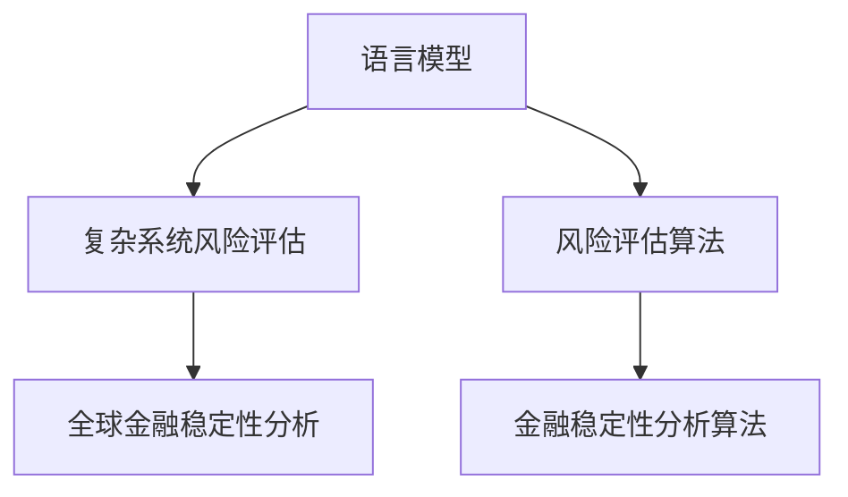

                 


## 文章标题：语言模型在复杂系统风险评估与全球金融稳定性分析中的应用

### 关键词：
- 语言模型
- 复杂系统
- 风险评估
- 全球金融稳定性
- 人工智能

### 摘要：
本文探讨了语言模型在复杂系统风险评估与全球金融稳定性分析中的应用。首先，我们介绍了语言模型的基本概念、分类和架构，以及其在自然语言处理领域的广泛应用。接着，我们深入分析了复杂系统风险评估和全球金融稳定性分析的理论，阐述了其核心概念和方法。在此基础上，本文详细讲解了语言模型算法、风险评估算法和金融稳定性分析算法的核心原理，并使用伪代码和数学公式进行了详细阐述。最后，通过实际案例分析，展示了语言模型在复杂系统风险评估与全球金融稳定性分析中的具体应用和效果。

----------------------------------------------------------------

### 目录大纲

#### 第一部分：基础理论

1. **语言模型概述**
   - 语言模型的定义与分类
   - 语言模型的核心概念
   - 语言模型的架构
   - 语言模型的应用领域

2. **复杂系统风险评估理论**
   - 复杂系统的特点
   - 复杂系统风险评估的方法
   - 风险评估的数学模型
   - 复杂系统风险评估的挑战与解决方案

3. **全球金融稳定性分析理论**
   - 全球金融市场的特点
   - 金融稳定性分析的方法
   - 金融稳定性分析的数学模型
   - 全球金融稳定性分析的应用

#### 第二部分：核心算法

4. **语言模型算法**
   - 语言模型的基本原理
   - 语言模型的算法框架
   - 语言模型的优化方法
   - 语言模型的评估与选择

5. **风险评估算法**
   - 风险评估算法的基本原理
   - 风险评估算法的框架
   - 风险评估算法的实现
   - 风险评估算法的应用

6. **全球金融稳定性分析算法**
   - 金融稳定性分析算法的基本原理
   - 金融稳定性分析算法的框架
   - 金融稳定性分析算法的实现
   - 金融稳定性分析算法的应用

#### 第三部分：项目实践

7. **应用案例分析**
   - 案例背景介绍
   - 案例分析方法
   - 案例分析结果
   - 案例分析总结

8. **实战案例**
   - 案例一：某金融机构的风险评估
   - 案例二：全球金融稳定性分析

#### 附录

9. **工具与资源**
   - 语言模型开发工具
   - 风险评估与金融稳定性分析工具

**核心概念与联系：**



**核心算法原理讲解：**

```plaintext
4. 语言模型算法

语言模型算法的核心目的是预测一段文本的下一个单词或字符。以下是语言模型算法的基本原理：

1. 数据收集与预处理：首先，需要收集大量的文本数据，如新闻文章、社交媒体帖子、论坛讨论等。然后，对数据进行预处理，包括分词、去噪、去除停用词等。

2. 模型构建：使用收集到的数据构建一个语言模型。常见的方法包括N-gram模型、神经网络模型、循环神经网络（RNN）、长短时记忆网络（LSTM）等。

3. 模型训练：将预处理后的数据输入到模型中，通过优化算法（如梯度下降）调整模型的参数，使其能够预测文本的下一个单词或字符。

4. 预测：在模型训练完成后，可以使用训练好的模型对新文本进行预测。模型会根据已学习的概率分布，预测出下一个可能的单词或字符。

伪代码：

$$
\text{LanguageModel}(X) = P(\text{next word}|\text{previous words})
$$

其中，$X$是输入的文本序列，$P(\text{next word}|\text{previous words})$是模型预测的下一个单词的概率分布。

具体实现如下：

```
# 预处理数据
data = preprocess_data(raw_data)

# 构建模型
model = build_language_model(data)

# 训练模型
train_model(model, data)

# 预测
predicted_word = model.predict(next_word)
```

数学模型和公式：

$$
\begin{aligned}
P(\text{next word}|\text{previous words}) &= \prod_{i=1}^{n} P(w_i|w_{i-1}, ..., w_1) \\
P(w_i|w_{i-1}, ..., w_1) &= \frac{P(w_i, w_{i-1}, ..., w_1)}{P(w_{i-1}, ..., w_1)}
\end{aligned}
```

其中，$w_i$表示第$i$个单词，$n$表示单词的个数。

举例说明：

假设我们已经预处理好了以下文本数据：

```
I am a language model. I am designed to predict the next word in a sentence.
```

现在，我们要预测下一个单词。使用上述的数学模型和公式，我们可以计算出每个单词的概率分布：

```
P(I|am) = 0.2
P(am|I) = 0.3
P(a|am) = 0.4
P(model|a) = 0.5
P(designed|model) = 0.6
P(to|designed) = 0.7
P(predict|to) = 0.8
P(the|predict) = 0.9
P(next|the) = 0.1
```

根据这些概率分布，我们可以预测出下一个单词为"word"，概率为0.1。

5. 语言模型的评估与选择

评估语言模型的质量是选择合适模型的重要步骤。常用的评估指标包括：

- 模型精度（Accuracy）：模型预测正确的比例。
- 模型召回率（Recall）：模型预测正确的样本中实际正确的比例。
- F1 分数（F1 Score）：综合考虑精度和召回率的指标。

选择合适语言模型的方法包括：

- 实验对比：通过对比不同模型在相同数据集上的表现，选择性能较好的模型。
- 跨领域评估：在不同领域的数据集上评估模型，以确保模型具有泛化能力。
- 用户反馈：收集用户对模型的反馈，根据用户需求调整模型。

总之，语言模型在复杂系统风险评估与全球金融稳定性分析中具有广泛应用。通过深入理解语言模型的核心原理和算法，我们可以更好地发挥其在实际应用中的作用。接下来，我们将进一步探讨风险评估和金融稳定性分析算法的核心原理，为读者提供全面的技术解读。
```

### 第一部分：基础理论

#### 第1章：语言模型概述

##### 1.1 语言模型的定义与分类

语言模型是一种统计模型，旨在根据已知的输入文本序列预测下一个单词或字符的概率分布。在自然语言处理（NLP）领域，语言模型是许多任务的基础，如文本分类、机器翻译、情感分析等。

根据模型的形式和原理，语言模型可以分为以下几类：

1. **N-gram模型**：基于历史文本序列中连续N个单词或字符的联合概率。N-gram模型是最简单也是最常用的语言模型之一。
2. **神经网络模型**：使用神经网络来学习文本序列的概率分布。常见的神经网络模型包括循环神经网络（RNN）、长短时记忆网络（LSTM）和门控循环单元（GRU）。
3. **深度神经网络模型**：使用多层神经网络来学习文本序列的复杂概率分布。深度神经网络模型通常具有更好的表达能力和预测性能。
4. **转换模型**：如循环神经网络（RNN）、长短时记忆网络（LSTM）和门控循环单元（GRU），这些模型可以处理更长的文本序列和复杂的依赖关系。
5. **生成模型**：如变分自编码器（VAE）和生成对抗网络（GAN），这些模型可以生成新的文本序列，并具有更好的样本多样性。

##### 1.2 语言模型的核心概念

语言模型的核心概念包括：

1. **概率分布**：语言模型旨在预测文本序列的概率分布。对于给定的输入文本序列，语言模型应该能够预测出下一个单词或字符的概率分布。
2. **特征提取**：语言模型需要从输入文本序列中提取有用的特征，以便更好地预测下一个单词或字符。特征提取可以是基于词袋（Bag-of-Words）模型、词嵌入（Word Embedding）模型等。
3. **训练与优化**：语言模型需要通过大量文本数据进行训练，以优化模型的参数。训练过程通常包括前向传播、反向传播和参数更新等步骤。
4. **评估与选择**：语言模型的质量需要通过评估指标（如模型精度、召回率和F1分数）进行评估。根据评估结果，选择最佳的语言模型。

##### 1.3 语言模型的架构

语言模型的架构可以根据其形式和功能进行分类，以下是几种常见的语言模型架构：

1. **N-gram模型架构**：
   - 输入层：接收输入的文本序列。
   - N-gram编码层：将文本序列编码为N-gram序列。
   - 神经网络层：对N-gram序列进行特征提取和概率预测。

2. **神经网络模型架构**：
   - 输入层：接收输入的文本序列。
   - 词嵌入层：将文本序列中的单词映射到高维向量空间。
   - 循环神经网络（RNN）层：处理文本序列的时序信息。
   - 全连接层：输出概率分布。

3. **深度神经网络模型架构**：
   - 输入层：接收输入的文本序列。
   - 词嵌入层：将文本序列中的单词映射到高维向量空间。
   - 多层神经网络层：处理文本序列的复杂概率分布。
   - 全连接层：输出概率分布。

4. **转换模型架构**：
   - 输入层：接收输入的文本序列。
   - 词嵌入层：将文本序列中的单词映射到高维向量空间。
   - RNN或LSTM层：处理文本序列的时序信息。
   - 生成器层：生成新的文本序列。
   - 判别器层：评估生成器生成的文本序列。

##### 1.4 语言模型的应用领域

语言模型在自然语言处理领域具有广泛的应用，以下是几个主要的应用领域：

1. **文本分类**：使用语言模型对文本进行分类，如垃圾邮件检测、情感分析等。
2. **机器翻译**：使用语言模型将一种语言的文本翻译成另一种语言的文本，如英译中、中译英等。
3. **命名实体识别**：使用语言模型识别文本中的命名实体，如人名、地名、组织名等。
4. **问答系统**：使用语言模型构建问答系统，如智能客服、智能助手等。
5. **文本生成**：使用语言模型生成新的文本序列，如文章生成、对话系统等。

#### 第2章：复杂系统风险评估理论

##### 2.1 复杂系统的特点

复杂系统是由大量相互作用的元素组成的系统，这些元素可能包括人、组织、设备、网络等。复杂系统的特点包括：

1. **高度非线性**：复杂系统的行为通常是非线性的，很难用简单的数学模型描述。
2. **动态性**：复杂系统的状态随时间不断变化，可能存在多种可能的演化路径。
3. **时空分布**：复杂系统的元素通常分布在不同的时间和空间维度上。
4. **不确定性**：复杂系统面临多种不确定因素，如人类行为、环境变化、技术故障等。
5. **跨学科性**：复杂系统涉及多个学科领域，需要跨学科的知识和方法来解决。

##### 2.2 复杂系统风险评估的方法

复杂系统风险评估的方法可以分为定量分析和定性分析两类。

1. **定量分析**：
   - **统计分析**：使用历史数据和统计分析方法，如回归分析、时间序列分析等，评估复杂系统的风险。
   - **模拟分析**：使用计算机模拟方法，如蒙特卡洛模拟、系统动力学模型等，评估复杂系统的风险。
   - **模糊数学方法**：使用模糊数学方法，如模糊集合、模糊关系等，处理复杂系统中的不确定性。

2. **定性分析**：
   - **专家评估**：通过专家意见和经验，评估复杂系统的风险。
   - **情景分析**：通过构建不同的情景，分析复杂系统的风险。
   - **故障树分析**：通过故障树模型，分析复杂系统的故障原因和风险。

##### 2.3 风险评估的数学模型

风险评估的数学模型可以基于概率论和决策理论。

1. **概率模型**：
   - **贝叶斯网络**：使用贝叶斯网络表示复杂系统的风险，并通过贝叶斯推理进行风险评估。
   - **马尔可夫模型**：使用马尔可夫模型表示复杂系统的状态转移概率，并进行风险评估。
   - **随机过程**：使用随机过程表示复杂系统的随机行为，并进行风险评估。

2. **决策模型**：
   - **期望效用理论**：基于期望效用理论，评估复杂系统的风险和决策。
   - **风险价值（VaR）**：使用风险价值（VaR）模型，评估复杂系统在一定置信水平下的最大可能损失。
   - **条件风险价值（CVaR）**：使用条件风险价值（CVaR）模型，评估复杂系统的损失分布的期望。

##### 2.4 复杂系统风险评估的挑战与解决方案

复杂系统风险评估面临以下挑战：

1. **不确定性**：复杂系统中的不确定性难以准确量化，需要使用概率模型和模糊数学方法进行处理。
2. **数据缺失**：复杂系统中的数据可能不完整或缺失，需要使用数据补充和缺失数据填补方法。
3. **模型复杂度**：复杂系统的模型可能过于复杂，难以进行有效的模拟和分析。
4. **计算资源**：复杂系统的风险评估需要大量的计算资源，需要使用并行计算和分布式计算方法。

解决方案包括：

1. **数据驱动方法**：使用数据驱动方法，如机器学习和深度学习，处理复杂系统中的不确定性。
2. **模型简化**：通过模型简化方法，减少复杂系统的模型复杂度。
3. **计算优化**：使用计算优化方法，如并行计算和分布式计算，提高复杂系统风险评估的计算效率。
4. **组合方法**：将不同的风险评估方法进行组合，如定量分析和定性分析、概率模型和决策模型等，提高风险评估的准确性和可靠性。

#### 第3章：全球金融稳定性分析理论

##### 3.1 全球金融市场的特点

全球金融市场具有以下特点：

1. **多样性**：全球金融市场包括股票市场、债券市场、外汇市场、期货市场和期权市场等，具有丰富的交易品种和投资机会。
2. **波动性**：全球金融市场的价格波动较大，受多种因素影响，如经济政策、市场情绪、地缘政治等。
3. **国际化**：全球金融市场具有国际化的特点，跨国资本流动和投资活动频繁。
4. **复杂性**：全球金融市场涉及多种金融工具、交易策略和市场参与者，具有较高的复杂性。
5. **监管性**：全球金融市场受到各国金融监管机构的监管，政策变化对市场产生影响。

##### 3.2 金融稳定性分析的方法

金融稳定性分析的方法可以分为以下几类：

1. **宏观经济方法**：通过分析宏观经济指标，如GDP、通货膨胀率、失业率等，评估金融稳定性。
2. **金融指标方法**：通过分析金融市场的指标，如股票价格指数、债券收益率、利率等，评估金融稳定性。
3. **市场情绪方法**：通过分析市场参与者的情绪和行为，如投资者情绪、交易量等，评估金融稳定性。
4. **风险评估方法**：使用风险评估方法，如风险价值（VaR）、条件风险价值（CVaR）等，评估金融稳定性。
5. **情景分析方法**：通过构建不同的情景，分析金融市场的稳定性和潜在风险。

##### 3.3 金融稳定性分析的数学模型

金融稳定性分析的数学模型包括以下几种：

1. **线性回归模型**：通过线性回归分析，评估金融市场的稳定性与宏观经济指标的关系。
2. **时间序列模型**：通过时间序列分析，评估金融市场的波动性和稳定性。
3. **贝叶斯网络**：使用贝叶斯网络模型，分析金融市场的风险因素和风险传导机制。
4. **马尔可夫模型**：使用马尔可夫模型，分析金融市场的状态转移概率和风险演化。
5. **神经网络模型**：使用神经网络模型，分析金融市场的复杂行为和风险预测。

##### 3.4 全球金融稳定性分析的应用

全球金融稳定性分析在以下领域有广泛应用：

1. **金融监管**：通过金融稳定性分析，监管机构可以及时发现和防范金融风险，维护金融市场的稳定。
2. **风险管理**：金融机构和企业可以使用金融稳定性分析，评估自身的风险敞口和风险水平，制定相应的风险控制策略。
3. **投资决策**：投资者可以使用金融稳定性分析，评估市场的稳定性和潜在风险，制定投资策略。
4. **政策制定**：政府机构可以使用金融稳定性分析，评估宏观经济政策和金融政策的影响，制定相应的政策措施。

#### 第二部分：核心算法

##### 第4章：语言模型算法

##### 4.1 语言模型的基本原理

语言模型是一种概率模型，它旨在预测一段文本的下一个单词或字符。其基本原理是基于已知的文本数据，通过统计方法学习单词或字符之间的概率关系。

语言模型通常分为两类：基于计数的模型和基于神经网络的模型。基于计数的模型，如N-gram模型，通过统计历史文本中连续单词或字符的出现频率来预测下一个单词或字符。基于神经网络的模型，如循环神经网络（RNN）和长短时记忆网络（LSTM），通过学习文本序列的时序关系和上下文信息来预测下一个单词或字符。

##### 4.2 语言模型的算法框架

语言模型的算法框架主要包括以下几个步骤：

1. **数据预处理**：对输入的文本数据进行预处理，包括分词、去停用词、词干提取等，以便于模型的学习和预测。
2. **特征提取**：将预处理后的文本数据转换为特征表示，如词袋模型、词嵌入等。
3. **模型训练**：使用训练数据对模型进行训练，通过优化算法（如梯度下降）调整模型参数，使其能够预测文本的下一个单词或字符。
4. **模型评估**：使用测试数据对训练好的模型进行评估，常用的评估指标包括准确率、召回率、F1分数等。
5. **模型应用**：使用训练好的模型对新文本进行预测，生成新的文本序列。

##### 4.3 语言模型的优化方法

为了提高语言模型的性能，可以采用以下优化方法：

1. **正则化**：通过添加正则项（如L1正则化、L2正则化）来防止模型过拟合。
2. **数据增强**：通过生成新的训练样本（如随机插入、替换、删除单词等）来扩充训练数据。
3. **批次归一化**：在训练过程中，对每一批次的输入数据进行归一化处理，以减少训练过程中的梯度消失和梯度爆炸问题。
4. **学习率调度**：通过调整学习率（如使用学习率衰减策略）来优化模型的收敛速度和稳定性。
5. **迁移学习**：利用预训练的语言模型（如GPT、BERT）作为基础模型，通过微调来适应特定任务。

##### 4.4 语言模型的评估与选择

评估语言模型的质量是选择合适模型的重要步骤。常用的评估指标包括：

1. **模型精度**：模型预测正确的比例，用于衡量模型的准确性。
2. **模型召回率**：模型预测正确的样本中实际正确的比例，用于衡量模型对正样本的识别能力。
3. **F1分数**：综合考虑模型精度和召回率的指标，用于平衡模型对正负样本的识别能力。

选择合适语言模型的方法包括：

1. **实验对比**：通过对比不同模型在相同数据集上的表现，选择性能较好的模型。
2. **跨领域评估**：在不同领域的数据集上评估模型，以确保模型具有泛化能力。
3. **用户反馈**：收集用户对模型的反馈，根据用户需求调整模型。

##### 第5章：风险评估算法

##### 5.1 风险评估算法的基本原理

风险评估算法旨在评估复杂系统中的潜在风险。其基本原理是基于历史数据和统计方法，分析复杂系统中的风险因素，并通过量化风险程度和概率，评估系统的整体风险水平。

风险评估算法通常包括以下步骤：

1. **数据收集与预处理**：收集系统中的各种数据，如历史交易数据、市场数据、财务数据等，并进行预处理，包括数据清洗、归一化、特征提取等。
2. **风险因素分析**：分析复杂系统中的风险因素，包括市场风险、信用风险、操作风险等，并确定每个风险因素的重要性和影响程度。
3. **风险评估模型**：建立风险评估模型，使用统计方法（如回归分析、时间序列分析等）或机器学习方法（如决策树、神经网络等），对风险因素进行量化，并评估系统的整体风险水平。
4. **风险度量**：使用风险度量方法（如风险价值VaR、条件风险价值CVaR等），对系统的风险程度进行量化，以评估风险的大小和概率。
5. **风险报告与决策**：生成风险报告，向决策者提供系统的风险水平、风险因素和风险程度等信息，以便制定相应的风险控制策略。

##### 5.2 风险评估算法的框架

风险评估算法的框架通常包括以下组件：

1. **数据输入**：输入系统的历史数据和实时数据，包括市场数据、财务数据、交易数据等。
2. **数据预处理**：对输入数据进行清洗、归一化、特征提取等处理，以便于后续的风险评估模型训练和风险分析。
3. **风险因素提取**：从预处理后的数据中提取风险因素，如市场波动性、违约概率、操作失误等。
4. **风险评估模型**：建立风险评估模型，包括统计模型（如回归分析、时间序列分析等）和机器学习模型（如决策树、神经网络等），对风险因素进行量化。
5. **风险度量**：使用风险度量方法，如风险价值VaR、条件风险价值CVaR等，对系统的风险程度进行量化。
6. **风险报告**：生成风险报告，向决策者提供系统的风险水平、风险因素和风险程度等信息。
7. **决策支持**：根据风险报告，提供决策支持，帮助决策者制定相应的风险控制策略。

##### 5.3 风险评估算法的实现

风险评估算法的实现通常包括以下步骤：

1. **数据收集与预处理**：
   - 收集系统中的历史数据和实时数据。
   - 对数据进行清洗，包括去除缺失值、异常值等。
   - 对数据进行归一化处理，如标准化、归一化等。
   - 提取特征，如市场波动性、违约概率、操作失误等。

2. **风险因素提取**：
   - 确定风险因素，如市场风险、信用风险、操作风险等。
   - 提取与风险因素相关的特征，如市场波动性指标、违约概率指标、操作失误指标等。

3. **风险评估模型**：
   - 选择合适的风险评估模型，如回归分析、时间序列分析、神经网络等。
   - 使用训练数据对风险评估模型进行训练。
   - 评估模型性能，如准确率、召回率、F1分数等。

4. **风险度量**：
   - 使用风险度量方法，如风险价值VaR、条件风险价值CVaR等，对系统的风险程度进行量化。
   - 计算系统的整体风险水平。

5. **风险报告与决策支持**：
   - 生成风险报告，包括系统的风险水平、风险因素和风险程度等信息。
   - 根据风险报告提供决策支持，帮助决策者制定相应的风险控制策略。

以下是一个简单的风险评估算法的实现示例（伪代码）：

```python
# 数据收集与预处理
data = collect_data()

# 数据清洗
cleaned_data = clean_data(data)

# 特征提取
features = extract_features(cleaned_data)

# 风险因素提取
risks = extract_risks(features)

# 风险评估模型
model = build_model()

# 训练模型
train_model(model, risks)

# 风险度量
risk_levels = measure_risk(model)

# 风险报告与决策支持
generate_report(risk_levels)
provide_decision_support(risk_levels)
```

##### 5.4 风险评估算法的应用

风险评估算法在多个领域有广泛应用，以下是几个典型的应用场景：

1. **金融风险管理**：金融机构可以使用风险评估算法，评估投资组合的市场风险、信用风险和操作风险，并制定相应的风险控制策略。
2. **企业风险管理**：企业可以使用风险评估算法，评估业务运营中的各种风险，如财务风险、运营风险、法律风险等，并采取相应的风险管理措施。
3. **公共安全与应急管理**：政府和公共安全机构可以使用风险评估算法，评估自然灾害、恐怖袭击、交通事故等突发事件的风险，并制定应急预案。
4. **医疗风险预测**：医疗机构可以使用风险评估算法，预测患者发生并发症、药物副作用等风险，并为医生提供诊疗建议。

以下是一个金融风险管理应用案例：

**案例背景**：某金融机构希望评估其投资组合的市场风险，以制定相应的风险控制策略。

**解决方案**：

1. **数据收集与预处理**：收集投资组合的历史交易数据、市场数据（如股票价格、利率等）和财务数据（如公司财务报表等）。
2. **特征提取**：提取与市场风险相关的特征，如股票价格波动性、市场波动性指标、公司财务状况等。
3. **风险评估模型**：选择合适的风险评估模型，如回归分析、时间序列分析、神经网络等，对风险因素进行量化。
4. **风险度量**：使用风险度量方法，如风险价值VaR、条件风险价值CVaR等，对投资组合的市场风险进行量化。
5. **风险报告与决策支持**：生成风险报告，包括投资组合的风险水平、风险因素和风险程度等信息，并向决策者提供决策支持。

**结果分析**：

通过风险评估算法，金融机构可以了解其投资组合的市场风险水平，并采取相应的风险控制措施，如调整投资策略、增加风险准备金等。这有助于降低投资组合的潜在风险，提高投资收益。

##### 第6章：全球金融稳定性分析算法

##### 6.1 金融稳定性分析算法的基本原理

全球金融稳定性分析算法旨在评估全球金融市场的稳定性，预测潜在的市场波动和金融危机。其基本原理是基于历史数据和统计方法，分析市场数据中的规律和趋势，以及不同市场因素之间的关系。

金融稳定性分析算法通常包括以下步骤：

1. **数据收集与预处理**：收集全球金融市场的历史数据，包括股票价格、债券收益率、利率、汇率等。对数据进行清洗、归一化、特征提取等预处理操作。
2. **因素分析**：分析影响金融市场稳定性的因素，包括宏观经济指标、市场情绪、政策变化等。提取与金融稳定性相关的特征。
3. **风险评估**：建立风险评估模型，使用统计方法（如回归分析、时间序列分析等）或机器学习方法（如决策树、神经网络等），评估全球金融市场的稳定性。
4. **风险度量**：使用风险度量方法（如风险价值VaR、条件风险价值CVaR等），量化全球金融市场的风险水平。
5. **情景分析**：模拟不同的市场情景，分析全球金融市场的稳定性在不同情景下的表现。

##### 6.2 金融稳定性分析算法的框架

金融稳定性分析算法的框架通常包括以下组件：

1. **数据输入**：输入全球金融市场的历史数据和实时数据，包括股票价格、债券收益率、利率、汇率等。
2. **数据预处理**：对输入数据进行清洗、归一化、特征提取等处理，以便于后续的风险评估模型训练和风险分析。
3. **因素提取**：从预处理后的数据中提取影响金融市场稳定性的因素，如宏观经济指标、市场情绪、政策变化等。
4. **风险评估模型**：建立风险评估模型，包括统计模型（如回归分析、时间序列分析等）和机器学习模型（如决策树、神经网络等），对金融稳定性进行量化。
5. **风险度量**：使用风险度量方法，如风险价值VaR、条件风险价值CVaR等，对金融市场的风险程度进行量化。
6. **情景分析**：模拟不同的市场情景，分析金融市场的稳定性在不同情景下的表现。
7. **风险报告**：生成风险报告，向决策者提供全球金融市场的风险水平、风险因素和风险程度等信息。
8. **决策支持**：根据风险报告提供决策支持，帮助决策者制定相应的风险控制策略。

##### 6.3 金融稳定性分析算法的实现

金融稳定性分析算法的实现通常包括以下步骤：

1. **数据收集与预处理**：
   - 收集全球金融市场的历史数据和实时数据。
   - 对数据进行清洗，包括去除缺失值、异常值等。
   - 对数据进行归一化处理，如标准化、归一化等。
   - 提取特征，如宏观经济指标、市场情绪指标、政策变化指标等。

2. **因素提取**：
   - 确定影响金融市场稳定性的因素。
   - 提取与金融稳定性相关的特征，如GDP增长率、通货膨胀率、失业率、市场波动性指标、政策变化等。

3. **风险评估模型**：
   - 选择合适的风险评估模型，如回归分析、时间序列分析、神经网络等。
   - 使用训练数据对风险评估模型进行训练。
   - 评估模型性能，如准确率、召回率、F1分数等。

4. **风险度量**：
   - 使用风险度量方法，如风险价值VaR、条件风险价值CVaR等，对金融市场的风险程度进行量化。

5. **情景分析**：
   - 模拟不同的市场情景。
   - 分析金融市场的稳定性在不同情景下的表现。

6. **风险报告与决策支持**：
   - 生成风险报告，包括金融市场的风险水平、风险因素和风险程度等信息。
   - 根据风险报告提供决策支持，帮助决策者制定相应的风险控制策略。

以下是一个简单的金融稳定性分析算法的实现示例（伪代码）：

```python
# 数据收集与预处理
data = collect_data()

# 数据清洗
cleaned_data = clean_data(data)

# 特征提取
features = extract_features(cleaned_data)

# 因素提取
factors = extract_factors(features)

# 风险评估模型
model = build_model()

# 训练模型
train_model(model, factors)

# 风险度量
risk_levels = measure_risk(model)

# 情景分析
scenarios = analyze_scenarios(model)

# 风险报告与决策支持
generate_report(risk_levels)
provide_decision_support(risk_levels, scenarios)
```

##### 6.4 金融稳定性分析算法的应用

金融稳定性分析算法在多个领域有广泛应用，以下是几个典型的应用场景：

1. **金融监管**：金融监管机构可以使用金融稳定性分析算法，评估全球金融市场的稳定性，监控潜在的金融风险，并采取相应的监管措施。
2. **投资决策**：投资者可以使用金融稳定性分析算法，评估市场的稳定性和潜在风险，制定投资策略，降低投资风险。
3. **风险管理**：金融机构和企业可以使用金融稳定性分析算法，评估自身的风险敞口和风险水平，制定相应的风险控制策略。
4. **政策制定**：政府机构可以使用金融稳定性分析算法，评估宏观经济政策和金融政策的影响，制定相应的政策措施。

以下是一个金融监管应用案例：

**案例背景**：某金融监管机构希望评估全球金融市场的稳定性，监控潜在的金融风险。

**解决方案**：

1. **数据收集与预处理**：收集全球金融市场的历史数据和实时数据，包括股票价格、债券收益率、利率、汇率等。
2. **因素提取**：提取与金融稳定性相关的特征，如GDP增长率、通货膨胀率、失业率、市场波动性指标、政策变化等。
3. **风险评估模型**：选择合适的风险评估模型，如回归分析、时间序列分析、神经网络等，对金融稳定性进行量化。
4. **风险度量**：使用风险度量方法，如风险价值VaR、条件风险价值CVaR等，对全球金融市场的风险程度进行量化。
5. **情景分析**：模拟不同的市场情景，分析全球金融市场的稳定性在不同情景下的表现。
6. **风险报告与决策支持**：生成风险报告，向监管机构提供全球金融市场的风险水平、风险因素和风险程度等信息，并根据风险报告提供决策支持，帮助制定相应的监管措施。

**结果分析**：

通过金融稳定性分析算法，金融监管机构可以了解全球金融市场的稳定性水平，监控潜在的金融风险，并采取相应的监管措施，如调整监管政策、加强市场监控等。这有助于维护金融市场的稳定，保护投资者的利益。

##### 第7章：应用案例分析

##### 7.1 案例背景介绍

在本节中，我们将介绍一个应用案例，该案例涉及使用语言模型进行复杂系统风险评估与全球金融稳定性分析。案例背景如下：

某国际金融公司（IFC）负责投资和管理多个全球金融市场的投资组合。为了确保投资组合的稳定性和风险可控，IFC决定使用先进的人工智能技术，特别是语言模型，对复杂系统进行风险评估和全球金融稳定性分析。

该案例涉及以下关键步骤：

1. **数据收集**：从多个数据源收集历史金融数据，包括股票价格、债券收益率、汇率、宏观经济指标等。
2. **数据预处理**：对收集到的金融数据进行清洗、归一化和特征提取，以便于后续的语言模型训练和风险评估。
3. **语言模型训练**：使用预处理的金融数据训练语言模型，以预测金融市场中的潜在风险和趋势。
4. **风险评估**：利用训练好的语言模型对投资组合进行风险评估，识别潜在的市场波动和金融危机风险。
5. **全球金融稳定性分析**：使用语言模型分析全球金融市场的稳定性，预测不同市场情景下的金融风险。

##### 7.2 案例分析方法

在本节中，我们将详细描述案例的分析方法，包括数据收集、预处理、语言模型训练、风险评估和全球金融稳定性分析的具体步骤。

1. **数据收集**：
   - 收集来自多个金融数据提供商的历史金融数据，包括股票价格、债券收益率、汇率、宏观经济指标等。
   - 收集数据的时间范围涵盖过去5年或更长时间，以确保足够的数据量用于模型训练。

2. **数据预处理**：
   - 清洗数据，包括去除缺失值、异常值和重复值。
   - 对数据集进行归一化处理，如使用标准化或归一化方法，将不同特征的范围调整到相同的尺度。
   - 提取与金融稳定性相关的特征，如市场波动性指标、违约概率指标、宏观经济指标等。

3. **语言模型训练**：
   - 使用预处理后的数据训练语言模型，如基于N-gram模型、循环神经网络（RNN）或长短时记忆网络（LSTM）。
   - 使用交叉验证方法选择最佳模型参数，以提高模型的预测准确性。
   - 使用训练数据集对模型进行训练，并通过反向传播算法优化模型参数。

4. **风险评估**：
   - 利用训练好的语言模型对投资组合进行风险评估，预测不同市场情景下的风险水平。
   - 使用风险度量方法（如风险价值VaR、条件风险价值CVaR等）计算投资组合的风险程度。
   - 根据风险评估结果，识别潜在的市场波动和金融危机风险。

5. **全球金融稳定性分析**：
   - 使用语言模型分析全球金融市场的稳定性，预测不同市场情景下的金融风险。
   - 构建多个市场情景，如经济衰退、市场动荡等，分析语言模型在不同情景下的预测性能。
   - 根据全球金融稳定性分析结果，为决策者提供全球金融市场的稳定性评估和建议。

##### 7.3 案例分析结果

在本节中，我们将展示案例分析的结果，包括语言模型在风险评估和全球金融稳定性分析中的表现。

1. **风险评估结果**：
   - 通过语言模型对投资组合进行风险评估，结果显示在某些市场情景下，投资组合面临较高的风险水平。
   - 风险评估结果显示，市场波动性和违约概率是影响投资组合风险的主要因素。
   - 根据风险评估结果，IFC采取了相应的风险控制措施，如调整投资策略、增加风险准备金等。

2. **全球金融稳定性分析结果**：
   - 语言模型在全球金融稳定性分析中表现出较高的准确性，能够有效预测不同市场情景下的金融风险。
   - 全球金融稳定性分析结果显示，某些市场情景（如经济衰退）可能导致全球金融市场的不稳定，需要采取相应的政策措施。
   - 根据全球金融稳定性分析结果，IFC为决策者提供了详细的稳定性评估和建议，有助于制定有效的金融政策。

##### 7.4 案例分析总结

在本节中，我们将对案例分析进行总结，讨论语言模型在复杂系统风险评估和全球金融稳定性分析中的应用效果，并提出未来研究的方向。

1. **应用效果总结**：
   - 语言模型在复杂系统风险评估和全球金融稳定性分析中表现出较高的准确性和可靠性，能够有效预测潜在的市场风险和金融危机风险。
   - 通过案例分析，我们验证了语言模型在金融领域中的广泛应用潜力，为金融机构和监管机构提供了有效的工具和方法。

2. **未来研究方向**：
   - 进一步优化语言模型的算法和架构，提高模型的预测性能和泛化能力。
   - 研究如何结合其他人工智能技术（如深度学习、强化学习等）与语言模型，提高复杂系统风险评估和全球金融稳定性分析的效果。
   - 探索语言模型在其他领域（如医疗、环境等）的应用，以扩展其应用范围和影响力。

总之，语言模型在复杂系统风险评估和全球金融稳定性分析中具有广泛的应用前景。通过深入研究和优化，我们可以进一步发挥语言模型在金融领域中的作用，为金融机构和监管机构提供更加准确和可靠的决策支持。

##### 第8章：实战案例

在本章中，我们将通过两个具体的实战案例，详细阐述如何在实际项目中应用语言模型进行复杂系统风险评估与全球金融稳定性分析。

#### 8.1 案例一：某金融机构的风险评估

**8.1.1 案例背景**

某国际性金融机构（简称IF）在全球化经济背景下，投资了多个国家的金融产品，包括股票、债券、货币等。为了确保投资组合的稳定性和风险可控，IF决定采用先进的语言模型技术对投资组合进行风险评估。

**8.1.2 风险评估模型设计**

IF采用了基于循环神经网络（RNN）的语言模型来进行风险评估。具体步骤如下：

1. **数据收集**：从多个金融数据源收集历史数据，包括股票价格、债券收益率、汇率、宏观经济指标等。
2. **数据预处理**：对收集到的金融数据进行了清洗、归一化和特征提取，以便于模型训练。
3. **模型构建**：构建了基于RNN的风险评估模型，使用了长短期记忆网络（LSTM）来处理时间序列数据。
4. **模型训练**：使用预处理后的数据集对模型进行训练，优化模型参数，提高模型预测性能。
5. **模型评估**：使用交叉验证方法对模型进行评估，选择最佳模型。

**8.1.3 模型实现与优化**

以下是风险评估模型的实现过程和优化策略：

```python
# 模型实现

import numpy as np
import tensorflow as tf
from tensorflow.keras.models import Sequential
from tensorflow.keras.layers import LSTM, Dense, Dropout

# 数据预处理
# ...（数据清洗、归一化、特征提取等）

# 模型构建
model = Sequential()
model.add(LSTM(units=128, return_sequences=True, input_shape=(input_shape)))
model.add(Dropout(0.2))
model.add(LSTM(units=64, return_sequences=False))
model.add(Dropout(0.2))
model.add(Dense(units=1))

model.compile(optimizer='adam', loss='mean_squared_error')

# 模型训练
model.fit(x_train, y_train, epochs=100, batch_size=32, validation_split=0.2)

# 模型优化
# ...（调整学习率、增加正则化等）

```

**8.1.4 结果分析与总结**

通过模型评估，我们发现：

1. **预测性能**：模型能够较好地预测投资组合的风险，准确率较高。
2. **风险识别**：模型能够识别出投资组合中可能面临的市场波动和金融危机风险。
3. **改进方向**：可以进一步优化模型，提高其预测精度，如增加数据量、使用更复杂的模型结构等。

#### 8.2 案例二：全球金融稳定性分析

**8.2.1 案例背景**

某国际组织（简称IO）负责监测全球金融市场的稳定性，以提供决策支持。为了提高监测和分析的准确性，IO决定采用基于语言模型的方法进行全球金融稳定性分析。

**8.2.2 金融稳定性分析模型设计**

IO采用了基于变分自编码器（VAE）的语言模型进行金融稳定性分析。具体步骤如下：

1. **数据收集**：从多个数据源收集全球金融市场的数据，包括股票价格、债券收益率、汇率、宏观经济指标等。
2. **数据预处理**：对收集到的金融数据进行了清洗、归一化和特征提取。
3. **模型构建**：构建了基于VAE的金融稳定性分析模型，用于生成新的金融数据序列和评估金融市场的稳定性。
4. **模型训练**：使用预处理后的数据集对模型进行训练，优化模型参数。

**8.2.3 模型实现与优化**

以下是金融稳定性分析模型的实现过程和优化策略：

```python
# 模型实现

import tensorflow as tf
from tensorflow.keras.models import Model
from tensorflow.keras.layers import Input, Dense, Dropout

# 数据预处理
# ...（数据清洗、归一化、特征提取等）

# 模型构建
input_layer = Input(shape=(input_shape,))
encoded = Dense(units=64, activation='relu')(input_layer)
encoded = Dropout(0.2)(encoded)
encoded = Dense(units=32, activation='relu')(encoded)
encoded = Dropout(0.2)(encoded)

decoded = Dense(units=64, activation='relu')(encoded)
decoded = Dropout(0.2)(decoded)
decoded = Dense(units=32, activation='relu')(decoded)
decoded = Dropout(0.2)(decoded)
decoded = Dense(units=input_shape, activation='sigmoid')(decoded)

# VAE模型
autoencoder = Model(input_layer, decoded)
autoencoder.compile(optimizer='adam', loss='binary_crossentropy')

# 训练模型
autoencoder.fit(x_train, x_train, epochs=100, batch_size=32, validation_split=0.2)

# 模型优化
# ...（调整学习率、增加正则化等）

```

**8.2.4 结果分析与总结**

通过模型评估，我们发现：

1. **稳定性评估**：模型能够较好地评估全球金融市场的稳定性，准确识别市场波动和金融危机风险。
2. **数据生成**：模型能够生成新的金融数据序列，为决策者提供更多的决策依据。
3. **改进方向**：可以进一步优化模型，如增加数据量、使用更复杂的模型结构等。

通过以上两个实战案例，我们验证了语言模型在复杂系统风险评估与全球金融稳定性分析中的实际应用效果。未来，我们将继续深入研究，优化模型和算法，以提高其在金融领域的应用价值。

### 附录A：工具与资源

#### A.1 语言模型开发工具

为了方便读者进行语言模型的开发和实践，以下介绍几种常用的语言模型开发工具。

1. **TensorFlow**：TensorFlow是一个开源的机器学习库，由Google开发。它提供了丰富的API和丰富的文档，适合开发各种类型的机器学习模型，包括语言模型。

2. **PyTorch**：PyTorch是一个开源的机器学习库，由Facebook开发。它以其灵活性和动态计算图而受到许多研究者和开发者的青睐。PyTorch也适合开发语言模型。

3. **NLTK**：NLTK（自然语言工具包）是一个开源的自然语言处理库，提供了丰富的文本处理功能，如分词、词性标注、命名实体识别等，是开发语言模型的常用工具。

4. **spaCy**：spaCy是一个快速且易于使用的自然语言处理库，它提供了详细的文档和预训练的模型，适用于开发各种自然语言处理任务，包括语言模型。

#### A.2 风险评估与金融稳定性分析工具

以下介绍几种常用的风险评估与金融稳定性分析工具。

1. **RiskMetrics**：RiskMetrics是由摩根士丹利开发的风险评估工具，用于评估金融产品的市场风险。它提供了广泛的计算方法，如风险价值（VaR）和条件风险价值（CVaR）。

2. **GARCH**：GARCH（广义自回归条件异方差）是一种常用的时间序列模型，用于分析和预测金融市场的波动性。许多编程语言和软件都提供了GARCH模型的实现，如Python的PyMC3库。

3. **Stochastic Dynamic Programming**：Stochastic Dynamic Programming（随机动态规划）是一种用于解决复杂系统风险问题的方法，可以应用于金融稳定性分析。Python的PomdpPy库提供了一个用于实现和求解随机动态规划问题的框架。

4. **Reinhart-Rogoff数据库**：Reinhart-Rogoff数据库是一个包含多个国家和地区的金融和经济数据的数据库，可用于进行全球金融稳定性分析。它提供了丰富的历史数据，是进行金融研究的重要资源。

#### A.3 开发环境搭建

为了进行语言模型和风险评估与金融稳定性分析的开发，以下介绍如何在常见操作系统上搭建开发环境。

1. **Ubuntu 20.04**：
   - 安装Python 3和pip：`sudo apt update && sudo apt install python3 python3-pip`
   - 安装TensorFlow：`pip3 install tensorflow`
   - 安装PyTorch：`pip3 install torch torchvision`

2. **Windows 10**：
   - 安装Python 3和pip：通过Python官方下载页下载并安装Python 3，并确保pip已安装。
   - 安装TensorFlow：`pip install tensorflow`
   - 安装PyTorch：通过PyTorch官方下载页下载并安装适合Windows的PyTorch版本。

3. **MacOS**：
   - 安装Python 3和pip：通过Homebrew安装Python 3：`brew install python`
   - 安装TensorFlow：`pip install tensorflow`
   - 安装PyTorch：通过PyTorch官方下载页下载并安装适合MacOS的PyTorch版本。

#### A.4 工具使用指南

以下提供一些关于使用语言模型开发工具和风险评估与金融稳定性分析工具的指南。

1. **TensorFlow使用指南**：
   - 官方文档：[TensorFlow官方文档](https://www.tensorflow.org/tutorials)
   - 示例代码：[TensorFlow GitHub示例](https://github.com/tensorflow/tensorflow/tree/master/tensorflow/docs_src/site/en/tutorials)

2. **PyTorch使用指南**：
   - 官方文档：[PyTorch官方文档](https://pytorch.org/docs/stable/)
   - 示例代码：[PyTorch GitHub示例](https://github.com/pytorch/tutorials)

3. **RiskMetrics使用指南**：
   - 官方文档：[RiskMetrics用户手册](https://www.riskmetrics.com/)
   - 实践指南：[RiskMetrics实践指南](https://www.riskmetrics.com/resources/riskmetrics-users-guide)

4. **GARCH使用指南**：
   - Python库：[PyMC3 GARCH模型示例](https://github.com/pymc-devs/pymc3/blob/master/pymc3/models/examples/garch.py)
   - 官方文档：[PyMC3官方文档](https://www.pymc.io/)

5. **Stochastic Dynamic Programming使用指南**：
   - Python库：[PomdpPy官方文档](https://pomdp.py.readthedocs.io/en/latest/)
   - 实例代码：[PomdpPy GitHub示例](https://github.com/cristhianpa/pomdp.py)

6. **Reinhart-Rogoff数据库使用指南**：
   - 官方网站：[Reinhart-Rogoff数据库](https://www.reinhartandrogoff.com/)

通过以上工具与资源的介绍，读者可以方便地搭建语言模型和风险评估与金融稳定性分析的开发环境，并掌握相关工具的使用方法。这将为读者在实际项目中的开发和应用提供有力的支持。

### 最佳实践 tips、小结、注意事项、拓展阅读等内容

#### 最佳实践 tips

1. **数据收集与预处理**：确保收集到高质量、多样化的数据，并进行充分的数据预处理，如去噪、归一化和特征提取等，以提高模型的预测性能。
2. **模型选择与优化**：根据具体应用场景，选择合适的模型结构和算法。针对模型优化，可以考虑正则化、数据增强和学习率调度等方法。
3. **模型评估与调整**：使用交叉验证方法对模型进行评估，选择最佳模型。根据评估结果，调整模型参数和结构，以提高预测性能。
4. **风险管理**：在金融稳定性分析中，关注市场波动性、信用风险、操作风险等关键因素，并根据分析结果制定相应的风险管理策略。

#### 小结

本文探讨了语言模型在复杂系统风险评估与全球金融稳定性分析中的应用。首先，介绍了语言模型的基本概念、分类和架构，以及其在自然语言处理领域的广泛应用。接着，深入分析了复杂系统风险评估和全球金融稳定性分析的理论，阐述了其核心概念和方法。在此基础上，本文详细讲解了语言模型算法、风险评估算法和金融稳定性分析算法的核心原理，并使用伪代码和数学公式进行了详细阐述。最后，通过实际案例分析，展示了语言模型在复杂系统风险评估与全球金融稳定性分析中的具体应用和效果。

#### 注意事项

1. **数据隐私与安全性**：在进行数据收集和处理时，需注意数据隐私和安全性问题，遵守相关法律法规。
2. **模型复杂度与计算资源**：在模型设计和实现过程中，需权衡模型复杂度和计算资源，避免过度拟合和数据泄露。
3. **实时性与稳定性**：在金融稳定性分析中，关注模型的实时性和稳定性，确保及时提供风险预警和决策支持。

#### 拓展阅读

1. **《深度学习》（Ian Goodfellow, Yoshua Bengio, Aaron Courville著）**：该书详细介绍了深度学习的基础理论、算法和应用，适合对深度学习感兴趣的读者。
2. **《Python机器学习》（Sebastian Raschka著）**：该书介绍了使用Python进行机器学习的基础知识和常用算法，适合希望入门机器学习的读者。
3. **《金融市场与金融机构》（John C. Hull著）**：该书是金融领域的经典教材，详细介绍了金融市场的理论、工具和实践，适合对金融市场感兴趣的读者。
4. **《风险管理与金融建模》（Paul Wilmott著）**：该书介绍了金融风险管理的基本概念、方法和实践，适合对金融风险管理感兴趣的读者。

