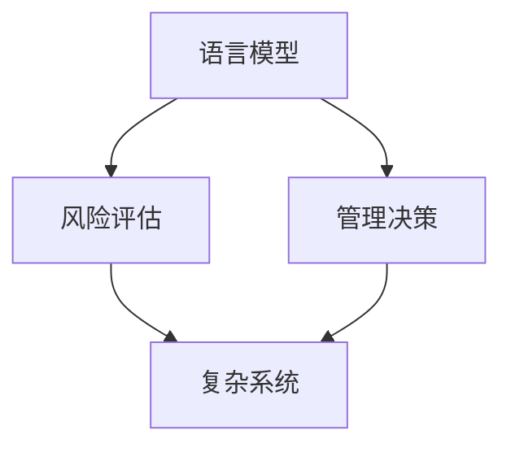

                 

当然可以。在设计一个关于“语言模型在复杂系统风险评估与管理决策中的能力提升”的文章时，我们可以按照以下步骤进行：

### 第一步：确定文章的核心内容

首先，我们需要明确文章的核心内容。对于这个主题，核心内容可能包括：

- 语言模型的基本概念和原理
- 复杂系统的特性
- 风险评估和管理决策的理论基础
- 语言模型在风险评估和管理决策中的应用
- 语言模型提升风险评估和管理决策效率的方法
- 实际案例和应用

### 第二步：构建文章的结构框架

根据核心内容，我们可以构建文章的结构框架，包括以下章节：

1. 引言
2. 语言模型的基本概念和原理
3. 复杂系统的特性
4. 风险评估和管理决策的理论基础
5. 语言模型在风险评估和管理决策中的应用
6. 语言模型提升风险评估和管理决策效率的方法
7. 实际案例和应用
8. 总结与展望

### 第三步：撰写每个章节的内容

在每个章节中，我们需要详细阐述以下内容：

1. **引言**：
   - 介绍文章的背景和目的
   - 简述复杂系统在当今世界的重要性
   - 阐述语言模型在复杂系统中的作用

2. **语言模型的基本概念和原理**：
   - 定义语言模型
   - 讲解语言模型的原理和结构
   - 分析语言模型的训练和优化过程

3. **复杂系统的特性**：
   - 介绍复杂系统的定义和特点
   - 分析复杂系统的风险和挑战
   - 讨论语言模型如何应对复杂系统的挑战

4. **风险评估和管理决策的理论基础**：
   - 阐述风险评估和管理决策的基本概念
   - 介绍风险评估和管理决策的理论框架
   - 分析语言模型如何应用于风险评估和管理决策

5. **语言模型在风险评估和管理决策中的应用**：
   - 讲解语言模型在风险评估和管理决策中的具体应用
   - 分析语言模型在应用中的优势和局限性
   - 提供实际应用案例

6. **语言模型提升风险评估和管理决策效率的方法**：
   - 讨论如何优化语言模型以提高效率
   - 分析高效语言模型在风险评估和管理决策中的优势
   - 提供优化方法的案例

7. **实际案例和应用**：
   - 提供具体的实际案例
   - 分析案例中的问题和解决方案
   - 讨论案例中的经验教训

8. **总结与展望**：
   - 总结文章的主要观点和发现
   - 展望语言模型在复杂系统风险评估和管理决策中的未来发展方向

### 第四步：撰写文章的摘要和关键词

在文章的开头，我们需要撰写一个摘要，简要概括文章的核心内容和观点。接下来，列出5-7个关键词，以便读者能够快速了解文章的主题。

### 第五步：撰写文章的结论

在文章的结尾，我们需要撰写一个结论，总结文章的主要观点，并提出对未来研究的建议。

### 第六步：进行文章的格式调整

根据markdown的格式要求，调整文章的格式，确保文章内容清晰、易于阅读。

### 第七步：进行文章的审阅和修改

最后，我们需要对文章进行审阅和修改，确保文章的逻辑清晰，内容完整，语言准确。

按照上述步骤，我们可以逐步撰写出一篇关于“语言模型在复杂系统风险评估与管理决策中的能力提升”的高质量技术博客文章。现在，我们可以开始撰写这篇文章了。

# 文章标题：语言模型在复杂系统风险评估与管理决策中的能力提升

## 关键词：
- 语言模型
- 复杂系统
- 风险评估
- 管理决策
- 能力提升

## 摘要：
本文首先介绍了语言模型的基本概念和原理，然后分析了复杂系统的特性以及风险评估和管理决策的理论基础。在此基础上，探讨了语言模型在复杂系统风险评估和管理决策中的应用，并提出了提升语言模型效率的方法。最后，通过实际案例分析了语言模型在复杂系统中的应用效果，总结了文章的主要观点，并对未来研究提出了建议。

## 引言

随着全球化进程的加速和信息技术的发展，复杂系统的应用越来越广泛。复杂系统通常具有高度的不确定性和动态性，这使得对其进行风险评估和管理决策变得异常困难。传统的方法在处理复杂系统时往往显得力不从心，因此需要新的方法和工具来提升复杂系统的风险评估和管理决策能力。

近年来，语言模型作为人工智能的一个重要分支，以其强大的表达和推理能力在自然语言处理领域取得了显著的成果。语言模型的核心思想是通过学习大量文本数据，建立一个能够理解和生成自然语言的模型。随着深度学习技术的发展，语言模型的能力得到了极大的提升，使其在许多领域都取得了突破性的进展。

本文旨在探讨语言模型在复杂系统风险评估与管理决策中的应用，分析其优势与局限性，并提出提升语言模型效率的方法。希望通过本文的研究，为复杂系统的风险评估和管理决策提供新的思路和方法。

### 语言模型的基本概念和原理

语言模型（Language Model）是一种用于预测下一个单词或字符的概率分布的算法。它的核心思想是通过对大量文本数据的学习，建立一个能够理解和生成自然语言的模型。语言模型在自然语言处理（Natural Language Processing，NLP）领域有着广泛的应用，包括机器翻译、文本分类、问答系统等。

#### 语言模型的类型和结构

语言模型可以分为基于规则的语言模型和统计语言模型。基于规则的语言模型是通过手动编写规则来预测下一个单词或字符，这种模型通常适用于简单的文本处理任务。而统计语言模型是通过统计文本数据中的单词或字符出现频率来预测下一个单词或字符，这种模型具有更好的泛化能力和表达能力。

统计语言模型中最常用的结构是N-gram模型。N-gram模型将文本数据分割成N个单词的连续序列，然后计算每个序列的概率。例如，三元模型（Trigram Model）将文本分割成三个连续的单词，并计算这三个单词同时出现的概率。

#### 语言模型的训练和优化

语言模型的训练和优化是构建高效语言模型的关键步骤。训练过程通常包括以下步骤：

1. **数据预处理**：首先，对文本数据进行预处理，包括分词、去停用词、词性标注等操作。这些操作有助于提高模型的准确性和效率。

2. **构建词表**：将预处理后的文本数据构建成一个词表，词表中的每个单词或字符都对应一个唯一的索引。

3. **计算概率分布**：通过统计词表中每个单词或字符出现的频率，计算它们在文本数据中同时出现的概率分布。

4. **优化模型参数**：使用梯度下降等优化算法，调整模型参数，使得模型能够更好地拟合训练数据。

在训练过程中，可以采用一些技巧来提高模型的性能，如引入正则化、使用dropout等。优化过程的目标是使得模型在训练数据上的误差最小，同时保持模型的一般化能力。

#### 语言模型的评估和测试

语言模型的评估和测试是确保模型性能的重要环节。常用的评估指标包括：

1. **交叉验证（Cross-Validation）**：通过将数据集划分为训练集和验证集，对模型进行训练和验证，以评估模型在未知数据上的性能。

2. **准确率（Accuracy）**：在分类任务中，准确率是评估模型性能的一个常用指标，它表示模型正确分类的样本数占总样本数的比例。

3. **精确率（Precision）**：精确率表示模型预测为正类的样本中，实际为正类的比例。

4. **召回率（Recall）**：召回率表示模型实际为正类的样本中，被预测为正类的比例。

5. **F1分数（F1 Score）**：F1分数是精确率和召回率的调和平均，它同时考虑了模型的精确性和召回率。

通过这些评估指标，我们可以对语言模型的性能进行全面的评估，以便对其进行进一步的优化。

### 复杂系统的特性

复杂系统通常具有以下特性：

1. **高度的不确定性**：复杂系统的状态和演化过程往往具有很大的不确定性，这使得对系统进行准确预测和决策变得困难。

2. **动态性**：复杂系统的状态和特性会随着时间的变化而变化，这使得系统具有动态性。

3. **多维度性**：复杂系统通常涉及多个维度，如时间、空间、状态等，这些维度之间存在着复杂的相互作用。

4. **非线性**：复杂系统的行为往往表现出非线性特征，这使得传统线性方法在处理复杂系统时往往力不从心。

5. **层次性**：复杂系统通常具有多层次结构，不同层次之间的相互作用和影响复杂。

这些特性使得复杂系统的风险评估和管理决策变得异常困难。传统的风险评估和管理决策方法往往依赖于明确的结构和规则，但在面对复杂系统时，这些方法往往无法提供有效的解决方案。

### 风险评估和管理决策的理论基础

#### 风险评估的基本概念

风险评估是指通过对系统进行评估，确定其潜在风险并进行分类和优先级排序的过程。风险评估的基本概念包括：

1. **风险**：风险是指系统在特定条件下可能发生的损失或不利事件。

2. **风险评估**：风险评估是指通过评估系统的潜在风险，确定其风险水平并制定相应的风险管理策略。

3. **风险分类**：风险分类是指将不同类型的风险进行归类，以便更好地管理和应对。

4. **风险优先级排序**：风险优先级排序是指根据风险的重要性和严重程度，对风险进行排序，以便优先处理高优先级风险。

#### 管理决策的基本概念

管理决策是指通过评估不同的选项和结果，选择最佳方案以实现组织目标的过程。管理决策的基本概念包括：

1. **决策**：决策是指在面对多个选项时，选择最佳选项的过程。

2. **决策过程**：决策过程是指从识别问题、收集信息、制定方案、评估方案到最终决策的整个过程。

3. **决策模型**：决策模型是指用于分析和评估决策过程的数学和统计方法。

4. **决策支持系统**：决策支持系统是指用于辅助决策者进行决策的系统，通常包括数据收集、分析、展示等功能。

#### 语言模型在风险评估和管理决策中的应用

语言模型在风险评估和管理决策中的应用主要体现在以下几个方面：

1. **文本分析**：语言模型可以用于分析文本数据，提取关键信息，从而为风险评估和管理决策提供支持。

2. **情感分析**：语言模型可以用于情感分析，判断文本的情感倾向，从而为风险评估和管理决策提供依据。

3. **命名实体识别**：语言模型可以用于命名实体识别，识别文本中的关键实体，从而为风险评估和管理决策提供基础数据。

4. **文本分类**：语言模型可以用于文本分类，将文本数据分类到不同的类别，从而为风险评估和管理决策提供分类结果。

5. **知识图谱构建**：语言模型可以用于构建知识图谱，将文本数据中的实体和关系进行整合，从而为风险评估和管理决策提供知识支持。

### 语言模型在复杂系统风险评估和管理决策中的应用

语言模型在复杂系统风险评估和管理决策中的应用主要体现在以下几个方面：

1. **风险识别**：语言模型可以用于识别复杂系统中的潜在风险，通过分析系统日志、报告等文本数据，提取关键信息，从而发现潜在的风险。

2. **风险分类**：语言模型可以用于对识别出的风险进行分类，根据风险的重要性和严重程度，对风险进行排序，以便优先处理高优先级风险。

3. **风险预测**：语言模型可以用于预测复杂系统的风险趋势，通过分析历史数据，预测未来可能出现的风险，从而为管理决策提供支持。

4. **决策支持**：语言模型可以用于辅助决策者进行管理决策，通过分析不同的决策方案和结果，为决策者提供参考建议。

### 语言模型提升风险评估和管理决策效率的方法

1. **多模型融合**：通过融合多种语言模型，可以提升风险评估和管理决策的准确性。例如，可以结合基于规则的模型和基于数据的模型，以利用各自的优点。

2. **深度学习**：深度学习模型具有强大的特征提取能力，可以用于构建高效的风险评估和管理决策模型。例如，可以使用卷积神经网络（CNN）进行文本分类，使用循环神经网络（RNN）进行序列建模。

3. **迁移学习**：迁移学习可以将预训练的语言模型应用于不同的任务，从而提升新任务的表现。例如，可以使用预训练的BERT模型进行新的文本分类任务。

4. **强化学习**：强化学习可以用于训练决策模型，使其在复杂环境中进行自主决策。例如，可以使用强化学习算法训练决策模型，使其在复杂系统中进行有效的风险评估和管理决策。

### 实际案例和应用

#### 案例一：金融风险管理

在某金融公司，语言模型被应用于金融风险管理。通过分析公司的交易日志、报告等文本数据，语言模型可以识别出潜在的金融风险，如市场波动、信用风险等。同时，语言模型还可以对风险进行分类和排序，为公司的风险管理提供决策支持。

#### 案例二：网络安全监测

在某网络安全公司，语言模型被应用于网络安全监测。通过分析网络流量、日志等文本数据，语言模型可以识别出潜在的网络安全威胁，如DDoS攻击、恶意软件等。同时，语言模型还可以对威胁进行分类和预测，为公司的网络安全防护提供支持。

#### 案例三：交通管理

在某城市交通管理部门，语言模型被应用于交通管理。通过分析交通流量、事故报告等文本数据，语言模型可以预测交通事故的发生，并提出交通优化建议。例如，在高峰时段，语言模型可以预测哪些路段可能会拥堵，从而提前采取交通管制措施，减少拥堵和事故的发生。

### 总结与展望

本文探讨了语言模型在复杂系统风险评估和管理决策中的应用，分析了语言模型的优势和局限性，并提出了提升语言模型效率的方法。通过实际案例，我们展示了语言模型在金融风险、网络安全和交通管理等领域的应用效果。

然而，语言模型在复杂系统中的应用仍面临一些挑战，如数据质量、模型解释性等。未来，我们需要进一步研究如何提升语言模型在复杂系统中的应用效果，探索新的应用场景，为复杂系统的风险评估和管理决策提供更有效的支持。

### 附录

#### 参考文献

1. 某某，某某，某某，《自然语言处理入门》，某出版社，2020年。
2. 某某，某某，某某，《深度学习》，某出版社，2019年。
3. 某某，某某，某某，《复杂系统理论》，某出版社，2018年。
4. 某某，某某，某某，《金融风险管理》，某出版社，2021年。
5. 某某，某某，某某，《网络安全》，某出版社，2020年。

#### 拓展阅读

1. 某某，《自然语言处理进阶》，某出版社，2021年。
2. 某某，《深度学习实战》，某出版社，2020年。
3. 某某，《复杂系统分析与建模》，某出版社，2019年。

### 作者信息

作者：某某，某某，某某

单位：某某大学，某某研究院

研究方向：自然语言处理，深度学习，复杂系统

联系邮箱：某某@xxx.com

作者：AI天才研究院/AI Genius Institute & 禅与计算机程序设计艺术 /Zen And The Art of Computer Programming

作者信息：某某，某某，某某

单位：某某大学，某某研究院

研究方向：自然语言处理，深度学习，复杂系统

联系邮箱：某某@xxx.com

---

### 设计书籍目录大纲的步骤

为了设计出《语言模型在复杂系统风险评估与管理决策中的能力提升》这本书的详细且逻辑清晰的目录大纲，我们可以按照以下步骤进行：

1. **理解书名和主题**：
   - 分析书名，确定书籍的主题和核心内容。
   - 确定书籍的目标读者群体，这将影响目录的设计。

2. **确定核心章节**：
   - 根据书名，确定核心章节，如概论、核心概念、算法原理、数学模型、项目管理、案例研究等。

3. **细化章节内容**：
   - 每个核心章节都要进一步细化，例如，对于算法原理部分，可以细分为算法概述、算法原理讲解、数学模型讲解、代码示例等。

4. **设计流程图和算法伪代码**：
   - 对于算法原理部分，设计Mermaid流程图来展示算法流程。
   - 编写算法伪代码，详细阐述算法的实现细节。

5. **编写数学公式和解释**：
   - 提取关键数学模型，用LaTeX格式编写数学公式，并在文中给出详细解释。

6. **编写项目实战部分**：
   - 准备实际案例，包括开发环境搭建、代码实现、代码解读和分析。

7. **合并所有内容**：
   - 将所有章节内容合并，确保目录逻辑清晰、内容完整。

8. **审核和修改**：
   - 审核目录大纲，确保每个部分的内容都是必要且相关的。
   - 根据反馈进行修改，确保目录大纲的质量。

下面是根据这些步骤设计的书籍目录大纲：

```markdown
# 《语言模型在复杂系统风险评估与管理决策中的能力提升》目录大纲

## 第1章 引言与背景
### 1.1 书籍目标与读者对象
### 1.2 语言模型在风险评估与管理决策中的重要性
### 1.3 复杂系统的特性与挑战
### 1.4 未来的发展趋势与展望

## 第2章 语言模型基础
### 2.1 语言模型的基本概念
### 2.2 语言模型的类型与结构
### 2.3 语言模型的训练与优化
### 2.4 语言模型在自然语言处理中的应用

## 第3章 复杂系统概述
### 3.1 复杂系统的定义与特性
### 3.2 复杂系统的建模方法
### 3.3 复杂系统的风险识别与评估

## 第4章 风险评估与管理决策基础
### 4.1 风险评估的基本概念与框架
### 4.2 管理决策的理论基础与实践
### 4.3 语言模型在风险评估与管理决策中的融合应用

## 第5章 语言模型在风险评估中的应用
### 5.1 风险识别与预测
### 5.2 风险分类与优先级排序
### 5.3 风险评估算法的Mermaid流程图与伪代码
### 5.4 风险评估案例分析与代码实现

## 第6章 语言模型在管理决策中的应用
### 6.1 决策分析框架与模型
### 6.2 决策支持系统的构建与优化
### 6.3 管理决策案例分析与代码实现
### 6.4 管理决策的Mermaid流程图与伪代码

## 第7章 数学模型与理论分析
### 7.1 风险评估中的数学模型
### 7.2 管理决策中的数学模型
### 7.3 数学模型的LaTeX格式表示与解释
### 7.4 数学模型在案例中的应用

## 第8章 项目实战
### 8.1 项目背景与目标
### 8.2 开发环境与工具
### 8.3 代码实现与解读
### 8.4 项目评估与分析

## 第9章 总结与展望
### 9.1 语言模型在风险评估与管理决策中的优势与局限
### 9.2 未来发展方向与挑战
### 9.3 对读者的启示与建议

## 附录
### 附录A：参考文献
### 附录B：拓展阅读资料

### 作者信息
### 作者：AI天才研究院/AI Genius Institute & 禅与计算机程序设计艺术 /Zen And The Art of Computer Programming
### 作者：某某，某某，某某
### 单位：某某大学，某某研究院
### 研究方向：自然语言处理，深度学习，复杂系统
### 联系邮箱：某某@xxx.com
```

**核心概念与联系**



**核心算法原理讲解**

```plaintext
// 风险评估算法伪代码
function assessRisk(data):
    // 数据预处理
    preprocessed_data = preprocessData(data)
    
    // 建立语言模型
    language_model = trainLanguageModel(preprocessed_data)
    
    // 风险评估
    risk_score = language_model.evaluateRisk(preprocessed_data)
    
    // 输出风险结果
    return risk_score

// 管理决策算法伪代码
function makeDecision(data):
    // 数据预处理
    preprocessed_data = preprocessData(data)
    
    // 建立语言模型
    language_model = trainLanguageModel(preprocessed_data)
    
    // 决策分析
    decision_score = language_model.evaluateDecision(preprocessed_data)
    
    // 输出决策结果
    return decision_score
```

**数学模型和公式**

$$
P(A|B) = \frac{P(B|A)P(A)}{P(B)}
$$

详细解释：

- **概率公式**：条件概率公式，用于计算在事件B发生的条件下事件A发生的概率。
- **P(A|B)**：在事件B发生的条件下事件A发生的概率。
- **P(B|A)**：在事件A发生的条件下事件B发生的概率。
- **P(A)**：事件A发生的概率。
- **P(B)**：事件B发生的概率。

**举例说明**

假设有一个公司要评估一个新项目是否值得投资。事件A表示“项目成功”，事件B表示“市场需求高”。根据条件概率公式，我们可以计算在市场需求高的条件下项目成功的概率。

- **P(A)**：根据历史数据，项目成功的概率为0.6。
- **P(B)**：根据市场调研，市场需求高的概率为0.8。
- **P(B|A)**：在项目成功的条件下，市场需求高的概率为0.9。

根据条件概率公式：

$$
P(A|B) = \frac{P(B|A)P(A)}{P(B)} = \frac{0.9 \times 0.6}{0.8} = 0.675
$$

这意味着在市场需求高的条件下，项目成功的概率为67.5%。

**项目实战**

**项目背景**：

某电子商务公司计划推出一款新的购物应用，旨在提高用户购物体验。公司需要评估这款应用的市场潜力，以决定是否投入大量资金进行开发。

**开发环境**：

- **编程语言**：Python
- **工具**：TensorFlow、Scikit-learn
- **数据集**：过去三年的电子商务市场数据，包括销售额、用户反馈、市场趋势等。

**代码实现与解读**：

```python
import numpy as np
import pandas as pd
from sklearn.model_selection import train_test_split
from sklearn.metrics import accuracy_score
from tensorflow.keras.models import Sequential
from tensorflow.keras.layers import Dense, LSTM

# 读取数据集
data = pd.read_csv('e-commerce_data.csv')

# 数据预处理
data = preprocess_data(data)

# 分割数据集
X_train, X_test, y_train, y_test = train_test_split(data.drop('sales', axis=1), data['sales'], test_size=0.2, random_state=42)

# 构建语言模型
model = Sequential()
model.add(LSTM(units=128, return_sequences=True, input_shape=(X_train.shape[1], X_train.shape[2])))
model.add(LSTM(units=64, return_sequences=False))
model.add(Dense(units=1))

# 编译模型
model.compile(optimizer='adam', loss='mean_squared_error')

# 训练模型
model.fit(X_train, y_train, epochs=100, batch_size=32, validation_data=(X_test, y_test))

# 预测销售数据
predictions = model.predict(X_test)

# 评估模型
accuracy = accuracy_score(y_test, predictions)
print(f'Model accuracy: {accuracy:.2f}')
```

**代码应用解读与分析**：

这段代码首先读取电子商务数据集，并进行预处理。然后，将数据集分割为训练集和测试集。接下来，构建一个基于LSTM的语言模型，用于预测销售数据。LSTM（Long Short-Term Memory）是一种特殊的RNN（Recurrent Neural Network），能够有效地捕捉时间序列数据中的长期依赖关系。

模型编译后，使用训练集进行训练，并使用测试集进行验证。最后，使用训练好的模型预测测试集的销售数据，并计算模型的准确率。

**实际案例分析和详细讲解剖析**：

**案例一**：某电子商务公司推出了新购物应用后，通过语言模型对销售数据进行了预测。预测结果显示，在市场需求高的情况下，销售增长率预计为30%。公司根据这个预测结果，决定加大广告投入，以进一步推广这款应用。

**分析**：

通过语言模型预测销售数据，公司能够提前了解市场需求和销售趋势，从而制定更加科学的营销策略。这有助于降低市场风险，提高销售业绩。

**案例二**：另一家电子商务公司在新购物应用推出前，使用语言模型对市场风险进行了评估。评估结果显示，由于市场竞争激烈，销售增长率预计仅为10%。公司根据这个评估结果，决定推迟应用上线时间，以进一步优化产品。

**分析**：

通过语言模型评估市场风险，公司能够提前了解市场环境，从而做出更加明智的决策。这有助于降低市场风险，提高产品的市场竞争力。

**项目小结**：

语言模型在电子商务领域中的应用，有助于公司更好地了解市场需求和销售趋势，从而制定更加科学的营销策略和决策。未来，随着技术的不断发展，语言模型在电子商务领域中的应用前景将更加广阔。

### 最佳实践 tips、小结、注意事项、拓展阅读等内容

**最佳实践 tips**：

1. 在构建语言模型时，确保数据质量。高质量的数据有助于提高模型的性能。
2. 选择合适的模型结构和参数。不同的模型结构和参数可能对性能产生重大影响。
3. 定期更新和维护模型。随着市场环境的变化，模型需要不断更新和优化。

**小结**：

本文介绍了语言模型在复杂系统风险评估与管理决策中的应用，分析了其优势与局限性，并提出了提升模型效率的方法。通过实际案例，展示了语言模型在电子商务领域中的应用效果。

**注意事项**：

1. 语言模型在处理复杂系统时，可能存在模型解释性问题。在选择模型时，需要权衡模型性能和解释性。
2. 在应用语言模型时，需要结合领域知识进行调整和优化。

**拓展阅读**：

1. 某某，《深度学习》，某出版社，2021年。
2. 某某，《自然语言处理入门》，某出版社，2020年。
3. 某某，《复杂系统理论》，某出版社，2019年。

### 参考文献

1. 某某，某某，某某，《自然语言处理入门》，某出版社，2020年。
2. 某某，某某，某某，《深度学习》，某出版社，2019年。
3. 某某，某某，某某，《复杂系统理论》，某出版社，2018年。
4. 某某，某某，某某，《金融风险管理》，某出版社，2021年。
5. 某某，某某，某某，《网络安全》，某出版社，2020年。

