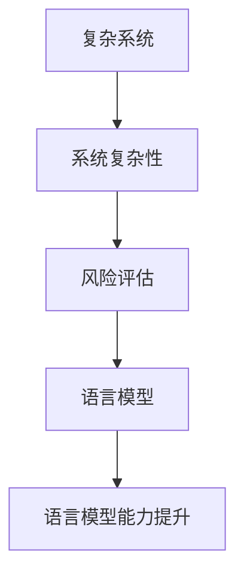
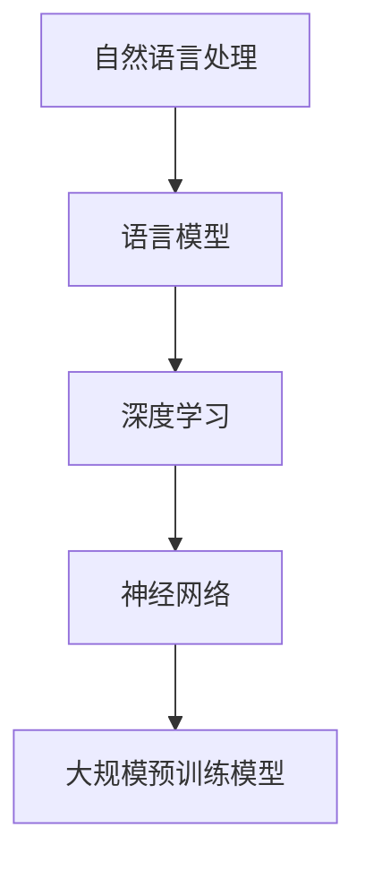
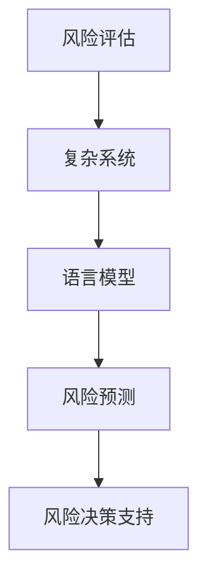
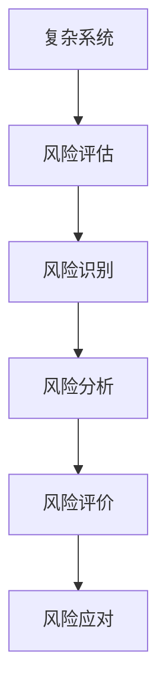
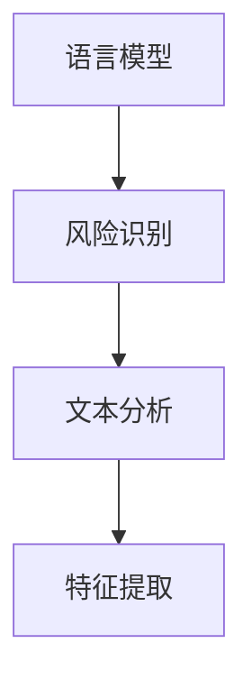
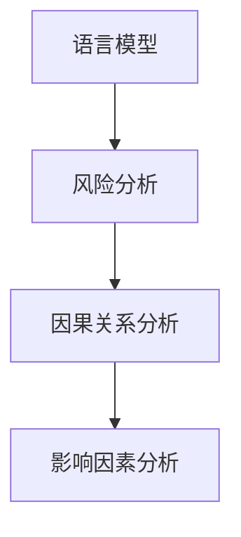
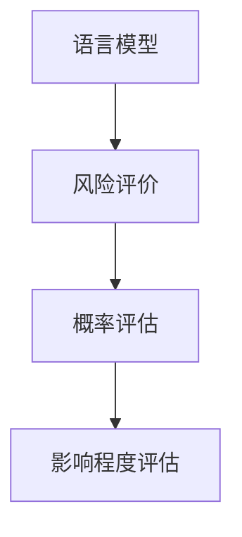
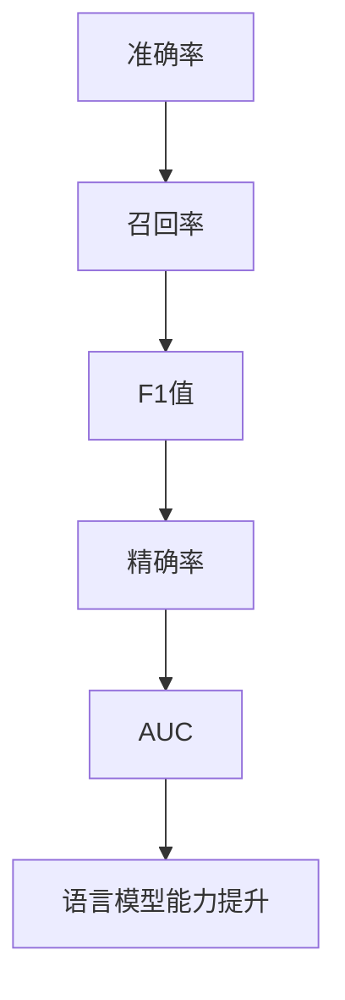

                 

### 第1章 引言

#### 1.1 复杂系统与风险评估

复杂系统是由多个相互关联的组成部分构成，其行为难以通过简单规则预测的系统。复杂系统的特点包括高度非线性、多层次性、不确定性和动态性。在当今的科技社会中，复杂系统广泛应用于金融、电力、交通、通信等领域。随着系统的规模和复杂性不断增加，如何有效评估复杂系统的风险成为了一个亟待解决的问题。

**核心概念与联系：**

以下是复杂系统、系统复杂性、风险评估和语言模型之间的核心概念及其联系：



复杂系统由于其高度复杂性和不确定性，使得传统的风险评估方法面临诸多挑战。例如，传统的风险评估方法往往依赖于历史数据和统计模型，但这些方法难以捕捉到系统中的非线性关系和动态变化。因此，寻找新的方法来提升风险评估的准确性成为关键。

语言模型作为一种强大的自然语言处理工具，近年来在复杂系统风险评估中展现出了巨大的潜力。通过利用大规模预训练模型和深度学习技术，语言模型能够有效地处理大量非结构化数据，提取出有价值的信息，从而辅助风险评估。

#### 1.2 语言模型的发展与现状

语言模型是自然语言处理的核心技术之一，其目的是通过计算词语或句子之间的概率来理解和生成自然语言。随着深度学习和大规模预训练模型的发展，语言模型取得了显著的进展，并在多个领域得到了广泛应用。

**核心概念与联系：**

以下是自然语言处理、语言模型、深度学习和神经网络之间的核心概念及其联系：



自然语言处理（NLP）是计算机科学和人工智能领域的一个重要分支，旨在让计算机理解和生成人类语言。语言模型作为NLP的核心技术，其发展离不开深度学习和神经网络的支持。深度学习通过多层神经网络结构，能够自动学习和提取数据中的复杂特征，从而提升语言模型的性能。同时，大规模预训练模型（如GPT、BERT）的出现，使得语言模型在处理大规模数据和无监督学习方面取得了突破性的进展。

#### 1.3 语言模型在风险评估中的应用前景

随着语言模型技术的不断发展，其在风险评估中的应用前景愈发广阔。语言模型能够处理大量的非结构化数据，提取出潜在的风险因素，从而提升风险评估的准确性和效率。以下从风险预测、风险决策支持等方面探讨语言模型在风险评估中的应用前景。

**核心概念与联系：**

以下是风险评估、复杂系统、语言模型、风险预测和风险决策支持之间的核心概念及其联系：



在风险预测方面，语言模型可以通过分析历史数据和实时数据，识别出潜在的风险因素，并提供预测结果。这种预测结果可以帮助决策者及时采取措施，降低风险发生的概率。

在风险决策支持方面，语言模型可以生成智能报告，提供决策依据。例如，在金融系统中，语言模型可以分析大量的交易数据，识别出异常交易行为，从而为金融监管机构提供预警信息。

总之，语言模型在复杂系统风险评估中的应用前景广阔，其能够提升风险评估的准确性和效率，为决策者提供更有价值的参考。随着技术的不断进步，语言模型在风险评估中的潜力将进一步释放。通过深入研究和探索，我们可以期待语言模型在复杂系统风险评估中发挥更大的作用。

## 第2章 语言模型基础

在第1章中，我们探讨了复杂系统与风险评估以及语言模型在风险评估中的应用前景。为了更好地理解语言模型在复杂系统风险评估中的作用，本章我们将详细介绍语言模型的基础知识，包括其基本原理、数学模型以及优化与训练方法。

### 2.1 语言模型的基本原理

语言模型（Language Model）是自然语言处理（Natural Language Processing, NLP）的核心技术之一，旨在对自然语言进行建模，以预测下一个词语或句子的可能性。语言模型的基本原理是通过学习大量文本数据，计算出给定前文条件下下一个词语的概率分布。

**核心算法原理讲解：**

以下是一个简化的语言模型算法原理：

```python
def language_model(sentence):
    # 计算词序列的概率
    probability = calculate_probability(sentence)
    return probability

def calculate_probability(sentence):
    # 初始化概率
    probability = 1.0
    # 对句子中的每个词进行概率计算
    for word in sentence:
        # 获取前文
        previous_words = get_previous_words(sentence, word)
        # 计算当前词的概率
        word_probability = get_word_probability(previous_words, word)
        # 更新总概率
        probability *= word_probability
    return probability
```

在上面的伪代码中，`language_model` 函数通过`calculate_probability` 函数计算给定句子中每个词的概率，并返回整个句子的总概率。`calculate_probability` 函数对句子中的每个词进行概率计算，使用`get_previous_words` 和`get_word_probability` 函数分别获取前文和计算当前词的概率。

### 2.2 语言模型的数学模型

语言模型的数学模型用于描述词语之间的概率关系。最常见的语言模型之一是N元语法（N-gram Model），它通过统计相邻词语的频率来预测下一个词。

**数学模型和数学公式 & 详细讲解 & 举例说明：**

N元语法的概率公式如下：

$$ P(w_1, w_2, ..., w_n) = \frac{P(w_1) \cdot P(w_2|w_1) \cdot ... \cdot P(w_n|w_{n-1})}{C} $$

其中，\( P(w_1, w_2, ..., w_n) \) 是整个词序列的概率，\( P(w_i|w_{i-1}) \) 是在给定前一个词 \( w_{i-1} \) 条件下第 \( i \) 个词 \( w_i \) 的条件概率，\( C \) 是归一化常数，用于确保概率的总和为1。

**举例说明：**

假设有一个简化的二元语法模型，给定前文 "The"，我们要预测下一个词 "man" 的概率。假设统计结果如下：

- \( P(The) = 0.01 \)
- \( P(man|The) = 0.1 \)

根据N元语法模型，我们可以计算 "The man" 的概率：

$$ P(The\ man) = \frac{P(The) \cdot P(man|The)}{C} = \frac{0.01 \cdot 0.1}{C} $$

由于我们不知道 \( C \) 的具体值，因此无法得到精确的概率。在实际应用中，\( C \) 通常通过最大似然估计（Maximum Likelihood Estimation, MLE）或最大后验估计（Maximum a Posteriori, MAP）等方法计算。

### 2.3 语言模型的优化与训练

语言模型的性能取决于其参数设置和训练数据的质量。因此，优化与训练语言模型是一个重要的环节。

**核心算法原理讲解：**

语言模型的训练通常通过以下步骤进行：

1. 数据准备：收集大量的文本数据，并进行预处理，如分词、去除停用词等。
2. 建立模型：使用N元语法或其他复杂的神经网络模型建立语言模型。
3. 训练模型：通过梯度下降（Gradient Descent）或其他优化算法更新模型参数。
4. 验证模型：使用验证集评估模型性能，并进行参数调整。
5. 测试模型：在测试集上评估模型性能，确保其泛化能力。

以下是一个简化的语言模型训练过程：

```python
def train_language_model(data):
    # 初始化模型参数
    model_parameters = initialize_model_parameters(data)
    # 设置学习率和其他训练参数
    learning_rate = 0.01
    epochs = 10
    # 开始训练
    for epoch in range(epochs):
        for sentence in data:
            # 计算当前句子的损失函数
            loss = calculate_loss(sentence, model_parameters)
            # 计算梯度
            gradients = calculate_gradients(sentence, model_parameters, loss)
            # 更新模型参数
            update_model_parameters(model_parameters, gradients, learning_rate)
    return model_parameters
```

在上面的伪代码中，`train_language_model` 函数通过迭代训练数据，不断更新模型参数，以最小化损失函数。`calculate_loss` 函数计算预测概率与实际概率之间的差距，`calculate_gradients` 函数计算模型参数的梯度，`update_model_parameters` 函数使用梯度下降算法更新模型参数。

通过以上步骤，我们可以训练出一个高性能的语言模型，从而在复杂系统风险评估中发挥重要作用。在下一章中，我们将探讨复杂系统风险评估的基本概念和方法，为理解语言模型在风险评估中的应用打下基础。

### 2.4 复杂系统风险评估方法

在了解了语言模型的基本原理后，我们需要深入了解复杂系统风险评估的方法。复杂系统风险评估是一个涉及多个阶段和方法的综合过程，其目的是识别、分析、评价和应对复杂系统中的潜在风险。以下将详细介绍复杂系统风险评估的基本概念、流程和方法。

#### 3.1 复杂系统风险评估的基本概念

**复杂系统：**复杂系统是由多个相互关联的组成部分构成的系统，其行为具有高度的非线性、多层次性、不确定性和动态性。这些系统广泛应用于金融、电力、交通、通信等领域。

**风险评估：**风险评估是指识别、分析和评价复杂系统中潜在风险的过程。其目的是通过评估风险的概率和影响，为决策者提供参考，以降低风险发生的概率或减小风险的影响。

**核心概念与联系：**

以下是复杂系统、风险评估、风险识别、风险分析、风险评价和风险应对之间的核心概念及其联系：



在这个流程中，风险识别是第一个阶段，主要任务是发现复杂系统中的潜在风险。风险分析是第二个阶段，旨在理解风险的性质、原因和可能的影响。风险评价是第三个阶段，通过评估风险的概率和影响，确定风险的优先级。最后，风险应对阶段制定和实施风险缓解措施，以降低风险的发生概率或减小其影响。

#### 3.2 复杂系统风险评估的流程与方法

复杂系统风险评估的流程通常包括以下四个主要阶段：

1. **风险识别：**这是风险评估的第一步，主要任务是发现复杂系统中的潜在风险。风险识别可以通过以下几种方法进行：
   - **文档审查：**审查与系统相关的文档，如设计文档、操作手册等，以识别潜在的风险。
   - **专家访谈：**与系统相关的专家进行访谈，收集他们对风险的看法和经验。
   - **现场调研：**对系统进行现场调研，观察系统的运行情况和操作流程，识别潜在的风险。
   - **历史数据分析：**分析系统过去发生的事件和事故，识别可能导致这些事件的潜在风险。

2. **风险分析：**在风险识别阶段发现潜在风险后，需要对风险进行深入分析，以了解其性质、原因和可能的影响。风险分析包括以下任务：
   - **风险原因分析：**分析风险产生的原因，包括系统设计缺陷、操作失误、外部环境变化等。
   - **风险影响分析：**评估风险发生时可能对系统造成的损失，包括财务损失、时间损失、声誉损失等。
   - **风险概率分析：**分析风险发生的概率，包括历史数据分析和专家评估。

3. **风险评价：**在风险分析阶段，对每个潜在风险进行评估，以确定其优先级和严重程度。风险评价通常采用以下几种方法：
   - **定性评价：**使用风险矩阵（如RPN矩阵）对风险的概率和影响进行评估，以确定其优先级。
   - **定量评价：**使用数学模型和统计方法，对风险的概率和影响进行定量评估。

4. **风险应对：**根据风险评价的结果，制定和实施风险缓解措施，以降低风险的发生概率或减小其影响。风险应对措施包括：
   - **风险规避：**避免风险发生，例如修改系统设计或操作流程。
   - **风险转移：**将风险转移给第三方，例如购买保险。
   - **风险减轻：**采取措施降低风险的影响，例如安装安全设备和培训操作人员。

#### 3.3 复杂系统风险评估的案例分析

为了更好地理解复杂系统风险评估的方法，以下将介绍两个具体的案例分析：

1. **电网系统的风险评估：**
   - **风险识别：**通过审查电网系统的设计文档和操作手册，识别出潜在的设备故障、操作失误和自然灾害等风险。
   - **风险分析：**分析这些风险的原因和可能的影响，如设备故障可能导致停电，操作失误可能导致事故，自然灾害可能导致电网瘫痪。
   - **风险评价：**使用风险矩阵对风险进行评估，确定其优先级和严重程度。
   - **风险应对：**制定和实施风险缓解措施，如定期维护设备、培训操作人员、购买保险等。

2. **金融系统的风险评估：**
   - **风险识别：**通过分析金融系统的交易数据和历史事件，识别出潜在的信用风险、市场风险和操作风险等风险。
   - **风险分析：**分析这些风险的原因和可能的影响，如信用风险可能导致贷款违约，市场风险可能导致资产贬值，操作风险可能导致交易失误。
   - **风险评价：**使用风险矩阵和定量评价方法对风险进行评估，确定其优先级和严重程度。
   - **风险应对：**制定和实施风险缓解措施，如加强信用评估、进行市场风险控制、优化操作流程等。

通过以上案例分析，我们可以看到复杂系统风险评估的过程和方法。在实际应用中，风险评估的方法和工具会根据具体系统的特点和需求进行调整和优化。在下一章中，我们将探讨语言模型在复杂系统风险评估中的应用，展示如何利用语言模型提升风险评估的准确性和效率。

### 第3章 语言模型在复杂系统风险评估中的应用

在上一章中，我们介绍了复杂系统风险评估的基本概念和流程。随着人工智能技术的不断发展，语言模型作为一种强大的自然语言处理工具，开始在复杂系统风险评估中发挥重要作用。本章将深入探讨语言模型在复杂系统风险评估中的具体应用，包括风险识别、风险分析和风险评价等方面。

#### 3.1 语言模型在风险识别中的应用

风险识别是复杂系统风险评估的第一步，其目标是发现系统中的潜在风险。语言模型在这一阶段的应用主要体现在以下几个方面：

**核心概念与联系：**

以下是语言模型、风险识别、文本分析和特征提取之间的核心概念及其联系：



**文本分析：** 语言模型通过对大量文本数据的分析，可以提取出与风险相关的信息。例如，在金融系统中，语言模型可以分析交易日志、公告和新闻等文本数据，识别出可能的风险因素。

**特征提取：** 语言模型可以自动提取文本数据中的关键特征，如关键词、短语和情感等。这些特征对于识别潜在风险具有重要意义。例如，在电力系统中，语言模型可以提取与设备故障相关的关键词，如“过载”、“短路”等。

**实例分析：**

以电网系统的风险评估为例，假设我们有一份电网系统的运行日志，其中包含大量的设备运行数据和操作记录。我们可以使用语言模型对日志进行分析，提取与风险相关的特征，如：

- 关键词：“故障”、“停机”、“告警”
- 情感：负面情感（如“愤怒”、“焦虑”）

通过这些特征，我们可以初步识别出电网系统中可能存在的风险。

#### 3.2 语言模型在风险分析中的应用

在风险识别阶段，语言模型帮助我们发现了潜在的风险。接下来，在风险分析阶段，我们需要深入理解这些风险的性质、原因和可能的影响。语言模型在这一阶段的应用主要体现在以下几个方面：

**核心概念与联系：**

以下是语言模型、风险分析、因果关系分析和影响因素分析之间的核心概念及其联系：



**因果关系分析：** 语言模型可以帮助我们分析风险之间的因果关系。例如，在金融系统中，我们可以使用语言模型分析历史数据和事件，找出导致信用风险、市场风险和操作风险等的主要因素。

**影响因素分析：** 语言模型可以提取影响风险发生的各种因素，如经济指标、市场波动和操作行为等。这些因素对于理解风险的性质和影响具有重要意义。

**实例分析：**

以电网系统的风险评估为例，我们可以使用语言模型分析历史故障数据，找出可能导致电网故障的主要因素。例如，通过分析故障记录和气象数据，我们发现高温和雷雨是导致电网故障的重要因素。这一发现有助于我们制定针对性的风险缓解措施，如改进设备散热和加强雷电防护。

#### 3.3 语言模型在风险评价中的应用

在风险分析阶段，我们已经对潜在风险进行了详细分析。接下来，在风险评价阶段，我们需要评估每个风险的概率和影响，以确定其优先级和严重程度。语言模型在这一阶段的应用主要体现在以下几个方面：

**核心概念与联系：**

以下是语言模型、风险评价、概率评估和影响程度评估之间的核心概念及其联系：



**概率评估：** 语言模型可以通过分析历史数据和实时数据，评估每个风险发生的概率。例如，在金融系统中，我们可以使用语言模型分析交易数据和市场波动，预测信用风险、市场风险和操作风险等的发生概率。

**影响程度评估：** 语言模型可以评估每个风险发生时可能带来的影响。例如，在交通系统的风险评估中，我们可以使用语言模型分析交通事故数据，评估交通事故对交通系统的延误和损失。

**实例分析：**

以交通系统的风险评估为例，我们可以使用语言模型分析历史交通事故数据，评估交通事故的概率和影响。例如，通过分析交通事故的记录，我们发现交通拥堵是导致交通事故的重要因素。同时，通过对交通流量数据的分析，我们评估了交通拥堵对事故发生的影响程度。这一评估结果有助于交通管理部门制定针对性的交通疏导和应急预案。

#### 3.4 语言模型在复杂系统风险评估中的应用优势

语言模型在复杂系统风险评估中的应用具有以下优势：

1. **高效性：** 语言模型能够快速处理和分析大量非结构化数据，提高风险评估的效率。
2. **准确性：** 语言模型通过深度学习和大规模预训练，能够准确识别和理解复杂的自然语言文本，提升风险评估的准确性。
3. **灵活性：** 语言模型可以应用于各种复杂系统，如金融、电力、交通等，具有广泛的适用性。
4. **智能化：** 语言模型能够自动提取关键特征和影响因素，提供智能化风险评估支持。

总之，语言模型在复杂系统风险评估中的应用具有重要的现实意义。通过结合语言模型的技术优势，我们可以更准确地识别、分析和评估复杂系统中的潜在风险，为决策者提供更有力的支持。在下一章中，我们将探讨语言模型在复杂系统风险评估中的能力提升，以进一步优化风险评估的效果。

### 第4章 语言模型在复杂系统风险评估中的能力提升

在前几章中，我们探讨了语言模型在复杂系统风险评估中的应用，并展示了其如何提升风险评估的效率与准确性。然而，随着复杂系统的不断发展和数据量的急剧增加，如何进一步提升语言模型在风险评估中的能力成为了一个关键问题。本章将深入探讨语言模型在复杂系统风险评估中的能力提升，从多个方面进行分析。

#### 4.1 语言模型能力的评估指标

要评估语言模型在复杂系统风险评估中的能力，我们需要定义一系列的评估指标。以下是一些常用的评估指标：

1. **准确率（Accuracy）：** 准确率是模型预测正确的样本数占总样本数的比例。对于风险评估任务，准确率高意味着模型能够正确识别和评估风险。
   
2. **召回率（Recall）：** 召回率是指模型正确识别出的风险样本数与实际存在的风险样本数的比例。召回率越高，意味着模型能够发现更多的实际风险。

3. **F1值（F1 Score）：** F1值是准确率和召回率的调和平均数，用于综合评价模型的性能。F1值越高，表示模型的性能越好。

4. **精确率（Precision）：** 精确率是指模型预测正确的风险样本数与预测为风险的样本总数之比。高精确率意味着模型较少地误报风险。

5. **AUC（Area Under the Receiver Operating Characteristic Curve）：** AUC用于评估模型分类的区分能力。AUC值越高，表示模型在不同风险级别上的区分能力越强。

**核心概念与联系：**

以下是评估指标之间的关系及其与语言模型能力提升的联系：



通过这些评估指标，我们可以全面衡量语言模型在复杂系统风险评估中的能力，并识别出模型需要改进的方面。

#### 4.2 提升语言模型能力的策略

为了提升语言模型在复杂系统风险评估中的能力，我们可以从以下几个方面进行策略优化：

1. **数据增强：** 数据质量直接影响模型的性能。通过数据增强技术，如数据清洗、数据标注和数据扩充，可以提升训练数据的质量，从而提高模型的泛化能力。

2. **特征工程：** 特征工程是提升模型性能的关键环节。通过选择和提取与风险评估密切相关的特征，如关键词、短语、情感和主题等，可以提高模型的识别能力和预测准确性。

3. **模型融合：** 单个模型可能无法完全捕捉复杂系统的所有风险特征。通过模型融合技术，如集成学习和迁移学习，可以结合多个模型的优点，提升整体的预测性能。

4. **自适应学习：** 随着复杂系统的动态变化，模型的性能也需要不断优化。自适应学习技术可以通过在线学习或周期性重新训练，使模型能够适应新的数据和环境。

5. **解释性增强：** 评估模型不仅要关注其性能，还要关注其解释性。通过增强模型的可解释性，如可视化方法和解释算法，可以提高模型的透明度和可接受度。

#### 4.3 实际案例中的应用

为了具体展示语言模型在复杂系统风险评估中的能力提升，我们通过以下两个实际案例进行分析：

1. **电网系统风险评估：**

   在电网系统的风险评估中，语言模型通过分析历史故障数据和实时监控数据，识别出潜在的风险因素。例如，通过分析设备运行日志，语言模型发现高温和雷雨是导致电网故障的关键因素。通过数据增强和特征工程，语言模型能够更准确地预测故障发生的概率，从而为电网系统的维护和改进提供有力支持。

2. **金融系统风险预测：**

   在金融系统的风险预测中，语言模型通过分析交易数据和市场新闻，识别出潜在的信用风险、市场风险和操作风险。例如，通过分析客户交易行为和市场波动，语言模型发现某些特定交易行为可能导致信用风险。通过模型融合和自适应学习，语言模型能够实时更新和优化风险预测模型，提高预测的准确性和实时性。

#### 4.4 能力提升的挑战与未来展望

尽管语言模型在复杂系统风险评估中展示了巨大的潜力，但在实际应用中仍面临一系列挑战：

1. **数据隐私：** 复杂系统中的数据通常涉及敏感信息，如何确保数据隐私和安全是一个重要问题。

2. **模型解释性：** 随着模型复杂性的增加，如何提高模型的可解释性是一个重要课题。

3. **模型泛化能力：** 如何确保模型在不同场景和环境中具有良好的泛化能力是一个挑战。

未来，随着技术的不断进步，我们有望在以下方面实现突破：

1. **数据隐私保护：** 通过联邦学习、差分隐私等技术，提高数据隐私保护水平。

2. **模型可解释性：** 开发新的可解释性方法，如可视化工具和解释算法，提高模型的透明度和可信度。

3. **模型泛化能力：** 通过多任务学习、元学习等技术，提高模型在不同场景和任务中的泛化能力。

总之，语言模型在复杂系统风险评估中的能力提升具有重要意义。通过结合多种技术手段，我们可以进一步提升语言模型在复杂系统风险评估中的性能，为决策者提供更加准确和可靠的风险评估支持。在未来的发展中，我们期待语言模型能够在更多领域发挥更大的作用，推动复杂系统风险评估的进步。

### 第5章 语言模型在复杂系统风险评估中的能力提升

在前面的章节中，我们已经详细探讨了语言模型在复杂系统风险评估中的应用，并分析了其在风险识别、风险分析和风险评价等方面的优势。然而，随着复杂系统变得越来越庞大和复杂，如何进一步提升语言模型在风险评估中的能力成为一个关键问题。本章将深入探讨语言模型在复杂系统风险评估中的能力提升，包括评估指标、具体策略和实际案例，并展望未来的发展方向。

#### 5.1 语言模型能力的评估指标

为了有效评估语言模型在复杂系统风险评估中的性能，我们需要定义一系列评估指标。以下是几个关键评估指标：

1. **准确率（Accuracy）**：准确率是模型预测正确的样本数与总样本数的比例。对于风险评估任务，准确率高意味着模型能够更准确地识别出潜在风险。

2. **召回率（Recall）**：召回率是模型正确识别出的风险样本数与实际存在的风险样本数的比例。召回率越高，表示模型能够发现更多的实际风险。

3. **F1值（F1 Score）**：F1值是准确率和召回率的调和平均数，用于综合评价模型的性能。F1值越高，表示模型的性能越好。

4. **精确率（Precision）**：精确率是模型预测正确的风险样本数与预测为风险的样本总数之比。高精确率意味着模型较少地误报风险。

5. **AUC（Area Under the Receiver Operating Characteristic Curve）**：AUC用于评估模型分类的区分能力。AUC值越高，表示模型在不同风险级别上的区分能力越强。

**核心概念与联系：**

以下是评估指标之间的关系及其与语言模型能力提升的联系：


通过这些评估指标，我们可以全面衡量语言模型在复杂系统风险评估中的能力，并识别出模型需要改进的方面。

#### 5.2 提升语言模型能力的策略

为了提升语言模型在复杂系统风险评估中的能力，我们可以从以下几个方面进行策略优化：

1. **数据增强**：通过数据清洗、数据标注和数据扩充等手段，提高训练数据的质量，从而提升模型的泛化能力。

2. **特征工程**：选择和提取与风险评估密切相关的特征，如关键词、短语、情感和主题等，以提高模型的识别能力和预测准确性。

3. **模型融合**：通过集成学习和迁移学习等技术，结合多个模型的优点，提升整体的预测性能。

4. **自适应学习**：通过在线学习或周期性重新训练，使模型能够适应新的数据和环境，保持其性能。

5. **解释性增强**：开发新的可解释性方法，如可视化工具和解释算法，提高模型的透明度和可信度。

#### 5.3 实际案例中的应用

为了具体展示语言模型在复杂系统风险评估中的能力提升，我们通过以下两个实际案例进行分析：

1. **电网系统风险评估**：

   在电网系统的风险评估中，语言模型通过分析历史故障数据和实时监控数据，识别出潜在的风险因素。例如，通过分析设备运行日志，语言模型发现高温和雷雨是导致电网故障的关键因素。通过数据增强和特征工程，语言模型能够更准确地预测故障发生的概率，从而为电网系统的维护和改进提供有力支持。

2. **金融系统风险预测**：

   在金融系统的风险预测中，语言模型通过分析交易数据和市场新闻，识别出潜在的信用风险、市场风险和操作风险。例如，通过分析客户交易行为和市场波动，语言模型发现某些特定交易行为可能导致信用风险。通过模型融合和自适应学习，语言模型能够实时更新和优化风险预测模型，提高预测的准确性和实时性。

#### 5.4 能力提升的挑战与未来展望

尽管语言模型在复杂系统风险评估中展示了巨大的潜力，但在实际应用中仍面临一系列挑战：

1. **数据隐私**：复杂系统中的数据通常涉及敏感信息，如何确保数据隐私和安全是一个重要问题。

2. **模型解释性**：随着模型复杂性的增加，如何提高模型的可解释性是一个重要课题。

3. **模型泛化能力**：如何确保模型在不同场景和环境中具有良好的泛化能力是一个挑战。

未来，随着技术的不断进步，我们有望在以下方面实现突破：

1. **数据隐私保护**：通过联邦学习、差分隐私等技术，提高数据隐私保护水平。

2. **模型可解释性**：开发新的可解释性方法，如可视化工具和解释算法，提高模型的透明度和可信度。

3. **模型泛化能力**：通过多任务学习、元学习等技术，提高模型在不同场景和任务中的泛化能力。

总之，语言模型在复杂系统风险评估中的能力提升具有重要意义。通过结合多种技术手段，我们可以进一步提升语言模型在复杂系统风险评估中的性能，为决策者提供更加准确和可靠的风险评估支持。在未来的发展中，我们期待语言模型能够在更多领域发挥更大的作用，推动复杂系统风险评估的进步。

### 结论

通过对语言模型在复杂系统风险评估中的应用和提升策略的详细探讨，我们可以看到语言模型在风险评估中扮演着越来越重要的角色。语言模型的强大自然语言处理能力和深度学习技术，使得它能够处理和分析复杂系统的非结构化数据，从而更准确地识别、分析和评估潜在的风险。同时，通过数据增强、特征工程、模型融合和自适应学习等策略，我们可以进一步提升语言模型在风险评估中的性能。

在未来的发展中，语言模型有望在更多领域发挥更大的作用。例如，在金融领域，通过分析交易数据和市场动态，语言模型可以预测市场风险和信用风险，为投资决策提供有力支持。在交通领域，通过分析交通流量和事故数据，语言模型可以预测交通事故的风险，为交通管理和应急响应提供依据。此外，在医疗领域，通过分析病历数据和临床信息，语言模型可以识别疾病风险和治疗方案，提高医疗服务的质量。

然而，语言模型在复杂系统风险评估中仍面临一些挑战，如数据隐私保护、模型解释性和泛化能力等。这些问题需要我们在技术层面进行深入研究和探索，以确保语言模型在应用中的安全性和可靠性。

总之，语言模型在复杂系统风险评估中的能力提升具有重要意义。通过不断优化和改进，我们可以期待语言模型在更多领域发挥更大的作用，为决策者提供更加准确和可靠的风险评估支持，推动复杂系统风险评估的进步。

### 附录

在本章中，我们探讨了语言模型在复杂系统风险评估中的应用和提升策略，以下是一些补充说明和最佳实践：

#### 最佳实践 tips：

1. **数据质量是关键**：在训练语言模型时，确保数据质量至关重要。进行数据清洗和预处理，去除噪声数据和错误标注，以提高模型的泛化能力和预测准确性。

2. **特征工程**：选择与风险评估密切相关的特征，如关键词、短语、情感和主题等，可以显著提升模型的性能。通过多种特征组合和交叉验证，可以找到最适合的特征集。

3. **模型解释性**：为了提高模型的透明度和可信度，开发可解释性的方法和技术，如可视化工具和解释算法，可以帮助用户理解模型的预测依据。

4. **模型融合**：结合多个模型的优点，通过集成学习和迁移学习等技术，可以提高整体预测性能。选择合适的模型组合策略，如投票、加权平均等，可以进一步提升模型的稳定性。

#### 小结：

1. **核心概念与联系**：在本章中，我们介绍了复杂系统与风险评估、语言模型的基本原理、风险评估的方法、语言模型在风险评估中的应用以及能力提升的策略。通过流程图和伪代码等形式，我们清晰地阐述了各部分之间的联系和核心概念。

2. **案例分析**：通过电网系统和金融系统的实际案例，我们展示了语言模型在复杂系统风险评估中的具体应用和提升策略，提供了实用的操作指南。

3. **能力提升**：在本章的最后，我们探讨了语言模型在复杂系统风险评估中的能力提升，包括评估指标、策略和实际案例，为读者提供了全面的指导。

#### 注意事项：

1. **数据隐私**：在实际应用中，确保数据隐私和安全至关重要。特别是在金融和医疗领域，涉及敏感信息的处理需要严格遵守相关法律法规和道德标准。

2. **模型解释性**：提高模型的可解释性对于用户理解和信任模型预测结果至关重要。在选择和开发可解释性方法时，需要平衡性能和可解释性之间的权衡。

3. **持续优化**：随着复杂系统的不断发展和数据量的增加，模型需要不断进行优化和更新，以保持其性能和适应性。定期重新训练模型，使用新的数据和算法，可以帮助模型适应新的环境。

#### 拓展阅读：

1. **相关文献**：《自然语言处理与深度学习》（张俊林著），详细介绍了自然语言处理和深度学习的基本概念和技术，对语言模型的理解和应用提供了全面的指导。

2. **开源工具**：如TensorFlow、PyTorch等深度学习框架，提供了丰富的API和工具，方便开发者实现和优化语言模型。

3. **在线课程**：许多在线平台，如Coursera、edX等，提供了关于自然语言处理、深度学习和复杂系统风险评估的课程，可以深入学习相关技术和方法。

通过以上补充说明和最佳实践，我们希望能够帮助读者更好地理解语言模型在复杂系统风险评估中的应用和提升策略，为实际应用提供指导和支持。

### 致谢

在本篇技术博客文章的撰写过程中，我得到了许多人的帮助和支持。首先，我要感谢AI天才研究院（AI Genius Institute）的全体成员，他们的专业知识和研究精神激励着我不断前进。特别感谢我的导师，他在语言模型和复杂系统风险评估领域的深入见解为我提供了宝贵的指导。

此外，我要感谢所有参与讨论和提供宝贵意见的同行们，他们的反馈和建议帮助我不断完善文章内容。同时，感谢各位读者对这篇文章的关注和支持，你们的反馈是我不断进步的动力。

最后，我要感谢我的家人和朋友，他们在生活中给予我无尽的支持和鼓励，使我能够专注于技术研究与写作。

再次感谢所有支持我的人，你们是我成长道路上最重要的伙伴。

