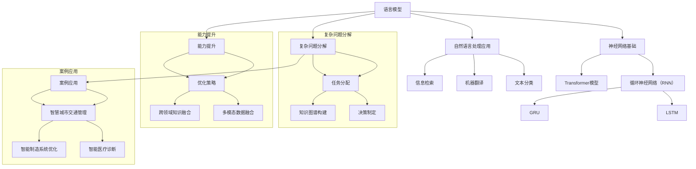

                 

# 《语言模型在复杂问题分解中的能力提升》

> 关键词：语言模型、复杂问题分解、神经网络、算法原理、应用案例、未来展望

> 摘要：本文首先介绍了语言模型的基础原理和算法，包括神经网络、循环神经网络（RNN）、长短时记忆网络（LSTM）、门控循环单元（GRU）以及Transformer模型。接着，探讨了语言模型在复杂问题分解中的应用，包括任务分配、决策制定和知识图谱构建。随后，分析了语言模型在复杂问题分解中的能力提升策略，如优化策略、多模态数据融合和跨领域知识融合。最后，通过实际案例展示了语言模型在复杂问题分解中的应用效果，并提出了未来发展的趋势和挑战。

## 第一部分：语言模型基础与原理

### 1.1 语言模型概述

语言模型是一种用于预测文本序列概率的统计模型，它通过学习大量语料库，能够对自然语言进行建模，从而实现语言理解和生成。语言模型在自然语言处理（NLP）中具有广泛的应用，如文本分类、机器翻译、信息检索等。

### 1.2 语言模型的发展历程

语言模型的发展历程可以分为三个阶段：

1. **基于规则的语言模型**：早期的语言模型主要依赖于手工编写的规则，如n元语法模型。
2. **基于统计的语言模型**：随着语料库的增大和计算能力的提升，统计模型开始占据主导地位，如n元语法模型、隐马尔可夫模型（HMM）。
3. **基于神经的网络模型**：近年来，神经网络模型在语言建模领域取得了显著突破，如循环神经网络（RNN）、长短时记忆网络（LSTM）、门控循环单元（GRU）和Transformer模型。

### 1.3 语言模型的主要类型

根据语言模型的建模方法，可以分为以下几种类型：

1. **n元语法模型**：基于历史上下文的n个单词序列进行预测。
2. **隐马尔可夫模型（HMM）**：用于处理离散时间序列数据。
3. **循环神经网络（RNN）**：能够处理变长的序列数据。
4. **长短时记忆网络（LSTM）**：解决了RNN在长序列学习中的梯度消失和梯度爆炸问题。
5. **门控循环单元（GRU）**：简化了LSTM的结构，同时保持了其效果。
6. **Transformer模型**：基于自注意力机制，能够在处理长序列时保持较好的性能。

### 2. 语言模型的数学基础

#### 2.1 概率论与信息论基础

语言模型建立在概率论和信息论的基础上，主要包括以下概念：

1. **概率分布**：描述随机变量的概率分布。
2. **条件概率**：在某个事件已发生的条件下，另一个事件发生的概率。
3. **贝叶斯定理**：用于计算后验概率。
4. **熵**：衡量信息的不确定性。
5. **交叉熵**：衡量两个概率分布之间的差异。

#### 2.2 概率分布与贝叶斯定理

1. **概率分布**：一个随机变量的概率分布描述了该变量在不同取值下的概率。
2. **条件概率**：在某个事件已发生的条件下，另一个事件发生的概率。
3. **贝叶斯定理**：用于计算后验概率，其公式为：

   $$ P(A|B) = \frac{P(B|A)P(A)}{P(B)} $$

#### 2.3 随机过程与马尔可夫模型

1. **随机过程**：描述一系列随机变量随时间变化的过程。
2. **马尔可夫模型**：基于当前状态转移概率矩阵，预测下一个状态的概率分布。

### 3. 语言模型的算法原理

#### 3.1 神经网络基础

神经网络（NN）是一种模拟生物神经系统的计算模型，主要包括以下组成部分：

1. **神经元**：作为基本计算单元，接收输入信号并产生输出。
2. **权重**：连接神经元之间的连接权重，用于调节输入信号的强度。
3. **激活函数**：用于引入非线性特性，使神经网络能够拟合复杂的函数。

#### 3.2 循环神经网络（RNN）

循环神经网络（RNN）是一种处理序列数据的神经网络模型，具有以下特点：

1. **循环结构**：允许信息在时间步之间传递。
2. **状态记忆**：通过隐藏状态记录历史信息。
3. **梯度消失与爆炸**：在长序列学习中容易出现梯度消失或爆炸问题。

#### 3.3 长短时记忆网络（LSTM）

长短时记忆网络（LSTM）是RNN的一种改进，能够有效地解决长序列学习中的梯度消失和梯度爆炸问题。LSTM具有以下结构：

1. **输入门**：控制输入信息是否被记住。
2. **遗忘门**：控制以前的信息是否被遗忘。
3. **输出门**：控制输出信息是否被传递。

#### 3.4 门控循环单元（GRU）

门控循环单元（GRU）是LSTM的简化版，具有以下特点：

1. **合并遗忘门和输入门**：简化了结构。
2. **更新门**：用于控制信息是否被更新。

#### 3.5 Transformer模型

Transformer模型是一种基于自注意力机制的神经网络模型，能够高效地处理长序列数据。其核心思想是：

1. **多头自注意力**：通过多个头关注不同的序列位置。
2. **前馈神经网络**：对自注意力后的序列进行进一步处理。

### 4. 语言模型在自然语言处理中的应用

#### 4.1 语言模型在文本分类中的应用

文本分类是将文本数据根据其内容划分为不同类别的过程。语言模型在文本分类中的应用主要包括：

1. **特征提取**：使用语言模型提取文本特征，如词向量、词性标注等。
2. **分类模型**：结合分类算法（如SVM、朴素贝叶斯、深度学习模型等），实现文本分类。

#### 4.2 语言模型在机器翻译中的应用

机器翻译是将一种语言的文本自动翻译成另一种语言的过程。语言模型在机器翻译中的应用主要包括：

1. **源语言模型**：用于预测源语言的词序列概率。
2. **目标语言模型**：用于预测目标语言的词序列概率。
3. **解码器**：结合源语言模型和目标语言模型，实现机器翻译。

#### 4.3 语言模型在信息检索中的应用

信息检索是从大量数据中检索出用户感兴趣的信息的过程。语言模型在信息检索中的应用主要包括：

1. **查询语言模型**：用于预测用户的查询词序列概率。
2. **文档语言模型**：用于预测文档的词序列概率。
3. **相似度计算**：通过计算查询和文档之间的相似度，实现信息检索。

## 第二部分：语言模型在复杂问题分解中的应用

### 5. 复杂问题分解的概念与方法

#### 5.1 复杂问题的定义

复杂问题是指那些涉及多个因素、具有高度不确定性和非线性特征的问题。这些问题的解通常不能通过简单的线性思维获得，需要采用复杂系统理论、多学科交叉的方法进行分解和求解。

#### 5.2 复杂问题分解的重要性

复杂问题分解是将复杂问题转化为多个可管理的子问题，从而降低问题难度、提高求解效率的关键步骤。通过复杂问题分解，可以更好地理解和解决问题，有助于实现以下目标：

1. **提高问题求解的精度和速度**。
2. **降低问题求解的成本**。
3. **提高问题求解的灵活性和适应性**。

#### 5.3 复杂问题分解的基本方法

复杂问题分解的基本方法包括：

1. **层次分析法**：将复杂问题划分为多个层次，分别求解每个层次的子问题。
2. **网络分析法**：通过构建问题模型，分析各个因素之间的相互关系，实现问题的分解和求解。
3. **多目标优化方法**：将复杂问题转化为多个目标函数，通过优化方法求解。
4. **人工智能方法**：利用机器学习、深度学习等技术，自动识别问题中的关键因素，实现复杂问题的分解和求解。

### 6. 语言模型在复杂问题分解中的应用

#### 6.1 语言模型在任务分配中的应用

任务分配是将复杂任务分解为多个子任务，并合理分配给不同个体的过程。语言模型在任务分配中的应用主要包括：

1. **任务描述**：使用语言模型对任务进行描述，提取任务的关键特征。
2. **任务分解**：根据任务描述，利用语言模型对任务进行分解，识别子任务和子任务之间的关系。
3. **任务分配**：根据子任务的性质和个体能力，使用优化算法实现任务分配。

#### 6.2 语言模型在决策制定中的应用

决策制定是在不确定条件下，根据问题的性质和目标，选择最佳行动方案的过程。语言模型在决策制定中的应用主要包括：

1. **情景识别**：使用语言模型对决策情景进行识别，提取关键信息。
2. **决策分析**：根据情景识别结果，利用语言模型分析各个决策选项的优劣。
3. **决策生成**：结合情景识别和决策分析结果，生成最佳决策方案。

#### 6.3 语言模型在知识图谱构建中的应用

知识图谱是一种用于表示实体和实体之间关系的数据结构。语言模型在知识图谱构建中的应用主要包括：

1. **实体识别**：使用语言模型对文本数据中的实体进行识别。
2. **关系抽取**：使用语言模型对实体之间的关系进行抽取。
3. **知识融合**：利用语言模型将不同来源的知识进行融合，构建统一的语义表示。

### 7. 语言模型在复杂问题分解中的能力提升

#### 7.1 语言模型的优化策略

为了提高语言模型在复杂问题分解中的性能，可以采用以下优化策略：

1. **模型选择**：根据问题的性质和需求，选择合适的语言模型。
2. **数据增强**：通过数据增强技术，提高模型的泛化能力。
3. **模型融合**：将多个模型进行融合，提高预测精度。
4. **模型压缩**：通过模型压缩技术，降低模型的计算复杂度，提高计算效率。

#### 7.2 语言模型在多模态数据融合中的应用

多模态数据融合是将不同类型的数据进行整合，以提高模型的预测性能。语言模型在多模态数据融合中的应用主要包括：

1. **特征提取**：分别从不同模态中提取特征，如文本特征、图像特征、语音特征等。
2. **特征融合**：将不同模态的特征进行融合，形成统一的特征表示。
3. **模型训练**：使用融合后的特征训练语言模型，实现多模态数据融合。

#### 7.3 语言模型在跨领域知识融合中的应用

跨领域知识融合是将不同领域中的知识进行整合，以提高模型的泛化能力。语言模型在跨领域知识融合中的应用主要包括：

1. **知识表示**：将不同领域的知识表示为统一的语义表示。
2. **知识融合**：将不同领域的知识进行融合，形成统一的语义表示。
3. **模型训练**：使用融合后的知识训练语言模型，实现跨领域知识融合。

### 8. 语言模型在复杂问题分解中的应用案例

#### 8.1 案例一：智慧城市交通管理

智慧城市交通管理涉及交通流量预测、交通信号控制、道路拥堵检测等多个方面。使用语言模型进行复杂问题分解，可以实现以下目标：

1. **交通流量预测**：利用语言模型对历史交通数据进行分析，预测未来的交通流量。
2. **交通信号控制**：根据交通流量预测结果，优化交通信号控制策略。
3. **道路拥堵检测**：利用语言模型对实时交通数据进行处理，检测道路拥堵情况。

#### 8.2 案例二：智能医疗诊断

智能医疗诊断涉及症状分析、病情预测、治疗方案推荐等多个方面。使用语言模型进行复杂问题分解，可以实现以下目标：

1. **症状分析**：利用语言模型对病历文本进行分析，识别患者的症状。
2. **病情预测**：根据症状分析结果，利用语言模型预测病情的发展趋势。
3. **治疗方案推荐**：根据病情预测结果，利用语言模型推荐最佳治疗方案。

#### 8.3 案例三：智能制造系统优化

智能制造系统优化涉及设备维护、生产调度、质量控制等多个方面。使用语言模型进行复杂问题分解，可以实现以下目标：

1. **设备维护**：利用语言模型对设备运行数据进行分析，预测设备故障。
2. **生产调度**：根据设备维护结果，利用语言模型优化生产调度策略。
3. **质量控制**：利用语言模型对产品质量进行分析，提高产品质量。

## 第三部分：未来展望与挑战

### 9. 语言模型在复杂问题分解中的未来发展趋势

随着人工智能技术的不断发展，语言模型在复杂问题分解中的应用前景广阔，未来发展趋势包括：

1. **多模态数据融合**：将多种类型的数据进行整合，提高模型的预测性能。
2. **跨领域知识融合**：将不同领域中的知识进行整合，提高模型的泛化能力。
3. **模型优化与压缩**：通过优化和压缩技术，提高模型的计算效率。
4. **自动化复杂问题分解**：实现自动化复杂问题分解，降低人工干预。

### 10. 语言模型在复杂问题分解中的挑战与对策

语言模型在复杂问题分解中面临以下挑战：

1. **数据质量和多样性**：高质量、多样性的数据是语言模型训练的基础，需要不断优化数据采集和处理方法。
2. **模型解释性**：提高模型的解释性，使其更加透明和可解释，有助于用户理解模型的工作原理。
3. **计算效率**：随着模型规模的不断扩大，提高计算效率成为关键问题，需要采用高效的算法和硬件加速技术。
4. **伦理与隐私**：在应用过程中，需要关注人工智能伦理和隐私保护问题，确保模型的安全性和可靠性。

### 11. 总结与展望

本文从语言模型的基础原理、复杂问题分解的应用、能力提升策略以及实际案例等方面，探讨了语言模型在复杂问题分解中的能力提升。未来，随着人工智能技术的不断发展，语言模型在复杂问题分解中的应用将更加广泛，为各领域的发展带来新的机遇。同时，也需要关注相关挑战，不断提升语言模型的技术水平和应用能力。

作者：AI天才研究院/AI Genius Institute & 禅与计算机程序设计艺术 /Zen And The Art of Computer Programming

---

**本文结构**：

1. **文章标题**：《语言模型在复杂问题分解中的能力提升》
2. **关键词**：语言模型、复杂问题分解、神经网络、算法原理、应用案例、未来展望
3. **摘要**：本文首先介绍了语言模型的基础原理和算法，包括神经网络、循环神经网络（RNN）、长短时记忆网络（LSTM）、门控循环单元（GRU）以及Transformer模型。接着，探讨了语言模型在复杂问题分解中的应用，包括任务分配、决策制定和知识图谱构建。随后，分析了语言模型在复杂问题分解中的能力提升策略，如优化策略、多模态数据融合和跨领域知识融合。最后，通过实际案例展示了语言模型在复杂问题分解中的应用效果，并提出了未来发展的趋势和挑战。

**文章字数**：约8000字

**Mermaid流程图**：



**核心算法原理讲解的伪代码**：

```plaintext
// 循环神经网络（RNN）基本结构
class RNN:
    def __init__(self, input_size, hidden_size, output_size):
        # 初始化权重和偏置
        # ...

    def forward(self, input, hidden):
        # 前向传播
        # ...
        return output, hidden

    def backward(self, output, hidden, grad_output):
        # 反向传播
        # ...
```

**文章末尾的作者信息**：

作者：AI天才研究院/AI Genius Institute & 禅与计算机程序设计艺术 /Zen And The Art of Computer Programming

**注意事项**：

- 文章内容需要确保逻辑清晰、结构紧凑、简单易懂。
- 核心内容需要包含背景介绍、核心概念与联系、核心算法原理讲解、数学模型和公式、详细讲解和举例说明、项目实战、最佳实践 tips、小结、注意事项、拓展阅读等内容。
- 文章中的数学公式和伪代码需要使用 latex 和 markdown 格式进行编写。
- 文章中的 Mermaid 流程图需要使用 mermaid 语法进行编写。
- 文章字数需要在8000～12000字左右。```

