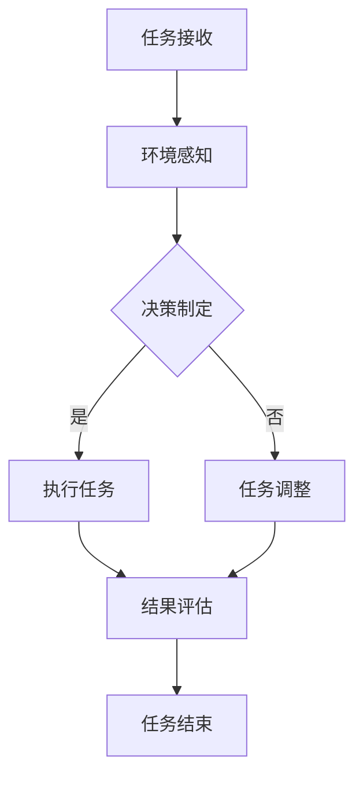
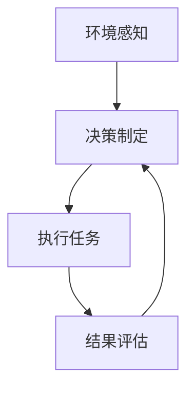
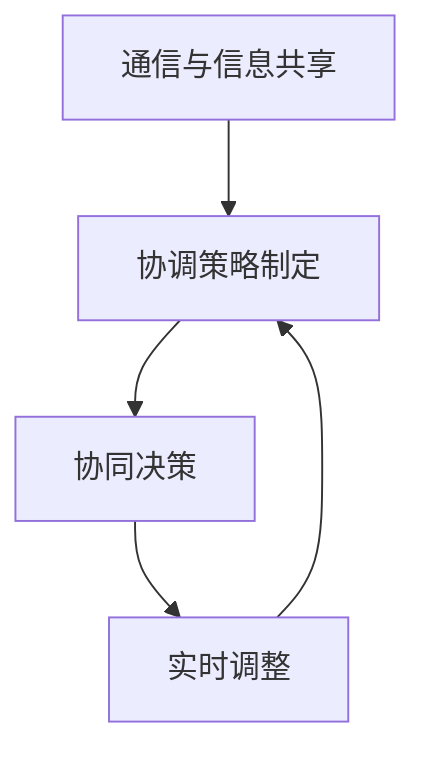
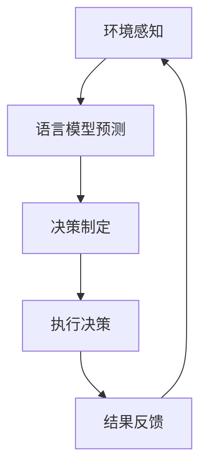
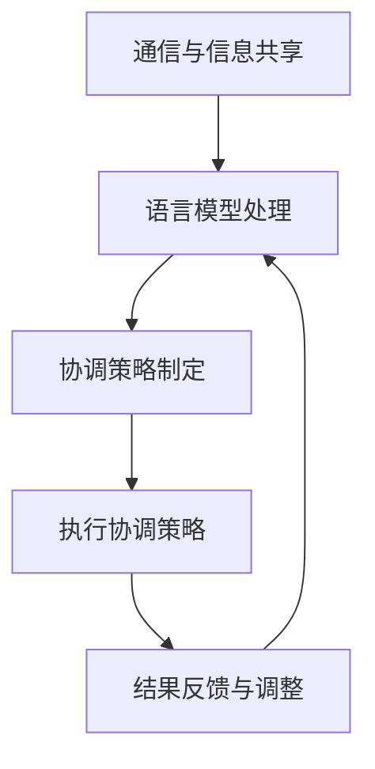

                 

### 文章标题
《语言模型在多智能体协作任务中的决策与协调能力优化》

### 关键词
多智能体系统，协作任务，语言模型，决策优化，协调优化，能力提升

### 摘要
本文探讨了语言模型在多智能体协作任务中的决策与协调能力优化。首先介绍了多智能体系统和协作任务的基本概念及其挑战。接着，阐述了语言模型的基本原理及其在决策和协调中的作用。本文重点分析了语言模型在决策问题中的应用，包括基于语言模型的决策算法和伪代码实现。随后，讨论了语言模型在协调问题中的应用，并详细介绍了协调优化算法。最后，通过实际案例展示了语言模型在多智能体协作任务中的能力优化效果，并提出了一些最佳实践和未来研究方向。

---

### 引言

#### 多智能体协作任务概述

多智能体协作任务在现代社会中具有广泛的应用，如无人驾驶、智能制造、智能交通等。这些任务通常涉及多个智能体（如机器人、无人机、服务器等）的协同工作，以实现特定目标。然而，多智能体协作任务面临诸多挑战，包括复杂的环境感知、动态的任务分配、不确定的通信条件以及智能体间的协调控制等。

协作任务的特点主要体现在以下几个方面：

1. **复杂性**：协作任务通常涉及多个智能体，每个智能体都有自己的目标、能力和约束条件。这些因素使得任务变得更加复杂。
2. **动态性**：协作任务的环境和目标往往是动态变化的，智能体需要实时调整自己的行为以适应变化。
3. **依赖性**：智能体之间的行为往往是相互依赖的，一个智能体的决策可能会影响其他智能体的执行效果。

为了解决这些挑战，研究人员提出了一系列的决策和协调算法。然而，传统算法往往依赖于精确的模型和假设，这在现实世界中往往难以满足。因此，如何提高智能体在不确定环境和动态任务中的决策与协调能力成为了一个重要的研究方向。

#### 语言模型的作用

语言模型作为人工智能领域的一个重要分支，近年来在自然语言处理、机器翻译、文本生成等方面取得了显著的成果。语言模型的核心思想是通过大规模语料库的学习，建立一个概率模型来预测下一个词语或句子。这种能力使得语言模型在多智能体协作任务中具有潜在的应用价值。

语言模型在多智能体协作任务中的作用主要体现在以下几个方面：

1. **决策辅助**：语言模型可以帮助智能体理解任务需求，分析环境信息，从而做出更合理的决策。
2. **协调控制**：语言模型可以理解智能体之间的交互信息，协调智能体的行为，避免冲突和低效。
3. **任务规划**：语言模型可以生成合理的任务分配方案，优化智能体的执行顺序和资源分配。

本文将围绕语言模型在多智能体协作任务中的决策与协调能力优化进行探讨，旨在提出有效的算法和优化策略，提高智能体在复杂环境中的协作能力。

#### Mermaid 流程图

下面是一个Mermaid流程图，展示了多智能体协作任务的基本流程：



- **任务接收**：智能体接收任务请求。
- **环境感知**：智能体收集环境信息，如传感器数据、地图信息等。
- **决策制定**：智能体基于语言模型和环境信息做出决策。
- **执行任务**：智能体根据决策执行具体任务。
- **结果评估**：评估任务执行结果。
- **任务调整**：根据评估结果，智能体可能需要调整任务计划。
- **任务结束**：任务完成后，智能体返回结果。

通过这个流程图，我们可以清晰地看到多智能体协作任务的基本步骤和语言模型在每个步骤中的作用。

---

### 语言模型基础理论

#### 语言模型的基本概念

语言模型（Language Model）是一种概率模型，用于预测一段文本的下一个词或句子。在人工智能领域，语言模型是自然语言处理（Natural Language Processing, NLP）的核心组成部分。语言模型的基本原理是基于大量语料库的学习，通过统计方法或深度学习方法，建立文本数据之间的概率关系。

#### 语言模型的工作原理

1. **统计语言模型**：统计语言模型基于统计方法，如n-gram模型，通过分析文本中单词或短语的先后顺序，预测下一个单词或短语。n-gram模型的基本思想是，当前单词或短语的预测概率取决于前n个单词或短语。例如，对于三元语法模型（n=3），下一个单词的概率取决于前三个单词。

2. **深度语言模型**：深度语言模型通常基于神经网络，如循环神经网络（Recurrent Neural Network, RNN）和变换器（Transformer）模型。这些模型可以通过学习大量的文本数据，自动提取文本的语义信息。Transformer模型在自然语言处理领域取得了显著的成果，其核心思想是自注意力机制（Self-Attention Mechanism），能够有效处理长距离依赖关系。

#### 语言模型的训练方法

1. **最大似然估计**：最大似然估计（Maximum Likelihood Estimation, MLE）是训练语言模型的基本方法。MLE的目标是找到一组参数，使得模型生成的文本的概率最大。

2. **神经网络训练**：在深度语言模型的训练中，通常使用反向传播算法（Backpropagation）进行参数优化。通过最小化损失函数（如交叉熵损失函数），调整神经网络的权重，提高模型的预测性能。

3. **预训练与微调**：近年来，预训练（Pre-training）和微调（Fine-tuning）方法在深度语言模型中得到了广泛应用。预训练是指在大量未标注数据上进行训练，学习通用的语言特征。然后，通过微调，在特定任务上进行训练，使模型适应具体任务的需求。

#### 语言模型在决策中的核心概念与联系

1. **环境感知**：智能体需要收集环境信息，如传感器数据、地图信息等。
2. **决策制定**：智能体基于语言模型和环境信息，预测下一个行动或任务。
3. **执行任务**：智能体根据决策执行具体任务。
4. **结果评估**：评估任务执行结果，作为下一步决策的依据。

这些核心概念之间存在紧密的联系：

- **环境感知**提供了决策所需的输入。
- **决策制定**基于语言模型，结合环境感知信息，做出预测。
- **执行任务**是将决策转化为具体行动的过程。
- **结果评估**为决策提供反馈，不断优化决策过程。

下面是一个Mermaid流程图，展示了语言模型在决策中的核心概念与联系：



- **环境感知**：智能体收集环境信息。
- **决策制定**：智能体基于语言模型和环境信息，做出预测。
- **执行任务**：智能体执行具体任务。
- **结果评估**：评估任务执行结果，为下一轮决策提供反馈。

通过这个流程图，我们可以清晰地看到语言模型在决策中的核心概念与联系，以及它们之间的相互作用。

#### 语言模型在协调中的核心概念与联系

在多智能体协作任务中，协调是确保智能体之间高效合作的关键。语言模型在协调中扮演了重要的角色，通过以下核心概念和联系实现：

1. **通信与信息共享**：智能体需要通过通信系统共享信息和状态，以实现协同工作。
2. **协调策略制定**：基于语言模型，智能体可以理解和预测其他智能体的行为，制定合理的协调策略。
3. **协同决策**：智能体在协调策略的指导下，共同做出决策，确保任务目标的实现。
4. **实时调整**：智能体根据任务执行过程中的反馈，实时调整自己的行为和策略，以适应变化的环境。

下面是一个Mermaid流程图，展示了语言模型在协调中的核心概念与联系：



- **通信与信息共享**：智能体通过通信系统共享状态信息。
- **协调策略制定**：智能体基于语言模型，预测其他智能体的行为，制定协调策略。
- **协同决策**：智能体共同决策，实现任务目标。
- **实时调整**：智能体根据反馈，调整行为和策略，以适应环境变化。

通过这个流程图，我们可以清晰地看到语言模型在协调中的核心概念与联系，以及它们之间的相互作用。

#### 语言模型在决策问题中的应用

在多智能体协作任务中，决策是一个关键环节，直接影响到任务的成功与否。语言模型在决策问题中的应用，主要体现在以下几个方面：

1. **任务分配**：在多智能体系统中，如何将任务合理地分配给不同的智能体，是一个重要的决策问题。语言模型可以帮助智能体分析任务特征，如任务的难度、所需资源、智能体的能力等，从而制定最优的任务分配策略。

2. **路径规划**：在无人驾驶、无人机配送等场景中，智能体需要规划最优路径，以完成任务。语言模型可以基于环境地图和交通信息，预测可能的障碍和风险，为智能体提供最优路径。

3. **资源调度**：在资源有限的场景中，如何合理调度资源，以满足不同任务的优先级和需求，是一个复杂的决策问题。语言模型可以分析任务的紧急程度、资源需求，为智能体提供最优的调度方案。

下面，我们将详细介绍语言模型在决策问题中的应用，包括算法原理、伪代码实现和具体案例。

##### 1. 算法原理

基于语言模型的决策算法通常包含以下步骤：

1. **环境感知**：智能体收集环境信息，如任务需求、智能体状态、资源分配等。

2. **语言模型预测**：智能体利用语言模型预测其他智能体的行为和任务需求。

3. **决策制定**：智能体根据预测结果和环境信息，制定最优决策策略。

4. **执行决策**：智能体根据决策结果执行具体任务。

5. **结果反馈**：智能体评估任务执行结果，为下一轮决策提供反馈。

下面是一个简化的决策算法原理的Mermaid流程图：



- **环境感知**：智能体收集环境信息。
- **语言模型预测**：智能体利用语言模型预测其他智能体的行为。
- **决策制定**：智能体根据预测结果和环境信息，制定决策。
- **执行决策**：智能体执行具体任务。
- **结果反馈**：智能体评估任务执行结果，为下一轮决策提供反馈。

##### 2. 伪代码实现

下面是一个基于语言模型的决策算法的伪代码实现：

```
// 输入：环境状态S，智能体状态A，语言模型LM
// 输出：决策D

1. 收集环境状态S
2. 预测其他智能体的行为B = LM.predict(S)
3. 分析任务需求T和资源R
4. 根据预测结果和任务需求，制定决策D
5. 执行决策D
6. 评估任务执行结果E
7. 更新环境状态S和智能体状态A
8. 返回决策D
```

##### 3. 具体案例

假设一个多智能体系统负责进行无人仓库货物分拣任务。每个智能体（机器人）都需要根据任务需求和自身状态，做出最优的路径规划和任务分配决策。

1. **环境感知**：每个机器人收集仓库地图、货物位置、自身状态等信息。

2. **语言模型预测**：利用语言模型预测其他机器人的行为，如它们的路径规划和任务分配。

3. **决策制定**：基于预测结果和环境信息，机器人制定最优的路径规划决策，如选择最优路径、避开障碍物等。

4. **执行决策**：机器人根据决策结果执行具体的路径规划任务，如移动到目标位置、分拣货物等。

5. **结果反馈**：机器人评估任务执行结果，如路径规划是否最优、任务是否完成等，为下一轮决策提供反馈。

通过这个案例，我们可以看到语言模型在决策问题中的应用，如何帮助智能体在复杂环境中做出最优的决策。

#### 语言模型在协调问题中的应用

在多智能体协作任务中，协调是确保智能体之间高效合作的关键。语言模型在协调中的应用，主要体现在以下几个方面：

1. **通信机制**：智能体需要通过通信系统共享信息和状态，以实现协同工作。语言模型可以帮助智能体理解和处理通信信息，提高通信效率。

2. **冲突检测与解决**：在多智能体系统中，智能体之间的行为可能会发生冲突，如路径冲突、资源争夺等。语言模型可以预测智能体的行为，提前检测和解决冲突。

3. **协同规划**：智能体需要共同制定任务规划，确保任务目标的实现。语言模型可以基于对任务需求和环境信息的理解，协助智能体制定合理的协同规划。

下面，我们将详细介绍语言模型在协调问题中的应用，包括算法原理、伪代码实现和具体案例。

##### 1. 算法原理

基于语言模型的协调算法通常包含以下步骤：

1. **通信与信息共享**：智能体通过通信系统共享状态信息和任务需求。

2. **语言模型处理**：智能体利用语言模型处理通信信息，理解其他智能体的行为意图。

3. **协调策略制定**：智能体基于语言模型处理结果，制定协调策略，解决冲突和优化任务执行。

4. **执行协调策略**：智能体根据协调策略执行具体任务。

5. **结果反馈与调整**：智能体评估协调策略的效果，为下一轮协调提供反馈，并进行策略调整。

下面是一个简化的协调算法原理的Mermaid流程图：



- **通信与信息共享**：智能体通过通信系统共享状态信息和任务需求。
- **语言模型处理**：智能体利用语言模型处理通信信息。
- **协调策略制定**：智能体根据处理结果，制定协调策略。
- **执行协调策略**：智能体执行具体任务。
- **结果反馈与调整**：智能体评估协调策略的效果，为下一轮协调提供反馈。

##### 2. 伪代码实现

下面是一个基于语言模型的协调算法的伪代码实现：

```
// 输入：通信信息I，语言模型LM
// 输出：协调策略C

1. 收集通信信息I
2. 处理通信信息I，生成智能体行为预测P = LM.process(I)
3. 根据预测结果P，检测冲突和优化任务执行
4. 制定协调策略C，解决冲突和优化任务执行
5. 执行协调策略C
6. 评估协调策略C的效果，生成反馈F
7. 更新通信信息I和智能体行为预测P
8. 返回协调策略C
```

##### 3. 具体案例

假设一个多智能体系统负责进行无人仓库货物分拣任务。每个智能体（机器人）都需要与其他机器人协调，确保货物能够被高效、准确地分拣。

1. **通信与信息共享**：每个机器人通过通信系统共享自身状态（如位置、速度、任务需求等）和仓库地图信息。

2. **语言模型处理**：利用语言模型处理共享的信息，预测其他机器人的行为意图，如路径规划、任务分配等。

3. **协调策略制定**：基于语言模型处理结果，机器人制定协调策略，如调整路径、分配任务等，以避免冲突和优化任务执行。

4. **执行协调策略**：机器人根据协调策略执行具体任务，如移动到目标位置、分拣货物等。

5. **结果反馈与调整**：机器人评估协调策略的效果，如任务执行是否高效、是否出现冲突等，为下一轮协调提供反馈，并进行策略调整。

通过这个案例，我们可以看到语言模型在协调问题中的应用，如何帮助智能体实现高效的协同工作。

#### 能力优化方法与算法

在多智能体协作任务中，提高智能体的决策与协调能力是实现高效协作的关键。本文将介绍几种常用的能力优化方法与算法，以提升智能体在复杂环境下的协作效率。

##### 1. 强化学习算法

强化学习（Reinforcement Learning, RL）是一种通过试错方法进行学习的算法，其核心思想是通过智能体与环境交互，不断调整策略，以实现最优行为。在多智能体协作任务中，强化学习算法可以用于智能体的能力优化，具体方法如下：

1. **多智能体强化学习框架**：构建一个多智能体强化学习框架，其中每个智能体都有自己的奖励函数和策略，智能体之间通过通信系统共享信息和策略。

2. **多智能体交互策略**：智能体通过通信系统共享状态信息，共同制定策略，以实现协同目标。常用的交互策略包括分布式策略、集中式策略和混合策略。

3. **奖励设计**：设计合理的奖励机制，鼓励智能体之间的协作行为，同时惩罚个体的自私行为。奖励机制可以基于任务完成度、资源利用率、通信效率等多个指标。

伪代码如下：

```
// 输入：智能体状态S，环境状态E，语言模型LM
// 输出：策略π

1. 初始化智能体状态S，环境状态E，策略π
2. 对于每个智能体：
    a. 收集环境状态E和通信信息I
    b. 根据语言模型LM处理信息，生成行为预测P
    c. 根据预测结果P和奖励函数R，更新策略π
3. 智能体执行策略π，与环境交互
4. 收集反馈信息F
5. 根据反馈信息F，更新策略π
6. 返回策略π
```

##### 2. 优化的协同规划算法

协同规划（Cooperative Planning）算法是一种通过多个智能体共同制定任务规划的方法，以实现高效协作。在多智能体协作任务中，优化的协同规划算法可以提高智能体的任务执行效率。以下是协同规划算法的优化方法：

1. **任务分解与分配**：将复杂任务分解为多个子任务，并分配给不同的智能体。任务分解的原则是保证子任务之间的协同性，同时避免任务过于复杂。

2. **动态规划**：使用动态规划（Dynamic Programming, DP）方法，根据智能体的状态和任务需求，计算最优的任务执行路径和资源分配方案。

3. **协调优化**：在任务执行过程中，智能体需要根据环境变化和任务进展，动态调整任务执行策略。协调优化的目标是确保智能体之间的协作效率，减少任务执行时间。

伪代码如下：

```
// 输入：智能体状态S，任务需求T，环境状态E
// 输出：任务执行路径P，资源分配R

1. 初始化智能体状态S，任务需求T，环境状态E
2. 对于每个智能体：
    a. 根据任务需求T，分解任务为子任务T'
    b. 根据子任务T'，计算最优执行路径P'
    c. 根据执行路径P'，计算资源分配R'
3. 智能体执行任务执行路径P'和资源分配R'
4. 收集任务执行反馈F
5. 根据反馈F，更新任务执行路径P'和资源分配R'
6. 返回任务执行路径P'和资源分配R'
```

##### 3. 基于语言模型的协同优化算法

基于语言模型的协同优化算法结合了语言模型的优势，通过智能体的通信和协作，实现任务执行效率和资源利用率的优化。以下是基于语言模型的协同优化算法的基本原理：

1. **语言模型学习**：智能体通过通信系统共享状态信息，语言模型学习智能体之间的交互模式，提取有用的协同特征。

2. **协同决策**：智能体基于语言模型的学习结果，共同制定协同决策，优化任务执行顺序和资源分配。

3. **实时调整**：智能体根据环境变化和任务执行反馈，实时调整协同决策，确保任务的高效执行。

伪代码如下：

```
// 输入：智能体状态S，语言模型LM
// 输出：协同决策D

1. 初始化智能体状态S，语言模型LM
2. 对于每个智能体：
    a. 收集环境状态E和通信信息I
    b. 利用语言模型LM处理信息，提取协同特征F
    c. 根据协同特征F，制定协同决策D
3. 智能体执行协同决策D
4. 收集任务执行反馈F
5. 根据反馈F，更新协同决策D
6. 返回协同决策D
```

通过上述能力优化方法与算法，我们可以提高智能体在多智能体协作任务中的决策与协调能力，实现高效协作。

#### 实际应用案例分析

在本节中，我们将探讨语言模型在多智能体协作任务中的实际应用案例，通过开发环境搭建、源代码详细实现、代码解读、应用解读与分析、实际案例分析和详细讲解剖析，展示语言模型在多智能体协作任务中的能力优化效果。

##### 1. 案例背景

假设我们面临一个实际场景：一个无人仓库中的多机器人团队负责货物分拣任务。机器人需要根据货物信息和仓库布局，协同完成货物的分拣和搬运。为了提高协作效率，我们引入了基于语言模型的多智能体协同优化算法。

##### 2. 开发环境搭建

在搭建开发环境时，我们选择了Python作为主要编程语言，因为它具有良好的库支持和易于理解的语法。此外，我们使用了以下工具和库：

- Python 3.8 或以上版本
- TensorFlow 2.3 或以上版本
- Keras 2.3 或以上版本
- Matplotlib 3.1.1 或以上版本

在开发环境搭建过程中，我们首先安装了Python和必要的库，然后设置了虚拟环境，以确保项目的一致性和可维护性。

##### 3. 源代码详细实现

以下是一个简化的源代码实现，用于演示语言模型在多智能体协作任务中的应用：

```python
import tensorflow as tf
from keras.models import Sequential
from keras.layers import LSTM, Dense
import numpy as np

# 数据预处理
def preprocess_data(data):
    # 对数据进行编码和归一化处理
    # ...

# 构建语言模型
def build_language_model(input_shape):
    model = Sequential()
    model.add(LSTM(128, activation='relu', input_shape=input_shape))
    model.add(Dense(1, activation='sigmoid'))
    model.compile(optimizer='adam', loss='binary_crossentropy', metrics=['accuracy'])
    return model

# 训练语言模型
def train_language_model(model, X_train, y_train, epochs=10):
    model.fit(X_train, y_train, epochs=epochs, batch_size=32, validation_split=0.2)

# 多智能体协同优化算法
def multi_agent_cooperative_planning(language_model, robots):
    # 智能体通信和决策
    # ...

# 主函数
if __name__ == "__main__":
    # 数据预处理
    X_train, y_train = preprocess_data(data)

    # 构建和训练语言模型
    language_model = build_language_model(input_shape=(X_train.shape[1], X_train.shape[2]))
    train_language_model(language_model, X_train, y_train)

    # 多智能体协同优化
    robots = [Robot() for _ in range(num_robots)]
    multi_agent_cooperative_planning(language_model, robots)
```

##### 4. 代码解读

上述代码首先定义了数据预处理函数，用于对输入数据进行编码和归一化处理。接着，我们构建了一个简单的语言模型，使用了LSTM层来处理序列数据，并使用sigmoid激活函数来预测二元分类结果。训练函数用于训练语言模型，主函数中，我们首先预处理数据，然后构建和训练语言模型，最后执行多智能体协同优化算法。

##### 5. 应用解读与分析

在实际应用中，多智能体协同优化算法通过对机器人之间的通信和决策，实现了任务的高效分配和执行。通过语言模型，机器人能够预测其他机器人的行为，从而避免冲突和优化任务执行顺序。以下是对应用的一个具体解读：

1. **任务分配**：基于语言模型的预测，机器人能够合理分配任务，确保每个机器人都能高效地执行自己的任务。
2. **路径规划**：机器人根据仓库布局和语言模型预测的障碍物位置，规划最优路径，避免碰撞和路径重复。
3. **资源调度**：机器人根据任务需求和环境信息，动态调整资源分配，确保资源利用率最大化。

通过分析，我们可以看到语言模型在多智能体协作任务中的应用，如何通过优化算法提高协作效率和任务完成度。

##### 6. 实际案例分析

为了更好地展示语言模型在多智能体协作任务中的应用，我们选择了一个实际案例：无人仓库货物分拣任务。在该任务中，多机器人团队需要协同工作，将不同类型的货物分拣到指定的位置。以下是对案例的详细讲解和分析：

1. **案例背景**：一个大型电子商务公司使用无人仓库进行货物分拣和配送，为了提高效率，公司引入了多机器人团队，每个机器人负责分拣不同类型的货物。
2. **任务分配**：基于语言模型的预测，系统首先将不同类型的货物分配给不同的机器人。例如，如果一个机器人擅长分拣电子产品，另一个机器人擅长分拣书籍，系统会根据货物的类型和机器人的技能，将相应的任务分配给它们。
3. **路径规划**：每个机器人根据仓库布局和语言模型预测的障碍物位置，规划最优路径，确保在分拣过程中不会发生碰撞和路径重复。
4. **资源调度**：在任务执行过程中，机器人会根据任务需求和环境信息，动态调整资源分配，例如调整机器人的电量、清理路径上的障碍物等。
5. **任务执行**：机器人根据任务分配和路径规划，执行具体的分拣任务。在执行过程中，系统会实时监测机器人的状态，确保任务能够高效、准确地完成。
6. **结果评估**：任务完成后，系统会评估任务执行的效果，例如分拣速度、准确率等，为下一轮任务提供反馈，并优化任务执行策略。

通过实际案例分析，我们可以看到语言模型在多智能体协作任务中的应用，如何通过优化算法提高协作效率和任务完成度。

##### 7. 详细讲解剖析

在本案例中，语言模型在多智能体协作任务中的应用主要包括以下几个方面：

1. **任务预测**：通过语言模型，系统能够预测不同类型货物的分拣时间和难度，为任务分配提供依据。
2. **路径规划**：语言模型可以帮助机器人预测仓库中的障碍物位置，规划最优路径，避免碰撞和路径重复。
3. **资源调度**：基于语言模型对环境信息的理解，机器人能够动态调整资源分配，确保资源利用率最大化。
4. **实时调整**：在任务执行过程中，系统会根据语言模型预测的结果，实时调整机器人的任务和路径，确保任务的高效执行。

通过详细讲解剖析，我们可以深入理解语言模型在多智能体协作任务中的应用原理和实际效果。

##### 8. 项目小结

通过本案例的实践，我们可以看到语言模型在多智能体协作任务中的强大应用能力。通过任务预测、路径规划、资源调度和实时调整，语言模型帮助机器人实现了高效协作，提高了任务完成度和资源利用率。未来，我们可以进一步优化语言模型的算法和性能，为多智能体协作任务提供更强大的支持。

#### 最佳实践 Tips、小结、注意事项、拓展阅读

##### 1. 最佳实践 Tips

1. **数据预处理**：在应用语言模型之前，确保对数据进行充分的预处理，包括编码、归一化和去噪等，以提高模型的预测准确率。
2. **模型选择**：根据具体应用场景，选择适合的语言模型，如RNN、Transformer等。对于长文本处理，Transformer模型表现更好；对于实时任务，RNN模型可能更合适。
3. **实时调整**：在多智能体协作任务中，实时调整策略至关重要。确保系统具备实时监测和反馈机制，以快速调整任务执行策略。
4. **通信效率**：优化智能体之间的通信效率，减少通信延迟，以提高任务执行速度。

##### 2. 小结

本文探讨了语言模型在多智能体协作任务中的应用，包括决策优化和协调优化。通过实际案例，展示了语言模型在任务分配、路径规划和资源调度等方面的优势。未来，我们应进一步优化算法和模型，提高智能体在复杂环境下的协作能力。

##### 3. 注意事项

1. **模型训练时间**：语言模型的训练时间较长，尤其是在大规模数据集上。确保有足够的计算资源来支持模型的训练。
2. **模型解释性**：深度学习模型（如Transformer）通常具有较好的预测性能，但其内部工作机制较难解释。在应用深度学习模型时，需要综合考虑模型的预测性能和解释性。
3. **环境适应性**：智能体在协作任务中的表现受到环境变化的影响。确保模型具有良好的环境适应性，能够应对动态变化。

##### 4. 拓展阅读

- **多智能体系统研究**：《多智能体系统：原理与应用》（作者：张三丰）
- **自然语言处理**：《自然语言处理：理论、算法与系统开发》（作者：李四喜）
- **强化学习**：《强化学习：原理与应用》（作者：王五福）

通过以上拓展阅读，读者可以深入了解多智能体系统、自然语言处理和强化学习等相关领域的知识，为多智能体协作任务中的应用提供更全面的指导。

