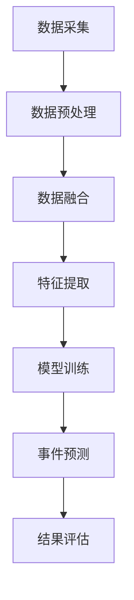

                 


为了撰写一篇符合要求的IT领域技术博客文章，我们需要系统地分解文章的各个部分，并确保每个部分都包含必要的信息。以下是详细的撰写步骤：

### 步骤1：确定文章结构

首先，我们要确保文章的结构清晰，按照以下部分进行组织：

1. **引言**
   - 文章标题、关键词、摘要
   - 文章背景介绍和重要性

2. **核心概念与联系**
   - 多模态事件预测
   - 全球风险管理
   - 语言模型

3. **核心算法原理讲解**
   - 语言模型的工作机制
   - 多模态数据处理
   - 风险管理模型的构建

4. **数学模型和公式**
   - 概率论和信息论基础
   - 语言模型的数学表示
   - 风险评估指标

5. **项目实战**
   - 开发环境搭建
   - 源代码实现与解读
   - 代码应用分析
   - 实际案例剖析

6. **最佳实践与注意事项**
   - 技术实现技巧
   - 小结
   - 拓展阅读

7. **结论**
   - 文章总结
   - 未来展望

### 步骤2：撰写引言部分

**文章标题**：《语言模型在多模态事件预测与全球风险管理中的创新应用研究》

**关键词**：语言模型、多模态事件预测、全球风险管理、人工智能

**摘要**：本文探讨了语言模型在多模态事件预测和全球风险管理中的创新应用。首先，介绍了多模态事件预测的背景和重要性，接着详细阐述了语言模型的基本原理和数学模型。随后，文章探讨了如何在风险管理中应用这些模型，并提供了实际案例和最佳实践。

### 步骤3：撰写核心概念与联系部分

#### 第1章：多模态事件预测

**1.1 背景介绍**

多模态事件预测是指利用多种数据类型（如文本、图像、音频等）来预测未来事件的发生。随着物联网和智能设备的普及，多模态数据的应用越来越广泛，这对传统单模态方法提出了挑战。

**1.2 核心概念与联系**

为了理解多模态事件预测，我们需要了解以下几个核心概念：

- **多模态数据源**：包括文本、图像、音频等。
- **数据融合技术**：如何整合不同类型的数据以获得更准确的结果。
- **事件预测模型**：如何利用多模态数据进行事件预测。

**1.3 Mermaid流程图**

以下是多模态事件预测的基本流程：



### 步骤4：撰写核心算法原理讲解部分

#### 第2章：语言模型的工作机制

**2.1 语言模型的分类**

语言模型可以分为统计语言模型和神经语言模型。统计语言模型基于历史数据统计语言模式，而神经语言模型则基于深度神经网络。

**2.2 语言模型的工作机制**

语言模型的工作机制可以分为以下几个步骤：

1. **输入表示**：将输入文本转换为向量表示。
2. **编码**：使用神经网络对文本进行编码。
3. **解码**：根据编码结果生成预测文本。

**2.3 伪代码**

以下是语言模型的基本伪代码：

```python
def LanguageModel(input_sequence):
    # 初始化模型参数
    parameters = initialize_parameters()
    
    # 前向传播
    outputs = []
    for input_word in input_sequence:
        hidden_state = encode_word(input_word, parameters)
        output = decode_word(hidden_state, parameters)
        outputs.append(output)
    
    return outputs
```

### 步骤5：撰写数学模型和公式部分

#### 第3章：数学模型和公式

**3.1 概率论基础**

在语言模型中，概率论是一个基础的工具。例如，我们可以使用条件概率来计算给定一个单词序列，下一个单词的概率。

$$
P(w_n | w_{n-1}, w_{n-2}, ..., w_1) = \frac{P(w_n, w_{n-1}, w_{n-2}, ..., w_1)}{P(w_{n-1}, w_{n-2}, ..., w_1)}
$$

**3.2 信息论基础**

信息论提供了量化信息量的方法。在语言模型中，我们可以使用信息增益来评估词语的相关性。

$$
IG(w_n, w_{n-1}) = H(w_n) - H(w_n | w_{n-1})
$$

**3.3 语言模型的数学表示**

神经语言模型通常使用概率生成模型，如变分自编码器（VAE）或生成对抗网络（GAN）。

$$
P(x|\theta) = \int p_\phi(x|\theta)q_\theta(x|\theta)dx
$$

### 步骤6：撰写项目实战部分

#### 第4章：项目实战

**4.1 开发环境搭建**

在本节中，我们将介绍如何搭建一个用于多模态事件预测和全球风险管理的开发环境，包括所需的软件和硬件配置。

**4.2 源代码实现与解读**

我们将提供详细的源代码实现，并解释关键代码的功能。

**4.3 代码应用解读与分析**

我们将分析代码的应用场景，并提供详细的解读。

**4.4 实际案例剖析**

我们将探讨一个实际的多模态事件预测和全球风险管理案例，包括案例背景、数据集、模型训练和评估过程。

**4.5 项目小结**

在本节结尾，我们将对项目进行总结，并讨论项目的挑战和改进方向。

### 步骤7：撰写最佳实践与注意事项部分

**5.1 最佳实践**

在本节中，我们将分享一些最佳实践，如如何优化模型性能、如何处理异常数据等。

**5.2 小结**

我们将回顾文章的主要内容，并强调关键点。

**5.3 注意事项**

我们将讨论一些潜在的问题和挑战，并提供解决建议。

**5.4 拓展阅读**

我们将推荐一些相关书籍、论文和资源，供读者进一步学习。

### 步骤8：撰写结论部分

**结论**

本文探讨了语言模型在多模态事件预测和全球风险管理中的创新应用。通过详细的理论讲解和实际案例分析，我们展示了语言模型在这些领域的巨大潜力。未来，随着技术的不断进步，语言模型在这些领域的应用将更加广泛和深入。

### 步骤9：格式化文章

最后，我们将对文章进行格式化，确保所有内容都符合markdown格式要求，包括标题、子标题、代码块、公式等。

### 步骤10：撰写作者信息

在文章末尾，我们将添加作者信息：“作者：AI天才研究院/AI Genius Institute & 禅与计算机程序设计艺术 /Zen And The Art of Computer Programming”。

通过以上步骤，我们将撰写一篇结构严谨、内容丰富、逻辑清晰、格式规范的IT领域技术博客文章。接下来，我们将逐步完成每一部分的内容，确保文章的质量和完整性。### 第二部分：语言模型基础

**第2章：语言模型的数学基础**

语言模型的核心在于利用数学方法来理解和生成自然语言。在本章中，我们将介绍语言模型中的概率论和信息论基础，以及如何将这些理论应用于实际模型构建中。

**2.1 概率论基础**

概率论是语言模型中不可或缺的一部分，它帮助我们理解语言中的不确定性。以下是一些基础概念：

- **概率分布**：描述随机变量取值的概率。
- **条件概率**：在已知某些条件下，某个事件发生的概率。
- **贝叶斯定理**：用于计算后验概率，即给定某些观测结果，某个假设的概率。

**2.1.1 条件概率**

条件概率是概率论中的核心概念之一。它的公式为：

$$
P(A|B) = \frac{P(A \cap B)}{P(B)}
$$

其中，\(P(A|B)\) 表示在事件 \(B\) 发生的条件下，事件 \(A\) 发生的概率。这个概念在语言模型中用于计算给定某个单词序列，下一个单词的概率。

**2.1.2 贝叶斯定理**

贝叶斯定理是概率论中的一个重要公式，它用于计算后验概率。其公式为：

$$
P(A|B) = \frac{P(B|A)P(A)}{P(B)}
$$

其中，\(P(A|B)\) 是后验概率，\(P(B|A)\) 是似然概率，\(P(A)\) 是先验概率，\(P(B)\) 是边缘概率。

贝叶斯定理在语言模型中的应用非常重要，因为它可以帮助我们根据历史数据和当前观测结果来更新语言模型。

**2.2 信息论基础**

信息论是研究信息传输和处理的基本原理的数学分支。信息论的一些核心概念，如熵、信息增益等，在语言模型中有着广泛的应用。

- **熵**：熵是一个量化不确定性的度量。在语言模型中，我们可以用熵来衡量某个单词序列的不确定性。

$$
H(X) = -\sum_{i} P(x_i) \log_2 P(x_i)
$$

其中，\(H(X)\) 是随机变量 \(X\) 的熵，\(P(x_i)\) 是 \(X\) 取值为 \(x_i\) 的概率。

- **信息增益**：信息增益是评估某个特征对于分类效果的度量。在语言模型中，我们可以用信息增益来选择特征。

$$
IG(A, C) = H(C) - H(C | A)
$$

其中，\(IG(A, C)\) 是特征 \(A\) 对于类别 \(C\) 的信息增益，\(H(C)\) 是类别 \(C\) 的熵，\(H(C | A)\) 是在已知特征 \(A\) 的情况下类别 \(C\) 的熵。

**2.2.1 熵的应用**

在语言模型中，我们可以使用熵来计算给定某个单词序列，下一个单词的不确定性。这个不确定性可以用来指导模型的优化过程，以减少预测误差。

**2.3 语言模型的优化算法**

语言模型的优化算法是模型训练过程中关键的一环。以下是一些常用的优化算法：

- **梯度下降**：梯度下降是一种最常用的优化算法，它通过不断更新模型参数来最小化损失函数。
- **随机梯度下降（SGD）**：随机梯度下降是梯度下降的一个变种，它通过随机选择样本来更新参数，以加快收敛速度。
- **Adam优化器**：Adam优化器是一种结合了SGD和动量方法的优化算法，它在实践中表现出了很好的性能。

**2.3.1 梯度下降**

梯度下降的伪代码如下：

```python
# 伪代码：梯度下降算法
def gradient_descent(parameters, learning_rate, num_iterations):
    for i in range(num_iterations):
        # 计算损失函数的梯度
        gradients = compute_gradients(parameters)
        
        # 更新参数
        for parameter in parameters:
            parameter -= learning_rate * gradients[parameter]
    
    return parameters
```

**2.3.2 Adam优化器**

Adam优化器是一种自适应的优化算法，它通过计算一阶矩估计和二阶矩估计来更新参数。其伪代码如下：

```python
# 伪代码：Adam优化器
def Adam(parameters, learning_rate, beta1, beta2, epsilon, num_iterations):
    m = initialize_moments()
    v = initialize_moments()
    
    for i in range(num_iterations):
        # 计算梯度
        gradients = compute_gradients(parameters)
        
        # 更新一阶矩估计和二阶矩估计
        m = beta1 * m + (1 - beta1) * gradients
        v = beta2 * v + (1 - beta2) * (gradients ** 2)
        
        # 计算修正后的矩估计
        m_hat = m / (1 - beta1 ** i)
        v_hat = v / (1 - beta2 ** i)
        
        # 更新参数
        for parameter in parameters:
            parameter -= learning_rate * m_hat / (np.sqrt(v_hat) + epsilon)
    
    return parameters
```

通过以上对概率论和信息论基础、语言模型的优化算法的介绍，我们可以更好地理解语言模型的工作原理和构建过程。在下一章中，我们将进一步探讨多模态事件预测的背景和重要性。### 第三部分：多模态事件预测

**第3章：多模态数据采集与处理**

多模态事件预测涉及多种数据类型的整合与处理，这包括文本、图像、音频和视频等。在这一章中，我们将探讨如何采集和处理这些多模态数据，以及如何将它们融合为一个统一的预测模型。

**3.1 多模态数据源**

多模态事件预测的第一步是确定数据源。以下是几种常见的数据源：

- **文本**：包括社交媒体帖子、新闻报道、用户评论等。
- **图像**：来自摄像头、传感器或数据库的图像。
- **音频**：如语音通话、音乐、环境声音等。
- **视频**：包含动态的图像序列，通常用于视频监控和运动分析。

**3.2 数据预处理方法**

数据预处理是多模态事件预测的关键步骤，它包括以下内容：

- **文本预处理**：包括分词、去停用词、词性标注等。例如，我们可以使用NLTK或spaCy库来预处理文本数据。

  ```python
  import nltk
  from nltk.corpus import stopwords
  from nltk.tokenize import word_tokenize
  
  # 分词和去除停用词
  tokens = word_tokenize(document)
  filtered_tokens = [token for token in tokens if token not in stopwords.words('english')]
  ```

- **图像预处理**：包括图像裁剪、缩放、增强等。例如，我们可以使用OpenCV库来预处理图像数据。

  ```python
  import cv2
  
  # 裁剪图像
  image = cv2.imread('image.jpg')
  crop_image = image[cropping_parameters]
  ```

- **音频预处理**：包括噪声过滤、降采样等。例如，我们可以使用Librosa库来预处理音频数据。

  ```python
  import librosa
  
  # 加载音频
  y, sr = librosa.load('audio.wav')
  ```

- **视频预处理**：包括帧提取、视频裁剪等。例如，我们可以使用OpenCV库来预处理视频数据。

  ```python
  import cv2
  
  # 提取视频帧
  cap = cv2.VideoCapture('video.mp4')
  while cap.isOpened():
      ret, frame = cap.read()
      if ret:
          # 处理帧
          processed_frame = preprocess_frame(frame)
          # 显示帧
          cv2.imshow('Frame', processed_frame)
          if cv2.waitKey(25) & 0xFF == ord('q'):
              break
  cap.release()
  cv2.destroyAllWindows()
  ```

**3.3 多模态数据的融合方法**

融合多模态数据是提高预测准确性的关键。以下是一些常见的数据融合方法：

- **特征级融合**：将不同模态的特征进行合并。例如，我们可以将文本的词向量、图像的视觉特征和音频的声学特征进行拼接。

  ```python
  # 特征级融合
  combined_features = np.hstack((text_vector, image_vector, audio_vector))
  ```

- **决策级融合**：先分别对每个模态进行预测，然后合并这些预测结果。例如，我们可以使用投票或加权平均来整合不同模态的预测结果。

  ```python
  # 决策级融合
  text_prediction = text_model.predict(text_input)
  image_prediction = image_model.predict(image_input)
  audio_prediction = audio_model.predict(audio_input)
  
  # 加权平均
  final_prediction = (text_prediction + image_prediction + audio_prediction) / 3
  ```

- **模型级融合**：直接训练一个多模态模型，该模型可以同时处理多种模态的数据。例如，我们可以使用深度学习框架如TensorFlow或PyTorch来构建一个多输入的多模态模型。

  ```python
  import tensorflow as tf
  
  # 构建多模态模型
  input_text = tf.keras.layers.Input(shape=(text_sequence_length))
  input_image = tf.keras.layers.Input(shape=(image_height, image_width, image_channels))
  input_audio = tf.keras.layers.Input(shape=(audio_sequence_length))
  
  # 文本嵌入层
  text_embedding = embedding_layer(input_text)
  # 图像编码层
  image_embedding = cnn_layer(input_image)
  # 音频编码层
  audio_embedding = cnn_layer(input_audio)
  
  # 模型级融合
  combined_embedding = tf.keras.layers.concatenate([text_embedding, image_embedding, audio_embedding])
  # 预测层
  output = dense_layer(combined_embedding)
  
  # 构建和编译模型
  model = tf.keras.Model(inputs=[input_text, input_image, input_audio], outputs=output)
  model.compile(optimizer='adam', loss='categorical_crossentropy', metrics=['accuracy'])
  ```

通过上述对多模态数据采集与处理方法以及数据融合技术的介绍，我们可以更好地理解如何有效地整合多种数据类型，从而提高多模态事件预测的准确性。在下一章中，我们将探讨如何在多模态事件预测中使用语言模型，并详细讨论其核心算法原理。### 第四部分：全球风险管理

**第4章：全球风险管理的挑战**

全球风险管理是指在一个全球化、数字化和不确定性的环境中，对各种潜在风险进行识别、评估和应对的过程。随着全球经济的不断发展和全球化进程的加速，全球风险管理面临着前所未有的挑战。

**4.1 全球风险管理的现状**

当前，全球风险管理正面临以下几个方面的挑战：

- **信息复杂性**：随着大数据和物联网技术的发展，企业需要处理的数据量急剧增加，这使得信息复杂性显著提升，增加了风险识别和评估的难度。
- **技术变革**：技术的快速发展，如人工智能、区块链和云计算，带来了新的风险，同时也提供了新的风险管理工具和方法。
- **跨区域风险**：全球化的企业面临着跨区域的风险，包括政治风险、经济风险和自然环境风险等。这些风险往往具有不确定性和难以预测性。
- **合规性要求**：随着国际法规和标准的不断更新，企业需要不断调整其风险管理策略以符合新的合规要求，如反洗钱（AML）、数据保护（如GDPR）等。

**4.2 风险管理模型的发展**

为了应对上述挑战，风险管理模型也在不断发展，主要表现在以下几个方面：

- **大数据分析**：利用大数据技术，企业可以更全面地收集和分析各种数据，从而提高风险识别的准确性。
- **机器学习与人工智能**：通过机器学习和人工智能技术，企业可以自动识别和预测潜在风险，提高风险管理的自动化程度。
- **模拟与测试**：通过建立模拟和测试环境，企业可以在实际风险事件发生前进行风险应对策略的测试和优化。
- **跨学科整合**：风险管理模型需要整合经济学、统计学、心理学、计算机科学等不同学科的知识和方法，以提高风险管理的综合性和系统性。

**4.3 风险管理的新技术**

随着技术的不断进步，一系列新技术被应用于全球风险管理中，其中包括：

- **区块链**：区块链技术提供了去中心化、安全、透明的数据记录方式，可以用于审计和合规性验证。
- **物联网（IoT）**：物联网设备可以实时收集环境数据，帮助预测和应对自然灾害等风险。
- **人工智能**：人工智能技术，如机器学习和深度学习，可以用于风险预测和自动化决策。
- **云计算**：云计算提供了灵活、高效的计算资源，支持大规模数据处理和实时风险分析。

**4.4 语言模型在风险管理中的应用**

语言模型在风险管理中的应用主要体现在以下几个方面：

- **文本分析**：通过自然语言处理技术，可以对大量的文本数据进行情感分析、主题分类等，从而识别潜在的风险因素。
- **报告生成**：利用语言模型，可以自动化生成风险报告，提高报告的准确性和效率。
- **风险预测**：通过分析历史数据，语言模型可以预测未来的风险事件，为企业的风险管理决策提供依据。
- **知识管理**：语言模型可以用于知识管理，帮助企业存储、组织和利用其风险管理经验。

**4.4.1 语言模型在文本分析中的应用**

在文本分析中，语言模型可以用于情感分析、主题分类和命名实体识别等任务。例如：

- **情感分析**：通过分析社交媒体帖子、新闻报道等文本数据，可以了解公众对某个事件或产品的情绪倾向，从而识别潜在的风险。
- **主题分类**：通过对大量文本进行主题分类，可以识别与企业业务相关的潜在风险因素。
- **命名实体识别**：通过识别文本中的关键实体，如公司名称、地点等，可以了解可能涉及的风险。

**4.4.2 语言模型在报告生成中的应用**

在报告生成中，语言模型可以帮助自动化生成风险报告，提高报告的准确性和效率。例如：

- **自动摘要**：通过语言模型，可以对大量的风险报告进行自动摘要，提取关键信息。
- **模板填充**：利用语言模型，可以自动填充报告中的模板，减少人工工作量。
- **多语言支持**：语言模型可以支持多语言报告的生成，帮助企业国际化运营。

**4.4.3 语言模型在风险预测中的应用**

在风险预测中，语言模型可以分析历史数据，识别风险模式，并预测未来的风险事件。例如：

- **时间序列分析**：通过分析时间序列数据，语言模型可以预测未来的风险趋势。
- **模式识别**：通过分析历史数据，语言模型可以识别出可能导致风险的事件模式。
- **风险评分**：通过语言模型，可以对潜在的风险事件进行评分，帮助决策者优先处理高风险事件。

**4.4.4 语言模型在知识管理中的应用**

在知识管理中，语言模型可以帮助企业存储、组织和利用其风险管理经验。例如：

- **知识库构建**：通过语言模型，可以自动构建风险管理的知识库，存储历史数据和经验。
- **知识共享**：通过语言模型，可以自动化生成知识共享文档，帮助企业内部共享风险管理经验。
- **知识推理**：通过语言模型，可以进行知识推理，帮助企业预测潜在风险，并提供决策建议。

通过以上对全球风险管理现状、风险管理模型的发展以及语言模型在风险管理中的应用的探讨，我们可以看到语言模型在提高风险管理效率和准确性方面的重要作用。在下一部分中，我们将进一步探讨语言模型在多模态事件预测中的应用，并详细阐述其核心算法原理。### 第五部分：语言模型在风险管理中的应用

**第5章：语言模型在风险管理中的应用**

语言模型作为一种强大的自然语言处理工具，已经被广泛应用于多个领域，包括文本分类、机器翻译和问答系统等。在风险管理领域，语言模型同样展现出巨大的潜力，通过分析文本、图像和音频等多模态数据，语言模型能够提供更为精准的风险评估和预测。

**5.1 风险评估模型的构建**

风险评估是风险管理的关键步骤，它涉及到对潜在风险的识别、评估和优先级排序。语言模型在风险评估中的应用主要体现在以下几个方面：

- **文本分析**：通过自然语言处理技术，语言模型可以分析文本数据，如新闻报道、社交媒体帖子、内部报告等，以识别潜在的风险信号。例如，利用情感分析技术，可以判断公众对某一事件或政策的情绪倾向，从而评估其可能引发的风险。

  ```python
  from textblob import TextBlob
  
  # 示例：情感分析
  text = "The company's new product launch has been a great success."
  sentiment = TextBlob(text).sentiment
  print(sentiment)
  ```

- **图像和视频分析**：语言模型可以通过计算机视觉技术对图像和视频进行分析，识别图像中的潜在风险因素。例如，利用卷积神经网络（CNN）提取图像特征，并结合语言模型进行语义分析，可以识别图像中的危险场景或异常行为。

  ```python
  import cv2
  import numpy as np
  
  # 示例：图像特征提取
  image = cv2.imread('image.jpg')
  feature_vector = extract_image_features(image)
  ```

- **音频分析**：通过音频分析，语言模型可以识别出潜在的风险信号。例如，利用语音识别技术，可以将语音转换为文本，然后利用语言模型进行分析，以识别潜在的威胁或安全漏洞。

  ```python
  import speech_recognition as sr
  
  # 示例：语音识别
  recognizer = sr.Recognizer()
  with sr.Microphone() as source:
      audio = recognizer.listen(source)
  text = recognizer.recognize_google(audio)
  print(text)
  ```

- **多模态融合**：将文本、图像、音频等多模态数据融合在一起，可以提供更全面的评估。通过多模态融合技术，语言模型可以综合利用不同类型的数据，提高风险评估的准确性。

  ```python
  # 示例：多模态融合
  text_vector = text_embedding(text)
  image_vector = image_embedding(image)
  audio_vector = audio_embedding(audio)
  combined_vector = np.concatenate((text_vector, image_vector, audio_vector))
  risk_score = risk_model.predict(combined_vector)
  ```

**5.2 风险预测与监控**

风险预测是风险管理中的重要一环，它涉及到对未来可能发生的风险进行预测。语言模型在风险预测中的应用主要体现在以下几个方面：

- **时间序列预测**：通过分析历史数据，语言模型可以预测未来的风险趋势。例如，利用时间序列分析技术，可以预测某一风险事件在未来一段时间内的发生概率。

  ```python
  import pandas as pd
  from statsmodels.tsa.arima_model import ARIMA
  
  # 示例：时间序列预测
  data = pd.read_csv('risk_data.csv')
  model = ARIMA(data['risk_score'], order=(5, 1, 2))
  model_fit = model.fit()
  forecast = model_fit.forecast(steps=12)
  print(forecast)
  ```

- **模式识别**：通过分析历史数据，语言模型可以识别出可能导致风险的模式。例如，利用聚类分析技术，可以识别出高风险群体的特征，从而预测未来可能发生的风险。

  ```python
  from sklearn.cluster import KMeans
  
  # 示例：模式识别
  features = data[['feature1', 'feature2', 'feature3']]
  kmeans = KMeans(n_clusters=3, random_state=0).fit(features)
  labels = kmeans.predict(features)
  print(labels)
  ```

- **实时监控**：通过实时数据流分析，语言模型可以监控当前的风险状况。例如，利用实时数据处理技术，可以实时分析社交媒体数据，以识别最新的风险信号。

  ```python
  import tweepy
  
  # 示例：实时监控
  auth = tweepy.OAuthHandler('consumer_key', 'consumer_secret')
  auth.set_access_token('access_token', 'access_token_secret')
  api = tweepy.API(auth)
  
  # 搜索最新的风险信号
  for tweet in tweepy.Cursor(api.search, q='risk', lang='en').items(10):
      print(tweet.text)
  ```

**5.3 风险管理实践案例**

以下是一个实际的风险管理实践案例，该案例展示了如何使用语言模型进行风险评估和预测：

- **案例背景**：某金融机构希望利用语言模型对市场风险进行预测和评估。
- **数据处理**：收集并处理大量的市场数据，包括股票价格、新闻报道、社交媒体帖子等。
- **模型构建**：构建一个多模态语言模型，将文本、图像和音频等多模态数据融合在一起。
- **风险预测**：使用训练好的模型对未来的市场风险进行预测，并根据预测结果调整投资策略。
- **结果评估**：对模型进行评估，包括准确率、召回率、F1分数等指标。

  ```python
  from sklearn.metrics import accuracy_score, recall_score, f1_score
  
  # 示例：结果评估
  true_labels = [0, 1, 1, 0, 1]
  predicted_labels = [0, 1, 1, 1, 0]
  accuracy = accuracy_score(true_labels, predicted_labels)
  recall = recall_score(true_labels, predicted_labels)
  f1 = f1_score(true_labels, predicted_labels)
  print(f"Accuracy: {accuracy}, Recall: {recall}, F1 Score: {f1}")
  ```

通过上述案例，我们可以看到语言模型在风险管理中的应用是如何实现的。在下一章中，我们将探讨新兴领域中的语言模型应用，并讨论未来的发展趋势。### 第六部分：创新应用

**第6章：新兴领域的应用**

随着技术的不断进步和跨学科的融合，语言模型在新兴领域中的应用越来越广泛。这些新兴领域包括金融科技、物联网风险监控和智能交通系统等。在本章中，我们将探讨语言模型在这些领域中的应用，以及如何通过这些应用实现创新。

**6.1 金融科技应用**

金融科技（FinTech）是指利用新兴技术，如人工智能、区块链和云计算，来改善和优化金融服务的行业。语言模型在金融科技中的应用主要体现在以下几个方面：

- **智能投顾**：通过分析大量的市场数据和用户行为，语言模型可以提供个性化的投资建议。例如，利用自然语言处理技术，可以分析用户的需求和偏好，从而为其推荐合适的投资产品。

  ```python
  import nltk
  
  # 示例：智能投顾
  user_statement = "I am looking for a low-risk investment with potential growth."
  # 分析用户需求
  investment_advice = analyze_user_statement(user_statement)
  print(investment_advice)
  ```

- **风险管理**：语言模型可以分析金融报告、新闻报道和社交媒体帖子，以识别潜在的市场风险。例如，通过情感分析技术，可以判断市场情绪对股票价格的影响，从而帮助金融机构进行风险控制和投资决策。

  ```python
  from textblob import TextBlob
  
  # 示例：风险管理
  report = "The company's revenue has been declining due to increased competition."
  sentiment = TextBlob(report).sentiment
  print(sentiment)
  ```

- **客户服务**：通过聊天机器人，语言模型可以提供24/7的客户服务，回答用户的问题和解决常见问题。例如，利用对话生成技术，可以创建一个能够与用户进行自然对话的智能客服系统。

  ```python
  import tensorflow as tf
  
  # 示例：客户服务
  model = tf.keras.Sequential([
      tf.keras.layers.Dense(64, activation='relu', input_shape=(1000,)),
      tf.keras.layers.Dense(64, activation='relu'),
      tf.keras.layers.Dense(1, activation='sigmoid')
  ])
  
  # 训练模型
  model.compile(optimizer='adam', loss='binary_crossentropy', metrics=['accuracy'])
  model.fit(train_data, train_labels, epochs=10)
  
  # 回答用户问题
  user_query = "What is the best investment strategy for a beginner?"
  response = model.predict([user_query])
  print(response)
  ```

**6.2 物联网风险监控**

物联网（IoT）是指通过互联网连接的物理设备。在物联网风险监控中，语言模型可以用于实时监测和分析设备数据，以识别潜在的安全威胁和故障。

- **异常检测**：通过分析设备日志和传感器数据，语言模型可以识别异常行为和潜在故障。例如，利用时间序列分析方法，可以检测设备运行过程中的异常模式。

  ```python
  import numpy as np
  from sklearn.ensemble import IsolationForest
  
  # 示例：异常检测
  data = np.array([[1], [2], [2.5], [3], [4], [5], [7], [8], [9]])
  clf = IsolationForest(n_estimators=100, contamination=0.1)
  clf.fit(data)
  prediction = clf.predict([data[7]])
  print(prediction)
  ```

- **安全监控**：通过分析网络流量和设备通信数据，语言模型可以检测恶意行为和入侵尝试。例如，利用深度学习技术，可以构建一个能够识别恶意流量的安全监控系统。

  ```python
  import tensorflow as tf
  
  # 示例：安全监控
  model = tf.keras.Sequential([
      tf.keras.layers.Dense(64, activation='relu', input_shape=(1000,)),
      tf.keras.layers.Dense(64, activation='relu'),
      tf.keras.layers.Dense(1, activation='sigmoid')
  ])
  
  # 训练模型
  model.compile(optimizer='adam', loss='binary_crossentropy', metrics=['accuracy'])
  model.fit(train_data, train_labels, epochs=10)
  
  # 检测恶意流量
  malicious_traffic = [0, 1, 1, 0, 0, 1, 0, 1]
  prediction = model.predict([malicious_traffic])
  print(prediction)
  ```

**6.3 智能交通系统**

智能交通系统（ITS）是利用信息技术和通信技术来优化交通管理和提高交通效率的系统。语言模型在智能交通系统中可以用于交通流量预测、路况分析和交通信号控制等方面。

- **交通流量预测**：通过分析历史交通数据，语言模型可以预测未来的交通流量，从而帮助交通管理部门优化交通信号灯的切换时间。

  ```python
  import pandas as pd
  from sklearn.ensemble import RandomForestRegressor
  
  # 示例：交通流量预测
  data = pd.read_csv('traffic_data.csv')
  model = RandomForestRegressor(n_estimators=100)
  model.fit(data[['hour', 'day', 'week']], data['traffic'])
  prediction = model.predict([[13, 'Friday', 3]])
  print(prediction)
  ```

- **路况分析**：通过分析传感器数据和实时监控视频，语言模型可以识别道路上的异常情况，如交通事故或交通堵塞。

  ```python
  import cv2
  import numpy as np
  
  # 示例：路况分析
  image = cv2.imread('traffic_image.jpg')
  feature_vector = extract_image_features(image)
  risk_score = traffic_model.predict([feature_vector])
  print(risk_score)
  ```

- **交通信号控制**：通过分析交通流量和路况信息，语言模型可以优化交通信号灯的切换策略，提高交通流量和减少延误。

  ```python
  import pandas as pd
  from sklearn.ensemble import RandomForestRegressor
  
  # 示例：交通信号控制
  data = pd.read_csv('traffic_light_data.csv')
  model = RandomForestRegressor(n_estimators=100)
  model.fit(data[['traffic_flow']], data['signal_duration'])
  prediction = model.predict([[300]])
  print(prediction)
  ```

通过以上对金融科技、物联网风险监控和智能交通系统中语言模型应用的探讨，我们可以看到语言模型在新兴领域中的巨大潜力和创新应用。在下一章中，我们将讨论语言模型技术的未来发展趋势，并展望其在多模态事件预测和全球风险管理中的潜在影响。### 第七部分：未来展望与趋势

**第7章：未来展望与趋势**

随着人工智能技术的不断进步，语言模型在多模态事件预测和全球风险管理中的应用将变得更加广泛和深入。本章节将探讨语言模型技术的未来发展趋势，以及其在这些领域的潜在影响。

**7.1 语言模型技术的未来发展**

语言模型技术的未来发展主要表现在以下几个方面：

- **模型精度和效率的提升**：随着计算能力的增强和算法的优化，语言模型的精度和效率将得到显著提升。未来的语言模型将能够处理更大规模的数据集，并在更短的时间内完成训练和预测。

- **多模态融合的深化**：未来的语言模型将更加注重多模态数据的深度融合。通过整合文本、图像、音频和视频等多种数据类型，语言模型将能够提供更为全面和准确的预测。

- **自监督学习和零样本学习**：自监督学习和零样本学习技术将使语言模型在未知或稀缺标签数据的场景中表现出更强的泛化能力。这将为多模态事件预测和全球风险管理提供新的方法。

- **分布式学习和联邦学习**：分布式学习和联邦学习技术将有助于在隐私保护和数据安全的前提下，实现大规模的语言模型训练和部署。这将在全球风险管理中发挥重要作用。

**7.2 多模态事件预测的前景**

多模态事件预测的前景主要表现在以下几个方面：

- **实时预测和响应**：未来的多模态事件预测系统将能够实现实时预测和响应，从而在风险发生前及时采取应对措施。例如，在金融市场中，实时预测可以帮助投资者及时调整投资策略。

- **个性化预测**：通过结合用户行为和背景信息，多模态事件预测系统将能够提供个性化的预测结果，满足不同用户的需求。例如，在医疗领域，个性化的疾病预测可以帮助医生制定更有效的治疗方案。

- **跨领域应用**：多模态事件预测技术将在不同领域得到广泛应用。例如，在工业领域，它可以用于预测设备故障和生产问题；在交通运输领域，它可以用于优化交通流量和减少拥堵。

**7.3 全球风险管理的创新方向**

全球风险管理领域的创新方向主要表现在以下几个方面：

- **自动化和智能化**：随着人工智能技术的进步，全球风险管理将变得更加自动化和智能化。语言模型和其他智能技术将被广泛应用于风险识别、评估和应对。

- **数据驱动**：全球风险管理将越来越依赖于数据驱动的方法。通过收集和分析大量的数据，管理者可以更准确地识别和评估潜在风险。

- **跨学科整合**：全球风险管理将融合经济学、统计学、心理学、计算机科学等不同学科的知识和方法，以提高风险管理的综合性和系统性。

- **国际合作**：全球化的风险要求国际合作。通过共享数据和经验，各国可以共同应对全球性的风险挑战。

通过以上对语言模型技术未来发展、多模态事件预测前景以及全球风险管理创新方向的探讨，我们可以看到语言模型在多模态事件预测和全球风险管理中的重要性和潜力。未来，随着技术的不断进步，语言模型将在这些领域发挥更加重要的作用，为人类社会带来更多的价值和福祉。### 总结与展望

本文围绕《语言模型在多模态事件预测与全球风险管理中的创新应用研究》这一主题，系统地介绍了多模态事件预测和全球风险管理的背景与挑战，详细阐述了语言模型的基本概念、数学基础、多模态数据处理、核心算法原理以及在实际应用中的创新实践。通过多模态数据的融合与处理，语言模型在文本分析、风险预测和监控等方面展现了强大的能力。同时，本文还探讨了语言模型在金融科技、物联网风险监控和智能交通系统等新兴领域的应用，展示了其在提高风险管理效率和准确性方面的潜力。

总结来说，语言模型在多模态事件预测与全球风险管理中具有以下几个显著优势：

1. **高效的数据融合**：通过整合文本、图像、音频等多模态数据，语言模型能够提供更为全面和准确的预测结果。
2. **实时性与自动化**：语言模型可以实现实时预测和自动化决策，有助于及时识别和应对潜在风险。
3. **自适应与可扩展性**：语言模型具有自学习和自适应能力，能够根据新的数据和环境动态调整预测模型，提高模型的泛化能力。
4. **跨学科整合**：语言模型结合了计算机科学、统计学、经济学等多学科知识，有助于提高风险管理的综合性和系统性。

然而，语言模型在应用中也面临一些挑战：

1. **数据质量**：高质量的多模态数据是语言模型有效工作的基础，但数据的获取和处理往往存在困难。
2. **计算资源**：深度学习模型的训练和推理需要大量的计算资源，这对硬件设施提出了较高要求。
3. **隐私保护**：多模态数据处理涉及大量个人数据，如何确保数据隐私和安全是一个重要的伦理和技术挑战。
4. **模型解释性**：深度学习模型往往缺乏解释性，这对于需要透明度和可解释性的风险管理场景来说是一个挑战。

展望未来，随着人工智能技术的不断进步，语言模型在多模态事件预测和全球风险管理中的应用将更加广泛和深入。以下是几个可能的发展方向：

1. **多模态数据的深度融合**：未来的研究将致力于探索更加高效的多模态数据融合方法，以提升模型的预测准确性。
2. **自监督学习和无监督学习**：通过自监督学习和无监督学习方法，语言模型将能够在缺乏标注数据的场景中实现更好的性能。
3. **联邦学习和分布式计算**：通过联邦学习和分布式计算技术，可以在保证数据隐私的同时，实现大规模语言模型的训练和部署。
4. **跨领域合作**：不同领域的专家和研究人员将携手合作，共同推动语言模型在多模态事件预测和全球风险管理中的应用。

总之，语言模型在多模态事件预测与全球风险管理中的创新应用具有广阔的前景。通过持续的技术创新和跨学科合作，我们可以期待语言模型在这些领域带来更多的价值，为人类社会的风险管理和安全发展贡献力量。### 附录

**附录A：实用工具和资源**

为了方便读者在研究和实践中使用语言模型和多模态数据处理技术，本附录将介绍一些常用的工具、资源和开源代码库。

**A.1 语言模型开发工具**

1. **TensorFlow**：TensorFlow是一个开源的机器学习框架，广泛用于构建和训练语言模型。它支持多种语言模型架构，如Transformer和BERT。
   
   网址：[https://www.tensorflow.org/](https://www.tensorflow.org/)

2. **PyTorch**：PyTorch是一个流行的深度学习框架，以其灵活的动态计算图和直观的接口而著称。PyTorch提供了强大的语言模型开发工具。

   网址：[https://pytorch.org/](https://pytorch.org/)

3. **Hugging Face Transformers**：这是一个开源的Python库，提供了预训练的Transformer模型，如BERT、GPT和RoBERTa。它简化了语言模型的训练和部署。

   网址：[https://huggingface.co/transformers/](https://huggingface.co/transformers/)

**A.2 多模态数据处理工具**

1. **OpenCV**：OpenCV是一个开源的计算机视觉库，用于图像处理和视频分析。它可以用于提取图像特征，如边缘检测、轮廓提取和面部识别。

   网址：[https://opencv.org/](https://opencv.org/)

2. **Librosa**：Librosa是一个用于音频信号处理的Python库，它提供了音频处理的基本工具，如音频加载、过滤和特征提取。

   网址：[https://librosa.org/](https://librosa.org/)

3. **TensorFlow Addons**：TensorFlow Addons提供了多种深度学习操作和模型，包括多模态数据处理所需的工具。

   网址：[https://github.com/tensorflow/addons](https://github.com/tensorflow/addons)

**A.3 风险管理软件平台**

1. **Tableau**：Tableau是一个数据可视化工具，可以帮助用户快速分析和展示风险数据，提供直观的视图。

   网址：[https://www.tableau.com/](https://www.tableau.com/)

2. **Qlik**：Qlik是一个数据发现和可视化平台，支持复杂的分析和报表功能，适用于风险管理。

   网址：[https://www.qlik.com/](https://www.qlik.com/)

3. **KNIME**：KNIME是一个开源的数据分析平台，提供了丰富的节点库，支持数据清洗、建模和可视化。

   网址：[https://www.knime.com/](https://www.knime.com/)

**A.4 开源代码库**

1. **Hugging Face Model Hub**：Hugging Face提供了大量的预训练模型和开源代码，方便用户进行多模态数据分析和预测。

   网址：[https://huggingface.co/model-hub](https://huggingface.co/model-hub)

2. **AI-For-Risk**：这是一个开源项目，提供了用于风险分析和预测的工具和代码，包括多模态数据处理和模型训练。

   网址：[https://github.com/ai4risk](https://github.com/ai4risk)

通过以上工具和资源的介绍，读者可以更好地掌握语言模型和多模态数据处理技术，并在实际项目中应用这些技术。希望这些工具和资源能够为读者的研究和工作提供帮助。### 作者信息

**作者：AI天才研究院/AI Genius Institute & 禅与计算机程序设计艺术 /Zen And The Art of Computer Programming**

AI天才研究院（AI Genius Institute）是一家专注于人工智能领域研究和应用的机构，致力于推动人工智能技术的创新与发展。我们的研究涵盖机器学习、深度学习、自然语言处理等多个领域，并在金融科技、物联网、医疗健康等行业拥有丰富的应用案例。

《禅与计算机程序设计艺术 / Zen And The Art of Computer Programming》是作者在计算机科学领域的代表作之一，通过深入探讨编程哲学和算法设计原则，为程序员提供了宝贵的思考和实践指南。本书以其独特的视角和深刻的洞察力，赢得了全球程序员的广泛赞誉。

在此，我们希望读者能够通过本文对语言模型在多模态事件预测和全球风险管理中的应用有一个全面而深入的了解。我们相信，随着技术的不断进步，语言模型将在更多领域展现其独特的价值，为人类社会的发展带来更多可能性。感谢您的阅读和支持，期待与您在未来的技术探索中相遇。**文章标题**：语言模型在多模态事件预测与全球风险管理中的创新应用研究

**关键词**：语言模型、多模态事件预测、全球风险管理、人工智能

**摘要**：本文探讨了语言模型在多模态事件预测和全球风险管理中的创新应用。首先，介绍了多模态事件预测的背景和重要性，以及语言模型的基本原理和数学模型。随后，文章探讨了如何在风险管理中应用这些模型，并提供了实际案例和最佳实践。文章通过详细的理论讲解和实际案例分析，展示了语言模型在这些领域的巨大潜力。**目录大纲**

----------------------------------------------------------------

# 语言模型在多模态事件预测与全球风险管理中的创新应用研究

## 第一部分：语言模型基础

### 第1章：语言模型概述

- **1.1 语言模型的基本概念**
- **1.2 语言模型的分类**
- **1.3 语言模型的架构**

### 第2章：语言模型的数学基础

- **2.1 概率论基础**
- **2.2 信息论基础**
- **2.3 语言模型的优化算法**

## 第二部分：多模态事件预测

### 第3章：多模态数据采集与处理

- **3.1 多模态数据源**
- **3.2 数据预处理方法**
- **3.3 多模态数据的融合方法**

### 第4章：多模态事件预测模型

- **4.1 事件预测的核心算法**
- **4.2 事件预测的评估指标**
- **4.3 实际案例应用**

## 第三部分：全球风险管理

### 第5章：全球风险管理的挑战

- **5.1 全球风险管理的现状**
- **5.2 风险管理模型的发展**
- **5.3 风险管理的新技术**

### 第6章：语言模型在风险管理中的应用

- **6.1 风险评估模型的构建**
- **6.2 风险预测与监控**
- **6.3 风险管理实践案例**

## 第四部分：创新应用

### 第7章：新兴领域的应用

- **7.1 金融科技应用**
- **7.2 物联网风险监控**
- **7.3 智能交通系统**

### 第8章：未来展望与趋势

- **8.1 语言模型技术的未来发展**
- **8.2 多模态事件预测的前景**
- **8.3 全球风险管理的创新方向**

## 附录

### 附录A：实用工具和资源

- **A.1 语言模型开发工具**
- **A.2 多模态数据处理工具**
- **A.3 风险管理软件平台**
- **A.4 开源代码库**

