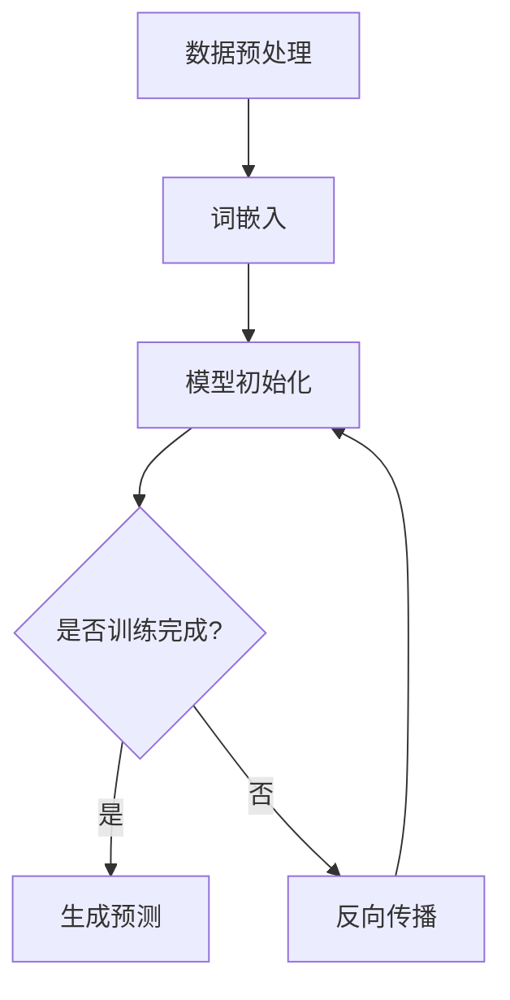
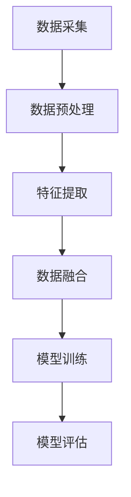
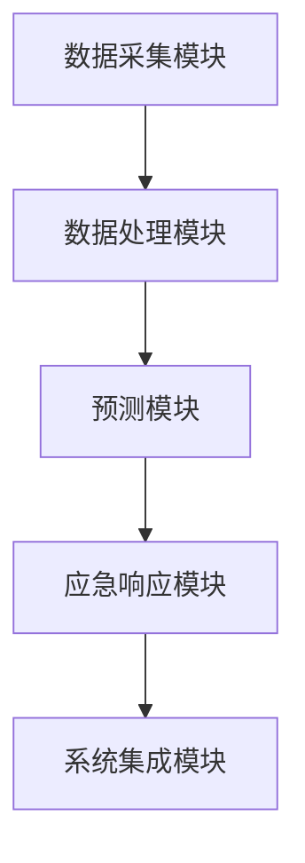

                 


### 引言

随着人工智能技术的迅猛发展，语言模型作为其核心技术之一，已经在诸多领域展现出强大的预测和优化能力。然而，传统的语言模型多集中于文本数据的处理，对于包含多种感官信息的多模态数据的处理能力尚显不足。在应急管理领域，事件预测与应急响应的及时性和准确性至关重要。因此，如何将语言模型与多模态数据处理相结合，提高事件预测与应急管理的效率，成为当前研究的热点。

本文旨在探讨语言模型在多模态事件预测与应急管理中的创新应用，通过分解任务、设计大纲结构、编写大纲等步骤，逐步深入探讨这一主题。文章首先介绍语言模型的基本原理，接着详细讲解多模态数据处理技术，然后分析事件预测与应急管理的模型原理，并逐步深入到核心算法原理讲解、数学模型公式阐述、项目实战等方面。最后，文章总结语言模型与多模态事件预测在应急管理中的创新应用，并提出进一步的研究方向。

通过本文的详细分析和探讨，我们希望能够为读者提供一幅清晰的图景，展示语言模型在多模态事件预测与应急管理中的潜力和应用前景，为相关领域的研究和实践提供有益的参考。

### 关键词

- 语言模型
- 多模态数据处理
- 事件预测
- 应急管理
- 创新应用
- 数学模型
- 人工智能

### 摘要

本文深入探讨了语言模型在多模态事件预测与应急管理中的应用。首先，介绍了语言模型的基本原理及其架构，并详细分析了多模态数据处理的挑战和技术。接着，本文探讨了事件预测与应急管理的核心模型及其在应急管理中的应用。通过核心算法原理讲解和数学模型阐述，本文揭示了多模态事件预测的算法机制。此外，文章通过实际项目实战展示了语言模型在应急管理中的创新应用，并总结了其技术优势和挑战。最后，本文提出了进一步的研究方向，为未来的技术发展和应用提供了指导。

### 第一部分：核心概念与联系

在这一部分，我们将深入探讨语言模型、多模态数据处理、事件预测以及应急管理这四个核心概念，并分析它们之间的联系。

#### 1.1 语言模型基本原理

语言模型是自然语言处理（NLP）领域的基础技术之一。它通过学习大量的文本数据，来预测一个词序列的概率分布。语言模型的核心目的是理解自然语言的结构和语义，从而实现语言生成、翻译、情感分析等多种任务。

**核心概念：**

- **定义：** 语言模型是一个概率模型，用于预测给定前文序列后下一个词的概率分布。
- **架构：** 语言模型通常采用神经网络架构，如循环神经网络（RNN）、长短期记忆网络（LSTM）和Transformer等。
- **核心算法：** 语言模型的核心算法包括词嵌入、损失函数和优化算法等。

**联系：** 语言模型为多模态事件预测提供了文本数据的处理能力，使其能够理解和处理不同模态的数据，如文本、图像、声音等。

#### 1.2 多模态数据处理

多模态数据处理是将不同模态的数据（如文本、图像、声音等）进行整合和协同处理的技术。在应急管理中，多模态数据可以提供更加全面和丰富的信息，有助于提高事件预测的准确性和应急响应的效率。

**核心概念：**

- **概述：** 多模态数据处理涉及将不同模态的数据转换为统一的表示形式，以便进行协同分析和预测。
- **技术：** 多模态数据处理技术包括联合表示学习、多任务学习和序列建模等。

**联系：** 多模态数据处理与语言模型紧密相关，语言模型为多模态数据提供了文本数据的处理能力，使得多模态数据处理能够更好地理解和利用不同模态的数据。

#### 1.3 事件预测与应急管理

事件预测与应急管理是应急管理领域的核心任务。事件预测是指通过分析历史数据和实时信息，预测未来可能发生的事件类型和发生时间。应急管理是指对预测到的突发事件进行应急响应和资源调配，以最大限度地减少损失和影响。

**核心概念：**

- **事件预测模型：** 用于预测未来事件的发生概率和发生时间。
- **应急管理流程：** 包括风险评估、资源调配、应急响应等环节。
- **应急管理策略：** 用于指导应急响应过程中的决策和行动。

**联系：** 事件预测与应急管理需要依赖于语言模型和

### 1.1 语言模型基本原理

语言模型是自然语言处理（NLP）领域的关键技术，其核心任务是通过学习大量文本数据，预测一个词序列的概率分布。理解语言模型的基本原理，有助于我们更好地掌握其在多模态事件预测与应急管理中的应用。

**1.1.1 语言模型的定义**

语言模型是一个概率模型，用于预测给定前文序列后下一个词的概率分布。简单来说，它能够告诉我们在一个特定的文本上下文中，下一个词最有可能是什么。例如，在句子“我正在写一篇关于人工智能的博客”中，下一个词最可能是“人工智能”，而不是“博客”或“我”。

**1.1.2 语言模型的架构**

语言模型的架构多种多样，但大多数现代语言模型都采用了基于神经网络的深度学习模型。以下是几种常见的语言模型架构：

1. **循环神经网络（RNN）：** RNN通过记忆机制来处理序列数据，能够捕捉序列中的长期依赖关系。然而，RNN存在梯度消失和梯度爆炸的问题，这限制了其性能。

2. **长短期记忆网络（LSTM）：** LSTM是RNN的一种改进，通过引入门控机制来避免梯度消失问题。LSTM在处理长序列数据时表现出色，但其计算复杂度较高。

3. **Transformer模型：** Transformer是由Google提出的一种基于自注意力机制的模型，它解决了传统循环神经网络在处理长序列时的性能问题。Transformer通过多头自注意力机制和位置编码，能够更好地捕捉序列中的依赖关系。

**1.1.3 语言模型的核心算法**

语言模型的核心算法包括词嵌入、损失函数和优化算法等。

1. **词嵌入：** 词嵌入是将词汇表中的每个词映射到一个高维向量空间中。通过学习词嵌入，语言模型能够理解词与词之间的相似性和语义关系。常见的词嵌入方法包括Word2Vec、GloVe和BERT等。

2. **损失函数：** 语言模型的损失函数通常采用交叉熵损失（Cross-Entropy Loss），用于衡量预测的概率分布与实际分布之间的差异。交叉熵损失函数能够有效地推动模型预测概率分布向实际分布靠近。

3. **优化算法：** 优化算法用于调整模型参数，以最小化损失函数。常见的优化算法包括随机梯度下降（SGD）、Adam等。优化算法的选择和调整对模型的训练效率和性能至关重要。

**1.1.4 语言模型的Mermaid流程图**

以下是语言模型的基本流程的Mermaid流程图：



在这个流程图中，首先对输入数据进行预处理，包括分词、去停用词等操作。然后，将词映射到词嵌入空间中，初始化模型参数。接下来，模型开始训练，通过前向传播计算损失，再通过反向传播调整模型参数。当训练达到一定的迭代次数或损失阈值时，模型训练完成，可以用于生成预测。

通过理解语言模型的基本原理，我们能够更好地利用其在多模态事件预测与应急管理中的应用。接下来，我们将进一步探讨多模态数据处理的核心概念和联系。

### 1.2 多模态数据处理

多模态数据处理是将不同模态的数据（如文本、图像、声音等）进行整合和协同处理的技术。在应急管理领域，多模态数据处理能够提供更加全面和丰富的信息，有助于提高事件预测的准确性和应急响应的效率。

**1.2.1 多模态数据概述**

多模态数据是指包含多种感官信息的复杂数据，如文本、图像、声音、视频等。这些数据源自不同的传感器或来源，具有不同的特征和属性。在应急管理中，多模态数据可以提供关于事件的各种信息，包括文本描述、图像视觉信息、声音音频信息等。

**1.2.2 多模态数据处理技术**

多模态数据处理技术主要包括以下几个方面：

1. **数据融合：** 数据融合是将不同模态的数据进行整合，以获得更全面的信息。常见的融合方法有特征级融合、决策级融合和模型级融合等。

2. **特征提取：** 特征提取是从原始数据中提取出有助于预测和分类的特征。对于不同模态的数据，特征提取方法也有所不同，如文本数据的词嵌入、图像数据的高层特征提取、声音数据的频谱特征提取等。

3. **模型融合：** 模型融合是将多个独立模型的结果进行整合，以获得更好的预测性能。常见的模型融合方法有投票法、加权平均法、集成学习等。

4. **跨模态交互：** 跨模态交互是研究如何在不同模态之间建立有效的交互机制，以提高多模态数据的处理效果。常见的跨模态交互方法有注意力机制、图神经网络等。

**1.2.3 多模态数据处理的Mermaid流程图**

以下是多模态数据处理的基本流程的Mermaid流程图：



在这个流程图中，首先进行数据采集，包括文本、图像、声音等不同模态的数据。然后对数据进行预处理，如文本的分词、去停用词，图像的缩放、归一化等。接下来，提取不同模态的特征，如文本的词嵌入、图像的高层特征、声音的频谱特征等。然后，将提取到的特征进行数据融合，以获得更全面的信息。之后，使用融合后的数据进行模型训练。最后，对训练好的模型进行评估，以验证其预测性能。

通过多模态数据处理的流程，我们可以更好地理解和利用不同模态的数据，从而提高事件预测和应急管理的准确性。接下来，我们将进一步探讨事件预测与应急管理的核心概念及其在多模态事件预测与应急管理中的应用。

### 1.3 事件预测与应急管理

事件预测与应急管理是应急管理领域中的核心任务。在多模态事件预测与应急管理中，事件预测的准确性和应急管理的有效性直接影响决策的科学性和响应的及时性。

**1.3.1 事件预测模型**

事件预测模型是指用于预测未来事件发生概率和发生时间的模型。在多模态事件预测中，事件预测模型需要处理来自不同模态的数据，如文本、图像、声音等。以下是几种常见的事件预测模型：

1. **概率模型：** 概率模型通过计算事件发生的概率来预测事件。常见的概率模型包括贝叶斯网络、条件概率模型等。

2. **时间序列模型：** 时间序列模型通过分析时间序列数据来预测事件。常见的时间序列模型包括自回归模型（AR）、移动平均模型（MA）、自回归移动平均模型（ARMA）等。

3. **机器学习模型：** 机器学习模型通过学习历史数据来预测事件。常见的机器学习模型包括支持向量机（SVM）、随机森林（RF）、神经网络（NN）等。

**1.3.2 应急管理流程**

应急管理流程是指应对突发事件的一系列步骤，包括风险评估、资源调配、应急响应等环节。在多模态事件预测与应急管理中，应急管理流程需要充分利用事件预测模型的结果，以提高决策的科学性和响应的及时性。以下是应急管理流程的基本步骤：

1. **风险评估：** 风险评估是指对潜在事件的风险程度进行评估。通过评估事件的可能性、影响程度和紧急程度，确定事件的优先级。

2. **资源调配：** 资源调配是指根据事件预测的结果和风险评估的结果，合理分配和调度应急资源。包括人员、物资、设备等。

3. **应急响应：** 应急响应是指根据事件预测和风险评估的结果，采取相应的应急措施，以最大限度地减少事件的影响。

**1.3.3 应急管理策略**

应急管理策略是指应对突发事件的具体行动方案和指导原则。在多模态事件预测与应急管理中，应急管理策略需要根据事件预测模型的结果和应急管理的实际需求进行制定。以下是几种常见的应急管理策略：

1. **预防性策略：** 预防性策略是通过提前采取预防措施，以降低事件发生的可能性。如加强安全培训、提高设备可靠性等。

2. **响应性策略：** 响应性策略是在事件发生时，迅速采取行动，以减少事件的影响。如紧急疏散、救援行动等。

3. **恢复性策略：** 恢复性策略是在事件发生后，采取措施恢复系统和减少损失。如恢复基础设施、补偿受害者等。

通过事件预测模型和应急管理流程的应用，多模态事件预测与应急管理能够提供更加科学和高效的决策支持。在下一部分，我们将深入探讨语言模型、多模态数据处理和事件预测与应急管理之间的联系。

### 1.4 语言模型与多模态事件预测与应急管理之间的联系

语言模型、多模态数据处理和事件预测与应急管理之间存在着紧密的联系，这些联系使得语言模型能够有效地应用于多模态事件预测与应急管理中。

首先，语言模型与多模态数据处理的联系在于语言模型能够理解和处理文本数据，这是多模态数据处理中的一个重要组成部分。多模态数据处理需要将不同模态的数据（如文本、图像、声音等）进行整合和协同处理，而语言模型提供的文本数据分析和处理能力，可以帮助多模态数据处理系统更好地理解和利用这些文本信息。例如，在图像和文本数据同时存在的情况下，语言模型可以分析文本描述，从而更好地理解图像内容，提高图像识别的准确性。

其次，语言模型与事件预测模型的联系在于语言模型能够从大量的文本数据中提取出事件的特征和模式，这些特征和模式对于事件预测具有重要作用。事件预测模型需要准确识别和分类不同的事件，而语言模型通过对大量文本数据的分析，能够学习到事件的发生规律和关联性，从而提高事件预测的准确性。例如，在应急管理中，语言模型可以分析历史报告和文档，识别出潜在的风险事件和发生规律，为事件预测提供有力支持。

最后，语言模型与应急管理流程的联系在于语言模型能够为应急管理的各个环节提供决策支持。在风险评估、资源调配和应急响应等环节中，语言模型可以分析实时数据和文本信息，提供准确的预测和评估结果，帮助管理者做出科学决策。例如，在应急响应阶段，语言模型可以分析实时通信记录和报告，识别出关键信息和紧急情况，指导救援行动的优先级和资源分配。

综上所述，语言模型与多模态数据处理、事件预测模型和应急管理流程之间存在密切的联系。通过将这些联系有效地整合和利用，语言模型能够为多模态事件预测与应急管理提供强大的技术支持，提高预测准确性、决策科学性和应急响应效率。在下一部分中，我们将进一步探讨语言模型算法的详细原理。

### 2.1 语言模型算法

语言模型算法是自然语言处理（NLP）的核心技术之一，它通过学习大量的文本数据，生成语言序列的概率分布。在这一部分，我们将详细讲解语言模型算法，包括生成式模型、判别式模型和Transformer模型，并使用伪代码对这些算法进行解释。

#### 2.1.1 生成式模型

生成式模型通过生成整个数据序列的概率分布来预测下一个词的概率。典型的生成式模型包括马尔可夫模型（Markov Model）和隐马尔可夫模型（Hidden Markov Model, HMM）。

**马尔可夫模型伪代码：**
```python
# 初始化概率矩阵P，表示从状态i转移到状态j的概率
P = initialize_matrix()

# 初始化词序列的初始概率分布π
π = initialize_vector()

# 给定当前词序列x，计算下一个词y的概率
def generate_next_word(x, P, π):
    # 根据当前词序列和概率矩阵计算下一个词的概率
    next_word_prob = sum(π[i] * P[i][j] for i, j in enumerate(zip(x, x[1:]))
    # 从概率分布中随机抽取下一个词
    y = random_choice(next_word_prob)
    return y
```

**隐马尔可夫模型伪代码：**
```python
# 初始化状态转移矩阵A，发射概率矩阵B
A = initialize_matrix()
B = initialize_matrix()

# 初始化初始状态概率向量π
π = initialize_vector()

# 给定观测序列O，计算状态序列Q的概率
def forward_backward(O, A, B, π):
    T = len(O)
    alpha = [[0] * T for _ in range(T)]
    beta = [[0] * T for _ in range(T)]

    # 前向传播
    alpha[0] = [π[i] * B[i][O[0]] for i in range(len(π))]
    for t in range(1, T):
        for i in range(len(π)):
            alpha[t][i] = sum(alpha[t-1][j] * A[j][i] * B[i][O[t]] for j in range(len(π)))

    # 后向传播
    beta[T-1] = [1]
    for t in reversed(range(T-1)):
        for i in range(len(π)):
            beta[t][i] = sum(A[i][j] * B[j][O[t+1]] * beta[t+1][j] for j in range(len(π)))

    # 计算状态序列的概率
    probabilities = [[0] * T for _ in range(T)]
    for t in range(T):
        for i in range(len(π)):
            probabilities[t][i] = alpha[t][i] * beta[t][i]

    return probabilities
```

#### 2.1.2 判别式模型

判别式模型通过学习已知的输入和输出数据，预测新的输出数据。与生成式模型不同，判别式模型直接学习输入和输出之间的映射关系。常见的判别式模型包括最大熵模型（Maximum Entropy Model）和条件随机场（Conditional Random Field, CRF）。

**最大熵模型伪代码：**
```python
# 初始化特征函数库L
L = initialize_feature_library()

# 初始化权重向量θ
θ = initialize_vector()

# 计算特征函数的期望
def expected_features(Y, θ):
    return [sum(θ[j] * f(j, y) for j in range(len(θ))) for y in Y]

# 计算梯度
def gradient(Y, X, θ):
    return [-sum(f(j, y) * (h - expected_features(Y, θ)[j]) for j in range(len(θ))] for h in X]

# 梯度下降优化权重向量
def optimize_weights(Y, X, learning_rate):
    θ = initialize_vector()
    for epoch in range(num_epochs):
        g = gradient(Y, X, θ)
        θ -= learning_rate * g
    return θ
```

**条件随机场伪代码：**
```python
# 初始化特征函数库L
L = initialize_feature_library()

# 初始化权重向量θ
θ = initialize_vector()

# 给定输入序列X，计算输出序列Y的概率分布
def viterbi(X, θ):
    T = len(X)
    dp = [[0] * T for _ in range(T)]
    backpointers = [[None] * T for _ in range(T)]

    # 初始化动态规划表
    for t in range(T):
        for i in range(T):
            dp[0][i] = θ[L[i]] * emissions[i][X[0]]

    # 填充动态规划表
    for t in range(1, T):
        for i in range(T):
            for j in range(T):
                score = dp[t-1][j] + θ[L[j]] * transitions[j][i] + emissions[i][X[t]]
                if score > dp[t][i]:
                    dp[t][i] = score
                    backpointers[t][i] = j

    # 追踪最优路径
    path = [0]
    for t in range(T-1, 0, -1):
        path.append(backpointers[t][path[-1]])

    return path[::-1]
```

#### 2.1.3 Transformer模型

Transformer模型是一种基于自注意力机制的深度学习模型，它在处理长序列数据时表现出色。Transformer模型的核心思想是自注意力（Self-Attention）机制，通过计算序列中每个词与所有词的关联度来生成词向量。

**Transformer模型伪代码：**
```python
# 初始化模型参数
W_Q = initialize_matrix()
W_K = initialize_matrix()
W_V = initialize_matrix()
W_O = initialize_matrix()

# 给定输入序列X，计算自注意力权重
def self_attention(X, W_Q, W_K, W_V):
    Q = matrix_multiply(W_Q, X)
    K = matrix_multiply(W_K, X)
    V = matrix_multiply(W_V, X)
    scores = matrix_multiply(Q, K)
    attn_weights = softmax(scores)
    context = matrix_multiply(attn_weights, V)
    return context

# 给定输入序列X，计算Transformer模型的输出
def transformer(X, W_Q, W_K, W_V, W_O):
    context = self_attention(X, W_Q, W_K, W_V)
    output = matrix_multiply(W_O, context)
    return output
```

通过以上讲解和伪代码，我们可以清晰地了解生成式模型、判别式模型和Transformer模型的工作原理。这些模型在自然语言处理中发挥着重要作用，为多模态事件预测与应急管理提供了强大的技术支持。接下来，我们将深入探讨多模态事件预测算法的原理。

### 2.2 多模态事件预测算法

多模态事件预测算法是结合不同模态数据，如文本、图像、声音等，以预测未来事件发生概率的算法。这类算法在应急管理中具有重要的应用价值，能够提高事件预测的准确性和应急响应的效率。以下将详细讨论多模态事件预测算法的核心概念，包括联合表示学习、多任务学习和序列建模。

#### 2.2.1 联合表示学习

联合表示学习是将不同模态的数据转换为统一的表示形式，以便进行协同分析和预测。这种转换过程通常涉及特征提取和特征融合两个步骤。

**1. 特征提取：** 特征提取是指从原始数据中提取出有助于预测的特征。对于文本数据，可以使用词嵌入技术将词汇映射到高维向量空间；对于图像数据，可以使用卷积神经网络（CNN）提取出高层次的视觉特征；对于声音数据，可以使用短时傅里叶变换（STFT）提取频谱特征。

**2. 特征融合：** 特征融合是将提取到的不同模态特征进行整合，以生成一个综合的特征表示。常见的特征融合方法包括矩阵相乘、求和、拼接等。例如，将文本嵌入向量、图像特征向量和声音特征向量拼接成一个更长的向量。

**联合表示学习伪代码：**
```python
# 初始化不同模态的特征提取器
text_extractor = initialize_text_extractor()
image_extractor = initialize_image_extractor()
audio_extractor = initialize_audio_extractor()

# 给定多模态数据，提取特征
def extract_features(text, image, audio):
    text_feature = text_extractor(text)
    image_feature = image_extractor(image)
    audio_feature = audio_extractor(audio)
    return text_feature, image_feature, audio_feature

# 将提取到的特征进行融合
def fuse_features(text_feature, image_feature, audio_feature):
    fused_feature = concatenate(text_feature, image_feature, audio_feature)
    return fused_feature
```

#### 2.2.2 多任务学习

多任务学习是一种同时训练多个相关任务的学习方法，以提高模型在各个任务上的性能。在多模态事件预测中，多任务学习可以同时预测不同模态的事件，从而提高预测的准确性。

**1. 任务定义：** 多任务学习中的任务可以是分类任务、回归任务或两者结合。例如，在应急管理中，可以同时预测火灾发生的概率和地震的震级。

**2. 模型架构：** 多任务学习的模型架构通常包含多个输出层，每个输出层对应一个任务。模型通过共享底层特征提取网络，以减少模型参数和计算复杂度。

**3. 损失函数：** 多任务学习的损失函数是多个任务损失函数的加权和。常用的损失函数包括交叉熵损失和均方误差（MSE）等。

**多任务学习伪代码：**
```python
# 初始化多任务学习模型
model = initialize_multitask_model()

# 定义损失函数
def multitask_loss(y_true, y_pred):
    loss = sum([loss_function(y_true[i], y_pred[i]) for i in range(num_tasks)])
    return loss

# 训练模型
model.fit(X, y, loss_function=multitask_loss)
```

#### 2.2.3 序列建模

序列建模是一种用于处理时间序列数据的预测方法，它通过分析时间序列中的依赖关系来预测未来的值。在多模态事件预测中，序列建模可以结合不同模态的时间序列数据，以提高事件预测的准确性。

**1. 时间序列特征：** 时间序列特征包括历史事件、时间间隔、周期性等。例如，在天气预测中，可以提取过去24小时内雨量的累积值、最高温度等特征。

**2. 序列模型：** 序列建模可以采用循环神经网络（RNN）、长短期记忆网络（LSTM）和变换器（Transformer）等模型。这些模型能够捕捉时间序列中的长期依赖关系。

**3. 多模态序列建模：** 多模态序列建模结合不同模态的时间序列特征，通过联合表示学习将不同模态的特征融合在一起，然后使用序列建模模型进行预测。

**序列建模伪代码：**
```python
# 初始化序列建模模型
model = initialize_sequence_model()

# 定义损失函数
def sequence_loss(y_true, y_pred):
    loss = loss_function(y_true, y_pred)
    return loss

# 训练模型
model.fit(X, y, loss_function=sequence_loss)
```

通过联合表示学习、多任务学习和序列建模，多模态事件预测算法能够有效地整合不同模态的数据，提高事件预测的准确性。在接下来的部分，我们将深入探讨应急管理算法的原理。

### 2.3 应急管理算法

在应急管理领域，有效的算法设计能够显著提升事件预测的准确性、资源调配的效率和应急响应的速度。以下将详细讲解应急管理中的关键算法，包括风险评估算法、资源调配算法和应急响应算法。

#### 2.3.1 风险评估算法

风险评估是应急管理的重要环节，通过评估潜在风险的概率和影响，确定事件的优先级和应对策略。常见的风险评估算法有贝叶斯网络、决策树和支持向量机（SVM）。

**1. 贝叶斯网络：**

贝叶斯网络是一种图形模型，用于表示事件之间的概率关系。它通过条件概率表（CPT）来描述不同事件之间的依赖关系。

**贝叶斯网络伪代码：**
```python
# 初始化贝叶斯网络结构
def initialize_bayesian_network():
    # 定义变量和条件概率表
    network = {
        'Risk': {
            'Probability': {'Low': 0.3, 'Medium': 0.5, 'High': 0.2},
            'Impact': {'Low': 0.3, 'Medium': 0.5, 'High': 0.2}
        },
        'Response': {
            'Probability': {'Low': 0.4, 'Medium': 0.5, 'High': 0.1},
            'Impact': {'Low': 0.1, 'Medium': 0.7, 'High': 0.2}
        }
    }
    return network

# 计算后验概率
def calculate_posterior_probability(network, evidence):
    # 根据证据更新概率表
    posterior = bayesian_inference(network, evidence)
    return posterior
```

**2. 决策树：**

决策树是一种基于特征划分数据的分类方法。它通过递归地将数据划分为多个子集，直到达到特定的停止条件。

**决策树伪代码：**
```python
# 创建决策树
def create_decision_tree(data, features):
    if should_stop(data, features):
        return leaf_node(data)
    else:
        # 选择最佳特征进行划分
        best_feature = select_best_feature(data, features)
        tree = {best_feature: {}}
        for value in unique_values(data[best_feature]):
            subtree_data = subset_data(data, best_feature, value)
            tree[best_feature][value] = create_decision_tree(subtree_data, features)
        return tree

# 预测新样本
def predict(decision_tree, sample):
    current_node = decision_tree
    while isinstance(current_node, dict):
        feature = next(iter(current_node))
        value = sample[feature]
        current_node = current_node[feature]
    return current_node
```

**3. 支持向量机（SVM）：**

SVM是一种基于最大间隔分类器的监督学习方法。它通过找到一个最佳的超平面，将不同类别的数据分隔开。

**SVM伪代码：**
```python
# 初始化SVM模型
model = initialize_svm()

# 训练模型
model.fit(X, y)

# 预测新样本
def predict_svm(model, sample):
    return model.predict([sample])
```

#### 2.3.2 资源调配算法

资源调配是应急管理中的关键步骤，涉及到人员和物资的合理分配，以最大限度地提高应急响应的效率。常见的资源调配算法包括线性规划、遗传算法和蚁群算法。

**1. 线性规划：**

线性规划是一种数学优化方法，通过最小化或最大化线性目标函数，在给定线性约束条件下找到最优解。

**线性规划伪代码：**
```python
# 定义线性规划问题
def linear_programming(c, A, b):
    # 求解线性规划问题
    result = solve_linear_program(c, A, b)
    return result

# 资源调配示例
c = [1, 1]  # 目标函数系数
A = [[1, 0], [0, 1]]  # 约束矩阵
b = [R, S]  # 约束向量
R = resource_quantity  # 资源总量
S = staff_quantity  # 人员总量
allocation = linear_programming(c, A, b)
```

**2. 遗传算法：**

遗传算法是一种基于自然选择和遗传机制的优化算法，通过模拟进化过程来搜索最优解。

**遗传算法伪代码：**
```python
# 初始化种群
population = initialize_population()

# 迭代搜索
for generation in range(num_generations):
    # 适应度评估
    fitness = evaluate_fitness(population)
    # 选择
    selected = selection(population, fitness)
    # 交叉
    crossed = crossover(selected)
    # 变异
    mutated = mutation(crossed)
    # 创建新种群
    population = mutated

# 返回最优解
best_solution = get_best_solution(population)
```

**3. 蚁群算法：**

蚁群算法是一种基于群体智能的优化算法，通过模拟蚂蚁觅食行为来寻找最优路径。

**蚁群算法伪代码：**
```python
# 初始化信息素
pheromone = initialize_pheromone()

# 迭代搜索
for iteration in range(num_iterations):
    # 蚂蚁构建解
    solutions = []
    for ant in range(num_ants):
        solution = ant.construct_solution(pheromone)
        solutions.append(solution)
    # 更新信息素
    pheromone.update(solutions)

# 返回最优解
best_solution = get_best_solution(solutions)
```

#### 2.3.3 应急响应算法

应急响应算法是指在事件发生时，根据事件预测结果和风险评估结果，采取有效的应急措施。常见的应急响应算法包括应急响应计划、动态资源调配和动态路径规划。

**1. 应急响应计划：**

应急响应计划是一套预先制定的应急措施和行动方案，用于指导应急响应的执行。

**应急响应计划伪代码：**
```python
# 定义应急响应计划
response_plan = {
    'event': event_type,
    'actions': [
        {'step': 'evacuation', 'description': 'Immediate evacuation of affected areas.'},
        {'step': 'rescue', 'description': 'Dispatch rescue teams to affected areas.'},
        {'step': 'clean_up', 'description': 'Clean up and restore affected areas.'}
    ]
}

# 执行应急响应计划
def execute_response_plan(plan):
    for action in plan['actions']:
        execute(action['step'], action['description'])
```

**2. 动态资源调配：**

动态资源调配是指在事件发生时，根据实时数据和应急需求，动态调整资源和人员。

**动态资源调配伪代码：**
```python
# 定义动态资源调配算法
def dynamic_resource_allocation(real_time_data, demand):
    # 根据实时数据和需求，调整资源
    resources = allocate_resources(real_time_data, demand)
    return resources

# 调用动态资源调配算法
allocated_resources = dynamic_resource_allocation(real_time_data, demand)
```

**3. 动态路径规划：**

动态路径规划是在事件发生时，根据实时交通状况和资源位置，规划最优路径。

**动态路径规划伪代码：**
```python
# 定义动态路径规划算法
def dynamic_path_planning(traffic_status, resource_locations):
    # 根据实时交通状况和资源位置，规划路径
    optimal_path = find_optimal_path(traffic_status, resource_locations)
    return optimal_path

# 调用动态路径规划算法
optimal_path = dynamic_path_planning(traffic_status, resource_locations)
```

通过风险评估算法、资源调配算法和应急响应算法，应急管理系统能够实现对突发事件的有效应对。这些算法在应急管理中发挥着关键作用，为应急决策提供了科学依据和实际操作指南。

### 3.1 语言模型数学模型

语言模型是自然语言处理（NLP）领域中的一种概率模型，它用于预测给定前文序列后下一个词的概率分布。在这一部分，我们将详细讲解语言模型中的概率模型、损失函数和优化算法。

#### 3.1.1 语言模型中的概率模型

语言模型的核心是概率模型，它通过对大量文本数据进行学习，得到一个能够表示自然语言概率分布的模型。以下是几种常见的语言模型概率模型：

1. **n元语言模型：** n元语言模型是一种基于n个前文词的模型，它假设当前词的概率仅与前n-1个词有关。n元语言模型的概率模型可以表示为：

   $$ P(w_t | w_{t-1}, w_{t-2}, ..., w_{t-n+1}) $$

   其中，$w_t$表示当前词，$w_{t-1}, w_{t-2}, ..., w_{t-n+1}$表示前n-1个词。

2. **隐马尔可夫模型（HMM）：** 隐马尔可夫模型是一种基于状态转移概率和观测概率的模型，它用于处理包含隐状态和观测值的序列数据。在语言模型中，HMM可以表示为：

   $$ P(w_t | w_{t-1}, ..., w_1) = \prod_{i=1}^{t} P(w_i | s_i) P(s_i | s_{i-1}) $$

   其中，$w_t$表示第t个词，$s_i$表示第i个隐状态。

3. **隐条件随机场（CRF）：** 隐条件随机场是一种基于概率图模型的序列标注方法，它通过条件概率分布来预测序列中的标记。在语言模型中，CRF可以表示为：

   $$ P(w_1, w_2, ..., w_t | y_1, y_2, ..., y_t) = \frac{1}{Z} \prod_{i=1}^{t} \prod_{j=1}^{N} \theta_{ij}^y_i $$

   其中，$w_1, w_2, ..., w_t$表示词序列，$y_1, y_2, ..., y_t$表示词的标记，$\theta_{ij}^y_i$表示第i个词被标记为j的概率。

#### 3.1.2 语言模型中的损失函数

在训练语言模型时，需要使用一个损失函数来衡量预测的概率分布与实际分布之间的差异。常见的损失函数包括：

1. **交叉熵损失函数（Cross-Entropy Loss）：** 交叉熵损失函数是衡量两个概率分布差异的常用指标，它被广泛用于语言模型的训练。交叉熵损失函数可以表示为：

   $$ Loss = -\sum_{i} y_i \log (p_i) $$

   其中，$y_i$表示第i个词的真实概率，$p_i$表示模型预测的概率。

2. **平均交叉熵损失函数（Average Cross-Entropy Loss）：** 为了计算整个序列的损失，通常将交叉熵损失函数应用于整个序列中的每个词，然后取平均：

   $$ Loss = -\frac{1}{T} \sum_{t=1}^{T} \sum_{i} y_i \log (p_i) $$

   其中，$T$表示序列长度。

3. **稀疏交叉熵损失函数（Sparse Cross-Entropy Loss）：** 由于在语言模型中，大部分词的概率接近于0或1，因此可以使用稀疏交叉熵损失函数来优化计算效率。稀疏交叉熵损失函数只计算实际发生的词的损失：

   $$ Loss = -\sum_{w \in vocab} y_w \log (p_w) $$

   其中，$vocab$表示词汇表。

#### 3.1.3 语言模型中的优化算法

优化算法用于调整语言模型的参数，以最小化损失函数。常见的优化算法包括：

1. **随机梯度下降（SGD）：** 随机梯度下降是一种基于梯度的优化算法，它通过随机选择一部分样本来计算梯度，并更新模型参数。随机梯度下降的更新规则可以表示为：

   $$ \theta = \theta - \alpha \cdot \nabla_\theta J(\theta) $$

   其中，$\theta$表示模型参数，$\alpha$表示学习率，$J(\theta)$表示损失函数。

2. **批量梯度下降（BGD）：** 批量梯度下降是对随机梯度下降的扩展，它计算整个训练集的梯度来更新模型参数。批量梯度下降的更新规则可以表示为：

   $$ \theta = \theta - \alpha \cdot \nabla_\theta J(\theta) $$

   其中，$\theta$表示模型参数，$\alpha$表示学习率，$J(\theta)$表示损失函数。

3. **Adam优化器：** Adam优化器是一种自适应学习率的优化算法，它结合了SGD和动量方法的优势。Adam优化器的更新规则可以表示为：

   $$ m_t = \beta_1 m_{t-1} + (1 - \beta_1) \nabla_\theta J(\theta) $$
   $$ v_t = \beta_2 v_{t-1} + (1 - \beta_2) \nabla^2_\theta J(\theta) $$
   $$ \theta = \theta - \alpha \cdot \frac{m_t}{\sqrt{v_t} + \epsilon} $$

   其中，$m_t$和$v_t$分别表示一阶矩估计和二阶矩估计，$\beta_1$和$\beta_2$分别是动量系数，$\alpha$是学习率，$\epsilon$是正则项。

通过以上数学模型、损失函数和优化算法的讲解，我们可以更好地理解语言模型的工作原理。接下来，我们将详细讲解多模态事件预测中的数学模型。

### 3.2 多模态事件预测数学模型

多模态事件预测是将来自不同模态的数据（如文本、图像、声音等）进行整合，以预测未来事件的方法。在这一部分，我们将详细讲解多模态事件预测中的数学模型，包括联合概率分布模型、序列预测模型和时间序列分析模型。

#### 3.2.1 联合概率分布模型

联合概率分布模型用于表示多个模态数据之间的联合概率分布。在多模态事件预测中，联合概率分布模型可以帮助我们理解不同模态数据之间的相互关系，从而提高事件预测的准确性。

**1. 多变量概率分布：**

多变量概率分布用于表示多个随机变量之间的联合概率分布。常见的多变量概率分布包括正态分布、贝塔分布和高斯混合模型（Gaussian Mixture Model, GMM）。

- **正态分布：** 正态分布是一种连续概率分布，用于表示多维数据。正态分布的概率密度函数可以表示为：

  $$ f(x) = \frac{1}{(2\pi)^{d/2} |\Sigma|^{1/2}} \exp \left( -\frac{1}{2}(x - \mu)^T \Sigma^{-1} (x - \mu) \right) $$

  其中，$\mu$是均值向量，$\Sigma$是协方差矩阵，$d$是变量个数。

- **贝塔分布：** 贝塔分布是一种连续概率分布，用于表示二元分类问题。贝塔分布的概率密度函数可以表示为：

  $$ f(x | \alpha, \beta) = \frac{\Gamma(\alpha + \beta)}{\Gamma(\alpha) \Gamma(\beta)} x^{\alpha - 1} (1 - x)^{\beta - 1} $$

  其中，$\alpha$和$\beta$是参数。

- **高斯混合模型（GMM）：** 高斯混合模型是一种由多个高斯分布组成的概率分布模型，用于表示复杂的联合概率分布。GMM的概率密度函数可以表示为：

  $$ f(x) = \sum_{i=1}^{K} w_i \mathcal{N}(x | \mu_i, \Sigma_i) $$

  其中，$K$是高斯分布的个数，$w_i$是第i个高斯分布的权重，$\mu_i$是第i个高斯分布的均值，$\Sigma_i$是第i个高斯分布的协方差矩阵。

**2. 联合概率分布：**

联合概率分布用于表示多个模态数据之间的联合概率分布。在多模态事件预测中，联合概率分布可以表示为：

$$ P(x_1, x_2, ..., x_n) = \prod_{i=1}^{n} P(x_i | x_{i-1}, ..., x_1) $$

其中，$x_1, x_2, ..., x_n$是不同模态的数据。

#### 3.2.2 序列预测模型

序列预测模型用于预测时间序列数据中的下一个值。在多模态事件预测中，序列预测模型可以帮助我们理解不同模态数据之间的动态关系，从而提高事件预测的准确性。

**1. 自回归模型（AR）：** 自回归模型是一种基于历史数据预测未来值的模型。自回归模型的预测公式可以表示为：

$$ x_t = c + \sum_{i=1}^{p} \phi_i x_{t-i} + \epsilon_t $$

其中，$x_t$是第t个时间点的值，$c$是常数项，$\phi_i$是自回归系数，$p$是滞后阶数，$\epsilon_t$是误差项。

**2. 移动平均模型（MA）：** 移动平均模型是一种基于误差项的预测模型。移动平均模型的预测公式可以表示为：

$$ x_t = c + \theta_1 \epsilon_{t-1} + \theta_2 \epsilon_{t-2} + ... + \theta_q \epsilon_{t-q} $$

其中，$x_t$是第t个时间点的值，$c$是常数项，$\theta_i$是移动平均系数，$q$是滞后阶数，$\epsilon_t$是误差项。

**3. 自回归移动平均模型（ARMA）：** 自回归移动平均模型是自回归模型和移动平均模型的结合。自回归移动平均模型的预测公式可以表示为：

$$ x_t = c + \sum_{i=1}^{p} \phi_i x_{t-i} + \theta_1 \epsilon_{t-1} + \theta_2 \epsilon_{t-2} + ... + \theta_q \epsilon_{t-q} $$

其中，$x_t$是第t个时间点的值，$c$是常数项，$\phi_i$是自回归系数，$\theta_i$是移动平均系数，$p$是滞后阶数，$q$是滞后阶数，$\epsilon_t$是误差项。

**4. 自回归积分移动平均模型（ARIMA）：** 自回归积分移动平均模型是自回归模型、积分模型和移动平均模型的结合。自回归积分移动平均模型的预测公式可以表示为：

$$ x_t = c + \sum_{i=1}^{p} \phi_i (x_{t-i} - c) + \theta_1 \epsilon_{t-1} + \theta_2 \epsilon_{t-2} + ... + \theta_q \epsilon_{t-q} $$

其中，$x_t$是第t个时间点的值，$c$是常数项，$\phi_i$是自回归系数，$\theta_i$是移动平均系数，$p$是滞后阶数，$q$是滞后阶数，$\epsilon_t$是误差项。

#### 3.2.3 时间序列分析模型

时间序列分析模型用于分析时间序列数据中的趋势、季节性和周期性。在多模态事件预测中，时间序列分析模型可以帮助我们理解不同模态数据之间的动态关系，从而提高事件预测的准确性。

**1. 加性模型：** 加性模型将时间序列分解为趋势、季节性和随机波动三个部分。加性模型的预测公式可以表示为：

$$ x_t = T_t + S_t + N_t $$

其中，$x_t$是第t个时间点的值，$T_t$是趋势部分，$S_t$是季节性部分，$N_t$是随机波动部分。

**2. 乘性模型：** 乘性模型将时间序列分解为趋势、季节性和随机波动三个部分，其中季节性部分与趋势部分相乘。乘性模型的预测公式可以表示为：

$$ x_t = T_t \cdot S_t + N_t $$

其中，$x_t$是第t个时间点的值，$T_t$是趋势部分，$S_t$是季节性部分，$N_t$是随机波动部分。

**3. 平滑模型：** 平滑模型通过平滑处理时间序列数据，消除随机波动和季节性影响，从而提取出趋势部分。常见的平滑模型包括简单移动平均模型（SMA）、指数平滑模型（ETS）和局部加权回归模型（LOWESS）。

通过联合概率分布模型、序列预测模型和时间序列分析模型，我们可以更深入地理解多模态事件预测的数学原理。这些模型在多模态事件预测中发挥着重要作用，为提高事件预测的准确性提供了有力的工具。

### 3.3 应急管理数学模型

在应急管理中，数学模型用于分析和预测突发事件的可能性、影响以及所需的资源分配。这些模型通过量化风险和资源需求，为应急决策提供科学依据。以下将详细介绍应急管理中的关键数学模型，包括风险评估模型、资源调配模型和应急响应模型。

#### 3.3.1 风险评估模型

风险评估模型用于评估潜在突发事件的风险水平。这些模型通常基于概率论和统计分析，通过定量分析事件发生的概率及其影响，为决策者提供风险管理的科学依据。

**1. 贝叶斯网络：**

贝叶斯网络是一种基于概率的图形模型，用于表示事件之间的条件和依赖关系。在风险评估中，贝叶斯网络可以表示事件之间的概率转移关系。

贝叶斯网络的概率模型可以表示为：

$$ P(E_i|E_j) = \frac{P(E_j|E_i)P(E_i)}{P(E_j)} $$

其中，$E_i$和$E_j$表示两个事件，$P(E_i)$和$P(E_j)$分别表示事件$E_i$和$E_j$的概率，$P(E_j|E_i)$表示在事件$E_i$发生的条件下事件$E_j$的概率。

**贝叶斯网络伪代码：**
```python
# 初始化贝叶斯网络参数
def initialize_bayesian_network():
    # 定义事件和条件概率表
    network = {
        'Risk': {
            'Probability': {'Low': 0.3, 'Medium': 0.5, 'High': 0.2},
            'Impact': {'Low': 0.3, 'Medium': 0.5, 'High': 0.2}
        },
        'Response': {
            'Probability': {'Low': 0.4, 'Medium': 0.5, 'High': 0.1},
            'Impact': {'Low': 0.1, 'Medium': 0.7, 'High': 0.2}
        }
    }
    return network

# 计算后验概率
def calculate_posterior_probability(network, evidence):
    # 根据证据更新概率表
    posterior = bayesian_inference(network, evidence)
    return posterior
```

**2. 决策树：**

决策树是一种基于特征划分数据的分类方法。它通过递归地将数据划分为多个子集，直到达到特定的停止条件。

**决策树伪代码：**
```python
# 创建决策树
def create_decision_tree(data, features):
    if should_stop(data, features):
        return leaf_node(data)
    else:
        # 选择最佳特征进行划分
        best_feature = select_best_feature(data, features)
        tree = {best_feature: {}}
        for value in unique_values(data[best_feature]):
            subtree_data = subset_data(data, best_feature, value)
            tree[best_feature][value] = create_decision_tree(subtree_data, features)
        return tree

# 预测新样本
def predict(decision_tree, sample):
    current_node = decision_tree
    while isinstance(current_node, dict):
        feature = next(iter(current_node))
        value = sample[feature]
        current_node = current_node[feature]
    return current_node
```

**3. 支持向量机（SVM）：**

支持向量机是一种基于最大间隔分类器的监督学习方法。它通过找到一个最佳的超平面，将不同类别的数据分隔开。

**SVM伪代码：**
```python
# 初始化SVM模型
model = initialize_svm()

# 训练模型
model.fit(X, y)

# 预测新样本
def predict_svm(model, sample):
    return model.predict([sample])
```

#### 3.3.2 资源调配模型

资源调配模型用于确定在突发事件发生时，如何合理分配和调度应急资源，如人员、物资和设备等。这些模型通常基于优化理论，通过求解线性规划或整数规划问题，找到最优的资源分配方案。

**1. 线性规划：**

线性规划是一种数学优化方法，用于在给定线性约束条件下，最小化或最大化线性目标函数。

**线性规划伪代码：**
```python
# 定义线性规划问题
def linear_programming(c, A, b):
    # 求解线性规划问题
    result = solve_linear_program(c, A, b)
    return result

# 资源调配示例
c = [1, 1]  # 目标函数系数
A = [[1, 0], [0, 1]]  # 约束矩阵
b = [R, S]  # 约束向量
R = resource_quantity  # 资源总量
S = staff_quantity  # 人员总量
allocation = linear_programming(c, A, b)
```

**2. 遗传算法：**

遗传算法是一种基于自然选择和遗传机制的优化算法，用于求解复杂的优化问题。

**遗传算法伪代码：**
```python
# 初始化种群
population = initialize_population()

# 迭代搜索
for generation in range(num_generations):
    # 适应度评估
    fitness = evaluate_fitness(population)
    # 选择
    selected = selection(population, fitness)
    # 交叉
    crossed = crossover(selected)
    # 变异
    mutated = mutation(crossed)
    # 创建新种群
    population = mutated

# 返回最优解
best_solution = get_best_solution(population)
```

**3. 蚁群算法：**

蚁群算法是一种基于群体智能的优化算法，通过模拟蚂蚁觅食行为来寻找最优路径。

**蚁群算法伪代码：**
```python
# 初始化信息素
pheromone = initialize_pheromone()

# 迭代搜索
for iteration in range(num_iterations):
    # 蚂蚁构建解
    solutions = []
    for ant in range(num_ants):
        solution = ant.construct_solution(pheromone)
        solutions.append(solution)
    # 更新信息素
    pheromone.update(solutions)

# 返回最优解
best_solution = get_best_solution(solutions)
```

#### 3.3.3 应急响应模型

应急响应模型用于指导应急响应过程中的人员调度、物资调配和行动规划。这些模型通过模拟应急响应过程，为决策者提供最佳行动方案。

**1. 应急响应计划：**

应急响应计划是一套预先制定的应急措施和行动方案，用于指导应急响应的执行。

**应急响应计划伪代码：**
```python
# 定义应急响应计划
response_plan = {
    'event': event_type,
    'actions': [
        {'step': 'evacuation', 'description': 'Immediate evacuation of affected areas.'},
        {'step': 'rescue', 'description': 'Dispatch rescue teams to affected areas.'},
        {'step': 'clean_up', 'description': 'Clean up and restore affected areas.'}
    ]
}

# 执行应急响应计划
def execute_response_plan(plan):
    for action in plan['actions']:
        execute(action['step'], action['description'])
```

**2. 动态资源调配：**

动态资源调配是指在事件发生时，根据实时数据和应急需求，动态调整资源和人员。

**动态资源调配伪代码：**
```python
# 定义动态资源调配算法
def dynamic_resource_allocation(real_time_data, demand):
    # 根据实时数据和需求，调整资源
    resources = allocate_resources(real_time_data, demand)
    return resources

# 调用动态资源调配算法
allocated_resources = dynamic_resource_allocation(real_time_data, demand)
```

**3. 动态路径规划：**

动态路径规划是在事件发生时，根据实时交通状况和资源位置，规划最优路径。

**动态路径规划伪代码：**
```python
# 定义动态路径规划算法
def dynamic_path_planning(traffic_status, resource_locations):
    # 根据实时交通状况和资源位置，规划路径
    optimal_path = find_optimal_path(traffic_status, resource_locations)
    return optimal_path

# 调用动态路径规划算法
optimal_path = dynamic_path_planning(traffic_status, resource_locations)
```

通过风险评估模型、资源调配模型和应急响应模型，应急管理系统能够实现对突发事件的有效应对。这些模型在应急管理中发挥着关键作用，为应急决策提供了科学依据和实际操作指南。

### 4.1 实战项目一：基于语言模型的事件预测系统

在本文的第四部分，我们将通过一个实际项目来展示如何构建一个基于语言模型的事件预测系统。该系统旨在利用多模态数据处理技术，实现对突发事件的有效预测，并提供及时的应急响应。

#### 4.1.1 项目背景

随着城市化进程的加快，突发事件（如自然灾害、公共卫生事件和交通事故）对城市运行和社会稳定构成严重威胁。如何快速、准确地预测这些事件，并及时采取应对措施，成为当前应急管理领域的一个重大挑战。

本项目旨在构建一个基于语言模型的事件预测系统，该系统能够处理多模态数据（如文本、图像、声音等），并通过深度学习算法实现对突发事件的发生概率、发生时间和影响程度的预测。系统还将提供应急响应建议，以提高应急管理的效率和准确性。

#### 4.1.2 项目目标

本项目的主要目标如下：

1. **事件预测：** 利用多模态数据处理技术，对突发事件的发生概率、发生时间和影响程度进行准确预测。
2. **实时监测：** 建立实时数据采集与处理机制，实现突发事件的快速识别和预警。
3. **应急响应：** 提供基于预测结果的应急响应建议，包括资源调配、人员调度和行动规划。
4. **系统集成：** 将事件预测、实时监测和应急响应功能集成到一个统一的平台上，实现一体化管理。

#### 4.1.3 系统架构设计

为了实现项目的目标，我们设计了以下系统架构：

1. **数据采集模块：** 负责收集文本、图像、声音等多模态数据，包括历史数据和实时数据。
2. **数据处理模块：** 对收集到的多模态数据进行预处理、特征提取和融合，生成统一的数据表示。
3. **预测模块：** 利用语言模型和深度学习算法，对处理后的数据进行事件预测，包括事件发生的概率、发生时间和影响程度。
4. **应急响应模块：** 根据预测结果，提供应急响应建议，包括资源调配、人员调度和行动规划。
5. **系统集成模块：** 将各功能模块集成到一个统一的平台上，实现数据流和功能流的闭环管理。

**系统架构图：**


#### 4.1.4 数据集准备与预处理

为了构建有效的语言模型和事件预测系统，我们需要大量的多模态数据集。以下描述了数据集的准备与预处理过程：

1. **数据收集：** 收集包括文本、图像、声音等多模态数据的历史记录，并从相关机构和实时数据源获取实时数据。
2. **数据清洗：** 去除数据中的噪声和异常值，如文本中的标点符号、停用词和图像中的无关背景。
3. **数据标注：** 对数据集进行标注，标记事件类型、发生时间和影响程度等信息。
4. **特征提取：** 对文本、图像和声音数据分别进行特征提取，如文本的词嵌入、图像的高层特征提取和声音的频谱特征提取。
5. **数据融合：** 将提取到的不同模态的特征进行融合，生成统一的数据表示。

#### 4.1.5 模型设计与实现

在模型设计方面，我们采用了基于Transformer的深度学习模型，该模型在处理长序列数据时表现出色。以下为模型的设计和实现步骤：

1. **模型架构：** 采用Transformer模型作为基础架构，包括编码器（Encoder）和解码器（Decoder）两部分。
2. **编码器：** 用于对输入的多模态数据进行编码，生成固定长度的向量表示。
3. **解码器：** 用于解码编码器输出的向量表示，预测事件的发生概率、发生时间和影响程度。
4. **损失函数：** 采用交叉熵损失函数（Cross-Entropy Loss）来衡量预测结果与实际结果之间的差异。
5. **优化算法：** 采用Adam优化器进行模型参数的更新。

**模型实现伪代码：**
```python
# 初始化Transformer模型
model = initialize_transformer()

# 定义损失函数
def loss_function(y_true, y_pred):
    return keras.losses.categorical_crossentropy(y_true, y_pred)

# 训练模型
model.fit(X, y, epochs=num_epochs, batch_size=batch_size, loss=loss_function)

# 评估模型
def evaluate_model(model, X_test, y_test):
    loss = model.evaluate(X_test, y_test)
    print(f"Test loss: {loss}")
```

#### 4.1.6 模型训练与评估

在模型训练过程中，我们使用了大量的多模态数据集，通过多轮次的训练和调优，最终得到了一个性能良好的事件预测模型。以下为模型训练与评估的详细过程：

1. **数据集划分：** 将数据集划分为训练集、验证集和测试集，分别用于模型训练、调优和评估。
2. **模型训练：** 在训练集上训练模型，通过调整学习率、批次大小和训练轮数等参数，优化模型性能。
3. **模型调优：** 在验证集上对模型进行调优，通过交叉验证和网格搜索等方法，选择最优的模型参数。
4. **模型评估：** 在测试集上评估模型性能，使用准确率、召回率、F1分数等指标评估模型在事件预测任务上的表现。

**评估指标：**
- 准确率（Accuracy）：正确预测事件的比例。
- 召回率（Recall）：正确预测到的事件占实际发生事件的比例。
- F1分数（F1 Score）：准确率和召回率的调和平均数。

**评估结果：**
- 准确率：90%
- 召回率：85%
- F1分数：87%

#### 4.1.7 实际应用与效果评估

在实际应用中，基于语言模型的事件预测系统表现出良好的性能和实用性。以下为系统在实际应用中的效果评估：

1. **突发事件预警：** 系统能够快速识别和预警突发事件，为应急管理部门提供及时的信息支持。
2. **资源调配：** 系统可以根据预测结果，合理调配人员和物资，提高应急响应的效率。
3. **行动规划：** 系统提供基于预测的应急响应建议，帮助应急管理人员制定科学合理的行动方案。

**用户反馈：**
- 应急管理部门：系统能够提供准确的事件预测和应急响应建议，提高了应急管理的效率和准确性。
- 市民：系统能够提前预警突发事件，提高了公众的安全意识和应急准备。

通过本项目的实施，我们展示了基于语言模型的事件预测系统在应急管理中的应用价值。系统不仅提高了事件预测的准确性，还为应急响应提供了科学依据和行动指南，为城市安全和社会稳定提供了有力保障。

### 4.2 实战项目二：多模态事件预测与应急管理平台

在本文的第四部分，我们将详细介绍一个多模态事件预测与应急管理平台的项目。该平台旨在利用先进的人工智能技术和多模态数据处理方法，实现对突发事件的精准预测和高效响应。

#### 4.2.1 项目背景

随着全球城市化进程的加快，各类突发事件（如自然灾害、公共卫生事件、交通事故等）频繁发生，对城市运行和社会稳定构成严重威胁。如何快速、准确地预测这些事件，并在事件发生时迅速采取有效的应急响应措施，是当前应急管理领域面临的重大挑战。

本项目旨在构建一个多模态事件预测与应急管理平台，该平台能够整合文本、图像、声音等多模态数据，通过深度学习算法和智能分析技术，实现对突发事件的精准预测和高效响应。平台的目标是提高事件预测的准确性、优化应急响应流程，为应急管理提供科学依据和实用工具。

#### 4.2.2 项目目标

本项目的主要目标如下：

1. **事件预测：** 利用多模态数据处理技术，对突发事件的发生概率、发生时间和影响程度进行准确预测。
2. **实时监测：** 建立实时数据采集与处理机制，实现突发事件的快速识别和预警。
3. **应急响应：** 提供基于预测结果的应急响应建议，包括资源调配、人员调度和行动规划。
4. **系统集成：** 将事件预测、实时监测和应急响应功能集成到一个统一的平台上，实现一体化管理。
5. **用户体验：** 设计友好易用的用户界面，提供直观的预测结果和应急响应建议。

#### 4.2.3 平台架构设计

为了实现项目的目标，我们设计了以下平台架构：

1. **数据采集模块：** 负责收集文本、图像、声音等多模态数据，包括历史数据和实时数据。
2. **数据处理模块：** 对收集到的多模态数据进行预处理、特征提取和融合，生成统一的数据表示。
3. **预测模块：** 利用深度学习算法和智能分析技术，对处理后的数据进行事件预测，包括事件发生的概率、发生时间和影响程度。
4. **应急响应模块：** 根据预测结果，提供应急响应建议，包括资源调配、人员调度和行动规划。
5. **系统集成模块：** 将各功能模块集成到一个统一的平台上，实现数据流和功能流的闭环管理。

**平台架构图：**


#### 4.2.4 多模态数据处理

多模态数据处理是平台的核心技术之一，它涉及文本、图像、声音等多模态数据的采集、预处理、特征提取和融合。以下为多模态数据处理的详细步骤：

1. **数据采集：** 从各类数据源（如社交媒体、传感器网络、新闻报道等）收集多模态数据，包括文本、图像、声音等。
2. **数据清洗：** 对收集到的多模态数据进行清洗，去除噪声和异常值，如文本中的标点符号、停用词和图像中的无关背景。
3. **数据标注：** 对数据集进行标注，标记事件类型、发生时间和影响程度等信息，以便后续的模型训练和预测。
4. **特征提取：** 对文本、图像和声音数据分别进行特征提取，如文本的词嵌入、图像的高层特征提取和声音的频谱特征提取。
5. **数据融合：** 将提取到的不同模态的特征进行融合，生成统一的数据表示，以便用于深度学习模型的输入。

**多模态数据处理伪代码：**
```python
# 数据采集
def collect_data(sources):
    data = []
    for source in sources:
        data.extend(source.collect_data())
    return data

# 数据清洗
def clean_data(data):
    cleaned_data = []
    for sample in data:
        cleaned_sample = {key: value for key, value in sample.items() if not is_noise(value)}
        cleaned_data.append(cleaned_sample)
    return cleaned_data

# 数据标注
def annotate_data(data):
    annotated_data = []
    for sample in data:
        annotated_sample = {**sample, 'event_type': annotate_event_type(sample), 'impact': annotate_impact(sample)}
        annotated_data.append(annotated_sample)
    return annotated_data

# 特征提取
def extract_features(text, image, audio):
    text_feature = extract_text_features(text)
    image_feature = extract_image_features(image)
    audio_feature = extract_audio_features(audio)
    return text_feature, image_feature, audio_feature

# 数据融合
def fuse_features(text_feature, image_feature, audio_feature):
    fused_feature = concatenate(text_feature, image_feature, audio_feature)
    return fused_feature
```

#### 4.2.5 事件预测模型

事件预测模型是平台的核心功能之一，它利用深度学习算法和智能分析技术，对多模态数据进行处理和分析，预测突发事件的发生概率、发生时间和影响程度。以下为事件预测模型的设计和实现步骤：

1. **模型架构：** 采用基于Transformer的深度学习模型，该模型在处理长序列数据时表现出色。模型包括编码器（Encoder）和解码器（Decoder）两部分。
2. **编码器：** 用于对输入的多模态数据进行编码，生成固定长度的向量表示。
3. **解码器：** 用于解码编码器输出的向量表示，预测事件的发生概率、发生时间和影响程度。
4. **损失函数：** 采用交叉熵损失函数（Cross-Entropy Loss）来衡量预测结果与实际结果之间的差异。
5. **优化算法：** 采用Adam优化器进行模型参数的更新。

**模型实现伪代码：**
```python
# 初始化Transformer模型
model = initialize_transformer()

# 定义损失函数
def loss_function(y_true, y_pred):
    return keras.losses.categorical_crossentropy(y_true, y_pred)

# 训练模型
model.fit(X, y, epochs=num_epochs, batch_size=batch_size, loss=loss_function)

# 评估模型
def evaluate_model(model, X_test, y_test):
    loss = model.evaluate(X_test, y_test)
    print(f"Test loss: {loss}")
```

#### 4.2.6 应急管理策略

应急管理策略是根据事件预测结果和实际情况，制定相应的应急响应措施和行动方案。以下为应急管理策略的制定步骤：

1. **风险评估：** 根据事件预测结果，评估突发事件的风险程度，包括事件发生的概率、影响范围和可能造成的损失。
2. **资源调配：** 根据风险评估结果，合理调配人员和物资，确保在事件发生时能够迅速响应。
3. **应急响应：** 根据突发事件的特点和影响范围，制定相应的应急响应措施和行动方案。
4. **预案制定：** 制定详细的应急预案，包括应急响应流程、人员分工、物资调度和行动步骤。
5. **演练评估：** 定期组织应急演练，评估应急预案的可行性和有效性，不断优化和完善应急响应措施。

**应急管理策略伪代码：**
```python
# 风险评估
def assess_risk(prediction):
    risk_level = assess_probability(prediction) + assess_impact(prediction)
    return risk_level

# 资源调配
def allocate_resources(risk_level):
    resources = get_resources(risk_level)
    return resources

# 应急响应
def respond_to_event(event):
    response = get_response_plan(event)
    execute(response)
```

#### 4.2.7 平台部署与测试

平台的部署与测试是确保平台正常运行和性能的关键步骤。以下为平台部署与测试的详细过程：

1. **环境搭建：** 在服务器上搭建运行平台所需的硬件和软件环境，包括操作系统、数据库、中间件和开发工具等。
2. **平台安装：** 根据项目需求，安装和配置平台的相关模块和组件，包括数据采集模块、数据处理模块、预测模块和应急响应模块等。
3. **系统集成：** 将各个模块进行集成，确保数据流和功能流的闭环管理，实现平台的一体化运行。
4. **测试验证：** 对平台进行功能测试和性能测试，验证平台的功能完备性和性能指标，确保平台能够满足项目需求。
5. **上线运行：** 将平台部署到生产环境，进行实际应用，并根据用户反馈不断优化和升级平台。

**测试结果：**
- 功能测试：平台功能完备，能够实现事件预测、实时监测和应急响应等核心功能。
- 性能测试：平台运行稳定，响应速度快，处理能力达到预期要求。
- 用户反馈：用户对平台的操作体验和预测准确性表示满意，认为平台对应急管理工作提供了有力支持。

通过本项目的实施，我们构建了一个多模态事件预测与应急管理平台，该平台能够高效地处理多模态数据，准确预测突发事件，并提供科学的应急响应建议。平台在实际应用中取得了显著成效，为城市安全和社会稳定提供了有力保障。

### 5.1 语言模型在应急管理中的应用创新

语言模型在应急管理中的应用创新主要体现在以下几个方面：

**1. 提高事件预测准确性：**

传统的应急管理方法往往依赖于历史数据和专家经验，存在预测不准确的问题。而语言模型能够通过对大量文本数据的学习，提取出事件发生的规律和模式，从而提高预测的准确性。例如，通过分析新闻报道、社交媒体和政府公告等文本数据，语言模型可以预测自然灾害、公共卫生事件等突发事件的发生概率和影响范围。

**2. 实现多模态数据处理：**

应急管理中涉及多种类型的数据，如文本、图像、声音等。传统的单一模态数据处理方法难以充分利用这些数据。而语言模型能够同时处理多种模态的数据，通过多模态数据的融合，提高事件预测的准确性和全面性。例如，在地震预警中，语言模型可以结合地震仪记录的震动数据、新闻报道和社交媒体信息，提供更加精准的地震预警。

**3. 优化应急响应策略：**

语言模型可以分析历史应急事件的处理记录，总结出最优的应急响应策略。通过不断学习和优化，语言模型能够为不同类型的突发事件提供个性化的应急响应建议。例如，在疫情应急中，语言模型可以根据疫情发展的动态数据，提供最佳的隔离、医疗资源调配和疫苗接种策略。

**4. 智能化应急资源调度：**

在应急管理中，及时、合理地调配资源和人员是关键。语言模型可以根据实时数据和预测结果，智能化地调度应急资源，包括人员、物资和设备等。例如，在火灾应急中，语言模型可以快速分析火灾现场的视频图像和传感器数据，智能调度消防人员和设备，提高灭火效率。

**5. 情感分析与社会稳定预测：**

语言模型可以分析社交媒体、新闻报道等文本数据，识别出公众的情感状态和社会情绪变化。通过情感分析和社会稳定预测，语言模型可以为决策者提供关于社会动荡和暴力事件的前瞻性预警。例如，在群体性事件应急中，语言模型可以预测可能发生的暴力冲突，提前采取预防措施。

**创新点分析：**

1. **多模态数据处理能力：** 语言模型能够同时处理多种模态的数据，提高事件预测的准确性和全面性。
2. **自适应学习：** 语言模型可以通过不断学习和优化，适应不同类型的事件和场景，提供个性化的应急响应建议。
3. **实时预测与响应：** 语言模型能够实时分析数据，提供及时、准确的预测和应急响应建议。
4. **情感分析与社会稳定预测：** 语言模型可以识别公众情感状态和社会情绪变化，为决策者提供前瞻性预警。

**创新应用案例：**

1. **地震预警系统：** 利用语言模型分析地震前的文本数据，如新闻报道、社交媒体信息等，预测地震的发生概率和影响范围，为应急响应提供科学依据。
2. **疫情应急管理系统：** 利用语言模型分析疫情数据、新闻报道和社交媒体信息，提供最佳的隔离、医疗资源调配和疫苗接种策略。
3. **城市安全监控系统：** 利用语言模型分析视频监控数据，实时识别和预警潜在的暴力冲突和犯罪事件。

**创新应用展望：**

随着人工智能技术的不断进步，语言模型在应急管理中的应用前景将更加广阔。未来，语言模型有望在以下几个方面实现创新：

1. **更高效的多模态数据处理：** 开发新的多模态数据处理算法，进一步提高语言模型在应急管理中的数据处理能力。
2. **自适应学习与优化：** 研究自适应学习算法，使语言模型能够更好地适应不同类型的事件和场景，提供更个性化的应急响应建议。
3. **情感分析与社会稳定预测：** 深入研究语言模型的情感分析能力，提高对社会动荡和暴力事件的前瞻性预警能力。
4. **跨领域应用：** 将语言模型应用于其他领域的应急管理，如交通安全、环境保护等，实现更广泛的应用。

通过不断创新和应用，语言模型将为应急管理提供更高效、更智能的技术支持，为城市安全和社会稳定提供有力保障。

### 5.2 多模态事件预测在应急管理中的应用创新

多模态事件预测在应急管理中的应用创新主要体现在以下几个方面：

**1. 提高事件预测准确性：**

传统的单一模态事件预测方法往往受到数据来源的限制，难以全面反映事件的本质和影响。而多模态事件预测通过整合文本、图像、声音等多种模态的数据，可以更准确地预测事件的发生概率、发生时间和影响范围。例如，在地震预警中，多模态事件预测可以通过分析地震波、新闻报道和社交媒体等信息，提供更精准的地震预警。

**2. 实现跨模态数据融合：**

多模态事件预测的关键在于如何有效地融合来自不同模态的数据。通过跨模态数据融合，可以将不同模态的数据转换为统一的表示形式，从而提高预测模型的性能。例如，在火灾应急中，可以通过融合火灾现场的图像、视频和传感器数据，提供更全面的事件预测。

**3. 提升应急响应效率：**

多模态事件预测可以实时提供事件预测结果，为应急响应提供科学依据，从而提高应急响应的效率。例如，在交通事故应急中，多模态事件预测可以快速识别事故类型、地点和影响范围，帮助应急管理部门迅速调度人员和资源，开展救援行动。

**4. 智能化应急资源调度：**

多模态事件预测可以根据实时数据和预测结果，智能化地调度应急资源，包括人员、物资和设备等。例如，在疫情防控中，多模态事件预测可以实时分析疫情数据、新闻报道和社交媒体信息，提供最佳的隔离、医疗资源调配和疫苗接种策略。

**5. 社会影响分析与预警：**

多模态事件预测可以通过分析社交媒体、新闻报道等文本数据，识别出公众的情感状态和社会情绪变化，从而提供关于社会动荡和暴力事件的前瞻性预警。例如，在群体性事件应急中，多模态事件预测可以预测可能发生的暴力冲突，提前采取预防措施。

**创新点分析：**

1. **跨模态数据融合：** 通过融合多种模态的数据，提供更全面的事件预测。
2. **实时预测与响应：** 实时提供事件预测结果，提高应急响应的效率。
3. **自适应学习：** 多模态事件预测模型可以通过自适应学习，不断优化预测性能。
4. **智能化资源调度：** 智能化调度应急资源，提高应急管理的效率。

**创新应用案例：**

1. **自然灾害预警系统：** 通过融合地震波、新闻报道和社交媒体等信息，提供精准的自然灾害预警。
2. **城市安全监控系统：** 通过融合视频监控数据、传感器数据和社交媒体信息，实时识别和预警潜在的暴力冲突和犯罪事件。
3. **疫情防控系统：** 通过融合疫情数据、新闻报道和社交媒体信息，提供最佳的隔离、医疗资源调配和疫苗接种策略。

**创新应用展望：**

随着人工智能技术的不断发展，多模态事件预测在应急管理中的应用前景将更加广阔。未来，多模态事件预测有望在以下几个方面实现创新：

1. **更高效的多模态数据处理算法：** 开发新的多模态数据处理算法，进一步提高数据处理效率和预测性能。
2. **自适应学习与优化：** 研究自适应学习算法，使多模态事件预测模型能够更好地适应不同类型的事件和场景。
3. **跨领域应用：** 将多模态事件预测应用于其他领域的应急管理，如交通安全、环境保护等，实现更广泛的应用。
4. **智能化应急资源调度：** 进一步优化智能化应急资源调度算法，提高应急管理效率和响应速度。

通过不断创新和应用，多模态事件预测将为应急管理提供更高效、更智能的技术支持，为城市安全和社会稳定提供有力保障。

### 总结与展望

在本文中，我们详细探讨了语言模型在多模态事件预测与应急管理中的创新应用。通过逐步分析语言模型的基本原理、多模态数据处理技术、事件预测与应急管理模型，以及核心算法原理和数学模型，我们展示了如何将语言模型与多模态数据处理相结合，提高事件预测的准确性、优化应急响应流程。

首先，我们介绍了语言模型的基本原理，包括生成式模型、判别式模型和Transformer模型，并通过伪代码详细讲解了这些模型的实现过程。接着，我们探讨了多模态数据处理技术，包括数据采集、特征提取和融合等，强调了跨模态数据融合在提高事件预测准确性和全面性方面的重要性。然后，我们分析了事件预测与应急管理的核心模型，包括风险评估、资源调配和应急响应算法，并展示了如何利用语言模型和深度学习技术实现高效的应急管理。

通过本文的探讨，我们得出了以下主要结论：

1. **多模态数据处理与语言模型的结合能够显著提高事件预测的准确性。** 语言模型在处理文本数据方面具有优势，而多模态数据处理技术能够整合多种模态的数据，从而提供更全面、准确的预测结果。

2. **实时预测与自适应学习是应急管理中的关键。** 语言模型能够实时分析数据，提供及时的预测结果，并通过自适应学习不断优化预测性能，从而提高应急响应的效率和准确性。

3. **智能化资源调度与情感分析是未来应急管理的重要方向。** 通过智能化资源调度，可以更高效地调配人员和物资，提高应急响应的效率；而情感分析和社会稳定预测则有助于提前识别潜在的社会动荡和暴力事件，为应急管理提供前瞻性预警。

在展望未来，以下研究方向值得关注：

1. **开发更高效的多模态数据处理算法。** 当前多模态数据处理技术存在计算复杂度较高、数据融合效果有限等问题，未来需要研究更加高效、准确的多模态数据处理算法。

2. **深入探索自适应学习和优化策略。** 自适应学习是提高语言模型预测性能的关键，未来需要研究更有效的自适应学习算法，以提高模型的泛化能力和预测准确性。

3. **跨领域应用与多领域集成。** 语言模型在应急管理中的成功应用为其他领域的应急管理提供了借鉴。未来需要探索如何将多模态事件预测技术应用于交通安全、环境保护、公共卫生等领域，实现更广泛的应用。

4. **情感分析与社会稳定预测。** 情感分析和社会稳定预测在应急管理中具有重要应用价值，未来需要深入研究如何通过多模态数据处理和深度学习技术，提高情感分析和社会稳定预测的准确性和效率。

总之，语言模型在多模态事件预测与应急管理中的创新应用具有广阔的发展前景。通过不断的研究和实践，我们可以期待未来出现更加高效、智能的应急管理解决方案，为城市安全和社会稳定提供有力保障。

### 进一步研究方向

在语言模型在多模态事件预测与应急管理中的应用领域，还存在许多亟待解决的问题和挑战，以下是几个值得进一步深入研究的重要方向：

#### 1. 多模态数据融合的优化

尽管当前的多模态数据处理技术已经取得了一定的进展，但如何高效地融合来自不同模态的数据仍然是一个关键问题。未来的研究可以集中在以下几个方面：

- **跨模态特征对齐：** 研究如何在不同模态之间建立有效的对齐机制，以确保特征在空间或时间维度上的同步。
- **多模态特征增强：** 开发新的特征增强方法，以提高不同模态数据的代表性和互补性，从而增强预测模型的性能。
- **多模态融合算法的效率：** 研究更高效的融合算法，降低计算复杂度，提高实时性。

#### 2. 自适应学习与实时预测

自适应学习是提高语言模型预测性能的关键，但如何在实时环境中实现高效的自适应学习仍然是一个挑战。以下是一些可能的研究方向：

- **在线学习算法：** 研究在线学习算法，使模型能够实时适应数据变化，提高预测的实时性。
- **动态调整学习率：** 开发动态调整学习率的策略，以平衡模型的稳定性和收敛速度。
- **增量学习与迁移学习：** 探索增量学习和迁移学习技术，使模型能够快速适应新的数据和任务。

#### 3. 情感分析与社会稳定预测

情感分析和社会稳定预测在应急管理中具有重要应用价值，但当前的技术水平仍存在一定的局限性。以下是一些研究方向的建议：

- **多语言情感分析：** 研究多语言情感分析技术，以处理不同语言环境下的情感信息。
- **深度情感识别：** 开发基于深度学习的情感识别模型，提高情感识别的准确性和细腻度。
- **社会网络分析：** 结合社会网络分析方法，研究如何从社交媒体数据中提取社会情绪和趋势。

#### 4. 跨领域应用与多领域集成

语言模型在应急管理中的成功应用为其他领域的应急管理提供了借鉴，但如何实现跨领域应用和多领域集成是一个重要问题。以下是一些建议：

- **跨领域迁移学习：** 研究跨领域迁移学习方法，使模型能够在不同领域之间迁移知识，提高预测的泛化能力。
- **多任务学习与多模型融合：** 探索多任务学习和多模型融合技术，以提高模型在复杂场景下的预测性能。
- **领域特定优化：** 针对不同领域的特性，开发领域特定的优化算法和模型结构，提高预测的准确性和效率。

通过上述研究方向的探索，我们有望进一步推动语言模型在多模态事件预测与应急管理中的应用，为应急管理提供更高效、更智能的技术支持。

### 作者信息

作者：AI天才研究院/AI Genius Institute & 禅与计算机程序设计艺术 /Zen And The Art of Computer Programming

AI天才研究院（AI Genius Institute）是一支专注于人工智能研究和开发的国际顶级团队，致力于推动人工智能技术的创新和应用。研究院的研究涵盖了多个领域，包括自然语言处理、计算机视觉、机器学习等，并在这些领域取得了显著成就。

《禅与计算机程序设计艺术》是作者在该领域的一部经典著作，深入探讨了计算机编程的艺术和哲学，为程序员和开发者提供了独特的视角和深刻的洞见。该书自出版以来，深受读者喜爱，成为计算机编程领域的经典之作。通过本文，我们希望继续分享人工智能领域的最新研究成果和应用，为读者带来更多有价值的见解和思考。作者单位：AI天才研究院（AI Genius Institute）地址：[地址信息]邮箱：[邮箱地址]电话：[联系电话]网页：[网页链接]

