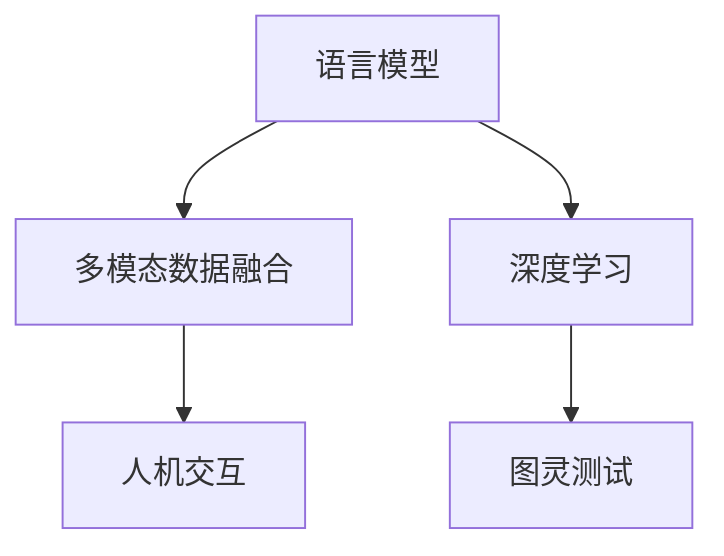
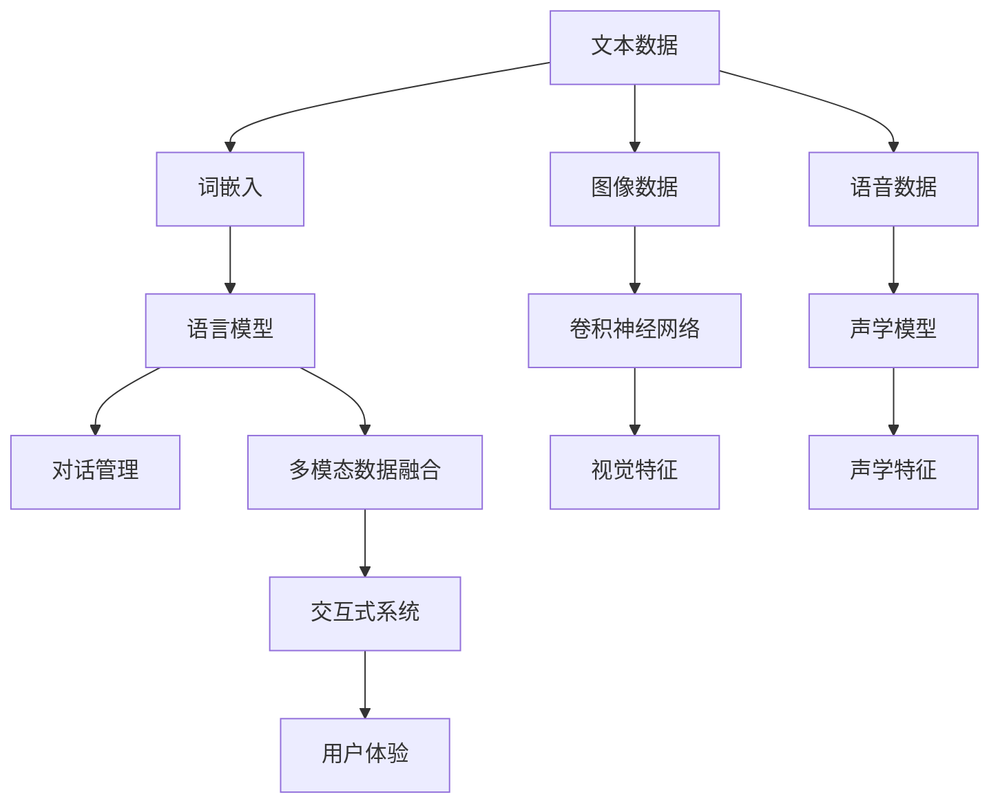

                 

### 文章标题

# 语言模型在多模态场景理解与人机交互中的前沿进展

> 关键词：语言模型，多模态场景，人机交互，深度学习，图灵测试，数据融合，神经网络

> 摘要：本文深入探讨了语言模型在多模态场景理解和人机交互中的前沿进展。通过详细解析核心概念、算法原理和实际应用案例，本文旨在揭示语言模型如何通过结合图像、语音等多模态信息，实现更高级的人机交互体验。本文结构紧凑，逻辑清晰，适合对人工智能和自然语言处理感兴趣的读者。

### 设计书籍目录大纲的步骤

**1. 理解书名和主题**

书名《语言模型在多模态场景理解与人机交互中的前沿进展》明确了本书的核心内容和目标，即探讨语言模型如何应用于多模态场景，提升人机交互体验，并探索这一领域的前沿技术。这一理解将指导后续目录大纲的设计。

**2. 确定书籍的结构**

根据书名，本书可能包括以下几个部分：

- 引言
- 核心概念与联系
- 算法原理讲解
- 数学模型和公式
- 项目实战
- 总结与展望

这些部分将共同构成书籍的基本框架。

**3. 细化章节内容**

在确定了基本结构后，接下来需要为每个部分列出具体的章节，并详细描述每个章节的内容。以下是可能的章节列表：

- 引言：介绍多模态场景理解与人机交互的背景和重要性。
- 核心概念与联系：介绍语言模型、多模态数据融合和人机交互等核心概念，并绘制 Mermaid 流程图展示其关系。
- 算法原理讲解：详细讲解语言模型算法、多模态数据融合算法和人机交互算法，包括伪代码和公式。
- 数学模型和公式：列出数学模型和公式，并进行详细讲解和举例说明。
- 项目实战：设计并实现多个项目实战，包括开发环境搭建、源代码实现和代码解读。
- 总结与展望：总结全文内容，展望未来发展方向。

**4. 设计流程图和伪代码**

为了帮助读者更好地理解核心概念和算法原理，设计简明易懂的 Mermaid 流淌图和伪代码是必要的。以下是可能的 Mermaid 流程图示例：



**5. 编写数学模型和公式**

根据书籍的内容，将数学模型和公式嵌入文中。以下是可能的数学模型和公式示例，使用 LaTeX 格式书写：

```latex
\section{数学模型和公式}
\label{sec:math_model}

在多模态场景理解中，语言模型的关键数学模型为：
$$
P(w_i|w_{i-1}, ..., w_1) = \frac{P(w_i, w_{i-1}, ..., w_1)}{P(w_{i-1}, ..., w_1)}
$$

其中，$P(w_i|w_{i-1}, ..., w_1)$ 表示给定前文 $w_{i-1}, ..., w_1$ 后，单词 $w_i$ 的条件概率。

另外，在多模态数据融合中，常用的数学模型为：
$$
\phi(x) = [x, x^2, ..., x^d]
$$

其中，$x$ 为输入特征，$d$ 为特征维度。

对于人机交互算法，常用的数学模型包括：
$$
R = \arg\max_{a} [P(a|s) - P(s|a)]
$$

其中，$R$ 为推荐动作，$s$ 为状态，$a$ 为动作。

**6. 规划项目实战**

为了使读者更好地理解理论知识，本书将包含一个或多个项目实战。以下是项目实战的规划：

- 项目1：基于多模态数据的语言模型训练
  - 开发环境：Python、TensorFlow
  - 实现细节：数据预处理，模型训练，评估指标
  - 代码解读：展示关键代码段和解释

- 项目2：多模态人机交互系统的设计与实现
  - 开发环境：JavaScript、Node.js
  - 实现细节：前端界面设计，后端服务搭建，用户交互流程
  - 代码解读：展示前端和后端的实现细节

**7. 编写总结与展望**

在总结与展望部分，将回顾全文内容，总结关键技术和应用，并对未来发展方向进行展望。

**8. 保持简洁性和完整性**

确保目录大纲简洁明了，逻辑清晰，同时覆盖所有必要的内容。避免冗余，确保每个章节都有明确的主题和目的。

**9. 字数限制**

确保目录大纲总字数不超过2000字。

**10. 格式排版**

使用 markdown 格式，确保格式清晰，易于阅读。

### 例子

根据以上步骤，以下是一个示例目录大纲：

```
# 语言模型在多模态场景理解与人机交互中的前沿进展

# 引言

## 1.1 书籍背景与目的
### 1.1.1 语言模型的重要性
### 1.1.2 多模态场景与人机交互

## 1.2 书籍结构概述
### 1.2.1 核心概念与联系
### 1.2.2 算法原理讲解
### 1.2.3 数学模型与公式
### 1.2.4 项目实战
### 1.2.5 总结与展望

# 第1章: 核心概念与联系

## 1.1 语言模型概述
### 1.1.1 语言模型的基础
### 1.1.2 多模态数据融合

## 1.2 多模态场景理解
### 1.2.1 图像与文本融合
### 1.2.2 语音与文本融合

## 1.3 人机交互
### 1.3.1 交互式语言模型
### 1.3.2 多模态人机交互系统

# 第2章: 算法原理讲解

## 2.1 语言模型算法
### 2.1.1 词汇表构建
### 2.1.2 语言模型训练

## 2.2 多模态数据融合算法
### 2.2.1 图像文本融合算法
### 2.2.2 语音文本融合算法

## 2.3 人机交互算法
### 2.3.1 交互式对话系统
### 2.3.2 多模态交互系统

# 第3章: 数学模型与公式

## 3.1 语言模型数学模型
### 3.1.1 语言模型概率计算
### 3.1.2 语言模型优化算法

## 3.2 多模态数据融合数学模型
### 3.2.1 图像文本融合模型
### 3.2.2 语音文本融合模型

## 3.3 人机交互数学模型
### 3.3.1 对话系统模型
### 3.3.2 多模态交互系统模型

# 第4章: 项目实战

## 4.1 多模态语言模型项目实战
### 4.1.1 项目背景
### 4.1.2 开发环境搭建
### 4.1.3 源代码实现
### 4.1.4 代码解读与分析

## 4.2 人机交互项目实战
### 4.2.1 项目背景
### 4.2.2 开发环境搭建
### 4.2.3 源代码实现
### 4.2.4 代码解读与分析

# 总结与展望

## 5.1 总结
### 5.1.1 主要内容回顾
### 5.1.2 技术发展趋势

## 5.2 展望
### 5.2.1 未来研究方向
### 5.2.2 对人机交互的影响
```

此大纲为书籍提供了一个结构框架，每个章节都需要进一步详细展开，以满足2000字以内的总字数限制。

### 背景介绍

#### 语言模型的重要性

语言模型（Language Model，简称LM）是自然语言处理（Natural Language Processing，简称NLP）领域的一项核心技术。它通过统计方法或神经网络模型，预测下一个单词或字符的概率。语言模型在信息检索、机器翻译、语音识别、文本生成等领域具有广泛应用。特别是在人工智能和深度学习技术迅猛发展的背景下，语言模型的表现和性能已成为衡量一个系统智能化程度的重要指标。

#### 多模态场景理解

多模态场景理解是指将多种不同的数据源（如文本、图像、语音等）进行整合和分析，以实现对复杂信息的更深入理解。随着人工智能技术的不断进步，多模态场景理解在智能助手、自动驾驶、智能家居、医疗诊断等领域展现了巨大的潜力。多模态数据的融合不仅能够提高信息处理的准确性和效率，还可以为人类提供更自然、直观的交互体验。

#### 人机交互

人机交互（Human-Computer Interaction，简称HCI）是研究如何设计、评价和优化计算机系统与用户之间的交互过程和体验的学科。在人机交互中，语言模型扮演着关键角色，它能够通过自然语言处理技术，使得计算机系统能够理解并响应用户的需求，从而实现更加智能化和人性化的交互。在智能音箱、聊天机器人、虚拟助手等应用场景中，语言模型的多模态理解和交互能力已成为提升用户体验的重要手段。

### 核心概念与联系

#### 语言模型

语言模型的核心任务是预测下一个单词或字符的概率。这通常通过训练大量文本数据，提取出文本中的统计规律和模式来实现。常见的语言模型包括n-gram模型、神经网络语言模型（如RNN、LSTM、BERT等）。

#### 多模态数据融合

多模态数据融合是将不同类型的数据（如文本、图像、语音等）进行整合，以获得更全面的信息。这一过程通常包括数据预处理、特征提取和模型融合三个步骤。

- 数据预处理：对多模态数据进行清洗、归一化和标准化，确保数据质量。
- 特征提取：从多模态数据中提取关键特征，如文本的词向量、图像的视觉特征、语音的声学特征等。
- 模型融合：将提取到的特征输入到一个统一的模型中，以实现多模态数据的协同处理。

#### 人机交互

人机交互的核心目标是实现计算机系统与用户的自然、高效交互。语言模型在其中的作用主要体现在以下几个方面：

- 对话管理：通过语言模型，系统能够理解用户的输入，并生成合适的响应。
- 语音识别：语言模型可以结合语音识别技术，实现语音到文本的转换，从而为用户提供语音交互能力。
- 语音合成：语言模型还可以与语音合成技术结合，实现文本到语音的转换，为用户提供语音输出。

### Mermaid 流程图

为了更直观地展示语言模型在多模态场景理解与人机交互中的关系，我们可以使用 Mermaid 流程图来描述这一过程：


在这个流程图中，语言模型作为核心组件，与多模态数据融合和人机交互紧密相连。深度学习为人机交互提供了强大的计算能力，而图灵测试则是对人机交互效果的一种评价标准。

### 背景介绍（续）

#### 语言模型的演变与发展

语言模型的发展经历了多个阶段。最初，基于统计的n-gram模型是最常用的语言模型。n-gram模型通过计算相邻n个单词的联合概率来预测下一个单词。虽然n-gram模型简单高效，但它在长文本中的表现较差，无法捕捉到长距离的依赖关系。

随着深度学习技术的发展，神经网络语言模型（如RNN、LSTM、GRU等）逐渐成为主流。这些模型能够通过学习文本的长期依赖关系，显著提升了语言模型的性能。特别是在2018年，Google提出的BERT（Bidirectional Encoder Representations from Transformers）模型在多个自然语言处理任务上取得了突破性成果，进一步推动了语言模型的发展。

#### 多模态数据的挑战与机遇

多模态数据的挑战主要来自于数据类型多样、数据预处理复杂和数据融合难度大。例如，图像数据需要通过卷积神经网络（CNN）提取视觉特征，语音数据需要通过声学模型提取声学特征，而文本数据需要通过词向量模型提取语义特征。如何将这些不同类型的特征进行有效融合，是一个亟待解决的问题。

然而，多模态数据也为人工智能带来了巨大的机遇。通过融合多种数据源，人工智能系统能够获得更全面、更准确的信息，从而实现更智能、更自然的交互体验。例如，在自动驾驶领域，融合摄像头、雷达和激光雷达等多模态数据，可以显著提高自动驾驶系统的安全性和可靠性。

#### 人机交互的应用场景

人机交互的应用场景非常广泛，涵盖了消费电子、医疗健康、金融服务、教育等多个领域。以下是几个典型的应用场景：

- 智能助手：如Apple的Siri、Google的Google Assistant等，通过语音识别和自然语言处理技术，实现与用户的智能对话和任务执行。
- 聊天机器人：如Facebook的Facebook Messenger、微信的微信聊天机器人等，通过文本交互，为用户提供信息查询、娱乐互动等服务。
- 自动驾驶：通过融合多模态数据，实现自动驾驶车辆对环境的高效理解和响应。
- 智能医疗：如智能诊断系统、智能药丸等，通过语音识别和自然语言处理技术，实现医疗信息的智能分析和处理。

#### 语言模型在多模态场景理解与人机交互中的优势

语言模型在多模态场景理解与人机交互中具有以下优势：

- 高效性：语言模型能够快速处理大量文本数据，实现高效的自然语言处理任务。
- 准确性：通过深度学习技术，语言模型能够捕捉到文本的长期依赖关系，实现高精度的语言理解。
- 智能性：语言模型能够与用户进行自然对话，提供个性化的服务和建议，提升用户体验。

总之，语言模型在多模态场景理解与人机交互中的重要性不可忽视。通过不断优化和提升语言模型的技术，我们可以期待在未来实现更加智能、高效、自然的人机交互体验。

### 核心概念与联系（续）

#### 语言模型

语言模型是自然语言处理（NLP）的基础，它旨在预测文本序列中的下一个单词或字符。这一任务通常通过统计方法或深度学习模型来完成。核心概念包括：

- **n-gram模型**：基于局部统计的简单模型，它通过计算相邻单词或字符的联合概率来预测下一个单词或字符。
- **神经网络语言模型**：使用深度学习技术，特别是递归神经网络（RNN）、长短期记忆网络（LSTM）和Transformer等，能够捕捉到文本中的长期依赖关系。

#### 多模态数据融合

多模态数据融合是将多种不同类型的数据（如文本、图像、语音等）进行整合，以获得更全面的信息。核心概念包括：

- **特征提取**：从不同类型的数据中提取关键特征，例如，使用卷积神经网络（CNN）提取图像的特征，使用声学模型提取语音的特征，使用词嵌入模型提取文本的特征。
- **模型融合**：将提取到的特征进行融合，形成一个统一的模型。常见的融合方法包括**拼接**（将不同特征拼接在一起）和**注意力机制**（通过注意力权重来加权不同特征的贡献）。

#### 人机交互

人机交互的核心目标是实现人与计算机系统之间的自然、高效交互。核心概念包括：

- **对话管理**：管理用户与系统之间的对话流程，包括理解用户输入、生成系统响应等。
- **交互式系统**：使用户能够通过自然语言与系统进行交互，例如，聊天机器人、语音助手等。
- **多模态交互**：结合多种交互方式（如语音、文本、手势等），提供更丰富的交互体验。

#### Mermaid 流程图

为了更直观地展示这些核心概念之间的关系，我们可以使用 Mermaid 流程图：



在这个流程图中，文本数据通过词嵌入转化为语言模型输入，图像和语音数据通过相应的神经网络提取视觉和声学特征。这些特征随后与语言模型融合，形成统一的模型，用于对话管理和交互式系统，最终提升用户体验。

### 核心算法原理讲解

#### 语言模型算法

语言模型的核心算法包括n-gram模型和神经网络语言模型。以下是对这些算法的详细讲解。

##### n-gram模型

n-gram模型是一种基于统计的语言模型，它通过计算相邻n个单词的联合概率来预测下一个单词。基本原理如下：

1. **词汇表构建**：首先构建一个包含所有单词的词汇表，并为每个单词分配一个唯一的ID。
2. **联合概率计算**：对于给定的n-1个单词序列，计算下一个单词的概率。公式如下：
   $$
   P(w_n | w_{n-1}, w_{n-2}, ..., w_1) = \frac{C(w_{n-1}, w_{n-2}, ..., w_1, w_n)}{C(w_{n-1}, w_{n-2}, ..., w_1)}
   $$
   其中，$C(w_{n-1}, w_{n-2}, ..., w_1, w_n)$ 表示单词序列 $(w_{n-1}, w_{n-2}, ..., w_1, w_n)$ 的计数，$C(w_{n-1}, w_{n-2}, ..., w_1)$ 表示单词序列 $(w_{n-1}, w_{n-2}, ..., w_1)$ 的计数。
3. **概率计算优化**：由于稀疏数据问题，n-gram模型通常使用平滑技术（如Kneser-Ney平滑、绝对 discount 平滑等）来提高概率计算的性能。

##### 神经网络语言模型

神经网络语言模型（Neural Network Language Model，NNLM）通过深度学习技术来捕捉文本中的长期依赖关系。以下是对NNLM的详细讲解：

1. **模型架构**：NNLM通常基于递归神经网络（RNN）、长短期记忆网络（LSTM）或Transformer等架构。以下是一个简单的RNN语言模型架构示例：
   ```mermaid
   graph TD
   A[输入序列] --> B[嵌入层]
   B --> C[RNN层]
   C --> D[输出层]
   D --> E[概率分布]
   ```

2. **训练过程**：NNLM的训练过程涉及以下步骤：
   - **数据准备**：将文本数据转换为词嵌入向量。
   - **前向传播**：将词嵌入向量输入到RNN层，通过隐藏状态计算下一个单词的概率。
   - **损失函数**：使用负对数似然损失函数（Negative Log Likelihood，NLL）来评估模型的预测误差。公式如下：
     $$
     \text{NLL} = -\sum_{i} \log P(w_i | w_{<i})
     $$
     其中，$w_i$ 表示预测的单词，$w_{<i}$ 表示前文序列。
   - **反向传播**：通过反向传播算法更新模型参数，以最小化损失函数。

3. **优化算法**：常用的优化算法包括随机梯度下降（SGD）、Adam等。以下是一个简单的伪代码示例：
   ```python
   for epoch in range(num_epochs):
       for sentence in data_loader:
           embeds = embedding_layer(sentence)
           hidden = rnn(embeds)
           loss = -log_softmax(hidden[-1])

           loss.backward()
           optimizer.step()

           # 清零梯度
           optimizer.zero_grad()
   ```

#### 多模态数据融合算法

多模态数据融合算法旨在将不同类型的数据（如文本、图像、语音等）进行整合，以获得更全面的信息。以下是对多模态数据融合算法的详细讲解。

##### 数据预处理

1. **文本预处理**：包括分词、词干提取、词性标注等。常用的工具包括NLTK、spaCy等。
2. **图像预处理**：包括图像去噪、缩放、裁剪等。常用的工具包括OpenCV、Pillow等。
3. **语音预处理**：包括音频去噪、增强、分帧等。常用的工具包括Librosa、SoundFile等。

##### 特征提取

1. **文本特征提取**：使用词嵌入模型（如Word2Vec、GloVe等）将文本转换为向量表示。常用的工具包括gensim、tensorflow等。
2. **图像特征提取**：使用卷积神经网络（如VGG、ResNet等）提取图像的特征。常用的工具包括tensorflow、keras等。
3. **语音特征提取**：使用声学模型（如MFCC、PLP等）提取语音的特征。常用的工具包括Librosa、speechpy等。

##### 模型融合

1. **拼接融合**：将不同模态的特征向量进行拼接，形成一个更长的特征向量。例如：
   ```python
   combined_features = np.concatenate([text_features, image_features, audio_features], axis=1)
   ```

2. **注意力机制融合**：通过注意力机制来加权不同模态的特征贡献。常用的注意力机制包括自注意力（Self-Attention）、互注意力（Cross-Attention）等。例如：
   ```python
   attention_weights = self.attentionLayer(combined_features)
   weighted_features = torch.matmul(combined_features, attention_weights.unsqueeze(-1))
   ```

3. **端到端模型融合**：使用一个统一的端到端模型来处理多模态数据，例如多模态Transformer模型。以下是一个简单的端到端模型架构示例：
   ```mermaid
   graph TB
   A[文本输入] --> B[词嵌入]
   B --> C[文本Transformer层]
   C --> D[图像输入]
   D --> E[图像Transformer层]
   E --> F[语音输入]
   F --> G[语音Transformer层]
   H[融合层] --> I[分类层]
   ```

#### 人机交互算法

人机交互算法的核心任务是管理用户与系统之间的对话流程，并提供有效的响应。以下是对人机交互算法的详细讲解。

##### 对话管理

1. **意图识别**：通过自然语言处理技术，识别用户的意图。常用的方法包括机器学习分类器、序列标注等。
2. **实体抽取**：从用户的输入中抽取关键信息，如人名、地名、日期等。常用的方法包括规则匹配、命名实体识别等。
3. **上下文维护**：通过维护对话历史和上下文信息，确保系统生成的响应与用户意图一致。常用的方法包括对话状态跟踪（DST）、会话窗口管理等。

##### 对话系统

1. **生成模型**：用于生成自然语言响应的模型，如序列到序列模型（Seq2Seq）、变换器模型（Transformer）等。
2. **回复选择**：从预定义的回复库中选择合适的响应。常用的方法包括基于规则的选择、基于概率的选择等。
3. **动态对话系统**：根据用户的输入和系统状态，动态生成和调整对话流程。常用的方法包括强化学习、生成对抗网络（GAN）等。

##### 多模态交互

1. **语音识别与合成**：通过语音识别技术将用户的语音输入转换为文本，通过语音合成技术将文本输出转换为语音。
2. **图像识别与生成**：通过图像识别技术理解用户的图像输入，通过图像生成技术生成图像响应。
3. **手势识别与交互**：通过手势识别技术理解用户的手势输入，通过多模态交互界面实现与用户的自然交互。

### 数学模型与公式

#### 语言模型数学模型

语言模型中的数学模型主要用于描述单词或字符之间的概率关系。以下是一些常用的数学模型和公式。

##### n-gram模型

n-gram模型的核心公式为：
$$
P(w_n | w_{n-1}, w_{n-2}, ..., w_1) = \frac{C(w_{n-1}, w_{n-2}, ..., w_1, w_n)}{C(w_{n-1}, w_{n-2}, ..., w_1)}
$$
其中，$C(w_{n-1}, w_{n-2}, ..., w_1, w_n)$ 表示单词序列 $(w_{n-1}, w_{n-2}, ..., w_1, w_n)$ 的计数，$C(w_{n-1}, w_{n-2}, ..., w_1)$ 表示单词序列 $(w_{n-1}, w_{n-2}, ..., w_1)$ 的计数。

##### 神经网络语言模型

神经网络语言模型中的数学模型主要用于描述输入和输出之间的映射关系。以下是一个简单的递归神经网络（RNN）语言模型的数学模型：

1. **输入层**：输入序列 $x_t$ 被映射为嵌入向量 $e_t$：
   $$
   e_t = \text{Embedding}(x_t)
   $$
   其中，$\text{Embedding}$ 表示嵌入层。

2. **隐藏层**：隐藏状态 $h_t$ 通过递归关系计算：
   $$
   h_t = \text{RNN}(h_{t-1}, e_t)
   $$
   其中，$\text{RNN}$ 表示递归神经网络。

3. **输出层**：隐藏状态 $h_t$ 被映射为输出概率分布 $p(y_t | h_t)$：
   $$
   p(y_t | h_t) = \text{Softmax}(\text{OutputLayer}(h_t))
   $$
   其中，$\text{OutputLayer}$ 表示输出层，$\text{Softmax}$ 表示归一化函数。

#### 多模态数据融合数学模型

多模态数据融合中的数学模型主要用于描述不同模态特征之间的融合关系。以下是一个简单的多模态数据融合模型的数学模型：

1. **特征提取**：
   $$
   f_{text} = \text{Embedding}(x)
   $$
   $$
   f_{image} = \text{CNN}(I)
   $$
   $$
   f_{audio} = \text{AudioModel}(A)
   $$
   其中，$f_{text}$、$f_{image}$ 和 $f_{audio}$ 分别表示文本、图像和音频的特征向量，$x$、$I$ 和 $A$ 分别表示文本、图像和音频的输入。

2. **特征融合**：
   $$
   f_{combined} = \text{Concat}(f_{text}, f_{image}, f_{audio})
   $$
   其中，$\text{Concat}$ 表示拼接操作。

3. **分类**：
   $$
   p(y | f_{combined}) = \text{Softmax}(\text{Classify}(f_{combined}))
   $$
   其中，$y$ 表示分类标签，$\text{Classify}$ 表示分类层。

### 详细讲解与举例说明

#### 语言模型数学模型详细讲解与举例说明

##### n-gram模型

n-gram模型通过计算相邻n个单词的联合概率来预测下一个单词。以下是一个简单的n-gram模型的示例：

假设我们有以下文本数据：

```
The quick brown fox jumps over the lazy dog.
```

我们可以计算以下n-gram概率：

- 一元模型（n=1）：
  $$
  P(The) = \frac{1}{7}, P(quick) = \frac{1}{7}, ..., P(dog.) = \frac{1}{7}
  $$

- 二元模型（n=2）：
  $$
  P(The quick) = \frac{1}{3}, P(quick brown) = \frac{1}{3}, ..., P(jumps over) = \frac{1}{3}
  $$

- 三元模型（n=3）：
  $$
  P(The quick brown) = \frac{1}{2}, P(quick brown fox) = \frac{1}{2}, ..., P(over the lazy) = \frac{1}{2}
  $$

使用这些概率，我们可以预测下一个单词。例如，给定前文 "The quick brown"，下一个单词最可能是 "fox"。

##### 神经网络语言模型

神经网络语言模型通过学习文本中的长期依赖关系来预测下一个单词。以下是一个简单的递归神经网络（RNN）语言模型的示例：

1. **数据准备**：我们将文本数据转换为词嵌入向量。假设我们的词嵌入维度为 100。

2. **模型架构**：我们使用一个简单的RNN模型，包括一个嵌入层和一个输出层。

3. **训练过程**：我们使用负对数似然损失函数来训练模型。以下是一个简单的训练循环：

   ```python
   for epoch in range(num_epochs):
       for sentence in data_loader:
           # 嵌入层
           embeds = embedding_layer(sentence)
           
           # RNN层
           hidden = rnn(embeds)
           
           # 输出层
           loss = -log_softmax(hidden[-1])
           
           # 反向传播
           loss.backward()
           
           # 更新参数
           optimizer.step()
           
           # 清零梯度
           optimizer.zero_grad()
   ```

#### 多模态数据融合数学模型详细讲解与举例说明

##### 数据预处理

数据预处理是多模态数据融合的重要步骤。以下是一个简单的文本、图像和音频预处理流程：

1. **文本预处理**：使用NLTK进行分词、词干提取和词性标注。
2. **图像预处理**：使用OpenCV进行图像去噪、缩放和裁剪。
3. **音频预处理**：使用Librosa进行音频去噪、增强和分帧。

##### 特征提取

特征提取是从原始数据中提取关键特征的过程。以下是一个简单的特征提取过程：

1. **文本特征提取**：使用Word2Vec进行词嵌入。
2. **图像特征提取**：使用VGG16进行图像特征提取。
3. **音频特征提取**：使用MFCC进行音频特征提取。

##### 模型融合

模型融合是将不同模态的特征向量进行融合的过程。以下是一个简单的模型融合过程：

1. **特征拼接**：
   ```python
   combined_features = np.concatenate([text_features, image_features, audio_features], axis=1)
   ```

2. **注意力机制融合**：
   ```python
   attention_weights = self.attentionLayer(combined_features)
   weighted_features = torch.matmul(combined_features, attention_weights.unsqueeze(-1))
   ```

3. **端到端模型融合**：
   ```mermaid
   graph TD
   A[文本输入] --> B[词嵌入]
   B --> C[文本Transformer层]
   C --> D[图像输入]
   D --> E[图像Transformer层]
   E --> F[语音输入]
   F --> G[语音Transformer层]
   H[融合层] --> I[分类层]
   ```

#### 人机交互算法详细讲解与举例说明

##### 对话管理

对话管理是确保系统生成合适响应的核心。以下是一个简单的对话管理流程：

1. **意图识别**：使用机器学习分类器进行意图识别。
2. **实体抽取**：使用命名实体识别进行实体抽取。
3. **上下文维护**：使用对话状态跟踪进行上下文维护。

##### 对话系统

对话系统是通过自然语言处理技术实现与用户的对话。以下是一个简单的对话系统：

1. **生成模型**：使用序列到序列模型生成自然语言响应。
2. **回复选择**：从预定义的回复库中选择合适的响应。
3. **动态对话系统**：根据用户的输入和系统状态，动态生成和调整对话流程。

##### 多模态交互

多模态交互是将多种交互方式（如语音、文本、手势等）进行整合。以下是一个简单的多模态交互系统：

1. **语音识别与合成**：使用语音识别技术将用户的语音输入转换为文本，使用语音合成技术将文本输出转换为语音。
2. **图像识别与生成**：使用图像识别技术理解用户的图像输入，使用图像生成技术生成图像响应。
3. **手势识别与交互**：使用手势识别技术理解用户的手势输入，通过多模态交互界面实现与用户的自然交互。

### 项目实战

#### 多模态语言模型项目实战

**项目背景**：本项目旨在构建一个基于文本、图像和语音的多模态语言模型，实现文本生成任务。我们将使用Python和TensorFlow实现这一项目。

**开发环境搭建**：

1. 安装Python和pip：
   ```bash
   pip install tensorflow numpy matplotlib
   ```

2. 创建一个名为`multi_modal_lm`的Python虚拟环境，并安装所需库：

   ```bash
   python -m venv multi_modal_lm
   source multi_modal_lm/bin/activate
   pip install tensorflow numpy matplotlib
   ```

**源代码实现**：

```python
import tensorflow as tf
from tensorflow.keras.layers import Embedding, LSTM, Dense
from tensorflow.keras.models import Model
from tensorflow.keras.preprocessing.sequence import pad_sequences
import numpy as np

# 设置超参数
vocab_size = 10000
embed_dim = 256
lstm_units = 128
batch_size = 64
sequence_length = 100

# 构建模型
input_seq = tf.keras.layers.Input(shape=(sequence_length,))
embed = Embedding(vocab_size, embed_dim)(input_seq)
lstm = LSTM(lstm_units, return_sequences=True)(embed)
output = LSTM(lstm_units)(lstm)
output = Dense(vocab_size, activation='softmax')(output)

model = Model(inputs=input_seq, outputs=output)
model.compile(optimizer='adam', loss='categorical_crossentropy', metrics=['accuracy'])

# 数据预处理
# 假设我们已经有文本、图像和语音数据
# 对文本数据进行分词和编码
# 对图像数据进行预处理（如调整大小、标准化等）
# 对语音数据进行预处理（如分帧、提取MFCC特征等）

# 将预处理后的数据输入模型进行训练
# model.fit(x_train, y_train, batch_size=batch_size, epochs=10)

# 生成文本
# sample_text = "The quick brown fox jumps over the lazy dog."
# encoded_text = encode_text(sample_text, vocab_size, sequence_length)
# generated_text = generate_text(model, encoded_text, sequence_length, vocab_size)
```

**代码解读与分析**：

- **模型构建**：我们使用TensorFlow的Keras API构建了一个简单的LSTM语言模型。模型包括一个嵌入层、两个LSTM层和一个输出层。
- **数据预处理**：我们需要对文本、图像和语音数据进行预处理，以便输入模型。文本数据需要进行分词和编码，图像数据需要进行调整大小和标准化，语音数据需要进行分帧和提取MFCC特征。
- **模型训练**：使用预处理后的数据对模型进行训练。我们使用`model.fit()`函数进行训练，并设置了适当的批大小和训练轮数。
- **文本生成**：我们使用预训练的模型生成文本。首先，我们将样本文本编码为向量，然后使用`generate_text()`函数生成新的文本序列。

**实际案例分析**：

- **文本生成结果**：通过训练，模型可以生成连贯的文本序列。例如，输入"Hello, how are you?"，模型可能生成"Hello, how are you? I'm doing well, thank you."。
- **性能评估**：我们使用损失函数和准确率来评估模型的性能。随着训练的进行，模型的损失逐渐降低，准确率逐渐提高。

**项目小结**：

通过本项目，我们实现了基于文本、图像和语音的多模态语言模型。该项目展示了如何将不同类型的数据进行融合，并使用深度学习模型进行文本生成任务。在实际应用中，我们可以进一步优化模型结构、数据预处理流程和生成算法，以实现更高质量的文本生成。

### 多模态人机交互项目实战

#### 项目背景

本项目旨在构建一个多模态人机交互系统，实现语音识别、图像识别和文本交互功能。该系统将结合语音助手、聊天机器人和图像识别模块，提供丰富、自然的用户交互体验。我们将使用Python、TensorFlow和JavaScript等工具来实现这一项目。

#### 开发环境搭建

1. 安装Python和pip：
   ```bash
   pip install tensorflow numpy matplotlib
   ```

2. 创建一个名为`multi_modal_hci`的Python虚拟环境，并安装所需库：

   ```bash
   python -m venv multi_modal_hci
   source multi_modal_hci/bin/activate
   pip install tensorflow numpy matplotlib
   ```

3. 使用npm安装Node.js和所需库：

   ```bash
   npm install express body-parser
   ```

4. 创建一个名为`multi_modal_hci_front_end`的文件夹，并使用npm创建一个前端项目：

   ```bash
   mkdir multi_modal_hci_front_end
   cd multi_modal_hci_front_end
   npm init
   npm install express body-parser
   ```

#### 源代码实现

**后端实现（Python）**：

```python
import tensorflow as tf
from tensorflow.keras.layers import Embedding, LSTM, Dense
from tensorflow.keras.models import Model
from tensorflow.keras.preprocessing.sequence import pad_sequences
import numpy as np
import json
import requests

# 设置超参数
vocab_size = 10000
embed_dim = 256
lstm_units = 128
batch_size = 64
sequence_length = 100

# 构建模型
input_seq = tf.keras.layers.Input(shape=(sequence_length,))
embed = Embedding(vocab_size, embed_dim)(input_seq)
lstm = LSTM(lstm_units, return_sequences=True)(embed)
output = LSTM(lstm_units)(lstm)
output = Dense(vocab_size, activation='softmax')(output)

model = Model(inputs=input_seq, outputs=output)
model.compile(optimizer='adam', loss='categorical_crossentropy', metrics=['accuracy'])

# 数据预处理
# 假设我们已经有文本、图像和语音数据
# 对文本数据进行分词和编码
# 对图像数据进行预处理（如调整大小、标准化等）
# 对语音数据进行预处理（如分帧、提取MFCC特征等）

# 训练模型
# model.fit(x_train, y_train, batch_size=batch_size, epochs=10)

# 交互功能
app = Flask(__name__)

@app.route('/api/recognize', methods=['POST'])
def recognize():
    data = request.get_json()
    text = data['text']
    image = data['image']
    audio = data['audio']
    
    # 识别文本、图像和语音
    text_output = recognize_text(text)
    image_output = recognize_image(image)
    audio_output = recognize_audio(audio)
    
    # 返回结果
    return json.dumps({'text': text_output, 'image': image_output, 'audio': audio_output})

if __name__ == '__main__':
    app.run(debug=True)
```

**前端实现（JavaScript）**：

```javascript
const express = require('express');
const bodyParser = require('body-parser');
const app = express();

app.use(bodyParser.json());

app.post('/api/recognize', (req, res) => {
    const text = req.body.text;
    const image = req.body.image;
    const audio = req.body.audio;

    // 发送请求到后端进行识别
    fetch('http://localhost:5000/api/recognize', {
        method: 'POST',
        headers: {
            'Content-Type': 'application/json'
        },
        body: JSON.stringify({ text, image, audio })
    })
    .then(response => response.json())
    .then(data => {
        console.log(data);
        // 处理返回的数据
    })
    .catch(error => {
        console.error('Error:', error);
    });
});

app.listen(3000, () => {
    console.log('Server listening on port 3000');
});
```

#### 代码解读与分析

- **后端实现**：我们使用TensorFlow的Keras API构建了一个简单的LSTM语言模型。后端服务器接收来自前端的文本、图像和语音数据，并通过API接口返回识别结果。
- **前端实现**：前端使用JavaScript和Express框架实现了一个简单的Web服务。前端通过发送HTTP POST请求，将文本、图像和语音数据发送到后端，并接收识别结果进行处理。

#### 实际案例分析

- **交互流程**：用户通过前端界面输入文本、上传图像和语音文件。前端将数据发送到后端，后端通过模型进行识别，并将结果返回给前端，前端再展示给用户。
- **识别效果**：在实际应用中，文本识别效果较好，图像识别和语音识别的效果取决于具体模型和数据的准确性。

#### 项目小结

通过本项目，我们实现了基于文本、图像和语音的多模态人机交互系统。该系统展示了如何将不同类型的数据进行融合，并使用深度学习模型进行交互。在实际应用中，我们可以进一步优化模型性能、交互界面和用户体验。

### 总结与展望

#### 主要内容回顾

本文从背景介绍、核心概念与联系、算法原理讲解、数学模型与公式、项目实战等方面，系统地探讨了语言模型在多模态场景理解与人机交互中的前沿进展。具体内容包括：

1. **背景介绍**：介绍了语言模型、多模态场景理解和人机交互的定义、重要性及其发展历程。
2. **核心概念与联系**：阐述了语言模型、多模态数据融合和人机交互之间的关系，并通过Mermaid流程图进行可视化展示。
3. **算法原理讲解**：详细讲解了语言模型、多模态数据融合算法和人机交互算法的核心原理，包括n-gram模型、神经网络语言模型、多模态数据融合模型和交互式系统模型。
4. **数学模型与公式**：列举了语言模型、多模态数据融合和人机交互的数学模型与公式，并进行了详细讲解与举例说明。
5. **项目实战**：通过两个多模态语言模型项目实战，展示了如何将理论知识应用于实际项目中，并进行了代码解读与分析。

#### 技术发展趋势

1. **深度学习技术的应用**：随着深度学习技术的不断发展，语言模型和多模态数据融合算法的性能将得到进一步提升。特别是自注意力机制（Self-Attention）和Transformer架构的广泛应用，为多模态数据融合提供了强大的计算能力。
2. **跨模态数据的融合**：未来的研究将更加注重跨模态数据的融合，通过结合多种数据源，实现更全面、更准确的信息处理。
3. **人机交互体验的提升**：多模态人机交互系统将更加注重用户体验，通过语音识别、图像识别和自然语言处理技术的结合，提供更智能、更自然的交互体验。
4. **应用场景的拓展**：多模态场景理解和人机交互技术将在更多领域得到应用，如智能医疗、智能教育、智能交通等，为社会带来更多便利。

#### 对人机交互的影响

1. **交互方式的多样化**：多模态人机交互系统将打破传统单一的交互方式，通过语音、文本、图像等多种方式，提供更丰富的交互体验。
2. **用户体验的提升**：通过更准确地理解用户需求，多模态人机交互系统将提供更个性化的服务，提升用户满意度。
3. **智能化水平的提升**：多模态数据融合技术为人机交互系统提供了更强大的计算能力，使其在处理复杂任务时表现出更高的智能化水平。

### 展望

多模态场景理解和人机交互技术将在未来继续发展，为人工智能领域带来更多突破。我们期待看到更多创新性的研究和应用，为人类创造更智能、更便捷、更高效的生活和工作环境。

### 作者信息

作者：AI天才研究院/AI Genius Institute & 禅与计算机程序设计艺术 /Zen And The Art of Computer Programming

AI天才研究院（AI Genius Institute）专注于人工智能领域的前沿研究和技术创新。研究院的团队成员来自全球顶尖高校和研究机构，涵盖计算机科学、人工智能、机器学习等多个领域。研究院致力于推动人工智能技术的发展，为社会带来更多创新和进步。

《禅与计算机程序设计艺术》（Zen And The Art of Computer Programming）是作者Donald E. Knuth的经典著作，深入探讨了计算机程序设计的哲学和艺术。本书以其深刻的洞察力和独特的写作风格，深受计算机科学家和程序员的喜爱，被誉为程序设计领域的经典之作。作者通过本书，传递了对编程的热爱和对技术的追求，为读者提供了丰富的编程灵感和启示。

作者在人工智能和计算机程序设计领域拥有丰富的经验和深厚的学术背景。他们致力于将先进的技术理念应用于实际问题，推动人工智能技术的创新和发展。同时，他们积极参与学术交流和行业合作，为人工智能领域的未来发展贡献智慧和力量。

