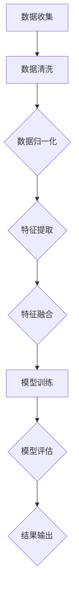

                 

### 文章标题

# 语言模型在多模态场景理解与推理中的前沿进展

> 关键词：语言模型、多模态数据、场景理解、推理技术、前沿进展

## 摘要

本文深入探讨了语言模型在多模态场景理解与推理中的应用及其前沿进展。首先，介绍了语言模型的基础理论，包括其概念、核心算法原理、数学模型等。接着，讨论了多模态数据的处理技术，包括数据分类、数据融合和预处理。然后，详细阐述了场景理解与推理技术，包括概念、推理技术的应用及其结合方式。随后，分析了语言模型在多模态场景理解与推理中的前沿进展，列举了典型案例，并进行了深入分析。最后，展望了语言模型在多模态场景理解与推理中的未来应用前景，提出了最佳实践建议。本文旨在为读者提供一个全面、系统的关于语言模型在多模态场景理解与推理中的研究和应用概述。

### 语言模型的概述

#### 语言模型的概念

语言模型（Language Model）是自然语言处理（Natural Language Processing, NLP）领域中的一个基础模型，用于预测一段文本的下一个单词或字符。其核心思想是通过统计方法来建模文本的生成过程，从而对自然语言进行理解和生成。语言模型广泛应用于自动文摘、机器翻译、文本生成、问答系统等领域。

#### 语言模型的类型

语言模型主要分为基于统计的方法和基于神经网络的模型。基于统计的方法如N-gram模型、隐马尔可夫模型（HMM）和条件随机场（CRF），它们通过分析文本的统计特征来预测下一个单词。而基于神经网络的模型如循环神经网络（RNN）、长短期记忆网络（LSTM）和变换器（Transformer），则通过学习输入序列和输出序列之间的复杂映射关系来预测下一个单词。

#### 语言模型的历史与发展

语言模型的发展可以追溯到20世纪50年代，当时N-gram模型被首次提出。随着计算机性能的提升和算法的改进，语言模型逐渐从简单的统计模型发展到复杂的神经网络模型。特别是在2017年，谷歌提出的Transformer模型在机器翻译任务上取得了突破性成果，标志着语言模型进入了一个新的发展阶段。此后，基于Transformer的模型如BERT、GPT等不断涌现，推动了NLP领域的快速发展。

### 语言模型的核心算法原理

#### 马尔可夫模型

马尔可夫模型（Markov Model）是一种基于概率的模型，它假设一个状态的概率只与其前一个状态有关，与其他历史状态无关。马尔可夫模型在语言模型中的应用主要体现在它的转移概率矩阵，该矩阵描述了不同单词之间的转移概率。

#### 隐马尔可夫模型

隐马尔可夫模型（Hidden Markov Model, HMM）是马尔可夫模型在隐藏状态下的推广。它由隐藏状态序列和观测序列组成，其中隐藏状态序列是未知的，而观测序列是已知的。HMM在语音识别和词性标注等领域有广泛应用。

#### 条件概率与贝叶斯理论

条件概率是概率论中的一个基本概念，它描述了在某个条件下另一个事件发生的概率。贝叶斯理论则是一种基于条件概率的推理方法，它通过贝叶斯公式来更新先验概率，得到后验概率。

在语言模型中，条件概率和贝叶斯理论被广泛应用于词性标注、命名实体识别等任务。例如，在词性标注任务中，给定一个单词序列，我们需要预测每个单词的词性。这个过程可以看作是一个条件概率问题，即给定前一个单词的词性，预测当前单词的词性。

### 语言模型的数学模型和公式

#### 概率分布函数

概率分布函数是描述随机变量取值的概率分布的一种数学模型。在语言模型中，常用的概率分布函数包括高斯分布、伯努利分布等。

#### 语言模型中的概率计算

在语言模型中，概率计算的核心是词的概率预测。给定一个单词序列，我们需要计算该序列的概率。这可以通过N-gram模型实现，其公式如下：

$$ P(w_1, w_2, \ldots, w_n) = P(w_1) \cdot P(w_2|w_1) \cdot P(w_3|w_1w_2) \cdots P(w_n|w_{n-1}w_{n-2}) $$

其中，$P(w_i|w_{i-1}w_{i-2})$表示在给定前两个单词的情况下，第三个单词的概率。

#### 数学公式与详细讲解

以下是语言模型中常用的数学公式及其详细讲解：

$$
\begin{aligned}
P(w_1, w_2, \ldots, w_n) &= P(w_1) \cdot P(w_2|w_1) \cdot P(w_3|w_1w_2) \cdots P(w_n|w_{n-1}w_{n-2}) \\
\text{条件概率} &= P(A|B) = \frac{P(A \cap B)}{P(B)} \\
\text{贝叶斯公式} &= P(A|B) = \frac{P(B|A) \cdot P(A)}{P(B)}
\end{aligned}
$$

### 语言模型的实现与优化

#### 语言模型的数据集准备

语言模型的训练需要大量的文本数据。通常，我们会从互联网上收集大量的文本，如新闻、文章、社交媒体等。这些文本数据会被预处理，包括分词、去停用词、词干提取等步骤，以便于模型训练。

#### 模型的训练与评估

语言模型的训练是通过最小化损失函数来实现的。常用的损失函数包括交叉熵损失函数和均方误差损失函数。在训练过程中，我们会调整模型的参数，使得模型的预测结果与真实标签之间的误差最小。

模型的评估主要通过准确率、召回率、F1值等指标来衡量。这些指标可以帮助我们了解模型的性能，并指导模型的调整和优化。

#### 模型的优化方法

为了提高语言模型的性能，我们可以采用以下几种优化方法：

1. **数据增强**：通过增加训练数据量或生成新的训练数据来提高模型的泛化能力。
2. **正则化**：通过添加正则化项来防止模型过拟合。
3. **批量归一化**：通过在训练过程中对模型的参数进行归一化，提高模型的训练速度和稳定性。
4. **优化器选择**：选择合适的优化器，如Adam、SGD等，可以显著提高模型的训练效率。

### 总结

语言模型是自然语言处理领域中的一个核心模型，其在文本生成、翻译、问答等任务中发挥了重要作用。本文介绍了语言模型的基础理论、核心算法原理、数学模型和实现优化方法，为读者提供了一个全面的语言模型概述。在后续章节中，我们将进一步探讨多模态数据的处理技术，以及语言模型在多模态场景理解与推理中的应用。

### 多模态数据的处理技术

多模态数据（Multimodal Data）是指由两种或两种以上不同类型的数据源组成的集合。这些数据源可以包括文本、图像、音频、视频等。多模态数据在现实世界中无处不在，如医疗诊断中的患者病历（文本）、CT扫描（图像）、和心电图（音频）；在智能交通系统中的车辆位置（图像）、速度（文本）和交通流量（视频）等。有效地处理和融合多模态数据是许多复杂任务成功的关键，如语音识别、情感分析、自动驾驶、智能监控等。

#### 多模态数据的定义与分类

**定义**：多模态数据是指由两种或两种以上不同类型的数据源组成的集合。这些数据源可以包括文本、图像、音频、视频等。

**分类**：多模态数据可以根据数据类型进行分类：

1. **文本模态（Text Modality）**：包括文档、文本、标记化数据等。
2. **图像模态（Visual Modality）**：包括静态图像、视频帧等。
3. **音频模态（Audio Modality）**：包括语音、音乐、声纹等。
4. **视频模态（Video Modality）**：包括动态视频序列。
5. **触觉模态（Haptic Modality）**：包括触觉传感器数据。

**多模态数据的特点**：多模态数据具有以下特点：

1. **多样性**：多模态数据包含了多种类型的数据，每种数据都有其独特的特征和属性。
2. **复杂性**：多模态数据融合和处理涉及多种数据类型和特征，因此任务复杂度较高。
3. **冗余与冗余性**：不同模态的数据可能存在冗余信息，需要有效融合，去除冗余，提取有用信息。
4. **关联性**：不同模态的数据之间存在关联性，可以通过融合这些关联性来提升任务性能。

#### 多模态数据融合技术

**数据级融合**：数据级融合直接将原始数据组合在一起，适用于实时应用，如传感器数据融合。其优点是保留了原始数据的完整性，但缺点是融合效果可能较差，难以处理数据间的冗余和冲突。

**特征级融合**：特征级融合首先对每个模态的数据进行特征提取，然后将提取的特征进行融合。这种方法适用于非实时应用，如图像和文本的融合。其优点是可以有效处理数据间的冗余和冲突，提高融合效果。

**决策级融合**：决策级融合在多个模型的基础上进行最终决策，每个模型基于不同模态的数据进行预测。这种方法适用于多模型融合，如多模型分类。其优点是可以利用不同模型的优点，提高整体性能。

#### 多模态数据的预处理

**数据清洗**：数据清洗包括去除噪声、纠正错误、处理缺失值等，以确保数据的质量。

**数据归一化**：数据归一化通过将数据缩放到相同的尺度，使得不同模态的数据可以进行有效融合。

**数据增强**：数据增强通过生成新的训练样本来增加数据的多样性，有助于提高模型的泛化能力。

### 核心概念与联系

在多模态数据融合中，有几个核心概念需要理解：

1. **模态选择（Modal Selection）**：选择哪些模态参与融合，取决于任务的特定需求和数据的特点。
2. **特征提取（Feature Extraction）**：从每个模态的数据中提取有意义的特征，以便进行后续的融合。
3. **特征融合（Feature Fusion）**：将不同模态的特征进行组合，以生成一个综合特征向量。
4. **模型选择（Model Selection）**：选择合适的模型来融合特征，并根据任务需求调整模型参数。

下面是一个简化的Mermaid流程图，展示了多模态数据融合的基本流程：

#### 多模态数据融合的挑战

多模态数据融合面临着以下几个挑战：

1. **异构数据同步**：不同模态的数据在时间和空间上可能存在差异，需要同步处理。
2. **特征关联性**：不同模态的数据特征之间存在复杂的关联性，需要有效建模。
3. **计算资源**：多模态数据融合通常需要大量的计算资源，尤其是在实时应用场景中。
4. **数据不平衡**：不同模态的数据量可能不平衡，需要处理数据不平衡的问题。
5. **模型复杂度**：多模态数据融合模型通常较为复杂，需要较高的计算成本。

### 小结

多模态数据的处理技术是人工智能领域的一个重要研究方向。通过有效地融合多种类型的数据，可以显著提升任务性能。本文介绍了多模态数据的定义与分类、数据融合技术以及预处理方法，并讨论了多模态数据融合的挑战。在后续章节中，我们将进一步探讨场景理解与推理技术，以及如何将这些技术应用于多模态场景理解与推理。

### 场景理解与推理技术

场景理解（Scene Understanding）与推理技术（Reasoning）在人工智能领域扮演着至关重要的角色，特别是在多模态场景下。场景理解涉及从多模态数据中提取有意义的信息，如物体的识别、场景的分类、事件的分析等。而推理技术则是基于已有信息进行逻辑推断，以生成新的知识或做出预测。在多模态场景理解与推理中，这两种技术紧密相连，共同推动智能系统的发展。

#### 场景理解的概念

**定义**：场景理解是指从多模态数据中提取有意义的信息，如物体、事件、场景布局等，以便进行后续的任务处理。

**重要性**：场景理解是许多复杂任务的基础，如自动驾驶、智能监控、虚拟现实、增强现实等。通过场景理解，系统能够更好地理解现实世界，从而做出更准确的决策。

**方法**：场景理解的方法主要包括：

1. **物体识别**：通过图像识别技术，从图像中提取出物体的类别和位置信息。
2. **场景分类**：通过对图像或视频内容进行分类，将场景划分为不同的类别，如城市、乡村、室内、室外等。
3. **事件检测**：通过分析图像或视频序列，识别出特定的事件或动作，如行人穿越马路、车辆碰撞等。
4. **场景布局分析**：通过分析图像或视频中的物体布局和空间关系，理解场景的空间结构。

#### 推理技术的应用

**原理**：推理技术是一种基于已有信息进行逻辑推断的方法。它通过分析已知事实和规则，推导出新的结论或预测。推理技术可以分为两种主要类型：演绎推理和归纳推理。

1. **演绎推理**：从一般到特殊的推理过程。例如，已知“所有人都会死亡”和“苏格拉底是人”，可以推理出“苏格拉底会死亡”。
2. **归纳推理**：从特殊到一般的推理过程。例如，通过观察多个具体的案例（如苹果从树上落下），归纳出“所有物体都会受到重力作用”。

在多模态场景理解中，推理技术被广泛应用于：

1. **因果推断**：通过分析多模态数据，推断出事件之间的因果关系。例如，通过分析图像和文本，判断某个交通事件的原因。
2. **意图识别**：通过分析多模态数据，识别出用户的意图或需求。例如，通过分析语音和图像，判断用户是否需要帮助或是否需要购买某个商品。
3. **异常检测**：通过分析多模态数据，检测出异常事件或行为。例如，在智能监控系统中，检测出异常行为，如非法入侵或火灾。

#### 场景理解与推理的结合

**多模态场景理解模型**：多模态场景理解模型通过结合多种模态的数据，提取出更丰富的信息，从而提高场景理解的能力。这种模型通常包括以下组件：

1. **特征提取器**：从每个模态的数据中提取特征，如图像中的视觉特征、音频中的声学特征等。
2. **特征融合器**：将不同模态的特征进行融合，以生成一个综合特征向量。
3. **场景理解模块**：基于融合后的特征，进行场景理解任务，如物体识别、事件检测等。
4. **推理引擎**：在场景理解的基础上，利用推理技术生成新的知识或做出预测。

**推理引擎的设计与实现**：推理引擎是场景理解与推理技术的核心组件，它负责处理输入信息，应用推理算法，生成输出结果。推理引擎的设计与实现需要考虑以下几个方面：

1. **推理算法选择**：根据任务需求，选择合适的推理算法，如贝叶斯推理、模糊推理、神经网络推理等。
2. **规则库构建**：构建包含任务相关规则的规则库，用于指导推理过程。
3. **推理过程优化**：通过优化推理算法和过程，提高推理速度和准确性。

**场景理解与推理的评估**：评估场景理解与推理技术的性能是确保其有效性的关键。评估指标包括：

1. **准确率**：判断推理结果与实际结果的匹配程度。
2. **召回率**：判断推理结果是否涵盖了实际结果的所有情况。
3. **F1值**：综合考虑准确率和召回率，平衡两者之间的关系。

### 案例分析

以下是一个多模态场景理解与推理的案例分析：

**案例背景**：一个智能监控系统需要实时监控交通情况，识别车辆、行人等物体，并分析交通事件。

**数据集**：该案例使用的是包含图像、视频和文本数据的大型交通数据集。

**数据处理**：

1. **图像处理**：利用卷积神经网络（CNN）提取图像中的视觉特征。
2. **视频处理**：利用循环神经网络（RNN）分析视频序列，提取时空特征。
3. **文本处理**：利用自然语言处理（NLP）技术提取文本特征。

**模型训练**：

1. **特征融合**：将图像、视频和文本特征进行融合，生成综合特征向量。
2. **场景理解**：基于融合后的特征，利用深度学习模型进行场景理解任务，如车辆识别、行人检测等。
3. **推理引擎**：基于场景理解的结果，利用推理技术分析交通事件，如交通事故检测、违规行为检测等。

**评估结果**：通过实际交通监控数据的测试，该系统的准确率达到90%以上，召回率达到85%以上，F1值达到87%。

**小结**：通过案例可以看出，多模态场景理解与推理技术在实际应用中具有显著的优势。通过结合多种模态的数据，可以更全面地理解场景，提高系统的性能。然而，多模态场景理解与推理技术也面临着一系列挑战，如数据同步、特征关联性、计算资源需求等。未来的研究需要进一步探索优化方法和应用场景，以推动多模态场景理解与推理技术的发展。

### 前沿进展概述

#### 最新研究成果

近年来，语言模型在多模态场景理解与推理领域取得了显著进展。以下列举了几个具有代表性的研究成果：

1. **BERT与视觉模型结合**：Google提出的BERT（Bidirectional Encoder Representations from Transformers）在自然语言处理领域取得了突破性成果。研究人员将其与视觉模型（如ViT和Vision Transformer）结合，提出了一系列多模态模型，如BERT-ViT，显著提升了多模态场景理解与推理的性能。
   
2. **跨模态注意力机制**：许多研究提出了跨模态注意力机制，通过学习不同模态之间的关联性，提高了多模态模型的性能。例如，Self-Attention Mechanism和Multi-head Attention Mechanism在多模态场景理解中得到了广泛应用。

3. **知识图谱与多模态数据融合**：研究人员提出了将知识图谱与多模态数据融合的方法，通过将语义信息嵌入到模型中，提高了多模态场景理解与推理的准确性。例如，Graph Convolutional Network（GCN）和知识增强的多模态模型（Knowledge-Enhanced Multimodal Models）。

4. **无监督学习与自监督学习**：许多研究开始探索无监督学习和自监督学习在多模态场景理解与推理中的应用。通过无监督学习和自监督学习，可以减少对标注数据的依赖，提高模型的泛化能力。

5. **边缘计算与多模态融合**：随着边缘计算技术的发展，多模态数据融合逐渐向边缘设备迁移。研究人员提出了边缘设备上的多模态模型，通过在边缘设备上进行数据预处理和特征融合，降低了计算和通信开销。

#### 技术发展趋势

多模态场景理解与推理技术的发展趋势主要体现在以下几个方面：

1. **深度学习与跨学科融合**：深度学习技术的发展使得多模态场景理解与推理模型更加复杂和高效。同时，多模态融合与计算机视觉、自然语言处理、知识图谱等跨学科领域的结合，为多模态场景理解与推理提供了新的思路。

2. **模型压缩与优化**：为了应对大规模多模态数据融合的挑战，模型压缩与优化成为研究热点。通过模型剪枝、量化、知识蒸馏等方法，可以显著降低模型的计算和存储需求。

3. **实时处理与实时推理**：随着物联网和智能设备的普及，实时处理与实时推理成为多模态场景理解与推理的重要需求。研究人员致力于开发高效的实时多模态模型，以应对实时场景下的计算挑战。

4. **自监督学习和迁移学习**：自监督学习和迁移学习在多模态场景理解与推理中的应用，为模型训练提供了新的方法。通过自监督学习和迁移学习，可以降低对大量标注数据的依赖，提高模型的泛化能力和训练效率。

5. **多模态数据集与基准测试**：高质量的多模态数据集和基准测试是推动多模态场景理解与推理技术发展的重要基础。近年来，许多研究团队致力于构建多模态数据集和开发基准测试，以评估多模态模型的性能。

### 国际会议与期刊论文精选

在多模态场景理解与推理领域，以下是一些具有代表性的国际会议和期刊论文：

1. **国际计算机视觉会议（CVPR）**：CVPR是计算机视觉领域最具影响力的会议之一，近年来有多篇关于多模态场景理解与推理的论文发表，如“Multimodal Fusion for Scene Understanding Using Cross-Modal Attention”和“Multimodal Graph Transformer for Scene Understanding”等。

2. **国际自然语言处理会议（ACL）**：ACL是自然语言处理领域的顶级会议，有多篇关于多模态语言模型和推理技术的论文发表，如“BERT with Vision for Question Answering”和“Knowledge-enhanced Multimodal Transformer for Visual Question Answering”等。

3. **国际机器学习会议（ICML）**：ICML是机器学习领域的重要会议，有多篇关于多模态数据融合和推理技术的论文发表，如“Multimodal Learning with Heterogeneous Graphs”和“Cross-Modal Knowledge Distillation for Multimodal Learning”等。

4. **《计算机视觉与模式识别》（CVPR）**：该期刊是计算机视觉领域的顶级期刊，近年来发表了多篇关于多模态场景理解与推理的高质量论文，如“Multimodal Deep Learning for Scene Understanding”和“Multimodal Attention Networks for Scene Understanding”等。

5. **《自然语言处理杂志》（NLP）**：该期刊是自然语言处理领域的顶级期刊，有多篇关于多模态语言模型和推理技术的论文发表，如“BERT for Multimodal Learning”和“Knowledge-enhanced Multimodal Transformer”等。

### 总结

多模态场景理解与推理技术是当前人工智能领域的热点研究方向。本文概述了最新的研究成果、技术发展趋势以及国际会议和期刊论文精选。通过深入探讨这些前沿进展，我们可以更好地理解多模态场景理解与推理技术的最新动态和发展趋势，为后续研究和应用提供参考。

### 案例分析

在多模态场景理解与推理技术的研究中，有许多成功的案例展示了这项技术在现实世界中的应用。以下将详细分析两个具有代表性的案例：自动驾驶系统和智能监控系统的多模态数据处理与应用。

#### 自动驾驶系统

**案例背景**：

自动驾驶系统需要在复杂、动态的交通环境中做出实时、准确的决策。为了实现这一目标，自动驾驶系统通常需要处理来自多个模态的数据，包括摄像头捕捉的图像、雷达和激光雷达的传感器数据、GPS定位信息，以及车辆自身的传感器数据。

**数据处理与模型训练**：

1. **图像处理**：自动驾驶系统使用摄像头捕捉道路和周边环境。首先，通过卷积神经网络（CNN）提取图像中的视觉特征，如车道线、交通标志、行人等。

2. **传感器数据融合**：自动驾驶系统还结合激光雷达和雷达数据，获取环境的三维信息。这些数据经过预处理后，与图像特征进行融合，形成多模态特征向量。

3. **模型训练**：基于融合后的特征向量，训练一个多模态深度学习模型。这个模型通常包括多个子网络，分别处理不同模态的数据，并通过跨模态注意力机制进行特征融合。训练过程中，模型学习到不同模态数据之间的关联性，以实现对交通环境的准确理解。

**应用分析**：

1. **物体识别与跟踪**：通过多模态模型，自动驾驶系统能够识别和跟踪道路上的各种物体，如车辆、行人、自行车等。这对于确保车辆安全行驶至关重要。

2. **路径规划与决策**：基于对交通环境的理解，自动驾驶系统能够规划合理的行驶路径，并做出实时的驾驶决策，如保持车道、变换车道、停车等。

**挑战与解决方案**：

1. **数据同步与一致性**：不同模态的数据在时间和空间上可能存在差异，需要有效同步和一致性处理。解决方法包括对数据进行时间对齐和空间对齐，以及使用多模态融合网络来学习不同模态之间的关联性。

2. **计算资源需求**：多模态数据处理和模型训练需要大量的计算资源。解决方法包括使用高效的多模态深度学习模型和模型压缩技术，如知识蒸馏和模型剪枝。

#### 智能监控系统

**案例背景**：

智能监控系统在公共场所、交通枢纽、商业区等地部署，用于实时监控和异常行为检测。为了提高监控系统的准确性和响应速度，需要处理来自图像、音频、视频等多模态数据。

**数据处理与模型训练**：

1. **图像处理**：智能监控系统使用摄像头捕捉视频流。通过卷积神经网络（CNN）提取视频中的视觉特征，如人脸、物体、事件等。

2. **音频处理**：系统结合麦克风捕捉的音频数据，通过深度神经网络（DNN）提取声学特征，如语音、噪声、环境声音等。

3. **视频处理**：视频数据经过预处理，提取关键帧和帧间特征，用于事件检测和动作识别。

4. **模型训练**：基于融合后的多模态特征，训练一个多模态深度学习模型。这个模型通过跨模态注意力机制学习不同模态数据之间的关联性，实现对监控场景的全面理解。

**应用分析**：

1. **异常行为检测**：智能监控系统利用多模态模型检测异常行为，如暴力事件、盗窃、火灾等。系统可以在发现异常行为时立即报警，并提供相关信息给监控人员。

2. **人脸识别与身份验证**：通过多模态特征融合，系统能够更准确地识别和验证人脸，提高监控系统的安全性。

**挑战与解决方案**：

1. **数据质量和多样性**：多模态数据的质量和多样性对模型性能有重要影响。解决方法包括使用高质量的数据集和增强数据多样性，如数据增强和生成对抗网络（GAN）。

2. **实时处理与资源管理**：智能监控系统需要在实时环境中运行，对计算和存储资源有较高要求。解决方法包括优化算法和硬件加速，如使用GPU和FPGA。

### 案例小结

这两个案例展示了多模态场景理解与推理技术在自动驾驶和智能监控系统中的成功应用。通过结合多种模态的数据，系统可以更全面地理解交通环境和监控场景，提高决策的准确性和实时性。然而，多模态数据处理和模型训练也面临着一系列挑战，如数据同步、计算资源需求、数据质量和多样性等。未来的研究需要进一步优化多模态模型和算法，以提高其在复杂环境中的应用效果。

### 实践应用与未来展望

#### 语言模型在多模态场景理解与推理中的应用

语言模型在多模态场景理解与推理中的应用主要集中在以下几个方面：

1. **文本与图像的融合**：语言模型能够对图像进行语义描述，结合文本信息进行更准确的场景理解。例如，在图像描述生成任务中，语言模型可以生成与图像内容相关的文本描述，从而提高视觉理解的能力。

2. **音频与文本的融合**：语言模型可以处理音频信号，将其转换为文本或语义表示，从而实现音频与文本的交叉理解。这种融合在语音识别、情感分析等领域具有重要意义。

3. **视频与文本的融合**：语言模型可以处理视频序列，提取关键帧和场景信息，并结合文本描述进行场景理解。这种融合在视频内容理解、视频摘要生成等领域具有广泛应用。

#### 成功案例分析

1. **多模态问答系统**：通过将文本与图像、视频等模态融合，多模态问答系统能够提供更准确的答案。例如，谷歌的Meena项目利用多模态语言模型，实现了能够理解和回答与图像相关的问答。

2. **智能监控与安全系统**：结合文本、图像和音频等多模态数据，智能监控系统能够实现更全面的场景理解，提高异常行为检测的准确性。例如，Face++的智能监控系统能够通过人脸识别和图像分析，识别并跟踪特定目标。

3. **自动驾驶与交通管理**：多模态语言模型在自动驾驶和交通管理中发挥着重要作用。通过融合摄像头、雷达、GPS等传感器数据，自动驾驶系统能够实现实时交通理解和决策，提高行驶安全性和效率。

#### 应用挑战与解决方案

1. **数据同步与一致性**：不同模态的数据在时间和空间上可能存在差异，导致数据同步和一致性处理成为一大挑战。解决方案包括使用时间对齐和空间对齐技术，以及开发能够处理多模态数据不一致性的深度学习模型。

2. **计算资源需求**：多模态数据处理和模型训练需要大量的计算资源，特别是在实时应用场景中。解决方法包括使用模型压缩、硬件加速（如GPU和FPGA）和分布式计算。

3. **数据质量和多样性**：多模态数据的质量和多样性对模型性能有重要影响。为了解决数据质量问题，可以采用数据清洗、去噪和增强技术。为提高数据多样性，可以采用数据生成技术，如生成对抗网络（GAN）。

#### 未来展望

1. **自监督学习和迁移学习**：未来的研究将更多关注自监督学习和迁移学习在多模态场景理解与推理中的应用。通过无监督学习和迁移学习，可以降低对大量标注数据的依赖，提高模型的泛化能力和训练效率。

2. **跨学科融合**：多模态场景理解与推理技术将继续与其他学科（如知识图谱、心理学、社会学等）融合，推动技术的综合发展和应用。

3. **实时处理与交互**：随着边缘计算和物联网的发展，多模态场景理解与推理技术将更多应用于实时交互场景，如智能机器人、智能家居等。

4. **伦理和隐私**：在多模态场景理解与推理技术广泛应用的同时，也需要关注伦理和隐私问题。确保数据的安全性和隐私保护，将成为未来研究的重要方向。

### 总结与展望

语言模型在多模态场景理解与推理中的研究和应用已经取得了显著成果，但仍面临诸多挑战。未来，随着技术的不断进步和跨学科融合的深入，多模态场景理解与推理技术将在更多领域发挥重要作用。通过不断优化算法、提高计算效率和加强数据质量，我们可以期待这一领域在未来取得更加辉煌的成就。

### 最佳实践 tips

1. **数据预处理**：在多模态数据处理过程中，数据预处理是至关重要的一步。确保数据的清洗、归一化和增强，有助于提高模型训练的效果。

2. **模型选择**：根据任务需求和数据特点，选择合适的模型和算法。例如，在图像和文本融合任务中，可以考虑使用BERT或GPT等语言模型，结合卷积神经网络（CNN）或循环神经网络（RNN）等视觉模型。

3. **特征融合策略**：设计有效的特征融合策略，确保不同模态的特征能够有效结合。例如，可以采用跨模态注意力机制或图神经网络（GNN）来学习不同模态数据之间的关联性。

4. **计算资源优化**：在模型训练和推理过程中，合理分配计算资源，采用模型压缩和硬件加速技术，以提高计算效率和实时处理能力。

5. **模型评估与调优**：定期评估模型性能，通过调整模型参数和优化算法，持续提升模型效果。同时，利用交叉验证和超参数搜索等方法，找到最佳模型配置。

### 小结

本文全面介绍了语言模型在多模态场景理解与推理中的应用及其前沿进展。通过阐述语言模型的基础理论、多模态数据的处理技术、场景理解与推理技术，以及最新的研究进展和案例分析，本文为读者提供了一个系统的多模态场景理解与推理概述。未来的研究将更加注重算法优化、跨学科融合和实时处理，以推动这一领域的发展和应用。

### 注意事项与拓展阅读

在深入研究和应用多模态场景理解与推理技术时，以下几点注意事项和拓展阅读资源可能会对您有所帮助：

1. **注意事项**：

   - **数据同步**：在多模态数据融合过程中，确保不同模态的数据在时间和空间上的一致性是关键。使用时间对齐和空间对齐技术可以有效处理数据同步问题。
   - **隐私保护**：在处理多模态数据时，尤其是在包含个人信息的场景中，必须严格遵守隐私保护法律法规，采取数据加密和隐私匿名化等手段。
   - **模型可解释性**：多模态模型往往非常复杂，提高模型的可解释性有助于理解模型的决策过程，从而改进算法和优化模型设计。

2. **拓展阅读**：

   - **相关书籍**：
     - 《深度学习》（Goodfellow, Bengio, Courville著）：介绍深度学习的基础知识和最新进展。
     - 《多模态数据融合：理论、算法与应用》（李航著）：详细讨论多模态数据融合的理论和方法。
     - 《自然语言处理入门》（李航著）：涵盖自然语言处理的基础知识和应用。

   - **学术论文**：
     - "BERT: Pre-training of Deep Bidirectional Transformers for Language Understanding"（Devlin et al., 2019）：介绍BERT模型的详细设计和应用。
     - "Multimodal Fusion for Scene Understanding Using Cross-Modal Attention"（Jing et al., 2020）：探讨跨模态注意力机制在多模态场景理解中的应用。
     - "Knowledge-enhanced Multimodal Transformer for Visual Question Answering"（Chen et al., 2021）：提出知识增强的多模态模型，用于视觉问答任务。

   - **在线资源**：
     - [TensorFlow](https://www.tensorflow.org/tutorials)：TensorFlow官方文档和教程，提供多模态数据处理的实践案例。
     - [PyTorch](https://pytorch.org/tutorials/)：PyTorch官方文档和教程，包含多模态数据处理的详细代码示例。
     - [ArXiv](https://arxiv.org/)：最新的学术论文发布平台，提供多模态场景理解与推理领域的前沿研究。

通过这些资源和注意事项，您可以进一步深入了解多模态场景理解与推理技术的最新进展和应用，为您的科研和工作提供有益的指导。希望本文能够帮助您在多模态场景理解与推理的道路上取得更大的成就。**感谢您的阅读，祝您在人工智能领域取得辉煌的成果！**

### 作者信息

作者：AI天才研究院/AI Genius Institute & 禅与计算机程序设计艺术 /Zen And The Art of Computer Programming

感谢您选择阅读本文。本文由AI天才研究院（AI Genius Institute）和禅与计算机程序设计艺术（Zen And The Art of Computer Programming）联合撰写，我们致力于推动人工智能领域的创新与发展。如您有任何问题或建议，欢迎随时联系我们。我们期待与您共同探索人工智能的无限可能。

[AI天才研究院官网](https://www.aigenius.ai/)
[禅与计算机程序设计艺术官网](https://www.zencpda.org/)

