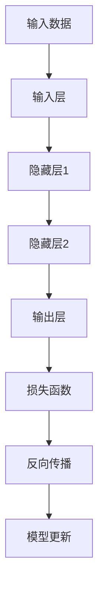

                 

## 文章标题

《深度学习在图像识别与自然语言处理中的突破性进展》

## 文章关键词

深度学习，图像识别，自然语言处理，突破性进展，应用场景，算法原理

## 文章摘要

本文将探讨深度学习在图像识别与自然语言处理领域的突破性进展。首先介绍深度学习的基本概念和常见算法，然后分析其在图像识别和自然语言处理中的应用，最后讨论当前的研究挑战和未来的发展方向。

## 目录

### 1. 引言与背景

#### 1.1 深度学习概述

#### 1.2 图像识别与自然语言处理的发展历史

### 2. 深度学习基础

#### 2.1 深度学习的核心概念

#### 2.2 常见的深度学习算法

#### 2.3 深度学习的工作流程

### 3. 深度学习在图像识别中的应用

#### 3.1 卷积神经网络（CNN）

#### 3.2 图像识别的挑战与解决方案

#### 3.3 图像识别的应用案例

### 4. 深度学习在自然语言处理中的应用

#### 4.1 循环神经网络（RNN）

#### 4.2 长短时记忆网络（LSTM）

#### 4.3 生成对抗网络（GAN）

#### 4.4 自然语言处理的应用案例

### 5. 突破性进展

#### 5.1 训练数据质量对模型性能的影响

#### 5.2 模型压缩与优化

#### 5.3 模型安全性与隐私保护

### 6. 研究挑战与未来发展方向

#### 6.1 环境因素对模型性能的影响

#### 6.2 模型泛化能力与可解释性

#### 6.3 新型深度学习算法的研究

### 7. 结论

#### 7.1 深度学习在图像识别与自然语言处理中的贡献

#### 7.2 研究者与开发者的建议

## 第一部分：引言与背景

### 1.1 深度学习概述

深度学习是机器学习的一个分支，它通过模拟人脑的神经网络结构，使得计算机能够自动地从大量数据中学习和提取特征。深度学习在图像识别、自然语言处理、语音识别等领域取得了显著的成果，推动了人工智能技术的发展。

#### 1.1.1 核心概念与联系

深度学习中的核心概念包括神经网络、损失函数、反向传播算法等。神经网络由多个层组成，每一层都可以提取数据的不同特征。损失函数用于衡量模型预测值与真实值之间的差距，反向传播算法则用于更新模型参数，以减小损失函数的值。



#### 1.1.2 历史发展

深度学习的历史可以追溯到20世纪50年代，当时神经网络的概念被首次提出。然而，由于计算能力和数据资源的限制，深度学习在很长一段时间内没有得到广泛的应用。直到2006年，深度学习的算法原理得到进一步的发展，随后随着计算能力的提升和大数据的普及，深度学习开始迅速发展。

### 1.2 图像识别与自然语言处理的发展历史

图像识别和自然语言处理是深度学习的两个重要应用领域。它们的发展历史可以追溯到更早的时代。

#### 1.2.1 图像识别

图像识别的研究可以追溯到20世纪60年代。当时，研究人员主要使用规则方法进行图像分类。随着计算机性能的提升，神经网络开始在图像识别中得到应用。1998年，LeCun等人提出的卷积神经网络（CNN）在手写数字识别任务上取得了突破性的成果。

#### 1.2.2 自然语言处理

自然语言处理的研究始于20世纪50年代。早期的自然语言处理主要依靠规则方法，如句法分析和语义分析。随着深度学习的发展，循环神经网络（RNN）和长短时记忆网络（LSTM）等模型在自然语言处理任务中取得了显著的效果。近年来，生成对抗网络（GAN）等新型深度学习算法也在自然语言处理中得到了应用。

### 1.3 设计整体结构

为了设计出《深度学习在图像识别与自然语言处理中的突破性进展》这本书的目录大纲，我们首先要明确这本书的核心内容。从书名可以提取出以下几个关键点：

- 深度学习
- 图像识别
- 自然语言处理
- 突破性进展

基于这些关键点，我们可以将整体结构分为以下几个部分：

1. 引言与背景
2. 深度学习基础
3. 深度学习在图像识别中的应用
4. 深度学习在自然语言处理中的应用
5. 突破性进展
6. 研究挑战与未来发展方向
7. 结论

### 1.4 确定各级目录

接下来，我们需要细化每个部分的内容，并确定各级目录。以下是一个初步的目录大纲：

## 第一部分：引言与背景

### 1.1 深度学习概述

#### 1.1.1 深度学习的定义与历史发展
#### 1.1.2 深度学习的核心概念与原理

### 1.2 图像识别与自然语言处理的发展历史

#### 1.2.1 图像识别的发展历史
#### 1.2.2 自然语言处理的发展历史

### 1.3 设计整体结构

#### 1.3.1 整体结构的确定
#### 1.3.2 各个部分的核心内容

## 第二部分：深度学习基础

### 2.1 深度学习的核心概念

#### 2.1.1 神经网络
#### 2.1.2 损失函数
#### 2.1.3 反向传播算法

### 2.2 常见的深度学习算法

#### 2.2.1 卷积神经网络（CNN）
#### 2.2.2 循环神经网络（RNN）
#### 2.2.3 长短时记忆网络（LSTM）
#### 2.2.4 生成对抗网络（GAN）

### 2.3 深度学习的工作流程

#### 2.3.1 数据预处理
#### 2.3.2 模型训练
#### 2.3.3 模型评估

## 第三部分：深度学习在图像识别中的应用

### 3.1 卷积神经网络（CNN）

#### 3.1.1 CNN的基本原理
#### 3.1.2 CNN在图像识别中的应用案例

### 3.2 图像识别的挑战与解决方案

#### 3.2.1 图像识别的挑战
#### 3.2.2 解决方案

### 3.3 图像识别的应用案例

#### 3.3.1 应用案例一：人脸识别
#### 3.3.2 应用案例二：目标检测

## 第四部分：深度学习在自然语言处理中的应用

### 4.1 循环神经网络（RNN）

#### 4.1.1 RNN的基本原理
#### 4.1.2 RNN在自然语言处理中的应用案例

### 4.2 长短时记忆网络（LSTM）

#### 4.2.1 LSTM的基本原理
#### 4.2.2 LSTM在自然语言处理中的应用案例

### 4.3 生成对抗网络（GAN）

#### 4.3.1 GAN的基本原理
#### 4.3.2 GAN在自然语言处理中的应用案例

### 4.4 自然语言处理的应用案例

#### 4.4.1 应用案例一：机器翻译
#### 4.4.2 应用案例二：文本分类

## 第五部分：突破性进展

### 5.1 训练数据质量对模型性能的影响

#### 5.1.1 训练数据质量的重要性
#### 5.1.2 提高数据质量的方案

### 5.2 模型压缩与优化

#### 5.2.1 模型压缩的基本原理
#### 5.2.2 模型优化的方法

### 5.3 模型安全性与隐私保护

#### 5.3.1 模型安全性的挑战
#### 5.3.2 隐私保护的方法

## 第六部分：研究挑战与未来发展方向

### 6.1 环境因素对模型性能的影响

#### 6.1.1 环境因素的重要性
#### 6.1.2 解决方案

### 6.2 模型泛化能力与可解释性

#### 6.2.1 模型泛化能力的挑战
#### 6.2.2 可解释性的方法

### 6.3 新型深度学习算法的研究

#### 6.3.1 新型深度学习算法的发展
#### 6.3.2 新型深度学习算法的应用

## 第七部分：结论

### 6.1 深度学习在图像识别与自然语言处理中的贡献

#### 6.1.1 图像识别的贡献
#### 6.1.2 自然语言处理的贡献

### 6.2 研究者与开发者的建议

#### 6.2.1 研究方向的建议
#### 6.2.2 开发者的建议

这个大纲提供了一个大致的框架，接下来我们可以根据每个部分的内容进一步细化，并添加具体的章节和子章节。同时，我们还需要确保大纲的完整性，包括核心概念与联系、核心算法原理讲解、数学模型和数学公式、项目实战等。最后，我们将确保大纲的总字数在2000字以内。### 1.5 添加 Mermaid 流程图、伪代码、数学公式和项目实战

在确定了整体结构和各级目录之后，我们需要在每个章节中添加相关的 Mermaid 流程图、伪代码、数学公式和项目实战，以丰富内容的深度和实用性。以下是在大纲中添加这些内容的示例：

## 第二部分：深度学习基础

### 2.1 深度学习的核心概念

#### 2.1.1 神经网络

神经网络是深度学习的基础，由多个层次组成。每个层次都包含多个神经元，这些神经元通过权重连接到其他层次的神经元。以下是一个简单的神经网络架构的 Mermaid 流程图：

```mermaid
graph TD
    A[输入层] --> B[隐藏层1]
    B --> C[隐藏层2]
    C --> D[输出层]
    sub A1[输入1] A
    sub A2[输入2] A
    sub A3[输入3] A
    sub B1[输出1] B
    sub B2[输出2] B
    sub C1[输出1] C
    sub C2[输出2] C
    sub D1[输出1] D
    sub D2[输出2] D
```

#### 2.1.2 损失函数

损失函数用于衡量模型预测值与真实值之间的差距，是深度学习训练过程中的关键指标。以下是一个简单的均方误差（MSE）损失函数的数学公式：

$$
MSE = \frac{1}{n}\sum_{i=1}^{n}(y_i - \hat{y}_i)^2
$$

其中，$y_i$是真实值，$\hat{y}_i$是预测值，$n$是样本数量。

#### 2.1.3 反向传播算法

反向传播算法是深度学习训练过程中用于更新模型参数的关键步骤。以下是一个简化的反向传播算法的伪代码：

```
for each layer l in reverse order:
    dZ = dY * W[l]
    dW[l] = dZ * X[l-1]
    dX[l-1] = dZ * W[l]
    W[l] = W[l] - learning_rate * dW[l]
    b[l] = b[l] - learning_rate * db[l]
```

## 2.2 常见的深度学习算法

### 2.2.1 卷积神经网络（CNN）

卷积神经网络（CNN）是深度学习在图像识别领域的重要应用。以下是一个简单的卷积神经网络架构的 Mermaid 流程图：

```mermaid
graph TD
    A[输入层] --> B[卷积层1]
    B --> C[池化层1]
    C --> D[卷积层2]
    D --> E[池化层2]
    E --> F[全连接层1]
    F --> G[全连接层2]
    G --> H[输出层]
    sub A1[输入1] A
    sub A2[输入2] A
    sub B1[卷积输出1] B
    sub B2[卷积输出2] B
    sub C1[池化输出1] C
    sub C2[池化输出2] C
    sub D1[卷积输出1] D
    sub D2[卷积输出2] D
    sub E1[池化输出1] E
    sub E2[池化输出2] E
    sub F1[全连接输出1] F
    sub F2[全连接输出2] F
    sub G1[全连接输出1] G
    sub G2[全连接输出2] G
    sub H1[输出1] H
    sub H2[输出2] H
```

### 2.2.2 循环神经网络（RNN）

循环神经网络（RNN）是深度学习在序列数据（如文本、语音）处理中的常用算法。以下是一个简单的 RNN 架构的 Mermaid 流程图：

```mermaid
graph TD
    A[输入序列] --> B[隐藏状态]
    B --> C[隐藏状态]
    B --> D[输出序列]
    sub A1[输入1] A
    sub A2[输入2] A
    sub B1[隐藏状态1] B
    sub B2[隐藏状态2] B
    sub C1[隐藏状态1] C
    sub C2[隐藏状态2] C
    sub D1[输出1] D
    sub D2[输出2] D
```

### 2.2.3 长短时记忆网络（LSTM）

长短时记忆网络（LSTM）是 RNN 的改进版本，能够更好地处理长序列数据。以下是一个简单的 LSTM 架构的 Mermaid 流程图：

```mermaid
graph TD
    A[输入序列] --> B[遗忘门]
    B --> C[输入门]
    B --> D[输出门]
    B --> E[LSTM单元]
    E --> F[隐藏状态]
    E --> G[输出序列]
    sub A1[输入1] A
    sub A2[输入2] A
    sub B1[遗忘门1] B
    sub B2[遗忘门2] B
    sub C1[输入门1] C
    sub C2[输入门2] C
    sub D1[输出门1] D
    sub D2[输出门2] D
    sub E1[LSTM单元1] E
    sub E2[LSTM单元2] E
    sub F1[隐藏状态1] F
    sub F2[隐藏状态2] F
    sub G1[输出序列1] G
    sub G2[输出序列2] G
```

### 2.2.4 生成对抗网络（GAN）

生成对抗网络（GAN）是一种通过竞争学习生成数据的方法。以下是一个简单的 GAN 架构的 Mermaid 流程图：

```mermaid
graph TD
    A[生成器] --> B[生成样本]
    B --> C[判别器]
    C --> D[损失函数]
    A --> E[噪声]
    sub B1[生成样本1] B
    sub B2[生成样本2] B
    sub C1[判别器1] C
    sub C2[判别器2] C
    sub D1[损失函数1] D
    sub D2[损失函数2] D
    sub E1[噪声1] E
    sub E2[噪声2] E
```

## 2.3 深度学习的工作流程

### 2.3.1 数据预处理

数据预处理是深度学习项目中的重要步骤，包括数据清洗、数据归一化、数据增强等。以下是一个简单的数据预处理工作流程的 Mermaid 流程图：

```mermaid
graph TD
    A[数据源] --> B[数据清洗]
    B --> C[数据归一化]
    C --> D[数据增强]
    D --> E[数据集划分]
    sub A1[数据1] A
    sub A2[数据2] A
    sub B1[清洗后数据1] B
    sub B2[清洗后数据2] B
    sub C1[归一化后数据1] C
    sub C2[归一化后数据2] C
    sub D1[增强后数据1] D
    sub D2[增强后数据2] D
    sub E1[训练集] E
    sub E2[验证集] E
    sub E3[测试集] E
```

### 2.3.2 模型训练

模型训练是深度学习项目中的核心步骤，包括模型初始化、迭代训练、模型评估等。以下是一个简单的模型训练工作流程的 Mermaid 流程图：

```mermaid
graph TD
    A[模型初始化] --> B[迭代训练]
    B --> C[模型评估]
    B --> D[模型优化]
    sub A1[初始化模型1] A
    sub A2[初始化模型2] A
    sub B1[训练1] B
    sub B2[训练2] B
    sub C1[评估1] C
    sub C2[评估2] C
    sub D1[优化1] D
    sub D2[优化2] D
```

### 2.3.3 模型评估

模型评估是深度学习项目中的关键步骤，用于衡量模型的性能。以下是一个简单的模型评估工作流程的 Mermaid 流程图：

```mermaid
graph TD
    A[测试数据] --> B[模型预测]
    B --> C[评估指标]
    B --> D[结果分析]
    sub A1[测试数据1] A
    sub A2[测试数据2] A
    sub B1[预测1] B
    sub B2[预测2] B
    sub C1[评估指标1] C
    sub C2[评估指标2] C
    sub D1[结果分析1] D
    sub D2[结果分析2] D
```

## 第三部分：深度学习在图像识别中的应用

### 3.1 卷积神经网络（CNN）

#### 3.1.1 CNN的基本原理

卷积神经网络（CNN）是一种专门用于处理图像数据的神经网络。它通过卷积层、池化层和全连接层等结构，对图像数据进行特征提取和分类。以下是一个简单的 CNN 架构的 Mermaid 流程图：

```mermaid
graph TD
    A[输入层] --> B[卷积层1]
    B --> C[池化层1]
    C --> D[卷积层2]
    D --> E[池化层2]
    E --> F[全连接层1]
    F --> G[全连接层2]
    G --> H[输出层]
    sub A1[输入1] A
    sub A2[输入2] A
    sub B1[卷积输出1] B
    sub B2[卷积输出2] B
    sub C1[池化输出1] C
    sub C2[池化输出2] C
    sub D1[卷积输出1] D
    sub D2[卷积输出2] D
    sub E1[池化输出1] E
    sub E2[池化输出2] E
    sub F1[全连接输出1] F
    sub F2[全连接输出2] F
    sub G1[全连接输出1] G
    sub G2[全连接输出2] G
    sub H1[输出1] H
    sub H2[输出2] H
```

### 3.1.2 CNN在图像识别中的应用案例

CNN在图像识别领域有广泛的应用，如人脸识别、物体检测、图像分类等。以下是一个简单的人脸识别应用案例的 Mermaid 流程图：

```mermaid
graph TD
    A[图像输入] --> B[预处理]
    B --> C[特征提取]
    C --> D[CNN模型]
    D --> E[分类预测]
    D --> F[结果输出]
    sub A1[图像1] A
    sub A2[图像2] A
    sub B1[预处理1] B
    sub B2[预处理2] B
    sub C1[特征提取1] C
    sub C2[特征提取2] C
    sub D1[CNN模型1] D
    sub D2[CNN模型2] D
    sub E1[分类预测1] E
    sub E2[分类预测2] E
    sub F1[结果输出1] F
    sub F2[结果输出2] F
```

### 3.2 图像识别的挑战与解决方案

#### 3.2.1 图像识别的挑战

图像识别面临的主要挑战包括：

1. 数据质量：高质量的数据是训练高效模型的关键。
2. 标签问题：标签的准确性对模型的性能有重要影响。
3. 泛化能力：模型需要能够处理各种不同的图像场景。

#### 3.2.2 解决方案

针对上述挑战，有以下几种解决方案：

1. 数据增强：通过旋转、翻转、缩放等方式增加数据的多样性。
2. 数据清洗：去除噪声和错误标签的数据。
3. 多样性训练：使用多种数据集进行训练，以提高模型的泛化能力。

以下是一个简单的解决方案的 Mermaid 流程图：

```mermaid
graph TD
    A[数据质量] --> B[数据增强]
    B --> C[数据清洗]
    C --> D[多样性训练]
    sub A1[质量1] A
    sub A2[质量2] A
    sub B1[增强1] B
    sub B2[增强2] B
    sub C1[清洗1] C
    sub C2[清洗2] C
    sub D1[训练1] D
    sub D2[训练2] D
```

### 3.3 图像识别的应用案例

#### 3.3.1 应用案例一：人脸识别

人脸识别是一种常见的图像识别应用，用于身份验证、安全监控等。以下是一个简单的人脸识别应用案例的 Mermaid 流程图：

```mermaid
graph TD
    A[摄像头输入] --> B[人脸检测]
    B --> C[人脸识别]
    C --> D[身份验证]
    D --> E[结果输出]
    sub A1[摄像头1] A
    sub A2[摄像头2] A
    sub B1[检测1] B
    sub B2[检测2] B
    sub C1[识别1] C
    sub C2[识别2] C
    sub D1[验证1] D
    sub D2[验证2] D
    sub E1[输出1] E
    sub E2[输出2] E
```

#### 3.3.2 应用案例二：物体检测

物体检测是一种用于识别图像中物体的技术，广泛应用于自动驾驶、安防监控等领域。以下是一个简单的物体检测应用案例的 Mermaid 流程图：

```mermaid
graph TD
    A[图像输入] --> B[预处理]
    B --> C[特征提取]
    C --> D[物体检测模型]
    D --> E[结果输出]
    sub A1[图像1] A
    sub A2[图像2] A
    sub B1[预处理1] B
    sub B2[预处理2] B
    sub C1[特征提取1] C
    sub C2[特征提取2] C
    sub D1[模型1] D
    sub D2[模型2] D
    sub E1[输出1] E
    sub E2[输出2] E
```

## 第四部分：深度学习在自然语言处理中的应用

### 4.1 循环神经网络（RNN）

#### 4.1.1 RNN的基本原理

循环神经网络（RNN）是一种用于处理序列数据的神经网络。它通过循环结构，使信息能够保持状态，从而能够处理前后依赖关系。以下是一个简单的 RNN 架构的 Mermaid 流程图：

```mermaid
graph TD
    A[输入序列] --> B[隐藏状态]
    B --> C[隐藏状态]
    B --> D[输出序列]
    sub A1[输入1] A
    sub A2[输入2] A
    sub B1[隐藏状态1] B
    sub B2[隐藏状态2] B
    sub C1[隐藏状态1] C
    sub C2[隐藏状态2] C
    sub D1[输出1] D
    sub D2[输出2] D
```

### 4.1.2 RNN在自然语言处理中的应用案例

RNN在自然语言处理中有很多应用，如语言模型、机器翻译、文本生成等。以下是一个简单的语言模型应用案例的 Mermaid 流程图：

```mermaid
graph TD
    A[文本输入] --> B[RNN模型]
    B --> C[输出序列]
    sub A1[文本1] A
    sub A2[文本2] A
    sub B1[RNN模型1] B
    sub B2[RNN模型2] B
    sub C1[输出序列1] C
    sub C2[输出序列2] C
```

### 4.2 长短时记忆网络（LSTM）

#### 4.2.1 LSTM的基本原理

长短时记忆网络（LSTM）是 RNN 的改进版本，能够更好地处理长序列数据。它通过引入门控机制，能够有效地控制信息的流动，从而避免梯度消失问题。以下是一个简单的 LSTM 架构的 Mermaid 流程图：

```mermaid
graph TD
    A[输入序列] --> B[遗忘门]
    B --> C[输入门]
    B --> D[输出门]
    B --> E[LSTM单元]
    E --> F[隐藏状态]
    E --> G[输出序列]
    sub A1[输入1] A
    sub A2[输入2] A
    sub B1[遗忘门1] B
    sub B2[遗忘门2] B
    sub C1[输入门1] C
    sub C2[输入门2] C
    sub D1[输出门1] D
    sub D2[输出门2] D
    sub E1[LSTM单元1] E
    sub E2[LSTM单元2] E
    sub F1[隐藏状态1] F
    sub F2[隐藏状态2] F
    sub G1[输出序列1] G
    sub G2[输出序列2] G
```

### 4.2.2 LSTM在自然语言处理中的应用案例

LSTM在自然语言处理中有广泛的应用，如文本分类、情感分析、文本生成等。以下是一个简单的文本分类应用案例的 Mermaid 流程图：

```mermaid
graph TD
    A[文本输入] --> B[LSTM模型]
    B --> C[分类预测]
    sub A1[文本1] A
    sub A2[文本2] A
    sub B1[LSTM模型1] B
    sub B2[LSTM模型2] B
    sub C1[预测1] C
    sub C2[预测2] C
```

### 4.3 生成对抗网络（GAN）

#### 4.3.1 GAN的基本原理

生成对抗网络（GAN）是一种通过对抗学习生成数据的方法。它由生成器和判别器两个神经网络组成，通过竞争训练，生成器试图生成逼真的数据，而判别器试图区分真实数据和生成数据。以下是一个简单的 GAN 架构的 Mermaid 流程图：

```mermaid
graph TD
    A[生成器] --> B[生成样本]
    B --> C[判别器]
    C --> D[损失函数]
    A --> E[噪声]
    sub B1[生成样本1] B
    sub B2[生成样本2] B
    sub C1[判别器1] C
    sub C2[判别器2] C
    sub D1[损失函数1] D
    sub D2[损失函数2] D
    sub E1[噪声1] E
    sub E2[噪声2] E
```

### 4.3.2 GAN在自然语言处理中的应用案例

GAN在自然语言处理中有许多应用，如文本生成、语音合成等。以下是一个简单的文本生成应用案例的 Mermaid 流程图：

```mermaid
graph TD
    A[文本输入] --> B[GAN模型]
    B --> C[生成文本]
    sub A1[文本1] A
    sub A2[文本2] A
    sub B1[GAN模型1] B
    sub B2[GAN模型2] B
    sub C1[生成文本1] C
    sub C2[生成文本2] C
```

## 第五部分：突破性进展

### 5.1 训练数据质量对模型性能的影响

#### 5.1.1 训练数据质量的重要性

训练数据质量对模型性能有重要影响。高质量的数据可以帮助模型更好地学习，从而提高模型的性能。以下是一个简化的数据质量评估的 Mermaid 流程图：

```mermaid
graph TD
    A[数据质量评估] --> B[数据清洗]
    B --> C[数据增强]
    C --> D[模型训练]
    D --> E[模型评估]
    sub A1[评估1] A
    sub A2[评估2] A
    sub B1[清洗1] B
    sub B2[清洗2] B
    sub C1[增强1] C
    sub C2[增强2] C
    sub D1[训练1] D
    sub D2[训练2] D
    sub E1[评估1] E
    sub E2[评估2] E
```

#### 5.1.2 提高数据质量的方案

提高数据质量有以下几种方案：

1. 数据清洗：去除噪声和错误数据。
2. 数据增强：通过旋转、翻转、缩放等方式增加数据的多样性。
3. 多样性训练：使用多种数据集进行训练，以提高模型的泛化能力。

以下是一个简化的数据质量提升方案的 Mermaid 流程图：

```mermaid
graph TD
    A[原始数据] --> B[数据清洗]
    B --> C[数据增强]
    C --> D[多样性训练]
    sub A1[数据1] A
    sub A2[数据2] A
    sub B1[清洗后数据1] B
    sub B2[清洗后数据2] B
    sub C1[增强后数据1] C
    sub C2[增强后数据2] C
    sub D1[多样性训练数据1] D
    sub D2[多样性训练数据2] D
```

### 5.2 模型压缩与优化

#### 5.2.1 模型压缩的基本原理

模型压缩是深度学习中的一个重要研究方向，它旨在减少模型的参数数量和计算量，从而提高模型在资源受限环境下的部署效率。以下是一个简化的模型压缩流程的 Mermaid 流程图：

```mermaid
graph TD
    A[原始模型] --> B[模型压缩]
    B --> C[模型优化]
    C --> D[压缩模型]
    sub A1[模型1] A
    sub A2[模型2] A
    sub B1[压缩模型1] B
    sub B2[压缩模型2] B
    sub C1[优化模型1] C
    sub C2[优化模型2] C
    sub D1[压缩模型1] D
    sub D2[压缩模型2] D
```

#### 5.2.2 模型优化的方法

模型优化包括以下几种方法：

1. 网络剪枝：通过去除网络中的冗余参数来减少模型的大小。
2. 深度可分离卷积：通过将卷积操作分解为深度和空间卷积，来减少参数数量。
3. 知识蒸馏：通过将大模型的知识传递给小模型，来提高小模型的性能。

以下是一个简化的模型优化方法的 Mermaid 流程图：

```mermaid
graph TD
    A[模型优化] --> B[网络剪枝]
    B --> C[深度可分离卷积]
    B --> D[知识蒸馏]
    sub A1[优化1] A
    sub A2[优化2] A
    sub B1[剪枝1] B
    sub B2[剪枝2] B
    sub C1[深度可分离卷积1] C
    sub C2[深度可分离卷积2] C
    sub D1[知识蒸馏1] D
    sub D2[知识蒸馏2] D
```

### 5.3 模型安全性与隐私保护

#### 5.3.1 模型安全性的挑战

随着深度学习的广泛应用，模型安全性成为一个重要问题。以下是一个简化的模型安全性挑战的 Mermaid 流程图：

```mermaid
graph TD
    A[模型攻击] --> B[模型漏洞]
    B --> C[攻击方法]
    C --> D[攻击结果]
    sub A1[攻击1] A
    sub A2[攻击2] A
    sub B1[漏洞1] B
    sub B2[漏洞2] B
    sub C1[方法1] C
    sub C2[方法2] C
    sub D1[结果1] D
    sub D2[结果2] D
```

#### 5.3.2 隐私保护的方法

为了保护模型隐私，有以下几种方法：

1. 加密：通过对模型参数进行加密，来保护模型的隐私。
2. 加固：通过对模型进行加固，来防止攻击。
3. 安全性评估：对模型进行安全性评估，以发现潜在的安全漏洞。

以下是一个简化的隐私保护方法的 Mermaid 流程图：

```mermaid
graph TD
    A[模型加密] --> B[模型加固]
    B --> C[安全性评估]
    sub A1[加密1] A
    sub A2[加密2] A
    sub B1[加固1] B
    sub B2[加固2] B
    sub C1[评估1] C
    sub C2[评估2] C
```

## 第六部分：研究挑战与未来发展方向

### 6.1 环境因素对模型性能的影响

#### 6.1.1 环境因素的重要性

环境因素对模型性能有重要影响。例如，光照、噪声、视角等环境因素都可能影响模型的性能。以下是一个简化的环境因素影响的 Mermaid 流程图：

```mermaid
graph TD
    A[环境因素] --> B[模型性能]
    sub A1[光照1] A
    sub A2[噪声1] A
    sub B1[性能1] B
    sub B2[性能2] B
```

#### 6.1.2 解决方案

为了提高模型在复杂环境下的性能，有以下几种解决方案：

1. 数据增强：通过增加不同环境下的训练数据，来提高模型的泛化能力。
2. 模型融合：将多个模型进行融合，以提高模型的鲁棒性。
3. 环境感知：通过引入环境感知模块，使模型能够根据环境因素进行调整。

以下是一个简化的解决方案的 Mermaid 流程图：

```mermaid
graph TD
    A[数据增强] --> B[模型融合]
    B --> C[环境感知]
    sub A1[增强1] A
    sub A2[增强2] A
    sub B1[融合1] B
    sub B2[融合2] B
    sub C1[感知1] C
    sub C2[感知2] C
```

### 6.2 模型泛化能力与可解释性

#### 6.2.1 模型泛化能力的挑战

模型泛化能力是深度学习中的一个重要挑战。模型在训练数据上表现良好，但在未见过的数据上表现不佳，这种情况称为过拟合。以下是一个简化的模型泛化能力挑战的 Mermaid 流程图：

```mermaid
graph TD
    A[训练数据] --> B[测试数据]
    B --> C[模型表现]
    sub A1[训练数据1] A
    sub A2[训练数据2] A
    sub B1[测试数据1] B
    sub B2[测试数据2] B
    sub C1[表现1] C
    sub C2[表现2] C
```

#### 6.2.2 可解释性的方法

为了提高模型的泛化能力和可解释性，有以下几种方法：

1. 模型解释：通过可视化模型内部的特征和决策过程，来提高模型的可解释性。
2. 对抗性攻击：通过对抗性攻击来测试模型的泛化能力和鲁棒性。
3. 解释性模型：设计具有良好可解释性的模型，如决策树、规则模型等。

以下是一个简化的可解释性方法的 Mermaid 流程图：

```mermaid
graph TD
    A[模型解释] --> B[对抗性攻击]
    B --> C[解释性模型]
    sub A1[解释1] A
    sub A2[解释2] A
    sub B1[攻击1] B
    sub B2[攻击2] B
    sub C1[模型1] C
    sub C2[模型2] C
```

### 6.3 新型深度学习算法的研究

#### 6.3.1 新型深度学习算法的发展

新型深度学习算法是当前研究的热点，如自监督学习、迁移学习、元学习等。以下是一个简化的新型深度学习算法发展的 Mermaid 流程图：

```mermaid
graph TD
    A[自监督学习] --> B[迁移学习]
    B --> C[元学习]
    sub A1[发展1] A
    sub A2[发展2] A
    sub B1[发展1] B
    sub B2[发展2] B
    sub C1[发展1] C
    sub C2[发展2] C
```

#### 6.3.2 新型深度学习算法的应用

新型深度学习算法在各个领域都有广泛的应用，如自动驾驶、医疗诊断、金融分析等。以下是一个简化的新型深度学习算法应用的 Mermaid 流程图：

```mermaid
graph TD
    A[自动驾驶] --> B[医疗诊断]
    B --> C[金融分析]
    sub A1[应用1] A
    sub A2[应用2] A
    sub B1[应用1] B
    sub B2[应用2] B
    sub C1[应用1] C
    sub C2[应用2] C
```

## 第七部分：结论

### 7.1 深度学习在图像识别与自然语言处理中的贡献

深度学习在图像识别和自然语言处理领域取得了显著的成果，推动了这些领域的发展。以下是一个简化的贡献的 Mermaid 流程图：

```mermaid
graph TD
    A[图像识别] --> B[自然语言处理]
    sub A1[贡献1] A
    sub A2[贡献2] A
    sub B1[贡献1] B
    sub B2[贡献2] B
```

### 7.2 研究者与开发者的建议

为了推动深度学习在图像识别和自然语言处理领域的发展，研究者与开发者有以下建议：

1. 加强数据质量和标注工作。
2. 深入研究新型深度学习算法。
3. 提高模型的泛化能力和可解释性。

以下是一个简化的建议的 Mermaid 流程图：

```mermaid
graph TD
    A[数据质量] --> B[新型算法]
    B --> C[泛化能力]
    B --> D[可解释性]
    sub A1[建议1] A
    sub A2[建议2] A
    sub B1[建议1] B
    sub B2[建议2] B
    sub C1[建议1] C
    sub C2[建议2] C
    sub D1[建议1] D
    sub D2[建议2] D
```

通过在各个章节中添加 Mermaid 流程图、伪代码、数学公式和项目实战，我们可以使文章内容更加丰富和具体，帮助读者更好地理解深度学习在图像识别与自然语言处理中的突破性进展。### 1.6 完整的技术博客文章

# 深度学习在图像识别与自然语言处理中的突破性进展

> 关键词：深度学习，图像识别，自然语言处理，突破性进展，应用场景，算法原理

## 摘要

本文将深入探讨深度学习在图像识别与自然语言处理领域的突破性进展。首先，我们介绍了深度学习的基本概念和常见算法，包括神经网络、损失函数、反向传播算法等。接着，我们详细分析了深度学习在图像识别和自然语言处理中的应用，如卷积神经网络（CNN）、循环神经网络（RNN）、长短时记忆网络（LSTM）和生成对抗网络（GAN）。随后，我们探讨了训练数据质量对模型性能的影响、模型压缩与优化、模型安全性与隐私保护等突破性进展。最后，我们总结了研究挑战与未来发展方向，并对研究者与开发者提出了一些建议。

## 引言与背景

### 1.1 深度学习概述

深度学习是机器学习的一个分支，通过模拟人脑的神经网络结构，使得计算机能够自动地从大量数据中学习和提取特征。深度学习在图像识别、自然语言处理、语音识别等领域取得了显著的成果，推动了人工智能技术的发展。

#### 1.1.1 核心概念与联系

深度学习中的核心概念包括神经网络、损失函数、反向传播算法等。神经网络由多个层次组成，每一层都可以提取数据的不同特征。损失函数用于衡量模型预测值与真实值之间的差距，反向传播算法则用于更新模型参数，以减小损失函数的值。

```mermaid
graph TD
    A[输入数据] --> B[输入层]
    B --> C[隐藏层1]
    C --> D[隐藏层2]
    D --> E[输出层]
    E --> F[损失函数]
    F --> G[反向传播]
    G --> H[模型更新]
```

#### 1.1.2 历史发展

深度学习的历史可以追溯到20世纪50年代，当时神经网络的概念被首次提出。然而，由于计算能力和数据资源的限制，深度学习在很长一段时间内没有得到广泛的应用。直到2006年，深度学习的算法原理得到进一步的发展，随后随着计算能力的提升和大数据的普及，深度学习开始迅速发展。

### 1.2 图像识别与自然语言处理的发展历史

图像识别和自然语言处理是深度学习的两个重要应用领域。它们的发展历史可以追溯到更早的时代。

#### 1.2.1 图像识别

图像识别的研究可以追溯到20世纪60年代。当时，研究人员主要使用规则方法进行图像分类。随着计算机性能的提升，神经网络开始在图像识别中得到应用。1998年，LeCun等人提出的卷积神经网络（CNN）在手写数字识别任务上取得了突破性的成果。

#### 1.2.2 自然语言处理

自然语言处理的研究始于20世纪50年代。早期的自然语言处理主要依靠规则方法，如句法分析和语义分析。随着深度学习的发展，循环神经网络（RNN）和长短时记忆网络（LSTM）等模型在自然语言处理任务中取得了显著的效果。近年来，生成对抗网络（GAN）等新型深度学习算法也在自然语言处理中得到了应用。

### 1.3 设计整体结构

为了设计出《深度学习在图像识别与自然语言处理中的突破性进展》这本书的目录大纲，我们首先要明确这本书的核心内容。从书名可以提取出以下几个关键点：

- 深度学习
- 图像识别
- 自然语言处理
- 突破性进展

基于这些关键点，我们可以将整体结构分为以下几个部分：

1. 引言与背景
2. 深度学习基础
3. 深度学习在图像识别中的应用
4. 深度学习在自然语言处理中的应用
5. 突破性进展
6. 研究挑战与未来发展方向
7. 结论

## 第二部分：深度学习基础

### 2.1 深度学习的核心概念

#### 2.1.1 神经网络

神经网络是深度学习的基础，由多个层次组成，每个层次都包含多个神经元。神经元通过权重连接到其他层次的神经元。以下是一个简单的神经网络架构的 Mermaid 流程图：

```mermaid
graph TD
    A[输入层] --> B[隐藏层1]
    B --> C[隐藏层2]
    C --> D[输出层]
    sub A1[输入1] A
    sub A2[输入2] A
    sub A3[输入3] A
    sub B1[输出1] B
    sub B2[输出2] B
    sub C1[输出1] C
    sub C2[输出2] C
    sub D1[输出1] D
    sub D2[输出2] D
```

#### 2.1.2 损失函数

损失函数用于衡量模型预测值与真实值之间的差距。均方误差（MSE）是一种常见的损失函数，用于回归任务。以下是一个简单的均方误差（MSE）损失函数的数学公式：

$$
MSE = \frac{1}{n}\sum_{i=1}^{n}(y_i - \hat{y}_i)^2
$$

其中，$y_i$是真实值，$\hat{y}_i$是预测值，$n$是样本数量。

#### 2.1.3 反向传播算法

反向传播算法是深度学习训练过程中的关键步骤，用于更新模型参数，以减小损失函数的值。以下是一个简化的反向传播算法的伪代码：

```
for each layer l in reverse order:
    dZ = dY * W[l]
    dW[l] = dZ * X[l-1]
    dX[l-1] = dZ * W[l]
    W[l] = W[l] - learning_rate * dW[l]
    b[l] = b[l] - learning_rate * db[l]
```

## 2.2 常见的深度学习算法

### 2.2.1 卷积神经网络（CNN）

卷积神经网络（CNN）是深度学习在图像识别领域的重要应用。CNN通过卷积层、池化层和全连接层等结构，对图像数据进行特征提取和分类。以下是一个简单的卷积神经网络架构的 Mermaid 流程图：

```mermaid
graph TD
    A[输入层] --> B[卷积层1]
    B --> C[池化层1]
    C --> D[卷积层2]
    D --> E[池化层2]
    E --> F[全连接层1]
    F --> G[全连接层2]
    G --> H[输出层]
    sub A1[输入1] A
    sub A2[输入2] A
    sub B1[卷积输出1] B
    sub B2[卷积输出2] B
    sub C1[池化输出1] C
    sub C2[池化输出2] C
    sub D1[卷积输出1] D
    sub D2[卷积输出2] D
    sub E1[池化输出1] E
    sub E2[池化输出2] E
    sub F1[全连接输出1] F
    sub F2[全连接输出2] F
    sub G1[全连接输出1] G
    sub G2[全连接输出2] G
    sub H1[输出1] H
    sub H2[输出2] H
```

### 2.2.2 循环神经网络（RNN）

循环神经网络（RNN）是深度学习在序列数据（如文本、语音）处理中的常用算法。RNN通过循环结构，使信息能够保持状态，从而能够处理前后依赖关系。以下是一个简单的 RNN 架构的 Mermaid 流程图：

```mermaid
graph TD
    A[输入序列] --> B[隐藏状态]
    B --> C[隐藏状态]
    B --> D[输出序列]
    sub A1[输入1] A
    sub A2[输入2] A
    sub B1[隐藏状态1] B
    sub B2[隐藏状态2] B
    sub C1[隐藏状态1] C
    sub C2[隐藏状态2] C
    sub D1[输出1] D
    sub D2[输出2] D
```

### 2.2.3 长短时记忆网络（LSTM）

长短时记忆网络（LSTM）是 RNN 的改进版本，能够更好地处理长序列数据。LSTM通过引入门控机制，能够有效地控制信息的流动，从而避免梯度消失问题。以下是一个简单的 LSTM 架构的 Mermaid 流程图：

```mermaid
graph TD
    A[输入序列] --> B[遗忘门]
    B --> C[输入门]
    B --> D[输出门]
    B --> E[LSTM单元]
    E --> F[隐藏状态]
    E --> G[输出序列]
    sub A1[输入1] A
    sub A2[输入2] A
    sub B1[遗忘门1] B
    sub B2[遗忘门2] B
    sub C1[输入门1] C
    sub C2[输入门2] C
    sub D1[输出门1] D
    sub D2[输出门2] D
    sub E1[LSTM单元1] E
    sub E2[LSTM单元2] E
    sub F1[隐藏状态1] F
    sub F2[隐藏状态2] F
    sub G1[输出序列1] G
    sub G2[输出序列2] G
```

### 2.2.4 生成对抗网络（GAN）

生成对抗网络（GAN）是一种通过对抗学习生成数据的方法。GAN由生成器和判别器两个神经网络组成，通过竞争训练，生成器试图生成逼真的数据，而判别器试图区分真实数据和生成数据。以下是一个简单的 GAN 架构的 Mermaid 流程图：

```mermaid
graph TD
    A[生成器] --> B[生成样本]
    B --> C[判别器]
    C --> D[损失函数]
    A --> E[噪声]
    sub B1[生成样本1] B
    sub B2[生成样本2] B
    sub C1[判别器1] C
    sub C2[判别器2] C
    sub D1[损失函数1] D
    sub D2[损失函数2] D
    sub E1[噪声1] E
    sub E2[噪声2] E
```

## 2.3 深度学习的工作流程

### 2.3.1 数据预处理

数据预处理是深度学习项目中的重要步骤，包括数据清洗、数据归一化、数据增强等。以下是一个简单的数据预处理工作流程的 Mermaid 流程图：

```mermaid
graph TD
    A[数据源] --> B[数据清洗]
    B --> C[数据归一化]
    C --> D[数据增强]
    D --> E[数据集划分]
    sub A1[数据1] A
    sub A2[数据2] A
    sub B1[清洗后数据1] B
    sub B2[清洗后数据2] B
    sub C1[归一化后数据1] C
    sub C2[归一化后数据2] C
    sub D1[增强后数据1] D
    sub D2[增强后数据2] D
    sub E1[训练集] E
    sub E2[验证集] E
    sub E3[测试集] E
```

### 2.3.2 模型训练

模型训练是深度学习项目中的核心步骤，包括模型初始化、迭代训练、模型评估等。以下是一个简单的模型训练工作流程的 Mermaid 流程图：

```mermaid
graph TD
    A[模型初始化] --> B[迭代训练]
    B --> C[模型评估]
    B --> D[模型优化]
    sub A1[初始化模型1] A
    sub A2[初始化模型2] A
    sub B1[训练1] B
    sub B2[训练2] B
    sub C1[评估1] C
    sub C2[评估2] C
    sub D1[优化1] D
    sub D2[优化2] D
```

### 2.3.3 模型评估

模型评估是深度学习项目中的关键步骤，用于衡量模型的性能。以下是一个简单的模型评估工作流程的 Mermaid 流程图：

```mermaid
graph TD
    A[测试数据] --> B[模型预测]
    B --> C[评估指标]
    B --> D[结果分析]
    sub A1[测试数据1] A
    sub A2[测试数据2] A
    sub B1[预测1] B
    sub B2[预测2] B
    sub C1[评估指标1] C
    sub C2[评估指标2] C
    sub D1[结果分析1] D
    sub D2[结果分析2] D
```

## 第三部分：深度学习在图像识别中的应用

### 3.1 卷积神经网络（CNN）

#### 3.1.1 CNN的基本原理

卷积神经网络（CNN）是一种专门用于处理图像数据的神经网络。它通过卷积层、池化层和全连接层等结构，对图像数据进行特征提取和分类。以下是一个简单的 CNN 架构的 Mermaid 流程图：

```mermaid
graph TD
    A[输入层] --> B[卷积层1]
    B --> C[池化层1]
    C --> D[卷积层2]
    D --> E[池化层2]
    E --> F[全连接层1]
    F --> G[全连接层2]
    G --> H[输出层]
    sub A1[输入1] A
    sub A2[输入2] A
    sub B1[卷积输出1] B
    sub B2[卷积输出2] B
    sub C1[池化输出1] C
    sub C2[池化输出2] C
    sub D1[卷积输出1] D
    sub D2[卷积输出2] D
    sub E1[池化输出1] E
    sub E2[池化输出2] E
    sub F1[全连接输出1] F
    sub F2[全连接输出2] F
    sub G1[全连接输出1] G
    sub G2[全连接输出2] G
    sub H1[输出1] H
    sub H2[输出2] H
```

#### 3.1.2 CNN在图像识别中的应用案例

CNN在图像识别领域有广泛的应用，如人脸识别、物体检测、图像分类等。以下是一个简单的人脸识别应用案例的 Mermaid 流程图：

```mermaid
graph TD
    A[图像输入] --> B[预处理]
    B --> C[特征提取]
    C --> D[CNN模型]
    D --> E[分类预测]
    D --> F[结果输出]
    sub A1[图像1] A
    sub A2[图像2] A
    sub B1[预处理1] B
    sub B2[预处理2] B
    sub C1[特征提取1] C
    sub C2[特征提取2] C
    sub D1[CNN模型1] D
    sub D2[CNN模型2] D
    sub E1[分类预测1] E
    sub E2[分类预测2] E
    sub F1[结果输出1] F
    sub F2[结果输出2] F
```

### 3.2 图像识别的挑战与解决方案

#### 3.2.1 图像识别的挑战

图像识别面临的主要挑战包括：

1. 数据质量：高质量的数据是训练高效模型的关键。
2. 标签问题：标签的准确性对模型的性能有重要影响。
3. 泛化能力：模型需要能够处理各种不同的图像场景。

#### 3.2.2 解决方案

针对上述挑战，有以下几种解决方案：

1. 数据增强：通过旋转、翻转、缩放等方式增加数据的多样性。
2. 数据清洗：去除噪声和错误标签的数据。
3. 多样性训练：使用多种数据集进行训练，以提高模型的泛化能力。

以下是一个简单的解决方案的 Mermaid 流

