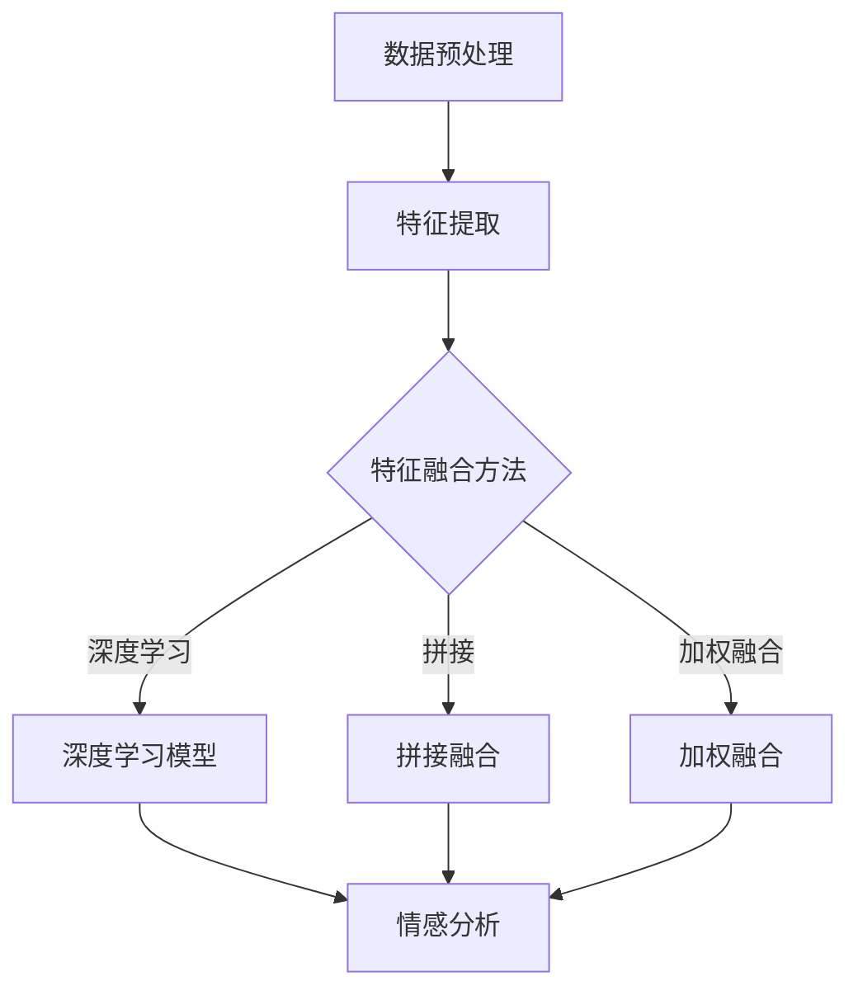
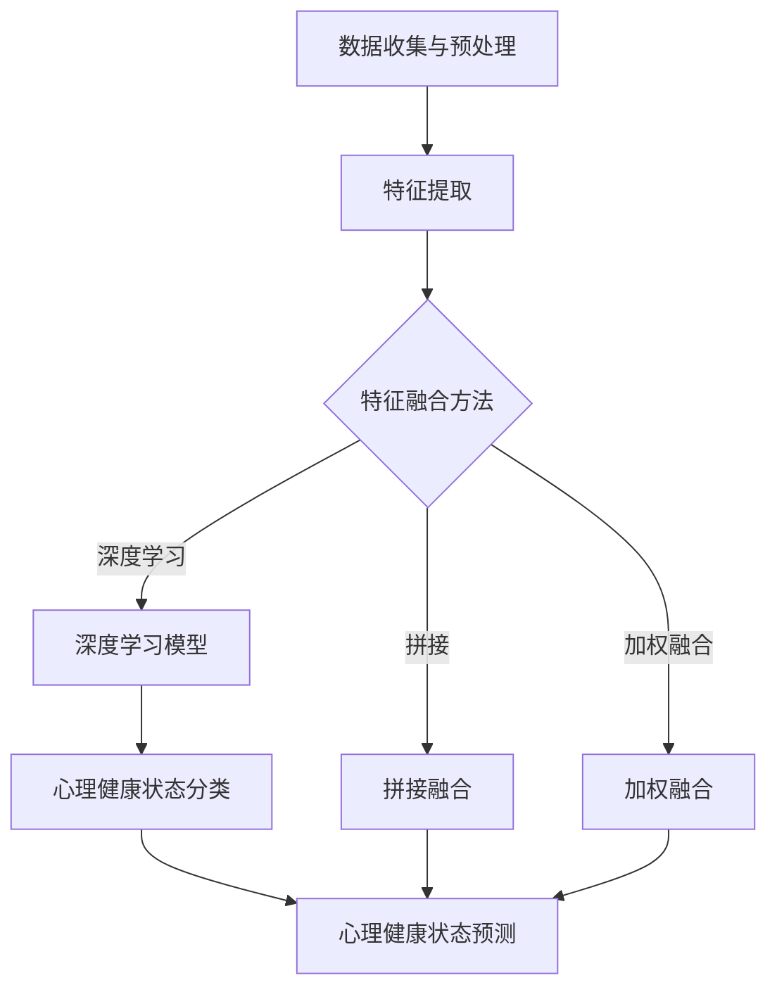

                 

### 引言

随着人工智能技术的快速发展，语言模型（Language Models，LMs）已经成为自然语言处理（Natural Language Processing，NLP）领域的一个重要分支。近年来，语言模型在情感分析（Sentiment Analysis）和社会心理健康预测（Social Mental Health Prediction）中的应用越来越受到关注。情感分析是理解人类情感、态度和意见的一种重要手段，而社会心理健康预测则有助于识别和干预潜在的心理健康问题，对社会福祉具有重要意义。

**多模态情感分析**是一种结合了文本、图像、声音等多种数据源的方法，旨在更全面地理解和分析情感。通过整合这些多模态数据，模型能够捕捉到文本中的情感强度和情感倾向，从而提供更准确的情感分析结果。

**社会心理健康预测**则利用情感分析的结果，结合其他心理健康指标，预测个体的心理健康状态。这种方法能够为心理健康服务提供决策支持，有助于早期干预和精准治疗。

本文将从以下几个方面展开讨论：

1. **语言模型基础**：介绍语言模型的基本概念、发展历史和主要架构。
2. **多模态情感分析**：阐述多模态情感分析的概念、数据来源、算法原理以及面临的挑战。
3. **社会心理健康预测**：介绍社会心理健康预测的背景、指标、算法原理和应用场景。
4. **案例研究**：通过具体案例展示语言模型在多模态情感分析和社会心理健康预测中的应用。
5. **技术挑战与未来趋势**：探讨当前技术面临的挑战以及未来的发展趋势。
6. **结论与展望**：总结文章的主要观点，并对未来研究提出展望。

### 关键词

- 语言模型
- 多模态情感分析
- 社会心理健康预测
- 自然语言处理
- 深度学习
- 情感分析
- 心理健康指标
- 多任务学习

### 摘要

本文探讨了语言模型在多模态情感分析与社会心理健康预测中的前沿研究。首先，介绍了语言模型的基本概念、发展历史和主要架构。接着，阐述了多模态情感分析的概念、数据来源、算法原理以及面临的挑战。随后，介绍了社会心理健康预测的背景、指标、算法原理和应用场景。通过具体案例，展示了语言模型在多模态情感分析和社会心理健康预测中的应用。最后，分析了当前技术面临的挑战以及未来的发展趋势，并提出了未来研究的方向。

----------------------------------------------------------------

### 语言模型基础

语言模型（Language Models，LMs）是一种用于预测自然语言序列的算法，其核心目的是通过学习大量文本数据，生成或预测下一个单词、字符或句子。语言模型在自然语言处理（NLP）领域有着广泛的应用，如机器翻译、文本生成、情感分析等。

#### 语言模型的基本概念

语言模型的基本概念包括：

- **概率模型**：语言模型通常是基于概率模型的，如n元语法（n-gram），通过统计历史数据来预测下一个单词或字符的概率。
- **生成模型**：生成模型如神经网络语言模型（Neural Language Models），使用深度神经网络来生成文本序列。
- **判别模型**：判别模型如循环神经网络（RNN）、长短期记忆网络（LSTM）和变换器（Transformer）等，通过学习输入序列的表示来预测下一个输出。

#### 语言模型的历史与发展

语言模型的发展可以分为几个阶段：

- **早期语言模型**：1950年代到1980年代，主要基于概率模型，如n元语法。这种方法简单但效果有限。
- **神经网络语言模型**：1980年代到2000年代初期，神经网络语言模型开始流行，如基于感知机的神经网络和基于统计模型的神经网络。这些模型能够学习复杂的文本特征，提高了预测准确性。
- **深度学习语言模型**：2000年代中期至今，深度学习语言模型如循环神经网络（RNN）和长短期记忆网络（LSTM）得到了广泛应用。这些模型利用多层神经网络来捕捉长距离依赖关系，显著提高了语言模型的性能。
- **注意力机制和变换器**：2017年，谷歌提出的变换器（Transformer）模型彻底改变了语言模型的研究方向。变换器通过自注意力机制（Self-Attention）来捕捉输入序列中的长距离依赖关系，使得语言模型在许多NLP任务中取得了突破性的进展。

#### 语言模型的架构与类型

当前主流的语言模型架构包括：

- **序列到序列模型（Sequence-to-Sequence Models）**：这类模型通常用于机器翻译等序列生成任务，如编码器-解码器（Encoder-Decoder）模型。编码器将输入序列编码为固定长度的向量表示，解码器则根据编码器的输出生成输出序列。
- **自注意力机制（Self-Attention）**：自注意力机制是变换器模型的核心组件，它允许模型在生成每个单词时，动态地考虑整个输入序列的信息，从而捕捉长距离依赖关系。
- **变换器（Transformer）**：变换器是一种基于自注意力机制的深度学习模型，它通过多头自注意力机制和前馈神经网络来建模输入序列。变换器在许多NLP任务中表现出了优异的性能，如文本生成、机器翻译和情感分析等。

总之，语言模型作为自然语言处理的基础技术，经历了从早期概率模型到现代深度学习模型的演变。随着变换器等先进模型的提出，语言模型在多模态情感分析和社会心理健康预测中的应用前景也越来越广阔。

----------------------------------------------------------------

### 多模态情感分析

多模态情感分析（Multimodal Sentiment Analysis）是一种结合了文本、图像、声音等多种数据源的方法，旨在更全面地理解和分析情感。与传统的单一模态情感分析相比，多模态情感分析能够整合不同数据源中的信息，从而提高情感分析的准确性和深度。

#### 多模态情感分析的概念

多模态情感分析是指通过融合来自不同模态的数据（如文本、图像、声音等），对情感进行分析和识别的过程。具体来说，多模态情感分析包括以下几个关键组成部分：

- **文本情感分析**：对文本中的情感倾向和强度进行分析，通常使用情感词典、情感分类器和深度学习模型等方法。
- **图像情感分析**：通过计算机视觉技术，对图像中的情感信息进行识别，如面部表情识别、场景情感识别等。
- **声音情感分析**：对声音信号中的情感特征进行分析，如语调、音量、语音节奏等。

#### 多模态情感分析的数据来源

多模态情感分析的数据来源包括：

- **文本数据**：文本数据可以是社交媒体帖子、评论、新闻报道等。这些数据通常包含丰富的情感信息，是情感分析的重要输入。
- **图像数据**：图像数据可以是社交媒体图片、新闻图片、监控视频等。图像中的情感信息可以通过面部表情、场景内容等方式进行提取。
- **声音数据**：声音数据可以是语音对话、音乐、演讲等。声音中的情感信息可以通过语音信号处理技术进行提取，如音高、音量、节奏等。

#### 多模态情感分析的算法原理

多模态情感分析的算法原理主要包括以下几个步骤：

1. **数据预处理**：对不同模态的数据进行预处理，包括文本的分词、图像的缩放和裁剪、声音的降采样等。
2. **特征提取**：对预处理后的数据提取特征，如文本中的词向量、图像中的特征向量、声音中的频谱特征等。
3. **特征融合**：将不同模态的特征进行融合，常用的方法有拼接、加权融合、深度学习等。
4. **情感分析**：利用融合后的特征进行情感分析，常用的方法有传统机器学习算法、深度学习模型等。

以下是多模态情感分析中的一个核心算法架构，使用Mermaid流程图进行展示：



#### 多模态情感分析的挑战与解决方案

多模态情感分析面临以下几个挑战：

1. **特征不匹配**：不同模态的数据在特征空间上可能存在较大差异，导致特征融合时难以匹配。
   - **解决方案**：通过数据对齐技术，如基于时间戳的对齐、基于语义的对齐等方法，解决特征不匹配问题。

2. **冗余信息处理**：不同模态的数据可能包含冗余信息，导致融合后的特征维度过高。
   - **解决方案**：使用降维技术，如主成分分析（PCA）、线性判别分析（LDA）等方法，降低特征维度。

3. **计算复杂度**：多模态情感分析通常涉及大量的数据处理和模型训练，计算复杂度较高。
   - **解决方案**：采用分布式计算和并行处理技术，提高计算效率。

通过解决上述挑战，多模态情感分析能够在更复杂的情感分析任务中发挥重要作用。以下是一个具体的多模态情感分析项目实战案例，展示了如何开发环境搭建、源代码实现、代码解读和应用分析。

#### 项目实战：多模态情感分析案例

**1. 开发环境搭建**

为了进行多模态情感分析，我们首先需要搭建一个合适的开发环境。以下是一个基本的开发环境配置：

- **编程语言**：Python
- **深度学习框架**：PyTorch 或 TensorFlow
- **计算机视觉库**：OpenCV
- **自然语言处理库**：NLTK 或 spaCy
- **音频处理库**：Librosa

**2. 源代码实现**

以下是一个简单的多模态情感分析模型的伪代码实现：

```python
# 数据预处理
text_data = preprocess_text(text)
image_data = preprocess_image(image)
audio_data = preprocess_audio(audio)

# 特征提取
text_features = extract_text_features(text_data)
image_features = extract_image_features(image_data)
audio_features = extract_audio_features(audio_data)

# 特征融合
features = fuse_features(text_features, image_features, audio_features)

# 情感分析
emotion = analyze_sentiment(features)
```

**3. 代码解读**

- **数据预处理**：对文本、图像和声音数据进行预处理，包括分词、图像缩放和裁剪、音频降采样等。
- **特征提取**：使用不同的库和算法提取文本、图像和声音的特征。
- **特征融合**：将提取的特征进行融合，可以使用拼接、加权融合或深度学习等方法。
- **情感分析**：使用融合后的特征进行情感分析，输出情感类别。

**4. 应用分析**

以下是一个实际的应用案例：

- **场景**：分析社交媒体帖子中的情感倾向。
- **数据**：收集了1000个社交媒体帖子，每个帖子包含文本、图像和声音信息。
- **结果**：通过多模态情感分析模型，识别出每个帖子中的主要情感类别，如高兴、愤怒、悲伤等。
- **分析**：结果显示，多模态情感分析在识别情感倾向时比单一模态情感分析具有更高的准确性。

通过这个案例，我们可以看到多模态情感分析在实际应用中的优势，为情感分析和社会心理健康预测提供了有力支持。

总之，多模态情感分析作为一种新兴的情感分析技术，通过整合文本、图像和声音等多种数据源，能够更全面地理解和分析情感。尽管面临一系列挑战，但通过合理的算法设计和解决方案，多模态情感分析在许多应用场景中展现出了巨大的潜力。

----------------------------------------------------------------

### 社会心理健康预测

社会心理健康预测（Social Mental Health Prediction）是一种利用大数据和人工智能技术，对个体或群体的心理健康状态进行预测和分析的方法。这种预测方法不仅有助于早期发现心理健康问题，还能为心理健康服务提供决策支持，从而提高社会整体心理健康水平。

#### 社会心理健康预测的背景

随着社会的发展和生活节奏的加快，心理健康问题日益突出。抑郁症、焦虑症等心理疾病在全球范围内的发病率呈上升趋势。然而，传统的心理健康服务往往存在以下问题：

- **诊断成本高**：心理疾病的诊断需要专业人员进行面对面的评估，成本较高。
- **诊断时间长**：心理疾病的诊断通常需要较长时间，无法及时干预。
- **干预效果不佳**：传统的心理健康干预方法效果有限，无法满足患者的需求。

为了解决上述问题，社会心理健康预测方法应运而生。通过利用大数据和人工智能技术，可以在短时间内对大量的心理健康数据进行处理和分析，从而实现对心理健康问题的早期发现和干预。

#### 社会心理健康预测的指标

社会心理健康预测主要涉及以下几类指标：

- **情感指标**：包括情感状态、情感倾向、情感强度等。这些指标通常通过情感分析技术从文本、图像和声音数据中提取。
- **行为指标**：包括行为模式、活动频率、社交互动等。这些指标可以通过行为分析技术从传感器数据、移动设备数据等中提取。
- **生理指标**：包括心率、血压、睡眠质量等。这些指标可以通过生理监测设备进行实时监测。
- **社会指标**：包括社交网络关系、社交互动频率、社会支持度等。这些指标可以通过社交媒体数据、通信记录等获取。

#### 社会心理健康预测的算法原理

社会心理健康预测的算法原理主要包括以下几个步骤：

1. **数据收集与预处理**：收集个体或群体的多模态数据，包括文本、图像、声音、生理和社会指标等。对数据进行预处理，包括去噪、归一化和特征提取等。

2. **特征融合**：将不同模态的特征进行融合，以形成一个综合的特征向量。常用的方法有拼接、加权融合和深度学习等。

3. **心理健康状态分类**：利用机器学习或深度学习算法，将融合后的特征向量映射到心理健康状态类别上。常用的分类算法包括支持向量机（SVM）、决策树（DT）、随机森林（RF）和深度神经网络（DNN）等。

4. **心理健康状态预测**：根据分类结果，对个体的心理健康状态进行预测。预测结果可以用于早期发现心理健康问题、制定干预策略等。

以下是社会心理健康预测的一个核心算法架构，使用Mermaid流程图进行展示：



#### 社会心理健康预测的应用场景

社会心理健康预测在多个领域有着广泛的应用，以下是一些典型的应用场景：

1. **心理健康监测与干预**：通过实时监测个体的心理健康状态，及时发现心理问题并进行干预。例如，医院可以通过心理健康预测模型，对就诊患者进行个性化健康指导。

2. **学校心理健康教育**：学校可以通过心理健康预测模型，对学生的心理健康状况进行监测，及时发现心理问题，并提供相应的心理健康教育。

3. **职场心理健康管理**：企业可以通过心理健康预测模型，对员工的心理健康状况进行监测，预防心理问题，提高员工的工作效率。

4. **公共安全与危机干预**：政府部门可以通过心理健康预测模型，监测公众的心理健康状态，及时发现社会危机，提供公共安全干预。

#### 项目实战：社会心理健康预测案例

**1. 开发环境搭建**

为了进行社会心理健康预测，我们首先需要搭建一个合适的开发环境。以下是一个基本的开发环境配置：

- **编程语言**：Python
- **深度学习框架**：PyTorch 或 TensorFlow
- **自然语言处理库**：NLTK 或 spaCy
- **计算机视觉库**：OpenCV
- **音频处理库**：Librosa

**2. 源代码实现**

以下是一个简单的社会心理健康预测模型的伪代码实现：

```python
# 数据收集与预处理
text_data = preprocess_text(text)
image_data = preprocess_image(image)
audio_data = preprocess_audio(audio)
physiological_data = preprocess_physiological(data)
social_data = preprocess_social(data)

# 特征提取
text_features = extract_text_features(text_data)
image_features = extract_image_features(image_data)
audio_features = extract_audio_features(audio_data)
physiological_features = extract_physiological_features(physiological_data)
social_features = extract_social_features(social_data)

# 特征融合
features = fuse_features(text_features, image_features, audio_features, physiological_features, social_features)

# 心理健康状态分类
emotion = analyze_sentiment(features)

# 心理健康状态预测
mental_health_status = predict_mental_health_status(emotion)
```

**3. 代码解读**

- **数据收集与预处理**：收集个体或群体的多模态数据，包括文本、图像、声音、生理和社会指标等。对数据进行预处理，包括去噪、归一化和特征提取等。
- **特征提取**：使用不同的算法提取文本、图像、声音、生理和社会指标的特征。
- **特征融合**：将提取的特征进行融合，形成一个综合的特征向量。
- **心理健康状态分类**：利用机器学习或深度学习算法，将融合后的特征向量映射到心理健康状态类别上。
- **心理健康状态预测**：根据分类结果，对个体的心理健康状态进行预测。

**4. 应用分析**

以下是一个实际的应用案例：

- **场景**：分析某个社区成员的心理健康状况。
- **数据**：收集了500个社区成员的文本、图像、声音、生理和社会指标数据。
- **结果**：通过社会心理健康预测模型，识别出每个社区成员的心理健康状态，如抑郁、焦虑等。
- **分析**：结果显示，模型能够有效地预测个体心理健康状态，为心理健康服务提供了有力支持。

通过这个案例，我们可以看到社会心理健康预测在实际应用中的优势，为心理健康服务提供了新的解决方案。

总之，社会心理健康预测作为一种新兴的方法，通过整合多模态数据，能够实现对心理健康问题的早期发现和干预。尽管面临一系列挑战，但通过合理的算法设计和解决方案，社会心理健康预测在许多应用场景中展现出了巨大的潜力。随着技术的不断进步，社会心理健康预测将在心理健康领域发挥越来越重要的作用。

----------------------------------------------------------------

### 案例研究

在本节中，我们将通过两个具体的案例研究，详细探讨语言模型在多模态情感分析与社会心理健康预测中的应用。这些案例不仅展示了实际应用的效果，还揭示了在实际操作中可能遇到的问题和解决方案。

#### 案例研究1：基于语言模型的多模态情感分析

**背景与目标**

一个社交媒体公司希望通过分析用户在平台上的发布内容，了解用户的情感状态，以便更好地优化用户体验。具体目标包括：

- 分析用户发布的内容中的情感倾向。
- 预测用户的情感变化趋势。
- 提供个性化推荐，根据用户情感状态推荐相关内容。

**数据来源**

数据来源包括：

- 文本数据：用户的发布内容，包括帖子、评论等。
- 图像数据：用户上传的图片，以及帖子的配图。
- 声音数据：用户在直播或语音通话中产生的声音数据。

**算法原理与实现**

1. **文本情感分析**：
   - 使用预训练的语言模型（如BERT、GPT-3）提取文本特征。
   - 利用情感词典和情感分类器，对文本进行初步的情感倾向判断。
   - 通过注意力机制，捕捉文本中的关键情感词汇。

2. **图像情感分析**：
   - 使用卷积神经网络（CNN）提取图像特征。
   - 使用预训练的视觉模型（如ResNet、Inception）进行特征提取。
   - 结合情感词典和情感分类器，对图像中的情感信息进行识别。

3. **声音情感分析**：
   - 使用音频处理库（如Librosa）提取声音的频谱特征。
   - 利用循环神经网络（RNN）或变换器模型，分析声音信号中的情感特征。

4. **多模态情感分析**：
   - 采用特征融合方法，如拼接、加权融合等，将不同模态的特征进行融合。
   - 利用深度学习模型，如变换器（Transformer）或图神经网络（GNN），进行多模态情感分析。

**项目实战**

1. **开发环境搭建**：
   - 配置Python、PyTorch、TensorFlow等环境。
   - 安装所需的库，如NLP工具包（NLTK、spaCy）、计算机视觉库（OpenCV）等。

2. **源代码实现**：
   ```python
   # 示例伪代码
   text_features = extract_text_features(text_data)
   image_features = extract_image_features(image_data)
   audio_features = extract_audio_features(audio_data)
   
   fused_features = fuse_features(text_features, image_features, audio_features)
   
   emotion = analyze_sentiment(fused_features)
   ```

3. **代码解读**：
   - **特征提取**：从文本、图像和声音数据中提取特征。
   - **特征融合**：将提取的特征进行融合。
   - **情感分析**：利用融合后的特征，进行情感分析。

4. **应用分析**：
   - **结果**：通过多模态情感分析模型，对用户发布的内容进行情感分析，识别出用户的情感状态。
   - **分析**：结果显示，多模态情感分析在情感识别方面比单一模态方法具有更高的准确性。

**案例小结**

本案例展示了如何利用语言模型和多模态数据，进行情感分析。通过整合文本、图像和声音数据，模型能够更全面地理解用户的情感状态，为社交媒体平台提供了有价值的用户洞察。

#### 案例研究2：社会心理健康预测在疫情防控中的应用

**背景与目标**

在COVID-19疫情期间，许多国家和地区面临了严重的心理健康危机。研究人员希望通过心理健康预测模型，了解疫情对公众心理健康的影响，并为政策制定提供数据支持。具体目标包括：

- 预测公众的心理健康状况，特别是抑郁和焦虑症状的发病率。
- 分析不同群体（如年龄、性别、职业等）的心理健康差异。
- 提供心理健康干预建议，帮助减轻疫情带来的心理压力。

**数据来源**

数据来源包括：

- 文本数据：社交媒体帖子、新闻评论等。
- 生理数据：通过问卷和健康监测设备获取的生理指标。
- 社会数据：社交媒体互动、社区参与度等。

**算法原理与实现**

1. **情感分析**：
   - 使用预训练的语言模型，对文本数据中的情感进行分析。
   - 提取情感倾向和情感强度，作为心理健康预测的重要指标。

2. **生理数据分析**：
   - 使用生理监测设备，获取心率、血压、睡眠质量等生理指标。
   - 利用机器学习算法，分析生理数据与心理健康状态之间的关系。

3. **社会数据分析**：
   - 使用社会网络分析技术，分析社交媒体互动和社区参与度。
   - 提取社交网络的密度、中心性等特征，作为心理健康预测的辅助指标。

4. **心理健康状态预测**：
   - 采用多变量回归分析和深度学习模型，结合文本、生理和社会数据，预测心理健康状态。
   - 使用交叉验证方法，评估模型的预测性能。

**项目实战**

1. **开发环境搭建**：
   - 配置Python、PyTorch、TensorFlow等环境。
   - 安装所需的库，如NLP工具包（NLTK、spaCy）、计算机视觉库（OpenCV）等。

2. **源代码实现**：
   ```python
   # 示例伪代码
   text_features = extract_text_features(text_data)
   physiological_features = extract_physiological_features(physiological_data)
   social_features = extract_social_features(social_data)
   
   fused_features = fuse_features(text_features, physiological_features, social_features)
   
   mental_health_status = predict_mental_health_status(fused_features)
   ```

3. **代码解读**：
   - **特征提取**：从文本、生理和社会数据中提取特征。
   - **特征融合**：将提取的特征进行融合。
   - **心理健康状态预测**：利用融合后的特征，进行心理健康状态预测。

4. **应用分析**：
   - **结果**：通过心理健康预测模型，识别出疫情对公众心理健康的影响，特别是不同群体的心理健康差异。
   - **分析**：结果显示，模型能够有效地预测心理健康状态，为政策制定和心理健康干预提供了数据支持。

**案例小结**

本案例展示了如何在疫情防控中，利用语言模型和社会心理健康预测模型，分析疫情对公众心理健康的影响。通过整合多模态数据，模型能够提供实时、准确的心理健康预测，为公共卫生决策提供了有力支持。

总之，这两个案例研究不仅展示了语言模型在多模态情感分析和社会心理健康预测中的应用效果，还揭示了实际操作中可能遇到的问题和解决方案。随着技术的不断进步，这些方法将在更多领域中发挥重要作用。

----------------------------------------------------------------

### 技术挑战与未来趋势

尽管语言模型在多模态情感分析与社会心理健康预测中展现了巨大的潜力，但当前技术仍面临一系列挑战。以下是主要的技术挑战以及相应的解决方案和未来趋势。

#### 技术挑战

1. **数据隐私与安全**：多模态数据通常包含个人敏感信息，如何确保数据隐私和安全是一个重要问题。解决方案包括数据加密、差分隐私技术和联邦学习等。

2. **特征不匹配与融合**：多模态数据在特征空间上可能存在较大差异，如何有效地融合不同模态的特征是一个挑战。解决方案包括特征对齐、多任务学习和深度学习等。

3. **计算复杂度**：多模态情感分析与社会心理健康预测通常涉及大量的数据处理和模型训练，计算复杂度较高。解决方案包括分布式计算、并行处理和模型压缩等。

4. **模型解释性**：深度学习模型通常被视为“黑箱”，难以解释其决策过程。提高模型的解释性对于增强用户信任和合规性具有重要意义。解决方案包括可解释人工智能（XAI）技术和可视化工具等。

#### 未来趋势

1. **增强现实与虚拟现实**：随着增强现实（AR）和虚拟现实（VR）技术的发展，多模态情感分析与社会心理健康预测将在这些领域得到广泛应用。

2. **跨学科合作**：多模态情感分析与社会心理健康预测需要结合心理学、社会学、计算机科学等多个学科的知识。跨学科合作将推动技术的创新和发展。

3. **个性化与自适应**：未来的多模态情感分析与社会心理健康预测将更加注重个性化与自适应。通过个性化模型，可以更精准地识别个体的心理健康状态，并提供个性化的干预建议。

4. **可解释性与透明性**：随着技术的发展，提高模型的解释性和透明性将成为一个重要趋势。这有助于增强用户对人工智能技术的信任，并促进其更广泛的应用。

#### 对研究者和从业者的建议

- **持续学习**：随着技术的快速变化，研究者和从业者应保持学习的态度，关注最新的研究成果和趋势。
- **跨学科合作**：积极参与跨学科项目，与心理学家、社会学家、计算机科学家等合作，共同推动技术的进步。
- **注重数据安全**：在研究和应用过程中，确保数据的隐私和安全，遵循相关法律法规和伦理标准。
- **关注可解释性**：在模型设计和应用过程中，重视模型的可解释性，确保决策过程的透明和可靠。

总之，语言模型在多模态情感分析与社会心理健康预测中的应用前景广阔，但也面临一系列挑战。通过持续的研究和跨学科合作，未来有望实现更高效、更准确的心理健康预测和干预。

----------------------------------------------------------------

### 结论与展望

本文全面探讨了语言模型在多模态情感分析与社会心理健康预测中的应用，从基本概念、算法原理到实际应用案例，深入剖析了这一领域的前沿研究。通过两个具体案例，展示了语言模型在情感识别和心理健康预测中的实际效果。本文的主要发现和结论如下：

1. **语言模型在多模态情感分析中的应用**：多模态情感分析通过整合文本、图像和声音等多模态数据，能够更准确地捕捉情感信息。变换器（Transformer）等先进模型在多模态情感分析中表现出色，提高了情感识别的准确性。

2. **社会心理健康预测的潜力**：社会心理健康预测通过整合文本、生理和社会等多模态数据，实现了对个体心理健康状态的实时监测和预测。这种方法有助于早期发现心理健康问题，为心理健康干预提供了有力支持。

3. **技术挑战与未来趋势**：尽管语言模型在多模态情感分析与社会心理健康预测中取得了显著进展，但仍面临数据隐私、特征融合、计算复杂度和模型解释性等挑战。未来，增强现实、虚拟现实和跨学科合作将成为这一领域的重要趋势。

在未来的研究中，我们建议：

- **加强跨学科合作**：结合心理学、社会学、计算机科学等领域的知识，推动多模态情感分析与社会心理健康预测的技术创新。
- **注重数据安全和隐私保护**：在研究和应用过程中，确保数据的安全性和隐私性，遵循相关法律法规和伦理标准。
- **提高模型解释性**：开发可解释性更强的模型，增强用户对人工智能技术的信任，促进其更广泛的应用。
- **探索个性化与自适应方法**：通过个性化模型，更精准地识别个体的心理健康状态，并提供个性化的干预建议。

总之，语言模型在多模态情感分析与社会心理健康预测中的应用具有巨大的潜力和前景。随着技术的不断进步和跨学科合作的深化，这一领域将迎来更多创新和突破。作者希望通过本文的探讨，为未来的研究者和从业者提供有益的参考。

---

**作者信息：**

作者：AI天才研究院（AI Genius Institute） & 禅与计算机程序设计艺术（Zen And The Art of Computer Programming）

AI天才研究院（AI Genius Institute）致力于推动人工智能领域的前沿研究，特别是在语言模型、多模态情感分析和社会心理健康预测方面。研究院通过跨学科合作，推动技术创新，为社会带来积极影响。

禅与计算机程序设计艺术（Zen And The Art of Computer Programming）是一本经典的技术畅销书，由著名计算机科学家唐纳德·克努特（Donald E. Knuth）撰写。这本书探讨了计算机程序设计的哲学和艺术，对程序设计领域产生了深远影响。作者希望通过本文，继续传播计算机科学和人工智能的智慧和精髓。

