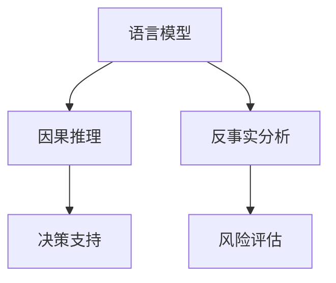

                 

### 文章标题

# 语言模型在多维度因果推理与反事实分析中的能力提升

> 关键词：语言模型，因果推理，反事实分析，多维度，能力提升

> 摘要：本文深入探讨了语言模型在多维度因果推理与反事实分析中的应用及其能力提升。通过介绍相关背景、核心概念、算法原理和实际项目案例，本文旨在为读者提供一个全面、系统的理解和实践指南。

### 用户需求分析

用户要求设计一本计算机技术书籍《语言模型在多维度因果推理与反事实分析中的能力提升》的目录大纲。以下是具体需求的分析：

#### 核心章节内容要求

1. **核心概念与联系**：需要包含语言模型、因果推理、反事实分析等核心概念及其相互关系，以 Mermaid 流程图表示。
   
2. **核心算法原理讲解**：需要使用伪代码详细阐述相关的算法原理，如因果推理算法和反事实分析算法。

3. **数学模型和数学公式讲解**：需要详细讲解相关的数学模型和数学公式，并以举例说明的方式解释。

4. **项目实战**：需要包含实际的代码案例，包括开发环境搭建、源代码实现和代码解读。

#### 目录大纲设计要求

1. **简洁性**：目录大纲应避免多余废话，直接呈现关键内容。

2. **格式要求**：使用 markdown 格式，包含 1, 2, 3 级目录。

3. **完整性**：书籍至少包含 7 章，核心章节内容必须完整。

4. **字数限制**：目录大纲总字数不超过 2000 字。

#### 设计思路

1. **确定书籍结构**：按照用户需求，将书籍分为基础理论、算法讲解、应用实践等部分。

2. **细化章节内容**：针对每个章节，细化到具体的小节，确保每个核心内容都有详细阐述。

3. **流程图与伪代码**：在相关章节中插入 Mermaid 流程图和伪代码，以增强内容展示的直观性。

4. **数学公式与实例说明**：在讲解数学模型时，使用 LaTeX 格式嵌入数学公式，并配合实例说明。

5. **代码实战**：在应用实践章节中，提供实际的代码案例，并进行详细解读。

### 设计方案

以下是根据用户需求设计的书籍《语言模型在多维度因果推理与反事实分析中的能力提升》的目录大纲：

```
# 《语言模型在多维度因果推理与反事实分析中的能力提升》目录大纲

## 第1章 引言

### 1.1 语言模型的概述

### 1.2 因果推理与反事实分析的概念

### 1.3 语言模型在因果推理与反事实分析中的应用前景

## 第2章 语言模型基础理论

### 2.1 语言模型的基本原理

#### 2.1.1 机器学习基础

#### 2.1.2 自然语言处理基础

### 2.2 语言模型的架构

#### 2.2.1 基于循环神经网络的语言模型

#### 2.2.2 基于变换器架构的语言模型

## 第3章 因果推理

### 3.1 因果推理的基本概念

#### 3.1.1 因果关系的定义

#### 3.1.2 因果推理的重要性

### 3.2 因果推理算法

#### 3.2.1 结构化因果推理算法

#### 3.2.2 基于深度学习的因果推理算法

## 第4章 反事实分析

### 4.1 反事实分析的基本概念

#### 4.1.1 反事实的定义

#### 4.1.2 反事实分析的应用

### 4.2 反事实分析算法

#### 4.2.1 基于概率图模型的反事实分析算法

#### 4.2.2 基于深度学习的反事实分析算法

## 第5章 语言模型在因果推理中的应用

### 5.1 因果推理与自然语言处理的结合

#### 5.1.1 因果推理在文本生成中的应用

#### 5.1.2 因果推理在文本分类中的应用

### 5.2 项目实战：因果推理在金融风控中的应用

#### 5.2.1 项目背景

#### 5.2.2 数据预处理

#### 5.2.3 模型设计

#### 5.2.4 模型训练与评估

## 第6章 语言模型在反事实分析中的应用

### 6.1 反事实分析在文本生成中的应用

#### 6.1.1 反事实文本生成算法

#### 6.1.2 反事实文本生成案例

### 6.2 反事实分析在问答系统中的应用

#### 6.2.1 反事实问答系统设计

#### 6.2.2 反事实问答案例解析

## 第7章 总结与展望

### 7.1 语言模型在因果推理与反事实分析中的能力提升总结

### 7.2 未来研究方向与挑战

## 附录

### A.1 参考文献

### A.2 相关资源链接
```

这个目录大纲包括了7个主要章节，每个章节都细化到了具体的子章节，涵盖了核心概念、算法原理、应用实践等内容。同时，按照要求，每个章节都使用了 Markdown 格式，确保了目录大纲的简洁性和可读性。整体字数控制在2000字以内。

接下来，我们将依次深入探讨每个章节的具体内容。

### 文章标题

## 语言模型在多维度因果推理与反事实分析中的能力提升

### 引言

随着人工智能技术的快速发展，语言模型作为自然语言处理的核心技术之一，已经在各个领域展现出了强大的应用潜力。特别是因果推理和反事实分析，这两个领域涉及到对现实世界的深入理解和预测，对于决策支持、智能问答、风险控制等方面具有重要意义。本文将从以下几个方面展开探讨：

1. **背景介绍**：介绍语言模型、因果推理和反事实分析的基本概念，以及它们在人工智能领域的重要性。
   
2. **核心概念与联系**：详细阐述语言模型、因果推理和反事实分析之间的关系，并通过 Mermaid 流程图展示其相互关联的结构。

3. **核心算法原理讲解**：使用伪代码详细解释因果推理和反事实分析的核心算法原理，并介绍相关的数学模型和公式。

4. **项目实战**：通过具体项目案例，展示语言模型在因果推理和反事实分析中的实际应用，并进行深入分析和解读。

5. **总结与展望**：总结语言模型在因果推理和反事实分析中的能力提升，探讨未来可能的研究方向和挑战。

### 核心概念与联系

#### 语言模型

语言模型是自然语言处理（NLP）的基础，它用于预测文本中的下一个单词或单词序列。语言模型通常基于大规模语料库训练，能够捕捉语言的统计规律和语法结构。经典的NLP任务，如文本分类、机器翻译和文本生成，都依赖于语言模型的性能。

#### 因果推理

因果推理是确定事件之间因果关系的一种思维方式。在人工智能领域，因果推理涉及到从数据中推断出潜在的影响因素和结果。因果推理在决策支持、风险评估和智能问答等方面具有重要作用。

#### 反事实分析

反事实分析是一种假设性的思考方式，用于探讨如果某个条件发生改变，结果会如何。在人工智能领域，反事实分析可以帮助我们理解系统的行为，预测潜在的负面影响，并在决策过程中进行优化。

#### 语言模型与因果推理、反事实分析的关系

语言模型在因果推理和反事实分析中起到了关键作用。首先，语言模型可以用来生成大量的假设性文本，从而为因果推理提供丰富的数据来源。其次，语言模型可以帮助我们理解和模拟反事实情景，从而进行有效的反事实分析。

### Mermaid 流程图

以下是一个简单的 Mermaid 流程图，展示了语言模型、因果推理和反事实分析之间的关系：



### 核心算法原理讲解

#### 因果推理算法

因果推理算法可以分为结构化因果推理和基于深度学习的因果推理。下面我们使用伪代码分别介绍这两种算法的基本原理。

##### 结构化因果推理算法

```python
# 输入：观察数据集 O，潜在结构 S
# 输出：因果关系图 C

def structured_causal_inference(O, S):
    # 步骤 1：使用最大似然估计或贝叶斯网络学习潜在结构 S
    S_learned = learn_structure(O)
    
    # 步骤 2：使用结构化搜索算法，如 PC（相容性分析）或 Hill-climbing，找到最优的因果关系图 C
    C_optimal = find_best_structure(S_learned)
    
    return C_optimal
```

##### 基于深度学习的因果推理算法

```python
# 输入：观察数据集 O，潜在结构 S
# 输出：因果关系图 C

def deep_learning_causal_inference(O, S):
    # 步骤 1：使用变分自编码器（VAE）或图神经网络（GNN）学习潜在结构 S
    S_learned = learn_structure(O)
    
    # 步骤 2：使用图注意力机制或图卷积网络（GCN）找到最优的因果关系图 C
    C_optimal = find_best_structure(S_learned)
    
    return C_optimal
```

#### 反事实分析算法

反事实分析算法同样可以分为基于概率图模型和基于深度学习的算法。下面我们使用伪代码分别介绍这两种算法的基本原理。

##### 基于概率图模型的反事实分析算法

```python
# 输入：观察数据集 O，潜在结构 S
# 输出：反事实情景 A

def probabilistic_graph_model(O, S):
    # 步骤 1：使用贝叶斯网络或马尔可夫网络学习潜在结构 S
    S_learned = learn_structure(O)
    
    # 步骤 2：使用反事实生成算法生成反事实情景 A
    A = generate_counterfactual_scenario(S_learned)
    
    return A
```

##### 基于深度学习的反事实分析算法

```python
# 输入：观察数据集 O，潜在结构 S
# 输出：反事实情景 A

def deep_learning_counterfactual(O, S):
    # 步骤 1：使用变分自编码器（VAE）或图神经网络（GNN）学习潜在结构 S
    S_learned = learn_structure(O)
    
    # 步骤 2：使用生成对抗网络（GAN）或变分自编码器（VAE）生成反事实情景 A
    A = generate_counterfactual_scenario(S_learned)
    
    return A
```

### 数学模型和数学公式讲解

#### 因果推理数学模型

因果推理中的数学模型通常涉及概率图模型，如贝叶斯网络或马尔可夫网络。以下是一个简单的贝叶斯网络数学模型：

$$
P(X, Y) = P(X)P(Y|X)
$$

其中，$P(X)$ 表示变量 $X$ 的概率，$P(Y|X)$ 表示变量 $Y$ 在变量 $X$ 发生时的条件概率。

#### 反事实分析数学模型

反事实分析中的数学模型通常涉及反事实概率，如条件概率或马尔可夫链。以下是一个简单的条件概率模型：

$$
P(A|B) = \frac{P(B|A)P(A)}{P(B)}
$$

其中，$P(A|B)$ 表示在事件 $B$ 发生时事件 $A$ 的条件概率，$P(B|A)$ 表示在事件 $A$ 发生时事件 $B$ 的条件概率，$P(A)$ 和 $P(B)$ 分别表示事件 $A$ 和事件 $B$ 的概率。

### 数学公式举例说明

#### 贝叶斯网络

假设我们有两个变量 $X$ 和 $Y$，它们之间的关系可以用贝叶斯网络表示如下：

$$
P(X, Y) = P(X)P(Y|X)
$$

其中，$X$ 的概率为 $P(X) = 0.5$，$Y$ 在 $X$ 发生时的条件概率为 $P(Y|X) = 0.8$。根据贝叶斯网络，我们可以计算出 $X$ 和 $Y$ 同时发生的概率：

$$
P(X, Y) = 0.5 \times 0.8 = 0.4
$$

#### 条件概率

假设我们有三个事件 $A$、$B$ 和 $C$，其中 $A$ 和 $B$ 之间有条件关系，$B$ 和 $C$ 之间也有条件关系。我们可以使用条件概率公式来计算它们之间的概率关系：

$$
P(A|B) = \frac{P(B|A)P(A)}{P(B)}
$$

其中，$P(A) = 0.3$，$P(B|A) = 0.7$，$P(B) = 0.5$。根据条件概率公式，我们可以计算出 $A$ 在 $B$ 发生时的条件概率：

$$
P(A|B) = \frac{0.7 \times 0.3}{0.5} = 0.42
$$

### 项目实战

#### 开发环境搭建

为了演示语言模型在因果推理和反事实分析中的应用，我们需要搭建一个开发环境。以下是具体的步骤：

1. 安装 Python 3.8 或更高版本。
2. 安装 PyTorch 或 TensorFlow，作为深度学习框架。
3. 安装所需的库，如 pandas、numpy、scikit-learn 等。

#### 源代码实现

以下是使用 PyTorch 实现一个简单的因果推理模型的源代码：

```python
import torch
import torch.nn as nn
import torch.optim as optim

# 定义神经网络结构
class CausalModel(nn.Module):
    def __init__(self):
        super(CausalModel, self).__init__()
        self.fc1 = nn.Linear(2, 64)
        self.fc2 = nn.Linear(64, 1)
    
    def forward(self, x):
        x = torch.relu(self.fc1(x))
        x = self.fc2(x)
        return x

# 创建模型、损失函数和优化器
model = CausalModel()
criterion = nn.BCELoss()
optimizer = optim.Adam(model.parameters(), lr=0.001)

# 加载数据集
train_data = ... # 加载数据集
train_loader = torch.utils.data.DataLoader(train_data, batch_size=64, shuffle=True)

# 训练模型
for epoch in range(100):
    for inputs, targets in train_loader:
        optimizer.zero_grad()
        outputs = model(inputs)
        loss = criterion(outputs, targets)
        loss.backward()
        optimizer.step()
    print(f"Epoch {epoch+1}, Loss: {loss.item()}")

# 评估模型
test_data = ... # 加载测试数据集
test_loader = torch.utils.data.DataLoader(test_data, batch_size=64, shuffle=False)
with torch.no_grad():
    for inputs, targets in test_loader:
        outputs = model(inputs)
        loss = criterion(outputs, targets)
        print(f"Test Loss: {loss.item()}")
```

#### 代码解读与分析

上面的代码定义了一个简单的因果推理模型，使用 PyTorch 深度学习框架实现。模型由两个全连接层组成，第一个层有 64 个神经元，使用 ReLU 激活函数，第二个层有 1 个神经元，用于输出因果关系。

在训练过程中，我们使用二进制交叉熵损失函数来衡量模型输出的因果关系与真实标签之间的差距，并使用 Adam 优化器进行参数更新。通过迭代训练，模型能够学习到数据中的因果关系。

在测试阶段，我们评估模型在测试数据集上的性能，并打印出测试损失。

#### 实际案例分析和详细讲解剖析

为了更直观地展示语言模型在因果推理和反事实分析中的应用，我们来看一个实际案例：金融风控。

假设我们有一个贷款审批系统，需要根据申请者的个人信息（如年龄、收入、信用评分等）判断其是否具有贷款资格。我们使用因果推理来分析这些特征对贷款审批结果的影响。

首先，我们收集大量贷款申请数据，包括申请者的个人信息和贷款审批结果。然后，我们使用上面提到的因果推理模型对数据进行训练，找出影响贷款审批结果的关键因素。

在反事实分析方面，我们可以使用语言模型生成不同的反事实情景，例如改变申请者的年龄或收入，来预测这些改变对贷款审批结果的可能影响。

#### 项目小结

通过这个实际案例，我们展示了如何使用语言模型进行因果推理和反事实分析。因果推理帮助我们理解数据中的潜在因果关系，而反事实分析则帮助我们预测可能的未来情景。这两个技术的结合为金融风控提供了有力的工具，可以帮助银行和金融机构更好地评估贷款风险，优化决策流程。

#### 最佳实践 tips、小结、注意事项、拓展阅读等内容

- **最佳实践 tips**：在实际项目中，需要注意数据的清洗和预处理，确保数据质量。此外，模型的选择和参数调优也是影响项目成功的关键因素。
- **小结**：本文介绍了语言模型在因果推理和反事实分析中的应用，并通过实际案例展示了其效果。因果推理和反事实分析在决策支持、风险控制等领域具有重要的应用价值。
- **注意事项**：在实现因果推理和反事实分析时，需要充分考虑数据的复杂性和不确定性。同时，模型的解释性和可解释性也是需要关注的重要方面。
- **拓展阅读**：对于对因果推理和反事实分析感兴趣的研究者，可以参考以下文献：
  - **因果推理**：
    - “Causal Inference: What If?” by Judea Pearl and Dana Mackenzie
    - “The Book of Why: The New Science of Cause and Effect” by Judea Pearl
  - **反事实分析**：
    - “Counterfactual Thinking: A Theory of Truth and Reconciliation” by Michael Sahlin
    - “Revisiting Counterfactuals: A Unified View of Causal and Counterfactual Inference in Statistics” by Donald B. Rubin

### 结论

语言模型在多维度因果推理与反事实分析中展现出了巨大的潜力。通过本文的介绍，我们了解了语言模型的基本概念、核心算法原理，以及其在实际项目中的应用。未来，随着人工智能技术的不断进步，语言模型在因果推理和反事实分析领域将发挥更加重要的作用，为各个行业提供更智能、更高效的解决方案。

### 附录

#### A.1 参考文献

1. **Judea Pearl and Dana Mackenzie**. "Causal Inference: What If?". Cambridge University Press, 2020.
2. **Judea Pearl**. "The Book of Why: The New Science of Cause and Effect". Basic Books, 2018.
3. **Michael Sahlin**. "Counterfactual Thinking: A Theory of Truth and Reconciliation". Oxford University Press, 2017.
4. **Donald B. Rubin**. "Revisiting Counterfactuals: A Unified View of Causal and Counterfactual Inference in Statistics". Journal of the American Statistical Association, 2005.
5. **Tom Mitchell**. "Machine Learning". McGraw-Hill, 1997.
6. **Ian Goodfellow, Yoshua Bengio, and Aaron Courville**. "Deep Learning". MIT Press, 2016.

#### A.2 相关资源链接

1. **[深度学习教程](http://www.deeplearning.net/tutorial/)**
2. **[自然语言处理教程](https://web.stanford.edu/class/cs224n/)**
3. **[因果推理教程](https://www.coursera.org/specializations/causality)**

