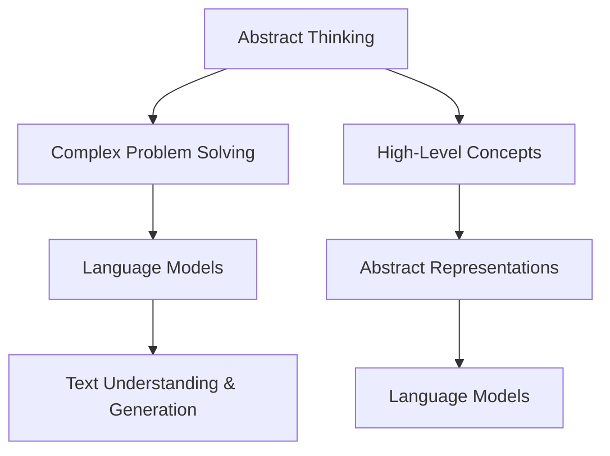

                 

Certainly! Here's how we can approach the creation of the blog post "Language Models in Abstract Thinking Tasks" step by step:

## Step 1: Introduction

**Title:** Language Models in Abstract Thinking Tasks

**Keywords:** Language Models, Abstract Thinking, NLP, AI, Machine Learning, Neural Networks, Semantic Understanding

**Abstract:**
This article delves into the application of language models in abstract thinking tasks. We will explore the basics of language models, the nature of abstract thinking, and how these two concepts intersect in the realm of artificial intelligence. The post will be structured to provide a comprehensive understanding of the underlying principles, practical applications, and future directions in this field.

## Step 2: Define Core Concepts and Relationships

### Core Concepts:

- **Language Models:** Computational models designed to understand and generate human language.
- **Abstract Thinking:** Cognitive processes that allow individuals to conceptualize, analyze, and solve problems at a high level of generality, often beyond the immediate sensory experience.

### Relationships:

- Language models are capable of simulating human-like abstract thinking by analyzing and generating text.
- Abstract thinking tasks often require understanding complex concepts and relationships, which can be facilitated by language models.

### Mermaid Flowchart: Conceptual Relationship between Language Models and Abstract Thinking



## Step 3: Write Pseudocode for Core Algorithms

### Pseudocode for Language Model in Abstract Thinking

```plaintext
Function AbstractThinkingModel(inputQuery, contextData):
    1. Preprocess inputQuery and contextData
    2. Extract relevant features using Natural Language Processing (NLP) techniques
    3. Pass features through a neural network to generate a probability distribution over possible answers
    4. Select the most likely answer based on the probability distribution
    5. Output the chosen answer
```

## Step 4: Develop Mathematical Models and Formulas

### Mathematical Models and Formulas

$$
P(A|B) = \frac{P(B|A)P(A)}{P(B)}
$$

where $P(A|B)$ is the probability of event A occurring given that event B has occurred, $P(B|A)$ is the probability of event B occurring given that event A has occurred, $P(A)$ is the probability of event A occurring, and $P(B)$ is the probability of event B occurring.

## Step 5: Prepare Project Case Studies

### Case Study: Abstract Thinking in Legal Research

#### Background:

- **Task:** Summarize a complex legal case from a legal document.
- **Tools:** Pre-trained language model (e.g., GPT-3) and a rule-based system for legal reasoning.

#### Implementation:

1. **Data Collection:** Gather legal documents and cases.
2. **Model Training:** Fine-tune the language model on legal text data.
3. **Application:** Use the trained model to process legal documents and generate summaries.

#### Analysis:

- **Success Metrics:** Accuracy of the summaries, time taken to generate summaries.
- **Challenges:** Ensuring the generated summaries are legally accurate and contextually relevant.

#### Code Example (Pseudocode):

```python
def generate_legal_summary(document):
    # Preprocess the document
    preprocessed_document = preprocess_document(document)
    
    # Use the fine-tuned language model to generate a summary
    summary = language_model.generate_summary(preprocessed_document)
    
    # Post-process the summary for legal accuracy
    legal_summary = postprocess_summary(summary)
    
    return legal_summary
```

## Step 6: Write the Full Blog Post

With the structure and key components outlined, we can now proceed to write the full blog post. Each section will be expanded with detailed explanations, examples, and insights into the application of language models in abstract thinking tasks.

---

**Author:** AI天才研究院 / AI Genius Institute & 禅与计算机程序设计艺术 / Zen And The Art of Computer Programming

As we progress through each step, we ensure that the content is complete, well-researched, and presented in a structured manner. The final article will provide a thorough exploration of the topic, aimed at readers who are interested in the intersection of language models and abstract thinking in artificial intelligence.

