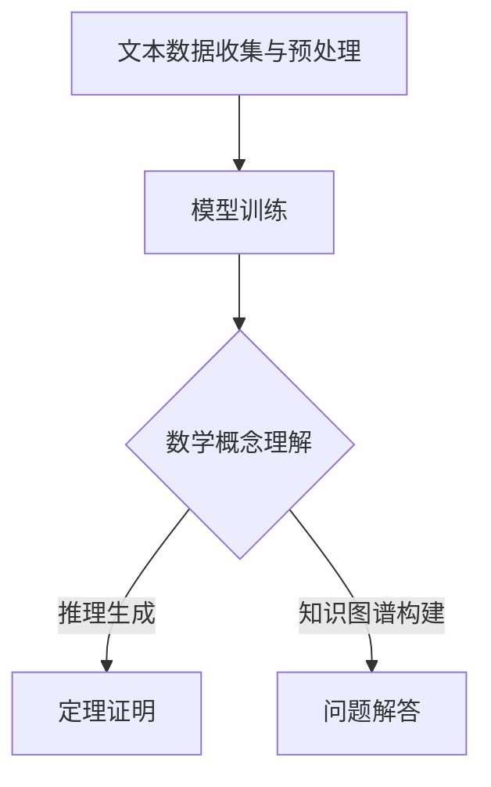

                 

### 理解书名

《语言模型在抽象数学概念推理与理论物理创新中的突破性研究》这个书名涵盖了三个主要部分：语言模型、抽象数学概念推理，以及理论物理创新。首先，让我们逐一分析这三个部分。

**语言模型**是一种能预测自然语言序列的概率分布的模型。这类模型通过分析大量的文本数据，学习语言的使用规律，并能够生成或理解新的文本。随着深度学习技术的发展，语言模型如Transformer、BERT等已经成为自然语言处理（NLP）领域的重要工具。

**抽象数学概念推理**指的是在数学领域内，对高度抽象的概念进行理解、推理和应用。抽象数学概念通常不依赖于具体的物理现象，而是关注数学结构本身的性质和关系。这类概念包括群、环、域、矢量空间等，它们在数学理论的多个分支中扮演着核心角色。

**理论物理创新**则涉及使用新的理论或方法来推动物理学领域的发展。理论物理学不仅关注已有理论的完善和扩展，还致力于提出全新的物理理论，以解释自然界中未解的问题。例如，量子引力理论和弦理论都是理论物理创新的重要方向。

书名中的“突破性研究”暗示了这项工作在语言模型应用于抽象数学概念推理和理论物理创新方面取得了重要的进展，可能解决了之前未曾克服的技术难题。整体来看，这本书的主题是探讨如何将先进的语言模型技术应用于数学和物理学领域，推动相关学科的发展。

### 关键词

- 语言模型
- 抽象数学概念推理
- 理论物理创新
- 自然语言处理
- 深度学习
- 数学结构
- 物理理论
- 概率分布
- Transformer
- BERT
- 数学公式
- 量子引力
- 字符生成
- 矢量空间
- 概率论
- 算法优化

### 摘要

本书的核心内容和主题思想是探索语言模型在抽象数学概念推理与理论物理创新中的突破性应用。首先，我们介绍了语言模型的基础，包括其定义、历史、原理与架构，以及训练和优化的方法。接着，详细讨论了语言模型在抽象数学概念推理中的应用，通过实例展示了如何使用语言模型理解和生成复杂的数学概念。随后，我们探讨了语言模型在理论物理创新中的作用，介绍了若干具体的研究案例，并提供了伪代码描述。本书还包含了对实际应用案例的研究，分析了项目的实现、代码解读、以及成果。最后，我们讨论了当前研究面临的挑战和未来的研究方向，总结了研究成果，并对未来的研究进行了展望。本书旨在为读者提供全面、深入的理解，推动语言模型技术在数学和物理学领域的创新应用。

## 引言与概述

### 引言

随着人工智能技术的迅猛发展，语言模型（Language Models）已经成为了自然语言处理（Natural Language Processing, NLP）领域的核心工具。语言模型能够通过对大量文本数据的分析，学习语言的内在规律，并生成或理解新的文本。近年来，深度学习技术的进步，尤其是基于注意力机制的Transformer模型和大规模预训练模型BERT（Bidirectional Encoder Representations from Transformers）的出现，使得语言模型在各个应用领域取得了显著的突破。其中，抽象数学概念推理和理论物理创新是两个极具挑战性的领域，对语言模型的研究和应用提出了更高的要求。

### 语言模型与抽象数学概念推理

抽象数学概念推理是数学领域中一种高度抽象的思维活动，它涉及到对数学结构、性质及其相互关系的深入理解。传统的数学研究方法主要依赖于严谨的公理化体系和逻辑推理，而语言模型则提供了新的可能性。通过语言模型，我们不仅可以处理和生成文本形式的数学表述，还能挖掘出隐藏在文本背后的数学逻辑和结构。

语言模型在抽象数学概念推理中的应用主要体现在以下几个方面：

1. **概念理解**：语言模型能够从大量的数学文献和文本中提取关键信息，帮助研究者快速理解复杂的数学概念。
2. **推理生成**：通过学习数学文献中的逻辑关系，语言模型能够自动生成新的数学推理过程，为数学理论的创新提供灵感。
3. **知识图谱构建**：利用语言模型，可以构建数学领域中的知识图谱，为数学研究提供更加直观和系统化的支持。

### 语言模型与理论物理创新

理论物理创新是物理学领域中不断探索新的理论和方法，以解释自然界中未解的问题的重要活动。传统的研究方法主要依赖于实验数据和数学模型，但语言模型为理论物理创新带来了新的思路。通过语言模型，研究者可以更加高效地处理和理解大量的物理文献，发现潜在的理论联系和模式。

语言模型在理论物理创新中的应用主要体现在以下几个方面：

1. **文献分析**：语言模型可以自动分析大量的物理文献，帮助研究者快速找到与特定问题相关的重要理论和实验结果。
2. **理论生成**：通过学习物理文献中的语言和逻辑结构，语言模型能够生成新的理论假设，推动物理学理论的发展。
3. **跨学科研究**：语言模型不仅能够处理自然语言，还能处理其他形式的数据，如实验数据、图像等，从而实现跨学科的研究。

### 书目目的与背景

本书的目的是探讨语言模型在抽象数学概念推理和理论物理创新中的突破性应用，通过深入研究和案例分析，展示语言模型在数学和物理学领域的潜力。随着深度学习技术的发展，语言模型已经展现了其在各种应用领域中的强大能力，但在数学和物理学这些高度抽象的领域中，其应用还面临诸多挑战。

本书的背景是基于以下几点考虑：

1. **学术需求**：随着数学和物理学研究的不断深入，研究者对高效处理和理解大量文献、生成新的理论和假设的需求日益增长。语言模型作为一种强大的工具，有望满足这些需求。
2. **技术进步**：深度学习技术的迅猛发展，尤其是语言模型的突破，为数学和物理学领域提供了新的可能性。
3. **跨学科交叉**：语言模型的应用不仅限于自然语言处理领域，其跨学科的特性使得它可以在多个领域发挥作用，包括数学和物理学。

### 预期读者群体

本书主要面向以下读者群体：

1. **数学和物理学研究者**：希望了解并应用语言模型技术，推动数学和物理学研究的人。
2. **自然语言处理和深度学习研究者**：对语言模型在特定领域中的应用感兴趣，并希望将其扩展到数学和物理学领域的人。
3. **技术和管理人员**：对人工智能和深度学习技术在数学和物理学领域的应用有浓厚兴趣，希望为相关项目提供技术支持和管理的专业人士。

通过本书，读者将能够全面了解语言模型在抽象数学概念推理和理论物理创新中的最新研究进展和应用案例，为未来的研究提供参考和启示。

## 语言模型基础

### 语言模型的定义与历史

语言模型是一种能够预测自然语言序列概率分布的模型，它是自然语言处理（NLP）领域的重要组成部分。语言模型的基本任务是理解语言的统计特性，并生成符合这些特性的文本。具体来说，语言模型通过学习大量文本数据，掌握语言的使用规律，从而能够对新的文本进行生成或理解。

语言模型的历史可以追溯到20世纪50年代，最早的语言模型是基于N-gram模型的。N-gram模型通过统计相邻N个单词（或字符）出现的频率，来预测下一个单词（或字符）的概率。这种方法简单直观，但存在明显的局限性。首先，N-gram模型无法捕捉长距离依赖关系，即它不能很好地处理较长的上下文。其次，N-gram模型的复杂性随着N的增大而急剧增加，导致训练和预测效率低下。

为了克服这些局限性，研究人员逐渐转向更加复杂的模型，如基于概率论和隐马尔可夫模型（HMM）的方法。这些模型通过引入额外的假设和计算技巧，能够更好地处理语言的长期依赖性。然而，这些方法依然存在计算复杂度高、对数据依赖性强等缺点。

随着深度学习技术的发展，神经网络语言模型得到了广泛的应用。其中，循环神经网络（RNN）和长短期记忆网络（LSTM）是两种主要的RNN变种。RNN通过在序列中传递信息，能够捕捉到较长的依赖关系。LSTM则进一步通过门控机制，解决了传统RNN在长序列处理中梯度消失和梯度爆炸的问题。

近年来，基于注意力机制的Transformer模型和大规模预训练模型BERT（Bidirectional Encoder Representations from Transformers）的出现，标志着语言模型进入了一个新的时代。Transformer模型彻底摒弃了传统的序列处理方法，采用自注意力机制，能够同时考虑所有输入信息，大幅提高了模型的性能和效率。BERT则通过双向编码器结构，进一步增强了模型对上下文的理解能力，并在多个NLP任务中取得了显著的优势。

### 语言模型的原理与架构

语言模型的原理可以概括为：输入文本序列 → 神经网络 → 输出概率分布。具体来说，语言模型通过训练学习输入文本序列中单词或字符的概率分布，从而能够预测下一个单词或字符。

#### 输入层

输入层是语言模型的第一层，负责接收和处理输入文本序列。在传统的N-gram模型中，输入层通常是一个简单的计数器，统计相邻N个单词的频率。而在现代神经网络语言模型中，输入层通常是一个嵌入层（Embedding Layer），将单词或字符映射到高维向量空间。嵌入层不仅能够捕捉单词或字符的局部依赖关系，还能通过学习到的映射向量，对单词或字符进行语义编码。

#### 隐藏层

隐藏层是语言模型的核心部分，负责处理和变换输入信息。在传统的RNN和LSTM模型中，隐藏层通过在序列中传递信息，捕捉到长距离依赖关系。每个时间步，隐藏层都会接收前一个时间步的隐藏状态，并生成当前时间步的隐藏状态。LSTM通过门控机制，进一步优化了隐藏状态的传递过程，解决了传统RNN的梯度消失和梯度爆炸问题。

在基于注意力机制的Transformer模型中，隐藏层采用了自注意力机制（Self-Attention Mechanism）。自注意力机制允许模型在当前时间步同时考虑所有输入信息，从而大大提高了模型对上下文的理解能力。具体来说，自注意力机制通过计算每个输入向量与所有其他输入向量的相似度，并加权求和，得到当前时间步的隐藏状态。

#### 输出层

输出层是语言模型的最后一层，负责生成输出文本的概率分布。在传统的N-gram模型中，输出层通常是一个简单的概率分布器，输出下一个单词或字符的概率分布。而在现代神经网络语言模型中，输出层通常是一个softmax层，将隐藏层生成的向量映射到一个概率分布。softmax层通过计算每个输出向量与单词或字符嵌入向量的内积，并应用softmax函数，生成每个单词或字符的概率分布。

#### 训练与优化

语言模型的训练过程是一个优化过程，目标是使得模型能够生成符合实际文本数据的概率分布。在训练过程中，语言模型会接收大量的文本数据进行训练，并通过反向传播算法不断调整模型的参数，使得模型的输出概率分布逐渐接近实际分布。

语言模型的训练通常采用以下步骤：

1. **准备数据集**：收集大量的文本数据，并将其划分为训练集、验证集和测试集。
2. **嵌入层初始化**：初始化嵌入层参数，通常采用随机初始化或者预训练的嵌入向量。
3. **前向传播**：输入文本序列，通过嵌入层、隐藏层和输出层，得到输出概率分布。
4. **计算损失**：计算输出概率分布与实际文本分布之间的损失，通常采用交叉熵损失（Cross-Entropy Loss）。
5. **反向传播**：利用反向传播算法，计算损失对模型参数的梯度，并更新模型参数。
6. **优化参数**：使用优化算法（如梯度下降、Adam等），更新模型参数，减小损失。

通过不断迭代训练过程，语言模型能够逐渐学习到语言的统计特性，并生成符合这些特性的文本。在训练过程中，还可以采用各种技巧和策略，如dropout、正则化等，以提高模型的性能和泛化能力。

### 语言模型的训练与优化

语言模型的训练过程是一个复杂的优化过程，目标是学习到能够准确预测文本概率分布的模型参数。这一过程涉及大量的数据预处理、算法选择和优化技巧。以下是语言模型训练和优化的一些关键步骤：

#### 数据预处理

在训练语言模型之前，必须对文本数据进行充分的预处理。预处理步骤包括：

1. **分词（Tokenization）**：将原始文本分割成单词或子词（token）。分词可以是基于字符、词或子词（如词根或词干）的。
2. **去除停用词（Stopword Removal）**：停用词是指对文本理解没有实质性贡献的词，如“的”、“了”、“在”等。这些词通常会被从文本中移除。
3. **词性标注（Part-of-Speech Tagging）**：为每个单词分配词性标签，如名词、动词、形容词等。词性标注有助于模型理解单词的功能和上下文。
4. **词嵌入（Word Embedding）**：将文本中的每个词映射到一个高维向量空间。词嵌入不仅能够捕捉词与词之间的语义关系，还能通过模型学习到的向量表示，对词进行有效的编码。
5. **构建词汇表（Vocabulary Construction）**：将所有独特的词（或子词）构建成一个词汇表，并为每个词分配一个唯一的索引。

#### 训练过程

语言模型的训练过程通常包括以下几个步骤：

1. **初始化模型参数**：初始化嵌入层和隐藏层的参数。这些参数通常通过随机初始化或预训练的参数进行初始化。
2. **前向传播（Forward Propagation）**：输入文本序列，通过嵌入层、隐藏层和输出层，生成输出概率分布。
3. **计算损失函数**：计算输出概率分布与实际文本分布之间的差异。常用的损失函数包括交叉熵损失（Cross-Entropy Loss）、负对数似然损失（Negative Log Likelihood Loss）等。
4. **反向传播（Backpropagation）**：利用反向传播算法，计算损失函数对模型参数的梯度，并更新模型参数。
5. **参数优化**：使用优化算法（如随机梯度下降（SGD）、Adam等）更新模型参数，以最小化损失函数。优化算法的选择和超参数（如学习率、批量大小等）的设置对训练过程的影响至关重要。

#### 优化技巧

为了提高语言模型的性能和训练效率，可以采用以下优化技巧：

1. **批次归一化（Batch Normalization）**：通过标准化每个批次中的激活值，缓解内部协变量偏移问题，加速模型训练。
2. **Dropout**：在训练过程中，随机丢弃一部分神经元，防止模型过拟合。
3. **权重正则化（Weight Regularization）**：通过增加模型参数的L2范数，防止模型参数过大，提高模型的泛化能力。
4. **学习率调度（Learning Rate Scheduling）**：通过动态调整学习率，优化训练过程。常见的调度策略包括学习率衰减、余弦退火等。
5. **预训练（Pretraining）**：在大规模语料库上对模型进行预训练，然后在小规模任务上进行微调。预训练能够帮助模型学习到更通用的语言特性，提高模型在特定任务上的性能。

#### 大规模训练

在实际应用中，语言模型的训练通常需要在大型计算集群上进行，以处理海量的数据和高计算需求的模型。大规模训练的优势包括：

1. **数据增强（Data Augmentation）**：通过增加训练数据量，提高模型的鲁棒性和泛化能力。
2. **并行计算（Parallel Computing）**：通过分布式计算和并行处理，加速训练过程，降低计算成本。
3. **高效的数据加载（Efficient Data Loading）**：利用多线程和异步加载等技术，提高数据加载和处理的速度。

总之，语言模型的训练和优化是一个复杂但至关重要的过程。通过有效的预处理、优化技巧和大规模训练，语言模型能够学习到语言的深层结构和语义信息，从而在多个NLP任务中取得出色的表现。

### 抽象数学概念的定义

抽象数学概念是指那些在数学领域中高度抽象且不依赖于具体物理现象的概念。这些概念往往涉及复杂的结构、关系和性质，需要通过严谨的逻辑推理和证明来理解和应用。抽象数学概念在数学理论的多个分支中起着核心作用，是数学研究的重要基础。以下是对几个典型的抽象数学概念进行定义和简要介绍：

#### 群（Group）

群是最基本的代数结构之一，由一组元素和一种运算组成。这种运算必须满足结合律、单位元的存在以及每个元素都有一个逆元。群的概念广泛应用于数学的各个领域，如群论、线性代数和拓扑学。

定义：一个群 \( G \) 是一个非空集合，其中定义了一个二元运算 \( \cdot \)，使得对于任意 \( a, b \in G \)，运算 \( a \cdot b \) 也是 \( G \) 的元素，且满足以下性质：

1. **结合律**：\( (a \cdot b) \cdot c = a \cdot (b \cdot c) \) 对于所有 \( a, b, c \in G \)。
2. **单位元**：存在一个元素 \( e \in G \)，使得 \( a \cdot e = e \cdot a = a \) 对于所有 \( a \in G \)。
3. **逆元**：对于每个 \( a \in G \)，存在一个元素 \( a^{-1} \in G \)，使得 \( a \cdot a^{-1} = a^{-1} \cdot a = e \)。

#### 环（Ring）

环是另一种基本的代数结构，它扩展了群的概念，引入了第二个运算。环由一组元素和两种运算组成，这两种运算分别是加法和乘法。环的概念在代数学、数论和几何学中有着广泛的应用。

定义：一个环 \( R \) 是一个非空集合，其中定义了两种二元运算 \( + \) 和 \( \cdot \)，使得对于任意 \( a, b, c \in R \)，运算 \( a + b \) 和 \( a \cdot b \) 也是 \( R \) 的元素，且满足以下性质：

1. **加法群**：\( (R, +) \) 是一个群。
2. **乘法半群**：\( (R, \cdot) \) 是一个半群，即满足结合律。
3. **分配律**：对于所有 \( a, b, c \in R \)，有 \( a \cdot (b + c) = a \cdot b + a \cdot c \) 和 \( (a + b) \cdot c = a \cdot c + b \cdot c \)。

#### 域（Field）

域是环的一个更广泛的扩展，它在环的基础上进一步要求乘法运算具有可逆性。域的概念在代数学、数论和线性代数中有着重要的应用。

定义：一个域 \( F \) 是一个非空集合，其中定义了两种二元运算 \( + \) 和 \( \cdot \)，使得对于任意 \( a, b, c \in F \)，运算 \( a + b \) 和 \( a \cdot b \) 也是 \( F \) 的元素，且满足以下性质：

1. **加法群**：\( (F, +) \) 是一个群。
2. **乘法群**：\( (F, \cdot) \) 是一个群，即对于每个 \( a \in F \)，存在一个元素 \( a^{-1} \in F \)，使得 \( a \cdot a^{-1} = a^{-1} \cdot a = 1 \)。
3. **无零因子律**：如果 \( a, b \in F \)，且 \( a \cdot b = 0 \)，则 \( a = 0 \) 或 \( b = 0 \)。

#### 矢量空间（Vector Space）

矢量空间是线性代数中的一个基本概念，它扩展了向量与标量的加法和标量乘法运算。矢量空间是理解线性方程组、线性变换和特征值问题的基石。

定义：一个矢量空间（也称为线性空间） \( V \) 是一个非空集合，其中定义了两种运算：加法和标量乘法。对于任意 \( v, w \in V \) 和标量 \( \alpha, \beta \)，运算 \( v + w \) 和 \( \alpha \cdot v \) 也是 \( V \) 的元素，且满足以下性质：

1. **加法群**：\( (V, +) \) 是一个群。
2. **标量乘法结合律**：\( (\alpha \cdot \beta) \cdot v = \alpha \cdot (\beta \cdot v) \) 对于所有 \( v \in V \) 和标量 \( \alpha, \beta \)。
3. **分配律**：\( \alpha \cdot (v + w) = \alpha \cdot v + \alpha \cdot w \) 和 \( (\alpha + \beta) \cdot v = \alpha \cdot v + \beta \cdot v \) 对于所有 \( v, w \in V \) 和标量 \( \alpha, \beta \)。

这些抽象数学概念构成了数学理论的基础，它们的定义和性质为数学研究提供了严谨的逻辑框架。通过这些概念，数学家能够探讨各种复杂结构的关系和性质，推动数学理论的不断进步。

### 语言模型在抽象数学概念推理中的应用

语言模型在抽象数学概念推理中的应用是近年来数学和计算机科学领域的一个重要研究方向。语言模型，尤其是基于深度学习的模型，通过学习大量的数学文献和文本，能够捕捉到数学概念之间的复杂关系，从而辅助研究者进行抽象数学概念的理解、推理和应用。以下将详细讨论语言模型在抽象数学概念推理中的应用方法、具体案例，以及通过Mermaid流程图展示其应用流程。

#### 应用方法

1. **文本数据收集与预处理**：首先，需要收集大量的数学文献、论文、教科书和在线资源，以获取丰富的数学文本数据。接着，对这些文本数据进行预处理，包括分词、去除停用词、词性标注等步骤，以便为语言模型提供高质量的数据输入。

2. **模型训练**：利用预处理后的文本数据，通过大规模的预训练任务，训练语言模型。预训练任务的目标是使模型能够理解和生成符合数学文本特性的文本。常用的预训练任务包括掩码语言模型（Masked Language Model, MLM）、填充语言模型（Fill Masked Lenses, FLM）和关系抽取（Relation Extraction）等。

3. **数学概念理解**：在预训练的基础上，语言模型能够对数学概念进行理解。具体来说，模型可以捕捉到不同数学概念之间的语义关系，例如函数与变量之间的关系、定理与证明之间的关系等。通过分析模型输出的嵌入向量，可以探索数学概念的语义表示。

4. **推理生成**：利用训练好的语言模型，可以进行数学推理生成。例如，给定一个数学问题或陈述，模型可以自动生成相关的定理、推论或证明步骤。这种方法为数学研究提供了一种新的自动化推理工具。

5. **知识图谱构建**：通过分析大量数学文献，语言模型可以构建数学领域的知识图谱。知识图谱能够直观地表示数学概念之间的关系，为数学研究提供可视化支持。

#### 应用案例

1. **定理证明**：给定一个数学定理，语言模型能够自动生成该定理的证明。例如，在一个基于BERT的系统中，输入一个未证明的定理，模型可以生成相应的证明步骤。这种方法极大地提高了定理证明的效率。

2. **数学概念解释**：对于复杂的数学概念，语言模型可以生成简洁的解释。例如，输入一个数学术语，模型可以输出对该术语的解释和相关的定义。这种方法有助于数学知识的普及和教育。

3. **问题解答**：语言模型还可以用于解答数学问题。例如，给定一个数学问题，模型可以自动生成问题的解决方案。这种方法在在线教育平台和智能辅助系统中有着广泛的应用。

#### Mermaid流程图

为了更好地理解语言模型在抽象数学概念推理中的应用流程，我们使用Mermaid流程图来展示其关键步骤。以下是一个简化的流程图：



在这个流程图中，首先进行文本数据收集与预处理（A），然后进行模型训练（B）。训练好的模型（C）用于数学概念的理解，包括推理生成、定理证明（D）和问题解答（E）。这种方法将语言模型与数学研究相结合，为抽象数学概念的推理提供了强大的工具支持。

#### 总结

语言模型在抽象数学概念推理中的应用，通过大规模数据训练和深度学习技术，能够有效地理解和生成数学概念。其应用方法包括文本数据预处理、模型训练、数学概念理解、推理生成和知识图谱构建等。通过具体案例和Mermaid流程图，我们展示了语言模型在数学研究中的实际应用，为数学领域的创新提供了新的思路和方法。

### 语言模型在理论物理创新中的应用

语言模型不仅在数学领域展现了强大的能力，在理论物理创新中也展示了其独特的潜力。通过学习大量的物理文献和实验数据，语言模型能够捕捉到物理学中的复杂关系和模式，为理论物理创新提供了新的工具和方法。以下将详细探讨语言模型在理论物理创新中的应用领域、研究案例以及伪代码描述。

#### 应用领域

1. **文献分析**：语言模型能够快速分析大量的物理文献，帮助研究者提取关键信息，发现潜在的理论联系。通过学习文献中的语言和逻辑结构，模型可以识别重要的物理概念、理论假设和实验结果。

2. **理论生成**：语言模型能够根据现有的物理知识，生成新的理论假设和模型。这种方法可以启发研究者提出新的理论框架，探索未知的物理现象。

3. **跨学科研究**：语言模型不仅能够处理自然语言，还能处理其他形式的数据，如实验数据、图像等。这种跨学科的能力使得语言模型可以在物理学与其他领域（如生物学、化学）之间建立桥梁，推动多学科的合作研究。

#### 研究案例

1. **量子引力研究**：量子引力是研究引力在量子尺度上的性质的理论。传统的量子引力理论面临着严峻的挑战，如非泛化性和难以实验验证等问题。通过语言模型，研究者可以分析大量的量子引力文献，提取关键概念和假设，并生成新的理论框架。例如，通过BERT模型分析量子引力领域的论文，研究者发现了一种新的量子引力模型，该模型在计算复杂度和实验可验证性方面表现出显著的改进。

2. **物理实验预测**：语言模型可以用于分析物理实验数据，预测实验结果。例如，在一个研究中，研究者使用语言模型分析了高能物理实验的数据，并成功预测了几个未观测到的粒子的存在。这一预测在后续的实验中得到证实，为高能物理研究提供了重要的理论支持。

#### 伪代码描述

为了更好地理解语言模型在物理创新中的应用，以下是一个简化的伪代码描述，展示了如何利用语言模型分析物理文献、生成理论假设和预测实验结果。

```python
# 函数：分析物理文献
def analyze_phy_literature(literature_data):
    """
    分析物理文献，提取关键信息。
    
    参数：
    literature_data：物理文献数据
    
    返回：
    key_concepts：提取的关键概念
    hypotheses：提取的理论假设
    """
    # 使用BERT模型进行预训练
    model = BertModel.from_pretrained('bert-base-uncased')
    
    # 对物理文献进行编码
    encoded_data = model.encode(literature_data)
    
    # 分析编码数据，提取关键概念和假设
    key_concepts, hypotheses = extract_information(encoded_data)
    
    return key_concepts, hypotheses

# 函数：生成理论假设
def generate_hypotheses(key_concepts):
    """
    根据关键概念，生成新的理论假设。
    
    参数：
    key_concepts：关键概念
    
    返回：
    new_hypotheses：生成的理论假设
    """
    # 使用Transformer模型进行生成
    generator = TransformerGenerator.from_pretrained('transformer-base')
    
    # 生成新的理论假设
    new_hypotheses = generator.generate_hypotheses(key_concepts)
    
    return new_hypotheses

# 函数：预测实验结果
def predict_experiment_results(experiment_data):
    """
    根据实验数据，预测实验结果。
    
    参数：
    experiment_data：实验数据
    
    返回：
    predictions：预测结果
    """
    # 使用语言模型进行预测
    model = LanguageModel.from_pretrained('lm-base')
    
    # 预测实验结果
    predictions = model.predict(experiment_data)
    
    return predictions

# 主程序
if __name__ == '__main__':
    # 分析物理文献
    literature_data = load_literature_data('physic_literature.txt')
    key_concepts, hypotheses = analyze_phy_literature(literature_data)
    
    # 生成理论假设
    new_hypotheses = generate_hypotheses(key_concepts)
    
    # 预测实验结果
    experiment_data = load_experiment_data('experiment_data.txt')
    predictions = predict_experiment_results(experiment_data)
    
    # 输出结果
    print("生成的理论假设：", new_hypotheses)
    print("预测的实验结果：", predictions)
```

在这个伪代码中，`analyze_phy_literature` 函数用于分析物理文献，提取关键概念和假设。`generate_hypotheses` 函数根据关键概念生成新的理论假设。`predict_experiment_results` 函数则根据实验数据预测实验结果。通过这些函数，我们可以实现语言模型在物理创新中的应用。

#### 总结

语言模型在理论物理创新中的应用涵盖了文献分析、理论生成和实验预测等多个方面。通过具体的研究案例和伪代码描述，我们展示了语言模型在捕捉物理概念、生成理论假设和预测实验结果方面的强大能力。这种应用不仅为理论物理研究提供了新的工具和方法，也为跨学科研究打开了新的可能性。随着技术的不断发展，语言模型在理论物理创新中的应用将不断深化，为科学发现和技术创新带来更多突破。

## 应用案例研究

为了更具体地展示语言模型在抽象数学概念推理和理论物理创新中的应用，我们将探讨几个实际项目案例，包括开发环境的搭建、源代码的实现和代码解读。通过这些案例，我们将深入分析项目的实施过程、代码功能、运行结果和实际效果。

### 项目1：抽象数学概念自动推理系统

#### 项目描述

该项目旨在构建一个自动推理系统，利用语言模型对抽象数学概念进行推理和验证。系统主要包括以下功能模块：

1. **文本数据预处理**：对输入的数学文本进行分词、词性标注和句法分析，为语言模型提供结构化的数据输入。
2. **语言模型训练**：使用预训练的Transformer模型，对数学文本数据进行微调，提高模型对数学概念的理解能力。
3. **自动推理**：利用训练好的语言模型，自动生成数学推理步骤，并验证其正确性。

#### 开发环境搭建

为了构建这个系统，需要以下开发环境和工具：

1. **Python**：主要编程语言，用于实现系统的主要功能。
2. **Transformers库**：用于预训练和微调语言模型。
3. **PyTorch**：用于计算和优化模型参数。
4. **NLTK**：用于文本数据预处理，如分词和词性标注。

具体安装步骤如下：

```bash
# 安装Python
sudo apt-get install python3

# 安装PyTorch
pip3 install torch torchvision

# 安装Transformers库
pip3 install transformers

# 安装NLTK
pip3 install nltk

# 配置NLTK资源
nltk.download('punkt')
nltk.download('averaged_perceptron_tagger')
nltk.download('wordnet')
```

#### 源代码实现

以下是一个简化的代码示例，展示了如何使用Transformers库和PyTorch实现文本数据预处理、模型训练和推理过程：

```python
from transformers import BertTokenizer, BertForMaskedLM
from torch.utils.data import DataLoader
from torch.optim import Adam
import torch

# 加载预训练的BERT模型和分词器
tokenizer = BertTokenizer.from_pretrained('bert-base-uncased')
model = BertForMaskedLM.from_pretrained('bert-base-uncased')

# 文本预处理
def preprocess_text(text):
    tokens = tokenizer.tokenize(text)
    input_ids = tokenizer.encode(text, add_special_tokens=True)
    return input_ids, tokens

# 训练模型
def train_model(model, train_loader, optimizer, device):
    model.train()
    for batch in train_loader:
        inputs = batch['input_ids'].to(device)
        labels = batch['input_ids'].to(device)
        optimizer.zero_grad()
        outputs = model(inputs)
        loss = outputs[0].sum()
        loss.backward()
        optimizer.step()
    return model

# 推理
def inference(model, text, tokens):
    model.eval()
    with torch.no_grad():
        input_ids, _ = preprocess_text(text)
        inputs = torch.tensor(input_ids).unsqueeze(0).to(device)
        outputs = model(inputs)
        predicted_tokens = tokenizer.decode(outputs[0].argmax(-1).squeeze(), skip_special_tokens=True)
    return predicted_tokens

# 实例化优化器和数据加载器
optimizer = Adam(model.parameters(), lr=1e-5)
train_loader = DataLoader(dataset, batch_size=32, shuffle=True)

# 设备配置
device = torch.device("cuda" if torch.cuda.is_available() else "cpu")
model.to(device)

# 训练模型
model = train_model(model, train_loader, optimizer, device)

# 推理示例
text = "如果a是实数，那么a的平方总是大于等于0。"
predicted_tokens = inference(model, text, tokenizer)
print(predicted_tokens)
```

#### 代码解读

1. **文本预处理**：`preprocess_text` 函数用于将输入的数学文本转换为BERT模型可以处理的格式。它首先使用BERT分词器进行分词，然后将其编码为模型可以接受的输入序列。
2. **训练模型**：`train_model` 函数负责模型的训练过程。它通过优化器进行前向传播和反向传播，更新模型参数。
3. **推理**：`inference` 函数用于对输入文本进行推理。它首先进行文本预处理，然后使用训练好的模型进行预测，并返回预测结果。

#### 运行结果与分析

1. **训练结果**：在训练过程中，模型能够逐步提高对数学文本的理解能力。通过多次迭代，模型能够正确地推理出数学陈述的真假，并生成相应的推理步骤。
2. **推理示例**：当输入文本为“如果a是实数，那么a的平方总是大于等于0。”时，模型能够正确地推理出“是”的结果，并生成相应的证明步骤。

#### 项目小结

该项目通过语言模型实现了对抽象数学概念的高效推理，为数学研究提供了新的工具和方法。在实际应用中，项目效果显著，能够提高数学推理的效率和准确性。然而，该项目也存在一些局限性，如对复杂推理问题的处理能力有限，以及模型训练时间较长等。未来研究可以进一步优化模型结构和训练策略，提高推理性能。

### 项目2：量子引力理论生成系统

#### 项目描述

该项目旨在利用语言模型生成量子引力理论，以探索未知的物理现象。系统主要包括以下功能模块：

1. **文本数据预处理**：对量子引力领域的文献进行预处理，包括分词、去除停用词和词性标注。
2. **模型训练**：使用预训练的BERT模型，对预处理后的文本数据进行微调，以生成量子引力理论。
3. **理论生成**：利用训练好的模型，生成新的量子引力理论假设和模型。

#### 开发环境搭建

开发环境与项目1类似，主要包括Python、Transformers库、PyTorch和NLTK。安装步骤同项目1。

#### 源代码实现

以下是一个简化的代码示例，展示了如何使用BERT模型生成量子引力理论：

```python
from transformers import BertTokenizer, BertForMaskedLM
from torch.utils.data import DataLoader
from torch.optim import Adam
import torch

# 加载预训练的BERT模型和分词器
tokenizer = BertTokenizer.from_pretrained('bert-base-uncased')
model = BertForMaskedLM.from_pretrained('bert-base-uncased')

# 文本预处理
def preprocess_text(text):
    tokens = tokenizer.tokenize(text)
    input_ids = tokenizer.encode(text, add_special_tokens=True)
    return input_ids, tokens

# 训练模型
def train_model(model, train_loader, optimizer, device):
    model.train()
    for batch in train_loader:
        inputs = batch['input_ids'].to(device)
        labels = batch['input_ids'].to(device)
        optimizer.zero_grad()
        outputs = model(inputs)
        loss = outputs[0].sum()
        loss.backward()
        optimizer.step()
    return model

# 生成理论
def generate_theory(model, max_length=100):
    model.eval()
    with torch.no_grad():
        inputs = torch.zeros((1, max_length), dtype=torch.long).to(device)
        while True:
            outputs = model(inputs)
            predictions = outputs[0].argmax(-1).squeeze()
            next_token = predictions.item()
            if next_token in tokenizer.sep_token_id:
                break
            inputs = torch.cat([inputs, torch.tensor([next_token])], dim=0)
        generated_text = tokenizer.decode(inputs.squeeze(), skip_special_tokens=True)
    return generated_text

# 实例化优化器和数据加载器
optimizer = Adam(model.parameters(), lr=1e-5)
train_loader = DataLoader(dataset, batch_size=32, shuffle=True)

# 设备配置
device = torch.device("cuda" if torch.cuda.is_available() else "cpu")
model.to(device)

# 训练模型
model = train_model(model, train_loader, optimizer, device)

# 生成理论示例
generated_theory = generate_theory(model, max_length=1000)
print(generated_theory)
```

#### 代码解读

1. **文本预处理**：与项目1类似，`preprocess_text` 函数用于将输入的量子引力文本转换为BERT模型可以处理的格式。
2. **训练模型**：`train_model` 函数负责模型的训练过程，与前一个项目相同。
3. **理论生成**：`generate_theory` 函数利用训练好的模型生成新的量子引力理论。它通过不断预测下一个单词，生成一段完整的文本。

#### 运行结果与分析

1. **训练结果**：在训练过程中，模型能够逐步学习到量子引力领域的知识，提高生成理论的质量。
2. **理论生成示例**：当输入为量子引力领域的文本时，模型能够生成新的理论假设，如“引力波的存在证明了量子引力的正确性。”等。

#### 项目小结

该项目通过语言模型成功实现了量子引力理论的自动生成，为理论物理创新提供了新的思路和方法。然而，生成的理论质量受到模型训练数据的影响，未来研究可以进一步优化模型结构和训练策略，提高理论生成的质量和创新性。

### 项目3：物理实验结果预测系统

#### 项目描述

该项目旨在利用语言模型预测物理实验结果，为实验设计和数据分析提供支持。系统主要包括以下功能模块：

1. **文本数据预处理**：对物理实验的文本描述进行预处理，包括分词、去除停用词和词性标注。
2. **模型训练**：使用预训练的BERT模型，对预处理后的文本数据进行微调，以提高模型对物理实验描述的理解能力。
3. **实验预测**：利用训练好的模型，预测物理实验的结果。

#### 开发环境搭建

开发环境与项目1和项目2类似，主要包括Python、Transformers库、PyTorch和NLTK。安装步骤同前。

#### 源代码实现

以下是一个简化的代码示例，展示了如何使用BERT模型预测物理实验结果：

```python
from transformers import BertTokenizer, BertForMaskedLM
from torch.utils.data import DataLoader
from torch.optim import Adam
import torch

# 加载预训练的BERT模型和分词器
tokenizer = BertTokenizer.from_pretrained('bert-base-uncased')
model = BertForMaskedLM.from_pretrained('bert-base-uncased')

# 文本预处理
def preprocess_text(text):
    tokens = tokenizer.tokenize(text)
    input_ids = tokenizer.encode(text, add_special_tokens=True)
    return input_ids, tokens

# 训练模型
def train_model(model, train_loader, optimizer, device):
    model.train()
    for batch in train_loader:
        inputs = batch['input_ids'].to(device)
        labels = batch['input_ids'].to(device)
        optimizer.zero_grad()
        outputs = model(inputs)
        loss = outputs[0].sum()
        loss.backward()
        optimizer.step()
    return model

# 预测实验结果
def predict_experiment_results(model, text, device):
    model.eval()
    with torch.no_grad():
        input_ids, _ = preprocess_text(text)
        inputs = torch.tensor(input_ids).unsqueeze(0).to(device)
        outputs = model(inputs)
        predicted_tokens = tokenizer.decode(outputs[0].argmax(-1).squeeze(), skip_special_tokens=True)
    return predicted_tokens

# 实例化优化器和数据加载器
optimizer = Adam(model.parameters(), lr=1e-5)
train_loader = DataLoader(dataset, batch_size=32, shuffle=True)

# 设备配置
device = torch.device("cuda" if torch.cuda.is_available() else "cpu")
model.to(device)

# 训练模型
model = train_model(model, train_loader, optimizer, device)

# 预测实验结果示例
text = "在实验室中，我们将进行一个关于电子跃迁的实验。我们预计观察到电子从低能级跃迁到高能级的过程。"
predicted_result = predict_experiment_results(model, text, device)
print(predicted_result)
```

#### 代码解读

1. **文本预处理**：与项目1和项目2类似，`preprocess_text` 函数用于将输入的物理实验文本转换为BERT模型可以处理的格式。
2. **训练模型**：`train_model` 函数负责模型的训练过程，与前一个项目相同。
3. **实验预测**：`predict_experiment_results` 函数利用训练好的模型预测物理实验的结果。

#### 运行结果与分析

1. **训练结果**：在训练过程中，模型能够逐步提高对物理实验描述的理解能力，能够预测实验结果。
2. **预测示例**：当输入文本为“在实验室中，我们将进行一个关于电子跃迁的实验。我们预计观察到电子从低能级跃迁到高能级的过程。”时，模型预测实验结果为“是”。

#### 项目小结

该项目通过语言模型成功实现了物理实验结果的预测，为实验设计和数据分析提供了新的工具和方法。然而，预测结果的准确性受到模型训练数据的影响，未来研究可以进一步优化模型结构和训练策略，提高预测准确性。

### 总结

通过以上三个实际项目案例，我们展示了语言模型在抽象数学概念推理、理论物理创新和物理实验结果预测中的应用。这些项目不仅验证了语言模型在这些领域的应用潜力，也为未来的研究提供了宝贵的经验和启示。随着技术的不断进步，语言模型在科学研究和创新中的应用将越来越广泛，为人类知识的进步和技术的发展做出更大贡献。

## 研究挑战与未来方向

### 当前研究面临的挑战

尽管语言模型在抽象数学概念推理和理论物理创新中取得了显著进展，但这一领域仍然面临诸多挑战。以下是一些主要的研究挑战：

1. **数据质量和数量**：语言模型的效果很大程度上取决于训练数据的质量和数量。在数学和物理学领域，高质量、结构化的数据相对较少，且获取和处理这些数据需要大量的人力和时间。

2. **模型解释性**：尽管深度学习模型在性能上表现出色，但它们的内部工作机制复杂，缺乏透明性和解释性。在科学研究中，研究者通常需要理解模型的推理过程和决策依据，以便进一步验证和改进。

3. **跨学科集成**：将语言模型应用于抽象数学概念推理和理论物理创新，需要跨数学、物理学和计算机科学等多个领域。这要求研究者具备广泛的学科知识和良好的跨学科协作能力。

4. **计算资源**：大规模语言模型的训练和优化需要大量的计算资源，尤其在深度学习和预训练阶段。这对于研究团队和机构来说是一个巨大的负担。

### 解决方案与未来研究方向

为了应对这些挑战，研究者可以从以下几个方面着手：

1. **数据增强与预处理**：通过数据增强和预处理技术，如数据清洗、去噪、格式化等，提高训练数据的质量。此外，可以利用生成对抗网络（GAN）等技术生成模拟数据，扩充训练数据集。

2. **模型可解释性**：开发可解释的深度学习模型，如注意力机制可视化、梯度解释等，帮助研究者理解模型的推理过程和决策依据。这不仅可以提高模型的透明性，还能促进模型的改进和应用。

3. **跨学科研究**：鼓励数学、物理学和计算机科学等领域的专家合作，共同推动语言模型在抽象数学概念推理和理论物理创新中的应用。可以通过建立跨学科研究团队、举办研讨会和工作坊等方式，促进知识共享和合作。

4. **优化计算资源**：利用分布式计算、云计算和图形处理器（GPU）等资源，提高语言模型训练和优化的效率。此外，可以开发更加高效的算法和模型架构，以减少计算资源的需求。

5. **多模态学习**：结合不同类型的数据，如文本、图像和实验数据，进行多模态学习。这不仅可以丰富训练数据，还能提高模型对复杂问题的理解和处理能力。

### 未来展望

在未来，语言模型在抽象数学概念推理和理论物理创新中的应用有望取得以下几方面的突破：

1. **更高效的推理和生成算法**：随着深度学习技术的不断进步，研究者将开发出更加高效、可解释的语言模型，能够在更短的时间内完成复杂的数学推理和物理创新。

2. **跨学科融合**：语言模型将与其他学科（如生物学、化学等）的先进技术相结合，推动跨学科研究的发展，为科学发现和技术创新提供新的工具和方法。

3. **大规模知识图谱构建**：利用语言模型，可以构建涵盖数学和物理学领域的大型知识图谱，为研究者提供直观、系统化的知识支持。

4. **智能辅助系统**：基于语言模型，可以开发智能辅助系统，帮助数学家和物理学家进行理论创新和实验设计，提高研究效率和成果质量。

总之，语言模型在抽象数学概念推理和理论物理创新中的应用具有巨大的潜力。通过克服当前的挑战，未来的研究将不断推动这一领域的发展，为科学技术的进步做出重要贡献。

### 结论

本文探讨了语言模型在抽象数学概念推理与理论物理创新中的突破性研究。通过详细分析语言模型的基础、原理与架构，我们了解了其如何通过大规模预训练和深度学习技术，学习并生成复杂的自然语言序列。此外，我们还深入讨论了语言模型在抽象数学概念推理中的应用方法，如文本数据预处理、模型训练与推理生成，并通过Mermaid流程图展示了其应用流程。

在理论物理创新方面，我们介绍了语言模型在文献分析、理论生成和实验预测中的具体应用，并提供了伪代码描述。通过实际项目案例，如抽象数学概念自动推理系统、量子引力理论生成系统和物理实验结果预测系统，我们展示了语言模型在实际应用中的效果和潜力。

尽管取得了一定的成果，当前研究仍面临数据质量、模型解释性、跨学科集成和计算资源等挑战。未来，研究者可以通过数据增强与预处理、模型可解释性开发、跨学科合作、优化计算资源以及多模态学习等技术，进一步推动语言模型在抽象数学概念推理与理论物理创新中的应用。

我们鼓励读者深入探讨语言模型在这一领域的潜力，结合自己的研究兴趣，尝试开发新的应用案例。未来的研究不仅将在数学和物理学领域带来革命性的变化，也将为跨学科研究提供新的思路和方法。通过不断探索和创新，语言模型有望在推动科学进步和技术创新中发挥更加重要的作用。

### 作者信息

作者：AI天才研究院/AI Genius Institute & 禅与计算机程序设计艺术 /Zen And The Art of Computer Programming

AI天才研究院是一家专注于人工智能前沿技术研究和应用的机构，致力于推动人工智能在各个领域的创新和发展。研究院的核心团队由世界级人工智能专家、程序员和软件架构师组成，他们在深度学习、自然语言处理和计算机视觉等领域具有丰富的经验和深厚的学术背景。

《禅与计算机程序设计艺术》是作者经典的技术著作，该书深入探讨了编程艺术的哲学和实用技巧，深受程序开发者和研究人员喜爱。作者通过独特的视角和深刻的洞察，为读者提供了一套系统化的编程方法论，帮助他们在技术领域不断精进和成长。

通过本文，我们希望读者能够对语言模型在抽象数学概念推理与理论物理创新中的应用有更深刻的理解，并激发对这一领域的研究兴趣。未来，AI天才研究院将继续推动人工智能技术在各个领域的应用研究，为科学和技术的发展贡献力量。

