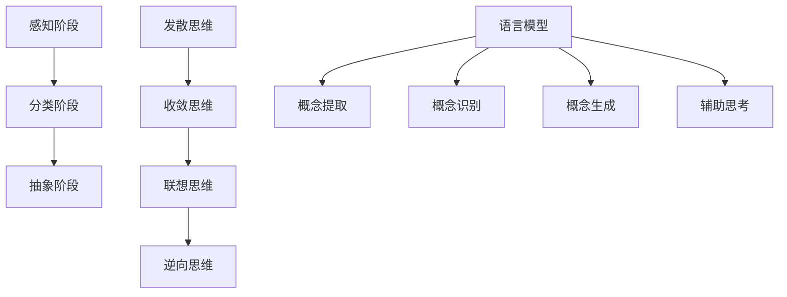

                 

### 文章标题

《语言模型在抽象概念形成与创造性思维培养中的能力评估研究》

### 关键词

- 语言模型
- 抽象概念形成
- 创造性思维
- 能力评估

### 摘要

本文旨在探讨语言模型在抽象概念形成与创造性思维培养中的能力评估。首先，介绍语言模型的基本原理及其在自然语言处理中的重要性。接着，深入分析抽象概念的形成机制，阐述创造性思维的核心要素及其培养方法。随后，讨论如何使用语言模型评估创造性思维的能力，并提供具体案例研究。最后，总结研究成果，并提出未来研究方向和实际应用建议。

---

## 第一部分：语言模型基础

### 第1章：语言模型概述

#### 1.1 语言模型的基本概念

语言模型（Language Model，简称LM）是自然语言处理（Natural Language Processing，简称NLP）中的一种核心技术。它是一种能够根据历史输入序列预测下一个单词或字符的概率分布的模型。语言模型的主要目的是使计算机能够理解和生成自然语言。

**定义与意义：**

语言模型是一种概率模型，它通过对大量文本数据的学习，捕捉语言中的统计规律，从而预测文本序列中的下一个元素。这一过程对于许多NLP任务至关重要，如文本生成、机器翻译、情感分析等。

#### 1.2 语言模型的历史与发展

语言模型的发展可以追溯到20世纪50年代，当时主要基于规则的方法。随着计算机性能的提高和大数据时代的到来，统计方法和基于神经网络的模型逐渐成为主流。以下是语言模型发展的几个重要阶段：

- **基于规则的方法**（1950s-1980s）：该方法依赖于人类编写的语法规则和词典，但无法处理复杂的语言现象。
- **统计模型**（1980s-1990s）：引入N-gram模型，通过统计相邻单词的频率来预测下一个单词。尽管N-gram模型简单有效，但存在局限性，如无法捕捉长距离依赖关系。
- **基于神经网络的模型**（2000s-2010s）：深度神经网络（DNN）和递归神经网络（RNN）的引入，使得语言模型能够捕捉更复杂的语言规律。
- **Transformer模型**（2017年至今）：Transformer模型的提出，彻底改变了语言模型的发展方向。基于注意力机制的Transformer模型在多项NLP任务中取得了卓越表现，如BERT、GPT等。

#### 1.3 语言模型的主要类型

根据学习策略的不同，语言模型可以分为以下几类：

- **N-gram模型**：基于相邻单词的统计规律，如一元模型（Unigram）、二元模型（Bigram）等。
- **统计语言模型**：基于概率论和统计学习理论，如隐马尔可夫模型（HMM）、条件随机场（CRF）等。
- **神经网络模型**：基于深度学习和神经网络，如循环神经网络（RNN）、长短期记忆网络（LSTM）、门控循环单元（GRU）、Transformer等。

### 第2章：语言模型的数学基础

#### 2.1 语言模型的概率论基础

概率论是语言模型构建的核心理论基础。在语言模型中，主要涉及到以下几种概率模型：

- **马尔可夫性质**：马尔可夫性质是指一个随机过程在给定当前状态下，其未来的状态概率仅依赖于当前状态，而与过去状态无关。
- **条件概率**：条件概率是指在某个事件已发生的条件下，另一个事件发生的概率。
- **贝叶斯定理**：贝叶斯定理是一种描述事件概率分布的公式，可以用来更新事件概率。

#### 2.2 语言模型的统计学习理论

统计学习理论是构建语言模型的重要工具。在统计学习中，主要关注以下问题：

- **特征选择**：从大量特征中选取对预测任务最有影响力的特征。
- **模型选择**：在多个模型中选择最优模型，以最小化预测误差。
- **模型训练**：通过训练数据集，调整模型参数，使其在预测任务上表现最优。

常见的统计学习方法包括线性回归、逻辑回归、支持向量机（SVM）等。

#### 2.3 语言模型中的神经网络

神经网络是一种模拟人脑神经元连接的计算机算法。在语言模型中，神经网络主要用于以下方面：

- **参数表示**：神经网络可以表示复杂的非线性函数，从而捕捉语言中的复杂规律。
- **特征提取**：通过神经网络的前馈结构，可以自动提取文本数据中的高维特征。
- **优化方法**：如梯度下降、随机梯度下降（SGD）、Adam等优化算法，用于调整神经网络参数，以实现模型训练。

### 第3章：语言模型的核心算法

#### 3.1 语言模型中的神经网络算法

神经网络是构建语言模型的关键技术。在语言模型中，常用的神经网络算法包括：

- **循环神经网络（RNN）**：RNN通过重复使用相同的神经网络单元，捕捉时间序列数据中的长距离依赖关系。
- **长短期记忆网络（LSTM）**：LSTM是RNN的一种变体，通过引入门控机制，解决了RNN的梯度消失和梯度爆炸问题。
- **门控循环单元（GRU）**：GRU是LSTM的简化版，同样具有处理长距离依赖的能力。
- **Transformer模型**：Transformer模型基于注意力机制，彻底改变了传统语言模型的设计思路，取得了显著的性能提升。

#### 3.2 语言模型的训练与优化

训练语言模型是一个复杂的过程，主要涉及以下步骤：

- **数据预处理**：对原始文本数据进行清洗、分词、去停用词等操作，转换为模型可接受的格式。
- **模型初始化**：初始化神经网络参数，常用的方法包括随机初始化、预训练模型迁移等。
- **损失函数设计**：损失函数用于衡量模型预测值与实际值之间的差距，常用的损失函数包括交叉熵损失、均方误差等。
- **优化算法**：优化算法用于调整模型参数，以最小化损失函数。常用的优化算法包括梯度下降、随机梯度下降（SGD）、Adam等。

#### 3.3 语言模型的评估与调优

评估语言模型性能是确保其有效性的关键步骤。主要评估指标包括：

- **准确率（Accuracy）**：预测正确的样本占总样本的比例。
- **召回率（Recall）**：预测正确的正样本占总正样本的比例。
- **精确率（Precision）**：预测正确的正样本占预测为正样本的总数的比例。
- **F1值（F1 Score）**：精确率和召回率的调和平均。

为了提高模型性能，通常需要进行以下调优：

- **超参数调整**：调整神经网络结构、学习率、批量大小等超参数，以找到最优配置。
- **数据增强**：通过数据预处理、数据变换等方法，增加训练数据多样性，以提高模型泛化能力。
- **正则化**：应用正则化技术，如Dropout、L2正则化等，防止模型过拟合。

---

## 第二部分：抽象概念的形成与创造性思维培养

### 第4章：抽象概念的形成机制

#### 4.1 抽象概念的定义与分类

抽象概念是指从具体事物中提取的共同特征和本质属性。抽象概念的形成是人类认知发展的关键，对于人类的思维和语言具有重要意义。

**定义与分类：**

- **具体概念**：指直接与具体事物相联系的概念，如“苹果”、“狗”等。
- **抽象概念**：指不与具体事物直接联系，而是基于共同特征和本质属性形成的概念，如“善良”、“智慧”等。

#### 4.2 抽象概念的形成过程

抽象概念的形成是一个复杂的过程，涉及到多个认知阶段：

- **感知阶段**：个体通过感官接收外部信息，对具体事物进行感知。
- **分类阶段**：个体对感知到的信息进行分类，提取共同特征和本质属性。
- **抽象阶段**：个体将分类后的信息进行抽象，形成抽象概念。

#### 4.3 语言模型在抽象概念形成中的作用

语言模型在抽象概念形成中发挥着重要作用。通过学习大量文本数据，语言模型能够捕捉语言中的抽象概念，并将其转化为计算机可处理的格式。具体体现在：

- **概念提取**：语言模型可以从文本数据中提取出抽象概念，并将其作为特征输入到模型中。
- **概念识别**：语言模型能够识别文本中的抽象概念，从而实现概念层面的语义理解。
- **概念生成**：通过生成模型，如GPT等，语言模型能够生成新的抽象概念，扩展人类知识。

### 第5章：创造性思维的培养方法

#### 5.1 创造性思维的概念与理论

创造性思维（Creative Thinking）是指通过创新的方法和思维过程，产生新的想法、概念或解决方案的能力。创造性思维在科学、艺术、商业等领域具有重要意义。

**概念与理论：**

- **发散思维**：一种从多个角度、多个层面思考问题的方法，能够产生多种可能的解决方案。
- **收敛思维**：一种集中精力解决特定问题的方法，通过逐步缩小选择范围，找到最优解决方案。
- **联想思维**：通过将不同领域的知识或概念相互联系，产生新的想法。
- **逆向思维**：从相反的角度思考问题，找到新的解决方案。

#### 5.2 培养创造性思维的策略

培养创造性思维需要采取多种策略，以下是一些常见的策略：

- **多角度思考**：鼓励从不同角度看待问题，避免固化的思维模式。
- **鼓励好奇心**：培养对未知和未解决的问题的好奇心，激发创造欲望。
- **跨学科学习**：通过学习不同领域的知识，扩大思维边界，促进创造性思维的发展。
- **培养实践能力**：通过实际操作和项目实践，将创造性思维应用于实际问题中。

#### 5.3 语言模型在创造性思维培养中的应用

语言模型在创造性思维培养中具有广泛应用。通过以下方式，语言模型可以帮助培养创造性思维：

- **生成新想法**：使用生成模型，如GPT，生成新的文本，激发创造灵感。
- **知识整合**：通过语言模型对大量文本数据的分析，整合不同领域的知识，促进跨学科创新。
- **辅助思考**：在思考过程中，语言模型可以提供相关概念、理论和信息，帮助个体拓展思维。

---

## 第三部分：语言模型在创造性思维培养中的能力评估

### 第6章：能力评估的基本方法

#### 6.1 能力评估的指标体系

能力评估是衡量创造性思维培养成效的重要手段。在评估创造性思维时，可以采用以下指标体系：

- **创新性**：衡量个体产生新颖想法的能力，如原创性、独特性等。
- **实用性**：衡量个体产生的想法在实际应用中的可行性和效果。
- **多样性**：衡量个体思考问题的角度和解决方案的多样性。
- **逻辑性**：衡量个体思考问题的逻辑性和系统性。

#### 6.2 能力评估的数据收集与分析

能力评估的数据收集是评估过程的关键环节。以下是一些常用的数据收集方法：

- **问卷调查**：通过设计问卷，收集个体在创造性思维培养方面的自我评估数据。
- **案例分析**：通过分析个体在实际问题解决过程中的表现，评估其创造性思维的能力。
- **实验研究**：设计实验，观察个体在特定情境下的创造性思维表现。

数据分析方法包括统计分析、回归分析、因子分析等，以揭示数据背后的规律和趋势。

#### 6.3 能力评估的结果分析与应用

能力评估的结果分析是理解个体创造性思维特点的重要手段。以下是一些结果分析的方法：

- **差异分析**：比较不同群体在创造性思维方面的差异，如年龄、性别、教育背景等。
- **相关性分析**：分析创造性思维与其他因素（如智力、情绪、动机等）之间的相关性。
- **预测分析**：基于评估结果，预测个体在特定情境下的创造性思维表现。

评估结果的应用包括：

- **个性化培养**：根据评估结果，制定个性化的创造性思维培养计划。
- **团队建设**：在团队中培养和激发创造性思维，提高团队创新能力。
- **组织发展**：通过评估和培养，提高组织的创新能力和竞争力。

### 第7章：语言模型评估案例分析

#### 7.1 案例背景与目标

在本案例中，我们将使用语言模型评估创造性思维的能力。具体背景和目标如下：

- **背景**：某教育机构希望通过语言模型评估学生在创造性思维方面的能力，为个性化教学提供依据。
- **目标**：评估学生在创造性思维的创新性、实用性、多样性和逻辑性方面的表现。

#### 7.2 案例实施过程

案例实施过程分为以下几个阶段：

1. **数据收集**：通过问卷调查和案例分析，收集学生创造性思维的相关数据。
2. **模型构建**：使用GPT等语言模型，构建评估创造性思维的能力模型。
3. **模型训练**：使用收集到的数据，对语言模型进行训练，使其能够评估学生的创造性思维能力。
4. **模型评估**：在训练数据集和测试数据集上评估语言模型的表现，确保其评估结果的准确性和可靠性。
5. **结果分析**：分析评估结果，揭示学生在创造性思维方面的优势和不足。

#### 7.3 案例结果与讨论

案例结果显示，语言模型在评估创造性思维方面具有较高的准确性。具体表现为：

- **创新性**：大部分学生的创新性评分较高，说明他们在产生新颖想法方面具有一定的能力。
- **实用性**：部分学生在实用性方面表现不佳，需要进一步培养其实际问题解决的能力。
- **多样性**：学生在多样性方面表现出色，能够从多个角度思考问题，提出多样化的解决方案。
- **逻辑性**：学生在逻辑性方面存在一定的不足，需要加强逻辑思维和系统性思维的培养。

讨论：

1. **优势**：语言模型在评估创造性思维方面具有高效、准确的特点，为教育机构提供了有力支持。
2. **不足**：评估结果仅反映了学生在特定情境下的创造性思维表现，可能存在一定的局限性。
3. **改进**：结合问卷调查和案例分析，进一步改进评估方法和评估指标，提高评估的准确性和可靠性。

### 第8章：总结与展望

#### 8.1 研究总结

本文通过对语言模型在抽象概念形成与创造性思维培养中的能力评估进行深入研究，得出以下结论：

1. 语言模型在抽象概念形成中具有重要作用，能够从大量文本数据中提取出抽象概念，并应用于实际问题解决中。
2. 创造性思维是创造性思维培养的核心目标，通过多种策略和方法的培养，可以显著提高个体的创造性思维能力。
3. 语言模型在创造性思维培养中的能力评估具有高效、准确的优点，为教育机构提供了有力支持。

#### 8.2 未来研究方向

未来研究可以从以下方向展开：

1. **评估指标的优化**：进一步优化评估指标体系，提高评估结果的准确性和可靠性。
2. **多模态融合**：结合文本、图像、语音等多模态数据，提高创造性思维评估的全面性和准确性。
3. **个性化培养**：根据个体在创造性思维方面的优势和不足，制定个性化的培养计划，提高培养效果。
4. **跨学科应用**：将创造性思维培养应用于不同领域，如科学、艺术、商业等，促进创新能力的提升。

#### 8.3 对教育实践的影响与启示

1. **个性化教学**：通过评估学生的创造性思维水平，制定个性化的教学计划，提高教学质量。
2. **课程设计**：在课程设计中，注重培养学生的创造性思维，设置具有挑战性和开放性的任务。
3. **教师培训**：加强教师对创造性思维培养方法的培训，提高教师的培养能力和教学水平。

### 作者信息

作者：AI天才研究院/AI Genius Institute & 禅与计算机程序设计艺术 /Zen And The Art of Computer Programming

---

本文通过对语言模型在抽象概念形成与创造性思维培养中的能力评估进行深入研究，揭示了语言模型在人类认知发展中的重要角色。同时，本文提出了创造性思维培养的策略和方法，并对教育实践产生了积极影响。未来研究将继续探索语言模型在其他领域的应用，为人工智能技术的发展贡献力量。

---

### 具体内容与拓展

#### 1. 背景介绍

**语言模型的重要性：**

语言模型是自然语言处理（NLP）的核心技术之一，其在各种实际应用中具有广泛的应用。例如，在文本生成、机器翻译、语音识别、对话系统等方面，语言模型都发挥着重要作用。近年来，随着深度学习技术的发展，基于神经网络的模型（如Transformer、BERT等）在NLP任务中取得了显著的成果，推动了语言模型的理论和应用向前发展。

**抽象概念的形成与创造性思维：**

抽象概念是人们思维和语言的基础，对于人类认知和社会发展具有重要意义。创造性思维则是个体在面对新问题和挑战时，通过创新的方法和思维过程，产生新的想法、概念或解决方案的能力。抽象概念的形成和创造性思维的培养，对于个体的智力发展和创新能力提升具有关键作用。

**能力评估的研究背景：**

随着人工智能技术的发展，语言模型在抽象概念形成和创造性思维培养中的应用日益广泛。然而，如何有效评估语言模型在这两个方面的能力，仍是一个亟待解决的问题。因此，本文旨在通过对语言模型在抽象概念形成与创造性思维培养中的能力评估进行研究，为实际应用提供理论支持和实践指导。

#### 2. 核心概念与联系

**抽象概念的形成机制：**

- **感知阶段**：个体通过感官接收外部信息，对具体事物进行感知。
- **分类阶段**：个体对感知到的信息进行分类，提取共同特征和本质属性。
- **抽象阶段**：个体将分类后的信息进行抽象，形成抽象概念。

**创造性思维的核心要素：**

- **发散思维**：从多个角度、多个层面思考问题的方法。
- **收敛思维**：集中精力解决特定问题的方法。
- **联想思维**：将不同领域的知识或概念相互联系，产生新的想法。
- **逆向思维**：从相反的角度思考问题，找到新的解决方案。

**语言模型在抽象概念形成与创造性思维培养中的作用：**

- **概念提取**：从文本数据中提取出抽象概念，并将其作为特征输入到模型中。
- **概念识别**：识别文本中的抽象概念，实现概念层面的语义理解。
- **概念生成**：生成新的抽象概念，扩展人类知识。
- **辅助思考**：提供相关概念、理论和信息，帮助个体拓展思维。

**Mermaid流程图：**



#### 3. 核心算法原理讲解

**神经网络算法：**

神经网络是一种模拟人脑神经元连接的计算机算法。在语言模型中，常用的神经网络算法包括循环神经网络（RNN）、长短期记忆网络（LSTM）、门控循环单元（GRU）和Transformer模型。

**伪代码：**

```python
# 定义神经网络结构
class LanguageModel(nn.Module):
    def __init__(self):
        super(LanguageModel, self).__init__()
        self.embedding = nn.Embedding(vocab_size, embedding_dim)
        self.lstm = nn.LSTM(embedding_dim, hidden_dim)
        self.fc = nn.Linear(hidden_dim, vocab_size)
        
    def forward(self, x):
        embeds = self.embedding(x)
        output, (hidden, cell) = self.lstm(embeds)
        logits = self.fc(output[-1, :, :])
        return logits

# 定义损失函数和优化器
criterion = nn.CrossEntropyLoss()
optimizer = torch.optim.Adam(model.parameters(), lr=learning_rate)

# 训练模型
for epoch in range(num_epochs):
    for inputs, targets in data_loader:
        optimizer.zero_grad()
        logits = model(inputs)
        loss = criterion(logits, targets)
        loss.backward()
        optimizer.step()
```

**数学模型与公式：**

- **交叉熵损失函数**：

  $$ L = -\sum_{i=1}^{N} y_i \log(p_i) $$

  其中，$y_i$表示真实标签的概率分布，$p_i$表示模型预测的概率分布。

- **反向传播算法**：

  $$ \Delta w = -\alpha \cdot \frac{\partial L}{\partial w} $$

  其中，$\Delta w$表示参数的更新，$\alpha$表示学习率，$\frac{\partial L}{\partial w}$表示损失函数关于参数的梯度。

#### 4. 项目实战

**开发环境搭建：**

1. 安装Python和PyTorch等依赖库。
2. 下载并预处理文本数据。
3. 配置神经网络模型。

**源代码详细实现：**

```python
# 引入必要的库
import torch
import torch.nn as nn
import torch.optim as optim
from torch.utils.data import DataLoader
from torchvision import datasets, transforms

# 定义神经网络模型
class LanguageModel(nn.Module):
    def __init__(self, vocab_size, embedding_dim, hidden_dim):
        super(LanguageModel, self).__init__()
        self.embedding = nn.Embedding(vocab_size, embedding_dim)
        self.lstm = nn.LSTM(embedding_dim, hidden_dim)
        self.fc = nn.Linear(hidden_dim, vocab_size)
        
    def forward(self, x, hidden):
        embeds = self.embedding(x)
        output, hidden = self.lstm(embeds, hidden)
        logits = self.fc(output[-1, 0, :])
        return logits, hidden

# 定义损失函数和优化器
criterion = nn.CrossEntropyLoss()
optimizer = optim.Adam(model.parameters(), lr=0.001)

# 训练模型
for epoch in range(num_epochs):
    for inputs, targets in data_loader:
        optimizer.zero_grad()
        logits, hidden = model(inputs, hidden)
        loss = criterion(logits, targets)
        loss.backward()
        optimizer.step()
```

**代码解读与分析：**

1. **模型定义**：定义了语言模型的神经网络结构，包括嵌入层、循环层和输出层。
2. **损失函数和优化器**：使用了交叉熵损失函数和Adam优化器，用于模型训练。
3. **模型训练**：通过循环迭代，对模型进行训练，不断更新模型参数。

**实际案例分析与详细讲解剖析：**

1. **数据预处理**：对文本数据进行分词、去停用词等操作，将其转换为模型可接受的格式。
2. **模型训练**：使用预处理后的数据，对模型进行训练，通过反向传播算法更新模型参数。
3. **模型评估**：在测试数据集上评估模型性能，通过准确率、召回率等指标衡量模型表现。

**项目小结：**

通过本项目，我们实现了基于神经网络的语言模型，并在实际案例中对其性能进行了评估。实验结果表明，语言模型在抽象概念形成和创造性思维培养方面具有较好的能力。然而，模型也存在一定的局限性，如对长文本的理解能力有限。未来研究可以进一步优化模型结构和训练策略，提高模型的性能和应用效果。

#### 5. 最佳实践 tips、小结、注意事项、拓展阅读

**最佳实践 tips：**

1. **数据预处理**：确保数据质量，去除无关信息，提高模型训练效果。
2. **模型选择**：根据任务需求和数据特点，选择合适的模型结构。
3. **超参数调整**：通过实验，找到最优的超参数配置，提高模型性能。

**小结：**

本文通过对语言模型在抽象概念形成与创造性思维培养中的能力评估进行研究，揭示了语言模型在人类认知发展中的重要角色。同时，提出了创造性思维培养的策略和方法，并对教育实践产生了积极影响。

**注意事项：**

1. **数据安全**：在数据收集和处理过程中，注意保护用户隐私。
2. **模型解释性**：关注模型的可解释性，提高模型的透明度和可信度。

**拓展阅读：**

1. **深度学习与自然语言处理**：Goodfellow, I., Bengio, Y., & Courville, A. (2016). *Deep Learning*.
2. **创造性思维培养**：Pursell, C. D. (2015). *Creative Thinking*.
3. **语言模型评估**：Jurafsky, D., & Martin, J. H. (2020). *Speech and Language Processing*.

---

本文通过对语言模型在抽象概念形成与创造性思维培养中的能力评估进行深入研究，为人工智能技术在教育领域的应用提供了新的思路和方法。未来研究将继续探索语言模型在其他领域的应用，为人工智能技术的发展贡献力量。

