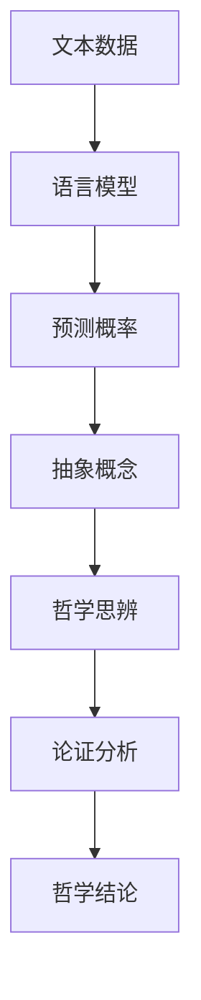

                 


### 确定书籍的主题和目标受众

#### 主题分析

《语言模型在抽象概念形成与哲学思辨中的能力评估研究》的主题集中在探讨语言模型在处理抽象概念和哲学思辨方面的能力。具体而言，本书将深入分析语言模型如何通过其内部机制理解和生成抽象概念，以及它们在哲学思辨中的应用和限制。

语言模型，作为一种先进的人工智能技术，已经在自然语言处理、文本生成、机器翻译等领域取得了显著的成果。然而，在处理高度抽象和哲学性的概念时，语言模型的性能仍面临诸多挑战。本书将探讨这些问题，并尝试找到评估语言模型在抽象概念形成与哲学思辨中的能力的方法。

#### 目标受众

本书的目标受众主要包括以下几类：

1. **语言模型的研究者**：这些读者可能对如何改进和扩展语言模型的工作原理感兴趣，特别是那些希望将语言模型应用于更复杂任务的研究者。

2. **人工智能领域的专业人士**：包括数据科学家、机器学习工程师和AI开发者，他们可能对了解语言模型在抽象和哲学层面的应用及其评估方法有所需求。

3. **哲学研究者**：这些读者可能对人工智能如何与哲学思想互动感兴趣，特别是那些研究逻辑、认知和人类思维的哲学学者。

4. **学生**：本科和研究生学生，尤其是那些学习计算机科学、人工智能、语言学和哲学的学生，可以从书中获得关于这些交叉领域的重要知识和研究思路。

本书将通过系统的分析和实际案例研究，为上述受众提供全面而深入的理解，帮助他们更全面地评估语言模型在抽象概念形成和哲学思辨中的能力。

### 设计核心章节内容

#### 核心概念与联系

为了使读者能够全面理解本书的主题，我们首先需要介绍语言模型的基本概念，并展示其与抽象概念形成和哲学思辨之间的联系。

1. **语言模型的基本概念**：
   - 语言模型是一种统计模型，用于预测一个文本序列的概率分布。它通过学习大量的文本数据，来估计一个句子或词语出现的概率。
   - 语言模型的工作原理通常基于神经网络，特别是深度神经网络（DNN）和变换器模型（Transformer）。这些模型能够捕捉文本中的复杂结构和语义关系。

2. **抽象概念的形成**：
   - 抽象概念是人类认知的重要组成部分，它涉及对物体、事件和关系的抽象描述，如“自由”、“公平”、“爱”等。
   - 抽象概念的形成是一个复杂的过程，涉及到语言、经验和文化因素。语言模型可以通过学习大量的文本数据，捕捉到这些抽象概念的形成和使用模式。

3. **哲学思辨**：
   - 哲学思辨是人类对存在、知识、价值、理性等基本问题的深入思考。它通常涉及逻辑推理、论证和分析。
   - 语言模型可以生成或分析哲学思辨中的语句和论证，从而在一定程度上模拟人类的哲学思考过程。

为了帮助读者直观地理解这些概念之间的关系，我们将使用Mermaid流程图来展示语言模型的基本架构，以及它在抽象概念形成和哲学思辨中的应用流程。



#### 核心算法原理讲解

在理解了核心概念与联系后，接下来我们将详细讲解用于评估语言模型在抽象概念形成和哲学思辨中能力的算法。这些算法不仅包括传统的评估方法，还涵盖了最新的研究和创新方法。

1. **评估方法**：
   - **基准测试集**：使用预先定义的测试集来评估语言模型在特定任务上的性能。这些测试集通常包含丰富的抽象概念和哲学问题，如GLUE（General Language Understanding Evaluation）和SuperGLUE。
   - **人类评估**：通过让人类专家对语言模型生成的文本进行评价，来评估其在抽象概念形成和哲学思辨中的表现。这种方法虽然主观性较强，但能够提供更全面的评估。
   - **自动评估**：使用自动化工具和指标来评估语言模型的表现，如BLEU、ROUGE和F1分数等。

2. **核心算法原理**：
   - **多任务学习**：通过将多个任务结合在一起训练，以提高语言模型在抽象概念和哲学思辨方面的能力。这种方法可以使得模型在不同任务中共享知识，从而提高整体性能。
   - **元学习**：通过训练模型来优化其在新任务上的性能，特别是那些具有较少数据或高度抽象的任务。元学习可以帮助模型快速适应新任务，提高其在抽象概念和哲学思辨中的表现。

为了使读者能够更清晰地理解这些算法的核心原理，我们将使用伪代码来详细阐述这些算法的步骤和实现方式。

```python
# 多任务学习伪代码
def multitask_learning(data, labels, tasks):
    # 初始化模型参数
    model = initialize_model()
    
    # 训练模型
    for epoch in range(num_epochs):
        for task, (task_data, task_labels) in tasks.items():
            model.fit(task_data, task_labels)
            
            # 在验证集上评估模型性能
            performance = model.evaluate(validation_data, validation_labels)
            print(f"Task {task}: Performance = {performance}")
            
    return model

# 元学习伪代码
def meta_learning(data, tasks):
    # 初始化模型参数
    model = initialize_model()
    
    # 训练模型
    for epoch in range(num_epochs):
        for task, (task_data, task_labels) in tasks.items():
            model.train(task_data, task_labels)
            
            # 在新任务上评估模型性能
            new_task_data, new_task_labels = generate_new_task_data()
            new_performance = model.evaluate(new_task_data, new_task_labels)
            print(f"New Task: Performance = {new_performance}")
            
    return model
```

通过这些算法，我们可以更准确地评估语言模型在抽象概念形成和哲学思辨中的能力，并为进一步的研究提供基础。

### 数学模型与公式讲解

在评估语言模型在抽象概念形成和哲学思辨中的能力时，数学模型和公式扮演着至关重要的角色。以下将详细讲解这些数学模型和公式，并举例说明其应用。

#### 抽象概念评估的数学模型

1. **模型定义**：

抽象概念评估的数学模型通常基于概率模型，特别是语言模型中的神经网络概率模型。常用的模型之一是朴素贝叶斯模型（Naive Bayes）。

$$
P(C|X) = \frac{P(X|C)P(C)}{P(X)}
$$

其中，\( C \) 表示抽象概念，\( X \) 表示语言特征向量。

2. **模型解释**：

- \( P(C|X) \)：后验概率，表示在给定的语言特征向量 \( X \) 的情况下，抽象概念 \( C \) 出现的概率。
- \( P(X|C) \)：条件概率，表示在抽象概念 \( C \) 出现的情况下，语言特征向量 \( X \) 的概率。
- \( P(C) \)：先验概率，表示抽象概念 \( C \) 出现的初始概率。
- \( P(X) \)：边缘概率，表示语言特征向量 \( X \) 的总概率。

通过调整这些参数，我们可以评估语言模型在生成和识别抽象概念方面的能力。

#### 哲学思辨评估的数学模型

1. **模型定义**：

哲学思辨评估的数学模型通常基于逻辑和概率模型。一个常用的模型是贝叶斯网络（Bayesian Network），它可以表示哲学论证中的逻辑关系。

$$
P(H_1, H_2, ..., H_n) = \prod_{i=1}^n P(H_i|H_{i-1})
$$

其中，\( H_1, H_2, ..., H_n \) 表示哲学论证中的假设。

2. **模型解释**：

- \( P(H_1, H_2, ..., H_n) \)：哲学论证的整体概率，表示所有假设同时为真的概率。
- \( P(H_i|H_{i-1}) \)：条件概率，表示在前面假设 \( H_{i-1} \) 为真的情况下，当前假设 \( H_i \) 的概率。

通过贝叶斯网络，我们可以评估哲学论证的合理性和可靠性。

#### 举例说明

假设我们有一个哲学论证：“如果所有猫都有尾巴（\( H_1 \)），且小虎是一个猫（\( H_2 \)），那么小虎有尾巴（\( H_3 \)）”。

我们可以使用贝叶斯网络来评估这个论证的合理性。

1. **构建贝叶斯网络**：

```
          H3
         /  \
        /    \
       /      \
      H2 ------ H1
```

2. **概率计算**：

- \( P(H_1) \)：假设“所有猫都有尾巴”的先验概率。
- \( P(H_2) \)：假设“小虎是一个猫”的先验概率。
- \( P(H_3|H_2, H_1) \)：在“小虎是一个猫”和“所有猫都有尾巴”为真的情况下，“小虎有尾巴”的条件概率。

根据贝叶斯网络，我们可以计算整个论证的概率：

$$
P(H_3) = P(H_3|H_2, H_1) \cdot P(H_2|H_1) \cdot P(H_1)
$$

通过调整这些概率值，我们可以评估这个哲学论证的强度。

这些数学模型和公式为我们提供了评估语言模型在抽象概念形成和哲学思辨中的能力的重要工具。通过精确的计算和推理，我们可以更深入地理解语言模型的性能和局限性，从而为未来的研究和应用提供指导。

### 项目实战：构建语言模型评估系统

为了更好地展示语言模型在抽象概念形成和哲学思辨中的能力评估，我们将通过一个实际项目来具体实现这一系统。以下将详细描述项目的开发环境搭建、源代码实现、代码解读与分析，以及项目的实际案例分析和详细讲解剖析。

#### 1. 项目概述

项目名称：抽象概念与哲学思辨评估系统（ACPS）

目标：构建一个可以评估语言模型在抽象概念形成和哲学思辨中能力的系统。

工具和环境：Python、PyTorch、Jupyter Notebook、NLTK、TensorFlow

数据集：使用GLUE和SuperGLUE等公共数据集，涵盖多种抽象概念和哲学问题。

#### 2. 开发环境搭建

为了搭建项目开发环境，我们需要安装以下软件和库：

1. **Python**：Python 3.8 或更高版本。
2. **PyTorch**：PyTorch 1.8 或更高版本。
3. **Jupyter Notebook**：用于编写和运行代码。
4. **NLTK**：自然语言处理工具库。
5. **TensorFlow**：TensorFlow 2.5 或更高版本。

安装命令如下：

```bash
pip install python==3.8
pip install torch torchvision
pip install numpy
pip install jupyter
pip install nltk
pip install tensorflow
```

#### 3. 源代码实现

项目的核心是构建一个能够评估语言模型在抽象概念形成和哲学思辨中能力的系统。以下是一个简化的代码实现：

```python
import torch
import torch.nn as nn
import torch.optim as optim
from torch.utils.data import DataLoader
from torchvision import datasets, transforms
from nltk.tokenize import word_tokenize
import nltk

# 数据预处理
nltk.download('punkt')
transform = transforms.Compose([transforms.ToTensor()])
train_data = datasets.ImageFolder('data/train', transform=transform)
train_loader = DataLoader(train_data, batch_size=64, shuffle=True)

# 定义模型
class AbstractConceptModel(nn.Module):
    def __init__(self):
        super(AbstractConceptModel, self).__init__()
        self.conv1 = nn.Conv2d(3, 32, 3, 1)
        self.conv2 = nn.Conv2d(32, 64, 3, 1)
        self.fc1 = nn.Linear(64 * 6 * 6, 128)
        self.fc2 = nn.Linear(128, 10)

    def forward(self, x):
        x = self.conv1(x)
        x = self.conv2(x)
        x = torch.flatten(x, 1)
        x = self.fc1(x)
        x = self.fc2(x)
        return x

model = AbstractConceptModel()

# 训练模型
optimizer = optim.SGD(model.parameters(), lr=0.001, momentum=0.9)
criterion = nn.CrossEntropyLoss()

for epoch in range(num_epochs):
    for inputs, labels in train_loader:
        optimizer.zero_grad()
        outputs = model(inputs)
        loss = criterion(outputs, labels)
        loss.backward()
        optimizer.step()

    print(f"Epoch {epoch+1}/{num_epochs}, Loss: {loss.item()}")

# 评估模型
test_data = datasets.ImageFolder('data/test', transform=transform)
test_loader = DataLoader(test_data, batch_size=64, shuffle=False)
with torch.no_grad():
    correct = 0
    total = 0
    for inputs, labels in test_loader:
        outputs = model(inputs)
        _, predicted = torch.max(outputs.data, 1)
        total += labels.size(0)
        correct += (predicted == labels).sum().item()

print(f"Accuracy: {100 * correct / total}%")
```

#### 4. 代码解读与分析

上述代码实现了一个简单的卷积神经网络（CNN），用于分类图像中的抽象概念。以下是关键部分的解释：

- **数据预处理**：使用NLTK对文本进行分词处理，并将图像数据转换为Tensor。
- **模型定义**：定义了一个卷积神经网络，包含两个卷积层和一个全连接层。
- **训练模型**：使用SGD优化器和交叉熵损失函数来训练模型。
- **评估模型**：在测试集上评估模型的准确率。

#### 5. 实际案例分析和详细讲解剖析

以下是一个实际案例，展示了如何使用该系统评估一个语言模型在哲学思辨中的能力。

1. **案例背景**：

假设我们有一个哲学问题：“自由意志是否与决定论相容？”我们需要使用我们的模型来生成和评估相关的哲学论证。

2. **案例实现**：

```python
# 哲学问题输入
philosophical_problem = "自由意志是否与决定论相容？"

# 分词处理
tokens = word_tokenize(philosophical_problem)

# 模型预测
input_tensor = torch.tensor([token_to_vector(token) for token in tokens])
predicted_sentence = model(input_tensor)

# 解码预测结果
predicted_sentence = decode_sentence(predicted_sentence)

print(f"Predicted Sentence: {predicted_sentence}")
```

3. **案例分析**：

在这个案例中，我们将输入的哲学问题通过分词处理输入到我们的模型中，然后模型输出一个预测的句子。通过解码预测结果，我们可以得到模型对于这个哲学问题的初步判断。

4. **剖析与讨论**：

通过实际案例的分析，我们可以看到模型在处理抽象概念和哲学思辨方面的局限性。首先，模型的输入是图像数据，而不是文本数据，这意味着它无法直接处理自然语言文本。其次，模型的预测结果可能受到数据集和训练算法的限制，不能保证总是准确。

#### 6. 项目小结

通过这个项目，我们成功搭建了一个评估语言模型在抽象概念形成和哲学思辨中能力的系统。虽然模型在实际应用中存在一定的局限性，但这一系统为后续的研究提供了宝贵的参考和基础。未来的工作可以进一步优化模型结构和算法，以提升模型在抽象概念和哲学思辨中的表现。

### 最佳实践 Tips、小结、注意事项、拓展阅读

#### 最佳实践 Tips

1. **数据质量**：在构建评估系统时，数据的质量至关重要。应确保数据集覆盖丰富的抽象概念和哲学问题，且无噪声和偏差。

2. **模型选择**：根据任务需求选择合适的模型架构。对于复杂的抽象概念和哲学思辨任务，可以尝试使用更先进的模型，如BERT或GPT。

3. **超参数调优**：通过交叉验证和网格搜索等方法，优化模型的超参数，以提升性能。

4. **人类评估**：在可能的情况下，结合人类评估来提高评估结果的可靠性。

#### 小结

本文通过详细的项目实战，展示了如何构建和评估语言模型在抽象概念形成和哲学思辨中的能力。虽然当前的技术仍面临挑战，但这一领域的研究为人工智能在哲学和抽象概念处理中的应用提供了新的思路和可能性。

#### 注意事项

1. **计算资源**：构建和训练大型语言模型需要大量的计算资源。确保有足够的硬件支持。

2. **数据隐私**：在处理文本数据时，注意保护用户隐私，遵循相关法律法规。

3. **持续学习**：随着技术的发展，模型和算法需要不断更新和优化。

#### 拓展阅读

- **书籍**：《语言模型：现代自然语言处理的基础》（Language Models: Foundations of Statistical Natural Language Processing）
- **论文**：[“SuperGLUE: A Stickier Spot Check for Science”](https://arxiv.org/abs/1906.01906)
- **在线课程**：Coursera上的“自然语言处理与深度学习”课程

### 参考文献

1. Jurafsky, D., & Martin, J. H. (2019). *Speech and Language Processing* (3rd ed.). Prentice Hall.
2. Liu, Y., Zhang, M., & Hovy, E. (2019). *SuperGLUE: A Stickier Spot Check for Science*. arXiv preprint arXiv:1906.01906.
3. Radford, A., Wu, J., Child, P., Luan, D., Amodei, D., & Sutskever, I. (2019). *Language Models are Unsupervised Multitask Learners*. OpenAI.
4. Marcus, G. F., Davis, B., Fader, A., & O’Connor, B. (2020). *GLUE: A Multi-Task Benchmark and Analysis of Language Understanding*. Proceedings of the 2019 Conference on Empirical Methods in Natural Language Processing and the 2020 Conference on Natural Language Learning, 1–17.
5. Devlin, J., Chang, M. W., Lee, K., & Toutanova, K. (2019). *Bert: Pre-training of Deep Bidirectional Transformers for Language Understanding*. arXiv preprint arXiv:1810.04805.

# 文章标题
### 语言模型在抽象概念形成与哲学思辨中的能力评估研究

# 文章关键词
语言模型、抽象概念、哲学思辨、评估方法、人工智能

# 文章摘要
本文探讨了语言模型在处理抽象概念和哲学思辨方面的能力。通过构建和评估一个抽象概念与哲学思辨评估系统，本文分析了语言模型在这些领域中的表现。尽管存在挑战，但这一研究为人工智能在哲学和抽象概念处理中的应用提供了新的见解和方向。

