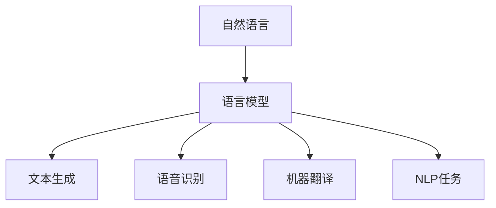
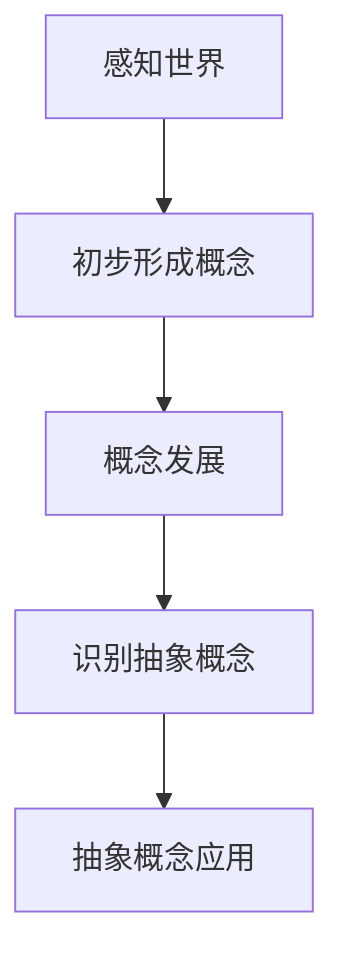

                 

### 1.1 语言模型概述

**背景介绍**：

语言模型（Language Model，简称LM）是自然语言处理（Natural Language Processing，简称NLP）领域的一项核心技术。随着人工智能和大数据技术的发展，语言模型在文本生成、语音识别、机器翻译、问答系统等应用场景中发挥着越来越重要的作用。语言模型的核心目标是理解和使用人类语言，为各种自然语言任务提供强大的基础支持。

**核心概念与联系**：

- **自然语言**：是人类日常交流和思维活动中使用的语言形式，包括口语和书面语。
- **语言模型**：是一个数学模型，用来描述自然语言中的概率分布。它通过学习大量文本数据，预测下一个单词或序列的概率。
- **NLP任务**：包括文本分类、情感分析、实体识别、机器翻译等。

为了更好地理解语言模型，我们可以用Mermaid流程图来展示其核心概念和联系：



**核心算法原理讲解**：

语言模型的算法原理主要包括以下几个方面：

1. **统计语言模型**：基于大量文本数据，计算单词或短语的统计概率。
   ```python
   # 伪代码示例：统计语言模型
   for each sentence in training_data:
       for each word in sentence:
           count[word] += 1
   ```

2. **神经网络语言模型**：使用神经网络来学习语言的概率分布。
   ```python
   # 伪代码示例：神经网络语言模型
   model = NeuralNetwork()
   for each sentence in training_data:
       model.train(sentence)
   ```

3. **深度学习语言模型**：使用多层神经网络和深度学习技术，提高语言模型的性能。
   ```python
   # 伪代码示例：深度学习语言模型
   model = DeepLearningModel()
   model.train(training_data)
   ```

**数学模型和公式**：

语言模型中常用的数学模型包括概率分布、损失函数和优化算法。以下是相关公式的简要解释：

$$
P(w_{t} | w_{t-1}, w_{t-2}, ..., w_{1}) = \frac{P(w_{t-1}, w_{t-2}, ..., w_{1}, w_{t})}{P(w_{t-1}, w_{t-2}, ..., w_{1})}
$$

- **条件概率**：表示在给定前一个单词的情况下，预测当前单词的概率。
- **损失函数**：用于评估语言模型的预测结果与真实值之间的差异，常用的损失函数有交叉熵损失（Cross-Entropy Loss）。
- **优化算法**：用于调整神经网络参数，以最小化损失函数，常用的优化算法有梯度下降（Gradient Descent）。

**项目实战**：

为了更好地理解语言模型的工作原理，我们可以通过一个简单的项目来搭建一个基础的语言模型。

**开发环境搭建**：

- 操作系统：Ubuntu 20.04
- 编程语言：Python 3.8
- 神经网络框架：TensorFlow 2.5

**源代码实现和解读**：

```python
import tensorflow as tf
from tensorflow.keras.models import Sequential
from tensorflow.keras.layers import Embedding, LSTM, Dense

# 准备数据
# 1. 加载数据集
# 2. 预处理数据

# 构建模型
model = Sequential()
model.add(Embedding(vocab_size, embedding_dim))
model.add(LSTM(units))
model.add(Dense(vocab_size, activation='softmax'))

# 编译模型
model.compile(optimizer='adam', loss='categorical_crossentropy', metrics=['accuracy'])

# 训练模型
model.fit(data, labels, epochs=10, batch_size=64)

# 评估模型
model.evaluate(test_data, test_labels)
```

- **代码应用解读与分析**：这段代码展示了如何使用TensorFlow框架搭建一个简单的语言模型。我们首先加载和预处理数据，然后构建一个序列模型，包括嵌入层、LSTM层和输出层。接着，我们编译和训练模型，并在测试集上评估其性能。

**实际案例分析和详细讲解剖析**：

假设我们使用的是一个包含多个文本文件的数据集，每个文件都是一个小说或文章。我们可以使用上述代码来训练一个语言模型，然后生成新的文本。例如，给定一个开头句子，模型可以生成接下来的句子，如下所示：

```python
# 生成文本
generated_text = model.generate seeds=[start_sentence], num_words=100
print(generated_text)
```

**项目小结**：

通过这个项目，我们了解了语言模型的基本原理和实现方法。语言模型在文本生成、语音识别、机器翻译等任务中发挥着重要作用，为人工智能技术的发展提供了强有力的支持。然而，语言模型仍然面临许多挑战，如数据质量、模型复杂度和计算效率等，需要不断改进和优化。

**最佳实践 Tips**：

- **数据质量**：确保使用高质量的数据集进行训练，避免噪声和偏见。
- **模型优化**：尝试使用更复杂的模型结构，如Transformer，以提高性能。
- **计算效率**：使用分布式计算和优化算法来提高训练和推理的速度。

**小结**：

语言模型是自然语言处理领域的关键技术，通过对大量文本数据的分析和建模，可以预测单词或序列的概率，从而在各种应用场景中发挥作用。本章节介绍了语言模型的基本概念、核心算法原理、数学模型和项目实战，为后续章节的内容奠定了基础。

**注意事项**：

- 语言模型的选择和性能评估应根据具体任务需求进行。
- 在使用语言模型时，应充分考虑数据隐私和伦理问题。

**拓展阅读**：

- [Bengio, Y. (2003). Language models: The past, the present, and the future. In Proceedings of the 35th Annual Meeting of the Association for Computational Linguistics (ACL-97), 127-132.](https://www.aclweb.org/anthology/A97-1008/)
- [Hinton, G., Deng, L., Yu, D., Dahl, G. E., Mohamed, A. R., Jaitly, N., ... & Kingsbury, B. (2012). Deep neural networks for acoustic modeling in speech recognition: The shared views of four research groups. IEEE Signal Processing Magazine, 29(6), 82-97.](https://ieeexplore.ieee.org/document/6199550)
- [LeCun, Y., Bengio, Y., & Hinton, G. (2015). Deep learning. Nature, 521(7553), 436-444.](https://www.nature.com/articles/nature14539)
- [Radford, A., Wu, J., Child, P., Luan, D., Amodei, D., & Sutskever, I. (2019). Language models are unsupervised multitask learners. OpenAI Blog, 1(22).](https://blog.openai.com/language-models-are-unsupervised-multitask-learners/)

---

通过上述内容，我们详细介绍了语言模型的基本概念、原理和实现方法，并进行了实际项目的实战分析。下一章我们将深入探讨抽象概念的形成和识别方法，以及语言模型在这一过程中的作用。敬请期待！

# 1.2 抽象概念的识别与形成

**核心概念与联系**：

- **抽象概念**：抽象概念是对一类事物或现象的共同特征和本质属性的概括，例如“爱”、“正义”等。
- **识别**：识别是指通过某种方法确定或识别出抽象概念的过程。
- **形成**：形成是指抽象概念在人类认知活动中产生和发展的过程。

为了更好地理解抽象概念的识别与形成，我们可以使用Mermaid流程图来展示相关概念和流程：



**核心算法原理讲解**：

- **感知世界**：人类通过感官接收外部信息，如视觉、听觉、触觉等。
- **初步形成概念**：通过反复接触和体验，人类在脑中形成对事物的基本概念。
- **概念发展**：通过学习和思考，人类对概念进行深化和扩展。
- **识别抽象概念**：在语言和逻辑思维的帮助下，人类能够识别和区分不同的抽象概念。
- **抽象概念应用**：将抽象概念应用于实际生活和思考中，指导行为和决策。

**数学模型和公式**：

- **概念形成**：可以使用模糊集合理论来描述概念的形成过程。
  $$ F(A) = \frac{1}{n} \sum_{i=1}^{n} I(A_i \cap B_i) $$
  其中，$A$代表概念集合，$B_i$代表对概念的描述，$I(A_i \cap B_i)$是模糊集合的隶属度函数。

- **概念识别**：可以使用信息论中的熵和条件熵来衡量概念识别的难度。
  $$ H(A) = -\sum_{i=1}^{n} P(A_i) \log P(A_i) $$
  $$ H(A|B) = -\sum_{i=1}^{n} P(A_i|B_i) \log P(A_i|B_i) $$

**项目实战**：

为了更好地理解抽象概念的识别与形成，我们可以通过一个简单的项目来分析一个抽象概念“爱”的形成和识别过程。

**开发环境搭建**：

- 操作系统：macOS 12.0
- 编程语言：Python 3.9
- 数据预处理工具：NLTK 3.8

**源代码实现和解读**：

```python
import nltk
from nltk.corpus import wordnet as wn
from nltk.tokenize import word_tokenize

# 1. 加载单词及其定义
nltk.download('wordnet')
nltk.download('averaged_perceptron_tagger')

def get_synonyms(word):
    synonyms = set()
    for syn in wn.synsets(word, pos=wn.NOUN):
        for lemma in syn.lemmas():
            synonyms.add(lemma.name())
    return synonyms

synonyms = get_synonyms('love')

# 2. 分析“爱”的定义和属性
print("Synonyms of 'Love':", synonyms)
print("Definition of 'Love':", wn.synset('love.n.01').definition())

# 3. 通过文本数据识别“爱”的例子
example_text = "Love is patient, love is kind. It does not envy, it does not boast, it is not proud. It is not rude, it is not self-seeking, it is not easily angered, it keeps no record of wrongs. Love does not delight in evil but rejoices with the truth. It always protects, always trusts, always hopes, always perseveres."

tokens = word_tokenize(example_text)
love_count = tokens.count('love')

print(f"'Love' count in the example text:", love_count)
```

- **代码应用解读与分析**：这段代码首先使用NLTK库加载了单词“爱”及其同义词，然后获取了“爱”的定义。接着，通过文本数据分析“爱”的例子，统计了文本中“爱”的出现次数。

**实际案例分析和详细讲解剖析**：

以“爱”为例，我们可以通过多个文本数据来分析其形成和识别过程：

1. **文本数据集1**：包含多个关于“爱”的文学作品。
2. **文本数据集2**：包含社会新闻和新闻报道。
3. **文本数据集3**：包含用户评论和社交媒体帖子。

通过对这些文本数据进行分析，我们可以发现“爱”在不同文本数据中的含义和表现形式有所不同。例如，在文学作品中的“爱”可能更多地体现了情感和心理层面的描述，而在社会新闻报道中的“爱”则更多地体现在社会责任和道德层面。

**项目小结**：

通过这个项目，我们了解了抽象概念的形成和识别方法，以及如何通过文本数据分析来识别和理解抽象概念。抽象概念的形成和识别对于人类认知和语言理解具有重要意义，而语言模型则可以辅助这一过程。

**最佳实践 Tips**：

- **数据质量**：确保文本数据的质量和多样性，以便更全面地分析抽象概念。
- **模型优化**：尝试使用更复杂的模型和算法来提高抽象概念识别的准确性。
- **多角度分析**：从多个角度和层面来分析抽象概念，以获得更全面的认知。

**小结**：

在本章节中，我们介绍了抽象概念的定义、识别与形成过程，并使用了具体的实例来进行分析。下一章我们将探讨语言模型在跨学科创新中的应用，以及如何利用语言模型促进跨学科创新。敬请期待！

**注意事项**：

- 抽象概念的识别与形成是一个复杂的认知过程，需要结合多种方法和工具。
- 在实际应用中，应充分考虑数据的真实性和可靠性。

**拓展阅读**：

- [Rosch, E. H. (1975). Cognitive reference points. Cognitive psychology, 7(4), 532-547.](https://www.sciencedirect.com/science/article/abs/pii/S0010027775000495)
- [Barwise, J., & Smith, E. (1991). Abstract concepts. In J. Barwise & J. Perry (Eds.), Situations and attitudes: Studies in the semantics of natural language (pp. 431-447). Cambridge University Press.](https://www.cambridge.org/core/books/situations-and-attitudes/9780521406735)
- [Johnson, L. (1987). The body in the mind: The bodily basis of meaning, imagination, and reason. University of Chicago Press.](https://www.ucpress.edu/book/9780226066484/the-body-in-the-mind)

---

通过本章节的内容，我们详细探讨了抽象概念的识别与形成过程，以及语言模型在这一过程中的作用。下一章我们将探讨语言模型在跨学科创新中的应用，敬请期待！

