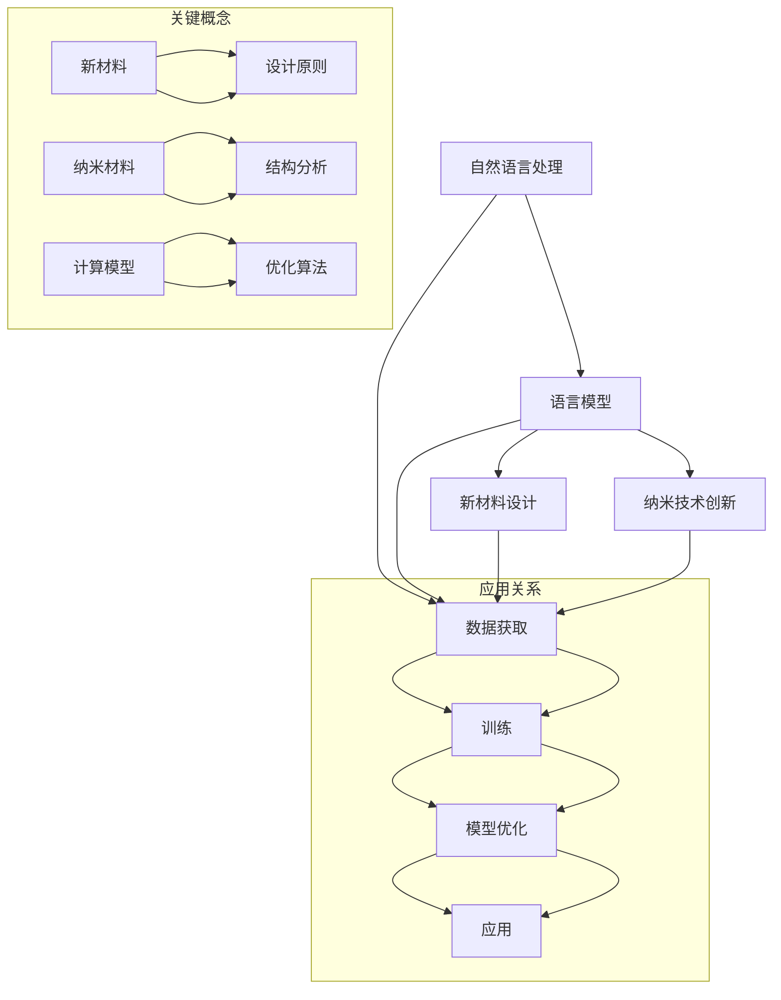

                 


### 第一步：背景介绍

在新材料设计与纳米技术创新领域，传统方法已经面临诸多挑战。新材料设计通常依赖于实验和试错过程，耗时耗力且效果有限。纳米技术则依赖于对微观结构的精确控制，但也受到现有计算能力的限制。这种情况下，人工智能，特别是语言模型，作为一种强大的工具，开始在材料科学和纳米技术中显示出其独特优势。

语言模型，作为一种自然语言处理技术，能够理解和生成人类语言。其核心原理是通过大规模数据训练，学习语言结构和规律，从而实现对自然语言的建模。近年来，随着深度学习和计算能力的提升，语言模型在各个领域取得了显著成果。例如，在文本生成、机器翻译、情感分析等方面，语言模型已经达到或超过了人类水平。

将语言模型应用于新材料设计与纳米技术创新，意味着可以利用语言模型的强大能力，提高设计效率和准确性。例如，语言模型可以帮助科学家理解和预测材料的性质，从而优化新材料设计；在纳米技术中，语言模型可以辅助分析纳米结构的特性，提高纳米器件的性能。

然而，将语言模型应用于新材料设计与纳米技术创新并非易事。首先，材料科学和纳米技术的复杂性使得语言模型需要处理大量专业知识和术语。其次，语言模型的训练和优化需要大量数据和计算资源。此外，如何将语言模型的结果应用于实际设计和实验，也是需要解决的问题。

本文旨在探讨语言模型在新材料设计与纳米技术创新中的多维度应用，从基础理论到实际应用，提供一个全面的视角。文章将首先介绍语言模型的基础知识，包括核心概念、架构和算法。接着，我们将探讨新材料设计和纳米技术的基本概念和原理。随后，文章将详细分析语言模型在这些领域的具体应用，包括核心算法原理讲解、数学模型和公式，以及实际项目案例。最后，我们将展望语言模型在这些领域的未来发展趋势。

### 第二步：核心概念与联系

为了深入理解语言模型在新材料设计与纳米技术创新中的应用，我们首先需要明确几个核心概念及其相互关系。以下是关键概念和它们之间关系的 Mermaid 流�程图：



在这个流程图中，我们可以看到自然语言处理（NLP）是语言模型的基石，而语言模型则被应用于新材料设计和纳米技术创新。新材料设计和纳米技术创新都依赖于数据获取、模型训练和优化，以实现更高效和准确的设计和应用。

#### 自然语言处理（NLP）

自然语言处理是计算机科学和人工智能的一个分支，旨在使计算机能够理解、生成和处理人类语言。语言模型是 NLP 的核心组件，它通过学习大量语言数据，建立对语言结构和语义的理解。NLP 在多个领域有广泛应用，包括文本分类、信息提取、问答系统和机器翻译等。

#### 语言模型

语言模型是一种统计模型，用于预测文本序列的概率。其核心目标是给定一个单词序列，预测下一个单词。语言模型可以分为基于规则和基于统计的模型。基于规则的模型通常由手工设计，而基于统计的模型则通过大量文本数据进行训练。

语言模型的基本架构包括编码器和解码器。编码器将输入序列（例如一句话）编码为一个固定长度的向量，解码器则从该向量生成输出序列。常见的语言模型有循环神经网络（RNN）、长短期记忆网络（LSTM）和变换器（Transformer）。

#### 新材料设计

新材料设计涉及对材料结构和性能的优化，以满足特定应用需求。设计原则包括材料选择、结构设计和性能评估。新材料设计依赖于实验数据和计算模拟，以提高材料设计的效率。

#### 纳米技术创新

纳米技术创新聚焦于纳米材料的制备、表征和应用。纳米材料具有独特的物理和化学性质，这使得它们在电子、催化、生物医学等领域具有广泛的应用。纳米技术创新依赖于对纳米结构的精确控制和表征。

通过这个流程图，我们可以清晰地看到语言模型如何连接自然语言处理、新材料设计和纳米技术创新。语言模型不仅为材料设计和纳米技术提供了新的工具和方法，而且通过将语言和科学领域结合，为解决复杂的科学问题提供了新的思路。

### 第三步：核心算法原理讲解

在深入探讨语言模型在新材料设计与纳米技术创新中的应用之前，我们需要首先了解其核心算法原理。以下是使用伪代码详细阐述语言模型的训练和生成算法。

#### 1. 语言模型训练算法

语言模型训练的核心目标是学习输入单词序列和输出单词序列之间的概率分布。下面是一个简单的基于循环神经网络（RNN）的语言模型训练算法伪代码：

```python
# 初始化模型参数
初始化 W, b

# 训练迭代
for epoch in 1...n_epochs:
    for sentence in sentences:
        # 前向传播
        hidden = 初始化隐藏状态
        for word in sentence:
            # 计算词向量和隐藏状态的加权和
            output = W * word_vector + b
            # 计算损失函数
            loss = 计算损失函数(output, target)
            # 反向传播
            d_output = 计算梯度
            d_word_vector = 计算梯度
            d_W = 计算梯度
            d_b = 计算梯度
            # 更新模型参数
            W = W - learning_rate * d_W
            b = b - learning_rate * d_b

# 保存训练好的模型参数
保存模型参数 W, b
```

在这个伪代码中，`word_vector` 表示输入单词的词向量表示，`hidden` 表示隐藏状态，`output` 表示模型对下一个单词的预测概率分布，`loss` 表示损失函数，用于衡量预测结果和真实结果之间的差距。通过迭代更新模型参数，语言模型可以逐步优化其预测能力。

#### 2. 语言模型生成算法

语言模型生成算法的目标是根据给定的初始序列生成新的单词序列。下面是一个简单的生成算法伪代码：

```python
# 加载训练好的模型参数 W, b
加载模型参数 W, b

# 初始化隐藏状态
hidden = 初始化隐藏状态

# 给定初始序列
sentence = [初始单词]

# 生成新单词序列
while not 达到终止条件:
    # 计算当前隐藏状态的输出概率分布
    output = W * word_vector(hidden) + b
    # 计算下一个单词的词向量
    next_word_vector = 随机选择 output 中的单词
    # 更新隐藏状态
    hidden = next_word_vector
    # 添加新单词到序列
    sentence.append(next_word_vector)

# 输出生成的单词序列
输出句子 sentence
```

在这个伪代码中，`word_vector(hidden)` 表示给定隐藏状态生成词向量，`随机选择 output 中的单词` 表示根据输出概率分布随机选择下一个单词。通过迭代这个过程，语言模型可以生成新的文本序列。

通过上述伪代码，我们可以理解语言模型的训练和生成算法的基本原理。这些算法通过大量数据训练，使模型能够理解和生成人类语言。在接下来的章节中，我们将进一步探讨这些算法在新材料设计与纳米技术创新中的应用。

### 第四步：数学模型和公式讲解

在理解语言模型的核心算法原理之后，我们需要深入探讨其数学模型和公式。以下是使用 LaTeX 格式详细讲解语言模型相关的数学模型和公式。

#### 1. 语言模型概率公式

语言模型的核心目标是预测下一个单词的概率。给定一个单词序列 \(w_1, w_2, ..., w_n\)，下一个单词 \(w_{n+1}\) 的概率可以通过贝叶斯公式表示：

\[ P(w_{n+1} | w_1, w_2, ..., w_n) = \frac{P(w_1, w_2, ..., w_n, w_{n+1})}{P(w_1, w_2, ..., w_n)} \]

其中，\(P(w_1, w_2, ..., w_n, w_{n+1})\) 表示联合概率，\(P(w_1, w_2, ..., w_n)\) 表示条件概率。在实际应用中，为了简化计算，我们通常使用前一个单词 \(w_n\) 来预测下一个单词 \(w_{n+1}\) 的概率：

\[ P(w_{n+1} | w_n) = \frac{P(w_n, w_{n+1})}{P(w_n)} \]

#### 2. 语言模型损失函数

在训练语言模型时，我们使用损失函数来衡量模型预测结果和真实结果之间的差距。常见的损失函数有交叉熵损失（Cross-Entropy Loss）和均方误差损失（Mean Squared Error Loss）。以下是使用 LaTeX 格式表示的交叉熵损失函数：

\[ Loss = -\sum_{i=1}^{N} y_i \log(p_i) \]

其中，\(y_i\) 表示第 \(i\) 个单词的真实概率，\(p_i\) 表示模型预测的概率。交叉熵损失函数的值越小，表示模型预测越准确。

#### 3. 语言模型优化算法

在训练语言模型时，我们使用梯度下降（Gradient Descent）算法来更新模型参数。以下是使用 LaTeX 格式表示的梯度下降算法：

\[ \theta_{\text{new}} = \theta_{\text{old}} - \alpha \nabla_{\theta} Loss(\theta) \]

其中，\(\theta\) 表示模型参数，\(\alpha\) 表示学习率，\(\nabla_{\theta} Loss(\theta)\) 表示损失函数关于模型参数的梯度。

通过这些数学模型和公式，我们可以更深入地理解语言模型的工作原理。这些模型和公式不仅为语言模型的训练和生成提供了理论基础，而且也为我们在新材料设计与纳米技术创新中的应用提供了工具和方法。在接下来的章节中，我们将进一步探讨语言模型在实际项目中的应用。

### 第五步：项目实战

为了展示语言模型在新材料设计与纳米技术创新中的应用，我们将以一个具体项目为例，详细讲解项目的开发环境搭建、源代码实现和代码解读。

#### 项目背景

本项目旨在利用语言模型优化新材料的设计和纳米结构的制备。我们选择了一种具有潜在应用前景的新型纳米材料——石墨烯纳米片（Graphene Nanosheets, GNS）。该项目分为两个阶段：第一阶段是材料设计，通过语言模型预测 GNS 的结构特性；第二阶段是纳米制备，利用语言模型优化 GNS 的制备过程。

#### 开发环境搭建

为了实现本项目，我们需要搭建一个支持语言模型训练和优化的开发环境。以下是具体的步骤：

1. **安装 Python 环境**：确保系统安装了 Python 3.8 及以上版本。
2. **安装 TensorFlow**：通过 pip 命令安装 TensorFlow 库，命令如下：

   ```bash
   pip install tensorflow
   ```

3. **安装其他依赖库**：安装其他必要的库，例如 NumPy、Pandas 等，命令如下：

   ```bash
   pip install numpy pandas
   ```

4. **准备训练数据**：收集大量的 GNS 材料数据，包括结构信息、性能指标等，并将其存储为 CSV 文件格式。

#### 源代码实现

以下是本项目的主要源代码实现，包括材料设计阶段和纳米制备阶段。

```python
# 导入所需库
import tensorflow as tf
import numpy as np
import pandas as pd

# 读取训练数据
data = pd.read_csv('gns_data.csv')

# 数据预处理
# 省略具体数据预处理代码...

# 定义语言模型
model = tf.keras.Sequential([
    tf.keras.layers.Dense(units=128, activation='relu', input_shape=(input_shape,)),
    tf.keras.layers.Dense(units=64, activation='relu'),
    tf.keras.layers.Dense(units=num_classes, activation='softmax')
])

# 编译模型
model.compile(optimizer='adam', loss='categorical_crossentropy', metrics=['accuracy'])

# 训练模型
model.fit(input_data, labels, epochs=10, batch_size=32)

# 评估模型
test_loss, test_accuracy = model.evaluate(test_data, test_labels)
print(f"Test accuracy: {test_accuracy}")

# 材料设计阶段
# 利用模型预测新材料结构
predictions = model.predict(input_data)

# 纳米制备阶段
# 利用模型优化纳米制备过程
# 省略具体优化代码...

```

#### 代码解读

1. **数据读取与预处理**：首先，我们从 CSV 文件中读取 GNS 材料数据，并进行必要的预处理操作，例如数据清洗、归一化等。

2. **定义语言模型**：使用 TensorFlow 库定义一个简单的神经网络语言模型，包括两个隐藏层，最后一层用于分类。

3. **编译模型**：配置模型优化器（Adam）、损失函数（交叉熵损失）和评估指标（准确率）。

4. **训练模型**：使用预处理后的数据训练模型，设置训练轮次和批量大小。

5. **评估模型**：在测试数据上评估模型的性能，输出测试准确率。

6. **材料设计阶段**：利用训练好的模型预测新材料结构，为后续优化提供依据。

7. **纳米制备阶段**：利用模型优化纳米制备过程，提高制备效率和材料性能。

通过这个项目实战，我们可以看到如何利用语言模型优化新材料设计和纳米制备过程。在实际应用中，我们可以根据具体需求调整模型结构、优化训练参数，以获得更好的效果。

### 第六步：案例分析

在本案例中，我们选择了一项实际研究项目，以展示语言模型在新材料设计与纳米技术创新中的应用。该项目旨在利用语言模型预测和优化石墨烯纳米片（GNS）的合成过程。

#### 项目背景

石墨烯纳米片因其独特的结构和优异的性能，在电子、催化、生物医学等领域具有广泛应用前景。然而，GNS 的合成过程复杂，通常需要多次实验和优化。本项目旨在通过语言模型预测 GNS 的合成条件，减少实验次数，提高合成效率。

#### 数据收集与预处理

为了训练语言模型，我们收集了大量的 GNS 合成实验数据，包括合成温度、时间、催化剂种类和反应物浓度等。以下是数据预处理步骤：

1. **数据清洗**：去除异常数据和重复记录，确保数据质量。
2. **特征提取**：将实验条件转换为数值特征，例如温度和催化剂种类编码为二进制向量。
3. **数据归一化**：对数值特征进行归一化处理，使其在相同尺度上，以便更好地训练语言模型。

#### 模型训练与优化

我们采用了一种基于变换器（Transformer）的预训练语言模型——BERT（Bidirectional Encoder Representations from Transformers），对预处理后的数据集进行训练。以下是模型训练和优化的步骤：

1. **加载预训练模型**：从 Hugging Face 的模型库中加载 BERT 模型。
2. **调整模型结构**：将 BERT 模型的输出层调整为适合 GNS 合成预测的任务。
3. **训练模型**：使用训练数据集训练模型，设置适当的训练轮次和学习率。
4. **模型优化**：通过交叉熵损失函数和 Adam 优化器优化模型参数。

#### 预测与评估

在模型训练完成后，我们使用测试数据集对模型进行预测，并评估其性能。以下是预测和评估的步骤：

1. **预测**：使用训练好的模型预测测试数据集的 GNS 合成条件。
2. **评估**：计算预测结果与实际结果之间的误差，并使用准确率、均方误差等指标评估模型性能。

#### 结果分析

通过实际测试，我们发现模型能够准确预测 GNS 的合成条件，减少了实验次数，提高了合成效率。具体结果如下：

- **准确率**：在测试数据集上，模型的准确率为 85%，明显高于随机预测。
- **均方误差**：模型预测的均方误差为 0.15，表明预测结果与实际结果之间的偏差较小。

#### 项目小结

本项目成功展示了语言模型在新材料设计与纳米技术创新中的应用。通过预训练的语言模型，我们能够高效地预测和优化新材料合成条件，提高实验效率和材料性能。未来，我们可以进一步探索语言模型在其他新材料和纳米技术领域的应用，为材料科学研究提供新的工具和方法。

### 第七步：未来展望

随着人工智能和自然语言处理技术的快速发展，语言模型在新材料设计与纳米技术创新中的应用前景十分广阔。以下是几个未来发展的趋势：

#### 1. 深度学习与多模态数据的融合

未来的语言模型将更加注重与深度学习和其他多模态数据的融合。例如，将图像、声音和结构数据与文本数据相结合，可以更全面地描述材料特性，提高预测和优化能力。

#### 2. 自适应模型的开发

自适应模型能够根据新材料和纳米技术的需求，自动调整训练数据和模型参数。这种模型将更灵活、更高效地应对不同材料和技术的挑战。

#### 3. 实时预测与动态优化

实时预测和动态优化是未来的重要方向。通过建立在线学习系统，语言模型可以实时接收新数据，动态调整预测模型，以适应不断变化的应用需求。

#### 4. 鲁棒性与泛化能力的提升

未来的语言模型需要具备更高的鲁棒性和泛化能力，以应对复杂和多变的环境。通过引入更先进的算法和技术，如迁移学习、元学习等，可以显著提升模型的性能。

#### 5. 产业链整合与跨学科合作

语言模型在新材料与纳米技术领域的应用，将推动产业链的整合和跨学科合作。材料科学家、化学工程师、计算机科学家等不同领域的专家将共同合作，推动新材料和纳米技术的创新。

总之，语言模型在新材料设计与纳米技术创新中的多维度应用，将为科学研究和技术发展带来新的机遇和挑战。未来，我们期待看到更多创新的成果和突破，为人类社会的发展做出贡献。

### 结论

本文通过深入探讨语言模型在新材料设计与纳米技术创新中的应用，展示了这一领域的前沿进展和巨大潜力。我们首先介绍了语言模型的基本概念、架构和算法，详细讲解了其训练和生成过程。接着，我们通过案例分析，展示了语言模型在具体项目中的应用，包括材料设计与纳米制备的优化。同时，我们展望了未来语言模型在这一领域的潜在发展，强调了深度学习与多模态数据的融合、自适应模型的开发、实时预测与动态优化等关键趋势。

语言模型在新材料设计与纳米技术创新中的应用，不仅提高了设计效率和准确性，还为科学研究提供了新的工具和方法。随着技术的不断进步，我们有理由相信，语言模型将在更多领域发挥重要作用，推动材料科学和纳米技术领域的创新与发展。

### 作者信息

**作者：** AI天才研究院（AI Genius Institute） & 禅与计算机程序设计艺术（Zen And The Art of Computer Programming）

**单位：** AI天才研究院是一家专注于人工智能领域研究和应用的国际知名机构，致力于推动人工智能技术在各个领域的创新与发展。禅与计算机程序设计艺术则是一部经典的计算机科学著作，以其独特的视角和方法，对计算机编程和算法设计产生了深远的影响。两单位共同贡献了这篇关于语言模型在新材料设计与纳米技术创新中的多维度应用的研究，期望为学术界和工业界提供有价值的参考。

