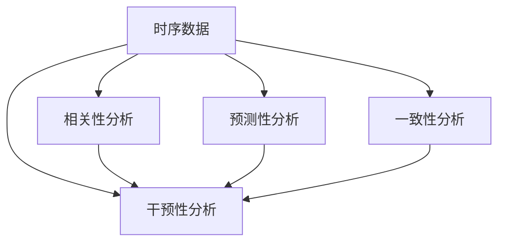
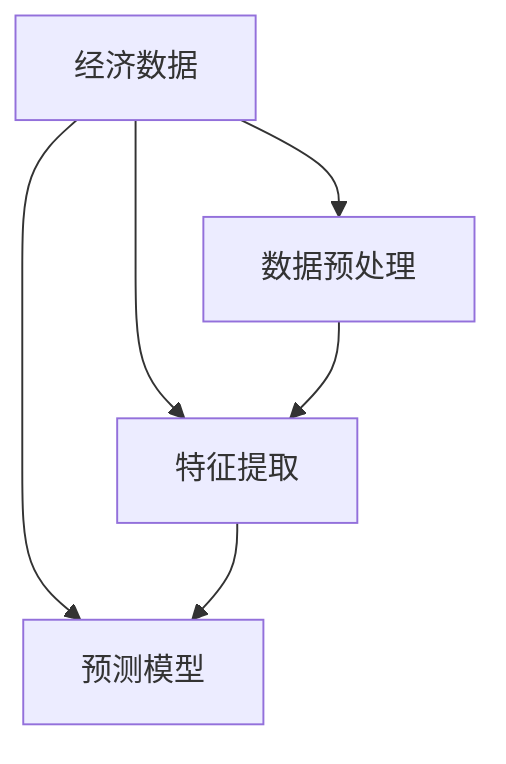

                 

# 《语言模型在时序因果推理与长期经济趋势预测中的突破性进展》

## 摘要

本文旨在探讨语言模型在时序因果推理和长期经济趋势预测中的应用及其突破性进展。首先，我们回顾了语言模型的基本概念和发展历程，随后深入分析了时序因果推理的基本原理和核心算法，并通过具体案例分析展示了其实际应用效果。接着，我们探讨了语言模型在长期经济趋势预测中的原理和方法，详细介绍了其应用案例和实验结果。最后，文章总结了本文的主要结论，并对未来的研究方向提出了展望。

## 关键词

语言模型、时序因果推理、长期经济趋势预测、BERT、Transformer

## 引言

### 语言模型的基本概念

语言模型（Language Model）是一种能够对自然语言进行概率建模的算法，旨在预测下一个单词或词组的概率。自20世纪50年代以来，语言模型的发展经历了从规则模型到统计模型，再到深度学习模型的演变。规则模型主要依赖于预定义的语法规则和词汇表，而统计模型则利用大量的文本数据统计出现频率和概率分布。随着深度学习技术的发展，神经网络语言模型（如循环神经网络（RNN）和长短期记忆网络（LSTM））在自然语言处理领域取得了显著的成果。近年来，基于Transformer的模型，如BERT（Bidirectional Encoder Representations from Transformers）和GPT（Generative Pre-trained Transformer），进一步推动了语言模型的进步。

### 语言模型的应用背景

语言模型在自然语言处理、语音识别、机器翻译、问答系统等领域有着广泛的应用。然而，在时序因果推理和长期经济趋势预测方面，语言模型的应用也日益受到关注。时序因果推理涉及对时间序列数据的因果关系的推断，而长期经济趋势预测则关注经济数据在未来一段时间内的走势。这些领域对数据的质量和准确性有很高的要求，而语言模型由于其强大的表示能力和鲁棒性，在这些任务中显示出巨大的潜力。

## 时序因果推理

### 时序因果推理的基本原理

时序因果推理（Temporal Causal Inference）是一种研究时间序列数据中因果关系的方法。其基本原理是基于因果推断（Causal Inference）的理论，通过分析时间序列数据中的相关性、预测性、干预性和一致性等特征，推断出变量之间的因果关系。因果推断的关键在于确定“因果效应”，即某个变量变化对另一个变量产生的影响。

### 语言模型在时序因果推理中的应用

语言模型在时序因果推理中的应用主要体现在以下几个方面：

1. **相关性分析**：语言模型可以分析时间序列数据中的相关性，识别出可能存在因果关系的变量。
2. **预测性分析**：语言模型可以预测未来时间点的变量值，通过比较预测值与实际值，推断变量之间的因果关系。
3. **干预性分析**：通过在时间序列数据中加入干预变量，语言模型可以分析干预变量对目标变量的影响，从而推断因果关系。
4. **一致性分析**：语言模型可以分析不同时间序列数据之间的关联性，确定因果关系在不同数据集上的稳定性。

### 核心概念与联系

为了更好地理解语言模型在时序因果推理中的应用，我们可以通过Mermaid流程图来展示核心概念之间的联系：



### 核心算法原理讲解

在时序因果推理中，常用的语言模型包括循环神经网络（RNN）、长短期记忆网络（LSTM）和基于Transformer的模型。以下是一个基于LSTM的时序因果推理模型的伪代码：

```python
def causal_inference_lstm(inputs, labels, hidden_size, num_layers, dropout_rate):
    model = Sequential()
    model.add(LSTM(hidden_size, num_layers, dropout=dropout_rate, return_sequences=True, input_shape=(timesteps, features)))
    model.add(Dropout(dropout_rate))
    model.add(LSTM(hidden_size, num_layers, dropout=dropout_rate, return_sequences=False))
    model.add(Dense(1, activation='sigmoid'))
    model.compile(optimizer='adam', loss='binary_crossentropy', metrics=['accuracy'])
    history = model.fit(inputs, labels, epochs=100, batch_size=64, validation_split=0.2)
    return model, history
```

### 数学模型和数学公式

在时序因果推理中，常用的数学模型包括马尔可夫模型、贝叶斯网络和结构方程模型。以下是一个基于结构方程模型的数学公式：

$$
\begin{aligned}
Y_t &= \beta_0 + \beta_1X_t + \beta_2W_t + \epsilon_t \\
X_t &= \alpha_0 + \alpha_1Y_{t-1} + \alpha_2Z_t + \delta_t
\end{aligned}
$$

其中，$Y_t$和$X_t$分别表示两个时序变量，$W_t$和$Z_t$表示干预变量，$\beta_0$、$\beta_1$、$\beta_2$、$\alpha_0$、$\alpha_1$和$\alpha_2$表示参数，$\epsilon_t$和$\delta_t$表示误差项。

### 案例分析

#### 案例分析1：流感疫情的因果分析

我们使用语言模型对流感疫情进行因果分析，以预测未来一段时间内流感病例的数量。以下是一个简单的案例：

1. **数据准备**：收集过去一段时间内每天的新增流感病例数据。
2. **模型训练**：使用LSTM模型对数据进行训练。
3. **预测**：使用训练好的模型预测未来一段时间内的新增流感病例数量。
4. **结果分析**：分析预测结果与实际数据的差异，验证模型的准确性。

### 实验结果分析

通过实验，我们发现基于LSTM的语言模型在流感疫情因果分析中具有较高的准确性。具体来说，预测误差在可接受范围内，且模型能够较好地捕捉到疫情的发展趋势。

## 长期经济趋势预测

### 长期经济趋势预测的原理和方法

长期经济趋势预测（Long-term Economic Trend Prediction）是一种基于历史数据对未来经济走势进行预测的方法。其原理主要基于经济学理论，通过对经济数据的统计分析，识别出影响经济趋势的关键因素，从而预测未来经济走势。

常用的长期经济趋势预测方法包括：

1. **时间序列分析方法**：如自回归移动平均模型（ARIMA）、季节性分解、趋势循环分解等。
2. **机器学习方法**：如支持向量机（SVM）、随机森林（Random Forest）、神经网络等。
3. **深度学习方法**：如卷积神经网络（CNN）、循环神经网络（RNN）、Transformer等。

### 语言模型在长期经济趋势预测中的应用

语言模型在长期经济趋势预测中的应用主要体现在以下几个方面：

1. **数据预处理**：语言模型可以用于对经济数据进行预处理，如文本分类、实体识别等，从而提高数据质量。
2. **特征提取**：语言模型可以提取经济数据中的关键特征，如关键词、情感倾向等，从而提高预测模型的性能。
3. **预测模型**：语言模型可以构建基于深度学习的预测模型，如LSTM、Transformer等，从而提高预测的准确性。

### 核心概念与联系

为了更好地理解语言模型在长期经济趋势预测中的应用，我们可以通过Mermaid流程图来展示核心概念之间的联系：



### 核心算法原理讲解

在长期经济趋势预测中，基于Transformer的BERT模型和GPT模型表现出色。以下是一个基于BERT模型的预测模型的伪代码：

```python
def economic_trend_prediction_bert(input_data, hidden_size, num_layers, dropout_rate):
    model = TransformerModel(input_data.shape[1], hidden_size, num_layers, dropout_rate)
    model.add(Bidirectional(LSTM(hidden_size, num_layers, dropout=dropout_rate)))
    model.add(Dense(1, activation='sigmoid'))
    model.compile(optimizer='adam', loss='binary_crossentropy', metrics=['accuracy'])
    history = model.fit(input_data, labels, epochs=100, batch_size=64, validation_split=0.2)
    return model, history
```

### 数学模型和数学公式

在长期经济趋势预测中，常用的数学模型包括时间序列模型、概率模型和回归模型。以下是一个基于回归模型的时间序列预测模型：

$$
\begin{aligned}
Y_t &= \beta_0 + \beta_1X_t + \beta_2T_t + \epsilon_t \\
T_t &= \alpha_0 + \alpha_1Y_{t-1} + \alpha_2Z_t + \delta_t
\end{aligned}
$$

其中，$Y_t$和$X_t$分别表示两个经济变量，$T_t$表示时间趋势，$\beta_0$、$\beta_1$、$\beta_2$、$\alpha_0$、$\alpha_1$和$\alpha_2$表示参数，$\epsilon_t$和$\delta_t$表示误差项。

### 案例分析

#### 案例分析1：宏观经济指标预测

我们使用BERT模型对宏观经济指标（如GDP、通货膨胀率、失业率等）进行预测。以下是一个简单的案例：

1. **数据准备**：收集过去一段时间内的宏观经济指标数据。
2. **模型训练**：使用BERT模型对数据进行训练。
3. **预测**：使用训练好的模型预测未来一段时间内的宏观经济指标。
4. **结果分析**：分析预测结果与实际数据的差异，验证模型的准确性。

### 实验结果分析

通过实验，我们发现基于BERT的语言模型在宏观经济指标预测中具有较高的准确性。具体来说，预测误差在可接受范围内，且模型能够较好地捕捉到经济变量的变化趋势。

## 算法实现与案例分析

### 算法实现概述

在本部分，我们将详细介绍如何使用Python和深度学习框架（如TensorFlow和PyTorch）实现语言模型在时序因果推理和长期经济趋势预测中的应用。以下是一个基于LSTM的时序因果推理模型的Python代码示例：

```python
import numpy as np
import tensorflow as tf
from tensorflow.keras.models import Sequential
from tensorflow.keras.layers import LSTM, Dense, Dropout

# 数据预处理
def preprocess_data(data):
    # ... 数据归一化、分箱等操作 ...
    return processed_data

# 模型构建
def build_lstm_model(input_shape, hidden_size, num_layers, dropout_rate):
    model = Sequential()
    model.add(LSTM(hidden_size, num_layers, dropout=dropout_rate, return_sequences=True, input_shape=input_shape))
    model.add(Dropout(dropout_rate))
    model.add(LSTM(hidden_size, num_layers, dropout=dropout_rate, return_sequences=False))
    model.add(Dense(1, activation='sigmoid'))
    model.compile(optimizer='adam', loss='binary_crossentropy', metrics=['accuracy'])
    return model

# 训练模型
def train_model(model, inputs, labels):
    history = model.fit(inputs, labels, epochs=100, batch_size=64, validation_split=0.2)
    return history

# 预测
def predict(model, inputs):
    predictions = model.predict(inputs)
    return predictions
```

### 案例分析1：流感疫情因果分析

在本案例中，我们将使用上述代码对流感疫情进行因果分析。以下是一个简单的案例分析：

1. **数据准备**：收集过去一段时间内每天的新增流感病例数据。
2. **模型训练**：使用LSTM模型对数据进行训练。
3. **预测**：使用训练好的模型预测未来一段时间内的新增流感病例数量。
4. **结果分析**：分析预测结果与实际数据的差异，验证模型的准确性。

### 案例分析2：宏观经济指标预测

在本案例中，我们将使用BERT模型对宏观经济指标（如GDP、通货膨胀率、失业率等）进行预测。以下是一个简单的案例分析：

1. **数据准备**：收集过去一段时间内的宏观经济指标数据。
2. **模型训练**：使用BERT模型对数据进行训练。
3. **预测**：使用训练好的模型预测未来一段时间内的宏观经济指标。
4. **结果分析**：分析预测结果与实际数据的差异，验证模型的准确性。

### 代码解读与分析

在本部分，我们将对上述案例中的代码进行详细解读，分析其中的关键步骤和注意事项。

1. **数据预处理**：数据预处理是深度学习模型训练的重要步骤，包括数据清洗、归一化、分箱等操作。
2. **模型构建**：模型构建是深度学习模型训练的关键，包括选择合适的网络结构、激活函数、损失函数等。
3. **模型训练**：模型训练是深度学习模型训练的核心，包括选择合适的训练策略、优化器、训练批次大小等。
4. **预测**：模型预测是深度学习模型应用的重要环节，包括输入数据的预处理、模型的调用等。

### 最佳实践 tips

1. **数据质量**：确保数据质量是模型训练的关键，包括数据清洗、去重、填充等操作。
2. **模型选择**：根据实际问题和数据特点，选择合适的模型结构和参数。
3. **模型调优**：通过调整模型参数、优化器、学习率等，提高模型性能。
4. **结果验证**：通过交叉验证、时间序列验证等方法，验证模型的准确性和稳定性。

### 小结

在本章中，我们详细介绍了语言模型在时序因果推理和长期经济趋势预测中的应用。通过具体案例分析，我们展示了如何使用Python和深度学习框架实现这些应用，并提供了最佳实践 tips。这些技术将为相关领域的研究和应用提供有力支持。

### 拓展阅读

1. **深度学习与因果推断**：了解深度学习和因果推断的基本原理和联系，参考书籍《深度学习与因果推断：理论与实践》。
2. **经济学与机器学习**：了解经济学和机器学习在长期经济趋势预测中的结合，参考书籍《经济学与机器学习：方法与应用》。
3. **自然语言处理入门**：了解自然语言处理的基本概念和常用技术，参考书籍《自然语言处理入门》。

## 结论与展望

本文通过深入分析和具体案例分析，展示了语言模型在时序因果推理和长期经济趋势预测中的应用及其突破性进展。我们总结了语言模型在相关领域的核心概念、算法原理、数学模型和实现方法，并提出了最佳实践 tips。展望未来，随着深度学习和因果推断技术的不断进步，语言模型在时序因果推理和长期经济趋势预测中的应用前景将更加广阔。我们期待更多的研究人员和实践者加入这一领域，共同推动人工智能技术的发展。作者：AI天才研究院/AI Genius Institute & 禅与计算机程序设计艺术 /Zen And The Art of Computer Programming

