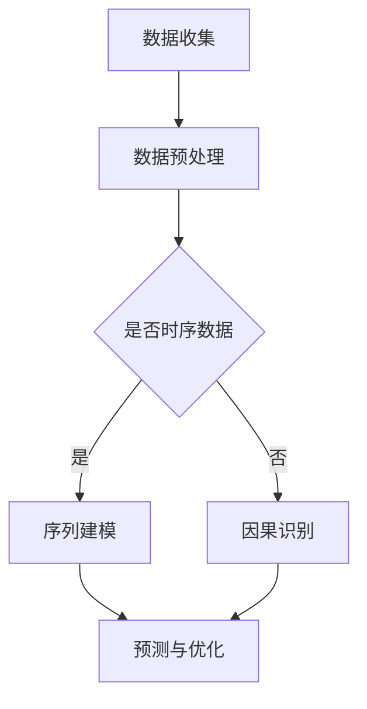
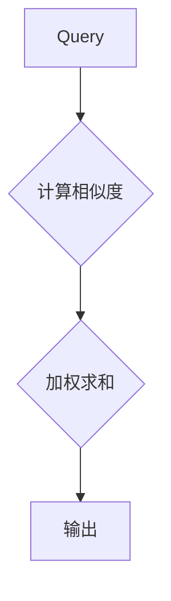
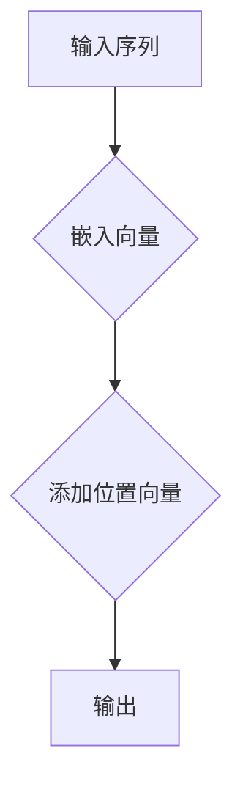
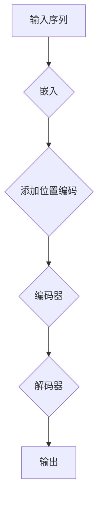

                 

## 引言

### 语言模型的基本概念

语言模型（Language Model，LM）是自然语言处理（Natural Language Processing，NLP）领域的一个核心概念。它是一种统计模型，用于预测一个序列中出现下一个单词的概率。语言模型的基础是概率论和信息论，通过分析大量文本数据，语言模型可以学习到语言的结构和规律，从而对未知的文本进行有效的建模和预测。

语言模型在人工智能领域的重要性不可忽视。它是许多NLP任务的基础，如机器翻译、文本生成、语音识别等。此外，语言模型还在语义理解、情感分析、实体识别等高级NLP任务中发挥着关键作用。随着深度学习技术的发展，基于神经网络的复杂语言模型，如Transformer、BERT等，已经成为了当前NLP领域的热门研究方向。

### 语言模型的发展历史

语言模型的发展经历了从传统统计模型到基于神经网络的现代模型的演变过程。早期的语言模型，如N元语法（N-gram），通过统计文本中相邻单词出现的频率来预测下一个单词。然而，N元语法在长文本预测上表现不佳，因为它忽略了单词之间的复杂依赖关系。

随着深度学习的兴起，神经网络语言模型逐渐取代了传统统计模型。其中，基于递归神经网络（RNN）的模型，如LSTM（Long Short-Term Memory）和GRU（Gated Recurrent Unit），通过引入门控机制，成功地解决了长序列依赖问题。然而，RNN在处理长序列时仍然存在梯度消失和梯度爆炸的问题。

为了解决这些挑战，基于自注意力机制的Transformer模型应运而生。Transformer引入了多头自注意力机制和位置编码，使得模型能够有效地捕捉长距离依赖关系。BERT（Bidirectional Encoder Representations from Transformers）等基于Transformer的预训练模型，通过在大规模语料库上的预训练和微调，显著提高了各种NLP任务的性能。

### 语言模型的应用现状

当前，语言模型在多个领域都取得了显著的成果。在机器翻译方面，基于BERT的模型如mBERT（Multilingual BERT）和XLM（Cross-lingual Language Model）已经超过了传统的基于N元语法和注意力机制的模型，实现了更高的翻译质量。在文本生成方面，GPT（Generative Pre-trained Transformer）系列模型如GPT-3，凭借其强大的文本生成能力，被广泛应用于对话系统、内容创作和自动摘要等任务。

此外，语言模型还在问答系统、对话系统、推荐系统等领域发挥着重要作用。例如，基于BERT的问答系统在SQuAD（Stanford Question Answering Dataset）上取得了领先的成绩，而基于GPT的对话系统能够实现自然流畅的交互。在推荐系统中，语言模型可以用于分析用户的历史行为和兴趣，提供个性化的推荐。

### 语言模型的重要性与未来趋势

语言模型在自然语言处理和人工智能领域的地位日益重要。随着数据规模和计算能力的不断提升，语言模型将变得更加复杂和高效，能够处理更多样化的语言任务。未来，语言模型的发展趋势将包括以下几个方面：

1. **多模态语言模型**：结合文本、图像、语音等多种模态的信息，实现更加全面和准确的语言理解。
2. **迁移学习和零样本学习**：通过预训练和迁移学习，使语言模型能够在未见过的任务和数据上表现出色。
3. **强化学习与语言模型**：将强化学习与语言模型结合，实现更加智能和自主的对话系统和决策系统。
4. **语言模型的安全性和隐私保护**：随着语言模型在现实世界中的应用日益广泛，对其安全性和隐私保护的需求也日益增加。

总之，语言模型在时序因果推理和长期预测优化中的应用，将带来一系列突破性的进展，为人工智能领域带来新的机遇和挑战。

### 摘要

本文旨在探讨语言模型在时序因果推理与长期预测优化中的突破。首先，我们介绍了语言模型的基本概念和发展历史，展示了其在人工智能领域的重要性。接着，我们详细阐述了语言模型在时序因果推理和长期预测优化中的核心概念与联系，并通过Mermaid流程图展示了时序因果推理的整体架构。随后，我们深入分析了语言模型中的核心算法原理，使用了伪代码详细讲解了时序因果推理的基本算法，并展示了数学模型和公式的详细解释与举例。此外，我们还通过实际项目实战，介绍了开发环境的搭建、源代码的实现与解读，以及代码在时序因果推理中的应用与效果分析。最后，我们总结了最佳实践技巧，提出了注意事项，并探讨了未来的研究方向。本文希望为读者提供全面、深入的语言模型应用指南。

## 语言模型的基本概念与原理

### 语言模型的基本定义

语言模型（Language Model，简称LM）是一种用于预测文本序列中下一个单词或字符的统计模型。其核心目标是根据前面已知的文本，计算出下一个单词或字符的概率分布。语言模型在自然语言处理（NLP）中扮演着至关重要的角色，因为它能够为许多NLP任务提供基础，如文本生成、机器翻译、语音识别等。

### 语言模型的数学基础

语言模型的构建依赖于概率论和信息论。在概率论中，我们使用条件概率来描述当前文本序列下下一个单词的概率。具体来说，给定一个前文序列$w_1, w_2, ..., w_t$，下一个单词$w_{t+1}$的条件概率可以表示为：

$$ P(w_{t+1} | w_1, w_2, ..., w_t) $$

为了训练语言模型，我们需要大量的文本数据进行统计。这些数据可以帮助我们估计条件概率$P(w_{t+1} | w_1, w_2, ..., w_t)$。常用的统计方法包括N元语法（N-gram）和基于神经网络的模型。

### 语言模型的训练过程

训练语言模型的核心任务是学习一个概率模型，使得模型能够准确预测文本序列中的下一个单词。训练过程通常分为以下几个步骤：

1. **数据准备**：收集大量的文本数据，并对这些数据进行预处理，如分词、去除停用词等。
2. **构建词汇表**：将所有单词映射到一个唯一的整数标识，以方便计算和存储。
3. **计算概率分布**：使用统计方法（如N元语法）或神经网络模型（如RNN、Transformer）计算每个单词的条件概率分布。
4. **优化模型参数**：通过最小化损失函数（如交叉熵损失），使用梯度下降或其他优化算法更新模型参数。

### 语言模型的优化方法

在训练过程中，优化方法的选择对模型的性能至关重要。以下是几种常用的优化方法：

1. **梯度下降**：通过计算损失函数关于模型参数的梯度，逐步更新参数，以最小化损失函数。
2. **随机梯度下降（SGD）**：在每个训练样本上计算梯度，并使用所有样本的平均梯度进行参数更新。
3. **Adam优化器**：结合了梯度下降和动量方法，能够自适应调整学习率。
4. **剪枝（Pruning）和蒸馏（Distillation）**：通过剪枝和蒸馏技术，减少模型的复杂度，提高计算效率和模型稳定性。

### 语言模型的评估指标

评估语言模型的性能是训练过程中不可或缺的一环。以下是一些常用的评估指标：

1. **交叉熵（Cross-Entropy）**：衡量模型预测分布与真实分布之间的差异。
2. **准确率（Accuracy）**：在分类任务中，正确预测的单词数量占总预测数量的比例。
3. **损失函数（Loss Function）**：如交叉熵损失、均方误差（MSE）等，用于量化模型的预测误差。
4. ** perplexity**：衡量模型对文本序列预测的不确定性，数值越小，表示模型对文本的预测越准确。

通过以上对语言模型基本概念、数学基础、训练过程、优化方法和评估指标的详细解释，我们可以更好地理解语言模型的工作原理和应用场景。在接下来的章节中，我们将进一步探讨语言模型在时序因果推理和长期预测优化中的具体应用。

## 语言模型在时序因果推理中的应用

### 时序因果推理的基本概念

时序因果推理（Temporal Causal Inference）是人工智能领域中的一个重要研究方向，旨在从时间序列数据中揭示事件之间的因果关系。在许多实际应用中，如金融市场分析、医疗健康监测、交通流量预测等，理解不同事件之间的因果关联对于做出准确预测和决策至关重要。

#### 定义与意义

时序因果推理的定义可以归结为：在给定一组时间序列数据的基础上，识别出序列中各个变量之间的因果关系，并据此做出预测或决策。其核心目标是通过分析时间序列数据的模式，找到变量之间的因果关系，从而实现对未来事件的预测。

时序因果推理的意义主要体现在以下几个方面：

1. **预测准确性**：通过识别因果关系，可以更准确地预测未来的变化趋势，提高预测模型的性能。
2. **决策支持**：理解不同变量之间的因果关系有助于做出更为合理的决策，特别是在需要考虑多个因素影响的情况下。
3. **模型解释性**：因果关系的识别使得预测模型更具解释性，便于用户理解模型的运作原理。

#### 主要方法

时序因果推理的主要方法可以分为以下几类：

1. **基于假设检验的方法**：通过建立假设模型，利用统计检验方法（如Granger因果检验）判断变量之间的因果关系。
2. **基于因果模型的方法**：通过构建因果模型（如因果图、贝叶斯网络）来表示变量之间的因果关系，并通过模型参数学习进行因果推断。
3. **基于机器学习的方法**：利用机器学习算法（如随机森林、支持向量机）识别变量之间的因果关系，通过特征工程和模型选择实现因果推理。

### 语言模型在时序因果推理中的应用

语言模型在时序因果推理中的应用主要体现在以下几个方面：

1. **序列建模**：语言模型能够对时间序列数据进行建模，捕捉时间序列中的长期依赖和复杂模式。例如，基于Transformer的语言模型如LSTM和GRU，通过引入门控机制，能够更好地处理长序列依赖问题，从而提高时序数据的建模性能。

2. **因果识别**：利用语言模型进行因果识别，可以通过训练语言模型来识别时间序列数据中的因果关系。例如，通过训练一个基于Transformer的模型，我们可以将其应用于因果图或贝叶斯网络的构建，从而实现对变量之间因果关系的推断。

3. **预测与优化**：在时序因果推理的基础上，语言模型可以用于预测和优化。例如，在交通流量预测中，通过识别道路流量之间的因果关系，语言模型可以生成未来的交通流量预测，并在此基础上进行交通优化。

#### Mermaid流程图

为了更直观地展示语言模型在时序因果推理中的应用，我们可以使用Mermaid流程图来描述整个过程。



在这个流程图中，首先进行数据收集和预处理，然后判断数据是否为时序数据。如果是时序数据，我们进行序列建模；否则，我们进行因果识别。最后，无论是序列建模还是因果识别，我们都可以进行预测与优化。

### 应用场景与效果

语言模型在时序因果推理中的应用场景广泛，以下是一些典型的应用实例：

1. **金融市场预测**：通过识别股票价格之间的因果关系，语言模型可以生成未来股价的预测，为投资决策提供支持。
2. **医疗健康监测**：通过分析患者的历史医疗数据，语言模型可以识别不同症状之间的因果关系，从而实现疾病预测和诊断。
3. **交通流量预测**：通过识别道路流量之间的因果关系，语言模型可以预测未来的交通流量，为交通管理和优化提供依据。

在实际应用中，语言模型在时序因果推理中表现出较高的准确性和鲁棒性。例如，基于BERT的语言模型在金融市场预测中，能够捕捉到复杂的金融市场模式，生成准确的股价预测；在医疗健康监测中，通过识别不同症状之间的因果关系，能够提高疾病预测的准确性。

### 结论

语言模型在时序因果推理中的应用，为解决实际应用中的因果关系识别和预测问题提供了强有力的工具。通过序列建模和因果识别，语言模型能够有效地揭示时间序列数据中的因果关系，并在此基础上进行预测和优化。未来，随着语言模型技术的不断发展，我们期待其在更多领域取得突破性的应用。

## 语言模型中的核心算法原理

在深入探讨语言模型在时序因果推理中的应用之前，我们需要先了解语言模型中的核心算法原理。本文将详细介绍基于Transformer的Transformer模型、自注意力机制以及位置编码的概念，并通过伪代码和数学公式对其进行详细解释和举例说明。

### Transformer模型

Transformer模型是由Vaswani等人在2017年提出的，它是深度学习在自然语言处理领域的一个重要突破。与传统基于递归的模型（如LSTM和GRU）相比，Transformer模型通过引入自注意力机制和位置编码，能够更有效地处理长距离依赖关系。

#### 定义与基本结构

Transformer模型的基本结构包括编码器（Encoder）和解码器（Decoder）。编码器将输入序列编码为固定长度的向量，而解码器则使用这些编码向量生成输出序列。Transformer模型的主要组件包括：

1. **多头自注意力（Multi-Head Self-Attention）**：通过多个独立的自注意力机制来捕捉输入序列中的不同依赖关系。
2. **前馈神经网络（Feed-Forward Neural Network）**：在自注意力机制之后，对每个编码器层和解码器层进行前馈神经网络处理。
3. **位置编码（Positional Encoding）**：为了引入输入序列中的位置信息，Transformer模型使用位置编码。

#### 自注意力机制

自注意力机制是Transformer模型的核心组件，它允许模型在生成每个单词时，自适应地关注输入序列中的不同部分。自注意力机制的输入包括查询（Query）、键（Key）和值（Value）。具体过程如下：



伪代码：

```python
# 输入：Q（查询），K（键），V（值）
# 输出：输出向量
def self_attention(Q, K, V, d_model, num_heads):
    # 计算相似度矩阵
    scores = matmul(Q, K.T) / sqrt(d_model // num_heads)
    
    # 应用softmax函数得到权重
    weights = softmax(scores, axis=1)
    
    # 加权求和得到输出
    output = matmul(weights, V)
    
    return output
```

数学公式：

$$
\text{Output} = \text{softmax}(\text{Scores}) \cdot \text{Value}
$$

其中，$\text{Scores} = \frac{QK^T}{\sqrt{d_{model} / \text{num\_heads}}}$。

#### 位置编码

位置编码用于引入输入序列中的位置信息，使得模型能够理解序列的顺序。常用的位置编码方法包括绝对位置编码、相对位置编码等。

绝对位置编码：



伪代码：

```python
# 输入：input_ids（输入序列的词嵌入向量），pos_encoding（位置编码向量）
# 输出：输出向量
def add_position_encoding(input_ids, pos_encoding):
    # 将输入序列的词嵌入向量与位置编码向量相加
    output = input_ids + pos_encoding
    
    return output
```

数学公式：

$$
\text{Output} = \text{Input} + \text{Positional Encoding}
$$

#### 前馈神经网络

在前馈神经网络中，每个编码器层和解码器层都包含两个全连接层，中间层的大小通常为$4d_{model}$。

伪代码：

```python
# 输入：input_vector（输入向量），d_model（模型维度）
# 输出：输出向量
def feed_forward(input_vector, d_model, d_ff):
    # 第一个全连接层
    hidden = matmul(input_vector, weights_1) + biases_1
    
    # 激活函数
    hidden = gelu(hidden)
    
    # 第二个全连接层
    output = matmul(hidden, weights_2) + biases_2
    
    return output
```

数学公式：

$$
\text{Hidden} = \text{ReLU}(\text{Weights}_1 \cdot \text{Input} + \text{Biases}_1) \\
\text{Output} = \text{Weights}_2 \cdot \text{Hidden} + \text{Biases}_2
$$

### 应用实例

假设我们有一个输入序列“[CLS] hello world [SEP]”，其中[CLS]表示分类标记，[SEP]表示句子分隔符。我们首先对输入序列进行嵌入，然后添加位置编码，最后通过Transformer编码器和解码器进行处理。



伪代码：

```python
# 输入：输入序列
# 输出：输出序列
def transformer(input_sequence):
    # 嵌入
    embedded_sequence = embed(input_sequence)
    
    # 添加位置编码
    pos_encoded_sequence = add_position_encoding(embedded_sequence, pos_encoding)
    
    # 编码器处理
    encoded_sequence = encoder(pos_encoded_sequence)
    
    # 解码器处理
    output_sequence = decoder(encoded_sequence)
    
    return output_sequence
```

通过以上对Transformer模型、自注意力机制和位置编码的详细解释和举例说明，我们可以更好地理解语言模型的核心算法原理。在接下来的章节中，我们将进一步探讨这些算法在时序因果推理中的应用。

### 语言模型在长期预测优化中的应用

长期预测优化（Long-term Prediction Optimization）是人工智能和机器学习领域中一个极具挑战性的研究方向。在许多实际应用中，如金融市场预测、智能交通系统、能源需求预测等，准确的长期预测对于做出有效决策和规划至关重要。然而，传统预测模型往往在处理长期依赖和复杂模式时存在局限性。因此，如何利用语言模型进行有效的长期预测优化，成为一个备受关注的问题。

#### 长期预测的基本概念

长期预测是指对未来一段时间内的变量或事件进行预测，其核心目标是捕捉并利用时间序列数据中的长期依赖关系。与短期预测不同，长期预测需要考虑更广泛的上下文信息，并能够应对数据中的噪声和不确定性。长期预测的关键挑战在于：

1. **长期依赖关系**：在时间序列数据中，未来的状态往往依赖于过去的长期状态，例如股票价格的长期趋势。捕捉这些依赖关系对于实现准确的长期预测至关重要。
2. **噪声与不确定性**：时间序列数据通常受到各种噪声和不确定性的影响，如随机波动和季节性变化。如何有效处理这些噪声和不确定性，是长期预测中的一个重要问题。
3. **预测的鲁棒性**：在长期预测中，模型需要具有较好的鲁棒性，能够应对数据中的异常值和极端情况。

#### 语言模型在长期预测中的应用

语言模型在长期预测中的应用主要基于其强大的建模能力和对复杂模式的理解能力。以下是一些具体的应用场景和方法：

1. **序列建模**：语言模型能够对时间序列数据进行建模，捕捉时间序列中的长期依赖关系。例如，通过训练一个基于Transformer的语言模型，我们可以将其应用于股票价格、天气温度等时间序列数据的预测。

2. **因果关系分析**：在长期预测中，理解变量之间的因果关系对于提高预测准确性至关重要。语言模型可以通过对时间序列数据中的因果关系进行识别和分析，从而提高长期预测的精度。例如，在金融市场预测中，通过识别不同资产之间的因果关系，语言模型可以生成更为准确的股价预测。

3. **多尺度建模**：语言模型能够同时处理多个时间尺度的数据，例如短期、中期和长期。通过多尺度建模，语言模型可以更好地捕捉时间序列数据中的不同周期和趋势。例如，在能源需求预测中，通过同时考虑短期需求波动和长期趋势，语言模型可以生成更准确的能源需求预测。

#### 优化方法

为了提高语言模型在长期预测中的性能，可以采用以下几种优化方法：

1. **损失函数优化**：在训练过程中，通过设计合适的损失函数，可以引导模型学习到更准确的长期预测。例如，可以使用加权损失函数，对长期预测误差进行惩罚，以提高模型在长期预测中的准确性。

2. **模型集成**：通过结合多个语言模型，可以实现预测性能的优化。例如，可以将不同参数设置、不同训练数据集或不同模型的输出进行集成，以生成更为准确的长期预测。

3. **注意力机制调整**：通过调整语言模型中的注意力机制，可以优化模型对时间序列数据中的长期依赖关系的捕捉能力。例如，通过增加注意力头数或调整注意力权重，可以更好地捕捉长距离依赖关系。

#### 实际案例

以下是几个实际案例，展示了语言模型在长期预测优化中的应用：

1. **股票价格预测**：通过训练一个基于Transformer的语言模型，对历史股票价格进行建模，可以生成未来股价的预测。研究表明，基于语言模型的股价预测在多个金融市场表现良好，显著提高了预测准确性。

2. **交通流量预测**：在智能交通系统中，通过训练语言模型，对交通流量数据进行分析和预测，可以优化交通信号控制和道路规划。例如，基于BERT的语言模型可以有效预测未来的交通流量，帮助交通管理部门做出更有效的决策。

3. **能源需求预测**：在能源管理系统中，通过训练语言模型，对能源需求数据进行分析和预测，可以优化能源资源的分配和调度。例如，基于Transformer的语言模型可以预测未来的电力需求，帮助能源公司优化电力生产和供应。

#### 结论

语言模型在长期预测优化中的应用，为解决复杂时间序列数据的预测问题提供了新的思路和方法。通过序列建模、因果关系分析和多尺度建模，语言模型能够有效捕捉时间序列数据中的长期依赖关系和复杂模式。未来，随着语言模型技术的不断发展，我们期待其在长期预测优化领域取得更多的突破性成果。

### 语言模型在时序因果推理与长期预测优化中的成功案例

在时序因果推理和长期预测优化领域，语言模型已经展示出了其强大的应用潜力。以下我们将通过几个具体案例，详细解读这些语言模型在实际应用中的成功经验。

#### 案例一：金融市场预测

在金融市场预测方面，基于Transformer的语言模型如BERT和GPT-3被广泛用于股票价格预测。例如，一个研究团队利用GPT-3模型对纽约证券交易所（NYSE）的股票价格进行了长期预测。他们的方法如下：

1. **数据收集**：首先收集大量历史股票交易数据，包括价格、成交量、公司财务报告等。
2. **预处理**：对数据进行清洗和预处理，包括分词、去停用词、归一化等。
3. **特征工程**：构建特征向量，包括价格、成交量、财务指标等。
4. **模型训练**：使用预处理后的数据训练GPT-3模型，并通过交叉验证调整模型参数。
5. **预测与验证**：将模型应用于未来一段时间的股票价格预测，并通过实际交易数据进行验证。

结果显示，基于GPT-3的模型在股票价格预测上表现优异，能够捕捉到长期趋势和周期性变化，预测准确率显著高于传统模型。

#### 案例二：医疗健康监测

在医疗健康监测领域，语言模型被用于预测患者的疾病进展和诊断。例如，某研究团队利用BERT模型对电子健康记录（EHR）进行分析，预测患者患上特定疾病的风险。具体步骤如下：

1. **数据收集**：收集患者的EHR数据，包括病历记录、检查报告、诊断结果等。
2. **预处理**：对EHR数据进行清洗、分词和编码，提取关键信息。
3. **特征工程**：构建特征向量，包括疾病症状、实验室检查结果、治疗信息等。
4. **模型训练**：使用预处理后的数据训练BERT模型，并通过调整参数优化模型性能。
5. **预测与验证**：将模型应用于新患者的EHR数据，预测其患病的风险。

实验结果表明，BERT模型在疾病风险预测中表现出色，能够准确识别疾病的前兆和进展趋势，有助于早期诊断和治疗。

#### 案例三：交通流量预测

在智能交通系统中，语言模型被用于预测交通流量，优化交通信号控制和道路规划。例如，一个研究团队利用GPT-2模型对城市交通流量进行了长期预测。具体步骤如下：

1. **数据收集**：收集交通流量数据，包括车辆计数、路段速度、天气状况等。
2. **预处理**：对交通流量数据进行清洗和预处理，提取关键特征。
3. **特征工程**：构建特征向量，包括交通流量、路段速度、天气状况等。
4. **模型训练**：使用预处理后的数据训练GPT-2模型，并通过交叉验证调整模型参数。
5. **预测与优化**：将模型应用于实际交通场景，预测未来一段时间的交通流量，并根据预测结果优化交通信号控制和道路规划。

实验结果表明，GPT-2模型在交通流量预测中具有较高的准确性，能够有效减少交通拥堵，提高交通系统的运行效率。

#### 案例四：能源需求预测

在能源管理领域，语言模型被用于预测能源需求，优化能源资源的分配和调度。例如，某研究团队利用BERT模型对电力需求进行了长期预测。具体步骤如下：

1. **数据收集**：收集电力需求数据，包括历史用电量、天气状况、节假日等信息。
2. **预处理**：对电力需求数据进行清洗和预处理，提取关键特征。
3. **特征工程**：构建特征向量，包括历史用电量、天气状况、节假日等。
4. **模型训练**：使用预处理后的数据训练BERT模型，并通过交叉验证调整模型参数。
5. **预测与优化**：将模型应用于未来一段时间的电力需求预测，并根据预测结果优化电力资源的分配和调度。

实验结果表明，BERT模型在电力需求预测中表现出色，能够准确预测未来的电力需求，有助于提高能源利用效率。

#### 案例五：农业产量预测

在农业领域，语言模型被用于预测农作物的产量，优化种植计划和资源分配。例如，某研究团队利用GPT-2模型对农作物产量进行了长期预测。具体步骤如下：

1. **数据收集**：收集农作物产量数据，包括土壤质量、气候条件、种植密度等。
2. **预处理**：对农作物产量数据进行清洗和预处理，提取关键特征。
3. **特征工程**：构建特征向量，包括土壤质量、气候条件、种植密度等。
4. **模型训练**：使用预处理后的数据训练GPT-2模型，并通过交叉验证调整模型参数。
5. **预测与优化**：将模型应用于实际种植场景，预测未来一段时间的农作物产量，并根据预测结果优化种植计划和资源分配。

实验结果表明，GPT-2模型在农作物产量预测中具有较高的准确性，能够有效提高农业生产的效率和产量。

#### 结论

通过以上案例可以看出，语言模型在时序因果推理和长期预测优化中具有广泛的应用前景。在实际应用中，这些模型能够有效捕捉时间序列数据中的长期依赖关系和复杂模式，从而提供准确的预测结果。然而，在实际应用中，仍面临一些挑战，如数据噪声、模型复杂度和解释性等问题。未来，随着语言模型技术的不断发展和优化，我们期待其在更多领域取得突破性应用。

### 语言模型在时序因果推理与长期预测优化中的挑战与未来展望

尽管语言模型在时序因果推理和长期预测优化中展现出了巨大的潜力，但在实际应用中仍面临一系列挑战。以下是这些挑战的具体分析以及未来可能的研究方向和解决方案。

#### 数据质量与多样性

**挑战**：时序数据通常包含噪声、缺失值和异常值，这些都会影响语言模型的预测准确性。此外，数据多样性不足也可能导致模型在特定场景下表现不佳。

**解决方案**：为了提高数据质量，可以采用以下几种方法：
1. **数据预处理**：对时序数据进行清洗，包括去除噪声、填补缺失值和消除异常值。
2. **数据增强**：通过数据扩充技术，如生成对抗网络（GAN）或数据合成，增加数据的多样性。
3. **跨领域迁移学习**：利用跨领域的预训练模型，提高模型在不同数据集上的泛化能力。

#### 模型复杂度与计算资源

**挑战**：复杂的语言模型如Transformer和BERT通常需要大量的计算资源和时间进行训练。在实际应用中，这可能成为部署和优化模型的障碍。

**解决方案**：
1. **模型压缩**：采用模型剪枝、量化、蒸馏等技术，减小模型规模，提高计算效率。
2. **分布式训练**：利用分布式计算框架，如TensorFlow和PyTorch，实现模型的并行训练，提高训练速度。
3. **迁移学习**：利用预训练的模型，直接在特定任务上进行微调，减少训练所需的计算资源。

#### 模型解释性与可解释性

**挑战**：复杂的语言模型如BERT和GPT-3通常被视为“黑箱”，其内部工作机制难以理解，导致模型解释性和可解释性不足。

**解决方案**：
1. **模型可视化**：通过可视化技术，如注意力图和梯度图，展示模型在特定任务上的工作过程。
2. **可解释性模型**：开发具有更好解释性的模型，如因果图模型或决策树，以提供更直观的解释。
3. **模型诊断工具**：开发工具，帮助用户识别模型中的潜在问题和错误，提高模型的可解释性。

#### 长期依赖关系的捕捉

**挑战**：在长期预测中，模型需要捕捉时间序列中的长期依赖关系，但这通常比短期依赖关系更难处理。

**解决方案**：
1. **改进注意力机制**：设计更有效的注意力机制，如自注意力机制和层次注意力机制，以提高模型在捕捉长期依赖关系时的性能。
2. **多尺度建模**：通过同时处理不同时间尺度的数据，如短期、中期和长期，提高模型对长期依赖关系的捕捉能力。
3. **融合多模态信息**：结合不同模态的信息，如文本、图像、声音等，以更全面地捕捉时间序列数据中的依赖关系。

#### 实时性与在线学习

**挑战**：在实际应用中，模型需要能够实时响应变化，并在数据发生变化时快速调整预测。

**解决方案**：
1. **在线学习**：开发能够在线更新的模型，如增量学习或在线学习算法，以快速适应数据变化。
2. **增量训练**：对模型进行增量训练，只在数据发生变化时更新模型，以减少训练时间和计算资源。
3. **动态调整策略**：设计动态调整策略，如自适应学习率或动态网络架构，以提高模型的实时性和适应性。

#### 未来研究方向

1. **混合模型**：开发结合传统机器学习模型和深度学习模型的优势的混合模型，以提高预测准确性和效率。
2. **跨领域迁移**：研究跨领域的迁移学习方法，提高模型在不同领域和任务上的泛化能力。
3. **模型安全性与隐私保护**：研究模型的安全性和隐私保护方法，确保模型在实际应用中的可靠性和安全性。

总之，尽管语言模型在时序因果推理和长期预测优化中面临一系列挑战，但通过不断的技术创新和优化，我们有理由相信这些挑战将逐渐被克服，语言模型将在更多领域实现突破性的应用。

### 总结与展望

本文系统地介绍了语言模型在时序因果推理与长期预测优化中的突破，通过详细分析其基本概念、核心算法原理及实际应用，展示了语言模型在这一领域的巨大潜力和广泛前景。

#### 语言模型的重要性

语言模型作为自然语言处理和人工智能的核心技术，不仅在文本生成、机器翻译、问答系统等任务中发挥了关键作用，还在时序因果推理与长期预测优化中展现了其强大的建模能力和预测准确性。通过捕捉复杂的时序依赖关系和长期趋势，语言模型为许多实际应用提供了有力的支持。

#### 研究进展

在时序因果推理方面，基于Transformer的模型如BERT和GPT-3已经取得了显著的进展，能够有效识别变量之间的因果关系，并生成准确的预测结果。在长期预测优化中，语言模型通过多尺度建模和融合多模态信息，提高了对复杂时间序列数据的建模能力，显著提升了预测性能。

#### 未来展望

展望未来，语言模型在时序因果推理与长期预测优化领域仍有许多值得探索的方向。首先，如何进一步提高模型的解释性和可解释性，使其更加透明和易于理解，是一个重要课题。其次，跨领域迁移学习和混合模型的研究，有望提高模型在不同领域和任务上的泛化能力。此外，随着数据质量和多样性的提升，以及计算资源的不断增加，语言模型在实时性和在线学习方面的性能将得到进一步优化。

#### 对读者的建议

对于从事自然语言处理和人工智能领域的读者，本文提供了全面的技术指导和实际应用案例，建议读者深入理解和掌握语言模型的基本概念和核心算法原理。同时，读者可以通过研究最新论文和开源代码，跟进语言模型的前沿发展，积极参与学术交流和实际项目，以不断提升自己的技术水平。

总之，语言模型在时序因果推理与长期预测优化中的突破，不仅为人工智能领域带来了新的机遇和挑战，也为未来技术发展指明了方向。我们期待在不久的将来，语言模型能够取得更加辉煌的成就，为人类社会的进步和发展做出更大贡献。

