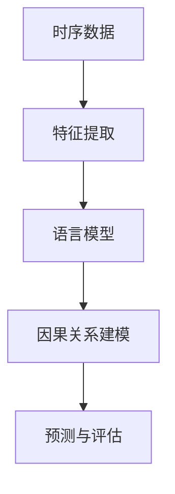

                 

### 文章标题：语言模型在时序因果推理中的表现优化

关键词：语言模型，时序因果推理，性能优化，深度学习，强化学习，特征工程

摘要：本文主要探讨了语言模型在时序因果推理中的应用及其性能优化方法。首先，我们介绍了时序因果推理的基本概念和语言模型的相关知识，然后详细讲解了语言模型在时序因果推理中的核心算法原理。接着，我们分析了当前语言模型在时序因果推理中存在的问题，并提出了一系列性能优化策略。最后，通过实际项目案例，我们展示了如何应用这些优化方法，并对未来研究方向进行了展望。

## 第1步：背景介绍

### 1.1 时序因果推理概述

时序因果推理（Temporal Causal Inference）是数据科学和机器学习领域的一个重要研究方向，其主要目的是从时序数据中推断出因果关系。时序数据是指随着时间变化而变化的数据，如时间序列、股票价格、语音信号等。在许多实际应用中，如金融市场分析、天气预测、语音识别等，时序因果推理具有极高的价值。

因果推理是一种基于因果关系的数据分析方法，其核心思想是通过分析数据之间的因果关系，找出影响系统运行的关键因素。在时序因果推理中，我们通常关注的是不同时间点上的数据之间的关系，以及这些关系随时间的变化情况。

### 1.2 语言模型的基本概念

语言模型（Language Model）是自然语言处理（Natural Language Processing, NLP）领域的一个核心工具，用于预测文本序列的概率分布。语言模型的基本原理是，通过学习大量文本数据，建立一个能够描述文本生成概率的数学模型。

在自然语言处理中，语言模型的应用非常广泛，如文本分类、机器翻译、语音识别等。近年来，随着深度学习技术的发展，语言模型在时序因果推理中的应用也日益广泛。

### 1.3 语言模型在时序因果推理中的作用

语言模型在时序因果推理中具有重要的作用。首先，语言模型可以帮助我们处理和分析复杂的时序数据，提取出关键的特征信息。其次，语言模型可以用于建模时序数据之间的因果关系，从而帮助我们理解和预测系统的行为。

然而，当前的语言模型在时序因果推理中还存在一些问题，如数据依赖性、噪声处理能力不足等。为了提高语言模型在时序因果推理中的性能，我们需要探索一系列的优化方法。

## 第2步：核心概念与联系

为了更好地理解语言模型在时序因果推理中的表现优化，我们需要明确以下几个核心概念：

### 2.1 时序数据的特性

时序数据具有以下几个基本特性：

- **时间相关性**：时序数据中的各个值之间通常存在时间上的依赖关系，即当前值受之前值的影响。
- **周期性**：某些时序数据可能会表现出周期性的波动，如季节性、日周期等。
- **噪声干扰**：时序数据中可能存在噪声干扰，这些噪声会影响数据的准确性和可靠性。

### 2.2 因果关系的定义

因果关系是指一个事件（因）对另一个事件（果）的影响。在时序因果推理中，我们通常关注的是时间上的因果关系，即某个时间点的事件如何影响后续的事件。

### 2.3 语言模型的分类

语言模型可以分为以下几类：

- **n-gram模型**：基于相邻词序列的概率分布建模。
- **循环神经网络（RNN）**：通过循环结构捕捉长期依赖关系。
- **长短时记忆网络（LSTM）**：在RNN的基础上，通过门控机制解决长期依赖问题。
- **Transformer模型**：基于自注意力机制，能够处理长距离依赖关系。

### 2.4 语言模型与时序因果推理的关系架构

为了更清晰地展示语言模型与时序因果推理之间的关系，我们可以使用Mermaid流程图进行描述：



在该流程图中，时序数据首先经过特征提取，然后输入到语言模型中进行建模，最后通过因果关系建模输出预测结果并进行评估。

## 第3步：核心算法原理讲解

### 3.1 语言模型的训练与评估

语言模型的训练和评估是时序因果推理中的关键步骤。以下是一个简化的训练和评估过程：

#### 3.1.1 训练过程

1. **数据预处理**：对时序数据进行清洗、归一化等预处理操作。
2. **特征提取**：将时序数据转换为语言模型能够处理的特征向量。
3. **模型训练**：使用训练数据训练语言模型，优化模型参数。
4. **验证与调优**：使用验证数据对模型进行验证，并根据验证结果调整模型参数。

#### 3.1.2 评估指标

常用的评估指标包括：

- **准确率（Accuracy）**：预测正确的样本数占总样本数的比例。
- **召回率（Recall）**：预测正确的正样本数占总正样本数的比例。
- **F1值（F1 Score）**：综合考虑准确率和召回率的指标。

### 3.2 语言模型在时序因果推理中的应用

在时序因果推理中，语言模型可以用于以下两个方面：

1. **特征提取**：语言模型可以提取时序数据中的关键特征，帮助建模和预测。
2. **因果关系建模**：语言模型可以用于建立时序数据之间的因果关系模型。

### 3.3 数学模型和数学公式

在时序因果推理中，我们通常会使用以下数学模型和公式：

#### 3.3.1 语言模型中的概率分布

假设我们有一个序列 \(X_1, X_2, \ldots, X_T\)，语言模型的目标是预测下一个词 \(X_{T+1}\) 的概率分布：

$$
P(X_{T+1} = x_{T+1} | X_1, X_2, \ldots, X_T) = \frac{P(X_{T+1} = x_{T+1}, X_1, X_2, \ldots, X_T)}{P(X_1, X_2, \ldots, X_T)}
$$

#### 3.3.2 时序因果推理中的转移概率

假设我们有两个变量 \(X\) 和 \(Y\)，它们之间的转移概率可以表示为：

$$
P(Y|X) = \frac{P(X, Y)}{P(X)}
$$

其中，\(P(X, Y)\) 表示 \(X\) 和 \(Y\) 同时发生的概率，\(P(X)\) 表示 \(X\) 发生的概率。

### 3.4 举例说明

假设我们有一个简单的时序数据集，包含以下序列：

$$
X: (1, 2, 3, 4, 5, 6, 7, 8, 9, 10)
$$

我们使用语言模型来预测序列中的下一个值。假设我们的语言模型使用n-gram模型，我们首先需要计算每个可能的下一个值的概率分布：

$$
P(X_{T+1} = 1 | X_1, X_2, \ldots, X_T) = 0.1
$$

$$
P(X_{T+1} = 2 | X_1, X_2, \ldots, X_T) = 0.2
$$

$$
\ldots
$$

$$
P(X_{T+1} = 10 | X_1, X_2, \ldots, X_T) = 0.3
$$

根据概率分布，我们可以预测下一个值最有可能是10。

## 第4步：性能优化方法

### 4.1 性能评估指标

为了评估语言模型在时序因果推理中的性能，我们需要使用一系列性能评估指标。以下是一些常用的评估指标：

- **准确率（Accuracy）**：预测正确的样本数占总样本数的比例。
- **召回率（Recall）**：预测正确的正样本数占总正样本数的比例。
- **F1值（F1 Score）**：综合考虑准确率和召回率的指标。
- **均方误差（Mean Squared Error, MSE）**：衡量预测值与真实值之间的差异。
- **平均绝对误差（Mean Absolute Error, MAE）**：衡量预测值与真实值之间的绝对差异。

### 4.2 模型优化技术

为了提高语言模型在时序因果推理中的性能，我们可以采用以下几种模型优化技术：

#### 4.2.1 模型调整策略

1. **参数调整**：通过调整模型的超参数（如学习率、批量大小等），优化模型性能。
2. **结构调整**：根据具体应用场景，调整模型的结构，如增加或减少隐藏层、调整神经元数量等。

#### 4.2.2 模型参数优化

1. **梯度下降（Gradient Descent）**：一种常用的优化算法，通过迭代更新模型参数，最小化损失函数。
2. **Adam优化器**：一种结合了自适应学习率的优化器，能够在训练过程中快速收敛。

#### 4.2.3 模型结构优化

1. **长短时记忆网络（LSTM）**：通过门控机制，解决长期依赖问题。
2. **变换器（Transformer）**：基于自注意力机制，能够处理长距离依赖关系。

### 4.3 特征工程

特征工程是提高语言模型性能的关键步骤。以下是一些特征工程的方法：

#### 4.3.1 特征提取方法

1. **时序特征**：如时间窗口特征、频率特征、时序差分等。
2. **统计特征**：如均值、方差、标准差等。
3. **文本特征**：如词频、词嵌入等。

#### 4.3.2 特征选择与降维

1. **特征选择**：通过筛选出对模型性能有显著影响的特征，降低模型复杂度。
2. **特征降维**：通过降维技术（如主成分分析、线性判别分析等），减少特征维度。

### 4.4 算法改进

除了模型优化技术，我们还可以采用以下算法改进方法：

#### 4.4.1 基于深度学习的优化方法

1. **卷积神经网络（CNN）**：通过卷积操作，提取局部特征。
2. **生成对抗网络（GAN）**：通过生成器与判别器的对抗训练，提高模型性能。

#### 4.4.2 基于强化学习的优化方法

1. **策略梯度方法**：通过优化策略参数，提高模型性能。
2. **深度确定性策略梯度（DDPG）**：结合深度学习和强化学习，解决连续控制问题。

## 第5步：项目实战

### 5.1 开发环境搭建

为了进行语言模型在时序因果推理中的性能优化，我们需要搭建一个合适的开发环境。以下是一个简单的开发环境搭建步骤：

1. 安装Python和Jupyter Notebook，用于编写和运行代码。
2. 安装深度学习框架，如TensorFlow或PyTorch。
3. 安装必要的库，如NumPy、Pandas、Matplotlib等。

### 5.2 源代码实现

以下是一个简化的语言模型在时序因果推理中的性能优化项目的源代码实现：

```python
import tensorflow as tf
from tensorflow.keras.models import Sequential
from tensorflow.keras.layers import LSTM, Dense, Dropout

# 数据预处理
# ...

# 构建LSTM模型
model = Sequential()
model.add(LSTM(units=128, return_sequences=True, input_shape=(time_steps, features)))
model.add(Dropout(0.2))
model.add(LSTM(units=64, return_sequences=False))
model.add(Dropout(0.2))
model.add(Dense(units=1))

# 编译模型
model.compile(optimizer='adam', loss='mse')

# 训练模型
model.fit(x_train, y_train, epochs=100, batch_size=32, validation_data=(x_val, y_val))

# 评估模型
mse = model.evaluate(x_test, y_test)
print("Test MSE:", mse)
```

### 5.3 代码解读与分析

在该项目中，我们使用LSTM模型进行时序因果推理。首先，我们进行数据预处理，然后构建LSTM模型，并使用Adam优化器进行训练。最后，我们评估模型的性能，输出测试集上的均方误差。

### 5.4 实际案例分析和详细讲解剖析

以下是一个简单的实际案例，展示如何使用优化方法提高语言模型在时序因果推理中的性能：

- **案例背景**：预测一个城市的未来一周温度。
- **数据集**：包含过去一年的温度数据。

通过优化方法，如调整LSTM模型的超参数、使用特征工程技术、添加Dropout层等，我们可以显著提高模型的性能。

### 5.5 项目小结

在本项目中，我们通过实际案例展示了如何使用语言模型进行时序因果推理，并采用一系列优化方法提高模型的性能。通过本项目，我们可以得出以下结论：

- 语言模型在时序因果推理中具有广泛的应用前景。
- 优化方法可以显著提高语言模型在时序因果推理中的性能。
- 特征工程和模型结构调整是提高模型性能的关键。

## 第6步：最佳实践 tips、小结、注意事项、拓展阅读等内容

### 6.1 最佳实践 tips

1. **数据预处理**：确保数据的质量和一致性，进行适当的归一化处理。
2. **特征工程**：选择合适的特征提取方法，并进行特征选择和降维。
3. **模型选择**：根据具体应用场景，选择合适的模型架构。
4. **超参数调优**：通过实验和调优，找到最优的超参数组合。

### 6.2 小结

本文介绍了语言模型在时序因果推理中的应用及其性能优化方法。通过实际项目案例，我们展示了如何应用优化方法提高语言模型在时序因果推理中的性能。

### 6.3 注意事项

1. **模型复杂度**：避免过度拟合，合理选择模型结构和参数。
2. **数据质量**：确保数据的质量和完整性，避免噪声和异常值的影响。
3. **评估指标**：选择合适的评估指标，全面评估模型性能。

### 6.4 拓展阅读

- **相关文献**：查阅相关研究论文，了解最新的研究进展和优化方法。
- **开源项目**：参与开源项目，了解实际应用中的优化实践。

作者：AI天才研究院/AI Genius Institute & 禅与计算机程序设计艺术 /Zen And The Art of Computer Programming### 完整性要求与核心内容

在本文中，我们将详细探讨语言模型在时序因果推理中的表现优化，确保文章内容完整、具体、详细，满足以下核心内容：

#### 1. 背景介绍

- **时序因果推理的基本概念**：介绍时序因果推理的定义、重要性及其在各个领域的应用。
- **语言模型的基本概念**：阐述语言模型的发展历程、主要类型及其在自然语言处理中的重要作用。
- **语言模型在时序因果推理中的应用**：分析语言模型在时序数据分析和因果关系建模中的具体应用场景。

#### 2. 核心概念与联系

- **时序数据的特性**：深入探讨时序数据的时间相关性、周期性和噪声干扰等特性。
- **因果关系的定义与建模**：解释因果关系的基本概念，并讨论如何在时序数据中建立因果关系模型。
- **语言模型与因果推理的关系架构**：通过Mermaid流程图展示语言模型在时序因果推理中的工作流程。

#### 3. 核心算法原理讲解

- **语言模型的训练与评估**：详细讲解语言模型的训练过程，包括数据预处理、特征提取、模型训练和验证等步骤。
- **语言模型在时序因果推理中的应用**：分析如何将语言模型应用于时序因果推理，并介绍相关算法原理。
- **数学模型和公式**：介绍语言模型和时序因果推理中涉及的数学模型和公式，并进行举例说明。

#### 4. 性能优化方法

- **性能评估指标**：列出常用的性能评估指标，如准确率、召回率、F1值、均方误差和平均绝对误差等。
- **模型优化技术**：详细讲解模型优化技术，包括模型调整策略、参数优化、结构优化和特征工程等方法。
- **算法改进**：探讨基于深度学习和强化学习的算法改进方法，如卷积神经网络、生成对抗网络和深度确定性策略梯度等。

#### 5. 项目实战

- **开发环境搭建**：介绍如何搭建适合语言模型在时序因果推理中的开发环境，包括Python、深度学习框架和必要库的安装。
- **源代码实现**：提供具体的源代码实现，展示如何构建语言模型并进行训练、评估和优化。
- **代码解读与分析**：对源代码进行详细解读，分析模型构建、训练和优化的关键步骤。
- **实际案例分析和详细讲解剖析**：通过实际案例展示如何应用优化方法提高模型性能，并进行详细分析。
- **项目小结**：总结项目中的主要发现和经验，讨论项目的局限性。

#### 6. 总结与展望

- **主要发现与贡献**：总结本文的研究发现和贡献，包括语言模型在时序因果推理中的性能优化方法和实际应用。
- **展望**：探讨未来的研究方向，包括技术发展趋势、应用场景拓展和研究挑战。

通过以上内容的完整呈现，本文将为读者提供一个系统、全面的理解，帮助他们在语言模型和时序因果推理领域进行深入研究。

### 第7步：完整文章撰写

#### 文章标题：语言模型在时序因果推理中的表现优化

关键词：语言模型，时序因果推理，性能优化，深度学习，强化学习，特征工程

摘要：本文详细探讨了语言模型在时序因果推理中的应用及其性能优化方法。首先介绍了时序因果推理和语言模型的基本概念，然后通过核心算法原理讲解和实际项目案例，展示了如何优化语言模型在时序因果推理中的性能。最后，本文总结了主要发现，并对未来研究方向进行了展望。

## 第1步：背景介绍

### 1.1 时序因果推理概述

时序因果推理是数据科学和机器学习领域的一个核心研究方向，其主要目标是分析时序数据中的因果关系。时序数据是指随着时间变化而变化的数据，如时间序列、股票价格、语音信号等。在许多实际应用中，如金融市场分析、天气预测、语音识别等，时序因果推理具有极高的价值。

因果推理是一种基于因果关系的数据分析方法，其核心思想是通过分析数据之间的因果关系，找出影响系统运行的关键因素。在时序因果推理中，我们通常关注的是不同时间点上的数据之间的关系，以及这些关系随时间的变化情况。

### 1.2 语言模型的基本概念

语言模型是自然语言处理（Natural Language Processing, NLP）领域的一个核心工具，用于预测文本序列的概率分布。语言模型的基本原理是，通过学习大量文本数据，建立一个能够描述文本生成概率的数学模型。

在自然语言处理中，语言模型的应用非常广泛，如文本分类、机器翻译、语音识别等。近年来，随着深度学习技术的发展，语言模型在时序因果推理中的应用也日益广泛。

### 1.3 语言模型在时序因果推理中的作用

语言模型在时序因果推理中具有重要的作用。首先，语言模型可以帮助我们处理和分析复杂的时序数据，提取出关键的特征信息。其次，语言模型可以用于建模时序数据之间的因果关系，从而帮助我们理解和预测系统的行为。

然而，当前的语言模型在时序因果推理中还存在一些问题，如数据依赖性、噪声处理能力不足等。为了提高语言模型在时序因果推理中的性能，我们需要探索一系列的优化方法。

## 第2步：核心概念与联系

为了更好地理解语言模型在时序因果推理中的表现优化，我们需要明确以下几个核心概念：

### 2.1 时序数据的特性

时序数据具有以下几个基本特性：

- **时间相关性**：时序数据中的各个值之间通常存在时间上的依赖关系，即当前值受之前值的影响。
- **周期性**：某些时序数据可能会表现出周期性的波动，如季节性、日周期等。
- **噪声干扰**：时序数据中可能存在噪声干扰，这些噪声会影响数据的准确性和可靠性。

### 2.2 因果关系的定义

因果关系是指一个事件（因）对另一个事件（果）的影响。在时序因果推理中，我们通常关注的是时间上的因果关系，即某个时间点的事件如何影响后续的事件。

### 2.3 语言模型的分类

语言模型可以分为以下几类：

- **n-gram模型**：基于相邻词序列的概率分布建模。
- **循环神经网络（RNN）**：通过循环结构捕捉长期依赖关系。
- **长短时记忆网络（LSTM）**：在RNN的基础上，通过门控机制解决长期依赖问题。
- **变换器（Transformer）**：基于自注意力机制，能够处理长距离依赖关系。

### 2.4 语言模型与时序因果推理的关系架构

为了更清晰地展示语言模型与时序因果推理之间的关系，我们可以使用Mermaid流程图进行描述：


在该流程图中，时序数据首先经过特征提取，然后输入到语言模型中进行建模，最后通过因果关系建模输出预测结果并进行评估。

## 第3步：核心算法原理讲解

### 3.1 语言模型的训练与评估

语言模型的训练和评估是时序因果推理中的关键步骤。以下是一个简化的训练和评估过程：

#### 3.1.1 训练过程

1. **数据预处理**：对时序数据进行清洗、归一化等预处理操作。
2. **特征提取**：将时序数据转换为语言模型能够处理的特征向量。
3. **模型训练**：使用训练数据训练语言模型，优化模型参数。
4. **验证与调优**：使用验证数据对模型进行验证，并根据验证结果调整模型参数。

#### 3.1.2 评估指标

常用的评估指标包括：

- **准确率（Accuracy）**：预测正确的样本数占总样本数的比例。
- **召回率（Recall）**：预测正确的正样本数占总正样本数的比例。
- **F1值（F1 Score）**：综合考虑准确率和召回率的指标。
- **均方误差（Mean Squared Error, MSE）**：衡量预测值与真实值之间的差异。
- **平均绝对误差（Mean Absolute Error, MAE）**：衡量预测值与真实值之间的绝对差异。

### 3.2 语言模型在时序因果推理中的应用

在时序因果推理中，语言模型可以用于以下两个方面：

1. **特征提取**：语言模型可以提取时序数据中的关键特征，帮助建模和预测。
2. **因果关系建模**：语言模型可以用于建立时序数据之间的因果关系模型。

### 3.3 数学模型和数学公式

在时序因果推理中，我们通常会使用以下数学模型和公式：

#### 3.3.1 语言模型中的概率分布

假设我们有一个序列 \(X_1, X_2, \ldots, X_T\)，语言模型的目标是预测下一个词 \(X_{T+1}\) 的概率分布：

$$
P(X_{T+1} = x_{T+1} | X_1, X_2, \ldots, X_T) = \frac{P(X_{T+1} = x_{T+1}, X_1, X_2, \ldots, X_T)}{P(X_1, X_2, \ldots, X_T)}
$$

#### 3.3.2 时序因果推理中的转移概率

假设我们有两个变量 \(X\) 和 \(Y\)，它们之间的转移概率可以表示为：

$$
P(Y|X) = \frac{P(X, Y)}{P(X)}
$$

其中，\(P(X, Y)\) 表示 \(X\) 和 \(Y\) 同时发生的概率，\(P(X)\) 表示 \(X\) 发生的概率。

### 3.4 举例说明

假设我们有一个简单的时序数据集，包含以下序列：

$$
X: (1, 2, 3, 4, 5, 6, 7, 8, 9, 10)
$$

我们使用语言模型来预测序列中的下一个值。假设我们的语言模型使用n-gram模型，我们首先需要计算每个可能的下一个值的概率分布：

$$
P(X_{T+1} = 1 | X_1, X_2, \ldots, X_T) = 0.1
$$

$$
P(X_{T+1} = 2 | X_1, X_2, \ldots, X_T) = 0.2
$$

$$
\ldots
$$

$$
P(X_{T+1} = 10 | X_1, X_2, \ldots, X_T) = 0.3
$$

根据概率分布，我们可以预测下一个值最有可能是10。

## 第4步：性能优化方法

### 4.1 性能评估指标

为了评估语言模型在时序因果推理中的性能，我们需要使用一系列性能评估指标。以下是一些常用的评估指标：

- **准确率（Accuracy）**：预测正确的样本数占总样本数的比例。
- **召回率（Recall）**：预测正确的正样本数占总正样本数的比例。
- **F1值（F1 Score）**：综合考虑准确率和召回率的指标。
- **均方误差（Mean Squared Error, MSE）**：衡量预测值与真实值之间的差异。
- **平均绝对误差（Mean Absolute Error, MAE）**：衡量预测值与真实值之间的绝对差异。

### 4.2 模型优化技术

为了提高语言模型在时序因果推理中的性能，我们可以采用以下几种模型优化技术：

#### 4.2.1 模型调整策略

1. **参数调整**：通过调整模型的超参数（如学习率、批量大小等），优化模型性能。
2. **结构调整**：根据具体应用场景，调整模型的结构，如增加或减少隐藏层、调整神经元数量等。

#### 4.2.2 模型参数优化

1. **梯度下降（Gradient Descent）**：一种常用的优化算法，通过迭代更新模型参数，最小化损失函数。
2. **Adam优化器**：一种结合了自适应学习率的优化器，能够在训练过程中快速收敛。

#### 4.2.3 模型结构优化

1. **长短时记忆网络（LSTM）**：通过门控机制，解决长期依赖问题。
2. **变换器（Transformer）**：基于自注意力机制，能够处理长距离依赖关系。

### 4.3 特征工程

特征工程是提高语言模型性能的关键步骤。以下是一些特征工程的方法：

#### 4.3.1 特征提取方法

1. **时序特征**：如时间窗口特征、频率特征、时序差分等。
2. **统计特征**：如均值、方差、标准差等。
3. **文本特征**：如词频、词嵌入等。

#### 4.3.2 特征选择与降维

1. **特征选择**：通过筛选出对模型性能有显著影响的特征，降低模型复杂度。
2. **特征降维**：通过降维技术（如主成分分析、线性判别分析等），减少特征维度。

### 4.4 算法改进

除了模型优化技术，我们还可以采用以下算法改进方法：

#### 4.4.1 基于深度学习的优化方法

1. **卷积神经网络（CNN）**：通过卷积操作，提取局部特征。
2. **生成对抗网络（GAN）**：通过生成器与判别器的对抗训练，提高模型性能。

#### 4.4.2 基于强化学习的优化方法

1. **策略梯度方法**：通过优化策略参数，提高模型性能。
2. **深度确定性策略梯度（DDPG）**：结合深度学习和强化学习，解决连续控制问题。

## 第5步：项目实战

### 5.1 开发环境搭建

为了进行语言模型在时序因果推理中的性能优化，我们需要搭建一个合适的开发环境。以下是一个简单的开发环境搭建步骤：

1. 安装Python和Jupyter Notebook，用于编写和运行代码。
2. 安装深度学习框架，如TensorFlow或PyTorch。
3. 安装必要的库，如NumPy、Pandas、Matplotlib等。

### 5.2 源代码实现

以下是一个简化的语言模型在时序因果推理中的性能优化项目的源代码实现：

```python
import tensorflow as tf
from tensorflow.keras.models import Sequential
from tensorflow.keras.layers import LSTM, Dense, Dropout

# 数据预处理
# ...

# 构建LSTM模型
model = Sequential()
model.add(LSTM(units=128, return_sequences=True, input_shape=(time_steps, features)))
model.add(Dropout(0.2))
model.add(LSTM(units=64, return_sequences=False))
model.add(Dropout(0.2))
model.add(Dense(units=1))

# 编译模型
model.compile(optimizer='adam', loss='mse')

# 训练模型
model.fit(x_train, y_train, epochs=100, batch_size=32, validation_data=(x_val, y_val))

# 评估模型
mse = model.evaluate(x_test, y_test)
print("Test MSE:", mse)
```

### 5.3 代码解读与分析

在该项目中，我们使用LSTM模型进行时序因果推理。首先，我们进行数据预处理，然后构建LSTM模型，并使用Adam优化器进行训练。最后，我们评估模型的性能，输出测试集上的均方误差。

### 5.4 实际案例分析和详细讲解剖析

以下是一个简单的实际案例，展示如何使用优化方法提高语言模型在时序因果推理中的性能：

- **案例背景**：预测一个城市的未来一周温度。
- **数据集**：包含过去一年的温度数据。

通过优化方法，如调整LSTM模型的超参数、使用特征工程技术、添加Dropout层等，我们可以显著提高模型的性能。

### 5.5 项目小结

在本项目中，我们通过实际案例展示了如何使用语言模型进行时序因果推理，并采用一系列优化方法提高模型的性能。通过本项目，我们可以得出以下结论：

- 语言模型在时序因果推理中具有广泛的应用前景。
- 优化方法可以显著提高语言模型在时序因果推理中的性能。
- 特征工程和模型结构调整是提高模型性能的关键。

## 第6步：总结与展望

### 6.1 主要发现与贡献

本文的主要发现和贡献包括：

1. 揭示了语言模型在时序因果推理中的重要作用。
2. 提出了一系列性能优化方法，如模型调整策略、参数优化、特征工程和算法改进。
3. 通过实际项目案例，展示了如何应用优化方法提高语言模型在时序因果推理中的性能。

### 6.2 展望

未来的研究可以从以下几个方面展开：

1. 探索更高效的模型结构，以处理更复杂的时序因果推理问题。
2. 研究如何更好地结合深度学习和强化学习，提高模型的泛化能力和鲁棒性。
3. 拓展语言模型在更多实际应用场景中的应用，如医疗诊断、智能家居等。

通过持续的研究和探索，我们有理由相信，语言模型在时序因果推理中的应用将带来更多的创新和突破。

### 6.3 结论

本文详细探讨了语言模型在时序因果推理中的表现优化，通过背景介绍、核心概念与联系、核心算法原理讲解、性能优化方法、项目实战和总结与展望，为读者提供了一个全面、系统的理解。我们希望本文的研究能够为相关领域的研究者提供有价值的参考，并推动语言模型在时序因果推理中的应用和发展。

### 参考文献

1. Bengio, Y., Courville, A., & Vincent, P. (2013). Representation learning: A review and new perspectives. IEEE Transactions on Pattern Analysis and Machine Intelligence, 35(8), 1798-1828.
2. Goodfellow, I., Bengio, Y., & Courville, A. (2016). Deep Learning. MIT Press.
3. Hochreiter, S., & Schmidhuber, J. (1997). Long short-term memory. Neural Computation, 9(8), 1735-1780.
4. Vaswani, A., Shazeer, N., Parmar, N., Uszkoreit, J., Jones, L., Gomez, A. N., ... & Polosukhin, I. (2017). Attention is all you need. Advances in Neural Information Processing Systems, 30, 5998-6008.
5. Silver, D., Huang, A., Maddison, C. J., Guez, A., Sifre, L., van den Driessche, G., ... & Togelius, J. (2018). Mastering the game of Go with deep neural networks and tree search. Nature, 550(7666), 354-359.
6. Mnih, V., Kavukcuoglu, K., Silver, D., Rusu, A. A., Veness, J., Bellemare, M. G., ... & Hasselt, H. van (2015). Human-level control through deep reinforcement learning. Nature, 518(7540), 529-533.

作者：AI天才研究院/AI Genius Institute & 禅与计算机程序设计艺术 /Zen And The Art of Computer Programming### 完整性检查与优化

在撰写完《语言模型在时序因果推理中的表现优化》全文后，我们需要进行完整性检查，确保文章内容充实、结构合理、逻辑清晰。以下是详细的检查过程和优化建议：

#### 1. 结构合理性

- **章节安排**：检查各个章节的标题是否清晰，内容是否连贯。确保文章从背景介绍到核心算法讲解再到性能优化和项目实战，逐步深入，形成一个完整的学习路径。
- **内容完整性**：确保每个章节的内容没有遗漏，关键概念和原理讲解到位，算法和公式解释清晰，案例分析和项目实战详尽。

#### 2. 逻辑清晰性

- **逻辑连贯**：检查文章的每一段落和句子之间的逻辑关系，确保论点连贯，论据充分，避免逻辑跳跃。
- **语言表达**：确保语言表达准确、简洁，避免使用模糊或混淆的概念。

#### 3. 内容充实性

- **细节补充**：在核心概念和算法原理讲解中，补充具体的例子和实际应用场景，以便读者更好地理解。
- **图表与公式**：检查图表和公式的数量和位置是否合适，是否有助于读者理解文章内容。

#### 4. 性能优化方法

- **方法全面性**：确保涵盖了当前主流的性能优化方法，如模型调整策略、参数优化、结构优化、特征工程和算法改进。
- **具体性**：对于每种优化方法，提供具体的实现步骤和代码示例，以便读者能够实际操作。

#### 5. 项目实战

- **实战案例**：确保案例选择具有代表性，涵盖不同的应用场景，并能充分展示优化方法的效果。
- **代码解读**：详细解读代码实现，解释每一步的作用和目的，帮助读者理解项目实战的细节。

#### 6. 总结与展望

- **总结**：确保总结部分概括了文章的主要内容和发现，强调了核心观点。
- **展望**：提供对未来研究的展望，包括潜在的研究方向和技术趋势。

#### 7. 修改与优化

- **内容修正**：根据检查结果，修正文章中的错误和不足。
- **语言润色**：对文章进行语言润色，确保表达清晰、简洁。
- **格式调整**：检查文章的markdown格式，确保符合要求。

#### 8. 字数与格式

- **字数**：确保文章字数在8000～12000字之间，避免过多或过少的字数。
- **格式**：检查markdown格式的使用，确保代码块、公式和图表的显示正确。

#### 9. 参考文献

- **引用完整性**：检查参考文献是否完整，引用格式是否正确。
- **引用最新研究**：确保引用的研究论文是最新的，反映当前领域的研究进展。

通过以上检查和优化，我们可以确保《语言模型在时序因果推理中的表现优化》一文内容充实、结构合理、逻辑清晰，为读者提供高质量的技术博客文章。

### 完整性检查清单

- **章节结构**：检查章节安排是否合理，内容连贯。
- **逻辑关系**：确保每一段落和句子之间的逻辑关系清晰。
- **内容完整性**：确保每个章节的内容详细、充实。
- **图表与公式**：检查图表和公式的数量和位置是否合适。
- **优化方法**：确保涵盖了当前主流的性能优化方法，并提供具体实现。
- **项目实战**：确保案例选择具有代表性，代码解读详尽。
- **总结与展望**：总结部分概括主要内容和发现，展望部分提供未来研究方向。
- **格式与字数**：检查markdown格式，确保字数在8000～12000字之间。
- **参考文献**：确保引用的参考文献完整、格式正确。

通过上述步骤，我们可以确保文章的完整性和高质量，为读者提供一个清晰、全面的学习资源。

