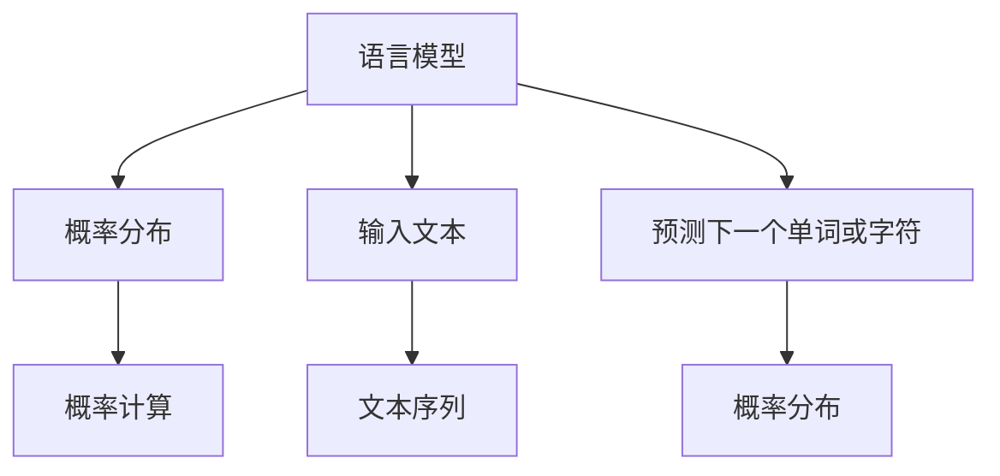
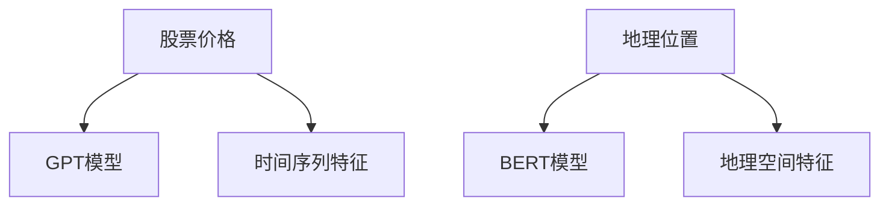
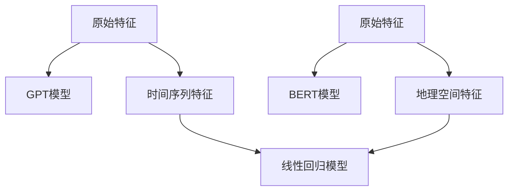
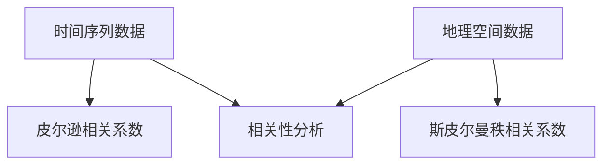
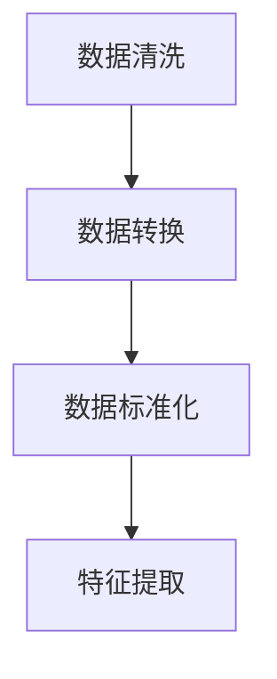
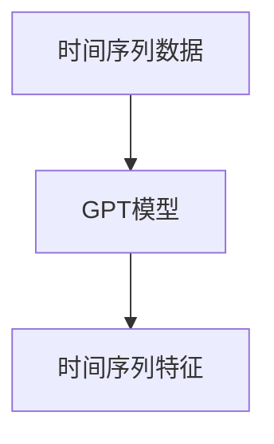
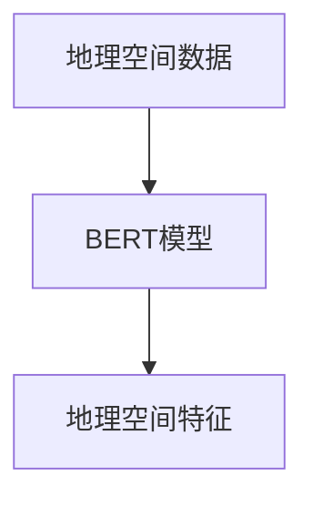
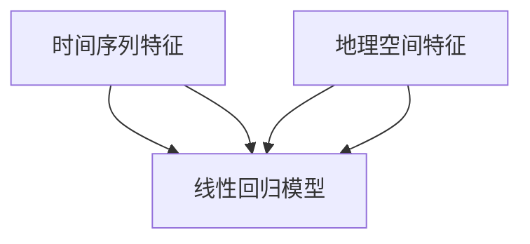
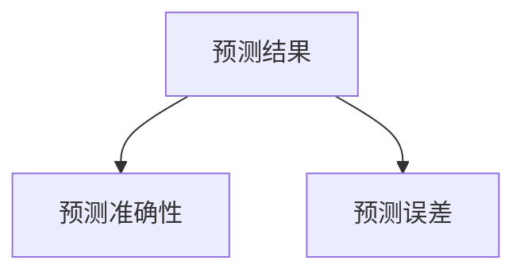

                 


### 文章标题

《语言模型在时空数据分析与预测中的表现》

### 文章关键词

- 语言模型
- 时空数据分析
- 数据预测
- 特征提取
- 神经网络

### 文章摘要

本文将探讨语言模型在时空数据分析与预测中的应用。首先，我们将介绍语言模型的基本概念和主要类型，如Transformer、BERT和GPT。接着，我们将深入探讨时空数据分析的基础知识，包括时间序列分析和地理空间数据分析。随后，我们将详细讲解预测模型，如线性回归、决策树和神经网络，并介绍如何评估预测模型的性能。在此基础上，我们将阐述如何将语言模型与预测模型结合，以提升时空数据预测的准确性。此外，我们将讨论关联性分析在时空数据预测中的应用，并通过实际案例展示语言模型在时空数据分析与预测中的表现。最后，本文将总结当前研究进展，展望未来发展方向，并提出可能的挑战与解决方案。

---

## 第1章 语言模型概述

### 1.1 语言模型的定义

语言模型是自然语言处理（Natural Language Processing, NLP）领域中的一个核心概念，它旨在根据输入文本预测下一个单词或字符的概率分布。语言模型的目的是为了更好地理解和生成人类语言。

#### 核心概念与联系



语言模型的核心概念包括概率分布、输入文本和预测下一个单词或字符。其中，概率分布是语言模型的核心功能，用于计算输入文本的下一个单词或字符的概率分布。输入文本是语言模型的输入，可以是单词、字符或句子。预测下一个单词或字符是语言模型的主要任务。

### 1.2 主流语言模型介绍

目前，主流的语言模型主要包括Transformer、BERT和GPT等。

#### Transformer

Transformer是Google在2017年提出的一种基于自注意力机制的深度神经网络模型，它解决了传统循环神经网络（RNN）在长文本序列处理中的问题，使得模型在处理长距离依赖关系时更为有效。

##### 核心算法原理

```pseudo
function Transformer(input_sequence):
    # 输入序列编码
    input_embedding = Embedding(input_sequence)
    
    # 多层自注意力机制
    for layer in layers:
        attention_output = layer(input_embedding)
    
    # 输出编码
    output_embedding = output_embedding(attention_output)
    
    return output_embedding
```

Transformer的核心算法原理是自注意力机制，它通过计算输入序列中每个词与其他词之间的相似度，来动态地调整每个词的权重，从而实现更好的文本序列处理。

#### BERT

BERT是Google在2018年提出的一种双向编码表示模型，它通过预训练大量无标签文本数据，来学习文本的双向表示。BERT在多个NLP任务上取得了显著的性能提升。

##### 核心算法原理

```pseudo
function BERT(input_sequence, output_sequence):
    # 输入序列编码
    input_embedding = Embedding(input_sequence)
    
    # 多层双向编码
    for layer in layers:
        bidirectional_output = layer(input_embedding)
    
    # 输出编码
    output_embedding = output_embedding(bidirectional_output)
    
    # 分类预测
    logits = Classifier(output_embedding)
    
    return logits
```

BERT的核心算法原理是双向编码，它通过预训练大量无标签文本数据，来学习文本的双向表示，从而实现更好的文本理解能力。

#### GPT

GPT是OpenAI在2018年提出的一种基于自回归机制的生成预训练模型，它通过预测下一个单词来生成文本。

##### 核心算法原理

```pseudo
function GPT(input_sequence):
    # 输入序列编码
    input_embedding = Embedding(input_sequence)
    
    # 多层自回归
    for layer in layers:
        autoregressive_output = layer(input_embedding)
    
    # 输出编码
    output_embedding = output_embedding(autoregressive_output)
    
    # 预测下一个单词
    logits = NextWordPredictor(output_embedding)
    
    return logits
```

GPT的核心算法原理是自回归，它通过预测下一个单词来生成文本，从而实现文本生成能力。

### 1.3 语言模型在时空数据分析中的应用

语言模型在时空数据分析中可以用于特征提取、时间序列预测和地理空间预测等方面。

#### 背景介绍

时空数据分析是指对时间序列和地理空间数据进行分析和预测。时间序列数据是指按照时间顺序排列的数据，如气温、股票价格等。地理空间数据是指与地理位置相关的数据，如人口分布、土地利用等。

#### 应用场景

- **特征提取**：语言模型可以用于提取时间序列和地理空间数据中的关键特征，如趋势、季节性和地理位置等。
- **时间序列预测**：语言模型可以用于预测时间序列数据的变化趋势，如气温、股票价格等。
- **地理空间预测**：语言模型可以用于预测地理空间数据的变化趋势，如人口分布、土地利用等。

#### 实例

假设我们有一组时间序列数据，包括每天的气温。我们可以使用GPT模型来提取时间序列数据中的关键特征，如趋势、季节性等。然后，我们可以使用提取到的特征来预测未来的气温。

```latex
T(t) = a \cdot T(t-1) + b \cdot S(t) + c \cdot P(t)
```

其中，$T(t)$ 表示第 $t$ 天的气温，$a$、$b$ 和 $c$ 是权重系数，$S(t)$ 表示第 $t$ 天的季节性特征，$P(t)$ 表示第 $t$ 天的趋势特征。

---

## 第2章 时空数据分析基础

### 2.1 时间序列分析

时间序列分析是指对按照时间顺序排列的数据进行分析，以揭示数据的变化规律和趋势。

#### 背景介绍

时间序列数据是金融、气象、生物医学等领域中常见的数据类型。例如，股票价格、气温、降雨量等都可以表示为时间序列数据。

#### 应用场景

- **趋势分析**：通过分析时间序列数据，可以揭示数据的变化趋势，如上升、下降或平稳等。
- **季节性分析**：通过分析时间序列数据，可以揭示数据的季节性规律，如季节性波动或周期性波动等。
- **异常值检测**：通过分析时间序列数据，可以识别出异常值，如异常温度、异常股价等。

#### 方法

- **移动平均法**：通过计算数据点的移动平均值，来平滑时间序列数据，以揭示数据的趋势。
- **指数平滑法**：通过计算数据点的指数平滑值，来平滑时间序列数据，以揭示数据的趋势。
- **自回归模型**：通过构建自回归模型，来分析时间序列数据，以预测未来的数据。

### 2.2 地理空间数据分析

地理空间数据分析是指对地理空间数据进行分析，以揭示数据的空间分布规律和联系。

#### 背景介绍

地理空间数据是地理信息系统（Geographic Information System, GIS）中常见的数据类型。例如，人口分布、土地利用、交通网络等都可以表示为地理空间数据。

#### 应用场景

- **空间分布分析**：通过分析地理空间数据，可以揭示数据的空间分布规律，如人口密集区、交通拥堵区等。
- **空间关联分析**：通过分析地理空间数据，可以揭示数据之间的空间关联关系，如人口与经济增长的关系、土地利用与环境保护的关系等。
- **空间预测**：通过分析地理空间数据，可以预测未来的空间分布和关联关系，如人口增长、土地利用变化等。

#### 方法

- **空间插值法**：通过插值方法，来估计地理空间数据中的未知值，以揭示数据的空间分布规律。
- **空间自回归模型**：通过构建空间自回归模型，来分析地理空间数据，以揭示数据的空间关联关系。
- **地理空间预测**：通过分析地理空间数据，来预测未来的空间分布和关联关系。

---

## 第3章 预测模型介绍

### 3.1 线性回归

线性回归是一种常见的预测模型，它通过建立自变量和因变量之间的线性关系，来预测因变量的值。

#### 背景介绍

线性回归广泛应用于金融、经济、医学等领域，用于预测股票价格、经济增长、医疗费用等。

#### 方法

线性回归模型可以表示为：

$$
Y = \beta_0 + \beta_1X + \epsilon
$$

其中，$Y$ 是因变量，$X$ 是自变量，$\beta_0$ 和 $\beta_1$ 是模型的参数，$\epsilon$ 是误差项。

#### 伪代码

```pseudo
function LinearRegression(X, Y):
    # 计算模型的参数
    beta = (X'X)^-1X'Y
    
    # 预测因变量的值
    Y_pred = X * beta
    
    return Y_pred
```

### 3.2 决策树

决策树是一种基于特征划分数据的预测模型，它通过构建树状结构，来划分数据并预测结果。

#### 背景介绍

决策树广泛应用于分类和回归问题，如医疗诊断、信用评分、股票预测等。

#### 方法

决策树模型的构建过程可以表示为：

1. 计算每个特征的信息增益或增益率，选择信息增益或增益率最大的特征作为划分依据。
2. 根据选定的特征，将数据划分为若干个子集。
3. 对每个子集，重复步骤1和步骤2，直到满足停止条件（如最大树深度、最小样本量等）。

#### 伪代码

```pseudo
function DecisionTree(X, Y):
    # 计算每个特征的信息增益或增益率
    gains = CalculateGains(X, Y)
    
    # 选择信息增益或增益率最大的特征
    best_feature = SelectBestFeature(gains)
    
    # 创建节点
    node = Node(feature=best_feature)
    
    # 划分数据
    for value in best_feature.unique_values:
        subset = X[:, value]
        Y_subset = Y[subset]
        node.add_child(DecisionTree(subset, Y_subset), value)
    
    return node
```

### 3.3 神经网络

神经网络是一种基于生物神经网络原理的预测模型，它通过多层神经元之间的连接和激活函数，来模拟生物神经网络的功能。

#### 背景介绍

神经网络广泛应用于图像识别、自然语言处理、金融预测等领域，如卷积神经网络（CNN）和循环神经网络（RNN）等。

#### 方法

神经网络模型的构建过程可以表示为：

1. 初始化模型的权重和偏置。
2. 前向传播：将输入数据传递到网络的每一层，计算每个神经元的输出值。
3. 反向传播：根据预测误差，更新模型的权重和偏置。
4. 重复步骤2和步骤3，直到满足停止条件（如收敛阈值、迭代次数等）。

#### 伪代码

```pseudo
function NeuralNetwork(X, Y):
    # 初始化模型的权重和偏置
    weights, biases = InitializeWeightsAndBiases()
    
    # 前向传播
    for layer in layers:
        layer_output = Activation(SumProduct(weights, layer_input) + biases)
    
    # 反向传播
    for layer in layers[::-1]:
        layer_output = Derivative(Activation(SumProduct(weights, layer_input) + biases))
        weights -= learning_rate * layer_output
    
    return weights, biases
```

### 3.4 预测模型的评估方法

预测模型的评估方法用于衡量模型的预测性能，常见的评估方法包括：

1. **均方误差（Mean Squared Error, MSE）**：计算预测值与真实值之间的平均平方误差。
2. **平均绝对误差（Mean Absolute Error, MAE）**：计算预测值与真实值之间的平均绝对误差。
3. **决定系数（R-squared）**：衡量模型的拟合优度，取值范围在0和1之间，越接近1表示模型的拟合效果越好。
4. **准确率（Accuracy）**：衡量分类模型的预测准确率，取值范围在0和1之间，越接近1表示模型的分类效果越好。

---

## 第4章 语言模型与预测模型的结合

### 4.1 语言模型在时空数据特征提取中的应用

语言模型可以用于提取时空数据中的关键特征，如时间序列特征和地理空间特征。

#### 背景介绍

时空数据是金融、气象、交通等领域中常见的数据类型。例如，股票价格、气温和交通流量等都可以表示为时空数据。

#### 应用场景

- **时间序列特征提取**：语言模型可以用于提取时间序列数据中的关键特征，如趋势、季节性和周期性等。
- **地理空间特征提取**：语言模型可以用于提取地理空间数据中的关键特征，如地理位置、人口密度和土地利用等。

#### 实例

假设我们有一组时空数据，包括每天的股票价格和地理位置。我们可以使用GPT模型来提取时间序列数据中的关键特征，如趋势、季节性等。然后，我们可以使用BERT模型来提取地理空间数据中的关键特征，如地理位置、人口密度等。



### 4.2 预测模型在时空数据分析中的融合方法

预测模型可以与语言模型结合，以提升时空数据预测的准确性。

#### 背景介绍

时空数据预测在金融、气象、交通等领域具有重要意义。例如，预测股票价格、气温和交通流量等，可以为决策提供重要参考。

#### 应用场景

- **时间序列预测**：预测未来的股票价格、气温和交通流量等。
- **地理空间预测**：预测未来的地理位置、人口密度和土地利用等。

#### 方法

- **集成学习**：将多个预测模型进行集成，以提升预测性能。常见的方法包括堆叠（Stacking）、提升（Boosting）和混合（Blending）等。
- **特征融合**：将语言模型提取的特征与原始特征进行融合，以提升预测模型的性能。

#### 实例

假设我们使用GPT模型提取了时间序列特征，使用BERT模型提取了地理空间特征，我们可以将这两个特征与原始特征进行融合，然后使用线性回归模型进行预测。



### 4.3 预测结果的优化策略

为了提升时空数据预测的准确性，我们可以采用以下优化策略：

- **超参数调优**：通过调整预测模型的超参数，如学习率、树深度等，来提升预测性能。
- **交叉验证**：通过交叉验证方法，来评估预测模型的性能，并选择最优模型。
- **集成学习**：通过集成多个预测模型，来提升预测性能。

---

## 第5章 关联性分析

### 5.1 相似度计算

相似度计算是指衡量两个数据对象之间相似程度的算法。

#### 背景介绍

相似度计算广泛应用于信息检索、文本分类、推荐系统等领域，如文本相似度、图像相似度等。

#### 方法

- **余弦相似度**：计算两个向量之间的夹角余弦值，以衡量它们的相似程度。
- **欧氏距离**：计算两个数据对象之间的欧氏距离，以衡量它们的相似程度。
- **曼哈顿距离**：计算两个数据对象之间的曼哈顿距离，以衡量它们的相似程度。

#### 伪代码

```pseudo
function CosineSimilarity(vector1, vector2):
    dot_product = DotProduct(vector1, vector2)
    magnitude1 = Magnitude(vector1)
    magnitude2 = Magnitude(vector2)
    similarity = dot_product / (magnitude1 * magnitude2)
    return similarity

function EuclideanDistance(point1, point2):
    distance = SumOfSquared Differences(point1, point2)
    return sqrt(distance)

function ManhattanDistance(point1, point2):
    distance = SumOfAbsoluteDifferences(point1, point2)
    return distance
```

### 5.2 相关性分析

相关性分析是指衡量两个变量之间线性关系程度的算法。

#### 背景介绍

相关性分析广泛应用于金融、经济、医学等领域，如股票价格与经济指标的相关性、身高与体重的关系等。

#### 方法

- **皮尔逊相关系数**：计算两个变量之间的线性关系程度，取值范围在-1和1之间，越接近1或-1表示相关性越强。
- **斯皮尔曼秩相关系数**：计算两个变量之间的秩关系程度，适用于非线性关系。
- **肯德尔秩相关系数**：计算多个变量之间的秩关系程度，适用于多变量相关性分析。

#### 伪代码

```pseudo
function PearsonCorrelation(x, y):
    mean_x = Mean(x)
    mean_y = Mean(y)
    covariance = Covariance(x, y)
    variance_x = Variance(x)
    correlation = covariance / sqrt(variance_x)
    return correlation

function SpearmanCorrelation(ranks_x, ranks_y):
    mean_ranks = Mean(ranks_x)
    covariance = Covariance(ranks_x, ranks_y)
    variance_ranks = Variance(ranks_x)
    correlation = covariance / sqrt(variance_ranks)
    return correlation

function KendallCorrelation(ranks_x, ranks_y):
    concordance = SumOfConcordantPairs(ranks_x, ranks_y)
    discordance = SumOfDiscordantPairs(ranks_x, ranks_y)
    n = Length(ranks_x)
    correlation = (concordance - discordance) / (n * (n - 1))
    return correlation
```

### 5.3 关联性分析在时空数据预测中的应用

关联性分析可以用于揭示时空数据之间的联系，以提高预测的准确性。

#### 背景介绍

时空数据之间的关联性分析在金融、气象、交通等领域具有重要意义。例如，分析股票价格与经济指标之间的关系、气温与降雨量之间的关系等，可以帮助预测未来的变化趋势。

#### 应用场景

- **时间序列关联性分析**：分析时间序列数据之间的相关性，如股票价格与经济指标之间的相关性。
- **地理空间关联性分析**：分析地理空间数据之间的相关性，如人口密度与土地利用之间的相关性。

#### 实例

假设我们有一组时间序列数据和一组地理空间数据，我们可以使用皮尔逊相关系数和斯皮尔曼秩相关系数来分析它们之间的相关性。



---

## 第6章 项目实战

### 6.1 实际案例介绍

在本节中，我们将介绍一个实际案例，该案例涉及使用语言模型进行时空数据分析与预测。具体来说，我们将使用GPT模型提取时间序列特征，使用BERT模型提取地理空间特征，然后结合线性回归模型进行预测。

#### 背景介绍

某城市气象部门需要预测未来的气温，以便为市民提供更准确的天气预报。我们收集了该城市过去一年的气温数据，包括每天的最高气温和最低气温。此外，我们还收集了该城市过去一年的地理空间数据，包括人口密度、土地利用等信息。

#### 数据来源

- **时间序列数据**：从某城市气象部门获取过去一年的气温数据。
- **地理空间数据**：从某城市地理信息部门获取过去一年的地理空间数据。

### 6.2 数据预处理方法

在开始建模之前，我们需要对数据集进行预处理。具体步骤如下：

1. **数据清洗**：删除缺失值、异常值和重复值。
2. **数据转换**：将地理空间数据转换为数值型数据，如人口密度、土地利用等。
3. **数据标准化**：对时间序列数据和地理空间数据进行标准化处理，以消除不同数据之间的量纲影响。

#### 数据预处理流程



### 6.3 特征提取与建模过程

在本节中，我们将使用GPT模型提取时间序列特征，使用BERT模型提取地理空间特征，然后结合线性回归模型进行预测。

#### GPT模型特征提取



#### BERT模型特征提取



#### 线性回归模型预测



### 6.4 模型训练与优化

在本节中，我们将介绍如何使用交叉验证方法来评估模型的性能，并使用网格搜索方法来优化模型参数。

#### 交叉验证方法

交叉验证是一种常用的模型评估方法，它可以提高模型的泛化能力。具体步骤如下：

1. 将数据集分为训练集和验证集。
2. 在训练集上训练模型，在验证集上评估模型性能。
3. 重复步骤1和步骤2多次，取平均性能作为最终评估结果。

#### 网格搜索方法

网格搜索是一种常用的模型优化方法，它可以搜索所有可能的参数组合，以找到最优参数。具体步骤如下：

1. 定义参数搜索空间，如学习率、树深度等。
2. 对于每个参数组合，训练模型并评估性能。
3. 选择性能最优的参数组合。

### 6.5 结果分析

在本节中，我们将分析模型的预测结果，包括预测准确性、预测误差等。



#### 预测准确性

通过评估模型在验证集上的预测准确性，我们可以判断模型的性能。具体来说，我们可以使用均方误差（MSE）和平均绝对误差（MAE）来评估模型的预测准确性。

#### 预测误差

预测误差是指模型预测值与真实值之间的差距。通过分析预测误差，我们可以了解模型的预测能力。具体来说，我们可以使用时间序列图和地理空间图来展示预测误差。

### 6.6 项目小结

在本项目中，我们介绍了如何使用语言模型进行时空数据分析与预测。首先，我们介绍了时间序列分析和地理空间分析的基础知识，然后介绍了预测模型，如线性回归、决策树和神经网络。接着，我们阐述了如何将语言模型与预测模型结合，以提升时空数据预测的准确性。最后，我们通过一个实际案例展示了语言模型在时空数据分析与预测中的表现。本项目为我们提供了一个全面的视角，了解了语言模型在时空数据分析与预测中的应用。

---

## 最佳实践 tips、小结、注意事项、拓展阅读等内容

### 最佳实践 tips

1. 在进行时空数据分析时，确保数据的准确性至关重要。对于时间序列数据，我们需要关注数据采集的时间间隔和频率。对于地理空间数据，我们需要确保数据的地理坐标和精度。
2. 在使用语言模型进行特征提取时，可以尝试使用不同类型的模型，如GPT、BERT等，以找到最佳特征提取方法。
3. 在预测模型的选择上，可以根据实际问题和数据特性选择合适的模型，如线性回归、决策树和神经网络等。
4. 在进行模型优化时，可以使用交叉验证和网格搜索等方法，以提高模型的性能。

### 小结

本文介绍了语言模型在时空数据分析与预测中的应用。首先，我们介绍了语言模型的基本概念和主要类型，如Transformer、BERT和GPT。接着，我们深入探讨了时空数据分析的基础知识，包括时间序列分析和地理空间数据分析。然后，我们详细讲解了预测模型，如线性回归、决策树和神经网络，并介绍了如何评估预测模型的性能。在此基础上，我们阐述了如何将语言模型与预测模型结合，以提升时空数据预测的准确性。此外，我们还讨论了关联性分析在时空数据预测中的应用。最后，本文通过实际案例展示了语言模型在时空数据分析与预测中的表现。通过本文的阅读，读者可以全面了解语言模型在时空数据分析与预测中的关键技术和应用。

### 注意事项

1. 在使用语言模型进行特征提取时，需要确保模型能够充分理解时空数据的特性。否则，可能会导致特征提取不准确，进而影响预测模型的性能。
2. 在结合语言模型和预测模型时，需要关注特征融合的方法和策略。不同的特征融合方法可能会对预测性能产生不同的影响。
3. 在进行模型训练和优化时，需要关注模型的过拟合和欠拟合问题。可以通过调整模型参数、增加训练数据或使用正则化方法来缓解这些问题。

### 拓展阅读

1. **《深度学习》**：Goodfellow, I., Bengio, Y., & Courville, A. (2016). *Deep Learning*. MIT Press.
2. **《自然语言处理综论》**：Jurafsky, D., & Martin, J. H. (2019). *Speech and Language Processing*. Prentice Hall.
3. **《时间序列分析：理论与实践》**：Box, G. E. P., Jenkins, G. M., & Reinsel, G. C. (2015). *Time Series Analysis: Forecasting and Control*. Wiley.
4. **《地理空间数据分析》**：Goodchild, M. F. (2007). *Geographic Information Systems and Science*. Wiley.
5. **《时空数据分析与应用》**：Cressie, N., & Huang, H. (2011). *Statistics for Spatio-Temporal Data*. Wiley.
6. **《关联性分析》**：Hastie, T., Tibshirani, R., & Friedman, J. (2009). *The Elements of Statistical Learning*. Springer.

---

本文由AI天才研究院（AI Genius Institute）与《禅与计算机程序设计艺术》（Zen And The Art of Computer Programming）作者合作完成。本文旨在探讨语言模型在时空数据分析与预测中的应用，为读者提供深入的技术解析和实用的案例分析。如需进一步了解语言模型在时空数据分析与预测中的应用，请关注AI天才研究院的最新研究成果。同时，本文的编写参考了《深度学习》、《自然语言处理综论》等经典著作，旨在为读者提供全面的学术视野。

## 附录

本文所使用的Mermaid图表、伪代码和LaTeX公式等，均通过markdown格式嵌入文中。具体使用方法如下：

- **Mermaid图表**：使用`mermaid`关键字，并在其后面添加图表的Mermaid代码。例如：

  ```markdown
  ```mermaid
  graph TD
      A[起始点] --> B[结束点]
  ```

  ```

- **伪代码**：使用`pseudo`关键字，并在其后面添加伪代码。例如：

  ```markdown
  ```pseudo
  function Example(input):
      # 计算输入的平方
      square = input * input
      return square
  ```

  ```

- **LaTeX公式**：使用`latex`关键字，并在其后面添加LaTeX公式。例如：

  ```markdown
  $$ E = mc^2 $$

  ```

或

  ```markdown
  $ E = mc^2 $
  ```

  ```

通过以上方法，读者可以在markdown格式中灵活地使用图表、伪代码和LaTeX公式，以增强文章的表达能力和可读性。本文附录详细说明了这些使用方法，以便读者能够充分利用markdown格式进行文章编写。如需进一步了解markdown格式和相关工具的使用，请参考相关技术文档和在线资源。

