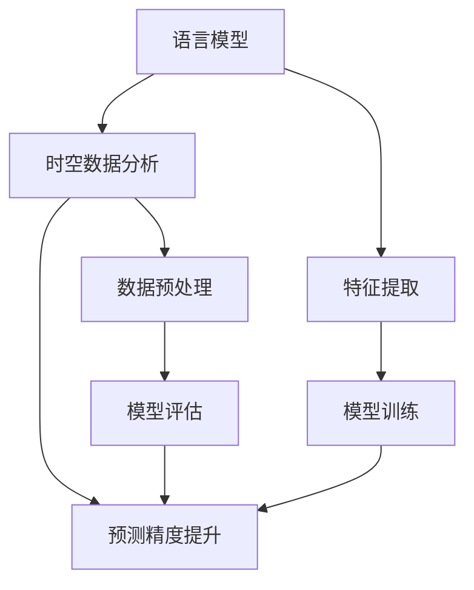

                 

## 引言与核心概念概述

### 研究背景与意义

在当今信息爆炸的时代，数据已成为关键的资源和驱动力。特别是时空数据，它们不仅包含了时间维度上的变化，还蕴含了空间分布的特性，使得从这些数据中提取有价值的信息成为了一项极具挑战性的任务。传统的数据分析方法往往难以应对时空数据的复杂性和多样性，导致预测精度和效果受限。

语言模型（Language Model）作为自然语言处理（Natural Language Processing, NLP）的核心技术，通过训练大规模文本数据，能够生成流畅、准确的文本。随着深度学习技术的发展，语言模型在文本生成、情感分析、机器翻译等领域的表现日益突出。然而，如何将语言模型应用于时空数据分析，以提升预测精度和效果，成为一个亟待探索的课题。

本文旨在研究语言模型在时空数据分析与预测精度提升中的应用，探讨其核心概念、算法原理和数学模型，并通过具体项目实战验证其可行性和有效性。

### 语言模型基础

语言模型是一种基于统计方法或机器学习算法，用于预测下一个单词或字符的概率分布的模型。它可以通过训练大量文本数据，学习到语言的内在规律，从而在生成文本或进行语言相关任务时，提供可靠的参考。

根据模型的结构和训练方式，语言模型可以分为以下几种类型：

1. **n-gram模型**：这是最早的语言模型之一，它基于相邻的n个单词或字符来预测下一个单词或字符的概率。n-gram模型简单有效，但在处理长文本时表现较差。

2. **循环神经网络（RNN）**：RNN是一种能够处理序列数据的神经网络，通过记忆单元来保存历史信息，从而更好地捕捉文本中的长期依赖关系。

3. **长短期记忆网络（LSTM）**：LSTM是RNN的一种改进版本，它通过引入门结构来控制信息的流动，解决了RNN在训练长序列数据时容易遇到的梯度消失和梯度爆炸问题。

4. **变换器（Transformer）**：Transformer是由Google提出的基于自注意力机制的深度神经网络架构，它在处理长文本和序列任务时表现出色，是目前最先进的语言模型之一。

语言模型在自然语言处理中的应用广泛，如文本分类、机器翻译、语音识别等。通过语言模型，计算机可以更好地理解和生成自然语言，从而实现人机交互和智能对话系统。

### 时空数据分析

时空数据是指同时包含时间和空间维度信息的复杂数据。这类数据在许多领域具有重要应用，如气象预测、交通管理、城市规划、环境监测等。时空数据分析旨在从这些数据中提取有价值的信息，进行有效的决策和预测。

时空数据的特性主要包括以下几个方面：

1. **时空分布性**：时空数据不仅在时间上具有连续性，还在空间上具有离散性或连续性。这意味着数据在时间和空间上都有一定的规律和模式。

2. **动态性**：时空数据随着时间和空间的变化而不断更新，具有动态性。这种动态性要求分析模型能够适应数据的实时变化。

3. **多维性**：时空数据通常包含多个维度，如温度、湿度、速度、密度等。这意味着在分析时，需要综合考虑多个维度的影响。

4. **复杂性**：时空数据通常具有高维度、非线性、多时变特性，使得传统分析方法难以有效处理。因此，需要开发新的算法和模型来应对这些挑战。

时空数据分析的方法和技术包括：

1. **时间序列分析**：时间序列分析是研究如何从时间维度上分析数据的统计方法。常用的方法包括ARIMA模型、LSTM模型等。

2. **空间分析**：空间分析是研究如何从空间维度上分析数据的几何方法。常用的方法包括Kriging插值、地理信息系统（GIS）等。

3. **时空预测**：时空预测是结合时间和空间维度的预测方法。常用的模型包括ST-LSTM模型、GRU模型等。

4. **多变量分析**：多变量分析是同时考虑多个维度影响的方法。常用的方法包括主成分分析（PCA）、因子分析等。

### 预测精度提升

预测精度是评估模型性能的重要指标。在时空数据分析中，提高预测精度意味着能够更准确地预测未来的时间和空间变化，从而为决策提供更可靠的依据。

提高预测精度的方法可以分为以下几个方面：

1. **特征工程**：特征工程是通过对原始数据进行处理和转换，提取出对预测任务更有价值的信息。常用的方法包括特征选择、特征变换等。

2. **模型选择**：选择合适的模型对于提高预测精度至关重要。不同的模型适用于不同的数据特点和预测任务。例如，对于非线性时间序列数据，可以考虑使用LSTM或GRU模型；对于时空数据，可以考虑使用ST-LSTM或GRU模型。

3. **参数优化**：模型参数的优化对于提高预测精度有显著影响。常用的方法包括网格搜索、贝叶斯优化等。

4. **集成学习**：集成学习是将多个模型组合起来，以实现更好的预测效果。常用的方法包括随机森林、梯度提升树等。

5. **深度学习**：深度学习是一种基于多层神经网络的学习方法，通过学习数据的高层次特征，能够实现高效的预测。近年来，深度学习在时空数据分析中的应用越来越广泛。

### 联系与流程图

语言模型、时空数据分析与预测精度提升之间存在紧密的联系。语言模型通过学习文本数据，提取出语言的内在规律，可以为时空数据分析提供强有力的支持。同时，通过提高预测精度，可以进一步优化时空数据分析的结果。

下面使用Mermaid流程图来展示它们之间的联系：



在这个流程图中，语言模型通过特征提取和数据预处理，为时空数据分析提供了关键的支持。经过模型训练和评估，可以不断提升预测精度，从而优化时空数据分析的效果。

## 第1章：引言与核心概念概述

### 1.1 研究背景与意义

在当今信息爆炸的时代，数据已成为关键的资源和驱动力。特别是时空数据，它们不仅包含了时间维度上的变化，还蕴含了空间分布的特性，使得从这些数据中提取有价值的信息成为了一项极具挑战性的任务。传统的数据分析方法往往难以应对时空数据的复杂性和多样性，导致预测精度和效果受限。

语言模型（Language Model）作为自然语言处理（Natural Language Processing, NLP）的核心技术，通过训练大规模文本数据，能够生成流畅、准确的文本。随着深度学习技术的发展，语言模型在文本生成、情感分析、机器翻译等领域的表现日益突出。然而，如何将语言模型应用于时空数据分析，以提升预测精度和效果，成为一个亟待探索的课题。

本文旨在研究语言模型在时空数据分析与预测精度提升中的应用，探讨其核心概念、算法原理和数学模型，并通过具体项目实战验证其可行性和有效性。

### 1.2 语言模型基础

语言模型是一种用于预测下一个单词或字符的概率分布的模型，它在自然语言处理（NLP）中扮演着重要的角色。语言模型的基础是统计模型和机器学习模型，通过学习大量的文本数据，它们能够捕捉到语言的内在规律，从而在生成文本或进行语言相关任务时，提供可靠的参考。

#### 1.2.1 n-gram模型

n-gram模型是语言模型的一种基本形式，它基于相邻的n个单词或字符来预测下一个单词或字符的概率。n-gram模型简单有效，计算速度快，但在处理长文本时，表现往往不够理想，因为它忽略了单词之间的长期依赖关系。

n-gram模型的计算公式如下：

\[ P(w_n) = \frac{C(w_n)}{C(T)} \]

其中，\( P(w_n) \) 表示单词 \( w_n \) 的概率，\( C(w_n) \) 表示单词 \( w_n \) 在文本中出现的次数，\( C(T) \) 表示文本中所有单词的总数。

例如，假设有一个文本序列“你好世界”，其中“世界”是我们要预测的单词。根据n-gram模型，我们可以计算“你好世界”这个序列的概率，公式如下：

\[ P(你好世界) = \frac{C(你好世界)}{C(你好世界你好世界世界)} \]

如果“你好世界”在文本中只出现了一次，而“你好世界你好世界世界”出现了两次，则其概率为0.5。

#### 1.2.2 循环神经网络（RNN）

循环神经网络（Recurrent Neural Network, RNN）是一种能够处理序列数据的神经网络，其特点是在网络中引入了循环结构，允许信息在网络中传递和保存。RNN通过记忆单元来保存历史信息，从而更好地捕捉文本中的长期依赖关系。

RNN的基本结构包括输入层、隐藏层和输出层。输入层接收序列中的每个单词或字符，隐藏层通过记忆单元保存当前状态和之前的状态，输出层生成预测的单词或字符。

RNN的前向传播和反向传播过程如下：

1. **前向传播**：
   - 输入 \( x_t \) 经过嵌入层转化为向量 \( h_t \)。
   - \( h_t \) 与之前隐藏状态 \( h_{t-1} \) 相加，经过激活函数得到新的隐藏状态 \( h_t \)。
   - \( h_t \) 输入到输出层，生成预测的单词或字符 \( y_t \)。

2. **反向传播**：
   - 计算输出层的误差 \( \delta_t \)。
   - 通过误差传播，计算隐藏层的梯度 \( \delta_{t-1} \)。
   - 更新隐藏状态和权重。

RNN的伪代码如下：

```python
# 初始化参数
Wx, Wh, Wy, b = 初始化参数()

# 前向传播
for t in range(T):
    h_t = tanh(Wx * x_t + Wh * h_{t-1} + b)
    y_t = softmax(Wy * h_t + b)

# 反向传播
dL/dh_t = y_t - y_t^*
dL/dh_{t-1} = dL/dh_t * (1 - h_t * h_t)

# 更新参数
Wx, Wh, Wy, b = 更新参数(Wx, Wh, Wy, b)
```

RNN的优势在于能够处理序列数据，但它在训练长序列数据时容易遇到梯度消失和梯度爆炸问题，导致训练效果不佳。

#### 1.2.3 长短期记忆网络（LSTM）

长短期记忆网络（Long Short-Term Memory, LSTM）是RNN的一种改进版本，通过引入门结构来控制信息的流动，解决了RNN在训练长序列数据时容易遇到的梯度消失和梯度爆炸问题。LSTM通过记忆单元和三个门结构（输入门、遗忘门和输出门）来实现对信息的控制。

LSTM的基本结构包括输入层、隐藏层和输出层。输入层接收序列中的每个单词或字符，隐藏层通过记忆单元和门结构保存当前状态和之前的状态，输出层生成预测的单词或字符。

LSTM的前向传播和反向传播过程如下：

1. **前向传播**：
   - 输入 \( x_t \) 经过嵌入层转化为向量 \( h_t \)。
   - \( h_t \) 与之前隐藏状态 \( h_{t-1} \) 相加，经过输入门和遗忘门，得到新的隐藏状态 \( h_t \)。
   - \( h_t \) 输入到输出门，生成预测的单词或字符 \( y_t \)。

2. **反向传播**：
   - 计算输出层的误差 \( \delta_t \)。
   - 通过误差传播，计算隐藏层的梯度 \( \delta_{t-1} \)。
   - 更新隐藏状态和权重。

LSTM的伪代码如下：

```python
# 初始化参数
Wx, Wh, Wy, b = 初始化参数()

# 前向传播
for t in range(T):
    i_t = sigmoid(Wx * x_t + Wh * h_{t-1} + b)
    f_t = sigmoid(Wx * x_t + Wh * h_{t-1} + b)
    o_t = sigmoid(Wx * x_t + Wh * h_{t-1} + b)
    g_t = tanh(Wx * x_t + Wh * f_{t-1} * h_{t-1} + b)
    h_t = o_t * tanh(g_t)
    y_t = softmax(Wy * h_t + b)

# 反向传播
dL/dh_t = y_t - y_t^*
dL/di_t = dL/dh_t * i_t * (1 - i_t)
dL/df_t = dL/dh_t * f_t * (1 - f_t)
dL/do_t = dL/dh_t * o_t * (1 - o_t)
dL/dg_t = dL/dh_t * o_t * (1 - g_t * g_t)

# 更新参数
Wx, Wh, Wy, b = 更新参数(Wx, Wh, Wy, b)
```

LSTM的优势在于能够处理长序列数据，但它的计算复杂度较高，训练速度相对较慢。

#### 1.2.4 变换器（Transformer）

变换器（Transformer）是由Google提出的一种基于自注意力机制的深度神经网络架构，它在处理长文本和序列任务时表现出色。与传统的循环神经网络相比，变换器能够并行处理序列数据，提高了计算效率。

变换器的核心是自注意力机制（Self-Attention），它通过计算输入序列中每个元素与其他元素的相关性，生成新的特征表示。变换器的结构包括编码器（Encoder）和解码器（Decoder），其中编码器负责将输入序列编码为特征表示，解码器负责生成预测的输出序列。

变换器的前向传播和反向传播过程如下：

1. **前向传播**：
   - 输入序列经过嵌入层和位置编码，转化为向量。
   - 通过多层自注意力机制，生成新的特征表示。
   - 输出序列通过全连接层和软

