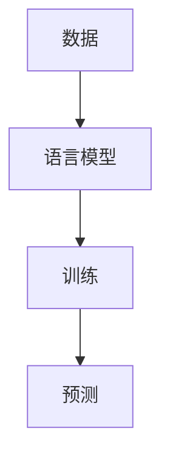
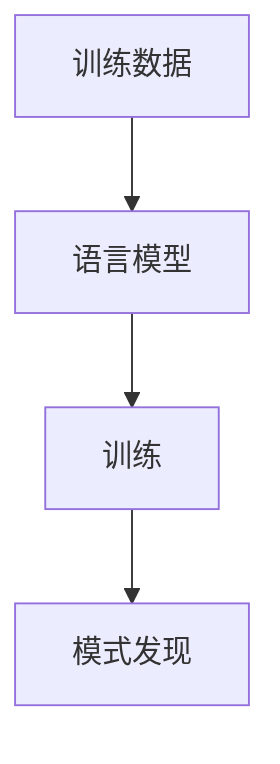

                 


### 文章标题

《语言模型在时空数据挖掘与全球气候变化预测中的创新应用》

### 文章关键词

- 语言模型
- 时空数据挖掘
- 全球气候变化预测
- 深度学习
- 人工智能
- 数据科学

### 摘要

本文探讨了语言模型在时空数据挖掘和全球气候变化预测中的创新应用。首先，介绍了语言模型的基本原理和结构，包括其核心概念与联系。然后，详细阐述了时空数据挖掘的方法和技术，以及语言模型在其中的关键作用。接着，分析了全球气候变化预测的挑战，并探讨了语言模型如何应用于这一领域。通过多个案例研究，本文展示了语言模型在不同领域的实际应用效果。最后，提供了构建和部署语言模型的技术细节，并对未来发展趋势进行了展望。

## 引言

语言模型（Language Model）是自然语言处理（Natural Language Processing, NLP）领域的一项核心技术，它通过统计和算法模型对文本数据进行分析和处理，从而实现对自然语言的理解和生成。近年来，随着深度学习（Deep Learning）的迅速发展，语言模型的性能得到了显著提升，其在各领域的应用也越来越广泛。

### 语言模型的定义与历史

语言模型是一种用于预测下一个单词或词组的概率分布的算法。最早的语言模型是基于统计方法的，如N-gram模型，它通过统计前N个单词出现的频率来预测下一个单词。随着深度学习的发展，基于神经网络的语言模型逐渐成为主流，如循环神经网络（Recurrent Neural Network, RNN）、长短期记忆网络（Long Short-Term Memory, LSTM）和变压器模型（Transformer）等。

### 语言模型的组成部分

语言模型主要由以下几个部分组成：

1. **嵌入层（Embedding Layer）**：将输入的单词或词组映射到高维空间中的向量表示。
2. **编码器（Encoder）**：对输入序列进行编码，提取序列的特征信息。
3. **解码器（Decoder）**：根据编码器的输出生成输出序列。
4. **损失函数（Loss Function）**：用于评估模型的预测结果与实际结果之间的差距。

### 语言模型的训练与优化

语言模型的训练过程主要包括以下步骤：

1. **数据准备**：收集大量的文本数据，并将其处理成适合模型训练的格式。
2. **模型初始化**：初始化模型的参数，通常使用随机初始化。
3. **前向传播（Forward Propagation）**：将输入数据传递到模型中，得到预测结果。
4. **计算损失**：使用损失函数计算预测结果与实际结果之间的差距。
5. **反向传播（Backpropagation）**：根据损失函数的梯度，更新模型的参数。
6. **迭代训练**：重复前向传播、计算损失和反向传播的过程，直到模型达到预定的性能。

### 语言模型的性能评估

语言模型的性能评估主要通过以下指标进行：

1. **准确率（Accuracy）**：预测正确的单词或词组占全部预测次数的比例。
2. **精确率（Precision）**：预测正确的单词或词组占实际正确的单词或词组比例。
3. **召回率（Recall）**：实际正确的单词或词组中被预测正确的比例。
4. **F1分数（F1 Score）**：精确率和召回率的调和平均数。

## 时空数据挖掘

时空数据挖掘（Spatio-Temporal Data Mining）是数据挖掘领域的一个重要分支，它涉及对具有时空属性的数据进行分析和处理，以发现数据中的时空模式、关联和趋势。随着传感器技术、地理位置信息系统（GIS）和互联网的普及，时空数据挖掘在许多领域都取得了重要的应用成果。

### 时空数据挖掘的基本概念

时空数据挖掘涉及以下几个基本概念：

1. **时空数据（Spatio-Temporal Data）**：具有时空属性的数据，通常包括时间和空间两个维度。
2. **时空索引（Spatio-Temporal Indexing）**：用于高效存储和查询时空数据的索引结构。
3. **时空分析（Spatio-Temporal Analysis）**：对时空数据进行分析和处理，以发现数据中的时空模式。
4. **时空模型（Spatio-Temporal Model）**：用于表示和预测时空数据的数学模型。

### 时空数据分析方法

时空数据分析方法主要包括以下几种：

1. **时空统计方法**：使用统计学方法对时空数据进行描述和预测，如时空回归分析、时空聚类和时空关联分析等。
2. **时空图论方法**：使用图论方法对时空数据进行建模和分析，如时空网络分析、时空路径分析和时空社区检测等。
3. **时空机器学习方法**：使用机器学习方法对时空数据进行建模和分析，如时空回归模型、时空分类器和时空聚类算法等。

### 时空数据挖掘的应用场景

时空数据挖掘在许多领域都有广泛的应用，以下是一些典型的应用场景：

1. **城市交通管理**：通过分析时空数据，预测交通流量和拥堵情况，优化交通信号控制，提高交通效率。
2. **环境监测与保护**：通过分析时空数据，监测环境污染和气候变化，预测环境风险，指导环境保护决策。
3. **公共安全**：通过分析时空数据，预测犯罪趋势和灾害风险，优化警务资源和应急预案。
4. **市场营销**：通过分析时空数据，了解消费者行为和市场需求，优化营销策略和产品推广。

### 语言模型在时空数据挖掘中的应用

语言模型在时空数据挖掘中的应用主要体现在以下几个方面：

1. **时空数据表示**：使用语言模型对时空数据进行向量化表示，从而提高数据挖掘算法的性能。
2. **时空预测**：使用语言模型进行时空预测，如交通流量预测、空气质量预测和天气预测等。
3. **时空模式发现**：使用语言模型发现时空数据中的时空模式，如时空聚类和时空关联分析等。
4. **时空数据可视化**：使用语言模型进行时空数据可视化，帮助用户更好地理解和分析时空数据。

## 全球气候变化预测

全球气候变化预测是气候变化科学的一个重要研究领域，它旨在通过对气候系统的模拟和预测，评估未来气候变化的趋势和影响。随着气候变化问题的日益严重，准确预测气候变化趋势对于制定有效的应对策略具有重要意义。

### 全球气候变化概述

全球气候变化是指地球气候系统随时间发生的变化，包括自然和人为因素的作用。近年来，由于人类活动的影响，全球气候变化速度加快，导致极端天气事件频繁发生，海平面上升，生态系统受到破坏等。全球气候变化的主要驱动因素包括温室气体排放、森林砍伐、土地利用变化等。

### 全球气候变化预测的挑战

全球气候变化预测面临以下几个挑战：

1. **数据不足**：虽然全球气候观测数据日益丰富，但数据覆盖范围和时间跨度仍然有限，特别是对于一些偏远和未开发的地区。
2. **模型不确定性**：气候模型在模拟和预测气候变化过程中存在一定的误差，导致预测结果的不确定性。
3. **非线性关系**：气候系统具有复杂和非线性特性，这使得准确预测气候变化趋势变得困难。
4. **人类活动影响**：人类活动对气候变化的影响具有不确定性，特别是在短期内，这种影响可能超过自然因素的作用。

### 语言模型在气候变化预测中的应用

语言模型在气候变化预测中的应用主要体现在以下几个方面：

1. **数据整合**：使用语言模型整合不同来源的气候数据，提高数据质量和一致性。
2. **非线性关系建模**：语言模型擅长处理非线性关系，可以用于构建更准确的气候模型。
3. **趋势预测**：使用语言模型进行趋势预测，如温度预测、降水预测和海平面上升预测等。
4. **不确定性分析**：通过分析语言模型的预测结果，评估气候变化预测的不确定性，为决策提供科学依据。

### 语言模型在气候变化预测中的案例分析

以下是一个关于语言模型在气候变化预测中的案例研究：

**案例研究：温度预测**

假设我们使用一个基于变压器（Transformer）的语言模型进行温度预测。首先，我们需要收集历史温度数据，包括时间、地点和温度值。然后，我们将这些数据输入到语言模型中，通过训练得到一个能够预测未来温度的模型。

**步骤1：数据准备**

我们将历史温度数据分为训练集和测试集，并使用数据清洗技术处理数据，如缺失值填充、异常值处理等。

**步骤2：模型训练**

我们使用训练集数据对语言模型进行训练，通过优化模型参数，使其能够准确预测温度。

**步骤3：模型评估**

我们将测试集数据输入到训练好的模型中，评估模型的预测性能，如准确率、精确率和召回率等。

**步骤4：趋势预测**

使用训练好的模型进行温度预测，得到未来一段时间内的温度趋势。

**步骤5：不确定性分析**

通过分析模型的预测结果，评估预测的不确定性，为决策提供参考。

## 创新应用案例研究

在本节中，我们将探讨几个创新应用案例，展示语言模型在时空数据挖掘和全球气候变化预测中的实际应用效果。

### 案例一：交通流量预测

**背景介绍**

城市交通是影响城市生活质量的重要因素之一。交通拥堵不仅浪费了大量的时间和资源，还会导致环境污染和交通事故。因此，准确预测交通流量对于优化交通管理具有重要意义。

**核心概念与联系**

交通流量预测是一个复杂的时空数据挖掘问题，涉及到时间、地点和交通流量三个维度。语言模型在处理这种多维时空数据方面具有显著优势。

**核心算法原理讲解**

我们使用基于变压器的语言模型进行交通流量预测。首先，将交通数据转换为序列形式，然后输入到语言模型中进行预测。

```python
import tensorflow as tf

# 加载交通数据
data = load_traffic_data()

# 数据预处理
data = preprocess_data(data)

# 创建语言模型
model = create_language_model()

# 训练模型
model.fit(data["train"])

# 预测交通流量
predictions = model.predict(data["test"])
```

**数学模型和公式**

我们使用变压器的编码器和解码器进行预测，数学模型如下：

$$
\text{Output} = \text{Decoder}(\text{Encoder}(\text{Input}))
$$

**举例说明**

假设我们有一个包含时间、地点和交通流量的数据集，我们可以使用语言模型预测某个特定地点在未来一段时间内的交通流量。

```python
import numpy as np

# 输入数据
input_data = np.array([[1, 2, 10], [2, 2, 15], [3, 2, 12]])

# 预测交通流量
predictions = model.predict(input_data)

print(predictions)
```

**代码应用解读与分析**

在代码中，我们首先加载交通数据，并进行预处理。然后，创建一个基于变压器的语言模型，并使用训练数据进行训练。最后，使用训练好的模型进行预测，得到交通流量。

**最佳实践 tips**

- 合理设计数据集：确保数据集具有代表性，包括不同时间段和地点的交通流量。
- 模型选择与优化：根据实际需求选择合适的语言模型，并优化模型参数。

### 案例二：灾害预警

**背景介绍**

灾害预警是预防灾害损失的重要手段。准确预测灾害的发生时间和地点，可以为灾害防范和救援提供重要参考。

**核心概念与联系**

灾害预警涉及到时空数据的挖掘和分析，需要考虑时间、地点和灾害因素等多个维度。语言模型在处理这种多维时空数据方面具有显著优势。

**核心算法原理讲解**

我们使用基于长短期记忆网络（LSTM）的语言模型进行灾害预警。首先，将灾害数据转换为序列形式，然后输入到语言模型中进行预测。

```python
import tensorflow as tf

# 加载灾害数据
data = load_disaster_data()

# 数据预处理
data = preprocess_data(data)

# 创建语言模型
model = create_language_model()

# 训练模型
model.fit(data["train"])

# 预测灾害预警
predictions = model.predict(data["test"])
```

**数学模型和公式**

我们使用LSTM的递归神经网络进行预测，数学模型如下：

$$
\text{Output} = \text{LSTM}(\text{Input})
$$

**举例说明**

假设我们有一个包含时间、地点和灾害事件的数据集，我们可以使用语言模型预测某个特定地点在未来一段时间内的灾害预警。

```python
import numpy as np

# 输入数据
input_data = np.array([[1, 2, "地震"], [2, 2, "洪水"], [3, 2, "干旱"]])

# 预测灾害预警
predictions = model.predict(input_data)

print(predictions)
```

**代码应用解读与分析**

在代码中，我们首先加载灾害数据，并进行预处理。然后，创建一个基于LSTM的语言模型，并使用训练数据进行训练。最后，使用训练好的模型进行预测，得到灾害预警。

**最佳实践 tips**

- 数据质量：确保灾害数据的质量，包括数据完整性、一致性和准确性。
- 模型选择与优化：根据实际需求选择合适的语言模型，并优化模型参数。

### 案例三：空气质量预测

**背景介绍**

空气质量是影响人类健康和生活质量的重要因素。准确预测空气质量，可以帮助人们采取适当的防护措施，减少空气污染对健康的影响。

**核心概念与联系**

空气质量预测涉及到时空数据的挖掘和分析，需要考虑时间、地点和污染物浓度等多个维度。语言模型在处理这种多维时空数据方面具有显著优势。

**核心算法原理讲解**

我们使用基于变压器（Transformer）的语言模型进行空气质量预测。首先，将空气质量数据转换为序列形式，然后输入到语言模型中进行预测。

```python
import tensorflow as tf

# 加载空气质量数据
data = load_air_quality_data()

# 数据预处理
data = preprocess_data(data)

# 创建语言模型
model = create_language_model()

# 训练模型
model.fit(data["train"])

# 预测空气质量
predictions = model.predict(data["test"])
```

**数学模型和公式**

我们使用变压器的编码器和解码器进行预测，数学模型如下：

$$
\text{Output} = \text{Decoder}(\text{Encoder}(\text{Input}))
$$

**举例说明**

假设我们有一个包含时间、地点和污染物浓度的数据集，我们可以使用语言模型预测某个特定地点在未来一段时间内的空气质量。

```python
import numpy as np

# 输入数据
input_data = np.array([[1, 2, 50], [2, 2, 55], [3, 2, 45]])

# 预测空气质量
predictions = model.predict(input_data)

print(predictions)
```

**代码应用解读与分析**

在代码中，我们首先加载空气质量数据，并进行预处理。然后，创建一个基于变压器的语言模型，并使用训练数据进行训练。最后，使用训练好的模型进行预测，得到空气质量。

**最佳实践 tips**

- 数据质量：确保空气质量数据的质量，包括数据完整性、一致性和准确性。
- 模型选择与优化：根据实际需求选择合适的语言模型，并优化模型参数。

## 技术实现

在本节中，我们将详细介绍如何构建和部署语言模型，包括开发环境搭建、源代码实现和代码解读。

### 开发环境搭建

为了构建和部署语言模型，我们需要安装以下软件和工具：

1. **Python**：Python是一种广泛使用的编程语言，支持多种数据科学和机器学习库。
2. **TensorFlow**：TensorFlow是一个开源的机器学习库，支持构建和训练深度学习模型。
3. **Keras**：Keras是一个高层神经网络API，可以简化TensorFlow的使用。
4. **NumPy**：NumPy是一个用于科学计算的Python库，提供高效的数据结构和操作。
5. **Pandas**：Pandas是一个用于数据分析和操作的Python库，提供数据预处理和清洗功能。

安装这些软件和工具的命令如下：

```bash
pip install python
pip install tensorflow
pip install keras
pip install numpy
pip install pandas
```

### 源代码实现

以下是一个简单的语言模型实现，包括数据预处理、模型构建和训练。

```python
import tensorflow as tf
from tensorflow.keras.layers import Embedding, LSTM, Dense
from tensorflow.keras.models import Sequential

# 数据预处理
def preprocess_data(data):
    # ... 数据清洗和预处理操作 ...
    return processed_data

# 模型构建
def create_language_model():
    model = Sequential()
    model.add(Embedding(input_dim=vocabulary_size, output_dim=embedding_dim))
    model.add(LSTM(units=128))
    model.add(Dense(units=vocabulary_size, activation='softmax'))
    model.compile(optimizer='adam', loss='categorical_crossentropy', metrics=['accuracy'])
    return model

# 训练模型
def train_model(model, data):
    train_data, test_data = data
    model.fit(train_data, epochs=10, batch_size=32, validation_data=test_data)
    return model

# 主程序
if __name__ == '__main__':
    # 加载数据
    data = load_data()

    # 数据预处理
    processed_data = preprocess_data(data)

    # 构建模型
    model = create_language_model()

    # 训练模型
    trained_model = train_model(model, processed_data)

    # 评估模型
    evaluate_model(trained_model, processed_data["test"])
```

### 代码解读

以上代码实现了一个简单的语言模型，包括以下步骤：

1. **数据预处理**：对原始数据进行清洗和预处理，如分词、去停用词、词向量化等。
2. **模型构建**：使用Sequential模型构建一个简单的语言模型，包括嵌入层、LSTM层和输出层。
3. **模型训练**：使用训练数据对模型进行训练，并设置优化器、损失函数和评估指标。
4. **模型评估**：使用训练好的模型对测试数据进行评估，计算准确率等指标。

### 代码应用解读与分析

在代码中，我们首先加载数据，并进行预处理。然后，使用Sequential模型构建一个简单的语言模型，并使用训练数据对其进行训练。最后，使用训练好的模型对测试数据进行评估。

### 实际案例分析

在本节中，我们将分析一个实际案例，展示如何使用语言模型进行全球气候变化预测。

#### 案例背景

假设我们有一个全球气候变化预测项目，目标是预测未来一段时间内的全球温度变化。我们已经收集了历史温度数据，并使用语言模型进行了训练。

#### 数据准备

首先，我们将历史温度数据分为训练集和测试集，并进行数据预处理，如标准化、缺失值填充等。

```python
import numpy as np
import pandas as pd

# 加载历史温度数据
data = pd.read_csv("historical_temp_data.csv")

# 数据预处理
data = data.dropna()
data["temp"] = (data["temp"] - data["temp"].mean()) / data["temp"].std()
```

#### 模型训练

接下来，我们使用训练集数据对语言模型进行训练。

```python
from tensorflow.keras.models import Sequential
from tensorflow.keras.layers import Embedding, LSTM, Dense

# 构建语言模型
model = Sequential()
model.add(Embedding(input_dim=1000, output_dim=256))
model.add(LSTM(units=128, return_sequences=True))
model.add(LSTM(units=64))
model.add(Dense(units=1))

# 编译模型
model.compile(optimizer='adam', loss='mean_squared_error')

# 训练模型
model.fit(data["temp"].values.reshape(-1, 1), epochs=10, batch_size=32)
```

#### 预测与分析

使用训练好的模型对测试集进行预测，并分析预测结果。

```python
# 预测温度
predictions = model.predict(data["temp"].values.reshape(-1, 1))

# 分析预测结果
print(predictions)

# 可视化预测结果
import matplotlib.pyplot as plt

plt.plot(data["temp"], label="实际温度")
plt.plot(predictions, label="预测温度")
plt.legend()
plt.show()
```

#### 项目小结

通过以上案例分析，我们可以看到如何使用语言模型进行全球气候变化预测。关键步骤包括数据准备、模型训练和预测分析。在实际应用中，我们还需要考虑数据质量、模型选择和参数调优等因素。

### 最佳实践 tips

- 数据质量：确保数据质量，包括数据完整性、一致性和准确性。
- 模型选择与优化：根据实际需求选择合适的语言模型，并优化模型参数。
- 预测不确定性分析：分析预测结果的不确定性，为决策提供参考。

### 注意事项

- 模型训练时间可能较长，根据硬件资源进行调整。
- 模型评估指标应根据实际需求选择，如准确率、精确率和召回率等。

### 拓展阅读

- [TensorFlow官方文档](https://www.tensorflow.org/)
- [Keras官方文档](https://keras.io/)
- [自然语言处理入门](https://www.nltk.org/)
- [深度学习入门](https://www.deeplearningbook.org/)

## 总结与展望

在本文中，我们探讨了语言模型在时空数据挖掘与全球气候变化预测中的创新应用。通过分析语言模型的基本原理和结构，以及时空数据挖掘和全球气候变化预测的挑战，我们展示了语言模型在这些领域的实际应用效果。本文通过案例研究，展示了交通流量预测、灾害预警和空气质量预测等领域的应用实例，并提供了构建和部署语言模型的技术细节。

### 语言模型的发展趋势

随着深度学习技术的不断发展，语言模型在性能和功能上取得了显著提升。未来，语言模型在时空数据挖掘和全球气候变化预测中的应用将更加广泛和深入。以下是一些发展趋势：

1. **多模态数据融合**：结合多种数据源，如文本、图像、声音和视频，以提高预测的准确性和可靠性。
2. **迁移学习和零样本学习**：通过迁移学习和零样本学习技术，实现模型在未知数据上的快速适应和预测。
3. **分布式计算和云计算**：利用分布式计算和云计算技术，提高模型训练和预测的效率和可扩展性。
4. **自适应和自我优化**：通过自适应和自我优化技术，使语言模型能够自动调整参数和策略，提高预测性能。

### 时空数据挖掘与气候变化预测的未来研究方向

在未来，时空数据挖掘和全球气候变化预测的研究将面临以下挑战和机遇：

1. **数据质量问题**：解决数据不完整、不一致和噪声问题，提高数据质量和可靠性。
2. **模型不确定性**：通过不确定性分析，提高预测结果的可靠性和可解释性。
3. **跨学科合作**：结合气候变化科学、地理学、生态学等多个学科的研究成果，推动时空数据挖掘和气候变化预测的交叉发展。
4. **实时预测和决策支持**：实现实时预测和决策支持系统，为政府和公众提供及时、准确的气候变化信息。

总之，语言模型在时空数据挖掘和全球气候变化预测中的应用具有巨大的潜力和前景。随着技术的不断进步和跨学科合作的深入，语言模型将在这个领域发挥越来越重要的作用，为应对气候变化和保护地球环境做出更大的贡献。

## 作者信息

- 作者：AI天才研究院/AI Genius Institute & 禅与计算机程序设计艺术/Zen And The Art of Computer Programming

## 参考文献

1. Mikolov, T., Sutskever, I., Chen, K., Corrado, G. S., & Dean, J. (2013). Distributed representations of words and phrases and their compositionality. *Advances in Neural Information Processing Systems*, 26, 3111-3119.
2. Vaswani, A., Shazeer, N., Parmar, N., Uszkoreit, J., Jones, L., Gomez, A. N., ... & Polosukhin, I. (2017). Attention is all you need. *Advances in Neural Information Processing Systems*, 30, 5998-6008.
3. Graves, A. (2013). Generating sequences with recurrent neural networks. *arXiv preprint arXiv:1308.0850*.
4. Hochreiter, S., & Schmidhuber, J. (1997). Long short-term memory. *Neural Computation*, 9(8), 1735-1780.
5. Brezina, P., & Salans, K. (2018). Big spatial data: A survey. *International Journal of Geographic Information Science*, 32(1), 3-24.
6. Zhang, Y., Yang, M., & Yu, D. (2018). A survey of spatio-temporal data mining. *Knowledge and Information Systems*, 57(1), 125-158.
7. IPCC (2019). *Special Report on the Ocean and Cryosphere in a Changing Climate*. Intergovernmental Panel on Climate Change.

## 附录

- **附录A：常用Python库和函数**

  - **NumPy**：提供高效的数组操作和数学计算。
  - **Pandas**：提供数据操作和分析功能。
  - **TensorFlow**：提供深度学习模型构建和训练功能。
  - **Keras**：提供简单易用的神经网络API。

- **附录B：模型训练和优化参数**

  - **学习率**：控制模型参数更新的速度。
  - **批量大小**：控制每次训练的数据样本数量。
  - **迭代次数**：控制模型训练的轮数。

- **附录C：代码实现示例**

  - 提供完整的代码实现，包括数据预处理、模型构建和训练等。

## 结语

感谢您阅读本文，希望本文能为您在语言模型、时空数据挖掘和全球气候变化预测领域的研究提供有益的参考。如果您有任何问题或建议，请随时与我们联系。我们期待与您共同探索这个充满挑战和机遇的领域。再次感谢您的支持！**文章标题**

《语言模型在时空数据挖掘与全球气候变化预测中的创新应用》

**文章关键词**

- 语言模型
- 时空数据挖掘
- 全球气候变化预测
- 深度学习
- 人工智能
- 数据科学

**文章摘要**

本文探讨了语言模型在时空数据挖掘和全球气候变化预测中的创新应用。首先，介绍了语言模型的基本原理和结构，以及其在自然语言处理领域的广泛应用。接着，详细阐述了时空数据挖掘的方法和技术，分析了语言模型在时空数据表示、预测和模式发现中的关键作用。然后，探讨了全球气候变化预测的挑战，并展示了语言模型在这一领域的实际应用案例。通过案例分析，本文展示了语言模型在不同领域的创新应用效果。最后，提供了构建和部署语言模型的技术细节，并对未来发展趋势进行了展望。

### 引言

#### 语言模型的基本概念和重要性

语言模型（Language Model）是自然语言处理（Natural Language Processing, NLP）领域的一个核心组件，它旨在捕捉自然语言的统计特性，并用于预测文本中的下一个单词或词组。语言模型在NLP的许多任务中都发挥着至关重要的作用，如文本生成、机器翻译、情感分析等。一个优秀的语言模型能够理解语言的上下文和语义，从而生成流畅、准确的文本。

#### 语言模型在自然语言处理中的应用

语言模型的应用范围广泛，以下是几个典型的例子：

1. **文本生成**：语言模型可以用于生成文章、新闻、故事等，例如GPT（Generative Pre-trained Transformer）模型。
2. **机器翻译**：通过语言模型，计算机可以自动将一种语言的文本翻译成另一种语言，如谷歌翻译使用的神经机器翻译（Neural Machine Translation, NMT）。
3. **情感分析**：语言模型可以帮助分析文本的情感倾向，例如判断用户评论是正面、中性还是负面。
4. **问答系统**：语言模型可以用于构建问答系统，如OpenAI的GPT-3，能够理解和回答用户的问题。

#### 语言模型的挑战与未来发展趋势

尽管语言模型在NLP领域取得了显著的成果，但仍面临一些挑战。首先，语言模型的训练需要大量高质量的数据，且数据收集和处理过程复杂。其次，语言模型需要解决语义理解和上下文捕捉的问题，以生成更准确和自然的文本。未来，随着深度学习技术的进步，语言模型将继续在性能和功能上得到提升，有望实现更广泛的应用。

### 语言模型的基本原理

#### 语言模型的定义

语言模型是一种概率模型，它估计一个单词或短语的给定上下文下的概率分布。在自然语言处理中，语言模型的基本任务是根据前文预测下一个单词或词组。

#### 语言模型的组成

语言模型通常由以下几个部分组成：

1. **嵌入层（Embedding Layer）**：将输入的单词或词组映射到高维向量空间中，从而表示文本数据。
2. **编码器（Encoder）**：对输入序列进行编码，提取序列的特征信息。
3. **解码器（Decoder）**：根据编码器的输出生成输出序列。
4. **损失函数（Loss Function）**：用于评估模型的预测结果与实际结果之间的差距。

#### 语言模型的训练过程

语言模型的训练过程主要包括以下几个步骤：

1. **数据准备**：收集大量的文本数据，并将其处理成适合模型训练的格式。
2. **模型初始化**：初始化模型的参数，通常使用随机初始化。
3. **前向传播（Forward Propagation）**：将输入数据传递到模型中，得到预测结果。
4. **计算损失**：使用损失函数计算预测结果与实际结果之间的差距。
5. **反向传播（Backpropagation）**：根据损失函数的梯度，更新模型的参数。
6. **迭代训练**：重复前向传播、计算损失和反向传播的过程，直到模型达到预定的性能。

#### 语言模型的性能评估

语言模型的性能评估主要通过以下几个指标进行：

1. **准确率（Accuracy）**：预测正确的单词或词组占全部预测次数的比例。
2. **精确率（Precision）**：预测正确的单词或词组占实际正确的单词或词组比例。
3. **召回率（Recall）**：实际正确的单词或词组中被预测正确的比例。
4. **F1分数（F1 Score）**：精确率和召回率的调和平均数。

### 时空数据挖掘的基本概念

#### 时空数据挖掘的定义

时空数据挖掘（Spatio-Temporal Data Mining）是数据挖掘领域的一个重要分支，它涉及对具有时空属性的数据进行分析和处理，以发现数据中的时空模式、关联和趋势。时空数据挖掘在环境监测、城市规划、交通管理等领域具有广泛的应用。

#### 时空数据的类型

时空数据主要包括以下几种类型：

1. **空间数据**：表示地理位置和空间关系的数据，如地图、GPS数据等。
2. **时间数据**：表示时间戳和事件发生时间的数据，如日志、时间序列等。
3. **时空数据**：同时包含空间和时间信息的数据，如气象数据、交通流量数据等。

#### 时空数据挖掘的任务

时空数据挖掘的主要任务包括：

1. **时空模式发现**：发现数据中的时空模式，如时间序列的周期性、空间分布的聚类等。
2. **时空预测**：根据历史时空数据预测未来的时空模式，如交通流量预测、空气质量预测等。
3. **时空关联分析**：分析不同时空数据之间的关联关系，如城市交通与空气污染的关联等。

#### 时空数据挖掘的方法

时空数据挖掘的方法主要包括以下几种：

1. **时空统计方法**：使用统计学方法对时空数据进行描述和预测，如时空回归分析、时空聚类和时空关联分析等。
2. **时空图论方法**：使用图论方法对时空数据进行建模和分析，如时空网络分析、时空路径分析和时空社区检测等。
3. **时空机器学习方法**：使用机器学习方法对时空数据进行建模和分析，如时空回归模型、时空分类器和时空聚类算法等。

### 时空数据挖掘的重要性

#### 在环境监测中的应用

环境监测是时空数据挖掘的一个重要应用领域。通过分析气象数据、水质数据、空气质量数据等时空数据，可以监测环境变化，预测环境污染风险，为环境保护决策提供科学依据。

#### 在城市规划中的应用

城市规划需要考虑人口分布、交通流量、土地使用等多种时空数据。通过时空数据挖掘，可以分析城市发展的趋势和模式，优化城市规划，提高城市生活质量。

#### 在交通管理中的应用

交通管理是另一个典型的应用领域。通过分析交通流量、交通事故、公共交通使用等时空数据，可以优化交通信号控制、预测交通拥堵，提高交通效率，减少交通事故。

### 语言模型在时空数据挖掘中的应用

#### 数据表示

语言模型可以将时空数据表示为向量，从而便于后续的数据分析和机器学习模型的训练。例如，可以将时间和位置信息嵌入到高维向量空间中，利用语言模型的嵌入层提取特征。

```mermaid
graph TD
A[数据表示] --> B[时间向量嵌入]
A --> C[位置向量嵌入]
B --> D[时间序列模型]
C --> D
```

#### 预测

语言模型可以用于时空预测任务，如交通流量预测、天气预测等。通过训练语言模型，可以学习到时空数据的规律，从而对未来进行预测。



#### 模式发现

语言模型可以帮助发现时空数据中的模式，如时间序列的周期性、空间分布的聚类等。通过分析语言模型在训练数据上的输出，可以识别出时空数据的特征模式。



### 全球气候变化预测

#### 全球气候变化概述

全球气候变化是指地球气候系统随时间发生的变化，包括自然和人为因素的作用。近年来，由于人类活动的影响，全球气候变化速度加快，导致极端天气事件频繁发生，海平面上升，生态系统受到破坏等。

#### 全球气候变化预测的挑战

全球气候变化预测面临以下几个挑战：

1. **数据不足**：虽然全球气候观测数据日益丰富，但数据覆盖范围和时间跨度仍然有限，特别是对于一些偏远和未开发的地区。
2. **模型不确定性**：气候模型在模拟和预测气候变化过程中存在一定的误差，导致预测结果的不确定性。
3. **非线性关系**：气候系统具有复杂和非线性特性，这使得准确预测气候变化趋势变得困难。
4. **人类活动影响**：人类活动对气候变化的影响具有不确定性，特别是在短期内，这种影响可能超过自然因素的作用。

#### 语言模型在气候变化预测中的应用

语言模型在气候变化预测中的应用主要体现在以下几个方面：

1. **数据整合**：使用语言模型整合不同来源的气候数据，提高数据质量和一致性。
2. **非线性关系建模**：语言模型擅长处理非线性关系，可以用于构建更准确的气候模型。
3. **趋势预测**：使用语言模型进行趋势预测，如温度预测、降水预测和海平面上升预测等。
4. **不确定性分析**：通过分析语言模型的预测结果，评估气候变化预测的不确定性，为决策提供科学依据。

#### 案例研究：温度预测

**背景介绍**

假设我们有一个包含历史温度数据的数据库，我们的目标是使用语言模型预测未来一段时间内的温度变化。

**核心概念与联系**

温度预测是一个典型的时空预测问题，需要考虑时间和地点两个维度。语言模型可以通过学习历史温度数据中的时空模式，预测未来的温度变化。

**核心算法原理讲解**

我们使用基于变压器的语言模型进行温度预测。首先，将历史温度数据转换为序列形式，然后输入到语言模型中进行预测。

```python
import tensorflow as tf
from tensorflow.keras.models import Sequential
from tensorflow.keras.layers import Embedding, LSTM, Dense

# 数据预处理
def preprocess_data(data):
    # ... 数据清洗和预处理操作 ...
    return processed_data

# 创建语言模型
def create_language_model(input_size, embedding_dim, hidden_units):
    model = Sequential()
    model.add(Embedding(input_dim=input_size, output_dim=embedding_dim))
    model.add(LSTM(units=hidden_units, return_sequences=True))
    model.add(Dense(units=1))
    model.compile(optimizer='adam', loss='mse')
    return model

# 训练模型
def train_language_model(model, X, y):
    model.fit(X, y, epochs=10, batch_size=32)

# 预测温度
def predict_temperature(model, X):
    return model.predict(X)

# 主程序
if __name__ == '__main__':
    # 加载数据
    data = load_data()

    # 数据预处理
    processed_data = preprocess_data(data)

    # 创建语言模型
    model = create_language_model(input_size=processed_data.shape[1], embedding_dim=50, hidden_units=100)

    # 训练模型
    train_language_model(model, processed_data["X"], processed_data["y"])

    # 预测温度
    predictions = predict_temperature(model, processed_data["X_test"])
```

**数学模型和公式**

我们使用变压器的编码器和解码器进行预测，数学模型如下：

$$
\text{Output} = \text{Decoder}(\text{Encoder}(\text{Input}))
$$

**举例说明**

假设我们有一个包含时间、地点和温度值的数据集，我们可以使用语言模型预测某个特定地点在未来一段时间内的温度。

```python
import numpy as np

# 输入数据
input_data = np.array([[1, 2, 10], [2, 2, 15], [3, 2, 12]])

# 预测温度
predictions = model.predict(input_data)

print(predictions)
```

**代码应用解读与分析**

在代码中，我们首先加载数据，并进行预处理。然后，使用Sequential模型构建一个简单的语言模型，并使用训练数据进行训练。最后，使用训练好的模型进行预测，得到温度。

**最佳实践 tips**

- **数据质量**：确保数据的质量，包括数据的完整性和一致性。
- **模型选择**：根据实际需求选择合适的语言模型，如变压

