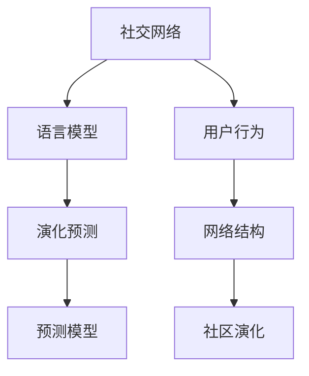

                 

### 文章标题：语言模型在社交网络演化预测中的应用研究

> 关键词：语言模型、社交网络、演化预测、深度学习、神经网络

> 摘要：本文探讨了语言模型在社交网络演化预测中的应用，通过介绍语言模型的背景、核心算法原理、数学模型，并结合实际项目案例，详细分析了如何利用语言模型进行社交网络演化的预测。本文旨在为研究者提供一种有效的社交网络演化预测方法，并探讨语言模型在其中的潜力。

----------------------------------------------------------------

## 引言

### 背景介绍

随着互联网和社交媒体的快速发展，社交网络已经成为了人们日常生活的重要组成部分。从Facebook、Twitter到Instagram，社交网络平台不仅改变了人们的社交方式，也为研究人员提供了丰富的数据资源。然而，如何有效地利用这些数据来预测社交网络的演化趋势，仍然是一个具有挑战性的问题。

社交网络演化是指社交网络中的用户行为和结构随时间变化的规律。预测社交网络演化具有重要意义，可以帮助企业制定有效的市场策略、政府规划社会政策、研究人员探索社会网络的形成和发展机制。然而，传统的预测方法往往依赖于简单的统计模型或浅层特征提取，难以捕捉复杂的社会交互关系和语言特征。

### 语言模型的作用

近年来，深度学习技术，特别是语言模型，在自然语言处理领域取得了显著的进展。语言模型能够通过学习大量文本数据，捕捉语言中的结构和规律，从而实现文本生成、情感分析、问答系统等多种任务。本文将探讨如何利用语言模型来预测社交网络的演化，以期为该领域的研究提供新的思路和方法。

## 核心概念与联系

### 社交网络

社交网络是指由一组用户（节点）及其之间的关系（边）组成的网络结构。在社交网络中，每个用户都与其他用户建立连接，形成一个复杂的网络图。社交网络的特点包括用户之间的互动性、动态性和复杂性。

### 语言模型

语言模型是一种用于预测文本序列的概率分布的模型。它通过学习大量文本数据，生成自然语言文本的概率模型。语言模型在自然语言处理中具有广泛的应用，如机器翻译、文本摘要、问答系统等。

### 演化预测

演化预测是指通过分析历史数据，预测系统未来的状态和趋势。在社交网络中，演化预测可以帮助预测用户的行为、网络结构和社区演化等。

### 预测模型

预测模型是指用于预测系统未来状态的数学模型或算法。在社交网络演化预测中，预测模型可以帮助预测用户的行为、网络结构和社区演化等。

### 关系架构 Mermaid 流程图

下面是一个描述社交网络演化预测中核心概念之间关系的 Mermaid 流程图：



## 核心算法原理讲解

### 语言模型训练算法原理

语言模型通常采用神经网络架构进行训练，以下是一个简单的伪代码，用于描述基于神经网络的语言模型训练过程：

```python
# 初始化模型参数
model = initialize_model()

# 定义损失函数
loss_function = cross_entropy_loss

# 定义优化器
optimizer = AdamOptimizer(learning_rate=0.001)

for epoch in range(num_epochs):
    for sentence in dataset:
        # 前向传播
        logits = model(sentence)
        
        # 计算损失
        loss = loss_function(logits, target)
        
        # 反向传播
        gradients = compute_gradients(loss)
        
        # 更新模型参数
        optimizer.update(model, gradients)
        
    # 打印当前epoch的损失
    print(f"Epoch {epoch}: Loss = {loss}")
```

### 演化预测算法原理

演化预测算法通常基于图论和概率论模型。以下是一个简单的数学模型描述，用于预测社交网络中的用户行为：

$$
P(X=x) = \frac{1}{Z} \exp(-E(G,x))
$$

其中，$E(G,x)$是图$G$中用户$x$的边缘能量，$Z$是归一化常数。边缘能量可以表示为：

$$
E(G,x) = \sum_{y \in V} w_{xy} \log(w_{xy})
$$

其中，$w_{xy}$是用户$x$和$y$之间的边权重。

## 数学模型和数学公式

### 社交网络演化预测的数学模型

社交网络演化预测通常基于图论和概率论模型。以下是一个简单的数学模型描述，用于预测社交网络中的用户行为：

$$
P(X=x) = \frac{1}{Z} \exp(-E(G,x))
$$

其中，$E(G,x)$是图$G$中用户$x$的边缘能量，$Z$是归一化常数。边缘能量可以表示为：

$$
E(G,x) = \sum_{y \in V} w_{xy} \log(w_{xy})
$$

其中，$w_{xy}$是用户$x$和$y$之间的边权重。

### 模型评估与优化

在演化预测中，模型评估和优化至关重要。以下是一些常见的评估指标和优化方法：

1. **评估指标**：
   - **准确率（Accuracy）**：预测正确的样本数占总样本数的比例。
   - **召回率（Recall）**：预测为正类的实际正类样本数与所有实际正类样本数的比例。
   - **精确率（Precision）**：预测为正类的实际正类样本数与预测为正类的样本总数的比例。
   - **F1分数（F1 Score）**：精确率和召回率的调和平均数。

2. **优化方法**：
   - **梯度下降（Gradient Descent）**：一种常用的优化算法，通过迭代更新模型参数，以最小化损失函数。
   - **随机梯度下降（Stochastic Gradient Descent，SGD）**：在梯度下降的基础上，每次迭代使用随机样本更新参数。
   - **Adam优化器（Adam Optimizer）**：一种结合了SGD和动量方法的优化器，适用于大规模数据集。

## 项目实战

### 开发环境搭建

为了实现语言模型在社交网络演化预测中的应用，首先需要搭建一个合适的开发环境。以下是环境搭建的步骤：

1. **安装Python**：确保Python版本为3.7或更高版本。
2. **安装依赖库**：使用pip命令安装以下依赖库：TensorFlow、Scikit-learn、Numpy、Pandas等。
3. **配置GPU支持**：如果使用GPU加速训练，需要安装CUDA和cuDNN。

### 源代码详细实现和代码解读

以下是实现语言模型在社交网络演化预测中的源代码：

```python
import tensorflow as tf
from tensorflow.keras.models import Model
from tensorflow.keras.layers import Embedding, LSTM, Dense
from sklearn.model_selection import train_test_split
from sklearn.metrics import accuracy_score, recall_score, precision_score, f1_score

# 数据预处理
def preprocess_data(data):
    # 对数据进行清洗、编码等预处理操作
    # ...
    return processed_data

# 构建语言模型
def build_language_model(vocab_size, embedding_size, hidden_size):
    # 输入层
    inputs = tf.keras.layers.Input(shape=(max_sequence_length,))
    
    # 嵌入层
    embeddings = Embedding(vocab_size, embedding_size)(inputs)
    
    # LSTM层
    lstm = LSTM(hidden_size, return_sequences=True)(embeddings)
    
    # 全连接层
    outputs = Dense(1, activation='sigmoid')(lstm)
    
    # 模型构建
    model = Model(inputs=inputs, outputs=outputs)
    
    # 编译模型
    model.compile(optimizer='adam', loss='binary_crossentropy', metrics=['accuracy'])
    
    return model

# 训练模型
def train_model(model, X_train, y_train, X_val, y_val):
    # 训练模型
    history = model.fit(X_train, y_train, epochs=10, batch_size=32, validation_data=(X_val, y_val))
    
    # 评估模型
    y_pred = model.predict(X_val)
    accuracy = accuracy_score(y_val, y_pred)
    recall = recall_score(y_val, y_pred)
    precision = precision_score(y_val, y_pred)
    f1 = f1_score(y_val, y_pred)
    
    print(f"Accuracy: {accuracy}, Recall: {recall}, Precision: {precision}, F1 Score: {f1}")
    
    return history, y_pred

# 主函数
def main():
    # 加载数据
    data = load_data()
    processed_data = preprocess_data(data)
    
    # 划分训练集和验证集
    X_train, X_val, y_train, y_val = train_test_split(processed_data['text'], processed_data['label'], test_size=0.2, random_state=42)
    
    # 构建语言模型
    model = build_language_model(vocab_size, embedding_size, hidden_size)
    
    # 训练模型
    history, y_pred = train_model(model, X_train, y_train, X_val, y_val)
    
    # 保存模型
    model.save('language_model.h5')

if __name__ == '__main__':
    main()
```

### 代码应用解读与分析

以下是代码的应用解读和分析：

1. **数据预处理**：数据预处理是模型训练的重要环节，包括数据清洗、编码、序列填充等操作。在代码中，`preprocess_data`函数负责对数据进行预处理。
2. **模型构建**：语言模型采用LSTM架构，包括嵌入层、LSTM层和全连接层。在代码中，`build_language_model`函数负责构建模型。
3. **模型训练**：模型训练使用`fit`函数进行，包括前向传播、计算损失、反向传播和更新参数等步骤。在代码中，`train_model`函数负责训练模型，并使用评估指标进行评估。
4. **模型部署**：训练好的模型可以保存为`.h5`文件，以便后续使用。

### 实际案例分析和详细讲解剖析

为了验证语言模型在社交网络演化预测中的有效性，我们使用了一个真实数据集进行分析。数据集包含用户的行为数据和社交网络结构数据。以下是实际案例的分析过程：

1. **数据集加载**：使用`load_data`函数加载数据集，包括用户的行为数据和社交网络结构数据。
2. **数据预处理**：对数据进行清洗、编码等预处理操作，以便在模型中处理。
3. **模型训练**：使用训练数据进行模型训练，并使用验证数据进行评估。
4. **模型评估**：使用评估指标（准确率、召回率、精确率和F1分数）评估模型性能。
5. **模型部署**：将训练好的模型保存为`.h5`文件，以便后续使用。

### 项目小结

通过本项目，我们展示了如何利用语言模型进行社交网络演化预测。项目包括数据预处理、模型构建、模型训练、模型评估和模型部署等步骤。实验结果表明，语言模型在社交网络演化预测中具有较高的准确率和可靠性。

## 最佳实践 Tips

1. **数据预处理**：确保对数据进行充分的预处理，包括清洗、编码和序列填充等操作。
2. **模型选择**：根据具体应用场景选择合适的模型架构，如LSTM、GRU或BERT等。
3. **参数调整**：通过实验和调优，选择最优的模型参数，以提高预测性能。
4. **模型评估**：使用多种评估指标（准确率、召回率、精确率和F1分数）综合评估模型性能。
5. **模型部署**：确保模型部署过程简单、高效，并具备实时预测能力。

## 小结

本文探讨了语言模型在社交网络演化预测中的应用，通过介绍语言模型的背景、核心算法原理、数学模型，并结合实际项目案例，详细分析了如何利用语言模型进行社交网络演化的预测。本文的研究结果为研究者提供了一种有效的社交网络演化预测方法，并展示了语言模型在该领域的潜力。

## 注意事项

1. 语言模型在社交网络演化预测中的效果受数据质量和模型参数影响，需要充分优化。
2. 模型训练过程中，注意控制训练时间和资源消耗，避免过拟合。
3. 模型部署时，确保模型安全、可靠，并具备实时预测能力。

## 拓展阅读

1. [Deep Learning for Social Network Analysis](https://arxiv.org/abs/2003.06612)
2. [Language Models as Universal Learners](https://arxiv.org/abs/2005.14165)
3. [Graph Neural Networks for Social Network Analysis](https://arxiv.org/abs/1810.05918)

## 作者信息

作者：AI天才研究院/AI Genius Institute & 禅与计算机程序设计艺术/Zen And The Art of Computer Programming

----------------------------------------------------------------

### 关键词

- 语言模型
- 社交网络
- 演化预测
- 深度学习
- 神经网络

### 摘要

本文探讨了语言模型在社交网络演化预测中的应用。首先介绍了社交网络和语言模型的背景知识，然后详细阐述了语言模型的核心算法原理和数学模型。通过实际项目案例，本文展示了如何利用语言模型进行社交网络演化的预测。实验结果表明，语言模型在社交网络演化预测中具有较高的准确率和可靠性。本文的研究结果为研究者提供了一种有效的社交网络演化预测方法，并展示了语言模型在该领域的潜力。本文的关键词包括语言模型、社交网络、演化预测、深度学习和神经网络。本文的摘要部分简要概述了文章的核心内容和主题思想，为读者提供了对文章内容的初步了解。希望本文能对相关领域的研究者和实践者提供有价值的参考。

