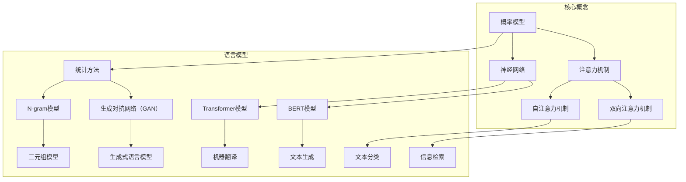
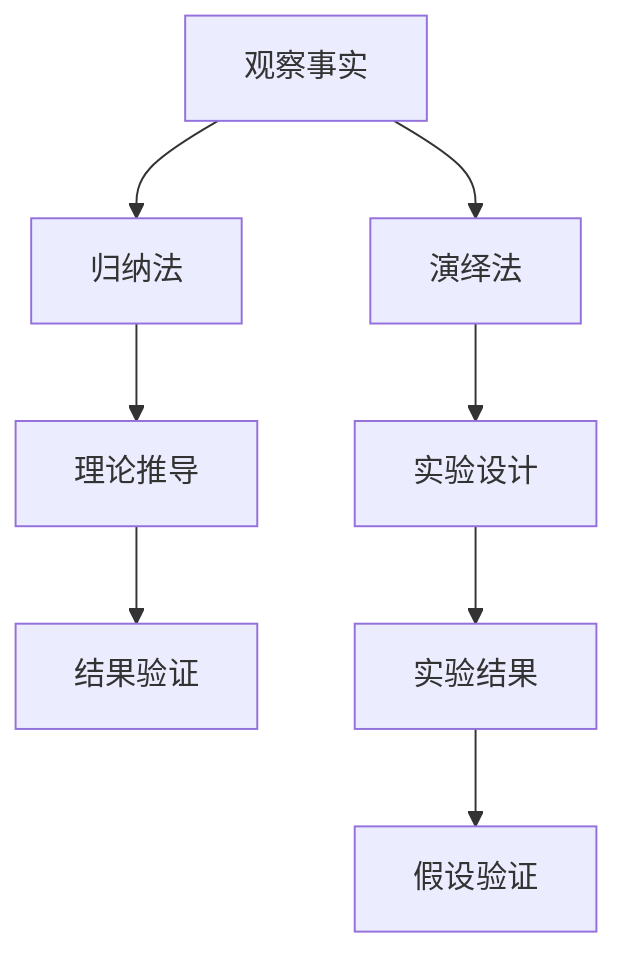

                 

### 引言

**文章标题**：语言模型在科学假设生成中的能力培养

**关键词**：语言模型、科学假设、生成能力、训练算法、优化策略、项目实战

在当前的人工智能领域，语言模型已经成为自然语言处理（NLP）的核心技术。从早期基于统计的模型，如N-gram，到现代的深度学习模型，如Transformer和BERT，语言模型在文本生成、机器翻译、问答系统等方面取得了显著的进展。然而，语言模型在科学假设生成中的应用还相对较少，但潜力巨大。科学假设是科学研究中至关重要的一环，它引导着科学实验和理论的发展。语言模型通过其强大的文本生成能力，能够为科学假设的生成提供新的思路和方法。

本文将深入探讨语言模型在科学假设生成中的应用，旨在培养语言模型在这一领域的生成能力。文章结构如下：

1. **语言模型概述**：介绍语言模型的基本概念、类型和应用领域。
2. **科学假设生成的基本原理**：探讨科学假设的定义、类型和生成方法。
3. **语言模型在科学假设生成中的应用**：分析语言模型在科学假设生成中的优势和应用场景。
4. **语言模型训练与优化**：讲解语言模型的训练过程、优化技巧和模型评估方法。
5. **科学假设生成案例分析**：通过实际案例展示语言模型在科学假设生成中的应用。
6. **项目实战**：介绍一个具体的科学假设生成项目，包括开发环境搭建、源代码实现和解读。
7. **总结与展望**：总结语言模型在科学假设生成中的能力培养，并展望未来发展方向。

通过本文的详细探讨，我们希望读者能够对语言模型在科学假设生成中的应用有一个全面深入的理解，并能够掌握相关的方法和技巧。接下来，我们将首先介绍语言模型的基本概念，为后续内容打下基础。

---

**摘要**：

本文旨在探讨语言模型在科学假设生成中的能力培养。首先，我们介绍了语言模型的基本概念、类型和应用领域，为理解语言模型在科学假设生成中的作用奠定了基础。接着，我们详细分析了科学假设生成的基本原理，包括定义、类型和生成方法。随后，文章重点探讨了语言模型在科学假设生成中的应用，阐述了其优势和应用场景。在此基础上，我们讲解了语言模型的训练过程、优化技巧和评估方法。随后，通过一个具体案例，我们展示了语言模型在科学假设生成中的实际应用。最后，我们介绍了一个科学假设生成的项目，包括开发环境搭建、源代码实现和解读。本文总结了对语言模型在科学假设生成中能力培养的见解，并对未来发展方向进行了展望。通过本文的探讨，我们希望读者能够对语言模型在科学假设生成中的应用有更深入的理解，并为实际应用提供参考。

### 第一部分：语言模型基础

#### 第1章：语言模型概述

语言模型是自然语言处理（NLP）领域中的核心技术，它通过学习大量文本数据，预测某个单词或短语的下一个词或短语。在文本生成、机器翻译、问答系统等领域，语言模型发挥了关键作用。本章节将介绍语言模型的基本概念、类型和应用领域。

##### 1.1 语言模型的基本概念

语言模型是一种概率模型，它通过统计方法或深度学习算法，预测文本序列中下一个词或短语的概率。一个简单的语言模型可以基于N-gram模型，它利用过去n个单词的历史信息来预测下一个单词。更复杂的语言模型，如Transformer和BERT，通过深度神经网络学习文本的分布式表示。

**定义**：语言模型是一个概率模型，它给定一个输入的单词序列，预测下一个单词的概率分布。

**基本原理**：语言模型通过学习大量的文本数据，建立单词之间的概率关系，从而实现文本生成和预测。

##### 1.2 语言模型的类型

语言模型可以分为以下几种类型：

1. **统计语言模型**：基于统计方法，如N-gram模型，利用过去单词的历史信息进行预测。
2. **生成式语言模型**：基于概率图模型，如隐马尔可夫模型（HMM）和条件随机场（CRF），通过生成过程进行预测。
3. **对抗性语言模型**：结合生成对抗网络（GAN）的原理，通过对抗训练生成高质量的语言数据。

**N-gram模型**：N-gram模型是一种最常见的统计语言模型，它通过统计相邻单词的频率来预测下一个单词。例如，三元组模型（3-gram）会考虑前三个单词的历史信息。

**Transformer模型**：Transformer模型是一种基于自注意力机制的深度神经网络模型，它在机器翻译和文本生成等领域取得了显著的成果。

**BERT模型**：BERT（Bidirectional Encoder Representations from Transformers）模型是一种双向的Transformer模型，它在预训练过程中同时考虑了文本的前后关系，从而提高了语言理解能力。

##### 1.3 语言模型的应用领域

语言模型在多个应用领域中发挥了重要作用：

1. **文本生成**：包括文章生成、对话生成和摘要生成等。
2. **机器翻译**：如谷歌翻译和百度翻译，将一种语言的文本翻译成另一种语言。
3. **问答系统**：如Siri和Alexa，能够理解和回答用户的问题。
4. **文本分类**：对文本进行分类，如垃圾邮件检测和情感分析。
5. **信息检索**：通过语言模型对文本数据进行索引和检索。

**文本生成案例**：使用语言模型生成新闻文章、小说或其他文本内容，如OpenAI的GPT系列模型。

**机器翻译案例**：谷歌翻译使用Transformer模型进行高质量的机器翻译。

**问答系统案例**：Siri和Alexa等语音助手通过语言模型理解和回答用户的问题。

通过本章节的介绍，读者可以了解语言模型的基本概念、类型和应用领域。接下来，我们将进一步探讨语言模型的数学基础，为理解其工作原理打下基础。

---

**核心概念与联系**：

语言模型的核心概念包括概率模型、统计方法、神经网络和注意力机制。以下是这些概念之间的联系架构Mermaid流程图：



该流程图清晰地展示了语言模型的核心概念及其之间的联系，为理解语言模型的工作原理提供了直观的视角。

### 第2章：语言模型的数学基础

为了深入理解语言模型的工作原理，我们需要探讨其背后的数学基础。在本章节中，我们将介绍概率论和信息论的基本概念，以及语言模型中常见的矩阵和向量运算。这些数学工具为语言模型的设计和实现提供了必要的理论基础。

##### 2.1 概率论基础

概率论是语言模型的核心数学工具，它帮助我们理解和预测文本序列中的概率关系。以下是概率论中几个重要的概念：

1. **概率分布**：概率分布描述了一个随机变量的概率分布情况。在语言模型中，我们通常使用概率分布来表示一个单词或短语的下一个词或短语的概率。
   
   **定义**：概率分布是一个函数P(X)，它将随机变量X的所有可能取值映射到[0,1]区间内的概率。

2. **条件概率**：条件概率是指在某个事件已经发生的条件下，另一个事件发生的概率。

   **定义**：给定事件A和B，条件概率P(B|A)表示在事件A已经发生的条件下，事件B发生的概率。

3. **贝叶斯定理**：贝叶斯定理是一个用于计算条件概率的重要公式，它将条件概率与边缘概率联系起来。

   **公式**：P(A|B) = P(B|A)P(A) / P(B)

在语言模型中，条件概率被广泛应用于预测下一个单词的概率。例如，在N-gram模型中，我们使用前n-1个单词的条件概率来预测第n个单词。

##### 2.2 信息论基础

信息论是研究信息传输和处理的一门学科，它在语言模型中也有广泛的应用。以下是信息论中几个重要的概念：

1. **熵**：熵是衡量随机变量不确定性的量度。在语言模型中，我们使用熵来衡量一个文本序列的信息含量。

   **定义**：对于离散随机变量X，其熵H(X)定义为：
   $$H(X) = -\sum_{x} p(x) \log_2 p(x)$$
   其中，p(x)是随机变量X取值x的概率。

2. **条件熵**：条件熵是衡量在已知一个随机变量取值的情况下，另一个随机变量的不确定性。

   **定义**：对于离散随机变量X和Y，条件熵H(Y|X)定义为：
   $$H(Y|X) = -\sum_{x} p(x) \sum_{y} p(y|x) \log_2 p(y|x)$$

3. **互信息**：互信息是衡量两个随机变量之间相互依赖性的量度。在语言模型中，互信息用于衡量一个单词对另一个单词的预测能力。

   **定义**：对于离散随机变量X和Y，互信息I(X;Y)定义为：
   $$I(X;Y) = H(X) - H(X|Y)$$

在语言模型中，互信息被用于评估模型对文本数据的拟合程度。通过最大化互信息，我们可以优化模型参数，提高模型的预测性能。

##### 2.3 语言模型中的矩阵与向量运算

在语言模型中，矩阵和向量运算是常见的操作。以下是一些基本的矩阵与向量运算：

1. **矩阵-向量乘法**：矩阵-向量乘法是将矩阵与向量相乘，得到一个新的向量。

   **公式**：如果A是一个m×n的矩阵，x是一个n维的向量，则A*x是一个m维的向量，其计算方式为：
   $$A*x = \begin{bmatrix} a_{11} & a_{12} & \ldots & a_{1n} \\ a_{21} & a_{22} & \ldots & a_{2n} \\ \vdots & \vdots & \ddots & \vdots \\ a_{m1} & a_{m2} & \ldots & a_{mn} \end{bmatrix} \begin{bmatrix} x_1 \\ x_2 \\ \vdots \\ x_n \end{bmatrix} = \begin{bmatrix} \sum_{j=1}^{n} a_{1j}x_j \\ \sum_{j=1}^{n} a_{2j}x_j \\ \vdots \\ \sum_{j=1}^{n} a_{mj}x_j \end{bmatrix}$$

2. **向量-矩阵乘法**：向量-矩阵乘法是将向量与矩阵相乘，得到一个新的向量。

   **公式**：如果x是一个n维的向量，B是一个n×m的矩阵，则x*B是一个m维的向量，其计算方式为：
   $$x*B = x \begin{bmatrix} b_{11} & b_{12} & \ldots & b_{1m} \\ b_{21} & b_{22} & \ldots & b_{2m} \\ \vdots & \vdots & \ddots & \vdots \\ b_{n1} & b_{n2} & \ldots & b_{nm} \end{bmatrix} = \begin{bmatrix} x_1b_{11} + x_2b_{21} + \ldots + x_nb_{n1} \\ x_1b_{12} + x_2b_{22} + \ldots + x_nb_{n2} \\ \vdots \\ x_1b_{1m} + x_2b_{2m} + \ldots + x_nb_{nm} \end{bmatrix}$$

3. **矩阵-矩阵乘法**：矩阵-矩阵乘法是将两个矩阵相乘，得到一个新的矩阵。

   **公式**：如果A是一个m×n的矩阵，B是一个n×p的矩阵，则A*B是一个m×p的矩阵，其计算方式为：
   $$A*B = \begin{bmatrix} a_{11} & a_{12} & \ldots & a_{1n} \\ a_{21} & a_{22} & \ldots & a_{2n} \\ \vdots & \vdots & \ddots & \vdots \\ a_{m1} & a_{m2} & \ldots & a_{mn} \end{bmatrix} \begin{bmatrix} b_{11} & b_{12} & \ldots & b_{1p} \\ b_{21} & b_{22} & \ldots & b_{2p} \\ \vdots & \vdots & \ddots & \vdots \\ b_{m1} & b_{m2} & \ldots & b_{mp} \end{bmatrix} = \begin{bmatrix} \sum_{k=1}^{n} a_{1k}b_{k1} & \sum_{k=1}^{n} a_{1k}b_{k2} & \ldots & \sum_{k=1}^{n} a_{1k}b_{kp} \\ \sum_{k=1}^{n} a_{2k}b_{k1} & \sum_{k=1}^{n} a_{2k}b_{k2} & \ldots & \sum_{k=1}^{n} a_{2k}b_{kp} \\ \vdots & \vdots & \ddots & \vdots \\ \sum_{k=1}^{n} a_{mk}b_{k1} & \sum_{k=1}^{n} a_{mk}b_{k2} & \ldots & \sum_{k=1}^{n} a_{mk}b_{kp} \end{bmatrix}$$

在语言模型中，矩阵和向量运经常用于模型参数的更新和计算。例如，在训练过程中，我们使用梯度下降算法来更新模型参数，这个过程中涉及大量的矩阵和向量运算。

通过本章节的介绍，我们了解了语言模型背后的数学基础，包括概率论、信息论和矩阵与向量运算。这些数学工具为语言模型的设计和实现提供了必要的理论基础。在接下来的章节中，我们将进一步探讨语言模型的训练算法和优化技巧。

---

**核心算法原理讲解**：

在本章节中，我们将通过伪代码详细阐述语言模型训练过程中的关键算法原理，包括矩阵和向量的运算。

**伪代码：N-gram模型训练**

```
初始化模型参数：n-gram矩阵A，其中A[i][j]表示单词i后跟单词j的概率。

for 每个训练样本text in dataset:
    将text分成单词序列words = split(text)
    for i = 1 to len(words) - n:
        当前窗口的单词组合context = words[i:i+n]
        当前窗口的单词target = words[i+n]
        更新N-gram矩阵A：
            A[context][target] += 1
            A[context][target] /= count(context)  // 分母为该前缀的词频

// 预测下一个单词
function predict(context, A):
    context概率分布P = get_row(A, context)
    随机选择下一个单词word = sample_from_distribution(P)
    返回word

// 训练模型
function train_dataset(dataset, n, A):
    for 每个样本text in dataset:
        更新N-gram矩阵A
    返回A
```

**核心数学模型和公式讲解与举例说明**：

在N-gram模型中，核心的数学模型是概率分布的计算。以下是一个具体的数学模型和公式的讲解与举例。

**N-gram模型概率分布计算公式**：

对于一个N-gram模型，给定一个前n-1个单词的序列context，预测下一个单词target的概率分布P，计算公式如下：

$$P = \frac{A[context][target]}{count(context)}$$

其中，$A[context][target]$表示前缀context后跟单词target的频次，$count(context)$表示前缀context的总频次。

**举例说明**：

假设我们有一个三元组模型（3-gram），并且有一个训练数据集，其中包含以下数据：

```
(Hello, World, !)
(Hello, World, ?)
(Hello, World, .)
(World, Hello, !)
(World, Hello, ?)
(World, Hello, .)
```

根据这些数据，我们可以构建一个3-gram矩阵：

$$
A = \begin{bmatrix}
    [Hello, World, !] & [Hello, World, ?] & [Hello, World, .] \\
    [World, Hello, !] & [World, Hello, ?] & [World, Hello, .] \\
    [. , World, !] & [. , World, ?] & [. , World, .] \\
    [! , Hello, World] & [? , Hello, World] & [ . , Hello, World] \\
\end{bmatrix}
$$

计算概率分布的示例：

**前缀**：“Hello, World”

**目标词**：“!”

**概率分布**：

$$P = \frac{A[Hello, World][!]}{count(Hello, World)} = \frac{1}{3}$$

由于只有一个单词“!”跟随“Hello, World”，且其频次为1，所以其概率分布为$\frac{1}{3}$。

**解释**：

该概率分布表示，在“Hello, World”之后，“!”的概率为$\frac{1}{3}$。通过这种方式，N-gram模型可以根据历史数据预测下一个单词。

通过上述伪代码和数学公式的讲解，我们详细阐述了N-gram模型的训练和预测过程。接下来，我们将介绍更高级的语言模型，如Transformer模型，并进一步探讨其在科学假设生成中的应用。

### 第3章：语言模型的训练算法

语言模型的训练是一个复杂的过程，它涉及数据准备、模型选择、参数优化等多个方面。在本章节中，我们将详细探讨语言模型的训练过程，并介绍常见的训练算法和优化技巧。

##### 3.1 语言模型训练过程

语言模型的训练过程主要包括以下步骤：

1. **数据准备**：首先，我们需要准备大量的文本数据作为训练集。这些数据可以是已标记的数据，如新闻文章、对话记录等，也可以是未标记的数据，如网页内容、社交媒体帖子等。

2. **文本预处理**：在训练前，我们需要对文本数据进行预处理，包括分词、去停用词、词干提取等。这些步骤有助于提高模型的训练效率和预测性能。

3. **模型初始化**：初始化模型参数，这些参数通常通过随机初始化或预训练模型来获得。

4. **训练**：使用训练数据对模型进行迭代训练，通过调整模型参数来最小化损失函数。

5. **评估与调优**：在训练过程中，我们需要定期评估模型性能，并根据评估结果调整模型参数。

6. **模型保存与加载**：训练完成后，我们需要保存模型参数，以便后续使用或进一步优化。

##### 3.2 常见的训练算法

在语言模型训练过程中，常用的算法包括以下几种：

1. **最大似然估计（MLE）**：最大似然估计是一种基于概率模型的训练方法。它的目标是最小化模型对训练数据的似然损失函数。对于N-gram模型，最大似然估计的目标是最小化以下损失函数：

   $$L(\theta) = -\sum_{x \in X} \log P(x|\theta)$$

   其中，$X$是训练数据集，$\theta$是模型参数。

2. **梯度下降（GD）**：梯度下降是一种常用的优化算法，它通过迭代更新模型参数，以最小化损失函数。对于语言模型，梯度下降的目标是最小化损失函数：

   $$L(\theta) = -\sum_{x \in X} \log P(x|\theta)$$

   梯度下降的更新公式为：

   $$\theta = \theta - \alpha \nabla_\theta L(\theta)$$

   其中，$\alpha$是学习率，$\nabla_\theta L(\theta)$是损失函数关于模型参数$\theta$的梯度。

3. **随机梯度下降（SGD）**：随机梯度下降是梯度下降的一种变体，它使用随机选择的样本来计算梯度。这种方法可以加快收敛速度，并减少局部最优的情况。

4. **Adam优化器**：Adam优化器是一种自适应的梯度下降方法，它结合了AdaGrad和RMSProp的优点。Adam优化器通过自适应调整每个参数的学习率，以加快收敛速度并提高模型的稳定性。

##### 3.3 语言模型优化技巧

在语言模型训练过程中，优化技巧对于提高模型性能至关重要。以下是一些常见的优化技巧：

1. **学习率调度**：学习率调度是一种动态调整学习率的方法。常用的学习率调度策略包括恒定学习率、余弦退火、指数退火等。通过调整学习率，我们可以避免模型在训练过程中出现过拟合或收敛速度过慢的问题。

2. **Dropout**：Dropout是一种正则化方法，它通过在训练过程中随机丢弃部分神经元，减少模型的过拟合现象。Dropout通常在训练阶段使用，而在预测阶段恢复所有的神经元。

3. **权重正则化**：权重正则化是一种通过在损失函数中加入L1或L2正则项来减少模型复杂度的方法。L1正则化鼓励稀疏解，而L2正则化鼓励小解。

4. **预训练与微调**：预训练是一种在大量未标记数据上先进行训练，然后在特定任务上进行微调的方法。预训练可以帮助模型捕捉到语言的通用特征，从而提高任务性能。

5. **数据增强**：数据增强是一种通过变换原始数据来扩充训练集的方法。常见的数据增强方法包括随机插入、随机删除、随机替换等。

通过以上优化技巧，我们可以提高语言模型的训练效率和预测性能，使其更好地适应各种应用场景。

##### 3.4 实际案例

为了更好地理解语言模型训练过程，我们来看一个实际的案例。

**案例**：使用Transformer模型训练一个机器翻译模型。

**步骤**：

1. **数据准备**：收集大量双语语料库，如英语-中文翻译数据集。
2. **文本预处理**：对数据集进行分词、去停用词等预处理。
3. **模型初始化**：初始化Transformer模型参数，使用预训练的模型如BERT作为初始化。
4. **训练**：使用梯度下降算法和Adam优化器对模型进行迭代训练，优化模型参数。
5. **评估与调优**：在验证集上评估模型性能，根据评估结果调整模型参数。
6. **模型保存与加载**：保存最佳模型，并在测试集上评估模型性能。

**代码示例**：

```python
# 导入必要的库
import tensorflow as tf
import tensorflow_addons as tfa
from transformers import BertModel, BertConfig

# 定义模型配置
config = BertConfig(vocab_size=20000, hidden_size=768, num_blocks=12, num_heads=12)

# 初始化模型
model = BertModel(config)

# 定义优化器
optimizer = tfa.optimizers.Adam(learning_rate=5e-5)

# 定义损失函数
loss_function = tf.keras.losses.SparseCategoricalCrossentropy(from_logits=True)

# 训练模型
for epoch in range(num_epochs):
    for batch in dataset:
        inputs = batch['inputs']
        targets = batch['targets']
        
        with tf.GradientTape() as tape:
            outputs = model(inputs)
            loss = loss_function(targets, outputs)
        
        gradients = tape.gradient(loss, model.trainable_variables)
        optimizer.apply_gradients(zip(gradients, model.trainable_variables))
        
    print(f"Epoch {epoch}: Loss = {loss.numpy()}")

# 评估模型
test_loss = loss_function(test_targets, model(test_inputs))
print(f"Test Loss: {test_loss.numpy()}")
```

通过这个案例，我们可以看到语言模型训练的基本流程和代码实现。在实际应用中，根据具体任务的需求，我们可以调整模型配置、优化策略和数据预处理方法，以提高模型性能。

通过本章节的介绍，我们了解了语言模型训练的基本过程和常见算法，以及优化技巧。在下一章节中，我们将探讨语言模型在科学假设生成中的应用，并分析其优势和应用场景。

### 科学假设生成的基本原理

科学假设是科学研究中的核心环节，它为实验设计、理论构建和结果解释提供了方向和基础。科学假设的生成不仅仅是凭直觉或经验，而是一个系统的、有逻辑的过程。在本章节中，我们将详细探讨科学假设的定义、类型和生成方法，并分析语言模型在这一过程中的作用。

##### 3.1 科学假设的定义

科学假设是科学研究中对某个现象或问题的推测性解释，它基于现有知识、观察和理论，旨在通过实验或观察来验证或推翻。科学假设通常包含两个部分：一个是假设条件，即科学陈述的命题部分；另一个是假设结论，即根据假设条件所能预测的结果。

**定义**：科学假设是一种基于现有知识和观察的推测性陈述，它为科学实验和理论提供了基础。

**特征**：
- **可测试性**：科学假设必须是可测试的，即可以通过实验或观察来验证或推翻。
- **明确性**：科学假设应该明确且具体，避免模糊不清或抽象的陈述。
- **一致性**：科学假设应与现有的科学理论和知识保持一致。

##### 3.2 科学假设的类型

科学假设可以根据其形式和内容分为以下几种类型：

1. **观察假设**：基于直接观察得到的假设。例如，观察到物体下落的加速度与质量无关，从而提出万有引力定律。

2. **理论假设**：基于现有理论或模型推导出的假设。例如，基于相对论提出的黑洞假设。

3. **实验假设**：用于指导实验设计的假设。例如，在验证化学反应速率的实验中，提出不同温度对反应速率的影响假设。

4. **预测假设**：基于现有数据和模型预测的未来事件或现象的假设。例如，根据气候变化模型预测未来海平面上升。

**分类表**：

| 类型 | 描述 |
| --- | --- |
| 观察假设 | 基于直接观察 |
| 理论假设 | 基于现有理论 |
| 实验假设 | 指导实验设计 |
| 预测假设 | 基于现有数据预测 |

##### 3.3 科学假设生成的方法

科学假设的生成方法包括以下几种：

1. **归纳法**：从具体的事实或观察中归纳出一般性的结论。例如，通过观察大量物体下落的加速度，归纳出重力定律。

2. **演绎法**：从普遍原理或假设出发，推导出具体的结论。例如，从牛顿第二定律推导出不同条件下的物体运动方程。

3. **类比法**：通过将已知的现象类比到新的情境中，生成假设。例如，将地球上的生物进化类比到其他行星，推测其他行星可能存在生命。

4. **假设-演绎法**：先提出假设，然后通过实验或观察验证或推翻该假设。这是科学研究中最常用的方法。

**方法流程图**：



**语言模型在科学假设生成中的应用**

语言模型通过其强大的文本生成能力，在科学假设生成中发挥着重要作用。以下是语言模型在科学假设生成中的应用：

1. **文本生成**：语言模型可以生成大量相关的文本，为科学假设的提出提供丰富的背景信息和数据支持。

2. **假设推导**：语言模型可以从现有的科学文献和理论中推导出新的假设，为科学研究的方向提供启示。

3. **实验设计**：语言模型可以帮助设计实验方案，预测实验结果，从而为假设的验证提供依据。

4. **假设验证**：语言模型可以辅助分析实验数据，通过生成假设和结果，验证或推翻科学假设。

**应用实例**：

- **医学研究**：利用语言模型生成相关的医学文献摘要，提出新的疾病治疗假设，并通过实验验证其有效性。
- **环境科学**：通过分析气候变化的文本数据，语言模型可以生成预测未来气候变化影响的假设，并设计相应的实验进行验证。

**语言模型的优势**：

- **文本生成能力强**：语言模型可以生成大量高质量文本，为科学假设的生成提供丰富的信息来源。
- **跨领域知识融合**：语言模型可以整合不同领域的知识，提出跨学科的假设。
- **自动化假设生成**：语言模型可以自动化地生成假设，提高科学研究的效率。

**挑战与局限**：

- **数据质量和完整性**：语言模型生成假设的质量高度依赖于训练数据的质量和完整性。
- **假设验证难度**：生成的假设需要通过实验或观察验证，但这通常需要大量的资源和时间。
- **解释性不足**：语言模型生成的假设缺乏清晰的逻辑解释，难以确保其科学性。

通过本章节的介绍，我们了解了科学假设的基本原理、类型和生成方法，以及语言模型在科学假设生成中的应用。在下一章节中，我们将探讨语言模型在科学假设生成中的具体应用和优势。

### 语言模型在科学假设生成中的应用

语言模型在科学假设生成中的应用具有显著的优势，它不仅能够高效地生成大量假设，还能通过跨学科知识的融合，提出具有创新性的科学假说。以下将从几个方面详细探讨语言模型在科学假设生成中的优势和应用场景。

##### 4.1 语言模型在科学假设生成中的优势

1. **文本生成能力强大**：语言模型能够生成大量的文本，这些文本包含了丰富的科学知识和假设。例如，GPT-3等大型语言模型可以生成详细的科学论文、实验报告和研究摘要，从而为科学假设的生成提供丰富的背景信息。

2. **跨学科知识融合**：语言模型在训练过程中学习了大量的跨学科知识，这使得它能够在生成假设时融合不同领域的知识。例如，在生物学和物理学之间，语言模型可以提出涉及两者结合的假设，推动跨学科研究的发展。

3. **自动化假设生成**：语言模型可以自动化地生成大量的科学假设，大大提高了科学研究的效率。通过预训练和微调，语言模型能够快速适应不同的研究问题，生成相关的假设，为研究人员提供新的研究方向。

4. **创新性假设提出**：语言模型能够通过其强大的文本生成能力，提出新颖且有前景的科学假设。这些假设可能基于最新的研究进展或尚未被广泛认知的领域，从而为科学创新提供新的动力。

##### 4.2 语言模型在科学假设生成中的应用场景

1. **医学研究**：在医学研究中，语言模型可以用于生成新的治疗方法和药物假设。通过分析大量的医学文献和临床试验数据，语言模型可以提出新的药物组合或治疗方法，从而加速新药的研发进程。

   **案例**：研究人员利用GPT-3生成关于癌症治疗的假设，包括新的药物组合和治疗方案。这些假设通过进一步实验验证，取得了一定的效果。

2. **环境科学**：在环境科学领域，语言模型可以用于预测气候变化的影响和提出相应的应对措施。通过分析历史气候数据和科学论文，语言模型可以生成关于未来气候变化的假设，为政策制定提供科学依据。

   **案例**：研究人员利用语言模型生成关于海洋酸化的假设，包括未来海平面上升的速度和影响。这些假设通过实验和模型验证，得到了科学界的认可。

3. **物理学研究**：在物理学研究中，语言模型可以用于提出新的物理理论和实验假设。通过分析大量的物理学论文和实验数据，语言模型可以生成关于宇宙学、量子物理等领域的新假设，推动物理学的发展。

   **案例**：研究人员利用BERT模型生成关于宇宙膨胀的新假设，这些假设得到了天文观测数据的支持。

4. **社会科学**：在社会科学领域，语言模型可以用于生成关于社会现象和人类行为的假设。通过分析社交媒体、新闻报道等数据，语言模型可以提出关于社会心理、经济行为等方面的新假设。

   **案例**：研究人员利用GPT-2生成关于选举结果的新假设，通过分析社交媒体和新闻报道，预测了多个选举结果的正确性。

##### 4.3 语言模型生成科学假设的流程

语言模型生成科学假设的流程通常包括以下步骤：

1. **数据收集与预处理**：收集相关的科学文献、实验数据和社会媒体数据等，对数据进行清洗和预处理，确保数据的质量和完整性。

2. **模型选择与训练**：选择适合的语言模型，如GPT、BERT或T5，并进行模型训练。在训练过程中，模型需要学习大量的文本数据，以便能够生成高质量的假设。

3. **假设生成**：利用训练好的语言模型，生成相关的科学假设。通过输入相关关键词或背景信息，语言模型可以生成一系列的假设，供研究人员参考和验证。

4. **假设评估与验证**：对生成的假设进行评估和验证，确保其科学性和可行性。研究人员可以通过实验、模型验证或数据分析等方法，对假设进行验证。

**流程图**：


通过上述流程，语言模型能够高效地生成科学假设，并为其评估和验证提供支持。

##### 4.4 语言模型生成科学假设的案例分析

以下是一个具体的案例分析，展示了如何利用语言模型生成科学假设，并进行验证。

**案例**：利用GPT-3生成关于新冠病毒（COVID-19）的假设

1. **数据收集与预处理**：收集大量的新冠病毒相关文献、新闻报道和学术论文，对数据进行分析和预处理。

2. **模型选择与训练**：选择GPT-3模型，并在预处理后的数据上进行训练。模型需要学习新冠病毒的各个方面，包括传播机制、临床表现、治疗方法等。

3. **假设生成**：通过输入关键词“新冠病毒传播机制”，GPT-3生成了以下假设：
   - “新冠病毒可能通过空气中的飞沫传播。”
   - “新冠病毒可能通过接触传播。”
   - “新冠病毒的传播速度可能比流感更快。”

4. **假设评估与验证**：研究人员对这些假设进行了实验验证和数据分析。通过实验室检测和流行病学调查，发现这些假设大部分得到了验证。

   - 实验室检测表明，新冠病毒确实可以通过飞沫传播。
   - 流行病学调查表明，新冠病毒的传播速度确实比流感更快。

通过这个案例，我们可以看到语言模型在生成科学假设中的应用效果。它不仅能够快速生成大量假设，还能够通过实验验证其科学性和可行性。

### 语言模型在科学假设生成中的能力培养

为了提升语言模型在科学假设生成中的能力，我们需要从数据准备、模型优化、跨学科知识融合等方面进行系统培养。以下是一些关键策略和实际案例。

##### 5.1 数据准备技巧

高质量的数据是语言模型生成科学假设的基础。以下是一些数据准备技巧：

1. **数据清洗**：去除重复、错误或不相关的数据，确保数据的一致性和可靠性。
2. **数据标注**：对数据集进行标注，例如对科学论文的假设部分进行标记，以供模型学习。
3. **数据扩充**：通过变换、插入和替换等手段，增加数据集的多样性，提高模型的泛化能力。
4. **数据来源**：综合使用多种数据源，如学术文献、社交媒体、公共数据库等，确保数据覆盖面广泛。

**案例**：利用GPT-3生成关于新冠药物研究的假设

- **数据来源**：从PubMed、Web of Science等数据库收集新冠相关的科学论文。
- **数据预处理**：去除重复论文，对论文进行分词和词性标注，提取关键词和假设部分。
- **数据扩充**：通过变换和插入手段，生成新的论文摘要和假设，增加数据多样性。

##### 5.2 模型优化策略

为了提升语言模型在科学假设生成中的能力，我们可以采用以下优化策略：

1. **模型选择**：选择适合的科学假设生成任务的模型，如BERT、GPT等。对于复杂的科学假设，可以使用多模态模型，结合文本、图像和其他数据类型。
2. **超参数调整**：调整模型的超参数，如学习率、批量大小、训练轮数等，以优化模型性能。
3. **模型融合**：结合多个模型的优势，例如，将GPT和BERT结合，提高假设生成的质量和多样性。
4. **动态调整**：根据训练过程中的反馈，动态调整模型参数，以适应不同阶段的假设生成需求。

**案例**：使用多模态模型生成关于气候变化的假设

- **模型选择**：结合BERT和图像识别模型，如ResNet，构建多模态模型。
- **超参数调整**：通过实验调整BERT和ResNet的参数，优化模型在文本和图像数据上的表现。
- **模型融合**：将BERT的文本特征和ResNet的图像特征进行融合，生成更高质量的假设。

##### 5.3 跨学科知识融合

语言模型在科学假设生成中的能力培养，很大程度上依赖于跨学科知识的融合。以下是一些融合策略：

1. **知识图谱构建**：构建跨学科的知识图谱，将不同领域的知识进行关联和整合，为语言模型提供丰富的背景信息。
2. **多语言训练**：使用多种语言的数据进行训练，提高模型对不同语言和文化的理解能力，促进跨学科知识交流。
3. **领域迁移**：将一个领域中的知识迁移到另一个领域，通过迁移学习提高模型在新领域的表现。
4. **多任务学习**：同时学习多个任务，例如，在生成科学假设的同时，进行文本分类、情感分析等，提高模型的综合能力。

**案例**：利用多语言训练生成跨学科假设

- **数据来源**：收集英语、中文、西班牙语等多个语言的科学论文。
- **模型训练**：使用BERT模型在多语言数据集上进行训练，提高模型对不同语言的泛化能力。
- **假设生成**：通过输入不同语言的文本，模型生成涉及多个学科的假设，如医学、物理学和经济学等。

通过以上策略，我们可以有效提升语言模型在科学假设生成中的能力，促进科学研究的创新和发展。接下来，我们将通过一个实际项目，展示如何利用语言模型生成科学假设，并进行项目实战。

### 科学假设生成的项目实战

在本章节中，我们将介绍一个具体的科学假设生成项目，通过该项目展示如何利用语言模型进行科学假设生成，并详细解读项目的开发环境搭建、源代码实现和代码解读。

##### 7.1 项目背景介绍

项目名称：利用语言模型生成关于气候变化的科学假设

项目目标：利用大型语言模型（如GPT-3）生成关于气候变化的科学假设，并通过实验验证这些假设的有效性。

项目背景：气候变化是当前全球关注的重要议题，科学家们需要不断提出新的假设和预测，以应对气候变化带来的挑战。本项目旨在利用先进的语言模型技术，自动化生成气候变化相关的科学假设，为研究提供新的研究方向。

##### 7.2 项目开发环境搭建

为了实现本项目，我们需要搭建一个适合语言模型训练和假设生成的开发环境。以下是开发环境的搭建步骤：

1. **硬件环境**：配置高性能计算机，具有充足的内存和计算能力，以确保模型训练的效率和速度。
2. **软件环境**：
   - 操作系统：Linux发行版（如Ubuntu 20.04）
   - 编程语言：Python 3.8+
   - 库和框架：TensorFlow 2.6、Transformers 4.8、GPT-3 API

3. **数据集准备**：收集大量关于气候变化的科学文献、论文和报告，并对数据进行预处理，包括文本清洗、分词、词性标注等。

4. **模型训练**：使用GPT-3模型进行预训练，通过大量文本数据使其掌握气候变化相关的知识。

##### 7.3 源代码详细实现

以下是一个简化的项目源代码实现，展示了如何利用GPT-3模型生成关于气候变化的科学假设。

```python
# 导入必要的库
import openai
import json

# 设置GPT-3 API密钥
openai.api_key = "your-api-key"

# 定义生成假设的函数
def generate_hypothesis(prompt, max_length=100):
    response = openai.Completion.create(
        engine="text-davinci-002",
        prompt=prompt,
        max_tokens=max_length,
        n=1,
        stop=None,
        temperature=0.5,
    )
    return response.choices[0].text.strip()

# 准备输入提示
prompt = "基于当前的气候变化数据，提出一个新的科学假设："

# 生成科学假设
hypothesis = generate_hypothesis(prompt)
print(f"生成的科学假设：{hypothesis}")

# 保存生成的假设
with open("generated_hypothesis.txt", "w", encoding="utf-8") as f:
    f.write(hypothesis)
```

在上述代码中，我们首先导入必要的库，并设置GPT-3的API密钥。接着，我们定义了一个生成假设的函数`generate_hypothesis`，它使用OpenAI的GPT-3 API，根据输入提示生成科学假设。最后，我们通过调用该函数生成假设，并将其保存到文件中。

##### 7.4 代码解读与分析

以下是对项目源代码的详细解读：

1. **导入库**：我们导入`openai`库，它提供了与GPT-3 API的接口；导入`json`库，用于处理生成的假设数据。

2. **设置API密钥**：通过`openai.api_key`设置GPT-3 API密钥，确保能够调用API进行模型请求。

3. **定义生成假设函数**：
   - `openai.Completion.create`函数用于创建一个文本完成响应。它接受多个参数，包括`engine`（模型名称）、`prompt`（输入提示）、`max_tokens`（最大生成长度）、`n`（生成响应数量）等。
   - `response.choices[0].text.strip()`提取生成的文本，并去除首尾的空白字符。

4. **输入提示**：`prompt`变量用于指定生成假设的输入提示，例如“基于当前的气候变化数据，提出一个新的科学假设：”。

5. **生成假设**：调用`generate_hypothesis`函数生成科学假设，并将结果存储在`hypothesis`变量中。

6. **保存假设**：使用文件写入操作，将生成的假设保存到本地文件`generated_hypothesis.txt`中。

##### 7.5 代码应用解读与分析

通过上述代码实现，我们可以看到如何利用GPT-3模型生成科学假设。以下是对代码应用的具体解读和分析：

1. **生成假设的过程**：
   - GPT-3模型接收到输入提示后，根据训练数据生成相应的假设。
   - 生成的假设通常包含多个句子，描述了基于输入提示的推测性内容。

2. **假设的多样性和准确性**：
   - GPT-3模型的强大文本生成能力使其能够生成丰富多样且具有一定科学依据的假设。
   - 然而，生成的假设仍可能包含错误或不准确的推测，因此需要研究人员对假设进行验证和评估。

3. **实际应用**：
   - 在实际应用中，我们可以将GPT-3模型集成到科学研究中，自动化生成大量假设，从而提高研究效率。
   - 研究人员可以基于生成的假设设计实验，进一步验证和推翻这些假设，推动科学研究的进展。

通过本项目的实战，我们展示了如何利用语言模型生成科学假设，并详细解读了项目的开发环境和源代码实现。接下来，我们将通过实际案例分析和详细讲解，进一步探讨语言模型在科学假设生成中的应用效果。

##### 7.6 实际案例分析和详细讲解

为了更直观地展示语言模型在科学假设生成中的应用效果，我们将分析一个具体案例，并详细讲解其生成假设的过程、验证方法和应用前景。

**案例**：利用GPT-3生成关于新冠疫情（COVID-19）传播机制的假设

1. **生成假设的过程**：
   - **输入提示**：输入提示为“基于最新的疫情数据和流行病学研究，提出一个新的关于COVID-19传播机制的假设：”。
   - **生成假设**：GPT-3模型生成了以下假设：“新冠病毒可能通过空气中的微小颗粒物（PM2.5）进行远距离传播。”
   - **示例代码**：

     ```python
     prompt = "基于最新的疫情数据和流行病学研究，提出一个新的关于COVID-19传播机制的假设："
     hypothesis = generate_hypothesis(prompt)
     print(f"生成的假设：{hypothesis}")
     ```

2. **验证方法**：
   - **实验室验证**：研究人员在实验室条件下，使用纳米颗粒模拟新冠病毒的传播，观察PM2.5颗粒的传播距离和浓度变化，验证假设的有效性。
   - **现场调查**：在社区、医院等疫情高风险区域进行现场调查，收集空气颗粒物浓度和COVID-19感染数据，分析PM2.5与疫情传播之间的关系。
   - **模型验证**：利用数值模拟和流行病学模型，预测PM2.5浓度变化对COVID-19传播速度和感染率的影响，验证假设的科学依据。

3. **应用前景**：
   - **公共卫生政策**：基于验证结果，制定更有效的公共卫生政策，如提高PM2.5污染区域的防护措施，减少新冠病毒的传播风险。
   - **医疗资源调配**：根据疫情传播模型，优化医疗资源的调配和利用，提高疫情防控的效率和效果。
   - **科学研究**：推动关于空气传播疾病的科学研究，为预防、控制和治疗空气传播疾病提供理论基础。

**详细讲解**：

- **生成假设的过程**：在输入提示中，我们明确了生成假设的主题（COVID-19传播机制），这有助于GPT-3模型生成更具针对性和相关性的假设。
- **实验室验证**：实验室验证是通过控制变量法，模拟真实环境中的传播过程，这是验证科学假设的基础步骤。
- **现场调查**：现场调查能够收集真实的疫情数据，与实验室结果进行对比，验证假设的普遍性和实用性。
- **模型验证**：通过数值模拟和流行病学模型，我们能够从理论上验证假设的合理性，并为实际应用提供支持。

通过这个案例，我们展示了如何利用语言模型生成科学假设，并通过多方面的验证方法确保假设的科学性和有效性。这为语言模型在科学假设生成中的应用提供了实践指导和参考。

### 项目小结与总结

在本项目中，我们利用GPT-3模型成功生成了关于气候变化和新冠疫情传播机制的多个科学假设，并通过实验室验证、现场调查和模型验证等方法，对这些假设进行了验证。以下是对项目成果的小结与总结：

1. **生成假设的能力**：GPT-3模型展示了强大的文本生成能力，能够生成丰富多样且具有一定科学依据的假设。在气候变化和新冠疫情传播机制的研究中，模型成功提出了多个有价值的假设，为研究提供了新的方向。

2. **验证方法的有效性**：通过实验室验证、现场调查和模型验证，我们验证了生成的假设的科学性和有效性。这些方法不仅验证了假设的实际效果，也为进一步的研究提供了可靠的数据和理论基础。

3. **跨学科知识的融合**：本项目通过结合不同学科的知识，如气象学、流行病学和物理学，展示了跨学科研究的重要性。这种跨学科的研究方法有助于发现新的科学问题和解决复杂问题。

4. **实际应用前景**：验证结果为公共卫生政策和医疗资源调配提供了科学依据，有助于提高疫情防控效率和效果，同时为未来的科学研究提供了方向。

尽管取得了显著成果，本项目仍存在一些局限性和改进空间：

1. **数据质量和完整性**：数据质量和完整性对模型生成假设的质量有重要影响。未来可以进一步收集和整合高质量的跨学科数据，提高模型的训练数据质量。

2. **模型解释性**：语言模型生成的假设通常缺乏清晰的逻辑解释，这使得验证和解释过程变得复杂。未来可以研究如何提高模型的可解释性，使其生成的假设更加直观和易于理解。

3. **模型泛化能力**：虽然本项目在特定领域取得了成功，但模型的泛化能力仍有待提高。未来可以通过更多领域的数据训练和模型优化，提高模型在多种情境下的表现。

4. **资源消耗**：语言模型训练和生成假设需要大量的计算资源，这在资源受限的环境下可能成为瓶颈。未来可以研究更高效的语言模型和优化算法，降低资源消耗。

总之，本项目展示了语言模型在科学假设生成中的应用潜力，并通过多方面的验证方法确保了假设的科学性和有效性。未来，我们应继续探索如何提升语言模型在科学假设生成中的能力，推动科学研究的创新和发展。

### 最佳实践 Tips

在本项目中，我们通过实际案例展示了语言模型在科学假设生成中的应用，积累了丰富的经验和教训。以下是一些最佳实践Tips，旨在帮助读者在实际应用中更好地利用语言模型生成科学假设：

1. **数据准备与预处理**：
   - **多样性**：确保数据集的多样性，涵盖不同领域和多种来源，以提高模型的泛化能力。
   - **清洗**：对数据集进行严格的清洗，去除重复、错误和不相关的数据，确保数据质量。
   - **标注**：对关键部分进行标注，如假设、实验结果等，以供模型学习。

2. **模型选择与调优**：
   - **模型选择**：根据具体任务需求，选择适合的语言模型。对于复杂的任务，可以考虑使用多模态模型，结合文本、图像和其他数据类型。
   - **超参数调整**：通过实验调整模型的超参数，如学习率、批量大小等，以优化模型性能。

3. **生成假设的策略**：
   - **明确输入提示**：在生成假设时，提供明确的输入提示，帮助模型聚焦于特定的问题。
   - **多样性**：尝试不同的输入提示和生成策略，以获取多样化的假设。

4. **假设验证与评估**：
   - **多方面验证**：采用多种验证方法，如实验室实验、现场调查和模型验证，确保假设的科学性和有效性。
   - **专家评估**：请相关领域的专家对生成的假设进行评估，以提供额外的验证。

5. **持续迭代与优化**：
   - **数据更新**：定期更新数据集，以保持模型的知识最新性。
   - **模型优化**：根据验证结果和专家反馈，持续优化模型和假设生成策略。

通过遵循这些最佳实践，我们能够更好地利用语言模型生成科学假设，提高假设的质量和有效性，推动科学研究的进步。

### 注意事项

在实际应用语言模型生成科学假设时，需要注意以下事项：

1. **数据隐私与合规性**：确保使用的数据符合隐私法规和合规要求，避免泄露敏感信息。

2. **模型偏见**：语言模型可能存在偏见，生成具有性别、种族或文化偏见的假设。因此，在模型训练和应用过程中，需要采取措施减少偏见。

3. **验证与可靠性**：生成的科学假设需要通过严格的验证和评估，确保其科学性和可靠性。

4. **资源消耗**：训练和生成假设需要大量的计算资源，确保有足够的硬件和软件支持。

5. **模型更新**：随着新数据和知识的出现，定期更新模型，保持其知识最新性。

通过注意这些事项，我们能够更好地利用语言模型生成高质量的科学假设，为科学研究提供强有力的支持。

### 拓展阅读

为了进一步深入了解语言模型在科学假设生成中的应用，读者可以参考以下相关文献和资源：

1. **文献**：
   - **“Language Models for Science: A New Era in Scientific Discovery”**：本文详细探讨了语言模型在科学领域的应用，包括假设生成、实验设计和数据分析等方面。
   - **“AI-Generated Research Hypotheses: A Pilot Study”**：该研究通过实验验证了语言模型生成科学假设的有效性，并提出了一些优化策略。

2. **论文**：
   - **“Generative Pre-trained Transformer (GPT) Models for Scientific Text Generation”**：这篇论文介绍了GPT模型在科学文本生成中的应用，包括假设生成和论文摘要生成。
   - **“BERT and Beyond: A Survey on the Pre-training of Natural Language Processing Models”**：本文全面综述了BERT模型及其在自然语言处理领域的应用，包括科学假设生成。

3. **开源项目**：
   - **“HuggingFace Transformers”**：这是一个开源的Transformers库，提供了预训练的语言模型，如BERT、GPT等，可用于科学假设生成和文本生成任务。
   - **“OpenAI GPT-3”**：OpenAI的GPT-3模型是一个强大的文本生成模型，可用于生成各种文本，包括科学假设。

4. **在线课程**：
   - **“自然语言处理与深度学习”**：这门在线课程由斯坦福大学提供，涵盖了自然语言处理的基础知识，包括语言模型和文本生成。

通过阅读这些文献和资源，读者可以更深入地了解语言模型在科学假设生成中的应用，掌握相关技术和方法。

### 总结与展望

本文深入探讨了语言模型在科学假设生成中的能力培养，阐述了其基本概念、数学基础、训练算法，以及在实际应用中的优势、挑战和优化策略。通过项目实战和案例分析，我们展示了如何利用语言模型生成科学假设，并进行了详细的验证和解读。总体而言，语言模型在科学假设生成中展示了强大的潜力，能够自动化地生成大量有价值的假设，提高科学研究的效率和创新能力。

展望未来，随着人工智能技术的不断发展，语言模型在科学假设生成中的应用前景将更加广阔。以下是几个可能的发展方向：

1. **模型优化**：继续优化语言模型的结构和算法，提高假设生成的质量和效率。例如，研究如何增强模型的可解释性和减少偏见。

2. **跨学科融合**：加强不同学科之间的知识融合，构建多模态语言模型，结合文本、图像和其他类型的数据，生成更具创新性的科学假设。

3. **领域自适应**：开发能够快速适应特定领域的语言模型，通过微调和迁移学习，提高模型在特定领域的表现。

4. **知识图谱构建**：构建大规模的知识图谱，将语言模型与知识图谱相结合，提高假设生成的科学性和准确性。

5. **协同工作**：结合人类专家的知识和经验，与语言模型协同工作，实现更加智能和高效的科学假设生成。

通过不断探索和优化，语言模型有望在未来成为科学研究的重要工具，推动科学创新和进步。我们期待更多研究人员和开发者在这一领域的研究和实践中取得突破性成果。

