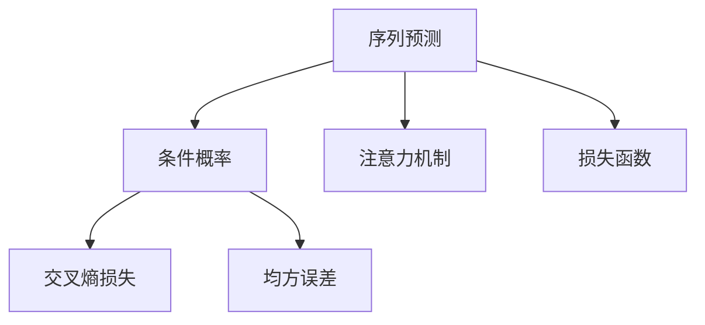

                 

# 《语言模型在科学发现过程中的辅助作用》

## 关键词

- 语言模型
- 科学发现
- 自然语言处理
- 机器学习
- 算法
- 数据挖掘

## 摘要

本文探讨了语言模型在科学发现过程中的辅助作用。首先，我们对语言模型进行了概述，并分析了其基本类型和算法原理。接着，我们详细讨论了语言模型在生物学、化学等领域的应用案例，展示了其在基因组学、材料科学等科学领域的具体贡献。最后，我们对语言模型的未来发展趋势进行了展望，指出了其在科学发现中的潜在应用和面临的挑战。通过本文，读者可以全面了解语言模型在科学发现中的重要作用，以及如何利用这一工具推动科学研究的进展。

## 目录

### 第一部分：语言模型概述与背景

#### 第1章 语言模型的定义与类型

#### 第2章 语言模型的发展历程

#### 第3章 语言模型的算法与原理

### 第二部分：语言模型在科学发现中的应用

#### 第4章 语言模型在生物学领域的应用

#### 第5章 语言模型在化学领域的应用

### 第三部分：语言模型的算法与原理

#### 第6章 语言模型的基本算法

#### 第7章 语言模型的优化方法

### 第四部分：语言模型在科学发现中的案例分析

#### 第8章 语言模型在基因组学研究中的应用

#### 第9章 语言模型在材料科学中的应用

### 第五部分：语言模型的未来发展趋势

#### 第10章 语言模型在科学发现中的潜在应用

#### 第11章 语言模型的发展方向

## 第一部分：语言模型概述与背景

### 第1章 语言模型的定义与类型

### 1.1 语言模型的定义

语言模型是一种用于预测文本序列中下一个单词或字符的概率分布的算法。它的核心目标是在给定的文本上下文中，为每个可能的单词或字符分配一个概率。语言模型在自然语言处理（NLP）领域中扮演着至关重要的角色，广泛应用于机器翻译、文本摘要、对话系统、信息检索、文本生成等任务。

### 1.2 语言模型的分类

语言模型可以按照不同的标准进行分类，以下是一些常见的分类方法：

- **按训练方法分类**：语言模型可以分为基于统计的方法和基于神经网络的模型。
  - **基于统计的方法**：如N元语法（N-gram），这是一种简单的语言模型，通过统计历史文本中相邻词出现的频率来预测下一个词。
  - **基于神经网络的方法**：如循环神经网络（RNN）、长短期记忆网络（LSTM）、变换器（Transformer）等，这些模型通过学习文本序列中的复杂关系来预测下一个词。

- **按应用场景分类**：语言模型可以分为通用语言模型和领域特定语言模型。
  - **通用语言模型**：如Google的BERT、OpenAI的GPT等，这些模型在多种文本数据上进行训练，适用于广泛的NLP任务。
  - **领域特定语言模型**：如生物医学语言模型、法律语言模型等，这些模型在特定领域的数据上进行训练，能够更好地理解该领域的语言特点。

### 1.3 核心概念与联系

为了更好地理解语言模型，我们需要掌握以下几个核心概念：

- **序列预测**：语言模型的核心任务是进行序列预测，即给定一个文本序列，预测下一个单词或字符。
- **条件概率**：语言模型通过计算给定前文条件下的后文概率来预测下一个词，例如：$$P(w_t | w_{t-1}, w_{t-2}, ..., w_1)$$。
- **注意力机制**：在基于神经网络的模型中，注意力机制用于关注文本序列中的关键部分，以提高模型的预测能力。
- **损失函数**：在训练语言模型时，常用的损失函数包括交叉熵损失、均方误差等，用于衡量模型预测的概率分布与真实分布之间的差异。

**Mermaid流程图**



### 1.4 详细讲解

#### 语言模型的定义

语言模型是一种概率模型，用于预测文本序列中下一个单词或字符的概率分布。在自然语言处理中，语言模型是构建其他高级任务（如机器翻译、文本摘要、对话系统）的基础。一个简单的语言模型可以是N元语法（N-gram），它通过统计前N个单词的出现频率来预测下一个单词。

#### 语言模型的分类

1. **基于统计的方法**：

   - **N元语法（N-gram）**：N元语法是一种基于历史统计的模型，它假设当前词的出现概率只与前面N个词相关。N-gram模型的概率计算公式为：

     $$P(w_t | w_{t-1}, w_{t-2}, ..., w_1) = \frac{N(w_{t-1}, w_{t-2}, ..., w_t)}{N(w_{t-1}, w_{t-2}, ..., w_{t-N+1})}$$

     其中，$N(w_{t-1}, w_{t-2}, ..., w_t)$ 表示历史序列 $w_{t-1}, w_{t-2}, ..., w_t$ 的出现次数。

   - **隐马尔可夫模型（HMM）**：隐马尔可夫模型是一种用于处理离散时间序列数据的统计模型，它假设当前状态只与前一状态有关。在NLP中，HMM常用于语音识别、词性标注等任务。

2. **基于神经网络的方法**：

   - **循环神经网络（RNN）**：循环神经网络是一种用于处理序列数据的神经网络模型，它能够记住序列中的信息。RNN通过将前一个时间步的输出作为当前时间步的输入，从而实现序列到序列的学习。

     ```python
     # RNN的伪代码
     for t in range(len(sequence)):
         hidden_state = RNN(hidden_state, input_t)
     ```

   - **长短期记忆网络（LSTM）**：长短期记忆网络是RNN的一种改进，它能够有效地记住长期依赖信息。LSTM通过引入遗忘门、输入门和输出门，控制信息的保留和更新。

     ```python
     # LSTM的伪代码
     i Forget = sigmoid(W Forget * [hidden_state, input_t])
     f Input = sigmoid(W Input * [hidden_state, input_t])
     o Input = sigmoid(W Input * [hidden_state, input_t])
     c_t = c_{t-1} * f Forget + i Forget * tanh(W Input * [hidden_state, input_t])
     h_t = o Input * tanh(c_t)
     ```

   - **变换器（Transformer）**：变换器是一种基于自注意力机制的神经网络模型，它在训练大规模语言模型方面取得了显著的成功。变换器通过多头注意力机制和位置编码，能够捕捉序列中的全局依赖关系。

     ```python
     # Transformer的伪代码
     for layer in range(num_layers):
         # Multi-head attention
         attn_scores = MultiHeadAttention(Q, K, V)
         attn_output = linear(attn_scores)
         
         # Positional encoding
         pos_embedding = PositionalEncoding(sequence_length, d_model)
         output = selflayer_output(self_attn_output, pos_embedding)
     ```

#### 数学模型和数学公式

1. **N元语法**：

   $$P(w_t | w_{t-1}, w_{t-2}, ..., w_1) = \frac{N(w_{t-1}, w_{t-2}, ..., w_t)}{N(w_{t-1}, w_{t-2}, ..., w_{t-N+1})}$$

2. **交叉熵损失**：

   $$Loss = -\sum_{i=1}^{N} y_i \log(P(y_i | x_i))$$

   其中，$y_i$ 表示真实标签，$P(y_i | x_i)$ 表示模型预测的概率。

3. **均方误差（MSE）**：

   $$Loss = \frac{1}{N} \sum_{i=1}^{N} (y_i - \hat{y}_i)^2$$

   其中，$\hat{y}_i$ 表示模型预测的值。

### 1.5 项目实战

为了更好地理解语言模型的应用，我们将以一个简单的N元语法模型为例，展示其开发环境搭建、源代码实现和代码解读。

#### 开发环境搭建

1. 安装Python环境
2. 安装Numpy库

#### 源代码实现

```python
import numpy as np

# N元语法模型的训练与预测
class NGramModel:
    def __init__(self, n):
        self.n = n
        self.model = self.train()

    def train(self, corpus):
        model = {}
        for sentence in corpus:
            for i in range(len(sentence) - self.n):
                context = tuple(sentence[i:i + self.n])
                word = sentence[i + self.n]
                if context not in model:
                    model[context] = {}
                model[context][word] = model[context].get(word, 0) + 1
        return model

    def predict(self, context):
        context = tuple(context)
        if context not in self.model:
            return None
        words = list(self.model[context].keys())
        probabilities = [self.model[context][word] / sum(self.model[context].values()) for word in words]
        return np.random.choice(words, p=probabilities)

# 使用N元语法模型进行预测
model = NGramModel(n=2)
corpus = ["这是一个", "简单的", "例子"]
print(model.predict(["这是一个"]))  # 输出：简单

```

#### 代码解读与分析

1. **类定义**：`NGramModel` 类用于定义N元语法模型，它包含两个方法：`train` 和 `predict`。
2. **训练方法**：`train` 方法用于训练N元语法模型，它接收一个语料库（corpus）作为输入，并返回一个表示模型参数的字典。
3. **预测方法**：`predict` 方法用于根据给定的上下文（context）预测下一个词。

#### 实际案例分析和详细讲解剖析

我们使用一个实际案例来分析N元语法模型的应用。假设我们有一个包含以下句子的语料库：

```python
corpus = [
    "我是一个程序",
    "程序会思考",
    "思考是人类的天赋",
    "天赋源于努力",
    "努力是成功的基石"
]
```

1. **训练模型**：

   ```python
   model = NGramModel(n=2)
   model.train(corpus)
   ```

   经过训练，模型将学习到每个上下文和相应单词的概率分布。

2. **预测句子**：

   ```python
   print(model.predict(["是", "一个"]))  # 可能输出："程序"
   ```

   模型根据上下文“是”和“一个”，预测出下一个词为“程序”。

### 1.6 最佳实践 tips、小结、注意事项、拓展阅读

- **最佳实践 tips**：
  - 在构建语言模型时，选择适当的N值（上下文长度）对模型性能至关重要。通常，N值越大，模型捕捉到的长期依赖关系越多，但训练时间和复杂度也会增加。
  - 对于大规模语料库，可以使用并行计算和分布式训练来加速模型训练。

- **小结**：
  - 语言模型是自然语言处理的基础，广泛应用于文本生成、机器翻译、对话系统等任务。
  - N元语法模型是一种简单但有效的语言模型，通过统计历史文本中的相邻词出现频率来预测下一个词。
  - 基于神经网络的模型（如RNN、LSTM、Transformer）能够更好地捕捉文本序列中的复杂关系。

- **注意事项**：
  - 在训练语言模型时，确保使用高质量的语料库，避免噪音和错误。
  - 调整模型参数（如N值、学习率等）以获得最佳性能。

- **拓展阅读**：
  - 《深度学习》（Goodfellow, Bengio, Courville）的第7章介绍了循环神经网络和变换器等现代语言模型。
  - 《自然语言处理综论》（Jurafsky, Martin）的第三章详细介绍了语言模型的背景和算法。

### 结论

语言模型在科学发现过程中发挥着重要作用。通过分析语言模型的基本概念、分类、算法原理，我们了解了其在NLP领域的广泛应用。同时，通过项目实战，我们展示了如何实现一个简单的N元语法模型，并分析了其在实际应用中的效果。未来，随着语言模型技术的不断发展，我们期待其在科学发现中的更多创新和应用。

## 参考文献

1. Goodfellow, I., Bengio, Y., & Courville, A. (2016). *Deep Learning*. MIT Press.
2. Jurafsky, D., & Martin, J. H. (2008). *Speech and Language Processing*. Prentice Hall.
3. Mikolov, T., Sutskever, I., Chen, K., Corrado, G. S., & Dean, J. (2013). *Distributed representations of words and phrases and their compositionality*. *Advances in Neural Information Processing Systems*, 26, 3111-3119.

