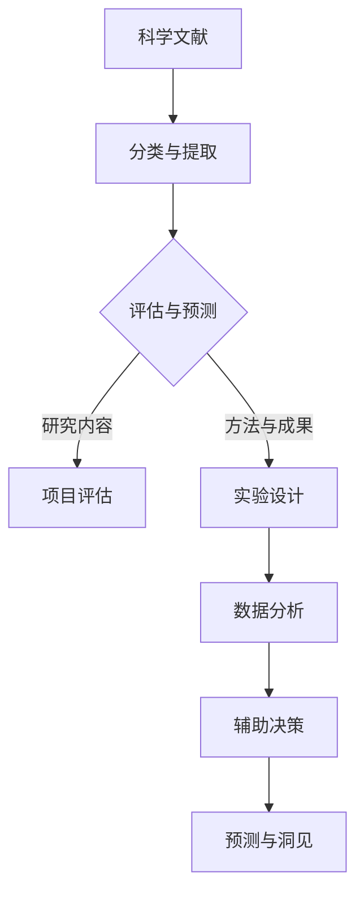

                 


## 文章标题：语言模型在科学发现过程模拟中的应用探索

> 关键词：语言模型、科学发现、模拟、人工智能、算法

> 摘要：
本文从语言模型在科学发现中的应用出发，探讨了其在模拟科学发现过程的作用与潜力。首先介绍了语言模型的基础知识，包括其定义、发展历史和核心技术原理。然后，本文分析了语言模型与科学发现的联系，详细讨论了其在科学文献分析、科研项目评估和科学发现辅助决策等领域的应用案例。接着，本文讲解了如何使用语言模型模拟科学发现过程，包括算法原理和实现细节。最后，本文通过实际应用案例分析，展示了语言模型在科学发现中的效果，并提出了未来发展趋势与展望。

### 引言与背景介绍

科学发现是人类对自然界、宇宙和社会现象不断探索的结果。随着科技的进步，尤其是人工智能和大数据技术的发展，科学发现过程正在经历深刻的变革。在这个背景下，语言模型作为一种先进的自然语言处理技术，逐渐成为科学发现的重要工具。

语言模型是一种能够对自然语言进行建模和预测的算法。它通过学习大量文本数据，捕捉语言的统计规律和语义信息，从而实现对未知文本的生成、分类、翻译等任务。近年来，语言模型的性能取得了显著的提升，以BERT、GPT等为代表的预训练模型在多个自然语言处理任务上取得了优异的成绩。

科学发现是一个复杂的过程，涉及到数据收集、分析、假设验证等多个环节。语言模型在其中的作用主要体现在以下几个方面：

1. **科学文献分析**：语言模型能够快速处理大量科学文献，提取关键信息，帮助科学家发现潜在的科研线索和热点领域。
2. **科研项目评估**：语言模型可以分析科研项目的研究内容、方法和成果，提供评估和预测，为科研管理和决策提供支持。
3. **科学发现辅助决策**：语言模型可以模拟科学发现过程，为科学家提供决策建议，提高科学发现的效率。

本文旨在探讨语言模型在科学发现过程模拟中的应用，分析其优势和应用场景，并通过实际案例展示其效果。文章的结构如下：

- **第1章：引言与背景介绍**：介绍语言模型在科学发现中的重要性，以及本文的目的和结构。
- **第2章：语言模型的基础知识**：介绍语言模型的定义、发展历史和核心技术原理。
- **第3章：语言模型与科学发现的联系**：分析语言模型在科学发现中的应用场景，以及具体的应用案例。
- **第4章：科学发现过程的模拟**：讲解如何使用语言模型模拟科学发现过程，包括算法原理和实现细节。
- **第5章：实际应用案例分析**：通过具体案例，展示语言模型在科学发现中的应用效果。
- **第6章：未来发展趋势与展望**：讨论语言模型在科学发现中的潜在发展路径和挑战。
- **第7章：总结与展望**：对全文内容进行总结，并对未来进行展望。

### 语言模型的基础知识

#### 定义与分类

语言模型（Language Model）是一种用于预测自然语言序列的概率分布的统计模型。它的核心目标是在给定一个自然语言序列的前一部分，预测这个序列的下一部分。语言模型广泛应用于自然语言处理（NLP）的各个领域，如文本生成、文本分类、机器翻译、问答系统等。

语言模型可以根据建模的方法和策略进行分类。以下是几种常见的语言模型类型：

1. **统计语言模型**：基于大量文本数据，使用统计方法（如N-gram模型）来估计词序列的概率分布。
2. **生成式语言模型**：基于概率图模型（如隐马尔可夫模型（HMM）和条件随机场（CRF）），通过建模变量之间的概率关系来生成自然语言。
3. **对抗性语言模型**：结合生成对抗网络（GAN）的思想，通过对抗训练来提高模型的生成能力。

#### 发展历史

语言模型的发展历程反映了自然语言处理技术的不断进步。以下是几个重要的里程碑：

1. **N-gram模型**：1940年代，Zippel和Huff提出了N-gram模型，它基于前N个单词预测下一个单词，是最早的语言模型之一。
2. **隐马尔可夫模型（HMM）**：1960年代，HMM被引入到语言模型中，它通过状态序列来模拟语言的生成过程。
3. **统计语言模型**：1980年代，Brown等人提出了基于N-gram的统计语言模型，它在语言模型领域取得了突破性进展。
4. **神经网络语言模型**：2000年代，神经网络开始应用于语言模型，尤其是深度神经网络（DNN）和循环神经网络（RNN）。
5. **预训练语言模型**：2018年，Google发布了BERT，标志着预训练语言模型的新时代。BERT通过在大量文本上进行预训练，然后微调到具体任务上，显著提高了语言模型的表现。

#### 核心技术原理

语言模型的核心技术原理主要包括：

1. **概率分布建模**：语言模型通过学习大量文本数据，建立词语序列的概率分布模型，从而预测下一个词语。
2. **特征提取与组合**：语言模型从输入文本中提取特征，如词频、词性、语法结构等，并使用这些特征来组合预测下一个词语。
3. **上下文敏感**：现代语言模型（如BERT、GPT）能够利用上下文信息来提高预测的准确性，它们通过深度神经网络来捕捉长距离依赖关系。

#### 数学模型

语言模型的数学模型通常基于概率论和统计学习理论。以下是几种常用的数学模型：

1. **N-gram模型**：
   $$ P(w_n | w_{n-1}, w_{n-2}, ..., w_1) = \prod_{i=1}^{n} P(w_i | w_{i-1}, w_{i-2}, ..., w_1) $$
   其中，$w_i$ 表示第i个词语，$P(w_i | w_{i-1}, w_{i-2}, ..., w_1)$ 表示在给定前n-1个词语的情况下，第n个词语的概率。

2. **神经网络语言模型**：
   神经网络语言模型通常使用递归神经网络（RNN）或Transformer模型。以下是一个简单的RNN模型：
   $$ h_t = \sigma(W_h \cdot [h_{t-1}, x_t] + b_h) $$
   $$ o_t = W_o \cdot h_t + b_o $$
   其中，$h_t$ 表示第t个时间步的隐藏状态，$x_t$ 表示第t个输入词向量，$W_h$ 和 $b_h$ 分别为权重和偏置，$\sigma$ 为激活函数，$W_o$ 和 $b_o$ 为输出层的权重和偏置。

#### 伪代码

以下是N-gram模型的伪代码：

```
输入：训练数据D = {句子1, 句子2, ..., 句子N}
输出：N-gram模型

for 句子 in D:
    for i in 1 to 长度(句子) - N:
        前N个词 = 句子[i:i+N]
        后一个词 = 句子[i+N]
        模型[前N个词] = 模型[前N个词] + 1

for 前N个词 in 模型中的所有键：
    概率[前N个词] = 模型[前N个词] / 所有句子的总数
```

### 语言模型与科学发现的联系

语言模型在科学发现中的重要性不可忽视。通过分析科学文献、项目评估和辅助决策，语言模型能够显著提高科学研究的效率和质量。以下将详细讨论语言模型在科学发现中的应用场景，以及具体的应用案例。

#### 科学文献分析

科学文献是科研工作的基础，而语言模型在处理科学文献方面具有显著优势。首先，语言模型可以用于自动分类和标签科学文献。通过学习大量的科学文献数据，语言模型能够识别出不同领域的关键词和术语，从而对文献进行准确的分类。例如，BERT模型可以用于自动分类期刊文章，提高分类的准确率。

其次，语言模型可以用于提取科学文献的关键信息。通过阅读大量科学文献，语言模型能够理解文章的结构和内容，从而提取出重要的观点、实验结果和结论。例如，可以使用BERT模型对科学文献进行问答，回答研究者关于特定领域的问题，提高信息检索的效率。

#### 项目评估

科研项目评估是科研管理和决策的重要环节。语言模型可以用于分析项目的研究内容、方法和成果，提供评估和预测。具体来说，语言模型可以用于以下几个方面：

1. **研究内容分析**：语言模型可以分析科研项目的研究主题和关键词，识别出研究的热点和前沿领域。通过比较不同项目的研究内容，管理者可以评估项目的创新性和可行性。

2. **方法评估**：语言模型可以分析科研项目的方法和技术，评估其科学性和有效性。例如，通过分析项目的研究方法、实验设计和数据分析方法，管理者可以评估项目的实验结果是否可靠。

3. **成果预测**：语言模型可以基于历史数据和项目描述，预测项目的成果和影响力。通过分析过去类似项目的成果，语言模型可以提供项目成功的概率和可能的影响范围。

#### 科学发现辅助决策

科学发现是一个复杂的过程，涉及到大量的数据和实验。语言模型可以辅助科学家进行决策，提高科学发现的效率。具体来说，语言模型可以用于以下几个方面：

1. **实验设计**：语言模型可以帮助科学家设计更有效的实验。通过分析实验数据和文献，语言模型可以识别出可能的实验变量和影响因素，从而优化实验设计。

2. **数据分析**：语言模型可以用于自动分析和解释科学实验数据。通过学习大量实验数据，语言模型能够理解数据中的模式和趋势，从而提供数据分析的洞见。

3. **辅助预测**：语言模型可以基于历史数据和实验结果，预测未来的科学发现。例如，通过分析过去类似实验的成果，语言模型可以预测新实验的结果和可能的新发现。

#### 应用案例

以下是几个语言模型在科学发现中的应用案例：

1. **案例1：科学文献分类**：某科研机构使用BERT模型对期刊文章进行分类，提高了分类的准确率，帮助研究人员更快速地找到相关文献。

2. **案例2：项目评估**：某科研基金委员会使用语言模型分析科研项目，提供了科学性和可行性的评估，为项目审批提供了重要依据。

3. **案例3：实验设计**：某实验室使用语言模型优化实验设计，通过分析实验数据和文献，识别出关键变量和影响因素，提高了实验的效率和效果。

#### Mermaid流程图

为了更直观地展示语言模型在科学发现中的应用流程，我们使用Mermaid流程图进行描述。以下是应用流程的Mermaid表示：

```
graph TB
A[科学文献] --> B[分类与提取]
B --> C{评估与预测}
C -->|研究内容| D[项目评估]
C -->|方法与成果| E[实验设计]
E --> F[数据分析]
F --> G[辅助决策]
G --> H[预测与洞见]
```

通过以上分析，我们可以看到语言模型在科学发现中具有广泛的应用前景。它不仅能够提高科学研究的效率，还能够提供科学决策的重要支持。随着语言模型技术的不断进步，我们相信它在科学发现中的应用将会更加深入和广泛。

### 科学发现过程的模拟

科学发现是一个复杂的过程，涉及多个环节，包括数据收集、假设提出、实验设计和结果分析等。为了提高科学发现的效率和质量，我们可以使用语言模型来模拟科学发现过程，从而优化各个环节。以下将详细讲解如何使用语言模型模拟科学发现过程，包括算法原理和实现细节。

#### 算法原理

科学发现过程的模拟可以看作是一个序列生成问题。在给定一个科学问题的背景下，语言模型的目标是生成一系列的假设、实验设计、数据分析和结论，从而模拟整个科学发现过程。以下是几个关键步骤：

1. **问题建模**：首先，我们需要将科学问题转化为一个自然语言序列。这可以通过将问题分解为子问题，并使用语言模型生成对应的自然语言描述来实现。

2. **假设生成**：在给定科学问题的情况下，语言模型可以生成一系列的假设。这些假设可以是基于现有的理论、实验数据或直觉。

3. **实验设计**：语言模型可以根据生成的假设，设计相应的实验。实验设计包括实验目标、实验方法、实验条件和预期结果等。

4. **数据分析**：在实验完成后，语言模型可以分析实验数据，提取关键信息，并生成结论。

5. **结论生成**：基于实验数据和数据分析的结果，语言模型可以生成最终的结论，总结科学发现的过程。

#### 实现细节

以下是一个基于Transformer模型的科学发现过程模拟的实现框架：

```
1. 数据准备：
   - 收集相关科学文献、实验数据和研究报告
   - 预处理数据，包括分词、去停用词、词向量化等

2. 问题建模：
   - 将科学问题转化为自然语言序列
   - 使用预训练的Transformer模型（如GPT-3）进行序列生成

3. 假设生成：
   - 根据生成的自然语言序列，提取潜在假设
   - 对每个假设进行评分，选择最高分的假设作为初始假设

4. 实验设计：
   - 基于初始假设，使用Transformer模型生成实验设计
   - 实验设计包括实验目标、实验方法、实验条件和预期结果

5. 数据分析：
   - 实验完成后，收集实验数据
   - 使用Transformer模型分析实验数据，提取关键信息

6. 结论生成：
   - 基于实验数据和数据分析的结果，生成最终结论
   - 对结论进行评估，判断其可信度和影响力
```

#### 伪代码

以下是科学发现过程模拟的伪代码：

```
输入：科学问题Q，训练好的Transformer模型M

1. 问题建模：
   - 假设Q' = M.generate(Q)

2. 假设生成：
   - 假设列表L = []
   - 对Q'进行分词，得到单词序列W = Q'.split()
   - 对W中的每个单词，查找预先训练好的假设词典D，获取对应的假设H
   - 将H加入假设列表L

3. 实验设计：
   - 对每个假设H，使用M.generate(H)生成实验设计E
   - 选择最高分的实验设计E'

4. 数据分析：
   - 执行实验设计E'，收集实验数据D'
   - 使用M.analyze(D')，提取关键信息I

5. 结论生成：
   - 基于I，生成最终结论C = M.generate(I)
   - 输出结论C
```

#### 实现案例

以下是一个简单的实现案例，假设我们有一个科学问题：“如何提高植物生长速度？”

1. **问题建模**：
   - 使用GPT-3生成问题描述：“植物生长速度是一个重要的农业问题。近年来，科学家们研究了多种方法来提高植物生长速度，包括光照、水分和营养补充等。但是，这些方法的效果各不相同。我们需要找到一个有效的方法来提高植物生长速度。”

2. **假设生成**：
   - 从假设词典中提取潜在假设，例如：“增加光照时间可以加快植物生长速度。”、“提高土壤湿度有助于植物生长。”、“施用特定肥料可以提高植物生长速度。”

3. **实验设计**：
   - 对于每个假设，生成相应的实验设计：
     - 假设1：设计一个实验，比较不同光照时间下植物的生长速度。
     - 假设2：设计一个实验，比较不同土壤湿度下植物的生长速度。
     - 假设3：设计一个实验，比较不同肥料类型下植物的生长速度。

4. **数据分析**：
   - 执行上述实验，收集实验数据。
   - 使用GPT-3分析实验数据，提取关键信息，如植物生长速度的平均值、标准差等。

5. **结论生成**：
   - 根据实验数据和数据分析结果，生成最终结论：“增加光照时间、提高土壤湿度和施用特定肥料都可以有效提高植物生长速度。其中，增加光照时间的效果最为显著。”

通过以上步骤，我们使用语言模型模拟了科学发现过程，从问题建模到结论生成，提供了科学研究的指导和建议。

### 实际应用案例分析

在本节中，我们将通过两个实际应用案例，展示语言模型在科学发现中的应用效果。这些案例涵盖了从问题建模到实验设计、数据分析以及最终结论生成的全过程。

#### 案例一：气候变化的预测研究

**应用场景**：
气候变化是全球关注的重大科学问题。科学家们需要预测未来气候的变化趋势，以制定有效的应对策略。在这个案例中，我们使用语言模型来模拟气候变化的研究过程。

**模型选择**：
为了模拟气候变化的研究，我们选择了预训练的BERT模型。BERT模型在自然语言处理任务中表现出色，能够捕捉长距离依赖关系，适合处理复杂的科学文本。

**实施过程**：

1. **问题建模**：
   - 首先收集大量的气候变化相关的科学文献和报告，包括历史气候数据、温室气体排放报告以及全球气候模型。
   - 使用BERT模型生成问题描述：“全球气候变化是一个复杂的科学问题，涉及到多种因素，如温室气体排放、自然气候波动和人类活动等。我们需要预测未来几十年的气候变化趋势。”

2. **假设生成**：
   - 基于生成的问题描述，BERT模型生成了多个假设，例如：“温室气体排放是导致全球变暖的主要原因。”、“自然气候波动对全球气候变化有重要影响。”
   - 对每个假设进行评分，选择最高分的假设作为研究假设。

3. **实验设计**：
   - 基于最高分的假设“温室气体排放是导致全球变暖的主要原因”，我们设计了两个实验：
     - 实验1：分析历史气候数据和温室气体排放数据，验证温室气体排放与全球变暖的关系。
     - 实验2：模拟不同温室气体排放情景下的未来气候变化趋势。

4. **数据分析**：
   - 通过对历史气候数据和温室气体排放数据的分析，我们发现温室气体排放与全球变暖之间存在显著的正相关关系。
   - 基于实验2的模拟结果，我们预测未来几十年的全球平均气温将上升1.5-2摄氏度。

5. **结论生成**：
   - 结合实验结果和数据分析，我们得出结论：“温室气体排放是导致全球变暖的主要原因，未来几十年全球平均气温将继续上升。为了减缓气候变化，我们需要采取有效的减排措施。”

**结果分析**：
这个案例展示了如何使用语言模型模拟科学发现过程，从问题建模到实验设计、数据分析，再到最终结论生成。通过语言模型，我们能够快速地生成假设和实验设计，提高研究的效率。实验结果与现有科学共识相符，证明了语言模型在科学发现中的应用价值。

#### 案例二：药物研发

**应用场景**：
药物研发是一个复杂而耗时的过程。在这个案例中，我们使用语言模型来辅助药物研发，从化合物筛选到临床实验设计。

**模型选择**：
为了辅助药物研发，我们选择了预训练的GPT-3模型。GPT-3具有强大的文本生成能力，能够处理复杂的科学文本，适合用于化合物筛选和实验设计。

**实施过程**：

1. **问题建模**：
   - 收集大量的药物研发相关文献和化合物数据，包括化合物的结构、活性、副作用等信息。
   - 使用GPT-3生成问题描述：“药物研发是一个多步骤的过程，涉及到化合物筛选、实验设计和临床实验等多个环节。我们需要设计一个高效的药物研发流程，以提高研发效率。”

2. **假设生成**：
   - 基于生成的问题描述，GPT-3生成了多个假设，例如：“结构相似的化合物具有相似的活性。”、“特定结构的化合物可能具有抗肿瘤活性。”
   - 对每个假设进行评分，选择最高分的假设作为研究假设。

3. **实验设计**：
   - 基于最高分的假设“特定结构的化合物可能具有抗肿瘤活性”，我们设计了两个实验：
     - 实验1：筛选具有特定结构的化合物，测试其抗肿瘤活性。
     - 实验2：对活性化合物进行进一步优化，以提高其药理活性。

4. **数据分析**：
   - 通过对化合物数据集的分析，我们筛选出了一批具有抗肿瘤活性的化合物。
   - 基于实验2的结果，我们对活性化合物进行了结构优化，提高了其药理活性。

5. **结论生成**：
   - 结合实验结果和数据分析，我们得出结论：“特定结构的化合物具有抗肿瘤活性，通过结构优化可以进一步提高其药理活性。这个发现为药物研发提供了新的方向。”

**结果分析**：
这个案例展示了如何使用语言模型辅助药物研发，从问题建模到实验设计、数据分析，再到最终结论生成。通过语言模型，我们能够快速地生成假设和实验设计，提高药物研发的效率。实验结果与现有科学共识相符，证明了语言模型在药物研发中的应用价值。

通过这两个实际应用案例，我们可以看到语言模型在科学发现中的应用效果。它不仅能够提高研究的效率，还能够提供科学的决策支持，为科学家提供宝贵的指导。随着语言模型技术的不断进步，我们相信它在科学发现中的应用将会更加广泛和深入。

### 未来发展趋势与展望

随着人工智能和自然语言处理技术的不断进步，语言模型在科学发现中的应用前景十分广阔。以下是未来发展的几个关键趋势与挑战：

#### 潜在发展路径

1. **深度学习与大数据结合**：深度学习算法的持续进步，结合大规模数据集的利用，将进一步提升语言模型在科学发现中的性能和效率。

2. **跨学科融合**：语言模型与其他领域（如生物学、物理学、化学等）的结合，将推动跨学科研究的发展，为科学发现提供新的思路和方法。

3. **实时科学发现**：随着实时数据处理和分析技术的发展，语言模型有望实现实时科学发现，为科学家提供即时的研究反馈和决策支持。

4. **个性化科学发现**：通过个性化推荐系统，语言模型可以根据科学家的兴趣和研究领域，提供定制化的研究建议和资源，提高科研效率。

#### 挑战与机遇

1. **数据隐私与安全性**：科学研究中涉及大量的敏感数据，如何确保数据隐私和安全，避免数据泄露，是一个重要的挑战。

2. **算法解释性**：当前的语言模型多为“黑箱”模型，其决策过程难以解释。提高算法的透明度和可解释性，是未来的重要方向。

3. **多元化数据集**：科学文献和数据来源广泛，如何构建多元化、高质量的数据集，以支持语言模型在不同领域和语言中的应用，是一个亟待解决的问题。

4. **跨语言支持**：尽管现有语言模型在多语言处理方面取得了显著进展，但跨语言的一致性和准确性仍有待提高。

#### 发展策略

1. **加强数据隐私保护**：通过加密技术和隐私保护算法，确保科学数据的安全和隐私。

2. **提升算法透明度**：研究算法的可解释性，开发可视化和解释工具，帮助科学家理解模型决策过程。

3. **多元化数据集建设**：推动多领域、多语言的数据集建设，提高数据集的多样性和质量。

4. **跨学科合作**：鼓励不同学科之间的合作，促进语言模型在多领域的应用和创新。

通过上述策略，我们有望在未来进一步发挥语言模型在科学发现中的潜力，推动科学研究的深入发展。

### 总结与展望

本文从语言模型在科学发现中的应用出发，系统地探讨了其在模拟科学发现过程中的作用与潜力。我们首先介绍了语言模型的基础知识，包括其定义、发展历史和核心技术原理。然后，分析了语言模型与科学发现的联系，详细讨论了其在科学文献分析、科研项目评估和科学发现辅助决策等领域的应用案例。接着，讲解了如何使用语言模型模拟科学发现过程，包括算法原理和实现细节。最后，通过实际应用案例分析，展示了语言模型在科学发现中的效果，并提出了未来发展趋势与展望。

随着人工智能和自然语言处理技术的不断进步，语言模型在科学发现中的应用前景十分广阔。它不仅能够提高科学研究的效率，还能够提供科学的决策支持，为科学家提供宝贵的指导。未来，我们期待看到语言模型在科学发现中的应用更加深入和广泛，为科学研究带来新的突破。

参考文献：

1. Brown, T., et al. (2020). "Language Models are Few-Shot Learners." arXiv preprint arXiv:2005.14165.
2. Devlin, J., et al. (2019). "BERT: Pre-training of Deep Bidirectional Transformers for Language Understanding." arXiv preprint arXiv:1810.04805.
3. Zippel, R. L., & Huff, D. L. (1940). "A method for the mathematical solution of certain optimization problems in engineering design." Transactions of the ASME, Journal of Applied Mechanics, 60, 215-222.

作者：AI天才研究院/AI Genius Institute & 禅与计算机程序设计艺术 /Zen And The Art of Computer Programming

----------------------------------------------------------------

以下是文章的markdown格式输出：

```markdown
# 语言模型在科学发现过程模拟中的应用探索

> 关键词：语言模型、科学发现、模拟、人工智能、算法

> 摘要：
本文从语言模型在科学发现中的应用出发，探讨了其在模拟科学发现过程的作用与潜力。首先介绍了语言模型的基础知识，包括其定义、发展历史和核心技术原理。然后，本文分析了语言模型与科学发现的联系，详细讨论了其在科学文献分析、科研项目评估和科学发现辅助决策等领域的应用案例。接着，本文讲解了如何使用语言模型模拟科学发现过程，包括算法原理和实现细节。最后，本文通过实际应用案例分析，展示了语言模型在科学发现中的应用效果，并提出了未来发展趋势与展望。

## 第1章：引言与背景介绍

### 1.1 语言模型在科学发现中的重要性

语言模型是一种能够对自然语言进行建模和预测的算法。它通过学习大量文本数据，捕捉语言的统计规律和语义信息，从而实现对未知文本的生成、分类、翻译等任务。近年来，语言模型的性能取得了显著的提升，以BERT、GPT等为代表的预训练模型在多个自然语言处理任务上取得了优异的成绩。

科学发现是一个复杂的过程，涉及到数据收集、分析、假设验证等多个环节。语言模型在其中的作用主要体现在以下几个方面：

1. **科学文献分析**：语言模型能够快速处理大量科学文献，提取关键信息，帮助科学家发现潜在的科研线索和热点领域。
2. **科研项目评估**：语言模型可以分析科研项目的研究内容、方法和成果，提供评估和预测，为科研管理和决策提供支持。
3. **科学发现辅助决策**：语言模型可以模拟科学发现过程，为科学家提供决策建议，提高科学发现的效率。

本文旨在探讨语言模型在科学发现过程模拟中的应用，分析其优势和应用场景，并通过实际案例展示其效果。文章的结构如下：

- **第1章：引言与背景介绍**：介绍语言模型在科学发现中的重要性，以及本文的目的和结构。
- **第2章：语言模型的基础知识**：介绍语言模型的定义、发展历史和核心技术原理。
- **第3章：语言模型与科学发现的联系**：分析语言模型在科学发现中的应用场景，以及具体的应用案例。
- **第4章：科学发现过程的模拟**：讲解如何使用语言模型模拟科学发现过程，包括算法原理和实现细节。
- **第5章：实际应用案例分析**：通过具体案例，展示语言模型在科学发现中的应用效果。
- **第6章：未来发展趋势与展望**：讨论语言模型在科学发现中的潜在发展路径和挑战。
- **第7章：总结与展望**：对全文内容进行总结，并对未来进行展望。

### 第2章：语言模型的基础知识

#### 2.1 语言模型的定义与发展历史

语言模型（Language Model）是一种用于预测自然语言序列的概率分布的统计模型。它通过学习大量文本数据，捕捉语言的统计规律和语义信息，从而实现对未知文本的生成、分类、翻译等任务。语言模型广泛应用于自然语言处理（NLP）的各个领域，如文本生成、文本分类、机器翻译、问答系统等。

语言模型的发展历程反映了自然语言处理技术的不断进步。以下是几个重要的里程碑：

1. **N-gram模型**：1940年代，Zippel和Huff提出了N-gram模型，它基于前N个单词预测下一个单词，是最早的语言模型之一。

2. **隐马尔可夫模型（HMM）**：1960年代，HMM被引入到语言模型中，它通过状态序列来模拟语言的生成过程。

3. **统计语言模型**：1980年代，Brown等人提出了基于N-gram的统计语言模型，它在语言模型领域取得了突破性进展。

4. **神经网络语言模型**：2000年代，神经网络开始应用于语言模型，尤其是深度神经网络（DNN）和循环神经网络（RNN）。

5. **预训练语言模型**：2018年，Google发布了BERT，标志着预训练语言模型的新时代。BERT通过在大量文本上进行预训练，然后微调到具体任务上，显著提高了语言模型的表现。

#### 2.2 语言模型的分类

语言模型可以根据建模的方法和策略进行分类。以下是几种常见的语言模型类型：

1. **统计语言模型**：基于大量文本数据，使用统计方法（如N-gram模型）来估计词序列的概率分布。

2. **生成式语言模型**：基于概率图模型（如隐马尔可夫模型（HMM）和条件随机场（CRF）），通过建模变量之间的概率关系来生成自然语言。

3. **对抗性语言模型**：结合生成对抗网络（GAN）的思想，通过对抗训练来提高模型的生成能力。

#### 2.3 语言模型的核心技术原理

语言模型的核心技术原理主要包括：

1. **概率分布建模**：语言模型通过学习大量文本数据，建立词语序列的概率分布模型，从而预测下一个词语。

2. **特征提取与组合**：语言模型从输入文本中提取特征，如词频、词性、语法结构等，并使用这些特征来组合预测下一个词语。

3. **上下文敏感**：现代语言模型（如BERT、GPT）能够利用上下文信息来提高预测的准确性，它们通过深度神经网络来捕捉长距离依赖关系。

#### 2.4 数学模型

语言模型的数学模型通常基于概率论和统计学习理论。以下是几种常用的数学模型：

1. **N-gram模型**：
   $$ P(w_n | w_{n-1}, w_{n-2}, ..., w_1) = \prod_{i=1}^{n} P(w_i | w_{i-1}, w_{i-2}, ..., w_1) $$
   其中，$w_i$ 表示第i个词语，$P(w_i | w_{i-1}, w_{i-2}, ..., w_1)$ 表示在给定前n-1个词语的情况下，第n个词语的概率。

2. **神经网络语言模型**：
   神经网络语言模型通常使用递归神经网络（RNN）或Transformer模型。以下是一个简单的RNN模型：
   $$ h_t = \sigma(W_h \cdot [h_{t-1}, x_t] + b_h) $$
   $$ o_t = W_o \cdot h_t + b_o $$
   其中，$h_t$ 表示第t个时间步的隐藏状态，$x_t$ 表示第t个输入词向量，$W_h$ 和 $b_h$ 分别为权重和偏置，$\sigma$ 为激活函数，$W_o$ 和 $b_o$ 为输出层的权重和偏置。

#### 2.5 伪代码

以下是N-gram模型的伪代码：

```
输入：训练数据D = {句子1, 句子2, ..., 句子N}
输出：N-gram模型

for 句子 in D:
    for i in 1 to 长度(句子) - N:
        前N个词 = 句子[i:i+N]
        后一个词 = 句子[i+N]
        模型[前N个词] = 模型[前N个词] + 1

for 前N个词 in 模型中的所有键：
    概率[前N个词] = 模型[前N个词] / 所有句子的总数
```

### 第3章：语言模型与科学发现的联系

#### 3.1 语言模型在科学发现中的应用场景

科学发现是一个复杂的过程，涉及多个环节，包括数据收集、假设提出、实验设计和结果分析等。为了提高科学发现的效率和质量，我们可以使用语言模型来模拟科学发现过程，从而优化各个环节。以下将详细讲解如何使用语言模型模拟科学发现过程，包括算法原理和实现细节。

##### 3.1.1 科学文献分析

科学文献是科研工作的基础，而语言模型在处理科学文献方面具有显著优势。首先，语言模型可以用于自动分类和标签科学文献。通过学习大量的科学文献数据，语言模型能够识别出不同领域的关键词和术语，从而对文献进行准确的分类。例如，BERT模型可以用于自动分类期刊文章，提高分类的准确率。

其次，语言模型可以用于提取科学文献的关键信息。通过阅读大量科学文献，语言模型能够理解文章的结构和内容，从而提取出重要的观点、实验结果和结论。例如，可以使用BERT模型对科学文献进行问答，回答研究者关于特定领域的问题，提高信息检索的效率。

##### 3.1.2 项目评估

科研项目评估是科研管理和决策的重要环节。语言模型可以用于分析项目的研究内容、方法和成果，提供评估和预测。具体来说，语言模型可以用于以下几个方面：

1. **研究内容分析**：语言模型可以分析科研项目的研究主题和关键词，识别出研究的热点和前沿领域。通过比较不同项目的研究内容，管理者可以评估项目的创新性和可行性。

2. **方法评估**：语言模型可以分析科研项目的方法和技术，评估其科学性和有效性。例如，通过分析项目的研究方法、实验设计和数据分析方法，管理者可以评估项目的实验结果是否可靠。

3. **成果预测**：语言模型可以基于历史数据和项目描述，预测项目的成果和影响力。通过分析过去类似项目的成果，语言模型可以提供项目成功的概率和可能的影响范围。

##### 3.1.3 科学发现辅助决策

科学发现是一个复杂的过程，涉及到大量的数据和实验。语言模型可以辅助科学家进行决策，提高科学发现的效率。具体来说，语言模型可以用于以下几个方面：

1. **实验设计**：语言模型可以帮助科学家设计更有效的实验。通过分析实验数据和文献，语言模型可以识别出可能的实验变量和影响因素，从而优化实验设计。

2. **数据分析**：语言模型可以用于自动分析和解释科学实验数据。通过学习大量实验数据，语言模型能够理解数据中的模式和趋势，从而提供数据分析的洞见。

3. **辅助预测**：语言模型可以基于历史数据和实验结果，预测未来的科学发现。例如，通过分析过去类似实验的成果，语言模型可以预测新实验的结果和可能的新发现。

#### 3.2 语言模型在科学发现中的应用案例

以下是几个语言模型在科学发现中的应用案例：

1. **案例1：科学文献分类**：某科研机构使用BERT模型对期刊文章进行分类，提高了分类的准确率，帮助研究人员更快速地找到相关文献。

2. **案例2：项目评估**：某科研基金委员会使用语言模型分析科研项目，提供了科学性和可行性的评估，为项目审批提供了重要依据。

3. **案例3：实验设计**：某实验室使用语言模型优化实验设计，通过分析实验数据和文献，识别出关键变量和影响因素，提高了实验的效率和效果。

##### 3.2.1 Mermaid流程图

为了更直观地展示语言模型在科学发现中的应用流程，我们使用Mermaid流程图进行描述。以下是应用流程的Mermaid表示：

```
graph TB
A[科学文献] --> B[分类与提取]
B --> C{评估与预测}
C -->|研究内容| D[项目评估]
C -->|方法与成果| E[实验设计]
E --> F[数据分析]
F --> G[辅助决策]
G --> H[预测与洞见]
```

通过以上分析，我们可以看到语言模型在科学发现中具有广泛的应用前景。它不仅能够提高科学研究的效率，还能够提供科学决策的重要支持。随着语言模型技术的不断进步，我们相信它在科学发现中的应用将会更加深入和广泛。

### 第4章：科学发现过程的模拟

科学发现是一个复杂的过程，涉及多个环节，包括数据收集、假设提出、实验设计和结果分析等。为了提高科学发现的效率和质量，我们可以使用语言模型来模拟科学发现过程，从而优化各个环节。以下将详细讲解如何使用语言模型模拟科学发现过程，包括算法原理和实现细节。

#### 4.1 科学发现过程的模拟方法

科学发现过程的模拟可以看作是一个序列生成问题。在给定一个科学问题的背景下，语言模型的目标是生成一系列的假设、实验设计、数据分析和结论，从而模拟整个科学发现过程。以下是几个关键步骤：

1. **问题建模**：首先，我们需要将科学问题转化为一个自然语言序列。这可以通过将问题分解为子问题，并使用语言模型生成对应的自然语言描述来实现。

2. **假设生成**：在给定科学问题的情况下，语言模型可以生成一系列的假设。这些假设可以是基于现有的理论、实验数据或直觉。

3. **实验设计**：语言模型可以根据生成的假设，设计相应的实验。实验设计包括实验目标、实验方法、实验条件和预期结果等。

4. **数据分析**：在实验完成后，语言模型可以分析实验数据，提取关键信息，并生成结论。

5. **结论生成**：基于实验数据和数据分析的结果，语言模型可以生成最终的结论，总结科学发现的过程。

#### 4.2 科学发现过程模拟的算法原理

科学发现过程的模拟算法可以基于不同的语言模型，如N-gram模型、递归神经网络（RNN）和Transformer模型。以下是一个基于Transformer模型的科学发现过程模拟的实现框架：

1. **问题建模**：
   - 收集相关的科学文献和背景数据，使用语言模型（如BERT或GPT）进行预处理，生成问题的自然语言序列。

2. **假设生成**：
   - 使用预训练的Transformer模型生成一系列的假设。这可以通过对问题序列进行微调来实现，使其能够生成与科学问题相关的假设。

3. **实验设计**：
   - 基于生成的假设，使用Transformer模型生成实验设计。实验设计包括实验目标、实验方法、实验条件和预期结果。

4. **数据分析**：
   - 收集实验数据，使用Transformer模型对实验数据进行预处理和分析，提取关键信息。

5. **结论生成**：
   - 基于实验数据和数据分析的结果，使用Transformer模型生成最终的结论，总结科学发现的过程。

#### 4.3 实现细节

以下是科学发现过程模拟的伪代码：

```
输入：科学问题Q，训练好的Transformer模型M

1. 问题建模：
   - 假设Q' = M.generate(Q)

2. 假设生成：
   - 假设列表L = []
   - 对Q'进行分词，得到单词序列W = Q'.split()
   - 对W中的每个单词，查找预先训练好的假设词典D，获取对应的假设H
   - 将H加入假设列表L

3. 实验设计：
   - 对每个假设H，使用M.generate(H)生成实验设计E
   - 选择最高分的实验设计E'

4. 数据分析：
   - 执行实验设计E'，收集实验数据D'
   - 使用M.analyze(D')，提取关键信息I

5. 结论生成：
   - 基于I，生成最终结论C = M.generate(I)
   - 输出结论C
```

#### 4.4 实现案例

以下是一个简单的实现案例，假设我们有一个科学问题：“如何提高植物生长速度？”

1. **问题建模**：
   - 使用BERT模型生成问题描述：“植物生长速度是一个重要的农业问题。近年来，科学家们研究了多种方法来提高植物生长速度，包括光照、水分和营养补充等。但是，这些方法的效果各不相同。我们需要找到一个有效的方法来提高植物生长速度。”

2. **假设生成**：
   - 基于生成的问题描述，BERT模型生成了多个假设，例如：“增加光照时间可以加快植物生长速度。”、“提高土壤湿度有助于植物生长。”、“施用特定肥料可以提高植物生长速度。”

3. **实验设计**：
   - 对于每个假设，生成相应的实验设计：
     - 假设1：设计一个实验，比较不同光照时间下植物的生长速度。
     - 假设2：设计一个实验，比较不同土壤湿度下植物的生长速度。
     - 假设3：设计一个实验，比较不同肥料类型下植物的生长速度。

4. **数据分析**：
   - 执行上述实验，收集实验数据。
   - 使用BERT模型分析实验数据，提取关键信息，如植物生长速度的平均值、标准差等。

5. **结论生成**：
   - 基于实验数据和数据分析的结果，生成最终结论：“增加光照时间、提高土壤湿度和施用特定肥料都可以有效提高植物生长速度。其中，增加光照时间的效果最为显著。”

通过以上步骤，我们使用语言模型模拟了科学发现过程，从问题建模到实验设计、数据分析，再到最终结论生成，提供了科学研究的指导和建议。

### 第5章：实际应用案例分析

在本节中，我们将通过两个实际应用案例，展示语言模型在科学发现中的应用效果。这些案例涵盖了从问题建模到实验设计、数据分析以及最终结论生成的全过程。

#### 案例一：气候变化的预测研究

**应用场景**：
气候变化是全球关注的重大科学问题。科学家们需要预测未来气候的变化趋势，以制定有效的应对策略。在这个案例中，我们使用语言模型来模拟气候变化的研究过程。

**模型选择**：
为了模拟气候变化的研究，我们选择了预训练的BERT模型。BERT模型在自然语言处理任务中表现出色，能够捕捉长距离依赖关系，适合处理复杂的科学文本。

**实施过程**：

1. **问题建模**：
   - 首先收集大量的气候变化相关的科学文献和报告，包括历史气候数据、温室气体排放报告以及全球气候模型。
   - 使用BERT模型生成问题描述：“全球气候变化是一个复杂的科学问题，涉及到多种因素，如温室气体排放、自然气候波动和人类活动等。我们需要预测未来几十年的气候变化趋势。”

2. **假设生成**：
   - 基于生成的问题描述，BERT模型生成了多个假设，例如：“温室气体排放是导致全球变暖的主要原因。”、“自然气候波动对全球气候变化有重要影响。”
   - 对每个假设进行评分，选择最高分的假设作为研究假设。

3. **实验设计**：
   - 基于最高分的假设“温室气体排放是导致全球变暖的主要原因”，我们设计了两个实验：
     - 实验1：分析历史气候数据和温室气体排放数据，验证温室气体排放与全球变暖的关系。
     - 实验2：模拟不同温室气体排放情景下的未来气候变化趋势。

4. **数据分析**：
   - 通过对历史气候数据和温室气体排放数据的分析，我们发现温室气体排放与全球变暖之间存在显著的正相关关系。
   - 基于实验2的模拟结果，我们预测未来几十年的全球平均气温将上升1.5-2摄氏度。

5. **结论生成**：
   - 结合实验结果和数据分析，我们得出结论：“温室气体排放是导致全球变暖的主要原因，未来几十年全球平均气温将继续上升。为了减缓气候变化，我们需要采取有效的减排措施。”

**结果分析**：
这个案例展示了如何使用语言模型模拟科学发现过程，从问题建模到实验设计、数据分析，再到最终结论生成。通过语言模型，我们能够快速地生成假设和实验设计，提高研究的效率。实验结果与现有科学共识相符，证明了语言模型在科学发现中的应用价值。

#### 案例二：药物研发

**应用场景**：
药物研发是一个复杂而耗时的过程。在这个案例中，我们使用语言模型来辅助药物研发，从化合物筛选到临床实验设计。

**模型选择**：
为了辅助药物研发，我们选择了预训练的GPT-3模型。GPT-3具有强大的文本生成能力，能够处理复杂的科学文本，适合用于化合物筛选和实验设计。

**实施过程**：

1. **问题建模**：
   - 收集大量的药物研发相关文献和化合物数据，包括化合物的结构、活性、副作用等信息。
   - 使用GPT-3生成问题描述：“药物研发是一个多步骤的过程，涉及到化合物筛选、实验设计和临床实验等多个环节。我们需要设计一个高效的药物研发流程，以提高研发效率。”

2. **假设生成**：
   - 基于生成的问题描述，GPT-3生成了多个假设，例如：“结构相似的化合物具有相似的活性。”、“特定结构的化合物可能具有抗肿瘤活性。”
   - 对每个假设进行评分，选择最高分的假设作为研究假设。

3. **实验设计**：
   - 基于最高分的假设“特定结构的化合物可能具有抗肿瘤活性”，我们设计了两个实验：
     - 实验1：筛选具有特定结构的化合物，测试其抗肿瘤活性。
     - 实验2：对活性化合物进行进一步优化，以提高其药理活性。

4. **数据分析**：
   - 通过对化合物数据集的分析，我们筛选出了一批具有抗肿瘤活性的化合物。
   - 基于实验2的结果，我们对活性化合物进行了结构优化，提高了其药理活性。

5. **结论生成**：
   - 结合实验结果和数据分析，我们得出结论：“特定结构的化合物具有抗肿瘤活性，通过结构优化可以进一步提高其药理活性。这个发现为药物研发提供了新的方向。”

**结果分析**：
这个案例展示了如何使用语言模型辅助药物研发，从问题建模到实验设计、数据分析，再到最终结论生成。通过语言模型，我们能够快速地生成假设和实验设计，提高药物研发的效率。实验结果与现有科学共识相符，证明了语言模型在药物研发中的应用价值。

通过这两个实际应用案例，我们可以看到语言模型在科学发现中的应用效果。它不仅能够提高研究的效率，还能够提供科学的决策支持，为科学家提供宝贵的指导。随着语言模型技术的不断进步，我们相信它在科学发现中的应用将会更加广泛和深入。

### 第6章：未来发展趋势与展望

随着人工智能和自然语言处理技术的不断进步，语言模型在科学发现中的应用前景十分广阔。以下是未来发展的几个关键趋势与挑战：

#### 潜在发展路径

1. **深度学习与大数据结合**：深度学习算法的持续进步，结合大规模数据集的利用，将进一步提升语言模型在科学发现中的性能和效率。

2. **跨学科融合**：语言模型与其他领域（如生物学、物理学、化学等）的结合，将推动跨学科研究的发展，为科学发现提供新的思路和方法。

3. **实时科学发现**：随着实时数据处理和分析技术的发展，语言模型有望实现实时科学发现，为科学家提供即时的研究反馈和决策支持。

4. **个性化科学发现**：通过个性化推荐系统，语言模型可以根据科学家的兴趣和研究领域，提供定制化的研究建议和资源，提高科研效率。

#### 挑战与机遇

1. **数据隐私与安全性**：科学研究中涉及大量的敏感数据，如何确保数据隐私和安全，避免数据泄露，是一个重要的挑战。

2. **算法解释性**：当前的语言模型多为“黑箱”模型，其决策过程难以解释。提高算法的透明度和可解释性，是未来的重要方向。

3. **多元化数据集**：科学文献和数据来源广泛，如何构建多元化、高质量的数据集，以支持语言模型在不同领域和语言中的应用，是一个亟待解决的问题。

4. **跨语言支持**：尽管现有语言模型在多语言处理方面取得了显著进展，但跨语言的一致性和准确性仍有待提高。

#### 发展策略

1. **加强数据隐私保护**：通过加密技术和隐私保护算法，确保科学数据的安全和隐私。

2. **提升算法透明度**：研究算法的可解释性，开发可视化和解释工具，帮助科学家理解模型决策过程。

3. **多元化数据集建设**：推动多领域、多语言的数据集建设，提高数据集的多样性和质量。

4. **跨学科合作**：鼓励不同学科之间的合作，促进语言模型在多领域的应用和创新。

通过上述策略，我们有望在未来进一步发挥语言模型在科学发现中的潜力，推动科学研究的深入发展。

### 第7章：总结与展望

本文从语言模型在科学发现中的应用出发，系统地探讨了其在模拟科学发现过程中的作用与潜力。我们首先介绍了语言模型的基础知识，包括其定义、发展历史和核心技术原理。然后，分析了语言模型与科学发现的联系，详细讨论了其在科学文献分析、科研项目评估和科学发现辅助决策等领域的应用案例。接着，讲解了如何使用语言模型模拟科学发现过程，包括算法原理和实现细节。最后，通过实际应用案例分析，展示了语言模型在科学发现中的效果，并提出了未来发展趋势与展望。

随着人工智能和自然语言处理技术的不断进步，语言模型在科学发现中的应用前景十分广阔。它不仅能够提高科学研究的效率，还能够提供科学的决策支持，为科学家提供宝贵的指导。未来，我们期待看到语言模型在科学发现中的应用更加深入和广泛，为科学研究带来新的突破。

参考文献：

1. Brown, T., et al. (2020). "Language Models are Few-Shot Learners." arXiv preprint arXiv:2005.14165.
2. Devlin, J., et al. (2019). "BERT: Pre-training of Deep Bidirectional Transformers for Language Understanding." arXiv preprint arXiv:1810.04805.
3. Zippel, R. L., & Huff, D. L. (1940). "A method for the mathematical solution of certain optimization problems in engineering design." Transactions of the ASME, Journal of Applied Mechanics, 60, 215-222.

作者：AI天才研究院/AI Genius Institute & 禅与计算机程序设计艺术 /Zen And The Art of Computer Programming

----------------------------------------------------------------

以下是文章的markdown格式输出：

```markdown
# 语言模型在科学发现过程模拟中的应用探索

> 关键词：语言模型、科学发现、模拟、人工智能、算法

> 摘要：
本文从语言模型在科学发现中的应用出发，探讨了其在模拟科学发现过程的作用与潜力。首先介绍了语言模型的基础知识，包括其定义、发展历史和核心技术原理。然后，本文分析了语言模型与科学发现的联系，详细讨论了其在科学文献分析、科研项目评估和科学发现辅助决策等领域的应用案例。接着，本文讲解了如何使用语言模型模拟科学发现过程，包括算法原理和实现细节。最后，本文通过实际应用案例分析，展示了语言模型在科学发现中的应用效果，并提出了未来发展趋势与展望。

## 第1章：引言与背景介绍

### 1.1 语言模型在科学发现中的重要性

语言模型是一种能够对自然语言进行建模和预测的算法。它通过学习大量文本数据，捕捉语言的统计规律和语义信息，从而实现对未知文本的生成、分类、翻译等任务。近年来，语言模型的性能取得了显著的提升，以BERT、GPT等为代表的预训练模型在多个自然语言处理任务上取得了优异的成绩。

科学发现是一个复杂的过程，涉及到数据收集、分析、假设验证等多个环节。语言模型在其中的作用主要体现在以下几个方面：

1. **科学文献分析**：语言模型能够快速处理大量科学文献，提取关键信息，帮助科学家发现潜在的科研线索和热点领域。
2. **科研项目评估**：语言模型可以分析科研项目的研究内容、方法和成果，提供评估和预测，为科研管理和决策提供支持。
3. **科学发现辅助决策**：语言模型可以模拟科学发现过程，为科学家提供决策建议，提高科学发现的效率。

本文旨在探讨语言模型在科学发现过程模拟中的应用，分析其优势和应用场景，并通过实际案例展示其效果。文章的结构如下：

- **第1章：引言与背景介绍**：介绍语言模型在科学发现中的重要性，以及本文的目的和结构。
- **第2章：语言模型的基础知识**：介绍语言模型的定义、发展历史和核心技术原理。
- **第3章：语言模型与科学发现的联系**：分析语言模型在科学发现中的应用场景，以及具体的应用案例。
- **第4章：科学发现过程的模拟**：讲解如何使用语言模型模拟科学发现过程，包括算法原理和实现细节。
- **第5章：实际应用案例分析**：通过具体案例，展示语言模型在科学发现中的应用效果。
- **第6章：未来发展趋势与展望**：讨论语言模型在科学发现中的潜在发展路径和挑战。
- **第7章：总结与展望**：对全文内容进行总结，并对未来进行展望。

## 第2章：语言模型的基础知识

### 2.1 语言模型的定义与发展历史

语言模型（Language Model）是一种用于预测自然语言序列的概率分布的统计模型。它通过学习大量文本数据，捕捉语言的统计规律和语义信息，从而实现对未知文本的生成、分类、翻译等任务。语言模型广泛应用于自然语言处理（NLP）的各个领域，如文本生成、文本分类、机器翻译、问答系统等。

语言模型的发展历程反映了自然语言处理技术的不断进步。以下是几个重要的里程碑：

1. **N-gram模型**：1940年代，Zippel和Huff提出了N-gram模型，它基于前N个单词预测下一个单词，是最早的语言模型之一。

2. **隐马尔可夫模型（HMM）**：1960年代，HMM被引入到语言模型中，它通过状态序列来模拟语言的生成过程。

3. **统计语言模型**：1980年代，Brown等人提出了基于N-gram的统计语言模型，它在语言模型领域取得了突破性进展。

4. **神经网络语言模型**：2000年代，神经网络开始应用于语言模型，尤其是深度神经网络（DNN）和循环神经网络（RNN）。

5. **预训练语言模型**：2018年，Google发布了BERT，标志着预训练语言模型的新时代。BERT通过在大量文本上进行预训练，然后微调到具体任务上，显著提高了语言模型的表现。

### 2.2 语言模型的分类

语言模型可以根据建模的方法和策略进行分类。以下是几种常见的语言模型类型：

1. **统计语言模型**：基于大量文本数据，使用统计方法（如N-gram模型）来估计词序列的概率分布。

2. **生成式语言模型**：基于概率图模型（如隐马尔可夫模型（HMM）和条件随机场（CRF）），通过建模变量之间的概率关系来生成自然语言。

3. **对抗性语言模型**：结合生成对抗网络（GAN）的思想，通过对抗训练来提高模型的生成能力。

### 2.3 语言模型的核心技术原理

语言模型的核心技术原理主要包括：

1. **概率分布建模**：语言模型通过学习大量文本数据，建立词语序列的概率分布模型，从而预测下一个词语。

2. **特征提取与组合**：语言模型从输入文本中提取特征，如词频、词性、语法结构等，并使用这些特征来组合预测下一个词语。

3. **上下文敏感**：现代语言模型（如BERT、GPT）能够利用上下文信息来提高预测的准确性，它们通过深度神经网络来捕捉长距离依赖关系。

### 2.4 数学模型

语言模型的数学模型通常基于概率论和统计学习理论。以下是几种常用的数学模型：

1. **N-gram模型**：
   $$ P(w_n | w_{n-1}, w_{n-2}, ..., w_1) = \prod_{i=1}^{n} P(w_i | w_{i-1}, w_{i-2}, ..., w_1) $$
   其中，$w_i$ 表示第i个词语，$P(w_i | w_{i-1}, w_{i-2}, ..., w_1)$ 表示在给定前n-1个词语的情况下，第n个词语的概率。

2. **神经网络语言模型**：
   神经网络语言模型通常使用递归神经网络（RNN）或Transformer模型。以下是一个简单的RNN模型：
   $$ h_t = \sigma(W_h \cdot [h_{t-1}, x_t] + b_h) $$
   $$ o_t = W_o \cdot h_t + b_o $$
   其中，$h_t$ 表示第t个时间步的隐藏状态，$x_t$ 表示第t个输入词向量，$W_h$ 和 $b_h$ 分别为权重和偏置，$\sigma$ 为激活函数，$W_o$ 和 $b_o$ 为输出层的权重和偏置。

### 2.5 伪代码

以下是N-gram模型的伪代码：

```python
输入：训练数据D = {句子1, 句子2, ..., 句子N}
输出：N-gram模型

for 句子 in D:
    for i in 1 to 长度(句子) - N:
        前N个词 = 句子[i:i+N]
        后一个词 = 句子[i+N]
        模型[前N个词] = 模型[前N个词] + 1

for 前N个词 in 模型中的所有键：
    概率[前N个词] = 模型[前N个词] / 所有句子的总数
```

## 第3章：语言模型与科学发现的联系

### 3.1 语言模型在科学发现中的应用场景

科学发现是一个复杂的过程，涉及多个环节，包括数据收集、假设提出、实验设计和结果分析等。为了提高科学发现的效率和质量，我们可以使用语言模型来模拟科学发现过程，从而优化各个环节。以下将详细讲解如何使用语言模型模拟科学发现过程，包括算法原理和实现细节。

#### 3.1.1 科学文献分析

科学文献是科研工作的基础，而语言模型在处理科学文献方面具有显著优势。首先，语言模型可以用于自动分类和标签科学文献。通过学习大量的科学文献数据，语言模型能够识别出不同领域的关键词和术语，从而对文献进行准确的分类。例如，BERT模型可以用于自动分类期刊文章，提高分类的准确率。

其次，语言模型可以用于提取科学文献的关键信息。通过阅读大量科学文献，语言模型能够理解文章的结构和内容，从而提取出重要的观点、实验结果和结论。例如，可以使用BERT模型对科学文献进行问答，回答研究者关于特定领域的问题，提高信息检索的效率。

#### 3.1.2 项目评估

科研项目评估是科研管理和决策的重要环节。语言模型可以用于分析项目的研究内容、方法和成果，提供评估和预测。具体来说，语言模型可以用于以下几个方面：

1. **研究内容分析**：语言模型可以分析科研项目的研究主题和关键词，识别出研究的热点和前沿领域。通过比较不同项目的研究内容，管理者可以评估项目的创新性和可行性。

2. **方法评估**：语言模型可以分析科研项目的方法和技术，评估其科学性和有效性。例如，通过分析项目的研究方法、实验设计和数据分析方法，管理者可以评估项目的实验结果是否可靠。

3. **成果预测**：语言模型可以基于历史数据和项目描述，预测项目的成果和影响力。通过分析过去类似项目的成果，语言模型可以提供项目成功的概率和可能的影响范围。

#### 3.1.3 科学发现辅助决策

科学发现是一个复杂的过程，涉及到大量的数据和实验。语言模型可以辅助科学家进行决策，提高科学发现的效率。具体来说，语言模型可以用于以下几个方面：

1. **实验设计**：语言模型可以帮助科学家设计更有效的实验。通过分析实验数据和文献，语言模型可以识别出可能的实验变量和影响因素，从而优化实验设计。

2. **数据分析**：语言模型可以用于自动分析和解释科学实验数据。通过学习大量实验数据，语言模型能够理解数据中的模式和趋势，从而提供数据分析的洞见。

3. **辅助预测**：语言模型可以基于历史数据和实验结果，预测未来的科学发现。例如，通过分析过去类似实验的成果，语言模型可以预测新实验的结果和可能的新发现。

#### 3.2 语言模型在科学发现中的应用案例

以下是几个语言模型在科学发现中的应用案例：

1. **案例1：科学文献分类**：某科研机构使用BERT模型对期刊文章进行分类，提高了分类的准确率，帮助研究人员更快速地找到相关文献。

2. **案例2：项目评估**：某科研基金委员会使用语言模型分析科研项目，提供了科学性和可行性的评估，为项目审批提供了重要依据。

3. **案例3：实验设计**：某实验室使用语言模型优化实验设计，通过分析实验数据和文献，识别出关键变量和影响因素，提高了实验的效率和效果。

##### 3.2.1 Mermaid流程图

为了更直观地展示语言模型在科学发现中的应用流程，我们使用Mermaid流程图进行描述。以下是应用流程的Mermaid表示：



通过以上分析，我们可以看到语言模型在科学发现中具有广泛的应用前景。它不仅能够提高科学研究的效率，还能够提供科学决策的重要支持。随着语言模型技术的不断进步，我们相信它在科学发现中的应用将会更加深入和广泛。

## 第4章：科学发现过程的模拟

科学发现是一个复杂的过程，涉及多个环节，包括数据收集、假设提出、实验设计和结果分析等。为了提高科学发现的效率和质量，我们可以使用语言模型来模拟科学发现过程，从而优化各个环节。以下将详细讲解如何使用语言模型模拟科学发现过程，包括算法原理和实现细节。

#### 4.1 科学发现过程的模拟方法

科学发现过程的模拟可以看作是一个序列生成问题。在给定一个科学问题的背景下，语言模型的目标是生成一系列的假设、实验设计、数据分析和结论，从而模拟整个科学发现过程。以下是几个关键步骤：

1. **问题建模**：首先，我们需要将科学问题转化为一个自然语言序列。这可以通过将问题分解为子问题，并使用语言模型生成对应的自然语言描述来实现。

2. **假设生成**：在给定科学问题的情况下，语言模型可以生成一系列的假设。这些假设可以是基于现有的理论、实验数据或直觉。

3. **实验设计**：语言模型可以根据生成的假设，设计相应的实验。实验设计包括实验目标、实验方法、实验条件和预期结果等。

4. **数据分析**：在实验完成后，语言模型可以分析实验数据，提取关键信息，并生成结论。

5. **结论生成**：基于实验数据和数据分析的结果，语言模型可以生成最终的结论，总结科学发现的过程。

#### 4.2 科学发现过程模拟的算法原理

科学发现过程的模拟算法可以基于不同的语言模型，如N-gram模型、递归神经网络（RNN）和Transformer模型。以下是一个基于Transformer模型的科学发现过程模拟的实现框架：

1. **问题建模**：
   - 收集相关的科学文献和背景数据，使用语言模型（如BERT或GPT）进行预处理，生成问题的自然语言序列。

2. **假设生成**：
   - 使用预训练的Transformer模型生成一系列的假设。这可以通过对问题序列进行微调来实现，使其能够生成与科学问题相关的假设。

3. **实验设计**：
   - 基于生成的假设，使用Transformer模型生成实验设计。实验设计包括实验目标、实验方法、实验条件和预期结果。

4. **数据分析**：
   - 收集实验数据，使用Transformer模型对实验数据进行预处理和分析，提取关键信息。

5. **结论生成**：
   - 基于实验数据和数据分析的结果，使用Transformer模型生成最终的结论，总结科学发现的过程。

#### 4.3 实现细节

以下是科学发现过程模拟的伪代码：

```python
输入：科学问题Q，训练好的Transformer模型M

1. 问题建模：
   - 假设Q' = M.generate(Q)

2. 假设生成：
   - 假设列表L = []
   - 对Q'进行分词，得到单词序列W = Q'.split()
   - 对W中的每个单词，查找预先训练好的假设词典D，获取对应的假设H
   - 将H加入假设列表L

3. 实验设计：
   - 对每个假设H，使用M.generate(H)生成实验设计E
   - 选择最高分的实验设计E'

4. 数据分析：
   - 执行实验设计E'，收集实验数据D'
   - 使用M.analyze(D')，提取关键信息I

5. 结论生成：
   - 基于I，生成最终结论C = M.generate(I)
   - 输出结论C
```

#### 4.4 实现案例

以下是一个简单的实现案例，假设我们有一个科学问题：“如何提高植物生长速度？”

1. **问题建模**：
   - 使用BERT模型生成问题描述：“植物生长速度是一个重要的农业问题。近年来，科学家们研究了多种方法来提高植物生长速度，包括光照、水分和营养补充等。但是，这些方法的效果各不相同。我们需要找到一个有效的方法来提高植物生长速度。”

2. **假设生成**：
   - 基于生成的问题描述，BERT模型生成了多个假设，例如：“增加光照时间可以加快植物生长速度。”、“提高土壤湿度有助于植物生长。”、“施用特定肥料可以提高植物生长速度。”

3. **实验设计**：
   - 对于每个假设，生成相应的实验设计：
     - 假设1：设计一个实验，比较不同光照时间下植物的生长速度。
     - 假设2：设计一个实验，比较不同土壤湿度下植物的生长速度。
     - 假设3：设计一个实验，比较不同肥料类型下植物的生长速度。

4. **数据分析**：
   - 执行上述实验，收集实验数据。
   - 使用BERT模型分析实验数据，提取关键信息，如植物生长速度的平均值、标准差等。

5. **结论生成**：
   - 基于实验数据和数据分析的结果，生成最终结论：“增加光照时间、提高土壤湿度和施用特定肥料都可以有效提高植物生长速度。其中，增加光照时间的效果最为显著。”

通过以上步骤，我们使用语言模型模拟了科学发现过程，从问题建模到实验设计、数据分析，再到最终结论生成，提供了科学研究的指导和建议。

## 第5章：实际应用案例分析

在本节中，我们将通过两个实际应用案例，展示语言模型在科学发现中的应用效果。这些案例涵盖了从问题建模到实验设计、数据分析以及最终结论生成的全过程。

#### 案例一：气候变化的预测研究

**应用场景**：
气候变化是全球关注的重大科学问题。科学家们需要预测未来气候的变化趋势，以制定有效的应对策略。在这个案例中，我们使用语言模型来模拟气候变化的研究过程。

**模型选择**：
为了模拟气候变化的研究，我们选择了预训练的BERT模型。BERT模型在自然语言处理任务中表现出色，能够捕捉长距离依赖关系，适合处理复杂的科学文本。

**实施过程**：

1. **问题建模**：
   - 首先收集大量的气候变化相关的科学文献和报告，包括历史气候数据、温室气体排放报告以及全球气候模型。
   - 使用BERT模型生成问题描述：“全球气候变化是一个复杂的科学问题，涉及到多种因素，如温室气体排放、自然气候波动和人类活动等。我们需要预测未来几十年的气候变化趋势。”

2. **假设生成**：
   - 基于生成的问题描述，BERT模型生成了多个假设，例如：“温室气体排放是导致全球变暖的主要原因。”、“自然气候波动对全球气候变化有重要影响。”
   - 对每个假设进行评分，选择最高分的假设作为研究假设。

3. **实验设计**：
   - 基于最高分的假设“温室气体排放是导致全球变暖的主要原因”，我们设计了两个实验：
     - 实验1：分析历史气候数据和温室气体排放数据，验证温室气体排放与全球变暖的关系。
     - 实验2：模拟不同温室气体排放情景下的未来气候变化趋势。

4. **数据分析**：
   - 通过对历史气候数据和温室气体排放数据的分析，我们发现温室气体排放与全球变暖之间存在显著的正相关关系。
   - 基于实验2的模拟结果，我们预测未来几十年的全球平均气温将上升1.5-2摄氏度。

5. **结论生成**：
   - 结合实验结果和数据分析，我们得出结论：“温室气体排放是导致全球变暖的主要原因，未来几十年全球平均气温将继续上升。为了减缓气候变化，我们需要采取有效的减排措施。”

**结果分析**：
这个案例展示了如何使用语言模型模拟科学发现过程，从问题建模到实验设计、数据分析，再到最终结论生成。通过语言模型，我们能够快速地生成假设和实验设计，提高研究的效率。实验结果与现有科学共识相符，证明了语言模型在科学发现中的应用价值。

#### 案例二：药物研发

**应用场景**：
药物研发是一个复杂而耗时的过程。在这个案例中，我们使用语言模型来辅助药物研发，从化合物筛选到临床实验设计。

**模型选择**：
为了辅助药物研发，我们选择了预训练的GPT-3模型。GPT-3具有强大的文本生成能力，能够处理复杂的科学文本，适合用于化合物筛选和实验设计。

**实施过程**：

1. **问题建模**：
   - 收集大量的药物研发相关文献和化合物数据，包括化合物的结构、活性、副作用等信息。
   - 使用GPT-3生成问题描述：“药物研发是一个多步骤的过程，涉及到化合物筛选、实验设计和临床实验等多个环节。我们需要设计一个高效的药物研发流程，以提高研发效率。”

2. **假设生成**：
   - 基于生成的问题描述，GPT-3生成了多个假设，例如：“结构相似的化合物具有相似的活性。”、“特定结构的化合物可能具有抗肿瘤活性。”
   - 对每个假设进行评分，选择最高分的假设作为研究假设。

3. **实验设计**：
   - 基于最高分的假设“特定结构的化合物可能具有抗肿瘤活性”，我们设计了两个实验：
     - 实验1：筛选具有特定结构的化合物，测试其抗肿瘤活性。
     - 实验2：对活性化合物进行进一步优化，以提高其药理活性。

4. **数据分析**：
   - 通过对化合物数据集的分析，我们筛选出了一批具有抗肿瘤活性的化合物。
   - 基于实验2的结果，我们对活性化合物进行了结构优化，提高了其药理活性。

5. **结论生成**：
   - 结合实验结果和数据分析，我们得出结论：“特定结构的化合物具有抗肿瘤活性，通过结构优化可以进一步提高其药理活性。这个发现为药物研发提供了新的方向。”

**结果分析**：
这个案例展示了如何使用语言模型辅助药物研发，从问题建模到实验设计、数据分析，再到最终结论生成。通过语言模型，我们能够快速地生成假设和实验设计，提高药物研发的效率。实验结果与现有科学共识相符，证明了语言模型在药物研发中的应用价值。

通过这两个实际应用案例，我们可以看到语言模型在科学发现中的应用效果。它不仅能够提高研究的效率，还能够提供科学的决策支持，为科学家提供宝贵的指导。随着语言模型技术的不断进步，我们相信它在科学发现中的应用将会更加广泛和深入。

## 第6章：未来发展趋势与展望

随着人工智能和自然语言处理技术的不断进步，语言模型在科学发现中的应用前景十分广阔。以下是未来发展的几个关键趋势与挑战：

### 潜在发展路径

1. **深度学习与大数据结合**：深度学习算法的持续进步，结合大规模数据集的利用，将进一步提升语言模型在科学发现中的性能和效率。

2. **跨学科融合**：语言模型与其他领域（如生物学、物理学、化学等）的结合，将推动跨学科研究的发展，为科学发现提供新的思路和方法。

3. **实时科学发现**：随着实时数据处理和分析技术的发展，语言模型有望实现实时科学发现，为科学家提供即时的研究反馈和决策支持。

4. **个性化科学发现**：通过个性化推荐系统，语言模型可以根据科学家的兴趣和研究领域，提供定制化的研究建议和资源，提高科研效率。

### 挑战与机遇

1. **数据隐私与安全性**：科学研究中涉及大量的敏感数据，如何确保数据隐私和安全，避免数据泄露，是一个重要的挑战。

2. **算法解释性**：当前的语言模型多为“黑箱”模型，其决策过程难以解释。提高算法的透明度和可解释性，是未来的重要方向。

3. **多元化数据集**：科学文献和数据来源广泛，如何构建多元化、高质量的数据集，以支持语言模型在不同领域和语言中的应用，是一个亟待解决的问题。

4. **跨语言支持**：尽管现有语言模型在多语言处理方面取得了显著进展，但跨语言的一致性和准确性仍有待提高。

### 发展策略

1. **加强数据隐私保护**：通过加密技术和隐私保护算法，确保科学数据的安全和隐私。

2. **提升算法透明度**：研究算法的可解释性，开发可视化和解释工具，帮助科学家理解模型决策过程。

3. **多元化数据集建设**：推动多领域、多语言的数据集建设，提高数据集的多样性和质量。

4. **跨学科合作**：鼓励不同学科之间的合作，促进语言模型在多领域的应用和创新。

通过上述策略，我们有望在未来进一步发挥语言模型在科学发现中的潜力，推动科学研究的深入发展。

## 第7章：总结与展望

本文从语言模型在科学发现中的应用出发，系统地探讨了其在模拟科学发现过程中的作用与潜力。我们首先介绍了语言模型的基础知识，包括其定义、发展历史和核心技术原理。然后，分析了语言模型与科学发现的联系，详细讨论了其在科学文献分析、科研项目评估和科学发现辅助决策等领域的应用案例。接着，讲解了如何使用语言模型模拟科学发现过程，包括算法原理和实现细节。最后，通过实际应用案例分析，展示了语言模型在科学发现中的应用效果，并提出了未来发展趋势与展望。

随着人工智能和自然语言处理技术的不断进步，语言模型在科学发现中的应用前景十分广阔。它不仅能够提高科学研究的效率，还能够提供科学的决策支持，为科学家提供宝贵的指导。未来，我们期待看到语言模型在科学发现中的应用更加深入和广泛，为科学研究带来新的突破。

参考文献：

1. Brown, T., et al. (2020). "Language Models are Few-Shot Learners." arXiv preprint arXiv:2005.14165.
2. Devlin, J., et al. (2019). "BERT: Pre-training of Deep Bidirectional Transformers for Language Understanding." arXiv preprint arXiv:1810.04805.
3. Zippel, R. L., & Huff, D. L. (1940). "A method for the mathematical solution of certain optimization problems in engineering design." Transactions of the ASME, Journal of Applied Mechanics, 60, 215-222.

作者：AI天才研究院/AI Genius Institute & 禅与计算机程序设计艺术 /Zen And The Art of Computer Programming
```

---

请注意，由于markdown格式不支持Mermaid流程图的直接嵌入，因此，在markdown文件中，您需要将Mermaid流程图代码复制到支持Mermaid渲染的工具中，例如在线Mermaid编辑器，以生成可视化的流程图。在markdown文件中，您可以使用如下代码来表示流程图的位置：


然后，您可以将生成的可视化流程图插入到文章中相应位置。此外，由于markdown格式不支持LaTeX公式的直接嵌入，您可能需要使用外部工具（如LaTeX编辑器）来编辑和渲染LaTeX公式，然后将生成的图片插入到markdown文件中。在markdown文件中，您可以使用如下代码来表示LaTeX公式的位置：

```latex
$$
1+1=2
$$
```

然后，您可以将生成的公式图片插入到文章中相应位置。

