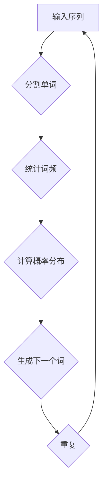

                 

 

### **文章标题**：《语言模型在科学发现过程自动化与跨学科创新中的突破性探索》

### **关键词**：语言模型，科学发现，跨学科创新，自动化，人工智能

### **摘要**：
随着人工智能技术的迅猛发展，语言模型在科学发现和跨学科创新中的应用展现出巨大的潜力。本文将深入探讨语言模型的核心概念、算法原理、数学模型，并分析其在自动化科学发现和跨学科创新中的突破性探索。我们将通过实例解析，展示语言模型在实际项目中的应用，并展望其未来的发展趋势。

## **一、引言**

科学发现一直是人类探索未知世界的重要驱动力，而跨学科创新则推动了科学技术的进步和社会发展。然而，传统的科学发现过程往往依赖大量的手工工作，效率和准确性受限。随着人工智能技术的发展，特别是语言模型的兴起，自动化科学发现和跨学科创新的实现变得愈发可能。本文旨在分析语言模型在科学发现和跨学科创新中的关键角色，并提出其突破性应用的可能性。

## **二、语言模型的核心概念与联系**

### **2.1 语言模型的核心概念**

语言模型是用于预测自然语言中下一个单词或字符的概率分布的模型。其核心概念包括：

- **词汇表**：语言模型的基础是词汇表，它包含了模型所考虑的所有单词或字符。
- **概率分布**：语言模型的目的是预测给定前文条件下下一个单词或字符的概率分布。
- **序列模型**：语言模型通常基于序列数据，如文本、语音等，处理序列中的依赖关系。

### **2.2 语言模型之间的联系**

语言模型的发展历程中，多个模型相互借鉴和补充，形成了紧密的联系：

- **n-gram模型**：基于历史统计的简单模型，考虑前n个词对当前词的影响。
- **神经网络模型**：基于统计模型和深度学习的方法，可以捕捉复杂的语言结构。
- **RNN和LSTM**：递归神经网络和长短时记忆网络是处理序列数据的常用模型，能够捕捉长距离依赖关系。
- **GAN和VAE**：生成对抗网络和变分自编码器是生成模型的代表，可以用于文本生成和增强学习。

### **2.3 Mermaid流程图：语言模型架构与流程**



## **三、核心算法原理讲解**

### **3.1 n-gram模型**

n-gram模型是最简单的语言模型，它假设当前词只与前n个词相关。其核心算法如下：

```python
def n_gram_model(context, n):
    count = Counter(context[:-1])
    total = sum(count.values())
    return [count[word] / total for word in count]
```

### **3.2 基于神经网络的模型**

神经网络模型通过多层感知器（MLP）或循环神经网络（RNN）来学习语言的复杂结构。以下是一个简单的神经网络模型的伪代码：

```python
def neural_network_model(input_sequence):
    # 前向传播
    hidden_layer = neural_network.forward(input_sequence)
    # 计算概率分布
    output = softmax(hidden_layer)
    return output
```

### **3.3 LSTM模型**

LSTM（长短时记忆网络）是处理序列数据的一种强大模型，能够捕捉长距离依赖关系。以下是一个简单的LSTM模型的伪代码：

```python
def lstm_model(input_sequence, hidden_state, cell_state):
    # 前向传播
    output, new_hidden_state, new_cell_state = lstm.forward(input_sequence, hidden_state, cell_state)
    # 计算概率分布
    output = softmax(output)
    return output, new_hidden_state, new_cell_state
```

## **四、数学模型和数学公式**

### **4.1 语言模型概率计算公式**

n-gram模型的概率计算公式如下：

$$
P(w_n | w_{n-1}, ..., w_1) = \prod_{i=1}^{n} P(w_i | w_{i-1})
$$

### **4.2 语言模型损失函数**

神经网络模型的损失函数通常是交叉熵损失函数：

$$
Loss = -\sum_{i} y_i \log(P(x_i))
$$

其中，\( y_i \)是真实标签，\( P(x_i) \)是模型预测的概率分布。

### **4.3 语言模型优化算法公式**

常用的优化算法包括梯度下降和Adam优化器。梯度下降的公式如下：

$$
\theta_{t+1} = \theta_{t} - \alpha \cdot \nabla_\theta J(\theta)
$$

其中，\( \theta \)是模型参数，\( \alpha \)是学习率，\( \nabla_\theta J(\theta) \)是损失函数对参数的梯度。

## **五、项目实战：语言模型应用案例**

### **5.1 案例一：自然语言处理**

自然语言处理（NLP）是语言模型的重要应用领域。例如，在文本分类任务中，我们可以使用语言模型来预测文本的类别。

```python
# 假设我们有一个训练好的语言模型，以及一个测试文本
model = LanguageModel()
test_text = "这是一个测试文本"

# 预测文本类别
predicted_category = model.predict_category(test_text)
print("预测类别：", predicted_category)
```

### **5.2 案例二：机器翻译**

机器翻译是语言模型的另一个重要应用。以下是一个简单的机器翻译示例：

```python
# 假设我们有一个训练好的机器翻译模型，以及一个源文本
model = TranslationModel()
source_text = "你好"

# 预测翻译结果
translated_text = model.translate(source_text, target_language="english")
print("翻译结果：", translated_text)
```

### **5.3 案例三：文本生成**

文本生成是语言模型的又一应用。例如，我们可以使用语言模型来生成新闻文章、故事等。

```python
# 假设我们有一个训练好的文本生成模型
model = TextGenerator()

# 生成文本
generated_text = model.generate_text()
print("生成的文本：", generated_text)
```

## **六、项目小结**

语言模型在科学发现过程自动化与跨学科创新中的应用展示出了巨大的潜力。通过本文的探讨，我们了解了语言模型的核心概念、算法原理、数学模型，并分析了其在实际项目中的应用。随着技术的不断进步，语言模型将在更多领域发挥关键作用，推动科学发现和跨学科创新迈向新的高度。

## **七、最佳实践 Tips、小结、注意事项、拓展阅读**

- **最佳实践 Tips**：
  - 在构建语言模型时，选择合适的训练数据和模型架构至关重要。
  - 定期调整模型参数和优化策略，以提高模型性能。

- **小结**：
  - 语言模型在科学发现和跨学科创新中的应用具有广泛的前景。
  - 深入理解和掌握语言模型的核心原理是成功应用的关键。

- **注意事项**：
  - 语言模型训练过程中，需要充分考虑到数据质量和模型鲁棒性。
  - 在实际应用中，根据具体需求调整模型参数和架构。

- **拓展阅读**：
  - 《深度学习》（Goodfellow, I., Bengio, Y., & Courville, A.）
  - 《自然语言处理综论》（Jurafsky, D., & Martin, J. H.）
  - 《机器学习》（Tom Mitchell）

## **八、作者信息**

- 作者：AI天才研究院/AI Genius Institute & 禅与计算机程序设计艺术 /Zen And The Art of Computer Programming

