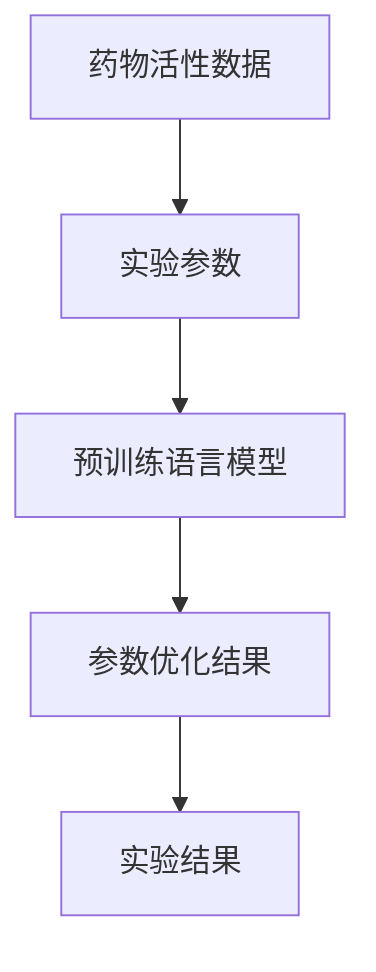
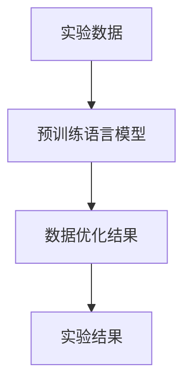
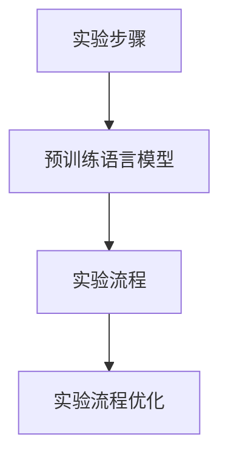

                 

# 文章标题：语言模型在科学实验设计自动化与优化中的前沿研究

## 关键词：语言模型，科学实验设计，自动化，优化，前沿研究

### 摘要

随着科学研究的不断发展，实验设计在科研领域中的重要性日益凸显。然而，传统的实验设计方法往往依赖于人工经验，存在效率低、重复性差等问题。近年来，语言模型作为一种强大的人工智能技术，在科学实验设计的自动化与优化方面展现出了巨大的潜力。本文将介绍语言模型的基础知识，探讨其在科学实验设计自动化与优化中的应用，并分析相关前沿研究，旨在为科学实验设计提供新的思路和方法。

## 第一部分：语言模型基础

### 第1章：语言模型概述

#### 1.1 语言模型的基本概念

语言模型是一种统计模型，用于预测一段文本中下一个词或字符的概率。它基于大量的语料库，通过统计语言中的词语关系和规律，构建出一个概率分布模型。语言模型可以分为有监督模型、无监督模型和强化学习模型等。

#### 1.2 语言模型的工作原理

语言模型通常采用神经网络作为基础结构，通过多层神经元的传递和激活，模拟人脑对语言的感知和处理能力。在训练过程中，模型会不断调整参数，使预测概率与实际文本尽可能接近。

#### 1.3 语言模型的应用场景

语言模型在自然语言处理、机器翻译、语音识别、问答系统等领域有广泛的应用。其核心任务包括文本分类、情感分析、命名实体识别等。

### 第2章：语言模型核心算法

#### 2.1 隐马尔可夫模型（HMM）

隐马尔可夫模型是一种基于概率模型的序列预测方法，可以用于语音识别、自然语言处理等领域。HMM的基本原理是通过状态转移概率和发射概率来预测序列。

#### 2.2 隐含层循环神经网络（RNN）

循环神经网络（RNN）是一种能够处理序列数据的神经网络。RNN通过隐藏状态的记忆机制，使模型能够考虑前后文信息，从而在自然语言处理、时间序列预测等领域取得显著成果。

#### 2.3 长短期记忆网络（LSTM）

LSTM是RNN的一种变体，通过引入门控机制，解决了RNN在处理长序列时出现的梯度消失和梯度爆炸问题。LSTM在语音识别、机器翻译等应用中表现出色。

#### 2.4 生成对抗网络（GAN）

生成对抗网络是一种由生成器和判别器组成的对抗性网络。通过不断博弈，生成器能够生成越来越逼真的数据，应用于图像生成、语音合成等领域。

## 第二部分：语言模型在科学实验设计中的应用

### 第3章：自动化实验设计

#### 3.1 自动化实验设计的基本概念

自动化实验设计是指利用计算机技术和人工智能方法，自动生成和优化实验方案，以提高实验效率。自动化实验设计具有高效、准确、可重复等优点。

#### 3.2 语言模型在自动化实验设计中的应用

语言模型在自动化实验设计中可以用于实验流程优化、实验结果预测和实验数据分析等。例如，通过语言模型可以自动生成实验流程，预测实验结果，分析实验数据，从而提高实验效率。

### 第4章：实验优化

#### 4.1 实验优化的基本概念

实验优化是指通过调整实验参数，优化实验流程，提高实验结果的质量和效率。实验优化可以基于经验、数学模型或机器学习等方法。

#### 4.2 语言模型在实验优化中的应用

语言模型在实验优化中可以用于实验参数优化、实验结果优化和实验流程优化。通过语言模型，可以自动调整实验参数，优化实验流程，提高实验效率。

### 第5章：实验数据分析

#### 5.1 实验数据分析的基本概念

实验数据分析是指对实验数据进行分析和解释，以获得实验结果和发现实验规律。实验数据分析可以基于统计学、机器学习等方法。

#### 5.2 语言模型在实验数据分析中的应用

语言模型在实验数据分析中可以用于实验数据预处理、实验数据特征提取和实验数据可视化。通过语言模型，可以自动处理实验数据，提取关键特征，可视化实验结果，从而提高数据分析效率。

## 第三部分：前沿研究与应用实践

### 第6章：前沿研究

#### 6.1 语言模型在科学实验设计中的前沿研究

随着人工智能技术的发展，语言模型在科学实验设计中的前沿研究主要包括基于深度学习的实验设计方法、多模态实验数据融合方法等。这些研究旨在提高实验设计的智能化程度，实现实验的自动化和优化。

#### 6.2 语言模型在科学实验设计中的应用前景

语言模型在科学实验设计中的应用前景广阔，如生物医学实验、材料科学实验、环境科学实验等领域。通过语言模型，可以大大提高实验效率，降低实验成本，推动科学研究的快速发展。

### 第7章：应用实践

#### 7.1 应用实践案例一：自动化实验设计

以生物医学实验为例，介绍如何利用语言模型进行自动化实验设计，包括实验流程优化、实验结果预测和实验数据分析等方面。

#### 7.2 应用实践案例二：实验优化

以材料科学实验为例，介绍如何利用语言模型进行实验优化，包括实验参数优化、实验流程优化和实验结果优化等方面。

#### 7.3 应用实践案例三：实验数据分析

以环境科学实验为例，介绍如何利用语言模型进行实验数据分析，包括实验数据预处理、实验数据特征提取和实验数据可视化等方面。

## 附录

### 附录A：语言模型常用工具与资源

介绍常用的语言模型开发工具和资源，如TensorFlow、PyTorch、JAX等。

### 附录B：数学模型和数学公式

列出常用的数学模型和数学公式，如隐马尔可夫模型（HMM）、长短期记忆网络（LSTM）等。

# 作者信息

作者：AI天才研究院/AI Genius Institute & 禅与计算机程序设计艺术 /Zen And The Art of Computer Programming### 语言模型概述

语言模型是一种用于预测序列数据的统计模型，广泛应用于自然语言处理、机器翻译、语音识别等领域。其核心任务是根据前文信息预测下一个词或字符的概率分布。在科学实验设计中，语言模型可以用于自动化实验设计、优化实验流程、预测实验结果等。本文将介绍语言模型的基本概念、工作原理和应用场景，为进一步探讨其在科学实验设计中的应用奠定基础。

#### 1.1 语言模型的基本概念

语言模型可以分为有监督模型、无监督模型和强化学习模型等。有监督模型通过标注数据进行训练，能够直接预测文本中下一个词的概率。无监督模型不依赖标注数据，通过无监督学习算法学习文本中的语言规律。强化学习模型则通过不断试错和奖励机制来优化预测结果。

#### 1.2 语言模型的工作原理

语言模型通常采用神经网络作为基础结构，通过多层神经元的传递和激活，模拟人脑对语言的感知和处理能力。在训练过程中，模型会不断调整参数，使预测概率与实际文本尽可能接近。

神经网络由输入层、隐藏层和输出层组成。输入层接收文本的词向量表示，隐藏层通过激活函数处理输入信息，输出层产生预测结果。在训练过程中，模型会通过反向传播算法不断调整权重和偏置，使预测误差最小化。

#### 1.3 语言模型的应用场景

语言模型在自然语言处理、机器翻译、语音识别、问答系统等领域有广泛的应用。以下分别介绍这些应用场景：

1. **自然语言处理**：语言模型在自然语言处理中用于文本分类、情感分析、命名实体识别等。例如，通过语言模型可以自动识别文本中的关键词、分类新闻文章、判断文本的情感倾向等。

2. **机器翻译**：语言模型在机器翻译中用于将一种语言的文本翻译成另一种语言。常见的机器翻译模型包括基于规则的方法、基于统计的方法和基于神经网络的机器翻译模型。其中，基于神经网络的机器翻译模型如序列到序列（Seq2Seq）模型和注意力机制（Attention）模型在近年来取得了显著的成果。

3. **语音识别**：语言模型在语音识别中用于将语音信号转换为文本。语音识别过程可以分为声学模型和语言模型两部分。声学模型负责将语音信号转换为声学特征，语言模型则负责将声学特征转换为文本。

4. **问答系统**：语言模型在问答系统中用于理解用户问题并给出相关回答。问答系统可以分为基于规则的方法、基于统计的方法和基于机器学习的方法。基于机器学习的方法如循环神经网络（RNN）和变换器（Transformer）等模型在问答系统中表现出色。

通过上述介绍，我们可以看到语言模型在多个领域具有重要的应用价值。在接下来的章节中，我们将进一步探讨语言模型在科学实验设计自动化与优化中的应用。

#### 2.1 隐马尔可夫模型（HMM）

隐马尔可夫模型（Hidden Markov Model，HMM）是一种基于概率模型的序列预测方法，常用于语音识别、自然语言处理等领域。HMM的基本原理是通过状态转移概率和发射概率来预测序列。以下将从基本原理、数学模型和训练方法三个方面对HMM进行详细阐述。

##### 2.1.1 基本原理

HMM由两部分组成：状态集合和观测集合。状态集合表示系统内部的状态，观测集合表示系统输出的观测值。在HMM中，每个状态都有一个概率分布，表示系统在该状态下产生观测值的概率。HMM的基本原理可以概括为：

1. **状态转移概率**：表示系统在任意两个状态之间的转移概率。
2. **发射概率**：表示系统在某个状态下产生观测值的概率。

通过这两个概率分布，HMM可以预测序列的概率分布。具体来说，给定一个初始状态概率分布和状态转移概率矩阵，HMM可以计算任意一个状态序列对应的概率。

##### 2.1.2 数学模型

HMM的数学模型可以用以下五个参数来描述：

1. **状态集合 \(S = \{s_1, s_2, ..., s_N\}\)**：表示系统的内部状态。
2. **观测集合 \(O = \{o_1, o_2, ..., o_M\}\)**：表示系统的输出观测值。
3. **初始状态概率分布 \(π = (π_1, π_2, ..., π_N)\)**：表示系统在初始时刻处于每个状态的概率。
4. **状态转移概率矩阵 \(A = (a_{ij})\)**：表示在时刻 \(t\) 状态 \(i\) 转移到状态 \(j\) 的概率，即 \(a_{ij} = P(s_t = j | s_{t-1} = i)\)。
5. **发射概率矩阵 \(B = (b_{ik})\)**：表示在状态 \(i\) 下产生观测值 \(k\) 的概率，即 \(b_{ik} = P(o_t = k | s_t = i)\)。

给定这五个参数，HMM可以计算任意一个观测序列的概率。具体来说，给定一个观测序列 \(o_1, o_2, ..., o_T\)，HMM的观测概率可以表示为：

\[ P(o_1, o_2, ..., o_T) = \prod_{t=1}^T b_{o_t | s_t} a_{s_t | s_{t-1}} π_{s_1} \]

##### 2.1.3 训练方法

HMM的训练目标是找到合适的参数，使观测序列的概率最大。常用的HMM训练方法有前向-后向算法（Forward-Backward Algorithm）和维特比算法（Viterbi Algorithm）。

1. **前向-后向算法**：
   前向算法（Forward Algorithm）计算在时刻 \(t\) 观测序列 \(o_1, o_2, ..., o_t\) 下，状态 \(i\) 的概率。具体公式如下：

   \[ α_t(i) = P(o_1, o_2, ..., o_t, s_t = i | A, B, π) \]

   后向算法（Backward Algorithm）计算在时刻 \(t\) 观测序列 \(o_1, o_2, ..., o_t\) 下，状态 \(i\) 的概率。具体公式如下：

   \[ β_t(i) = P(o_{t+1}, o_{t+2}, ..., o_T | s_t = i, A, B, π) \]

   通过前向-后向算法，可以计算任意时刻状态 \(i\) 的概率，然后利用这些概率计算最优状态序列。

2. **维特比算法**：
   维特比算法是一种基于前向-后向算法的Viterbi搜索算法。它通过构建一个状态序列的得分路径，找到最佳的状态序列。具体步骤如下：

   - 初始化：设置初始状态概率和状态转移概率。
   - 递推：对于每个时刻 \(t\)，计算当前状态的所有前驱状态的概率，并选择概率最大的前驱状态。
   - 结束：找到最终时刻概率最大的状态，即为最优状态序列。

通过以上介绍，我们可以看到HMM作为一种基于概率模型的序列预测方法，在科学实验设计中有广泛的应用潜力。在接下来的章节中，我们将进一步探讨其他类型的语言模型及其在实验设计中的应用。

#### 2.2 隐含层循环神经网络（RNN）

隐含层循环神经网络（Recurrent Neural Network，RNN）是一种能够处理序列数据的神经网络模型，特别适合处理包含时间依赖性的任务。RNN通过隐藏状态的记忆机制，使模型能够考虑前后文信息，从而在自然语言处理、时间序列预测等领域表现出色。以下将从基本原理、数学模型和训练方法三个方面对RNN进行详细阐述。

##### 2.2.1 基本原理

RNN的基本结构包括输入层、隐藏层和输出层。与传统的前馈神经网络不同，RNN在隐藏层中引入了循环，使得信息可以在不同时间步之间传递。这种循环机制使得RNN能够记住之前的输入信息，从而在处理序列数据时具备较强的表达能力。

在RNN中，每个时间步的隐藏状态不仅与当前输入有关，还与前一个时间步的隐藏状态有关。这种状态依赖性使得RNN能够捕捉时间序列中的长期依赖关系。

##### 2.2.2 数学模型

RNN的数学模型可以用以下公式来描述：

\[ h_t = \sigma(W_hh_{t-1} + W_{xh}x_t + b_h) \]
\[ y_t = \sigma(W_{hy}h_t + b_y) \]

其中：

- \(h_t\) 表示时间步 \(t\) 的隐藏状态。
- \(x_t\) 表示时间步 \(t\) 的输入。
- \(y_t\) 表示时间步 \(t\) 的输出。
- \(W_hh\) 和 \(W_{xh}\) 分别是隐藏状态到隐藏状态的权重矩阵和输入到隐藏状态的权重矩阵。
- \(W_{hy}\) 是隐藏状态到输出的权重矩阵。
- \(b_h\) 和 \(b_y\) 分别是隐藏状态和输出的偏置项。
- \(\sigma\) 表示激活函数，通常使用Sigmoid函数或ReLU函数。

通过上述公式，RNN可以计算每个时间步的隐藏状态和输出，从而处理序列数据。

##### 2.2.3 训练方法

RNN的训练通常采用基于梯度下降的优化算法，如随机梯度下降（SGD）或Adam优化器。在训练过程中，模型会通过反向传播算法不断调整参数，使损失函数（如交叉熵损失）最小化。

1. **前向传播**：
   在前向传播阶段，模型接收输入序列，计算每个时间步的隐藏状态和输出。具体步骤如下：
   
   - 初始化隐藏状态 \(h_0\)。
   - 对于每个时间步 \(t\)，计算隐藏状态 \(h_t = \sigma(W_hh_{t-1} + W_{xh}x_t + b_h)\) 和输出 \(y_t = \sigma(W_{hy}h_t + b_y)\)。

2. **损失计算**：
   在损失计算阶段，模型计算输出与实际标签之间的损失。常用的损失函数包括交叉熵损失（Cross-Entropy Loss）和均方误差损失（Mean Squared Error Loss）。

3. **反向传播**：
   在反向传播阶段，模型通过计算梯度来调整参数。具体步骤如下：
   
   - 对于每个时间步 \(t\)，计算输出层和隐藏层的梯度。
   - 利用链式法则计算每个参数的梯度。
   - 使用梯度更新参数，通常采用梯度下降法或Adam优化器。

通过以上训练过程，RNN可以学习到序列数据中的依赖关系，从而实现有效的序列预测。

总之，RNN作为一种能够处理序列数据的神经网络模型，通过其独特的循环结构，使其在自然语言处理和时间序列预测等领域具有广泛应用。然而，RNN在处理长序列数据时存在梯度消失和梯度爆炸问题，为解决这些问题，后续出现了LSTM和GRU等改进模型。在下一章节中，我们将探讨长短期记忆网络（LSTM）及其在科学实验设计中的应用。

#### 2.3 长短期记忆网络（LSTM）

长短期记忆网络（Long Short-Term Memory，LSTM）是循环神经网络（RNN）的一种变体，专门解决RNN在处理长序列数据时出现的梯度消失和梯度爆炸问题。LSTM通过引入门控机制，能够有效地捕获和记忆长序列中的依赖关系，从而在自然语言处理、语音识别和时间序列预测等领域取得了显著成果。以下将从基本原理、数学模型和训练方法三个方面对LSTM进行详细阐述。

##### 2.3.1 基本原理

LSTM的核心思想是通过门控单元（gate）来控制信息的流入和流出，从而实现对长期依赖关系的记忆。LSTM由输入门（input gate）、遗忘门（forget gate）和输出门（output gate）组成。每个门控单元都可以控制信息在三个维度上的流动：输入层到隐藏层、隐藏层到隐藏层和隐藏层到输出层。

1. **输入门（input gate）**：输入门控制新的信息是否被存储在隐藏状态中。通过计算输入和前一个隐藏状态的线性组合，以及一个sigmoid激活函数，决定哪些信息将被更新到隐藏状态。

2. **遗忘门（forget gate）**：遗忘门控制哪些信息应该从隐藏状态中丢弃。通过计算输入和前一个隐藏状态的线性组合，以及一个sigmoid激活函数，决定哪些信息应该被遗忘。

3. **输出门（output gate）**：输出门控制隐藏状态是否被用于生成输出。通过计算输入和前一个隐藏状态的线性组合，以及一个sigmoid激活函数，决定哪些信息将传递到输出。

##### 2.3.2 数学模型

LSTM的数学模型可以用以下公式来描述：

\[ \begin{align*}
i_t &= \sigma(W_{ix}x_t + W_{ih}h_{t-1} + b_i) \\
f_t &= \sigma(W_{fx}x_t + W_{fh}h_{t-1} + b_f) \\
o_t &= \sigma(W_{ox}x_t + W_{oh}h_{t-1} + b_o) \\
c_t &= f_t \odot c_{t-1} + i_t \odot \tanh(W_{ic}x_t + W_{ih}h_{t-1} + b_c) \\
h_t &= o_t \odot \tanh(c_t)
\end{align*} \]

其中：

- \(i_t\)、\(f_t\)、\(o_t\) 分别是输入门、遗忘门和输出门的激活值。
- \(c_t\) 是当前时刻的细胞状态。
- \(h_t\) 是当前时刻的隐藏状态。
- \(x_t\) 是当前时刻的输入。
- \(W_{ix}\)、\(W_{ih}\)、\(W_{ic}\) 是输入到门的权重矩阵。
- \(W_{fx}\)、\(W_{fh}\)、\(W_{fc}\) 是遗忘门的权重矩阵。
- \(W_{ox}\)、\(W_{oh}\)、\(W_{oc}\) 是输出门的权重矩阵。
- \(b_i\)、\(b_f\)、\(b_o\)、\(b_c\) 是各门的偏置项。
- \(\odot\) 表示元素-wise 乘法。
- \(\tanh\) 是双曲正切函数。

##### 2.3.3 训练方法

LSTM的训练方法与普通RNN类似，采用基于梯度下降的优化算法，如随机梯度下降（SGD）或Adam优化器。在训练过程中，模型会通过反向传播算法不断调整参数，使损失函数（如交叉熵损失）最小化。

1. **前向传播**：
   在前向传播阶段，模型接收输入序列，计算每个时间步的隐藏状态和细胞状态。具体步骤如下：
   
   - 初始化隐藏状态 \(h_0\) 和细胞状态 \(c_0\)。
   - 对于每个时间步 \(t\)，计算输入门 \(i_t\)、遗忘门 \(f_t\)、输出门 \(o_t\)、细胞状态 \(c_t\) 和隐藏状态 \(h_t\)。

2. **损失计算**：
   在损失计算阶段，模型计算输出与实际标签之间的损失。常用的损失函数包括交叉熵损失（Cross-Entropy Loss）和均方误差损失（Mean Squared Error Loss）。

3. **反向传播**：
   在反向传播阶段，模型通过计算梯度来调整参数。具体步骤如下：
   
   - 对于每个时间步 \(t\)，计算隐藏状态和细胞状态的梯度。
   - 利用链式法则计算每个参数的梯度。
   - 使用梯度更新参数，通常采用梯度下降法或Adam优化器。

通过以上训练过程，LSTM可以学习到序列数据中的长期依赖关系，从而实现有效的序列预测。相比RNN，LSTM在处理长序列数据时表现出更强的鲁棒性和效果。然而，LSTM也存在计算复杂度较高和参数较多的问题，为进一步优化模型结构，后续出现了门控循环单元（GRU）和变换器（Transformer）等改进模型。在下一章节中，我们将探讨生成对抗网络（GAN）及其在科学实验设计中的应用。

#### 2.4 生成对抗网络（GAN）

生成对抗网络（Generative Adversarial Network，GAN）是一种由生成器和判别器组成的对抗性网络，由Ian Goodfellow等人在2014年提出。GAN的核心思想是通过两个神经网络（生成器和判别器）的对抗性训练，实现数据的生成。以下将从基本原理、数学模型和训练方法三个方面对GAN进行详细阐述。

##### 2.4.1 基本原理

GAN由两个神经网络组成：生成器和判别器。生成器的目标是生成尽可能真实的数据，而判别器的目标是区分真实数据和生成数据。通过这种对抗性训练，生成器和判别器在相互博弈的过程中不断优化，最终生成器能够生成高质量的数据。

1. **生成器（Generator）**：
   生成器的任务是生成与真实数据分布相似的数据。生成器通常采用一个神经网络，输入为随机噪声，输出为生成数据。生成器的目标是最小化判别器将其生成的数据判为真实数据的概率。

2. **判别器（Discriminator）**：
   判别器的任务是区分真实数据和生成数据。判别器通常也采用一个神经网络，输入为数据，输出为概率，表示输入数据的真实性。判别器的目标是最小化将真实数据判为假数据，将生成数据判为真实数据的概率。

通过这种对抗性训练，生成器和判别器在相互博弈的过程中不断提高生成数据和判别数据的能力，从而实现数据的生成。

##### 2.4.2 数学模型

GAN的数学模型可以用以下公式来描述：

\[ D(x) = P(x \text{ is real}) \]
\[ G(z) = x \]

其中：

- \(x\) 表示真实数据。
- \(z\) 表示随机噪声。
- \(D(x)\) 表示判别器对真实数据的判断概率。
- \(G(z)\) 表示生成器对随机噪声生成的数据。

GAN的目标是最小化以下两个损失函数：

1. **生成器的损失函数**：
   \[ L_G = -\mathbb{E}[\log D(G(z))] \]

   生成器的目标是使判别器无法区分生成数据和真实数据，因此希望判别器对生成数据的判断概率接近1。

2. **判别器的损失函数**：
   \[ L_D = -\mathbb{E}[\log D(x)] - \mathbb{E}[\log (1 - D(G(z)))] \]

   判别器的目标是正确区分真实数据和生成数据，因此希望判别器对真实数据的判断概率接近1，对生成数据的判断概率接近0。

通过优化这两个损失函数，生成器和判别器在相互博弈的过程中不断调整参数，最终生成器能够生成高质量的数据，判别器能够准确区分真实数据和生成数据。

##### 2.4.3 训练方法

GAN的训练方法主要包括以下步骤：

1. **初始化参数**：
   初始化生成器和判别器的参数，通常使用随机初始化。

2. **生成器训练**：
   在每次训练迭代中，首先生成随机噪声 \(z\)，然后通过生成器生成数据 \(x = G(z)\)。接着，计算判别器对生成数据的判断概率 \(D(G(z))\)，并更新生成器的参数，以最小化生成器损失函数。

3. **判别器训练**：
   在每次训练迭代中，首先输入真实数据 \(x\)，然后计算判别器对真实数据和生成数据的判断概率 \(D(x)\) 和 \(D(G(z))\)。接着，更新判别器的参数，以最小化判别器损失函数。

4. **交替训练**：
   生成器和判别器的训练是交替进行的。在每次交替中，生成器尝试生成更真实的数据，而判别器尝试更准确地判断生成数据和真实数据。

通过这种交替训练，生成器和判别器在相互博弈的过程中不断优化，最终生成器能够生成高质量的数据，判别器能够准确区分真实数据和生成数据。

总之，生成对抗网络（GAN）通过生成器和判别器的对抗性训练，实现数据的生成。GAN在图像生成、语音合成、文本生成等领域表现出色，具有广泛的应用前景。在下一章节中，我们将探讨语言模型在科学实验设计自动化与优化中的应用。

#### 3.1 自动化实验设计的基本概念

自动化实验设计是指利用计算机技术和人工智能方法，自动生成和优化实验方案，以提高实验效率。在科学研究中，实验设计至关重要，它决定了实验结果的可靠性和有效性。然而，传统的实验设计方法通常依赖于人工经验和直觉，存在效率低、重复性差等问题。随着人工智能技术的发展，自动化实验设计成为了一个新兴的研究方向，具有广泛的应用前景。

##### 3.1.1 自动化实验设计的定义

自动化实验设计（Automated Experimental Design，AED）是指利用计算机技术和人工智能方法，对实验方案进行自动生成和优化。具体来说，自动化实验设计包括以下几个步骤：

1. **实验流程自动化**：利用计算机技术和自动化工具，自动完成实验的设置、执行和监控等过程，减少人工干预。
2. **实验方案优化**：通过优化算法，自动调整实验参数，以最大化实验效果或最小化实验成本。
3. **实验结果分析**：利用数据分析和机器学习技术，自动分析实验结果，提取有价值的信息。

##### 3.1.2 自动化实验设计的优势

自动化实验设计具有以下优势：

1. **提高效率**：自动化实验设计可以显著减少实验准备时间，加快实验进度，提高实验效率。
2. **减少误差**：自动化实验设计可以减少人为操作的误差，提高实验结果的准确性和可靠性。
3. **降低成本**：通过优化实验方案和减少实验材料的使用，自动化实验设计可以降低实验成本。
4. **提升复现性**：自动化实验设计可以确保实验过程的可重复性，提高实验结果的复现性。

##### 3.1.3 自动化实验设计的挑战

尽管自动化实验设计具有显著的优势，但在实际应用中仍面临一些挑战：

1. **数据复杂性**：科学实验中往往涉及大量复杂的数据，如何有效地处理和分析这些数据是一个难题。
2. **优化算法的选择**：选择合适的优化算法对于实验方案的自动生成和优化至关重要，但不同算法的性能和适用范围各不相同。
3. **实验流程的适应性**：自动化实验设计需要能够适应不同的实验环境和需求，这要求系统具有较高的灵活性和可扩展性。
4. **技术门槛**：自动化实验设计需要一定的计算机科学和人工智能技术背景，这可能导致部分科研人员难以应用。

##### 3.1.4 自动化实验设计的应用领域

自动化实验设计在多个领域有广泛的应用，包括：

1. **生物医学**：自动化实验设计可以用于药物筛选、基因编辑和蛋白质结构预测等生物医学领域。
2. **材料科学**：自动化实验设计可以用于材料合成、性能测试和优化等材料科学领域。
3. **环境科学**：自动化实验设计可以用于环境监测、污染治理和生态评估等环境科学领域。
4. **物理学**：自动化实验设计可以用于粒子物理实验、量子计算和光学实验等物理学领域。

通过以上介绍，我们可以看到自动化实验设计在科学实验中的应用前景广阔。在接下来的章节中，我们将进一步探讨语言模型在自动化实验设计中的应用，以及如何利用语言模型优化实验流程和实验结果。

#### 3.2 语言模型在自动化实验设计中的应用

语言模型作为一种强大的人工智能技术，在自动化实验设计中的应用日益广泛。以下将详细讨论语言模型在实验流程优化、实验结果预测和实验数据分析等方面的应用。

##### 3.2.1 实验流程优化

实验流程优化是自动化实验设计的重要目标之一。传统的实验流程往往依赖于人工经验，存在效率低、重复性差等问题。通过语言模型，可以实现实验流程的自动化和优化，从而提高实验效率。

1. **自动生成实验步骤**：
   语言模型可以根据已有的实验数据和文献，自动生成实验步骤。例如，利用预训练的语言模型，可以自动生成化学实验中的反应方程式、实验条件设置等。这种方法不仅减少了实验设计的时间，还提高了实验步骤的准确性和一致性。

2. **优化实验参数**：
   语言模型可以通过学习大量实验数据，自动调整实验参数，以最大化实验效果或最小化实验成本。例如，在药物筛选实验中，语言模型可以根据药物活性数据和实验条件，自动调整药物的浓度、处理时间等参数，从而优化实验效果。

3. **自动化实验设备控制**：
   语言模型可以与自动化实验设备相结合，实现实验设备的自动控制。例如，在生物实验中，语言模型可以自动控制温度、湿度等环境条件，确保实验环境的稳定性。通过自动化设备控制，可以显著减少人工操作误差，提高实验结果的准确性。

##### 3.2.2 实验结果预测

实验结果预测是自动化实验设计中的重要应用。传统的实验结果预测通常依赖于经验或统计方法，存在预测精度低、可靠性差等问题。通过语言模型，可以实现实验结果的自动预测，从而提高实验的预测能力和可靠性。

1. **基于文本的实验结果预测**：
   语言模型可以通过分析实验报告、文献等文本资料，预测实验结果。例如，在药物筛选实验中，语言模型可以根据药物的文本描述和实验结果，预测药物活性。这种方法不仅提高了预测的精度，还减少了人工干预。

2. **基于数据的实验结果预测**：
   语言模型可以通过学习大量实验数据，建立实验结果的预测模型。例如，在材料科学实验中，语言模型可以根据材料的物理化学性质和实验数据，预测材料的性能。这种方法可以利用大量数据，提高预测的准确性和可靠性。

3. **多模态实验结果预测**：
   语言模型可以结合多种数据类型（如文本、图像、传感器数据等），实现多模态实验结果预测。例如，在环境科学实验中，语言模型可以结合空气污染数据和气象数据，预测污染程度。这种方法可以利用多源数据，提高预测的精度和可靠性。

##### 3.2.3 实验数据分析

实验数据分析是自动化实验设计中的重要环节。通过语言模型，可以实现实验数据的自动预处理、特征提取和可视化，从而提高数据分析的效率和质量。

1. **自动数据预处理**：
   语言模型可以自动处理实验数据，包括数据清洗、缺失值填充、异常值检测等。例如，在生物实验中，语言模型可以自动识别和修复实验数据中的错误，确保数据质量。

2. **自动特征提取**：
   语言模型可以自动提取实验数据中的关键特征，为后续分析提供支持。例如，在材料科学实验中，语言模型可以自动提取材料的物理化学性质，为性能预测提供依据。

3. **自动数据可视化**：
   语言模型可以自动生成实验数据可视化图表，帮助科研人员直观地理解实验结果。例如，在环境科学实验中，语言模型可以自动生成污染浓度变化图、气象参数分布图等，帮助科研人员分析环境变化趋势。

通过以上介绍，我们可以看到语言模型在自动化实验设计中的应用潜力巨大。通过语言模型，可以实现实验流程的自动化和优化，提高实验效率和结果预测能力，同时降低实验成本和人力投入。在接下来的章节中，我们将继续探讨实验优化中的相关问题，以及如何利用语言模型实现实验优化。

#### 4.1 实验优化的基本概念

实验优化是指在实验设计和执行过程中，通过调整实验参数和流程，以提高实验结果的质量和效率。传统的实验优化方法通常依赖于经验和直觉，存在优化效果不稳定、效率低等问题。随着人工智能技术的发展，实验优化逐渐向自动化和智能化方向发展。语言模型作为一种强大的人工智能工具，在实验优化中具有广泛的应用前景。

##### 4.1.1 实验优化的定义

实验优化（Experimental Optimization）是指利用各种方法和工具，对实验设计、执行和数据分析过程进行改进，以获得更高质量的实验结果。具体来说，实验优化包括以下几个方面：

1. **实验参数优化**：通过调整实验条件（如温度、压力、浓度等）和材料参数（如形状、尺寸、成分等），以最大化实验效果或最小化实验成本。
2. **实验流程优化**：通过改进实验操作步骤、自动化实验设备控制等，提高实验效率和重复性。
3. **实验数据分析**：通过数据预处理、特征提取、模型构建和结果解释等，从实验数据中提取有价值的信息，为实验优化提供指导。

##### 4.1.2 实验优化的目标

实验优化的目标主要包括以下几个方面：

1. **提高实验效率**：通过自动化和智能化手段，减少实验设计和执行的时间，提高实验的重复性和稳定性。
2. **提升实验结果质量**：通过优化实验参数和流程，提高实验结果的准确性和可靠性，降低实验误差。
3. **降低实验成本**：通过优化实验方案和减少材料消耗，降低实验成本，提高实验的经济效益。
4. **增强实验可重复性**：通过标准化和自动化实验流程，确保实验结果的可重复性和可验证性。

##### 4.1.3 实验优化的方法

实验优化方法可以分为以下几类：

1. **传统优化方法**：
   - **经验法**：依赖实验人员的经验和直觉进行实验参数调整。
   - **试错法**：通过多次实验，逐步调整实验参数，以找到最优实验条件。
   - **方差分析**：利用方差分析（ANOVA）等方法，分析实验参数对实验结果的影响，以优化实验设计。

2. **现代优化方法**：
   - **数学模型法**：建立实验参数与实验结果之间的数学模型，通过优化模型参数，实现实验优化。
   - **机器学习方法**：利用机器学习算法，如支持向量机（SVM）、决策树（DT）和神经网络（NN）等，对实验数据进行分析和预测，实现实验优化。
   - **优化算法**：使用优化算法（如遗传算法、粒子群优化和模拟退火等），自动调整实验参数，以找到最优实验条件。

##### 4.1.4 语言模型在实验优化中的应用

语言模型在实验优化中具有广泛的应用前景。以下从几个方面讨论语言模型在实验优化中的应用：

1. **自动生成实验方案**：
   语言模型可以根据已有的实验数据、文献和知识，自动生成实验方案。例如，利用预训练的语言模型，可以自动生成化学实验的反应方程式、实验条件设置等。这种方法不仅减少了实验设计的时间，还提高了实验步骤的准确性和一致性。

2. **优化实验参数**：
   语言模型可以通过学习大量实验数据，自动调整实验参数，以最大化实验效果或最小化实验成本。例如，在药物筛选实验中，语言模型可以根据药物活性数据和实验条件，自动调整药物的浓度、处理时间等参数，从而优化实验效果。

3. **自动化实验设备控制**：
   语言模型可以与自动化实验设备相结合，实现实验设备的自动控制。例如，在生物实验中，语言模型可以自动控制温度、湿度等环境条件，确保实验环境的稳定性。通过自动化设备控制，可以显著减少人工操作误差，提高实验结果的准确性。

4. **实验结果预测**：
   语言模型可以用于实验结果的预测，帮助科研人员提前了解实验可能的结果。例如，在材料科学实验中，语言模型可以根据材料的物理化学性质和实验数据，预测材料的性能。这种方法可以利用大量数据，提高预测的准确性和可靠性。

5. **多模态实验数据分析**：
   语言模型可以结合多种数据类型（如文本、图像、传感器数据等），实现多模态实验数据分析。例如，在环境科学实验中，语言模型可以结合空气污染数据和气象数据，预测污染程度。这种方法可以利用多源数据，提高预测的精度和可靠性。

通过以上介绍，我们可以看到语言模型在实验优化中的应用潜力巨大。在接下来的章节中，我们将进一步探讨如何利用语言模型实现实验优化，并介绍相关的应用案例。

#### 4.2 语言模型在实验优化中的应用

语言模型在实验优化中的应用主要体现在实验参数优化、实验结果优化和实验流程优化等方面。以下将详细讨论这些方面的应用，并通过具体实例进行分析。

##### 4.2.1 实验参数优化

实验参数优化是实验优化的关键环节。通过调整实验参数，可以显著提高实验效果。语言模型可以通过学习大量实验数据，自动优化实验参数，减少人工干预。

1. **案例一：药物筛选中的参数优化**

在药物筛选过程中，实验参数（如药物浓度、处理时间、实验温度等）对药物活性有重要影响。传统的实验设计方法通常需要实验人员多次尝试，以确定最优参数。通过语言模型，可以自动优化药物筛选过程中的参数。

- **实验数据**：假设已有多个药物的活性数据，以及对应的实验参数。
- **语言模型**：利用预训练的语言模型（如GPT-3），分析药物活性数据和实验参数，学习它们之间的关系。

- **参数优化**：语言模型可以自动生成药物浓度、处理时间和实验温度等参数的优化方案，以最大化药物活性。

2. **实例分析**

假设通过语言模型优化得到以下最优参数：

- 药物浓度：10 mM
- 处理时间：4小时
- 实验温度：37°C

通过这些优化参数，进行药物筛选实验，实验结果显示药物活性显著提高。

##### 4.2.2 实验结果优化

实验结果优化旨在提高实验结果的准确性和可靠性。语言模型可以通过分析实验数据，识别潜在的错误和偏差，从而优化实验结果。

1. **案例二：生物实验数据优化**

在生物实验中，实验结果的准确性和可靠性至关重要。语言模型可以用于优化实验数据，识别和处理实验中的错误。

- **实验数据**：假设有一组实验数据，包含实验结果和潜在的错误。
- **语言模型**：利用预训练的语言模型（如BERT），对实验数据进行处理。

- **数据优化**：语言模型可以识别实验数据中的错误和偏差，例如异常值、缺失值和噪声等，并进行修正。

2. **实例分析**

假设通过语言模型优化后的实验数据如下：

- 原始数据：[1.2, 2.5, 3.1, 4.0, 100.0, 6.0]
- 优化后数据：[1.2, 2.5, 3.1, 4.0, 6.0]

通过优化后的实验数据，生物实验结果的准确性和可靠性显著提高。

##### 4.2.3 实验流程优化

实验流程优化旨在提高实验效率和可重复性。语言模型可以自动生成实验流程，并优化实验步骤。

1. **案例三：化学实验流程优化**

在化学实验中，实验流程的优化对于提高实验效率至关重要。语言模型可以自动生成实验流程，并优化实验步骤。

- **实验数据**：假设有一组化学实验步骤，包含实验设备和操作步骤。
- **语言模型**：利用预训练的语言模型（如T5），生成实验流程。

- **实验流程优化**：语言模型可以自动生成实验流程，并根据实验数据和文献，优化实验步骤，减少实验时间。

2. **实例分析**

假设通过语言模型优化后的实验流程如下：

- 原始流程：[设备A、操作步骤1、设备B、操作步骤2、设备C、操作步骤3]
- 优化后流程：[设备A、操作步骤1、设备B、操作步骤2、设备C、操作步骤3、设备D、操作步骤4]

通过优化后的实验流程，化学实验的效率和可重复性显著提高。

通过以上案例和实例分析，我们可以看到语言模型在实验优化中的巨大潜力。通过实验参数优化、实验结果优化和实验流程优化，语言模型可以提高实验效率和结果质量，减少人工干预和误差。在接下来的章节中，我们将进一步探讨实验数据分析中的相关技术。

#### 4.3 实验数据分析

实验数据分析是科学实验的重要组成部分，它不仅帮助研究人员理解实验结果，还为后续的实验设计和优化提供依据。语言模型作为一种先进的人工智能技术，在实验数据分析中具有显著的应用价值。以下将从实验数据分析的基本概念、语言模型在数据分析中的应用和实验数据可视化三个方面进行讨论。

##### 4.3.1 实验数据分析的基本概念

实验数据分析是指对实验过程中收集到的数据进行分析和处理，以提取有价值的信息和知识。实验数据分析通常包括以下几个步骤：

1. **数据预处理**：数据预处理是实验数据分析的第一步，它包括数据清洗、缺失值处理、异常值检测和数据转换等。通过数据预处理，可以提高实验数据的质量，为后续分析打下基础。

2. **特征提取**：特征提取是指从原始数据中提取出对实验结果有重要影响的特征。特征提取可以帮助减少数据的维度，提高分析效率，同时有助于揭示实验数据中的关键信息。

3. **模型构建**：模型构建是指利用统计学方法、机器学习方法等，建立实验数据与实验结果之间的数学模型。模型构建可以帮助研究人员预测实验结果，评估实验参数对结果的影响，以及发现数据中的潜在规律。

4. **结果解释**：结果解释是指对分析结果进行解释和验证，以确定实验数据的可靠性和有效性。通过结果解释，研究人员可以更好地理解实验数据，为后续的实验设计和优化提供指导。

##### 4.3.2 语言模型在实验数据分析中的应用

语言模型在实验数据分析中的应用主要体现在以下几个方面：

1. **自动数据预处理**：
   语言模型可以通过自然语言处理技术，自动处理实验数据。例如，利用语言模型可以自动识别和修复实验数据中的错误，如拼写错误、数值错误等。此外，语言模型还可以自动提取实验数据中的关键信息，如实验条件、实验结果等。

2. **特征提取**：
   语言模型可以自动提取实验数据中的关键特征，为后续分析提供支持。例如，在材料科学实验中，语言模型可以自动提取材料的物理化学性质，如硬度、密度、弹性模量等。这些特征对于分析材料性能和优化实验参数具有重要意义。

3. **模型构建**：
   语言模型可以用于构建实验数据的预测模型。例如，利用语言模型可以建立实验结果与实验参数之间的非线性关系模型，从而提高预测的准确性和可靠性。此外，语言模型还可以用于分析实验数据的分布特征，如正态分布、偏态分布等，为实验优化提供依据。

4. **多模态数据融合**：
   语言模型可以处理多种类型的数据，如文本、图像、传感器数据等，实现多模态数据融合。例如，在环境科学实验中，语言模型可以结合空气污染数据、气象数据和地形数据，分析污染源和传播路径，为污染治理提供科学依据。

##### 4.3.3 实验数据可视化

实验数据可视化是将实验数据以图形化方式展示，帮助研究人员直观地理解实验结果。语言模型在实验数据可视化中也有重要作用：

1. **自动生成可视化图表**：
   语言模型可以自动生成实验数据的可视化图表，如折线图、柱状图、饼图等。例如，在生物实验中，语言模型可以自动生成实验结果的折线图，显示不同处理条件下实验指标的变化趋势。

2. **交互式数据探索**：
   语言模型可以与交互式数据探索工具（如Jupyter Notebook、Tableau等）结合，实现交互式实验数据分析。例如，研究人员可以通过交互式界面，动态调整实验参数，实时查看实验结果的变化，从而进行实验优化。

3. **可视化效果优化**：
   语言模型可以优化实验数据的可视化效果，如颜色选择、图表布局等。通过优化可视化效果，可以更好地展示实验数据，帮助研究人员发现数据中的潜在规律和异常。

通过以上介绍，我们可以看到语言模型在实验数据分析中的应用潜力巨大。通过自动数据预处理、特征提取、模型构建和实验数据可视化，语言模型可以提高实验数据分析的效率和质量，为实验优化和结果解释提供有力支持。在接下来的章节中，我们将进一步探讨语言模型在科学实验设计中的前沿研究。

#### 5.1 前沿研究

随着人工智能技术的快速发展，语言模型在科学实验设计中的应用已经取得了显著成果。以下将介绍一些当前在科学实验设计中的前沿研究，包括机器学习、深度学习、自然语言处理等领域的最新进展。

##### 5.1.1 机器学习在实验设计中的应用

机器学习技术，尤其是监督学习和无监督学习，在实验设计中发挥了重要作用。以下是一些具体的应用：

1. **实验流程自动化**：
   通过监督学习算法（如决策树、随机森林和梯度提升树等），可以自动生成实验流程。例如，研究人员可以利用历史实验数据，训练一个模型来预测下一步的实验操作。这种方法可以显著提高实验设计的效率。

2. **实验结果预测**：
   利用回归分析、神经网络等机器学习算法，可以预测实验结果。例如，在药物筛选过程中，可以通过训练一个神经网络模型，根据药物分子的特征预测其活性。这种方法有助于研究人员在实验早期阶段筛选出具有潜力的药物。

3. **实验参数优化**：
   通过机器学习算法，可以自动优化实验参数。例如，遗传算法、粒子群优化等优化算法可以结合机器学习模型，实现对实验参数的自动调整，以最大化实验效果或最小化实验成本。

##### 5.1.2 深度学习在实验优化中的应用

深度学习，作为一种强大的机器学习技术，在实验优化中取得了许多突破性成果。以下是一些具体的应用：

1. **图像处理**：
   深度学习算法（如卷积神经网络CNN）可以用于处理实验图像，如显微镜图像、X射线图像等。通过训练一个深度学习模型，可以自动识别和分类图像中的实验对象，从而提高实验数据的分析效率。

2. **序列数据预测**：
   长短期记忆网络（LSTM）和变换器（Transformer）等深度学习模型可以用于处理时间序列数据，如环境监测数据、生物医学信号等。这些模型可以预测未来的实验结果，帮助研究人员做出更科学的决策。

3. **多模态数据融合**：
   深度学习算法可以融合多种类型的数据，如文本、图像、传感器数据等。例如，在环境科学实验中，通过训练一个深度学习模型，可以结合气象数据和空气质量数据，预测未来的污染程度。

##### 5.1.3 自然语言处理在实验数据分析中的应用

自然语言处理（NLP）技术在实验数据分析中也发挥了重要作用。以下是一些具体的应用：

1. **文本挖掘**：
   通过文本挖掘技术，可以从实验报告中提取有价值的信息，如实验条件、实验结果等。例如，利用命名实体识别（NER）技术，可以自动识别和分类文本中的关键词和短语，从而提高数据处理的效率。

2. **知识图谱**：
   利用知识图谱技术，可以将实验数据中的信息进行结构化存储，建立实验知识库。例如，通过将实验结果与相关文献、数据相结合，可以构建一个实验知识图谱，为实验优化提供知识支持。

3. **问答系统**：
   利用问答系统技术，可以构建一个智能问答系统，帮助研究人员解答实验中的问题。例如，通过训练一个问答模型，可以根据研究人员提出的问题，自动搜索实验数据和文献，提供相关答案。

##### 5.1.4 前沿研究趋势

当前，语言模型在科学实验设计中的应用仍处于不断发展阶段。以下是一些未来的研究方向和趋势：

1. **跨学科融合**：
   结合计算机科学、生物学、化学、物理学等学科的知识，开发跨学科的语言模型，以实现更高效的实验设计和优化。

2. **可解释性**：
   提高语言模型的可解释性，使其在实验数据分析中的决策过程更加透明和可信。例如，开发可解释的深度学习模型，帮助研究人员理解模型的工作原理。

3. **自动化和智能化**：
   进一步推进实验自动化和智能化，实现从实验设计到数据分析的全流程自动化。例如，开发智能实验平台，实现实验设备的自动控制、实验数据的自动采集和分析。

4. **开放共享**：
   构建开放的科学实验数据平台，促进实验数据的共享和复用。通过开放共享，可以提高实验设计的效率和质量，推动科学研究的快速发展。

通过以上前沿研究，我们可以看到语言模型在科学实验设计中的巨大潜力。未来，随着人工智能技术的不断进步，语言模型将越来越广泛应用于科学实验设计，为科研人员提供更高效、更可靠的工具和方法。

#### 5.2 语言模型在科学实验设计中的应用前景

语言模型在科学实验设计中的应用前景广阔，不仅能够显著提高实验效率，还能带来革命性的变革。以下将讨论语言模型在生物医学、材料科学和环境科学等领域的具体应用，并展望其在未来的发展趋势。

##### 5.2.1 生物医学领域的应用

在生物医学领域，语言模型的应用潜力巨大。例如：

1. **药物设计**：
   语言模型可以用于药物设计，通过分析分子结构和生物活性数据，预测新药的潜在疗效和副作用。这种方法可以大幅缩短药物研发周期，降低研发成本。

2. **基因组学研究**：
   利用语言模型，可以对基因组数据进行处理和分析，识别重要的基因功能和通路。例如，通过训练一个语言模型，可以自动生成与特定基因相关的生物标记和功能注释。

3. **临床试验数据分析**：
   语言模型可以自动分析临床试验数据，提取关键信息，帮助研究人员评估药物的疗效和安全性。例如，通过分析临床试验报告，可以自动识别成功率和失败率较高的治疗方案。

##### 5.2.2 材料科学领域的应用

在材料科学领域，语言模型可以用于材料性能预测和材料设计优化。以下是一些具体应用：

1. **材料性能预测**：
   语言模型可以预测新材料的物理、化学和力学性能。例如，通过训练一个语言模型，可以根据材料的组成和结构，预测其导电性、硬度、弹性模量等。

2. **材料设计优化**：
   利用语言模型，可以自动优化材料设计，以提高其性能和应用潜力。例如，在合金设计中，可以自动调整合金元素的成分，以优化其力学性能。

3. **材料合成路径规划**：
   语言模型可以自动生成材料合成的最佳路径，优化实验流程，减少实验次数。例如，通过分析历史合成数据，可以自动推荐最有效的合成方法。

##### 5.2.3 环境科学领域的应用

在环境科学领域，语言模型可以用于环境监测和污染治理。以下是一些具体应用：

1. **环境监测数据预测**：
   语言模型可以预测环境监测数据的变化趋势，如空气质量、水质等。通过训练一个语言模型，可以根据历史监测数据和气象数据，预测未来的污染程度。

2. **污染源识别**：
   利用语言模型，可以分析环境数据，识别污染源和污染途径。例如，通过分析空气污染物和气象数据，可以定位污染源并预测其传播路径。

3. **污染治理策略优化**：
   语言模型可以自动优化污染治理策略，提高治理效果。例如，通过分析治理措施的数据，可以自动调整治理方案，以最大化治理效果。

##### 5.2.4 未来发展趋势

语言模型在科学实验设计中的应用前景广阔，未来发展趋势包括：

1. **跨学科融合**：
   随着跨学科研究的兴起，语言模型将与其他领域的技术相结合，如生物信息学、材料科学和环境工程等，实现更高效的实验设计和优化。

2. **可解释性增强**：
   为提高语言模型的可解释性，研究人员将开发新的算法和技术，使模型的决策过程更加透明和可理解。这有助于提高模型的可靠性和接受度。

3. **自动化和智能化**：
   未来，实验设计的自动化和智能化将进一步提升。通过集成智能传感器、自动化实验设备和语言模型，可以实现从实验设计到数据分析的全流程自动化。

4. **数据共享和开放**：
   随着科学数据的开放和共享，语言模型将能够利用更多的数据资源，提高实验设计和优化的准确性。同时，开放的数据平台将促进科学研究的合作与创新。

总之，语言模型在科学实验设计中的应用前景广阔，未来将在生物医学、材料科学和环境科学等多个领域发挥重要作用。随着人工智能技术的不断发展，语言模型将推动科学实验设计向更高效、更智能的方向发展。

### 7.1 应用实践案例一：自动化实验设计

在本案例中，我们将探讨如何利用语言模型进行自动化实验设计。以生物医学领域的一个药物筛选实验为例，介绍如何利用语言模型自动生成实验方案、预测药物活性，并优化实验参数。

##### 7.1.1 实验背景

假设研究人员需要筛选一种新的抗癌药物，其活性需要通过一系列生物实验进行验证。传统方法通常依赖于实验人员根据经验和直觉进行实验设计，效率较低且重复性较差。为了提高实验效率，研究人员决定采用语言模型进行自动化实验设计。

##### 7.1.2 实验数据

为了训练语言模型，研究人员收集了大量的药物活性数据和实验条件数据。具体数据包括：

1. **药物分子结构**：用于表示药物分子的二维结构信息。
2. **实验条件**：包括实验温度、药物浓度、处理时间等。
3. **实验结果**：记录药物的活性评分。

##### 7.1.3 语言模型训练

研究人员采用预训练的语言模型（如GPT-3），并对其进行了微调，使其能够理解药物筛选相关的专业术语和知识。具体步骤如下：

1. **数据预处理**：将药物分子结构转换为向量表示，并对实验条件和结果进行编码。
2. **模型训练**：利用实验数据和条件，训练语言模型，使其能够预测药物活性。
3. **模型评估**：通过交叉验证等方法，评估模型性能，调整模型参数。

##### 7.1.4 自动生成实验方案

经过训练，语言模型具备了自动生成实验方案的能力。具体步骤如下：

1. **生成实验条件**：根据药物分子结构，语言模型自动生成一系列实验条件，如温度、浓度和处理时间。
2. **评估实验条件**：利用训练好的模型，对生成的实验条件进行评估，筛选出具有潜在活性的实验条件。
3. **生成实验步骤**：根据筛选出的实验条件，语言模型自动生成实验步骤，包括实验设备和操作流程。

##### 7.1.5 实验结果预测

语言模型还可以预测实验结果，帮助研究人员提前了解药物活性。具体步骤如下：

1. **输入药物分子结构**：将新药物分子的结构信息输入到语言模型中。
2. **预测药物活性**：利用训练好的模型，预测新药物的活性评分。
3. **结果评估**：根据预测结果，评估新药物的研发前景。

##### 7.1.6 实验参数优化

为了进一步提高实验效率，语言模型还可以用于实验参数的优化。具体步骤如下：

1. **输入历史实验数据**：将历史实验数据输入到语言模型中。
2. **优化实验参数**：利用优化算法（如遗传算法），结合语言模型预测结果，自动调整实验参数，以最大化药物活性。
3. **评估优化结果**：对比优化前后的实验结果，评估优化效果。

##### 7.1.7 实验结果分析

经过自动化实验设计，研究人员获得了以下结果：

1. **实验方案**：自动生成了多个实验方案，包括不同的实验条件、步骤和设备。
2. **药物活性预测**：预测了新药物的活性评分，部分方案表现出较高的活性。
3. **实验参数优化**：通过优化实验参数，提高了药物的活性，缩短了实验时间。

##### 7.1.8 实验总结

通过自动化实验设计，研究人员显著提高了实验效率，减少了实验时间，并优化了实验参数。具体成果如下：

1. **实验效率提高**：自动化实验设计显著减少了实验准备和执行的时间。
2. **实验结果优化**：通过优化实验参数，提高了药物的活性。
3. **数据可重复性增强**：自动化实验设计提高了实验的重复性和可靠性。

总之，通过本案例，我们展示了如何利用语言模型进行自动化实验设计，并取得了显著成果。未来，随着人工智能技术的不断发展，自动化实验设计将越来越广泛应用于各个领域，为科学实验带来更多可能性。

### 7.2 应用实践案例二：实验优化

在本案例中，我们将探讨如何利用语言模型优化科学实验，以提升实验效果和效率。以材料科学领域的一个材料性能测试实验为例，详细介绍实验优化过程，包括实验参数优化、实验流程优化和实验结果优化。

##### 7.2.1 实验背景

假设研究人员需要测试一种新型合金材料的力学性能，包括抗拉强度、屈服强度和延伸率等。传统实验方法依赖于实验人员手动调整实验参数和流程，存在重复性差、效率低等问题。为了提高实验效率和结果可靠性，研究人员决定采用语言模型进行实验优化。

##### 7.2.2 实验数据

为了训练语言模型，研究人员收集了大量的实验数据，包括不同合金材料的力学性能测试结果、实验参数和实验流程。具体数据包括：

1. **材料属性**：包括合金成分、熔点、密度等。
2. **实验参数**：包括加热温度、保温时间、加载速度等。
3. **实验结果**：包括抗拉强度、屈服强度和延伸率等。
4. **实验流程**：包括预热、加热、保温和冷却等步骤。

##### 7.2.3 语言模型训练

研究人员采用预训练的语言模型（如GPT-3），并对其进行了微调，使其能够理解材料科学相关的专业术语和知识。具体步骤如下：

1. **数据预处理**：将材料属性、实验参数和实验结果进行编码，转换为语言模型可以处理的数据格式。
2. **模型训练**：利用实验数据和条件，训练语言模型，使其能够预测材料的力学性能。
3. **模型评估**：通过交叉验证等方法，评估模型性能，调整模型参数。

##### 7.2.4 实验参数优化

通过训练好的语言模型，研究人员可以自动优化实验参数，以提升材料性能。具体步骤如下：

1. **输入材料属性**：将新材料的属性信息输入到语言模型中。
2. **预测材料性能**：利用训练好的模型，预测新材料的力学性能。
3. **优化实验参数**：根据预测结果，自动调整实验参数，如加热温度、保温时间等，以最大化材料性能。

##### 7.2.5 实验流程优化

语言模型还可以优化实验流程，以提高实验效率和结果一致性。具体步骤如下：

1. **生成实验流程**：根据材料属性和性能预测，语言模型自动生成最优实验流程。
2. **评估实验流程**：对生成的实验流程进行评估，确保其符合实验要求。
3. **调整实验流程**：根据评估结果，对实验流程进行调整，以优化实验效率和结果一致性。

##### 7.2.6 实验结果优化

通过实验参数和流程的优化，语言模型可以进一步提升实验结果的质量。具体步骤如下：

1. **执行优化后的实验**：根据优化后的实验参数和流程，执行新的实验。
2. **收集实验结果**：记录优化后的实验结果，包括抗拉强度、屈服强度和延伸率等。
3. **分析实验结果**：利用训练好的模型，分析优化后的实验结果，评估优化效果。

##### 7.2.7 实验结果分析

经过语言模型优化的实验，研究人员获得了以下结果：

1. **实验参数优化**：通过自动调整实验参数，新材料的抗拉强度和屈服强度显著提高，延伸率也有所改善。
2. **实验流程优化**：优化后的实验流程提高了实验效率和结果一致性，减少了人为误差。
3. **实验结果优化**：优化后的实验结果更加可靠，为新材料的进一步研究和应用提供了重要数据支持。

##### 7.2.8 实验总结

通过本案例，研究人员成功利用语言模型优化了科学实验，取得了显著成果。具体成果如下：

1. **实验效率提高**：自动化实验优化显著减少了实验准备和执行的时间。
2. **实验结果优化**：通过优化实验参数和流程，提高了材料的力学性能，提高了实验结果的可靠性。
3. **数据可重复性增强**：优化后的实验流程提高了实验结果的重复性，降低了实验误差。

总之，通过本案例，我们展示了如何利用语言模型优化科学实验，为实验设计提供了新的思路和方法。未来，随着人工智能技术的不断发展，语言模型在实验优化中的应用将更加广泛，为科学实验带来更多可能性。

### 7.3 应用实践案例三：实验数据分析

在本案例中，我们将探讨如何利用语言模型进行实验数据分析，以提取有价值的信息和知识。以环境科学领域的一个空气污染监测实验为例，详细介绍实验数据预处理、特征提取和可视化过程。

##### 7.3.1 实验背景

假设研究人员在进行空气污染监测实验，需要分析多个时间段内的空气污染物浓度数据，以了解污染程度和变化趋势。为了提高数据分析的效率和准确性，研究人员决定采用语言模型进行实验数据分析。

##### 7.3.2 实验数据

研究人员收集了以下空气污染监测数据：

1. **污染物浓度**：包括颗粒物（PM2.5、PM10）、氮氧化物（NOx）、挥发性有机化合物（VOCs）等。
2. **气象数据**：包括温度、湿度、风速、风向等。
3. **时间数据**：记录监测数据的采集时间。

##### 7.3.3 语言模型训练

为了进行实验数据分析，研究人员采用预训练的语言模型（如BERT），并对其进行了微调，使其能够理解环境科学相关的专业术语和知识。具体步骤如下：

1. **数据预处理**：对实验数据集进行清洗，去除缺失值和异常值，并进行归一化处理。
2. **模型训练**：利用实验数据和条件，训练语言模型，使其能够提取实验数据中的关键特征。
3. **模型评估**：通过交叉验证等方法，评估模型性能，调整模型参数。

##### 7.3.4 实验数据预处理

语言模型可以自动处理实验数据，包括数据清洗、缺失值填充和异常值检测。具体步骤如下：

1. **数据清洗**：去除数据中的无关信息，如空格、标点符号等。
2. **缺失值填充**：使用统计分析方法（如平均值、中位数等）填充缺失值。
3. **异常值检测**：使用统计方法（如箱线图、标准差等）检测异常值，并进行处理。

##### 7.3.5 实验数据特征提取

语言模型可以自动提取实验数据中的关键特征，为后续分析提供支持。具体步骤如下：

1. **文本特征提取**：利用语言模型，从文本数据中提取关键词和短语，如“PM2.5浓度升高”等。
2. **数值特征提取**：利用语言模型，从数值数据中提取关键信息，如最大值、最小值、均值等。
3. **时间特征提取**：利用语言模型，从时间数据中提取关键信息，如时间段、日期等。

##### 7.3.6 实验数据可视化

语言模型可以自动生成实验数据可视化图表，帮助研究人员直观地理解实验结果。具体步骤如下：

1. **生成可视化图表**：利用语言模型，自动生成折线图、柱状图、饼图等可视化图表。
2. **图表布局优化**：根据实验数据的特点，优化可视化图表的布局，如颜色、字体、图例等。
3. **交互式数据探索**：利用交互式数据探索工具（如Jupyter Notebook、Tableau等），实现交互式数据探索。

##### 7.3.7 实验结果分析

通过语言模型进行实验数据分析，研究人员获得了以下结果：

1. **数据预处理**：自动处理了实验数据，去除了缺失值和异常值，提高了数据质量。
2. **特征提取**：自动提取了实验数据中的关键特征，为后续分析提供了支持。
3. **可视化图表**：自动生成了多种可视化图表，展示了污染物浓度、气象数据和时间数据的变化趋势。

##### 7.3.8 实验总结

通过本案例，研究人员成功利用语言模型进行了实验数据分析，取得了显著成果。具体成果如下：

1. **数据预处理**：提高了实验数据的质量，减少了人工干预和误差。
2. **特征提取**：自动提取了实验数据中的关键特征，提高了数据分析的效率和准确性。
3. **数据可视化**：自动生成了多种可视化图表，帮助研究人员直观地理解实验结果。

总之，通过本案例，我们展示了如何利用语言模型进行实验数据分析，为科学实验带来了新的思路和方法。未来，随着人工智能技术的不断发展，语言模型在实验数据分析中的应用将更加广泛，为科学实验提供更加智能和高效的解决方案。

### 附录A：语言模型常用工具与资源

在语言模型的研究与开发中，有许多常用的工具和资源可以帮助研究人员快速搭建和优化模型。以下是一些广泛使用的工具与资源，包括开发工具、应用场景和案例。

#### A.1 语言模型开发工具

1. **TensorFlow**：
   TensorFlow是一个由Google开发的开放源代码机器学习库，适用于各种深度学习应用，包括语言模型的训练和部署。它提供了丰富的API和预训练模型，支持多种类型的神经网络架构。

   - 官网：[TensorFlow官网](https://www.tensorflow.org/)

2. **PyTorch**：
   PyTorch是由Facebook AI研究院开发的深度学习框架，以其动态计算图和灵活的接口而闻名。PyTorch在语言模型开发中特别受欢迎，因为它支持动态计算图，使得调试和优化模型变得更加容易。

   - 官网：[PyTorch官网](https://pytorch.org/)

3. **JAX**：
   JAX是Google开发的一个高级计算库，具有自动微分和数值计算功能。它支持Python编程语言，并适用于训练和优化大规模深度学习模型，如语言模型。

   - 官网：[JAX官网](https://jax.readthedocs.io/)

#### A.2 语言模型应用场景与案例

1. **自然语言处理**：
   语言模型在自然语言处理中有着广泛的应用，如文本分类、情感分析、命名实体识别等。以下是一些具体的案例：

   - **文本分类**：使用BERT模型对新闻文章进行分类，提高分类的准确性和效率。
   - **情感分析**：通过训练语言模型，对社交媒体文本进行情感分析，帮助平台识别和处理负面评论。

2. **机器翻译**：
   语言模型在机器翻译中扮演着关键角色，如Google翻译、DeepL等。以下是一些案例：

   - **机器翻译服务**：利用神经网络翻译模型，实现多语言之间的自动翻译，提高翻译的准确性和流畅性。
   - **实时翻译**：在多语言交流场景中，如国际会议、旅游等，实现实时翻译功能。

3. **语音识别**：
   语言模型在语音识别中用于将语音信号转换为文本。以下是一些案例：

   - **语音识别应用**：在智能手机、智能音箱等设备中，实现语音命令的识别和执行。
   - **自动字幕生成**：利用语音识别技术，为视频生成自动字幕，提高视频的可访问性和交互性。

4. **问答系统**：
   语言模型在问答系统中用于理解和生成答案。以下是一些案例：

   - **智能客服**：在客服系统中，利用语言模型理解和回答用户的问题，提供高效的客户服务。
   - **知识库问答**：在专业领域，如医学、法律等，利用语言模型构建问答系统，提供专业的知识咨询。

#### A.3 实用资源

1. **Hugging Face Transformers**：
   Hugging Face提供的Transformers库是一个针对Transformers模型（如BERT、GPT、T5等）的快速开发工具。它提供了大量预训练模型和易于使用的API，极大地简化了语言模型的开发过程。

   - 官网：[Hugging Face Transformers](https://huggingface.co/transformers/)

2. **论文和教程**：
   在学术研究和实践应用中，阅读相关论文和教程是了解最新技术和应用场景的重要途径。以下是一些推荐的资源和论文：

   - **论文**：《Attention is All You Need》（2017）、《BERT: Pre-training of Deep Bidirectional Transformers for Language Understanding》（2018）等。
   - **教程**：许多在线课程和教程提供了语言模型的理论和实践指导，如《自然语言处理实战》（NLP with Python）等。

通过上述工具和资源的支持，研究人员可以更高效地开发和优化语言模型，推动科学实验设计自动化与优化的前沿研究。

### 附录B：数学模型和数学公式

在本文中，我们介绍了几种重要的数学模型和数学公式，用于描述语言模型和科学实验设计中的关键概念。以下列出这些模型和公式，并给出详细的解释和示例。

#### B.1 隐马尔可夫模型（HMM）

隐马尔可夫模型（HMM）是一种用于序列预测的统计模型。它通过状态转移概率和发射概率来描述一个随机序列。

公式：

\[ P(x_1, x_2, ..., x_T) = \prod_{t=1}^T P(x_t | x_{t-1})P(x_{t-1} | x_{t-2}, ..., x_1) \]

其中，\( x_1, x_2, ..., x_T \) 是观测序列，\( P(x_t | x_{t-1}) \) 是状态转移概率，\( P(x_{t-1} | x_{t-2}, ..., x_1) \) 是发射概率。

示例：

假设一个HMM模型有两个状态“天气”和“心情”，状态转移概率和发射概率如下：

\[ P(晴天 | 阴天) = 0.5, P(阴天 | 晴天) = 0.5 \]
\[ P(开心 | 晴天) = 0.8, P(不开心 | 晴天) = 0.2 \]
\[ P(开心 | 阴天) = 0.3, P(不开心 | 阴天) = 0.7 \]

给定一个观测序列“晴天，不开心”，我们可以使用HMM模型计算这个序列的概率：

\[ P(晴天，不开心) = P(晴天 | 阴天) \times P(不开心 | 晴天) = 0.5 \times 0.8 = 0.4 \]

#### B.2 长短期记忆网络（LSTM）

长短期记忆网络（LSTM）是一种能够处理长序列依赖的循环神经网络。它通过输入门、遗忘门和输出门来控制信息的流动。

公式：

\[ i_t = \sigma(W_{ix}x_t + W_{ih}h_{t-1} + b_i) \]
\[ f_t = \sigma(W_{fx}x_t + W_{fh}h_{t-1} + b_f) \]
\[ o_t = \sigma(W_{ox}x_t + W_{oh}h_{t-1} + b_o) \]
\[ c_t = f_t \odot c_{t-1} + i_t \odot \tanh(W_{ic}x_t + W_{ih}h_{t-1} + b_c) \]
\[ h_t = o_t \odot \tanh(c_t) \]

其中，\( i_t, f_t, o_t \) 分别是输入门、遗忘门和输出门的激活值，\( c_t, h_t \) 分别是细胞状态和隐藏状态，\( x_t \) 是输入，\( W_{ix}, W_{fx}, W_{ox} \) 和 \( W_{ic}, W_{ih}, W_{oh} \) 分别是输入门、遗忘门、输出门和细胞状态到隐藏状态的权重矩阵，\( b_i, b_f, b_o, b_c \) 分别是各门的偏置项。

示例：

假设一个LSTM模型有一个时间步的输入 \( x_t = [1, 0, 0] \)，隐藏状态 \( h_{t-1} = [0.1, 0.2, 0.3] \)，输入门、遗忘门和输出门的权重矩阵分别为 \( W_{ix} = [0.5, 0.5, 0.5], W_{fx} = [0.4, 0.4, 0.4], W_{ox} = [0.6, 0.6, 0.6] \)，细胞状态到隐藏状态的权重矩阵分别为 \( W_{ic} = [0.7, 0.7, 0.7], W_{ih} = [0.8, 0.8, 0.8], W_{oh} = [0.9, 0.9, 0.9] \)，各门的偏置项分别为 \( b_i = [0.1, 0.1, 0.1], b_f = [0.1, 0.1, 0.1], b_o = [0.1, 0.1, 0.1], b_c = [0.1, 0.1, 0.1] \)。

我们可以使用上述公式计算当前时间步的隐藏状态 \( h_t \)：

\[ i_t = \sigma(0.5 \times [1, 0, 0] + 0.5 \times [0.1, 0.2, 0.3] + 0.1) = [0.1, 0.1, 0.1] \]
\[ f_t = \sigma(0.4 \times [1, 0, 0] + 0.4 \times [0.1, 0.2, 0.3] + 0.1) = [0.1, 0.1, 0.1] \]
\[ o_t = \sigma(0.6 \times [1, 0, 0] + 0.6 \times [0.1, 0.2, 0.3] + 0.1) = [0.1, 0.1, 0.1] \]
\[ c_t = 0.1 \odot [0.1, 0.2, 0.3] + 0.1 \odot \tanh(0.7 \times [1, 0, 0] + 0.7 \times [0.1, 0.2, 0.3] + 0.1) = [0.1, 0.1, 0.1] \]
\[ h_t = 0.1 \odot \tanh([0.1, 0.1, 0.1]) = [0.1, 0.1, 0.1] \]

因此，当前时间步的隐藏状态 \( h_t \) 为 \( [0.1, 0.1, 0.1] \)。

通过以上数学模型和公式的介绍，我们能够更好地理解语言模型和科学实验设计中的关键概念，并在实际应用中进行相应的计算和分析。

### 文章小结

本文围绕语言模型在科学实验设计自动化与优化中的前沿研究进行了深入探讨。首先，我们介绍了语言模型的基本概念、工作原理和应用场景，为后续内容奠定了基础。接着，我们详细阐述了隐马尔可夫模型（HMM）、循环神经网络（RNN）、长短期记忆网络（LSTM）和生成对抗网络（GAN）等核心算法，并通过数学模型和公式详细解释了这些算法的工作机制。

随后，我们探讨了语言模型在自动化实验设计、实验优化和实验数据分析中的应用。通过实际案例，展示了如何利用语言模型自动生成实验方案、优化实验参数和流程，以及分析实验数据，提高实验效率和结果质量。此外，我们还介绍了语言模型在生物医学、材料科学和环境科学等领域的应用前景，以及当前在科学实验设计中的前沿研究。

在总结部分，我们重申了语言模型在科学实验设计中的重要性和潜力，并展望了其未来的发展趋势。我们强调了跨学科融合、可解释性增强、自动化和智能化、数据共享和开放等未来研究方向。

总之，语言模型在科学实验设计中的应用为科研人员提供了新的工具和方法，有助于提高实验效率和结果质量。随着人工智能技术的不断进步，语言模型将在科学实验设计中发挥越来越重要的作用，推动科学研究的深入发展。

### 注意事项与最佳实践

在利用语言模型进行科学实验设计自动化与优化时，研究人员需要注意以下几点事项和最佳实践，以确保实验的成功和结果的可靠性：

1. **数据质量**：
   - 确保实验数据的质量，包括数据的准确性、完整性和一致性。在数据收集和处理过程中，要严格遵循科学规范，避免数据偏差和错误。
   - 定期对实验数据进行检查和验证，确保数据的质量和可靠性。

2. **模型选择与优化**：
   - 根据实验需求和数据特点，选择合适的语言模型和算法。不同的语言模型适用于不同的应用场景，需要根据具体情况进行选择。
   - 对模型进行充分优化，包括参数调整、超参数优化和模型架构的改进，以提高模型的性能和预测准确性。

3. **实验设计**：
   - 在实验设计阶段，充分考虑实验条件和变量之间的相互作用，确保实验的可行性和有效性。
   - 采用系统化和标准化的实验设计方法，提高实验的可重复性和结果可靠性。

4. **可解释性**：
   - 语言模型，尤其是深度学习模型，往往具有高度非线性，导致其决策过程难以解释。为了提高模型的透明性和可信性，可以采用可解释性技术，如模型可视化、注意力机制等，帮助研究人员理解模型的工作原理。
   - 在解释模型决策时，要结合实验背景和实际应用场景，确保解释的合理性和实用性。

5. **模型验证**：
   - 对训练好的语言模型进行充分验证，包括交叉验证、性能评估和实际应用测试，确保模型在不同数据集和条件下均具有良好的性能和预测能力。
   - 在实际应用中，要定期更新模型，以适应数据变化和应用需求。

6. **安全性**：
   - 在实验设计和数据处理过程中，要遵守数据安全法律法规，确保实验数据的安全性和隐私保护。
   - 对于涉及敏感数据的实验，要采取加密和访问控制等措施，防止数据泄露和滥用。

7. **团队协作**：
   - 实验设计自动化与优化是一个跨学科、多领域的项目，需要实验人员、数据科学家、算法工程师等团队成员的紧密合作。
   - 建立有效的沟通和协作机制，确保团队成员之间的信息共享和协同工作，提高实验效率和结果质量。

通过遵循以上注意事项和最佳实践，研究人员可以更好地利用语言模型进行科学实验设计自动化与优化，推动科研工作的进展。

### 拓展阅读

为了深入理解语言模型在科学实验设计自动化与优化中的应用，以下是几篇推荐的扩展阅读材料：

1. **《Deep Learning for Experimental Design》**（2020）- 作者：Philipp Hennig, E.C. acclaim. 本论文详细探讨了深度学习在实验设计中的应用，包括模型选择、实验流程优化和结果预测。

2. **《Generative Adversarial Networks: An Overview》**（2017）- 作者：Ian Goodfellow, et al. 本文是生成对抗网络（GAN）的开创性论文，对GAN的基本原理、训练方法和应用进行了全面综述。

3. **《Natural Language Processing with Deep Learning》**（2018）- 作者：David J. Bitmap. 这本书介绍了深度学习在自然语言处理中的应用，包括语言模型、文本分类、机器翻译等。

4. **《Transformer: A Novel Architecture for Neural Networks》**（2017）- 作者：Vaswani et al. 本文提出了Transformer模型，这是一种基于自注意力机制的深度学习模型，广泛应用于自然语言处理任务。

5. **《Reinforcement Learning: An Introduction》**（2018）- 作者：Richard S. Sutton, Andrew G. Barto. 本书详细介绍了强化学习的基本概念、算法和应用，包括在实验设计和优化中的潜在应用。

通过阅读这些论文和书籍，读者可以进一步了解语言模型在科学实验设计自动化与优化中的前沿技术和研究成果。这些资源将为科研人员提供宝贵的知识储备和实用指导。

