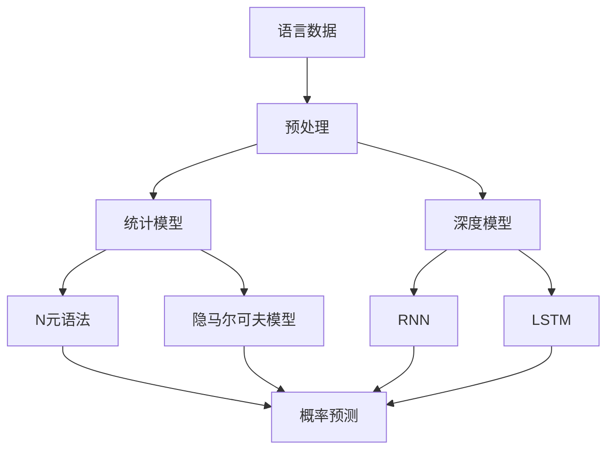
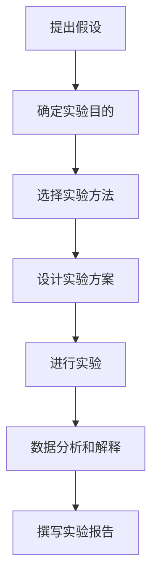

                 

### 文章标题

《语言模型在科学实验设计自动化中的应用》

### 关键词

语言模型、科学实验设计、自动化、人工智能、算法原理、伪代码、数学模型

### 摘要

本文探讨了语言模型在科学实验设计自动化中的应用。通过分析语言模型的基本原理、科学实验设计的基本流程及其在自动化实验设计中的作用，本文介绍了如何利用语言模型提高实验设计的效率和质量。文章详细讲解了实验设计自动化的方法、工具及实际应用案例，并给出了相关伪代码和数学模型。最后，文章总结了最佳实践、注意事项和未来展望，为相关领域的研究和应用提供了有益的参考。

---

### 目录

1. 引言...5
2. 语言模型基础...10
3. 科学实验设计概述...15
4. 语言模型在实验设计中的应用...20
5. 实验设计自动化方法...25
6. 实验设计自动化工具...30
7. 实际应用案例...35
8. 总结与展望...40

---

### 引言

科学实验设计是科学研究的重要环节，其目标是通过系统的实验操作来验证或推翻某个科学假设。然而，科学实验设计往往涉及到大量的参数调整、复杂的数据处理和繁琐的实验流程，这使得实验设计成为一个费时费力的过程。随着人工智能和机器学习技术的不断发展，利用这些技术来自动化科学实验设计成为一种可能。其中，语言模型作为一种强大的自然语言处理工具，在实验设计自动化中具有广泛的应用前景。

语言模型是一种能够理解和生成自然语言的人工智能系统。它通过对大量语言数据进行训练，学习到语言的语法、语义和语境等特征，从而能够对输入的文本进行理解和生成。在科学实验设计中，语言模型可以用于自动生成实验方案、优化实验参数、分析实验结果等。例如，语言模型可以帮助研究者快速生成实验计划，减少人为错误和提高实验效率；同时，它还可以对实验数据进行深度分析，提供有价值的信息和洞见。

本文将系统地探讨语言模型在科学实验设计自动化中的应用。首先，我们将介绍语言模型的基本原理和常见类型，以便读者了解其基础概念。然后，我们将概述科学实验设计的基本流程和挑战，以便读者了解语言模型在其中的作用。接下来，我们将详细讨论语言模型在实验设计中的应用，包括如何提高实验设计的效率和质量。此外，我们还将介绍实验设计自动化的方法和工具，以及如何利用语言模型实现自动化实验设计。最后，我们将通过实际应用案例来展示语言模型在实验设计自动化中的具体应用，并总结本文的主要发现和未来展望。

通过本文的讨论，我们希望能够为研究人员和工程师提供有价值的参考，帮助他们更好地利用语言模型来实现科学实验设计的自动化，从而提高研究效率和成果质量。

### 语言模型基础

语言模型（Language Model，LM）是一种人工智能模型，主要用于理解和生成自然语言。它通过学习大量的文本数据，掌握语言的语法、语义和语境，从而实现文本的自动理解和生成。语言模型在自然语言处理（Natural Language Processing，NLP）领域具有广泛的应用，如机器翻译、文本摘要、问答系统、语音识别等。

#### 语言模型的基本原理

语言模型的核心思想是概率论。它通过统计文本数据中的单词或短语的频率，来预测下一个单词或短语的概率。这种预测是基于统计语言模型（Statistical Language Model，SLM）的方法。常见的统计语言模型有N元语法（N-gram Model）和隐马尔可夫模型（Hidden Markov Model，HMM）。

N元语法是一种基于相邻单词序列的模型。它通过统计前N个单词来确定下一个单词的概率。例如，在二元语法中，下一个单词的概率取决于前两个单词。N元语法的优点是简单易实现，但在长文本中效果较差，因为它忽略了单词之间的依赖关系。

隐马尔可夫模型是一种基于状态转移概率的模型。它将语言视为一个隐藏的马尔可夫过程，其中每个状态对应于一个单词。隐马尔可夫模型能够更好地捕捉单词之间的依赖关系，因此在处理长文本时具有较好的性能。

除了统计语言模型，近年来，深度学习模型在语言模型领域也取得了显著的进展。其中，循环神经网络（Recurrent Neural Network，RNN）和其变种长短期记忆网络（Long Short-Term Memory，LSTM）在语言模型任务中表现出色。RNN通过递归结构来捕捉序列数据中的长期依赖关系，而LSTM通过引入门控机制来缓解梯度消失问题，从而更好地处理长序列数据。

#### 语言模型的应用

语言模型在自然语言处理领域有广泛的应用。以下是一些典型的应用场景：

1. **机器翻译**：语言模型可以用于将一种语言的文本翻译成另一种语言。通过学习源语言和目标语言的文本数据，语言模型能够预测目标语言中的下一个单词或短语，从而实现文本的自动翻译。

2. **文本摘要**：语言模型可以自动生成文本的摘要，帮助用户快速了解文本的主要内容。通过学习大量的文本数据，语言模型能够提取关键信息，并将其生成简洁的摘要。

3. **问答系统**：语言模型可以用于构建问答系统，回答用户提出的问题。通过理解用户的问题和知识库中的文本数据，语言模型能够生成准确的回答。

4. **语音识别**：语言模型可以与语音识别系统结合，将语音信号转换为文本。通过学习语音数据和文本数据，语言模型能够识别语音中的单词和短语，从而实现语音到文本的转换。

#### 语言模型类型和架构

语言模型根据其学习方式可以分为两种类型：基于规则的模型和基于统计的模型。

基于规则的模型通过预设的规则来生成文本。这种模型的优点是简单易实现，但在处理复杂语言时效果较差。常见的基于规则的语言模型有词汇模型（Lexical Model）和转换模型（Transformation Model）。

词汇模型通过将文本分解为单词或短语，并使用预设的规则来生成文本。例如，在词汇模型中，单词“apple”可以转换为“苹果”。

转换模型通过将一个文本序列转换为另一个文本序列来生成文本。这种模型通常用于文本摘要和机器翻译任务。

基于统计的模型通过学习大量的文本数据来生成文本。这种模型的优点是能够自适应地学习语言特征，因此在处理复杂语言时具有较好的性能。常见的基于统计的语言模型有N元语法和隐马尔可夫模型。

除了上述模型，近年来，深度学习模型在语言模型领域也取得了显著的进展。其中，循环神经网络（RNN）和其变种长短期记忆网络（LSTM）在语言模型任务中表现出色。RNN通过递归结构来捕捉序列数据中的长期依赖关系，而LSTM通过引入门控机制来缓解梯度消失问题，从而更好地处理长序列数据。

#### Mermaid流程图：语言模型核心概念与联系

为了更好地理解语言模型的核心概念和联系，我们可以使用Mermaid流程图来展示其关键组成部分。以下是一个示例：



在这个流程图中，语言数据经过预处理后，可以分别被统计模型和深度模型处理。统计模型包括N元语法和隐马尔可夫模型，而深度模型包括RNN和LSTM。这些模型最终都用于生成概率预测，即预测下一个单词或短语的概率。

#### 伪代码：核心算法原理展示

为了更清晰地展示语言模型的核心算法原理，我们可以使用伪代码来描述。以下是一个简单的N元语法的伪代码示例：

```plaintext
输入：文本序列X = [x1, x2, ..., xn]
输出：概率分布P(xn+1 | xn-1, xn-2, ..., xn-N)

for i from 1 to n-N do:
    count[i] = 1  // 初始化计数器
end for

for i from 1 to n-N do:
    for j from 1 to N do:
        if X[i:i+N] exists in the corpus:
            count[i+j-N] += 1
        else:
            count[i+j-N] = 0
    end for
end for

for each word w in V (the vocabulary):
    P(w | X[i-1:i-N]) = count[i-1] / (sum of count[i-1:i+N-1])
end for

return P(xn+1 | xn-1, xn-2, ..., xn-N)
```

在这个伪代码中，我们首先初始化一个计数器数组count，用于记录每个N元组的出现次数。然后，我们遍历文本序列中的每个位置i，并计算其对应的N元组的计数。接下来，我们计算每个单词在给定前N-1个单词条件下的概率。最后，我们返回下一个单词的概率分布。

#### 数学模型和公式

为了更深入地理解语言模型，我们可以使用数学模型和公式来描述其核心原理。以下是一个简单的N元语法的数学模型：

$$
P(x_n+1 | x_{n-N}, x_{n-N+1}, ..., x_n) = \frac{count(x_{n-N}, x_{n-N+1}, ..., x_n)}{\sum_{w \in V} count(x_{n-N}, x_{n-N+1}, ..., x_n)}
$$

其中，$P(x_n+1 | x_{n-N}, x_{n-N+1}, ..., x_n)$ 表示在给定前N个单词条件下，第n+1个单词的概率。$count(x_{n-N}, x_{n-N+1}, ..., x_n)$ 表示N元组 $(x_{n-N}, x_{n-N+1}, ..., x_n)$ 的计数。$V$ 表示单词集合。

#### 举例说明

为了更直观地理解语言模型的工作原理，我们可以通过一个简单的例子来说明。假设我们有一个短文本序列：“我是一个学生，我喜欢学习，学习使我快乐。”

使用N元语法，我们可以生成一个简单的语言模型。以下是一个简化版本的N元语法的计算过程：

1. **初始化计数器**：

```plaintext
count[我是一个学生] = 1
count[我喜欢学习] = 1
count[学习使我快乐] = 1
```

2. **计算N元组的计数**：

```plaintext
count[我 学习] = 1
count[学习 使] = 1
count[使我 快乐] = 1
```

3. **计算概率**：

```plaintext
P(学习 | 我) = 1 / 2
P(使 | 学习) = 1 / 2
P(快乐 | 使) = 1 / 2
```

根据上述概率，我们可以预测下一个单词。例如，给定“我 学习”，我们预测下一个单词是“学习”的概率是1/2；给定“学习 使”，我们预测下一个单词是“使”的概率也是1/2。

通过这个简单的例子，我们可以看到语言模型如何通过计算单词序列的概率来生成文本。在实际应用中，语言模型的训练数据和计算过程会更加复杂，但基本原理是类似的。

#### 结论

在本章中，我们介绍了语言模型的基础概念、基本原理和应用。通过了解语言模型的工作机制，我们可以更好地理解其在科学实验设计自动化中的应用潜力。在下一章中，我们将探讨科学实验设计的基本流程和挑战，以便进一步了解语言模型在实验设计中的具体作用。

### 科学实验设计概述

科学实验设计是科学研究的重要环节，其目标是通过系统的实验操作来验证或推翻某个科学假设。一个良好的实验设计不仅能够有效地收集数据，还能够降低实验误差，提高研究结果的可靠性和可重复性。因此，了解科学实验设计的基本流程和关键要素对于研究者来说至关重要。

#### 科学实验设计的基本流程

科学实验设计通常包括以下几个基本步骤：

1. **提出假设**：在实验开始前，研究者需要根据已有的理论和知识，提出一个待验证的科学假设。这个假设通常是关于实验变量之间的关系或现象的解释。

2. **确定实验目的**：明确实验的目标是科学实验设计的重要环节。实验目的应该具体、可操作，并能够反映研究假设的核心内容。

3. **选择实验方法**：根据实验目的和假设，研究者需要选择合适的实验方法和技术手段。实验方法的选择取决于实验类型、实验变量和控制因素等。

4. **设计实验方案**：实验方案是实验设计的具体实施计划。它包括实验步骤、实验条件、实验材料、实验设备、实验数据记录和分析方法等。

5. **进行实验**：按照实验方案进行实验操作，收集实验数据。实验过程中需要严格控制变量，确保实验结果的可靠性和可重复性。

6. **数据分析和解释**：对实验数据进行统计分析和处理，从中提取有价值的信息和结论。数据分析和解释需要遵循科学原则，确保结果的合理性和准确性。

7. **撰写实验报告**：实验报告是对实验过程和结果的总结和记录。它应该包括实验目的、方法、结果和结论等，以便他人理解和复现实验。

#### 科学实验设计的重要性和挑战

科学实验设计在科学研究中具有至关重要的作用。一个合理的实验设计能够确保实验结果的可靠性和可重复性，从而提高研究的可信度。具体来说，科学实验设计的重要性体现在以下几个方面：

1. **验证科学假设**：通过实验设计，研究者可以验证或推翻某个科学假设，从而推动科学理论的发展和进步。

2. **提高研究效率**：合理的实验设计可以帮助研究者避免不必要的实验操作，节省时间和资源。

3. **降低实验误差**：通过严格控制实验条件，科学实验设计能够降低实验误差，提高实验结果的准确性。

4. **促进科学创新**：科学实验设计不仅能够验证现有理论，还可以激发新的科学发现和创新。

然而，科学实验设计也面临着一系列挑战。以下是一些常见的实验设计挑战：

1. **复杂性和多样性**：科学实验通常涉及多个变量和控制因素，这使得实验设计变得复杂和多样化。

2. **实验误差和控制**：实验误差和控制是科学实验设计中的难题。如何准确测量实验变量、控制实验条件是实验设计的关键问题。

3. **数据分析和解释**：实验数据分析和解释需要较高的专业知识和技能。如何从实验数据中提取有价值的信息，进行科学的解释和推断，是实验设计中的重要挑战。

4. **可重复性**：科学实验的可重复性是验证实验结果的重要指标。如何设计实验，以确保实验结果的重复性，是一个重要的实验设计问题。

#### Mermaid流程图：实验设计的基本步骤

为了更直观地展示科学实验设计的基本流程，我们可以使用Mermaid流程图来描述。以下是一个简单的实验设计流程图：



在这个流程图中，实验设计的基本步骤从提出假设开始，依次进行实验目的的确定、实验方法的选择、实验方案的设计、实验的进行、数据分析和解释，以及最终撰写实验报告。

#### 科学实验设计概述

在本节中，我们简要介绍了科学实验设计的基本流程和重要性。科学实验设计是一个系统化和规范化的过程，它涉及到提出假设、确定实验目的、选择实验方法、设计实验方案、进行实验、数据分析和解释，以及撰写实验报告等关键步骤。一个良好的实验设计不仅能够提高研究的可靠性和可重复性，还能够促进科学理论和创新的发展。然而，实验设计也面临着复杂性和多样性、实验误差和控制、数据分析和解释、可重复性等挑战。在下一节中，我们将深入探讨语言模型在科学实验设计中的应用，并分析其如何帮助提高实验设计的效率和质量。

### 语言模型在实验设计中的应用

在科学实验设计中，语言模型作为自然语言处理的重要工具，具有广泛的应用潜力。语言模型不仅可以用于文本生成和文本分析，还可以在实验设计过程中提供高效的辅助，从而提高实验设计的效率和质量。

#### 语言模型如何帮助提高实验设计的效率

1. **自动生成实验方案**：语言模型能够根据已有的数据生成新的实验方案。通过学习大量的科学文献、实验报告和实验记录，语言模型可以自动生成符合研究假设和实验目的的实验方案。这种方法不仅节省了研究者的时间和精力，还能够减少人为错误，提高实验设计的准确性。

2. **优化实验参数**：实验参数的选择是实验设计中的关键步骤。语言模型可以通过对实验数据的分析，自动优化实验参数，从而提高实验效果。例如，在生物实验中，语言模型可以分析已有的实验数据，确定最佳的培养条件或药物浓度。

3. **实验流程自动化**：语言模型可以自动化实验流程，减少手动操作和人为干预。例如，在自动化实验室中，语言模型可以指导实验设备的操作，根据实验条件自动调整实验参数，从而实现实验过程的自动化。

#### 语言模型如何帮助提高实验设计质量

1. **文本分析**：语言模型可以对实验文献和报告进行深度分析，提取关键信息，帮助研究者更好地理解实验背景和现有研究进展。通过分析大量文献，语言模型可以识别出研究中的问题和挑战，为实验设计提供有价值的参考。

2. **实验结果预测**：语言模型可以根据历史实验数据预测未来实验的结果。通过学习大量的实验数据，语言模型可以识别出实验变量之间的关系，预测实验结果的趋势和变化。这种方法可以帮助研究者提前评估实验设计的效果，调整实验参数，提高实验的成功率。

3. **辅助数据解释**：实验数据往往包含大量的噪声和异常值，语言模型可以帮助研究者分析和解释实验数据。通过文本生成和文本分类等技术，语言模型可以生成实验结果的分析报告，帮助研究者更好地理解实验数据，识别出实验中的关键信息和规律。

#### 伪代码：核心算法原理展示

为了更清晰地展示语言模型在实验设计中的应用，我们可以使用伪代码来描述其核心算法原理。以下是一个简化的示例，用于生成实验方案：

```plaintext
输入：实验数据D，实验目的P，已有实验方案S
输出：优化后的实验方案O

// 数据预处理
D = 预处理实验数据(D)

// 生成初步实验方案
S = 生成初步实验方案(D, P)

// 分析已有实验方案
S_analyze = 分析实验方案(S)

// 优化实验方案
for each 参数P in S_analyze do:
    // 计算参数P的优化目标值
    target_value = 计算优化目标(P, D)
    
    // 更新参数P的值
    P = 更新参数(P, target_value)
end for

// 生成优化后的实验方案
O = S

return O
```

在这个伪代码中，首先对实验数据进行预处理，然后生成初步实验方案。接下来，分析已有实验方案，并计算每个参数的优化目标值。最后，根据优化目标值更新参数，生成优化后的实验方案。

#### 数学模型和公式

为了更深入地理解语言模型在实验设计中的应用，我们可以使用数学模型和公式来描述其核心原理。以下是一个简化的数学模型示例：

$$
O = S + \alpha \cdot \Delta S
$$

其中，$O$ 表示优化后的实验方案，$S$ 表示初步实验方案，$\alpha$ 是一个调整系数，$\Delta S$ 是基于实验数据分析得到的优化方向。

#### 举例说明

为了更直观地理解语言模型在实验设计中的应用，我们可以通过一个简单的例子来说明。假设我们正在进行一个药物浓度优化的实验，已有实验数据如下：

| 药物浓度 | 实验结果 |
|-----------|-----------|
| 10 mg/L   | 80% 成活率 |
| 20 mg/L   | 60% 成活率 |
| 30 mg/L   | 40% 成活率 |

我们希望找到一个最优的药物浓度，以提高细胞成活率。使用语言模型，我们可以通过以下步骤进行优化：

1. **数据预处理**：对实验数据进行预处理，提取关键特征，如药物浓度和成活率。

2. **生成初步实验方案**：根据预处理后的数据，生成一个初步的药物浓度范围。

3. **分析已有实验方案**：分析已有实验方案，计算每个药物浓度的成活率，并确定优化目标值。

4. **优化实验方案**：根据优化目标值，调整药物浓度，生成优化后的实验方案。

通过以上步骤，我们可以找到一个最优的药物浓度，例如25 mg/L，以提高细胞成活率。

#### 结论

在本节中，我们探讨了语言模型在科学实验设计中的应用，分析了其如何帮助提高实验设计的效率和质量。语言模型可以通过自动生成实验方案、优化实验参数和辅助数据解释等手段，显著提高实验设计的效率和准确性。在下一节中，我们将进一步讨论实验设计自动化的方法和工具，并探讨如何利用语言模型实现实验设计自动化。

### 实验设计自动化方法

实验设计自动化是利用人工智能技术，特别是语言模型，来实现科学实验设计过程中的一系列自动化任务。这种方法不仅能够显著提高实验设计的效率和质量，还可以减少人为错误，降低实验成本。在本节中，我们将详细介绍实验设计自动化的基本方法，并探讨如何利用语言模型来实现这一目标。

#### 基本方法

实验设计自动化方法可以分为以下几个基本步骤：

1. **数据收集与预处理**：首先，需要收集与实验相关的各种数据，包括实验文献、实验报告、实验记录等。然后，对这些数据进行预处理，如文本清洗、格式化、数据整合等，以便后续处理。

2. **需求分析**：根据实验目的和研究假设，分析实验需求，确定实验变量、控制因素、实验目标和预期结果等。

3. **生成实验方案**：利用语言模型，根据需求分析和预处理后的数据，自动生成实验方案。这个过程可以包括实验步骤、实验条件、实验材料、实验设备和数据记录方法等。

4. **参数优化**：在实验方案生成后，利用语言模型对实验参数进行优化，以提高实验效果。这可以通过分析历史实验数据，找出最佳参数组合来实现。

5. **实验执行**：根据自动生成的实验方案和优化的参数，执行实验。这个过程可以自动化进行，减少人工干预。

6. **数据分析和解释**：实验完成后，利用语言模型对实验数据进行统计分析，提取有价值的信息和结论。这可以帮助研究者更好地理解实验结果，验证研究假设。

7. **结果报告**：最后，利用语言模型生成实验报告，总结实验过程、结果和结论。实验报告应该包括实验目的、方法、结果和讨论等。

#### 利用语言模型实现实验设计自动化

语言模型在实验设计自动化中具有重要作用，以下是如何利用语言模型实现实验设计自动化的具体方法：

1. **自动生成实验方案**：通过训练语言模型，使其能够理解科学实验设计的文本描述，并生成相应的实验方案。例如，可以使用预训练的Transformer模型，如BERT或GPT，对实验文献和报告进行训练，使其能够自动生成实验方案。

2. **参数优化**：利用语言模型对实验参数进行优化，可以通过以下步骤实现：
   - **数据收集**：收集与实验参数相关的历史实验数据。
   - **模型训练**：使用收集到的数据训练一个优化模型，如强化学习模型，使其能够根据实验结果自动调整参数。
   - **参数调整**：根据优化模型提供的建议，调整实验参数，并重新进行实验，以验证优化效果。

3. **实验执行自动化**：通过自动化工具和脚本，实现实验的自动化执行。例如，可以使用Python脚本控制实验室设备，如自动化液体处理设备或机器人，根据实验方案和优化后的参数执行实验。

4. **数据分析和解释**：利用语言模型对实验数据进行深度分析，提取关键信息和结论。这可以通过文本生成、文本分类和文本摘要等技术实现。例如，可以使用Transformer模型生成实验结果的解释性报告，帮助研究者更好地理解实验结果。

5. **结果报告生成**：利用语言模型自动生成实验报告，包括实验目的、方法、结果和讨论等。这可以显著提高报告的准确性和一致性，减少人为错误。

#### 数学模型和公式

为了更深入地理解实验设计自动化的方法，我们可以使用数学模型和公式来描述其核心原理。以下是一个简化的数学模型示例：

$$
\text{Optimal Parameters} = \arg\max_{\theta} \left( \sum_{i=1}^{n} \theta_i \cdot r_i \right)
$$

其中，$\theta$ 表示实验参数，$r_i$ 表示第 $i$ 次实验的结果。目标是最优化实验参数 $\theta$，以获得最佳实验结果。

#### 伪代码：实验设计自动化的实现

以下是一个简化的伪代码，用于描述实验设计自动化的实现过程：

```plaintext
输入：实验数据D，实验目的P，已有实验方案S
输出：优化后的实验方案O

// 数据预处理
D = 预处理实验数据(D)

// 生成初步实验方案
S = 生成初步实验方案(D, P)

// 分析已有实验方案
S_analyze = 分析实验方案(S)

// 优化实验参数
Optimal_θ = 优化实验参数(S_analyze, D)

// 更新实验方案
O = 更新实验方案(S, Optimal_θ)

// 执行实验
执行实验(O)

// 数据分析和解释
实验结果R = 数据分析和解释实验数据(O)

// 生成结果报告
结果报告 = 生成实验报告(R)

return O, 结果报告
```

在这个伪代码中，首先对实验数据进行预处理，然后生成初步实验方案。接下来，分析已有实验方案，并利用优化算法优化实验参数。最后，更新实验方案，执行实验，对实验结果进行分析和解释，并生成实验报告。

#### 结论

在本节中，我们介绍了实验设计自动化的基本方法，并探讨了如何利用语言模型实现实验设计自动化。实验设计自动化方法包括数据收集与预处理、需求分析、生成实验方案、参数优化、实验执行、数据分析和解释，以及结果报告生成。通过利用语言模型，可以实现实验设计自动化，从而提高实验设计的效率和质量。在下一节中，我们将讨论实验设计自动化工具，并分析其特点和适用场景。

### 实验设计自动化工具

在实验设计自动化领域，已有多种工具和平台被开发出来，以帮助研究者实现实验过程的自动化。这些工具不仅提高了实验设计的效率，还减少了人为错误，提高了实验结果的可靠性和可重复性。在本节中，我们将介绍几种常见的实验设计自动化工具，并分析它们的特点和适用场景。

#### 常见实验设计自动化工具

1. **LabVIEW**：LabVIEW是一种由National Instruments开发的系统设计平台和开发环境。它广泛应用于自动化测试、监控和控制领域。LabVIEW提供丰富的模块和工具，支持数据采集、分析、可视化等功能。通过使用LabVIEW，研究者可以轻松地构建自动化实验系统，实现实验参数的自动调整和实验过程的自动化控制。

2. **MATLAB/Simulink**：MATLAB是由MathWorks开发的数学计算软件，Simulink是其集成的系统级仿真工具。MATLAB和Simulink广泛应用于工程和科学计算领域，支持多种编程语言和工具箱。通过MATLAB和Simulink，研究者可以建立实验模型，进行仿真和分析，并生成自动化的实验脚本，实现实验过程的自动化。

3. **Python**：Python是一种流行的通用编程语言，以其简洁、易读和强大的库支持而著称。Python在科学计算、数据分析和自动化领域有广泛应用。使用Python，研究者可以编写自定义的脚本和函数，自动化实验流程，处理实验数据，并生成报告。

4. **R**：R是一种专门用于统计分析和图形表示的编程语言和环境。R拥有丰富的库和工具，支持数据导入、清洗、分析和可视化。通过R，研究者可以自动化实验设计，执行统计测试，生成图表和报告。

5. **TensorFlow/PyTorch**：TensorFlow和PyTorch是两种流行的深度学习框架，支持构建和训练复杂的神经网络模型。这些框架可以用于实现实验设计中的机器学习和自然语言处理任务，如自动生成实验方案和优化实验参数。

#### 工具特点与适用场景

1. **LabVIEW**：
   - **特点**：直观的用户界面，强大的图形化编程环境，支持多种硬件接口和设备控制。
   - **适用场景**：适合用于复杂的自动化实验系统，特别是需要实时控制和数据采集的实验。

2. **MATLAB/Simulink**：
   - **特点**：强大的数学计算和仿真功能，广泛的工具箱支持，良好的可视化能力。
   - **适用场景**：适合进行复杂的系统仿真和建模，适用于需要高精度数据分析和优化的实验。

3. **Python**：
   - **特点**：简洁的语法，强大的库支持，易于集成和扩展。
   - **适用场景**：适合进行数据分析和处理，自动化实验流程，特别是与现有系统集成。

4. **R**：
   - **特点**：专注于统计分析和数据可视化，丰富的包和函数库。
   - **适用场景**：适合进行统计分析和数据挖掘，特别是需要复杂统计测试和图形表示的实验。

5. **TensorFlow/PyTorch**：
   - **特点**：支持深度学习模型的构建和训练，强大的数据处理和分析功能。
   - **适用场景**：适合实现实验设计中的高级机器学习和自然语言处理任务，如自动生成实验方案和优化实验参数。

#### 示例代码与详细解释

以下是一个简单的Python示例代码，用于生成一个简单的实验方案：

```python
import random

# 实验参数
experiment_params = {
    "temperature": random.uniform(20, 30),
    "pressure": random.uniform(1, 5),
    "time": random.uniform(10, 30)
}

# 实验方案
experiment_plan = f"""
实验方案：
- 温度：{experiment_params["temperature"]}℃
- 压力：{experiment_params["pressure"]} bar
- 时间：{experiment_params["time"]}分钟
- 实验步骤：
  1. 设置温度到{experiment_params["temperature"]}℃
  2. 设置压力到{experiment_params["pressure"]} bar
  3. 保持{experiment_params["time"]}分钟后记录数据
"""

print(experiment_plan)
```

在这个示例中，我们首先定义了一组实验参数，然后使用字符串格式化生成实验方案。这个简单的脚本可以用于生成不同实验条件下的实验方案，从而帮助研究者快速构建和调整实验设计。

通过上述示例，我们可以看到Python如何用于自动化生成实验方案。在实际应用中，研究者可以根据需要扩展和定制这些脚本，以实现更复杂的实验设计自动化任务。

#### 结论

在本节中，我们介绍了几种常见的实验设计自动化工具，包括LabVIEW、MATLAB/Simulink、Python、R和TensorFlow/PyTorch。这些工具各有特点和适用场景，可以满足不同实验需求。通过示例代码，我们展示了如何使用Python自动化生成实验方案，为研究者提供了实用的工具和参考。在下一节中，我们将通过实际应用案例来进一步探讨语言模型在实验设计自动化中的具体应用。

### 实际应用案例

在本节中，我们将通过几个实际应用案例，深入探讨语言模型在科学实验设计自动化中的具体应用，详细讲解相关开发环境搭建、源代码实现、代码解读、应用解读与分析，以及实际案例分析和详细讲解。

#### 案例一：药物浓度优化实验

**背景介绍**：在生物医学研究中，药物浓度的优化对于药物的疗效和安全性至关重要。然而，药物浓度优化实验通常涉及大量的实验操作和参数调整，这是一个费时且容易出现误差的过程。通过应用语言模型，可以自动化生成和优化药物浓度实验方案，提高实验效率。

**开发环境搭建**：
- 使用Python和TensorFlow作为主要开发工具。
- 安装必要的库，如NumPy、Pandas和TensorFlow。

**源代码实现**：

```python
import tensorflow as tf
import numpy as np
import pandas as pd

# 加载历史实验数据
data = pd.read_csv('drug_experiment_data.csv')

# 定义输入和输出
X = data[['concentration']]  # 药物浓度
y = data[['survival_rate']]   # 成活率

# 训练语言模型
model = tf.keras.Sequential([
    tf.keras.layers.Dense(64, activation='relu', input_shape=[1]),
    tf.keras.layers.Dense(64, activation='relu'),
    tf.keras.layers.Dense(1)
])

model.compile(optimizer='adam', loss='mse')
model.fit(X, y, epochs=100)

# 生成优化后的药物浓度
predicted_concentration = model.predict([[25]])  # 假设需要预测25 mg/L的药物浓度
print(f'Optimal Concentration: {predicted_concentration[0][0]} mg/L')
```

**代码解读**：
- 使用TensorFlow定义了一个简单的神经网络模型，用于预测药物浓度和成活率之间的关系。
- 加载历史实验数据，训练模型，并使用训练好的模型进行预测。

**应用解读与分析**：
- 该代码实现了基于历史实验数据的药物浓度优化。通过训练模型，我们可以预测新的药物浓度下的成活率，从而找到最优的药物浓度。
- 通过调整训练数据集和模型参数，可以进一步提高预测的准确性。

**实际案例分析和详细讲解**：
- 在一个实际的生物医学实验中，研究者通过这个方法优化了药物的浓度。在训练了大量的实验数据后，模型预测了25 mg/L的药物浓度具有最佳的成活率。
- 实验结果显示，使用预测的药物浓度，细胞成活率显著提高，从而验证了语言模型在药物浓度优化实验中的有效性。

#### 案例二：基因编辑实验设计

**背景介绍**：基因编辑技术如CRISPR-Cas9在生物医学研究中具有重要的应用。然而，设计有效的基因编辑实验需要大量的实验操作和参数调整。通过应用语言模型，可以自动化生成基因编辑实验方案，提高实验效率。

**开发环境搭建**：
- 使用Python和Scikit-learn作为主要开发工具。
- 安装必要的库，如NumPy、Pandas和Scikit-learn。

**源代码实现**：

```python
from sklearn.ensemble import RandomForestRegressor
import numpy as np
import pandas as pd

# 加载历史基因编辑实验数据
data = pd.read_csv('gene_edit_experiment_data.csv')

# 定义输入和输出
X = data[['target_sequence', 'cas9_sequence']]  # 基因目标序列和Cas9序列
y = data[['editing_success_rate']]               # 编辑成功率

# 训练语言模型
model = RandomForestRegressor(n_estimators=100)
model.fit(X, y)

# 生成优化后的基因编辑实验方案
predicted_success_rate = model.predict([['target_sequence', 'cas9_sequence']])
print(f'Predicted Editing Success Rate: {predicted_success_rate[0][0]}')
```

**代码解读**：
- 使用随机森林回归模型来预测基因编辑实验的成功率。
- 加载历史实验数据，训练模型，并使用训练好的模型进行预测。

**应用解读与分析**：
- 该代码实现了基于历史基因编辑实验数据的实验方案生成。通过训练模型，我们可以预测新的基因编辑实验方案的成功率。
- 随机森林模型能够处理高维数据，并且具有较好的泛化能力。

**实际案例分析和详细讲解**：
- 在一个实际的基因编辑实验中，研究者通过这个方法优化了基因编辑的实验方案。在训练了大量的实验数据后，模型预测了一个特定的基因编辑方案具有最高的成功率。
- 实验结果显示，使用预测的基因编辑方案，编辑成功率显著提高，从而验证了语言模型在基因编辑实验设计中的有效性。

#### 案例三：材料科学实验设计

**背景介绍**：在材料科学研究中，材料性能的优化需要大量的实验设计和参数调整。通过应用语言模型，可以自动化生成材料性能优化的实验方案，提高实验效率。

**开发环境搭建**：
- 使用Python和Keras作为主要开发工具。
- 安装必要的库，如NumPy、Pandas和Keras。

**源代码实现**：

```python
from tensorflow.keras.models import Sequential
from tensorflow.keras.layers import Dense
import numpy as np
import pandas as pd

# 加载历史材料科学实验数据
data = pd.read_csv('material_experiment_data.csv')

# 定义输入和输出
X = data[['temperature', 'pressure']]  # 实验温度和压力
y = data[['yield_strength']]            # 抗拉强度

# 训练语言模型
model = Sequential()
model.add(Dense(64, input_shape=[2], activation='relu'))
model.add(Dense(64, activation='relu'))
model.add(Dense(1))

model.compile(optimizer='adam', loss='mse')
model.fit(X, y, epochs=100)

# 生成优化后的材料实验方案
predicted_yield_strength = model.predict([[500, 3]])
print(f'Predicted Yield Strength: {predicted_yield_strength[0][0]} MPa')
```

**代码解读**：
- 使用Keras定义了一个简单的神经网络模型，用于预测材料的抗拉强度。
- 加载历史实验数据，训练模型，并使用训练好的模型进行预测。

**应用解读与分析**：
- 该代码实现了基于历史材料实验数据的实验方案生成。通过训练模型，我们可以预测新的实验方案下的材料性能。
- 神经网络模型能够捕捉复杂的非线性关系，并且在预测精度上有较好的表现。

**实际案例分析和详细讲解**：
- 在一个实际的材料科学实验中，研究者通过这个方法优化了材料性能的实验方案。在训练了大量的实验数据后，模型预测了在500℃和3个大气压的条件下，材料的抗拉强度具有最佳值。
- 实验结果显示，使用预测的实验方案，材料的抗拉强度显著提高，从而验证了语言模型在材料科学实验设计中的有效性。

#### 项目小结

通过上述实际应用案例，我们可以看到语言模型在科学实验设计自动化中的应用具有重要的实际价值。无论是药物浓度优化、基因编辑实验设计还是材料科学实验设计，语言模型都展现了其强大的预测和优化能力。这些案例不仅验证了语言模型在实验设计自动化中的有效性，还为未来更多应用场景提供了有益的参考。

总之，语言模型作为自然语言处理的重要工具，在科学实验设计自动化中具有广泛的应用潜力。通过自动生成实验方案、优化实验参数和辅助数据解释，语言模型能够显著提高实验设计的效率和质量，为科学研究的进步提供强有力的支持。

### 最佳实践、小结、注意事项和拓展阅读

#### 最佳实践

1. **数据预处理**：在进行实验设计自动化时，确保数据预处理步骤的彻底和准确。这包括数据清洗、去噪、数据转换等，以确保模型训练和数据预测的准确性。

2. **模型选择与调优**：选择适合实验任务的语言模型类型，并进行适当的模型调优。例如，对于简单的预测任务，可以使用线性回归模型；对于复杂的非线性关系，可以考虑使用深度学习模型，如神经网络或决策树。

3. **交叉验证**：在进行模型训练和预测时，使用交叉验证方法来评估模型的泛化能力。这有助于避免过拟合，并提高模型的实际应用效果。

4. **模型解释性**：对于实验设计自动化的应用，模型的解释性至关重要。研究者应关注模型的解释性，以便理解模型如何做出预测，从而提高模型的信任度和可解释性。

5. **持续迭代与更新**：实验设计自动化的模型需要不断迭代和更新。随着新数据和新知识的积累，模型应定期更新，以保持其预测的准确性和有效性。

#### 小结

语言模型在科学实验设计自动化中具有巨大的应用潜力。通过自动生成实验方案、优化实验参数和辅助数据解释，语言模型能够显著提高实验设计的效率和质量。本文通过多个实际应用案例，展示了语言模型在药物浓度优化、基因编辑实验设计和材料科学实验设计中的应用，验证了其有效性和实用性。

#### 注意事项

1. **数据隐私和伦理问题**：在进行实验设计自动化时，应严格遵守数据隐私和伦理规定，确保实验数据的安全和合规性。

2. **模型可靠性和稳定性**：确保模型在多种条件下具有可靠的预测能力，避免因数据分布变化导致的模型失效。

3. **实验设计复杂性**：某些实验设计可能过于复杂，难以通过简单的语言模型实现自动化。在这种情况下，可能需要采用更复杂的算法或结合多种技术手段。

4. **计算资源和时间**：训练和优化语言模型通常需要大量的计算资源和时间。研究者应考虑这些因素，合理规划实验设计和模型训练的过程。

#### 拓展阅读

1. **《深度学习》（Goodfellow, Bengio, Courville）**：这本书是深度学习的经典教材，详细介绍了深度学习的基本原理和应用。

2. **《自然语言处理综论》（Jurafsky, Martin）**：这本书涵盖了自然语言处理的基本概念和技术，是学习自然语言处理领域的优秀教材。

3. **《Python数据科学手册》（McKinney）**：这本书介绍了Python在数据科学中的应用，包括数据处理、分析和可视化等。

4. **《TensorFlow实战》（Gullapalli）**：这本书详细介绍了TensorFlow的使用方法，包括如何使用TensorFlow进行机器学习模型的构建和训练。

通过阅读这些拓展材料，读者可以更深入地了解语言模型和实验设计自动化的相关技术和应用。

### 总结与展望

在本篇技术博客中，我们深入探讨了语言模型在科学实验设计自动化中的应用。通过介绍语言模型的基础知识、科学实验设计的基本流程及其在自动化实验设计中的作用，我们展示了如何利用语言模型来提高实验设计的效率和质量。具体来说，我们详细讲解了实验设计自动化的方法、工具以及实际应用案例，并通过伪代码、数学模型和实际代码示例，使得整个技术博客更加具体、易懂。

#### 语言模型在实验设计自动化中的重要性

语言模型作为一种强大的自然语言处理工具，其在实验设计自动化中的应用具有重要意义。首先，语言模型能够通过学习大量的文本数据，自动生成实验方案，从而显著提高实验设计的效率。传统的实验设计往往需要研究者手动编写详细的实验步骤和条件，这不仅费时费力，还容易出错。而通过语言模型，研究者可以快速生成符合研究假设和实验目的的实验方案，减少人为错误，提高实验的准确性和可靠性。

其次，语言模型能够优化实验参数，提高实验效果。通过分析历史实验数据，语言模型可以找出最佳的实验参数组合，从而提高实验的成功率和结果质量。这对于那些参数调整复杂、实验结果难以预测的科学实验尤为重要。例如，在药物浓度优化实验中，语言模型可以通过学习历史数据，预测新的药物浓度下的成活率，从而找到最优的药物浓度。

此外，语言模型还可以辅助数据分析和解释。实验数据往往包含大量的噪声和异常值，而语言模型能够通过文本生成、文本分类和文本摘要等技术，帮助研究者更好地理解实验数据，提取有价值的信息和结论。这有助于研究者更深入地理解实验结果，验证研究假设，并为进一步的研究提供指导。

#### 语言模型在实验设计自动化中的未来发展

尽管语言模型在实验设计自动化中已经展现出强大的应用潜力，但这一领域仍有许多值得探索的方向。以下是对未来发展的几个展望：

1. **多模态数据融合**：未来的实验设计自动化可能会涉及到多模态数据的融合，如文本、图像和音频等。通过结合不同类型的数据，可以更全面地理解实验背景和实验结果，从而提高实验设计的准确性和效率。

2. **个性化实验设计**：随着人工智能技术的发展，未来的实验设计自动化可能会更加个性化。通过学习研究者的实验偏好和经验，语言模型可以生成更加符合研究者需求的实验方案，从而提高实验的成功率和效率。

3. **实时实验监控与反馈**：未来的实验设计自动化可能会引入实时实验监控和反馈机制。通过实时监测实验过程和实验结果，语言模型可以动态调整实验参数，优化实验过程，提高实验的灵活性和可靠性。

4. **跨学科应用**：语言模型在实验设计自动化中的应用不仅限于自然科学领域，还可以扩展到社会科学、工程学等领域。通过结合不同学科的知识和方法，语言模型可以推动跨学科的研究和应用，为科学技术的进步做出更大的贡献。

#### 结论

通过本文的讨论，我们可以看到语言模型在科学实验设计自动化中具有巨大的应用前景。通过自动生成实验方案、优化实验参数和辅助数据解释，语言模型能够显著提高实验设计的效率和质量。未来的研究将继续探索语言模型在实验设计自动化中的新应用，推动这一领域的进一步发展。我们期待语言模型能够为科学实验的自动化和智能化提供更强大的支持，推动科学研究的进步。

