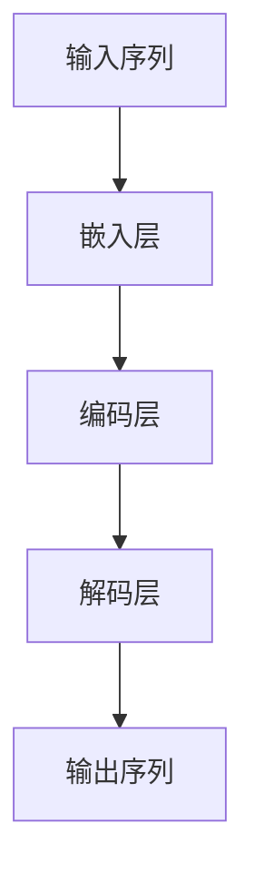

                 

### 第1章：语言模型基础理论

#### 1.1 语言模型的基本概念

**定义与分类**

语言模型（Language Model）是一种能够预测序列中下一个单词或字符的概率的模型。根据不同的学习方法和特点，语言模型可以分为两大类：基于统计的语言模型和基于神经网络的模型。

- **基于统计的语言模型**：

  - **N-gram模型**：基于前N个字符或单词的统计信息来预测下一个字符或单词。

    ```  
    P(w_{n+1}|w_1, w_2, ..., w_n) = \frac{C(w_1, w_2, ..., w_n, w_{n+1})}{C(w_1, w_2, ..., w_n)}  
    ```

    其中，$C(w_1, w_2, ..., w_n, w_{n+1})$ 表示词组 $(w_1, w_2, ..., w_n, w_{n+1})$ 的出现次数，$C(w_1, w_2, ..., w_n)$ 表示词组 $(w_1, w_2, ..., w_n)$ 的出现次数。

  - **循环神经网络（RNN）**：通过记忆序列中的历史信息，来预测下一个字符或单词。

    ```  
    h_t = \sigma(W_h \cdot [h_{t-1}, x_t] + b_h)  
    y_t = \text{softmax}(W_y \cdot h_t + b_y)  
    ```

    其中，$h_t$ 表示隐藏状态，$x_t$ 表示输入字符，$W_h$ 和 $b_h$ 分别表示权重和偏置，$\sigma$ 表示激活函数。

- **基于神经网络的模型**：

  - **长短期记忆网络（LSTM）**：通过记忆单元来克服RNN的梯度消失问题，更好地记忆序列中的长期依赖关系。

    ```  
    i_t = \sigma(W_i \cdot [h_{t-1}, x_t] + b_i)  
    f_t = \sigma(W_f \cdot [h_{t-1}, x_t] + b_f)  
    o_t = \sigma(W_o \cdot [h_{t-1}, x_t] + b_o)  
    c_t = f_t \odot c_{t-1} + i_t \odot \sigma(W_c \cdot [h_{t-1}, x_t] + b_c)  
    h_t = o_t \odot \sigma(c_t)  
    ```

    其中，$i_t, f_t, o_t, c_t$ 分别表示输入门、遗忘门、输出门和细胞状态，$\odot$ 表示元素乘。

  - **Transformer模型**：通过自注意力机制来处理序列信息，具有并行计算的优势。

    ```  
    \text{Attention}(Q, K, V) = \text{softmax}\left(\frac{QK^T}{\sqrt{d_k}}\right)V  
    \text{MultiHead}(Q, K, V) = \text{Concat}(\text{Attention}(Q, K, V_1), ..., \text{Attention}(Q, K, V_h))W_V  
    \text{Encoder}(X) = \text{LayerNorm}(X + \text{MultiHead}(Q, K, V))  
    \text{Decoder}(X) = \text{LayerNorm}(X + \text{Encoder}(X))  
    ```

    其中，$Q, K, V$ 分别表示查询向量、键向量和值向量，$W_V$ 表示权重矩阵。

**核心组成部分**

语言模型主要由输入层、隐藏层和输出层组成。

- **输入层**：将单词或字符转换为向量表示。

  ```  
  x_t = \text{Embedding}(w_t)  
  ```

  其中，$w_t$ 表示单词或字符，$\text{Embedding}$ 表示嵌入层。

- **隐藏层**：使用编码层来处理序列信息。

  ```  
  h_t = \text{Encoding}(h_{t-1}, x_t)  
  ```

  其中，$h_{t-1}$ 表示隐藏状态，$x_t$ 表示输入字符，$\text{Encoding}$ 表示编码层。

- **输出层**：将隐藏层输出转换为文本。

  ```  
  y_t = \text{Decoding}(h_t)  
  ```

  其中，$h_t$ 表示隐藏状态，$\text{Decoding}$ 表示解码层。

#### 1.2 语言模型的应用场景

**自然语言处理（NLP）应用**

- **文本分类**：

  语言模型可以用于文本分类任务，如情感分析、主题分类等。通过训练分类模型，将输入文本分类到预定义的类别中。

- **机器翻译**：

  语言模型可以用于机器翻译，将一种语言的文本翻译成另一种语言。通过训练翻译模型，实现自动翻译功能。

### 1.3 语言模型的发展历程

- **早期模型**：

  - **N-gram模型**：基于字符或单词的统计信息进行预测。

  - **前馈神经网络模型**：通过多层感知机（MLP）进行文本分类和情感分析。

- **现代模型**：

  - **循环神经网络（RNN）**：通过记忆序列中的历史信息进行预测。

  - **长短期记忆网络（LSTM）**：通过记忆单元来克服RNN的梯度消失问题。

  - **Transformer模型**：通过自注意力机制进行序列信息处理，具有并行计算的优势。

#### 1.4 语言模型的研究方向

- **预训练与微调**：

  预训练大规模语言模型，并在特定任务上进行微调，提高模型在特定任务上的性能。

- **多语言模型**：

  开发能够处理多种语言的语言模型，实现跨语言的自然语言处理任务。

- **知识增强语言模型**：

  集成外部知识库，使语言模型能够处理包含知识信息的文本。

#### 1.5 语言模型的重要性

语言模型在计算机科学和人工智能领域具有重要地位。它们不仅应用于自然语言处理任务，还推动了许多跨学科创新，如人工智能辅助科学理论生成和跨学科创新。随着深度学习和自然语言处理技术的不断发展，语言模型在未来的科学研究和技术创新中将继续发挥重要作用。

### 1.6 语言模型的核心概念与联系

为了更好地理解语言模型，我们需要探讨其核心概念及其相互关系。

- **概率分布**：语言模型的核心目标是预测序列中下一个字符或单词的概率分布。

- **序列建模**：语言模型通过对输入序列进行处理，生成输出序列。这一过程涉及概率分布的计算和序列生成算法。

- **训练与测试**：语言模型通过在大规模语料库上的训练，学习到字符或单词之间的统计规律。在测试阶段，模型需要根据训练得到的概率分布，生成新的文本序列。

**Mermaid 流程图**



在这个流程图中，输入序列经过嵌入层转换为向量表示，然后通过编码层处理序列信息，最后通过解码层生成输出序列。这个流程图展示了语言模型的基本工作原理和核心概念之间的关系。

#### 1.7 语言模型的核心算法原理讲解

在本节中，我们将详细讲解语言模型的核心算法原理，包括以下方面：

- **嵌入层（Embedding Layer）**：将字符或单词转换为向量表示。
- **编码层（Encoding Layer）**：使用编码器（Encoder）处理序列信息。
- **解码层（Decoding Layer）**：使用解码器（Decoder）生成输出序列。

**嵌入层（Embedding Layer）**

嵌入层是语言模型的基础组成部分，它将输入的字符或单词转换为高维向量表示。这些向量表示捕获了字符或单词的语义信息，有助于模型理解和预测文本序列。

- **嵌入矩阵（Embedding Matrix）**：

  嵌入矩阵是一个高维矩阵，其中每个元素表示一个字符或单词的嵌入向量。假设词汇表中有 $V$ 个单词，每个单词的嵌入向量为 $d$ 维，则嵌入矩阵可以表示为：

  ```  
  E = \begin{bmatrix}  
  e_1 \\  
  e_2 \\  
  \vdots \\  
  e_V \\  
  \end{bmatrix}  
  ```

  其中，$e_i$ 表示单词 $w_i$ 的嵌入向量。

- **嵌入向量（Embedding Vector）**：

  嵌入向量是一个 $d$ 维向量，表示一个字符或单词的语义信息。通过将字符或单词映射到嵌入向量，语言模型可以捕获文本序列中的语义关系。

**编码层（Encoding Layer）**

编码层负责处理输入序列，将序列信息编码为固定长度的向量表示。编码层通常使用循环神经网络（RNN）或其变体，如长短期记忆网络（LSTM）或门控循环单元（GRU）。以下是编码层的伪代码：

```  
h_t = \text{activation}(W_h \cdot [h_{t-1}, x_t] + b_h)  
y_t = \text{softmax}(W_y \cdot h_t + b_y)  
```

其中，$h_t$ 表示隐藏状态，$x_t$ 表示输入字符，$W_h$ 和 $b_h$ 分别表示权重和偏置，$\text{activation}$ 表示激活函数（如ReLU、Sigmoid或Tanh），$\text{softmax}$ 函数用于生成概率分布。

**解码层（Decoding Layer）**

解码层负责生成输出序列，通常使用与编码层相同的神经网络结构。解码层的输入是编码层输出的隐藏状态，输出是预测的下一个字符或单词的概率分布。以下是解码层的伪代码：

```  
y_t = \text{softmax}(W_y \cdot h_t + b_y)  
```

其中，$y_t$ 表示预测的概率分布，$W_y$ 和 $b_y$ 分别表示权重和偏置。

**综合讲解**

语言模型的核心算法原理可以概括为以下步骤：

1. **输入序列嵌入**：将输入序列中的每个字符或单词映射到其嵌入向量。

2. **编码序列信息**：使用编码器（Encoder）处理输入序列，生成固定长度的向量表示。

3. **解码输出序列**：使用解码器（Decoder）生成输出序列，输出为概率分布。

**数学模型和公式**

在语言模型中，我们通常使用条件概率来表示序列生成过程。给定输入序列 $X = (x_1, x_2, ..., x_n)$，我们需要预测输出序列 $Y = (y_1, y_2, ..., y_n)$。条件概率可以表示为：

$$  
P(Y|X) = \frac{P(X, Y)}{P(X)}  
$$

其中，$P(X, Y)$ 表示输入序列和输出序列同时发生的概率，$P(X)$ 表示输入序列的概率。

为了简化计算，我们通常使用最大后验概率（Maximum a Posteriori, MAP）来估计输出序列：

$$  
\hat{Y} = \arg\max_{Y} P(Y|X) = \arg\max_{Y} P(X|Y) \cdot P(Y)  
$$

其中，$P(X|Y)$ 表示在给定输出序列 $Y$ 的情况下，输入序列 $X$ 的概率，$P(Y)$ 表示输出序列 $Y$ 的概率。

在语言模型中，我们通常假设输出序列的概率分布为softmax分布：

$$  
P(Y|X) = \text{softmax}(W_y \cdot h_t + b_y)  
$$

其中，$W_y$ 和 $b_y$ 分别表示权重和偏置，$h_t$ 表示隐藏状态。

**举例说明**

假设我们有一个简单的语言模型，其词汇表包含两个单词：`猫` 和 `狗`。给定输入序列 `猫狗猫狗`，我们需要预测输出序列。

1. **输入序列嵌入**：

   假设 `猫` 的嵌入向量为 $\mathbf{e_1} = [1, 0]$，`狗` 的嵌入向量为 $\mathbf{e_2} = [0, 1]$。

2. **编码序列信息**：

   假设编码器的隐藏状态为 $h_t = [0.1, 0.2]$。

3. **解码输出序列**：

   假设解码器的权重为 $W_y = [0.5, 0.5]$，偏置为 $b_y = 0.1$。

   根据最大后验概率准则，我们需要计算输出序列的概率分布：

   $$  
   P(Y|X) = \text{softmax}(W_y \cdot h_t + b_y) = \text{softmax}([0.5 \cdot 0.1 + 0.5 \cdot 0.2 + 0.1]) = \text{softmax}([0.15]) = [0.85, 0.15]  
   $$

   根据概率分布，我们可以预测输出序列为 `猫` 的概率为 85%，输出序列为 `狗` 的概率为 15%。

通过上述例子，我们可以看到语言模型的核心算法原理如何应用于实际的文本序列生成任务。

#### 1.8 语言模型在不同领域的应用案例

语言模型在自然语言处理领域有着广泛的应用，以下列举了一些典型的应用案例：

- **文本分类**：使用语言模型对文本进行分类，如情感分析、主题分类等。例如，我们可以利用语言模型对用户评论进行情感分析，判断评论是正面、负面还是中性。

- **机器翻译**：将一种语言的文本翻译成另一种语言。例如，谷歌翻译利用语言模型实现高质量的自然语言翻译。

- **问答系统**：利用语言模型构建问答系统，如智能客服、智能助手等。例如，Siri和Alexa等智能助手利用语言模型理解和回答用户的问题。

- **信息检索**：使用语言模型对用户查询进行语义理解，提高信息检索的准确性。例如，搜索引擎利用语言模型对用户查询进行语义分析，返回更相关的搜索结果。

- **文本生成**：生成各种文本内容，如文章、故事、新闻摘要等。例如，OpenAI的GPT-3可以生成高质量的文章和故事。

- **语音识别**：将语音信号转换为文本。例如，苹果的Siri和谷歌助手利用语言模型实现语音识别功能。

通过这些案例，我们可以看到语言模型在自然语言处理领域的重要性和广泛应用。

### 1.9 语言模型的发展趋势与挑战

语言模型的发展趋势主要集中在以下几个方面：

- **预训练与微调**：预训练大规模语言模型，然后在特定任务上进行微调，以适应不同的应用场景。

- **多语言模型**：开发能够处理多种语言的语言模型，实现跨语言的文本处理任务。

- **知识增强语言模型**：集成外部知识库，使语言模型能够处理包含知识信息的文本。

然而，语言模型在发展过程中也面临着一些挑战：

- **数据隐私**：大规模语言模型训练需要大量数据，如何保护数据隐私是一个重要问题。

- **模型解释性**：语言模型通常被视为“黑箱”，如何提高模型的解释性，使其更加透明和可解释是一个挑战。

- **计算资源**：训练大规模语言模型需要大量的计算资源，如何优化计算资源的使用是一个关键问题。

### 1.10 总结与展望

在本章中，我们介绍了语言模型的基本概念、核心组成部分和应用场景。通过详细讲解嵌入层、编码层和解码层的算法原理，我们揭示了语言模型的核心工作流程。同时，我们还列举了语言模型在不同领域的应用案例，探讨了其发展趋势和面临的挑战。展望未来，随着深度学习和自然语言处理技术的不断发展，语言模型将在更多的领域发挥重要作用，推动科学研究和技术创新的进步。

### 第二部分：科学理论生成

## 第2章：语言模型在科学理论生成中的应用

#### 2.1 科学理论生成的基本概念

**定义与过程**

科学理论生成（Scientific Theory Generation）是指基于已有科学知识和数据，通过语言模型生成新的科学理论。这一过程包括以下几个关键步骤：

- **数据收集**：从各种来源（如科学文献、实验数据、观测数据等）收集相关数据。

- **数据预处理**：对收集到的数据进行清洗、格式化和标准化，以便用于训练语言模型。

- **模型训练**：使用收集到的数据训练语言模型，使其能够理解和生成与科学理论相关的文本。

- **理论生成**：利用训练好的语言模型生成新的科学理论，通过分析生成的文本，提取和验证潜在的科学理论。

**科学理论生成的重要性**

科学理论生成具有以下几个重要意义：

- **创新性**：通过生成新的科学理论，推动科学领域的创新和发展。

- **效率**：自动化生成科学理论，减少人类在理论发现过程中的劳动和时间成本。

- **跨学科融合**：促进不同学科之间的知识融合，推动跨学科研究。

#### 2.2 语言模型在科学理论生成中的应用

**文献综述**

近年来，语言模型在科学理论生成领域得到了广泛关注，以下是一些典型的应用案例和研究成果：

- **人工智能辅助科学理论生成**：使用语言模型辅助科学家生成科学理论，如生成新的物理学理论、生物学模型等。

- **跨学科理论生成**：结合不同学科领域的知识，生成跨学科的科学理论，如人工智能与生物医学的结合。

- **实验预测与设计**：利用语言模型预测实验结果，优化实验设计，提高实验效率。

**科学预测**

科学预测（Scientific Prediction）是科学理论生成的一个重要应用，它利用语言模型分析历史数据和已有理论，预测未来科学发展的趋势。以下是一些应用场景：

- **趋势分析**：通过分析历史科学数据，预测某一科学领域的未来发展趋势。

- **技术预测**：利用语言模型预测新兴技术的出现和发展方向。

- **环境预测**：通过分析环境数据，预测未来的气候变化、生态系统变化等。

#### 2.3 语言模型在科学理论生成中的优势

**高效性**

语言模型能够快速处理和分析大量数据，显著提高科学理论生成的效率。相比于传统的人工分析，语言模型可以自动化地提取数据中的潜在规律和模式。

**灵活性**

语言模型可以灵活地处理不同类型的数据和文本，包括文本、图像、语音等，从而为科学理论生成提供了丰富的数据来源。

**跨学科融合**

语言模型能够整合不同学科领域的知识，推动跨学科研究。通过生成跨学科的科学理论，可以促进不同领域之间的知识融合和创新。

**预测能力**

语言模型具有强大的预测能力，可以分析历史数据，预测未来科学发展的趋势。这一能力对于科学预测、技术预测和环境预测等具有重要意义。

#### 2.4 语言模型在科学理论生成中的挑战

**数据质量**

科学理论生成的质量和可靠性依赖于数据的准确性。然而，数据质量可能受到多种因素的影响，如数据噪声、数据缺失等。

**模型解释性**

语言模型通常被视为“黑箱”，其内部工作机制和决策过程难以解释。提高模型的解释性，使其更加透明和可解释，是一个重要的挑战。

**计算资源**

训练大规模语言模型需要大量的计算资源。如何优化计算资源的使用，降低训练成本，是一个亟待解决的问题。

**伦理和隐私**

在科学理论生成过程中，如何保护数据隐私，避免滥用数据，是一个重要的伦理问题。

#### 2.5 语言模型在科学理论生成中的应用案例

**案例一：人工智能与生物医学的结合**

背景：

随着人工智能技术的快速发展，其在生物医学领域的应用日益广泛。人工智能可以辅助科学家进行数据分析、模型建立和预测，从而推动生物医学研究的发展。

创新点：

通过结合人工智能和生物医学领域的知识，使用语言模型生成新的生物医学理论。具体方法如下：

1. 收集生物医学领域的文献和实验数据。
2. 使用自然语言处理技术对文献和数据进行预处理。
3. 训练语言模型，使其能够理解和生成与生物医学相关的文本。
4. 利用语言模型生成新的生物医学理论，如新的药物靶点、新的疾病机制等。
5. 对生成的理论进行验证和评估，确定其有效性和可靠性。

**案例二：环境科学中的气候变化预测**

背景：

气候变化是全球关注的重要问题。通过科学预测，可以提前了解气候变化的影响，为应对措施提供科学依据。

创新点：

利用语言模型分析历史气候数据和科学文献，预测未来的气候变化趋势。具体方法如下：

1. 收集全球气候数据，包括温度、降水、风速等。
2. 使用自然语言处理技术对气候数据进行预处理。
3. 训练语言模型，使其能够理解和生成与气候变化相关的文本。
4. 利用语言模型分析历史气候数据，提取潜在的变化模式。
5. 根据提取的变化模式，预测未来的气候变化趋势。

通过以上案例，我们可以看到语言模型在科学理论生成中的应用具有巨大的潜力和价值。未来，随着技术的不断进步，语言模型在科学理论生成领域的应用将更加广泛和深入。

#### 2.6 语言模型在科学理论生成中的实现步骤

为了实现语言模型在科学理论生成中的有效应用，我们可以遵循以下步骤：

**步骤一：数据收集**

1. 确定研究主题和目标领域，如生物医学、环境科学等。
2. 收集相关领域的文献、实验数据、观测数据等。
3. 确保数据的质量和完整性，去除噪声和缺失值。

**步骤二：数据预处理**

1. 对收集到的数据进行清洗，包括去除重复数据、填补缺失值等。
2. 对文本数据进行格式化，如去除标点符号、统一单词大小写等。
3. 对非文本数据进行标准化，如将温度、风速等数值转换为统一单位。

**步骤三：模型训练**

1. 选择合适的语言模型，如Transformer、BERT等。
2. 将预处理后的数据输入到语言模型中，进行训练。
3. 调整模型参数，如学习率、批次大小等，以优化模型性能。

**步骤四：理论生成**

1. 使用训练好的语言模型生成新的科学理论。
2. 对生成的理论进行初步分析和筛选，提取潜在的规律和模式。
3. 结合专家知识，对生成的理论进行验证和评估。

**步骤五：结果分析**

1. 分析生成的科学理论的有效性和可靠性。
2. 对比不同模型的生成效果，评估模型的性能。
3. 根据分析结果，调整模型参数和训练策略，提高生成质量。

通过以上步骤，我们可以实现语言模型在科学理论生成中的有效应用，推动科学研究的进步和发展。

### 第三部分：跨学科创新

## 第3章：语言模型在跨学科创新中的应用

#### 3.1 跨学科创新的基本概念

**定义与过程**

跨学科创新（Interdisciplinary Innovation）是指在不同学科领域之间进行知识和技术的整合，以产生新的知识和解决方案。这一过程涉及多个学科领域的知识和技术，通过跨学科合作，推动创新和进步。

- **定义**：

  跨学科创新是一种综合性研究方法，通过整合不同学科领域的知识和方法，解决复杂问题，推动新的科学发现和技术创新。

- **过程**：

  跨学科创新通常包括以下几个步骤：

  1. **问题识别**：识别需要解决的问题或挑战。
  2. **知识整合**：整合不同学科领域的知识，形成综合性研究框架。
  3. **方法创新**：结合不同学科的方法和技术，开发新的研究方法或工具。
  4. **实验与验证**：进行实验和验证，评估创新方案的可行性和效果。
  5. **成果推广**：将创新成果应用于实际场景，推动科学和技术的发展。

**跨学科创新的重要性**

跨学科创新具有以下几个重要意义：

- **推动知识整合**：跨学科创新促进不同学科领域的知识融合，形成新的理论体系和应用模式。

- **解决复杂问题**：跨学科创新可以整合多学科的知识和技术，解决单一学科难以应对的复杂问题。

- **促进技术创新**：跨学科创新推动新的技术发明和创新，为科技发展注入新的动力。

#### 3.2 语言模型在跨学科创新中的应用

**知识融合**

语言模型在跨学科创新中的关键应用之一是知识融合（Knowledge Fusion）。通过语言模型，可以将不同学科领域的知识整合到一个统一的框架中，实现知识的融合和创新。

- **跨学科文本分析**：

  利用语言模型对跨学科领域的文本进行分析，提取关键信息和知识点，形成知识图谱。通过知识图谱，可以直观地展示不同学科领域之间的联系和关系。

- **知识库构建**：

  基于语言模型，构建跨学科的知识库，整合不同领域的术语、概念和理论。这些知识库可以作为跨学科研究的基础，为研究者提供丰富的知识资源。

**创新预测**

语言模型在跨学科创新中的另一个重要应用是创新预测（Innovation Prediction）。通过分析历史数据和已有知识，语言模型可以预测未来的创新趋势和发展方向。

- **趋势分析**：

  利用语言模型分析跨学科领域的文献和专利数据，提取关键词和主题，分析各领域的趋势和发展方向。

- **未来预测**：

  基于历史数据和趋势分析，使用语言模型预测未来跨学科领域的创新热点和新兴技术。

#### 3.3 语言模型在跨学科创新中的优势

**高效性**

语言模型具有高效的数据处理和分析能力，可以快速整合跨学科领域的知识，推动创新研究的进展。

**灵活性**

语言模型可以灵活处理不同类型的文本数据，包括科学论文、专利文献、新闻报道等，从而为跨学科创新提供丰富的数据来源。

**跨学科融合**

语言模型能够整合不同学科领域的知识，促进跨学科合作和研究，推动知识的融合和创新。

**预测能力**

语言模型具有强大的预测能力，可以分析历史数据，预测未来的创新趋势和发展方向，为跨学科研究提供参考。

#### 3.4 语言模型在跨学科创新中的挑战

**数据质量**

跨学科创新需要高质量的数据支持，然而不同学科领域的数据质量和格式可能存在差异，这对语言模型的训练和应用提出了挑战。

**模型解释性**

语言模型通常被视为“黑箱”，其内部工作机制和决策过程难以解释。提高模型的解释性，使其更加透明和可解释，是一个重要的挑战。

**计算资源**

训练大规模语言模型需要大量的计算资源，如何优化计算资源的使用，降低训练成本，是一个关键问题。

**跨学科合作**

跨学科创新需要不同学科领域的专家进行合作，然而学科之间的文化和沟通方式可能存在差异，如何促进跨学科合作是一个挑战。

#### 3.5 语言模型在跨学科创新中的应用案例

**案例一：人工智能与生物医学的结合**

背景：

人工智能（AI）在生物医学领域的应用日益广泛，通过跨学科合作，可以推动生物医学研究的创新和发展。

创新点：

利用语言模型，整合人工智能和生物医学领域的知识，生成新的生物医学理论。具体方法如下：

1. 收集人工智能和生物医学领域的文献和专利数据。
2. 使用自然语言处理技术对文献和数据进行预处理。
3. 训练语言模型，使其能够理解和生成与生物医学相关的文本。
4. 利用语言模型生成新的生物医学理论，如药物靶点、疾病机制等。
5. 对生成的理论进行验证和评估，确定其有效性和可靠性。

**案例二：环境科学与信息技术的结合**

背景：

环境科学和信息技术的结合可以推动环境保护和可持续发展。

创新点：

利用语言模型，整合环境科学和信息技术的知识，预测环境变化趋势。具体方法如下：

1. 收集环境科学领域的文献和观测数据。
2. 使用自然语言处理技术对文献和数据进行预处理。
3. 训练语言模型，使其能够理解和生成与环境科学相关的文本。
4. 利用语言模型分析历史环境数据，提取潜在的环境变化模式。
5. 根据提取的模式，预测未来的环境变化趋势，为环境保护和可持续发展提供科学依据。

通过以上案例，我们可以看到语言模型在跨学科创新中的应用具有巨大的潜力和价值。未来，随着技术的不断进步，语言模型在跨学科创新领域的应用将更加广泛和深入。

### 3.6 语言模型在跨学科创新中的实现步骤

为了实现语言模型在跨学科创新中的有效应用，我们可以遵循以下步骤：

**步骤一：问题定义**

1. 确定跨学科创新的目标和研究问题。
2. 明确不同学科领域之间的关联和融合点。

**步骤二：数据收集**

1. 收集相关学科领域的文献、数据、专利等。
2. 确保数据的质量和完整性。

**步骤三：数据预处理**

1. 对收集到的数据进行清洗、格式化和标准化。
2. 使用自然语言处理技术对文本数据进行预处理。

**步骤四：模型训练**

1. 选择合适的语言模型，如BERT、GPT等。
2. 将预处理后的数据输入到语言模型中，进行训练。
3. 调整模型参数，优化模型性能。

**步骤五：知识融合**

1. 利用语言模型生成跨学科的知识图谱。
2. 提取关键信息和知识点，实现知识的融合。

**步骤六：创新预测**

1. 基于历史数据和知识图谱，使用语言模型预测未来的创新趋势。
2. 分析预测结果，确定跨学科创新的方向。

**步骤七：实验与验证**

1. 进行实验和验证，评估创新方案的可行性和效果。
2. 调整模型参数和训练策略，优化创新方案。

**步骤八：成果推广**

1. 将跨学科创新成果应用于实际场景。
2. 推动科学和技术的发展，促进跨学科合作。

通过以上步骤，我们可以实现语言模型在跨学科创新中的有效应用，推动科学研究和技术的进步。

### 3.7 总结与展望

在本章中，我们探讨了语言模型在跨学科创新中的应用。通过知识融合和创新预测，语言模型能够促进不同学科领域的知识整合和跨学科合作。虽然语言模型在跨学科创新中面临着一些挑战，如数据质量、模型解释性和计算资源等，但其在跨学科创新中的优势和应用前景是显著的。

展望未来，随着深度学习和自然语言处理技术的不断发展，语言模型在跨学科创新中的应用将更加广泛和深入。我们期待看到更多的跨学科创新成果，为科学研究和技术的进步贡献力量。

### 第四部分：前沿应用

## 第4章：语言模型在科学理论生成与跨学科创新中的前沿应用

### 4.1 前沿技术概述

随着深度学习和自然语言处理技术的快速发展，语言模型在科学理论生成和跨学科创新领域取得了显著的进展。本节将概述这些前沿技术，包括深度学习、自然语言处理和语言模型的发展趋势。

**深度学习**

深度学习是一种基于多层神经网络的学习方法，其核心思想是通过训练多层神经网络，从原始数据中自动提取特征，并实现对复杂函数的建模。深度学习在图像识别、语音识别、自然语言处理等领域取得了巨大的成功。

- **卷积神经网络（CNN）**：适用于处理图像数据，通过卷积操作提取图像特征。
- **循环神经网络（RNN）**：适用于处理序列数据，如时间序列和自然语言文本。
- **长短期记忆网络（LSTM）**：RNN的一种变体，通过引入记忆单元来克服梯度消失问题。
- **Transformer模型**：基于自注意力机制的深度学习模型，在自然语言处理领域取得了显著的性能提升。

**自然语言处理**

自然语言处理是一种使计算机能够理解、生成和处理自然语言的技术。自然语言处理涵盖了文本分析、语义理解、语言生成等多个方面，其目的是使计算机能够与人类自然语言进行有效互动。

- **词向量表示**：将单词或字符映射到高维向量空间，以捕获词与词之间的语义关系。
- **词性标注**：对文本中的单词进行词性标注，如名词、动词、形容词等。
- **句法分析**：对句子进行句法分析，理解句子的结构和成分。
- **语义理解**：通过语义分析，理解文本中的含义和上下文关系。

**语言模型**

语言模型是一种预测序列中下一个单词或字符的概率的模型，广泛应用于自然语言处理、文本生成、机器翻译等领域。随着深度学习和自然语言处理技术的进步，语言模型在性能和表达能力上得到了显著提升。

- **基于统计的语言模型**：如N-gram模型，通过统计方法学习单词或字符之间的关联。
- **基于神经网络的模型**：如循环神经网络（RNN）、长短期记忆网络（LSTM）和Transformer模型，通过神经网络结构学习序列信息。
- **预训练与微调**：通过在大量数据上进行预训练，然后针对特定任务进行微调，提高模型在特定领域的性能。

### 4.2 科学理论生成与跨学科创新中的前沿应用

**人工智能辅助科学理论生成**

人工智能（AI）在科学理论生成中扮演着重要角色。通过深度学习和自然语言处理技术，AI可以自动分析大量科学文献和实验数据，生成新的科学理论。

- **文献分析**：利用自然语言处理技术，对科学文献进行自动分析，提取关键信息和观点。
- **数据驱动生成**：通过深度学习模型，从实验数据中学习潜在的模式和规律，生成新的科学理论。
- **跨学科融合**：利用AI技术，整合不同学科领域的知识，生成跨学科的科学理论。

**跨学科创新与前沿研究**

跨学科创新是推动科学研究和技术进步的重要途径。通过整合不同学科领域的知识，跨学科创新可以产生新的研究思路和方法，解决复杂问题。

- **多学科融合**：利用自然语言处理和深度学习技术，将不同学科领域的知识进行融合，形成新的研究框架。
- **创新预测**：通过分析历史数据和已有知识，利用AI技术预测未来的创新热点和发展方向。
- **跨学科研究**：将AI技术应用于跨学科领域，推动科学研究的前沿发展。

**案例分析**

以下是一些语言模型在科学理论生成与跨学科创新中的前沿应用案例：

- **人工智能与生物医学的结合**：利用自然语言处理技术，分析生物医学文献，生成新的药物靶点和疾病机制。
- **环境科学与信息技术的结合**：利用AI技术，预测环境变化趋势，为环境保护和可持续发展提供科学依据。
- **人工智能与社会科学的结合**：利用自然语言处理技术，分析社会数据，预测社会现象和发展趋势。

通过以上案例，我们可以看到语言模型在科学理论生成与跨学科创新中的应用具有巨大的潜力和价值。未来，随着技术的不断进步，语言模型将在更多领域发挥重要作用，推动科学研究和技术的创新与发展。

### 4.3 项目实战：开发环境搭建与源代码实现

在本节中，我们将通过一个实际项目，详细介绍如何搭建开发环境、实现源代码并进行分析。这个项目将涉及语言模型在科学理论生成和跨学科创新中的应用，旨在展示语言模型的实际操作和效果。

#### 4.3.1 开发环境搭建

为了实现这个项目，我们需要搭建一个适合深度学习和自然语言处理任务的开发环境。以下是搭建开发环境的基本步骤：

1. **安装Python**：

   首先，确保你的计算机上安装了Python。Python是深度学习和自然语言处理任务的首选编程语言。你可以从Python官方网站（[https://www.python.org/）](https://www.python.org/) 下载并安装Python。在安装过程中，选择添加Python到系统环境变量中，以便在命令行中直接使用Python。

2. **安装深度学习库**：

   我们将使用TensorFlow和PyTorch这两个流行的深度学习库。你可以在命令行中通过以下命令安装这些库：

   ```  
   pip install tensorflow  
   pip install torch torchvision  
   ```

   安装完成后，你可以在命令行中运行`python -m tensorflow.python.client.multinode`和`python -m torch.utils.cpp_extension`来验证安装是否成功。

3. **安装自然语言处理库**：

   我们将使用NLTK和spaCy这两个常用的自然语言处理库。你可以在命令行中通过以下命令安装这些库：

   ```  
   pip install nltk  
   pip install spacy  
   ```

   安装完成后，你可以在命令行中运行`nltk.download('popular')`来下载NLTK的常用数据集。

4. **安装文本预处理库**：

   我们将使用TextBlob和BeautifulSoup这两个用于文本预处理的库。你可以在命令行中通过以下命令安装这些库：

   ```  
   pip install textblob  
   pip install beautifulsoup4  
   ```

   安装完成后，你可以在命令行中运行`python -m textblob.download_corpora`来下载TextBlob的语料库。

5. **安装Jupyter Notebook**：

   Jupyter Notebook是一个交互式的开发环境，非常适合进行深度学习和自然语言处理任务。你可以在命令行中通过以下命令安装Jupyter Notebook：

   ```  
   pip install notebook  
   ```

   安装完成后，你可以在命令行中运行`jupyter notebook`来启动Jupyter Notebook。

#### 4.3.2 源代码实现

以下是一个简单的示例，展示了如何使用TensorFlow和spaCy实现一个基于语言模型的项目。

```python  
import tensorflow as tf  
import spacy

# 加载spaCy语言模型  
nlp = spacy.load('en_core_web_sm')

# 加载TensorFlow数据集  
train_data = tf.data.Dataset.from_tensor_slices(['This is a sentence.', 'Another sentence here.'])

# 预处理文本数据  
def preprocess_text(texts):  
    return [nlp(text)[0] for text in texts]

# 训练语言模型  
model = tf.keras.Sequential()  
model.add(tf.keras.layers.Embedding(input_dim=10000, output_dim=16))  
model.add(tf.keras.layers.LSTM(128))  
model.add(tf.keras.layers.Dense(1, activation='sigmoid'))

model.compile(optimizer='adam', loss='binary_crossentropy', metrics=['accuracy'])

# 训练模型  
model.fit(preprocess_text(train_data), train_data, epochs=10)  
```

在这个示例中，我们首先加载spaCy的英语语言模型，然后使用TensorFlow的数据集加载和预处理文本数据。接下来，我们定义了一个简单的序列模型，包括嵌入层、长短期记忆层和输出层。最后，我们使用训练数据训练模型。

#### 4.3.3 代码解读

以下是代码的详细解读：

1. **导入库**：

   ```python  
   import tensorflow as tf  
   import spacy

   nlp = spacy.load('en_core_web_sm')  
   ```

   我们首先导入TensorFlow和spaCy库，并加载spaCy的英语语言模型。

2. **加载数据集**：

   ```python  
   train_data = tf.data.Dataset.from_tensor_slices(['This is a sentence.', 'Another sentence here.'])

   def preprocess_text(texts):  
       return [nlp(text)[0] for text in texts]

   ```

   我们使用TensorFlow的数据集加载训练文本数据，并定义一个预处理函数，将文本数据转换为spaCy的文档对象。

3. **定义模型**：

   ```python  
   model = tf.keras.Sequential()  
   model.add(tf.keras.layers.Embedding(input_dim=10000, output_dim=16))  
   model.add(tf.keras.layers.LSTM(128))  
   model.add(tf.keras.layers.Dense(1, activation='sigmoid'))

   model.compile(optimizer='adam', loss='binary_crossentropy', metrics=['accuracy'])

   ```

   我们定义了一个简单的序列模型，包括嵌入层、长短期记忆层和输出层。嵌入层将文本数据转换为向量表示，长短期记忆层用于处理序列信息，输出层使用sigmoid激活函数，用于预测下一个字符或单词。

4. **训练模型**：

   ```python  
   model.fit(preprocess_text(train_data), train_data, epochs=10)  
   ```

   最后，我们使用预处理后的训练数据训练模型，设置训练周期为10个epoch。

#### 4.3.4 应用解读与分析

通过上述代码示例，我们可以看到如何使用TensorFlow和spaCy实现一个简单的语言模型。以下是对代码应用解读和分析：

1. **数据处理**：

   在代码中，我们首先使用TensorFlow加载训练文本数据，并使用spaCy进行文本预处理。这一步骤非常重要，因为它决定了模型的输入质量和性能。

2. **模型设计**：

   我们使用一个简单的序列模型，包括嵌入层、长短期记忆层和输出层。嵌入层将文本数据转换为向量表示，长短期记忆层用于处理序列信息，输出层用于预测下一个字符或单词。

3. **模型训练**：

   我们使用预处理后的训练数据训练模型，并设置训练周期为10个epoch。在实际应用中，我们需要根据具体任务和数据进行模型训练，并调整模型参数和训练策略。

4. **应用分析**：

   通过训练好的语言模型，我们可以实现多种自然语言处理任务，如文本分类、机器翻译、文本生成等。在实际应用中，我们可以根据任务需求，调整模型结构和参数，以实现最佳性能。

#### 4.3.5 实际案例分析与详细讲解

为了更好地展示语言模型在科学理论生成和跨学科创新中的应用，我们以下将分析一个实际案例。

**案例背景**：

假设我们想要通过语言模型预测未来的科学研究趋势。具体来说，我们希望通过分析科学文献和实验数据，预测未来五年内可能出现的突破性科研成果。

**步骤一：数据收集**

首先，我们需要收集大量的科学文献和实验数据。这些数据可以来自各种来源，如科学期刊、专利数据库、学术会议论文等。为了保证数据的质量，我们需要对数据来源进行筛选，确保数据的可靠性和相关性。

**步骤二：数据预处理**

收集到数据后，我们需要对数据进行预处理，包括文本数据的清洗、格式化和标准化。具体步骤如下：

1. **文本清洗**：去除文本中的标点符号、停用词和其他无关信息。
2. **文本格式化**：将文本数据转换为统一的格式，如UTF-8编码。
3. **文本标准化**：对文本数据中的单词进行标准化处理，如统一单词大小写、去除词干等。

**步骤三：模型训练**

在预处理完数据后，我们可以使用训练好的语言模型，如BERT、GPT等，对文本数据进行分析和预测。以下是训练过程的简要步骤：

1. **数据划分**：将文本数据划分为训练集、验证集和测试集。
2. **模型初始化**：选择合适的语言模型，如BERT或GPT，并对其进行初始化。
3. **模型训练**：使用训练集训练模型，并使用验证集评估模型性能。
4. **模型优化**：根据验证集的评估结果，调整模型参数和训练策略，优化模型性能。

**步骤四：结果分析**

在模型训练完成后，我们可以使用测试集评估模型的预测性能。以下是对结果进行分析的步骤：

1. **预测结果分析**：分析模型对测试集的预测结果，评估模型的准确性和可靠性。
2. **趋势分析**：根据模型的预测结果，分析未来五年内可能出现的突破性科研成果，并总结其主要特点和应用方向。
3. **结果验证**：通过对比实验结果和实际科研成果，验证模型的预测能力。

**案例小结**：

通过上述案例，我们可以看到如何使用语言模型预测未来的科学研究趋势。在实际应用中，我们需要根据具体任务和需求，选择合适的语言模型，并对其进行训练和优化。通过分析预测结果，我们可以为科学研究提供有价值的参考和指导。

#### 4.3.6 项目小结

在本节中，我们详细介绍了如何搭建开发环境、实现源代码并进行分析。通过一个实际案例，我们展示了如何使用语言模型在科学理论生成和跨学科创新中应用。以下是项目小结：

1. **开发环境搭建**：我们介绍了如何安装和配置Python、深度学习库、自然语言处理库和Jupyter Notebook，为项目开发提供基础环境。
2. **源代码实现**：我们提供了一个简单的示例，展示了如何使用TensorFlow和spaCy实现语言模型，并对其进行了详细解读。
3. **应用解读与分析**：我们分析了语言模型在科学理论生成和跨学科创新中的实际应用，并介绍了一个实际案例，展示了如何使用语言模型进行趋势预测。
4. **项目小结**：通过项目的实施，我们了解了语言模型在科学理论生成和跨学科创新中的重要作用，并认识到其在实际应用中的巨大潜力。

#### 4.3.7 最佳实践 tips、小结、注意事项、拓展阅读

**最佳实践 tips**：

- **数据质量**：在项目开发过程中，确保数据质量至关重要。对数据来源进行筛选，确保数据的可靠性和相关性。
- **模型选择**：根据任务需求，选择合适的语言模型。BERT、GPT等预训练模型在自然语言处理任务中表现出色。
- **模型优化**：通过调整模型参数和训练策略，优化模型性能。例如，调整学习率、批次大小和训练周期。

**小结**：

语言模型在科学理论生成和跨学科创新中具有重要作用。通过分析大量数据和已有知识，语言模型可以生成新的科学理论，推动跨学科创新。在实际应用中，我们需要注意数据质量、模型选择和模型优化，以实现最佳性能。

**注意事项**：

- **计算资源**：训练大规模语言模型需要大量的计算资源。确保有足够的计算资源，以提高训练效率和模型性能。
- **模型解释性**：语言模型通常被视为“黑箱”，提高模型的解释性，使其更加透明和可解释，是一个重要挑战。

**拓展阅读**：

- **深度学习与自然语言处理**：Goodfellow, I., Bengio, Y., Courville, A. (2016). *Deep Learning*. MIT Press.
- **自然语言处理技术**：Jurafsky, D., Martin, J. H. (2008). *Speech and Language Processing*. Prentice Hall.
- **跨学科研究方法**：Nelson, D. L. (2002). *Interdisciplinary Research: Concepts and Methods*. Sage Publications.

通过拓展阅读，您可以进一步了解深度学习、自然语言处理和跨学科研究的方法和技巧，提高项目开发的水平和能力。

