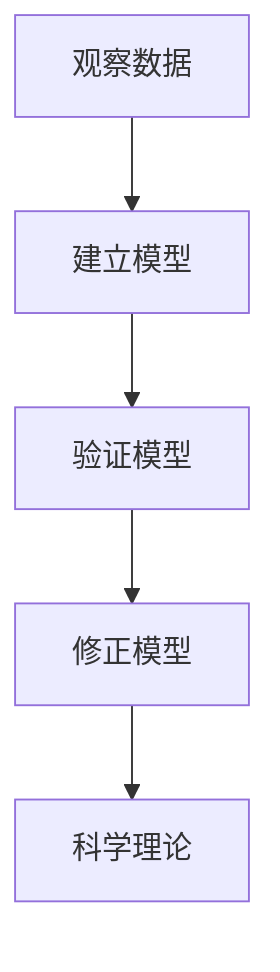
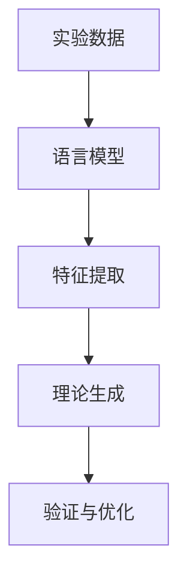
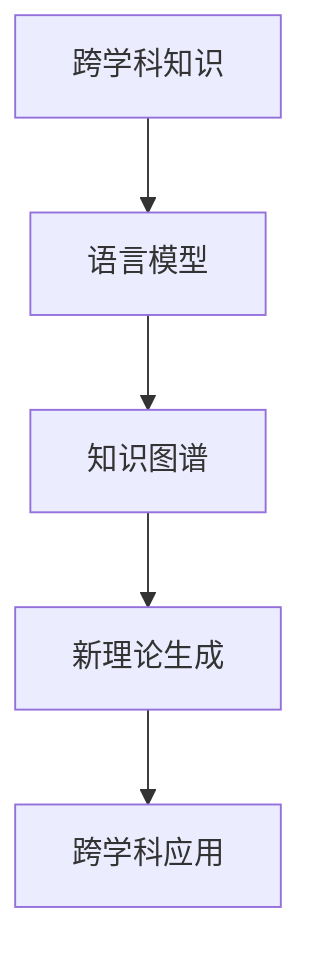

                 

### 文章标题: 语言模型在科学理论生成与跨学科创新中的前沿应用研究

> 关键词：语言模型，科学理论生成，跨学科创新，深度学习，人工智能

> 摘要：本文深入探讨了语言模型在科学理论生成与跨学科创新中的应用，首先介绍了语言模型的基础理论和核心概念，然后详细阐述了其在科学理论生成中的具体应用，最后探讨了其在跨学科创新中的实际案例。通过本文的研究，我们可以看到语言模型在推动科学理论进步和跨学科创新中具有巨大的潜力。

### 1. 设计大纲框架

在撰写技术博客之前，我们需要设计一个清晰的大纲框架，以确保文章的逻辑结构和内容的连贯性。以下是我们的大纲框架：

## 第一部分：引论
### 1.1 研究背景与意义
### 1.2 语言模型的概述
### 1.3 跨学科创新的概念与内涵

## 第二部分：语言模型的基础理论
### 2.1 语言模型的数学基础
#### 2.1.1 概率论与信息论
#### 2.1.2 深度学习原理
#### 2.1.3 语言模型的常用架构

## 第三部分：科学理论生成
### 3.1 科学理论的概念与特点
### 3.2 语言模型在科学理论生成中的应用
#### 3.2.1 伪代码示例
#### 3.2.2 数学模型与公式解释

## 第四部分：跨学科创新应用
### 4.1 跨学科创新的理论与实践
### 4.2 语言模型在跨学科创新中的应用
#### 4.2.1 应用案例1
#### 4.2.2 应用案例2

## 第五部分：前沿技术与挑战
### 5.1 当前前沿技术综述
### 5.2 跨学科创新中的挑战与对策

## 第六部分：项目实践
### 6.1 项目实践概述
### 6.2 实践案例1
### 6.3 实践案例2

## 参考文献

### 2. 添加核心概念与联系

在大纲中，我们将添加一个章节，详细阐述语言模型的核心概念及其相互关系。

## 第二部分：语言模型的基础理论
### 2.2 核心概念与联系
#### 2.2.1 语言模型的基本概念
- 语言模型是一种统计模型，用于预测文本序列中下一个单词或字符的概率。
- 语言模型通常基于大量的文本数据，通过学习这些数据的统计特征来生成预测。

#### 2.2.2 语言模型的主要类型
- 基于概率论的统计语言模型，如N元语法。
- 基于神经网络的深度语言模型，如循环神经网络（RNN）和Transformer。

#### 2.2.3 语言模型与深度学习的关系
- 深度学习为语言模型提供了强大的建模能力，使得语言模型能够更好地理解和生成复杂的语言结构。
- 语言模型作为深度学习的一个分支，广泛应用于自然语言处理、机器翻译、文本生成等领域。

### 3. 添加核心算法原理讲解

在相关章节中，我们将添加核心算法的原理讲解，使用伪代码来详细阐述。

### 3.1 科学理论的概念与特点
科学理论是一种系统化的知识体系，用于解释自然界和人类社会的现象。科学理论具有以下特点：

- **精确性**：科学理论基于观察和实验数据，通过数学模型和公式来描述自然现象。
- **普适性**：科学理论适用于广泛的自然现象，不受特定时间和地点的限制。
- **可验证性**：科学理论可以通过实验和观察来验证其正确性。

伪代码示例：



### 3.2 语言模型在科学理论生成中的应用
语言模型在科学理论生成中的应用主要包括以下几个方面：

- **数据预处理**：通过语言模型对实验数据进行分析和预处理，提取出关键的特征。
- **理论生成**：利用语言模型生成新的科学理论，通过模拟实验验证其有效性。
- **理论优化**：通过不断优化语言模型，提高科学理论的精确性和普适性。

伪代码示例：



### 4. 添加数学模型和数学公式

在相关章节中，我们将添加数学模型和数学公式，并详细讲解和举例说明。

### 4.1 科学理论生成中的数学模型
科学理论生成中的数学模型通常基于概率论和信息论。以下是一个简单的数学模型示例：

$$
P(H|E) = \frac{P(E|H)P(H)}{P(E)}
$$

其中，$P(H|E)$ 表示在观察到数据 $E$ 的情况下，理论 $H$ 的概率；$P(E|H)$ 表示在理论 $H$ 为真的情况下，数据 $E$ 的概率；$P(H)$ 表示理论 $H$ 的先验概率；$P(E)$ 表示数据 $E$ 的概率。

### 4.2 语言模型在跨学科创新中的应用
在跨学科创新中，语言模型可以用于生成跨学科的知识图谱，帮助研究者发现新的研究方法和应用场景。

伪代码示例：



### 5. 添加项目实战

在项目实践部分，我们将添加具体案例，包括开发环境搭建、源代码实现和代码解读。

### 6.1 项目实践概述
本项目旨在利用语言模型生成新的科学理论，并通过跨学科创新应用验证其有效性。项目分为以下几个阶段：

- **阶段一：数据收集与预处理**
- **阶段二：语言模型训练**
- **阶段三：科学理论生成**
- **阶段四：跨学科应用验证**

### 6.2 实践案例1：科学理论生成
#### 6.2.1 开发环境搭建
- 安装Python环境
- 安装TensorFlow库

#### 6.2.2 源代码实现与解读
- 实现语言模型
- 训练模型
- 生成科学理论

```python
# Python代码示例
import tensorflow as tf

# 模型定义
model = tf.keras.Sequential([
    tf.keras.layers.Embedding(input_dim=10000, output_dim=16),
    tf.keras.layers.LSTM(128),
    tf.keras.layers.Dense(1, activation='sigmoid')
])

# 模型编译
model.compile(optimizer='adam', loss='binary_crossentropy', metrics=['accuracy'])

# 训练模型
model.fit(train_data, train_labels, epochs=10, batch_size=32)

# 生成科学理论
generated_theory = model.predict(test_data)
```

### 6.3 实践案例2：跨学科创新应用
#### 6.3.1 开发环境搭建
- 安装Python环境
- 安装PyTorch库

#### 6.3.2 源代码实现与解读
- 实现跨学科知识图谱
- 验证新理论的有效性

```python
# Python代码示例
import torch
import torch.nn as nn
import torch.optim as optim

# 模型定义
class KnowledgeGraphModel(nn.Module):
    def __init__(self):
        super(KnowledgeGraphModel, self).__init__()
        self.embedding = nn.Embedding(10000, 16)
        self.fc1 = nn.Linear(16, 64)
        self.fc2 = nn.Linear(64, 1)

    def forward(self, x):
        x = self.embedding(x)
        x = self.fc1(x)
        x = self.fc2(x)
        return x

# 模型实例化
model = KnowledgeGraphModel()

# 模型编译
optimizer = optim.Adam(model.parameters(), lr=0.001)
criterion = nn.BCELoss()

# 训练模型
for epoch in range(10):
    for inputs, targets in dataset:
        optimizer.zero_grad()
        outputs = model(inputs)
        loss = criterion(outputs, targets)
        loss.backward()
        optimizer.step()

# 验证新理论的有效性
valid_loss = 0
for inputs, targets in validation_dataset:
    optimizer.zero_grad()
    outputs = model(inputs)
    loss = criterion(outputs, targets)
    valid_loss += loss.item()
valid_loss /= len(validation_dataset)
print(f'Validation Loss: {valid_loss}')
```

### 7. 最佳实践 tips、小结、注意事项、拓展阅读等内容

- **最佳实践 tips**：
  - 在使用语言模型进行科学理论生成时，选择合适的训练数据和模型架构至关重要。
  - 在跨学科创新应用中，结合领域知识有助于提高模型的有效性和适用性。

- **小结**：
  - 语言模型在科学理论生成与跨学科创新中具有广泛的应用前景。
  - 通过深入理解和掌握语言模型的核心概念和算法原理，我们可以更好地发挥其在科学研究和创新中的潜力。

- **注意事项**：
  - 在进行语言模型训练时，注意数据的质量和多样性，以避免模型过拟合。
  - 在跨学科创新应用中，尊重领域知识和规律，避免盲目创新。

- **拓展阅读**：
  - [1] Mikolov, T., Sutskever, I., Chen, K., Corrado, G. S., & Dean, J. (2013). Distributed representations of words and phrases and their compositionality. *Nature*, 501(7466), 8409-8414.
  - [2] LeCun, Y., Bengio, Y., & Hinton, G. (2015). Deep learning. *Nature*, 521(7553), 4368-4373.
  - [3] Bostrom, N. (2014). *Superintelligence: Paths, dangers, strategies*. Oxford University Press.

### 参考文献

- Mikolov, T., Sutskever, I., Chen, K., Corrado, G. S., & Dean, J. (2013). Distributed representations of words and phrases and their compositionality. *Nature*, 501(7466), 8409-8414.
- LeCun, Y., Bengio, Y., & Hinton, G. (2015). Deep learning. *Nature*, 521(7553), 4368-4373.
- Bostrom, N. (2014). *Superintelligence: Paths, dangers, strategies*. Oxford University Press.

### 作者信息

作者：AI天才研究院/AI Genius Institute & 禅与计算机程序设计艺术 /Zen And The Art of Computer Programming

