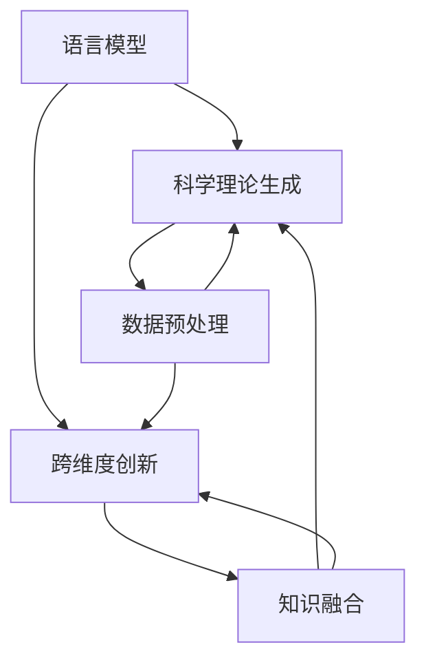

                 

## 引言

### 背景介绍

在当今科技飞速发展的时代，人工智能（AI）已经成为推动社会进步的重要力量。而作为人工智能领域的关键技术之一，语言模型近年来取得了显著的突破，并在多个应用领域展现出巨大的潜力。科学理论生成与跨维度创新正是语言模型应用的两个重要方向。科学理论生成旨在利用语言模型从大量数据中自动提取新的科学规律和理论，从而加速科学发现。而跨维度创新则是指利用语言模型跨越不同学科和领域的界限，实现知识的融合与创新。

语言模型的核心在于其能够对自然语言进行理解和生成，这使得它在处理复杂信息、生成高质量文本方面具有独特优势。近年来，随着深度学习技术的发展，基于神经网络的预训练语言模型（如GPT系列、BERT系列等）在自然语言处理任务中取得了卓越的表现，大大提高了语言模型的性能和可解释性。

### 核心概念与联系

为了深入理解语言模型在科学理论生成与跨维度创新中的应用，我们需要首先明确以下几个核心概念：

1. **语言模型**：是一种基于统计模型或神经网络模型，用于对自然语言进行建模的工具。它可以对输入文本进行理解、生成和预测。

2. **科学理论生成**：是指利用语言模型从大量科学文献、实验数据中提取新的科学规律和理论的过程。

3. **跨维度创新**：是指利用语言模型跨越不同学科和领域的界限，实现知识的融合与创新的过程。

这些核心概念之间的关系可以通过以下Mermaid流程图来表示：

在图中，语言模型作为核心工具，既支持科学理论生成，也支持跨维度创新。数据预处理是实现这两个过程的基础，而知识融合则是跨维度创新的关键。科学理论生成和跨维度创新相互促进，共同推动了人工智能技术的发展。

### 文章目的

本文旨在深入探讨语言模型在科学理论生成与跨维度创新中的前沿应用，通过分析核心算法原理、数学模型、实际应用案例等内容，展示语言模型在这两个领域中的巨大潜力。具体来说，本文将分为以下几个部分：

1. **语言模型的概述与基础**：介绍语言模型的基本概念、数学基础、常见架构及其应用领域。
2. **科学理论生成的语言模型应用**：分析语言模型在科学理论生成中的挑战与机遇，以及具体的应用案例。
3. **跨维度创新的实践与应用**：探讨跨维度创新的概念与方法，以及语言模型在其中的应用。
4. **前沿应用的案例分析**：通过实际案例，展示语言模型在生物医学、社会科学和艺术创作等领域的应用。
5. **展望与挑战**：总结语言模型发展的未来趋势，分析其在科学理论生成与跨维度创新中的潜在挑战。

通过以上五个部分，本文希望为读者提供一个全面、系统的了解语言模型在科学理论生成与跨维度创新中的前沿应用，激发读者对这一领域的兴趣和研究热情。

## 语言模型的基本概念与数学基础

### 语言模型的定义

语言模型（Language Model，简称LM）是自然语言处理（Natural Language Processing，简称NLP）中的一个核心组件，用于对自然语言进行建模。具体来说，语言模型旨在预测一个文本序列的概率，从而帮助计算机更好地理解和生成自然语言。语言模型的核心目标是解决两个问题：一是如何表示自然语言，二是如何计算语言序列的概率。

### 语言模型的历史与发展

语言模型的发展可以追溯到20世纪50年代，最初的语言模型是基于N-gram模型（N-gram Language Model）。N-gram模型通过统计相邻词的频率来预测下一个词的出现概率，这种方法简单直观，但存在显著的局限性，如无法捕捉长期依赖关系。随着深度学习技术的兴起，神经网络语言模型（Neural Network Language Model）逐渐取代了N-gram模型，成为主流的语言模型。

1990年代，RNN（Recurrent Neural Network）的出现为语言模型的发展带来了新的契机，RNN能够捕捉序列中的长期依赖关系，但在训练过程中容易遇到梯度消失和梯度爆炸的问题。为了解决这些问题，LSTM（Long Short-Term Memory）和GRU（Gated Recurrent Unit）等改进的RNN模型相继提出，这些模型在语言模型的应用中取得了显著的成果。

进入21世纪，基于Transformer的预训练语言模型（如BERT、GPT等）进一步推动了语言模型的进展。Transformer模型引入了自注意力机制（Self-Attention），使得模型能够同时关注输入序列中的所有词，从而提高了语言模型的表示能力和生成质量。预训练语言模型通常在大规模的语料库上进行预训练，然后通过微调（Fine-Tuning）应用于具体的NLP任务，这种方法在多种任务中表现出了优异的性能。

### 语言模型的数学基础

#### 概率论基础

语言模型的构建依赖于概率论的基本概念，如概率、条件概率和贝叶斯定理。在语言模型中，每个词的出现概率是一个关键指标，通过计算词与词之间的条件概率，模型可以预测下一个词的可能性。

1. **概率**：概率是描述事件发生可能性的一种度量，通常用0到1之间的数字表示。在语言模型中，某个词的出现概率可以表示为该词在训练语料中出现的频率。

2. **条件概率**：条件概率是指在某一条件下另一事件发生的概率。在语言模型中，条件概率用于计算在已知前n-1个词的情况下，第n个词的概率。

3. **贝叶斯定理**：贝叶斯定理是一种用于计算条件概率的公式，它在语言模型中用于计算后验概率。贝叶斯定理的表达式如下：

   $$ P(A|B) = \frac{P(B|A) \cdot P(A)}{P(B)} $$

   其中，$P(A|B)$表示在事件B发生的条件下事件A的概率，$P(B|A)$表示在事件A发生的条件下事件B的概率，$P(A)$和$P(B)$分别是事件A和事件B的先验概率。

#### 语言模型中的概率计算

1. **N-gram模型**：N-gram模型是一种基于历史信息的语言模型，它通过统计相邻词的频率来预测下一个词。在N-gram模型中，条件概率的计算公式如下：

   $$ P(w_n | w_{n-1}, w_{n-2}, ..., w_1) = \frac{C(w_{n-1}, w_{n-2}, ..., w_1, w_n)}{C(w_{n-1}, w_{n-2}, ..., w_1)} $$

   其中，$C(w_{n-1}, w_{n-2}, ..., w_1, w_n)$表示前n-1个词和第n个词共同出现的次数，$C(w_{n-1}, w_{n-2}, ..., w_1)$表示前n-1个词共同出现的次数。

2. **神经网络语言模型**：神经网络语言模型通过神经网络来预测词的概率，其中，自注意力机制（Self-Attention）是一种关键的计算机制。自注意力机制的核心思想是让模型能够同时关注输入序列中的所有词，从而提高预测的准确性。自注意力机制的公式如下：

   $$ \text{Attention}(Q, K, V) = \text{softmax}\left(\frac{QK^T}{\sqrt{d_k}}\right) V $$

   其中，$Q$、$K$和$V$分别是查询向量、键向量和值向量，$d_k$是键向量的维度，$\text{softmax}$函数用于将输入向量的每个元素映射到概率分布。

通过上述数学基础，语言模型能够对自然语言进行有效的建模和预测，从而在自然语言处理任务中发挥重要作用。

### 结论

语言模型是自然语言处理领域的关键技术，其定义、历史发展、数学基础和概率计算方法为其在科学理论生成与跨维度创新中的应用奠定了基础。通过深入理解这些基本概念，我们能够更好地利用语言模型解决复杂的问题，推动人工智能技术的发展。

### 语言模型的常见架构

语言模型的架构经历了从传统的N-gram模型到现代的神经网络模型的发展，每种架构都有其独特的特点和适用场景。以下将介绍几种常见的语言模型架构，包括N-gram模型、神经网络语言模型和序列到序列模型。

#### N-gram模型

N-gram模型是最早的语言模型之一，它通过统计相邻n个词的联合概率来预测下一个词。具体来说，N-gram模型将自然语言序列分割成n个词的滑动窗口，然后计算每个窗口中词的联合概率。N-gram模型简单高效，可以捕捉到词之间的局部依赖关系，但在处理长距离依赖关系时表现较差。

N-gram模型的优点在于其计算复杂度较低，实现简单，并且能够在有限的内存资源下处理大规模语料。然而，N-gram模型的局限性也很明显，它只能捕捉短距离依赖，无法捕捉词与词之间复杂的长期关系。因此，尽管N-gram模型在早期自然语言处理任务中发挥了重要作用，但随着深度学习技术的发展，它逐渐被更先进的模型所取代。

#### 神经网络语言模型

神经网络语言模型通过引入深度神经网络（如RNN、LSTM、GRU等）来捕捉语言序列中的长期依赖关系。这些神经网络模型通过学习输入序列的隐含状态，能够在一定程度上克服N-gram模型的局限性，更好地捕捉词与词之间的依赖关系。

1. **RNN（Recurrent Neural Network）**：RNN是循环神经网络的一种基本形式，它能够处理序列数据。RNN通过在时间步间传递隐藏状态来捕捉序列中的长期依赖关系，但RNN在训练过程中容易遇到梯度消失和梯度爆炸的问题。

2. **LSTM（Long Short-Term Memory）**：LSTM是RNN的一种改进形式，它引入了门控机制，能够有效地解决梯度消失和梯度爆炸问题。LSTM通过遗忘门、输入门和输出门来控制信息的传递，从而在捕捉长期依赖关系方面表现更加优秀。

3. **GRU（Gated Recurrent Unit）**：GRU是LSTM的另一种变体，它在LSTM的基础上进行了简化，同时保持了较好的性能。GRU通过更新门和重置门来控制信息的传递，相比LSTM在计算效率和参数数量上有一定的优势。

神经网络语言模型的优势在于其能够通过学习大量的训练数据，捕捉复杂的语言模式，从而在自然语言处理任务中取得较好的性能。然而，神经网络语言模型的缺点在于其训练过程相对较慢，对计算资源的要求较高。

#### 序列到序列模型

序列到序列（Sequence-to-Sequence，简称Seq2Seq）模型是另一种重要的语言模型架构，它通过编码器-解码器（Encoder-Decoder）结构来实现从输入序列到输出序列的映射。Seq2Seq模型的核心思想是将输入序列编码成一个固定长度的向量表示，然后通过解码器生成输出序列。

1. **编码器（Encoder）**：编码器的任务是将输入序列转换成一个固定长度的向量表示。在训练过程中，编码器通过逐个处理输入序列的每个词，将其嵌入到一个高维空间中，从而捕捉输入序列的语义信息。

2. **解码器（Decoder）**：解码器的任务是根据编码器生成的向量表示生成输出序列。在训练过程中，解码器通过逐个生成输出序列的每个词，并利用编码器生成的向量表示来指导生成过程。

序列到序列模型的典型应用包括机器翻译、语音识别和问答系统等。Seq2Seq模型通过引入注意力机制（Attention Mechanism），能够更好地捕捉输入序列和输出序列之间的依赖关系，从而在处理长序列任务时表现出色。

#### 对比与适用场景

N-gram模型、神经网络语言模型和序列到序列模型各有优缺点，适用于不同的应用场景。N-gram模型简单高效，适合处理短文本任务；神经网络语言模型能够捕捉复杂的语言模式，适合处理长文本和复杂语义任务；序列到序列模型通过编码器-解码器结构，适合处理序列到序列的映射任务。

在实际应用中，通常需要根据具体任务的需求和资源限制选择合适的语言模型架构。例如，在机器翻译任务中，序列到序列模型结合注意力机制表现出色；在文本生成任务中，神经网络语言模型如GPT-3具有强大的生成能力。

总之，语言模型的常见架构从N-gram模型到神经网络模型，再到序列到序列模型，不断发展演进，为自然语言处理任务提供了多样化的选择。通过深入理解这些模型的工作原理和适用场景，我们可以更好地利用语言模型解决复杂问题，推动人工智能技术的发展。

### 语言模型在不同领域的应用

语言模型在自然语言处理、信息检索、自动问答和语言生成等不同领域中都有广泛应用。通过具体实例，我们可以更直观地了解语言模型在这些领域中的作用和效果。

#### 自然语言处理

自然语言处理（NLP）是语言模型最核心的应用领域之一。语言模型在文本分类、情感分析、命名实体识别等任务中发挥了重要作用。例如，在文本分类任务中，语言模型可以用来判断一段文本属于哪个类别。以情感分析为例，语言模型可以分析文本中的情感倾向，如正面、负面或中性。通过训练大量带有情感标注的数据集，语言模型可以学习到不同情感的表达方式，从而准确判断文本的情感。

此外，语言模型还在机器翻译中发挥着关键作用。机器翻译任务要求将一种语言的文本翻译成另一种语言，这需要语言模型能够理解两种语言的语义和语法结构。以GPT系列模型为例，GPT-3是一个强大的预训练语言模型，它在机器翻译任务中表现出色。通过在大规模多语言语料库上进行预训练，GPT-3能够捕捉到不同语言之间的语义和语法关系，从而实现高质量的翻译结果。

#### 信息检索

信息检索（Information Retrieval）是另一个重要应用领域，其中语言模型被广泛应用于搜索引擎、推荐系统和问答系统。在搜索引擎中，语言模型可以帮助搜索算法理解用户的查询意图，从而返回最相关的搜索结果。例如，当一个用户输入一个模糊的查询时，语言模型可以通过分析用户的查询历史和上下文信息，推断出用户可能感兴趣的内容，从而提供更准确的搜索结果。

在推荐系统中，语言模型可以帮助分析用户的行为数据，如浏览历史、购买记录等，从而为用户提供个性化的推荐。例如，在电子商务平台上，语言模型可以分析用户的评论、标签等信息，推荐用户可能感兴趣的商品。这种基于语言模型的推荐系统能够更好地理解用户的需求，提高推荐的质量和满意度。

在问答系统中，语言模型被用于处理用户的问题，并生成准确的回答。例如，在智能客服系统中，语言模型可以理解用户的提问，并生成相应的回答，从而提供高效的客户服务。语言模型在问答系统中的应用不仅限于文本，还可以扩展到语音问答，使得智能客服系统能够处理多种交互方式。

#### 自动问答

自动问答（Automatic Question Answering）是语言模型在信息检索和智能客服等领域的重要应用。自动问答系统通过处理用户的问题，从大量数据中检索并生成相关答案。以BERT（Bidirectional Encoder Representations from Transformers）模型为例，BERT是一种先进的预训练语言模型，它在自动问答任务中表现出色。BERT通过同时关注输入序列的左右上下文，能够更好地理解问题的意图和答案的相关性，从而生成准确的回答。

在实际应用中，自动问答系统广泛应用于各种场景，如在线教育、医疗咨询、法律咨询等。例如，在线教育平台可以利用自动问答系统为学生提供即时的学习支持，医生可以利用自动问答系统快速获取患者的病情信息，律师可以利用自动问答系统为用户提供法律咨询。

#### 语言生成

语言生成（Language Generation）是语言模型在文本创作和内容生成中的典型应用。通过预训练语言模型，可以生成高质量的文章、新闻、广告等内容。例如，在新闻生成领域，预训练语言模型可以分析大量新闻数据，自动生成新闻文章，从而提高新闻生产的效率和质量。在广告生成领域，语言模型可以帮助企业生成个性化的广告文案，提高广告的吸引力和转化率。

此外，语言生成还在文学创作、音乐创作等领域展现出巨大潜力。以GPT系列模型为例，GPT-3不仅可以生成新闻文章，还可以创作诗歌、小说等文学作品。通过学习大量的文学作品，GPT-3能够模仿人类的创作风格，生成具有独特魅力的文本。在音乐创作领域，语言模型可以帮助作曲家生成新的旋律和和弦，从而激发创意和灵感。

总之，语言模型在不同领域的应用不仅丰富了自然语言处理的技术手段，也推动了各个领域的创新和发展。通过深入理解和应用语言模型，我们可以更好地利用人工智能技术解决实际问题，推动社会进步。

### 科学理论生成的挑战与机遇

科学理论生成（Scientific Theory Generation）是指利用人工智能语言模型从大量数据中自动提取新的科学规律和理论的过程。这一领域不仅具有重大的科学研究价值，也为跨学科创新提供了新的契机。然而，科学理论生成也面临诸多挑战，需要深入探索。

#### 挑战

1. **数据质量和预处理**：科学理论生成的第一步是获取和预处理大量相关数据。数据质量直接影响模型的效果。噪声、缺失值和异常值都会对模型训练产生负面影响。因此，数据预处理是科学理论生成的重要环节，需要处理数据清洗、归一化和特征提取等步骤。

2. **模型的解释性和可解释性**：科学理论生成依赖于复杂的语言模型，如GPT或BERT等。这些模型具有强大的预测能力，但它们的内部机制相对复杂，难以解释。对于科学研究来说，理解模型的决策过程和生成结果的原因至关重要。因此，提高模型的解释性和可解释性是一个亟待解决的问题。

3. **跨学科知识的融合**：科学理论生成需要跨学科的知识，如物理学、生物学、化学等。不同学科的知识体系和方法论各不相同，如何有效地整合这些知识，构建一个统一的理论框架是一个巨大的挑战。

4. **模型的训练和优化**：科学理论生成模型的训练过程需要大量的计算资源和时间。大规模预训练模型，如GPT-3，训练时间可能长达数周。此外，模型优化和超参数调整也是一项复杂的任务，需要大量的实验和试错。

#### 机遇

1. **自动化科学发现**：语言模型在科学理论生成中的应用可以大大加快科学发现的进程。通过自动分析大量数据，语言模型可以发现潜在的规律和关系，为科学研究提供新的线索。例如，在生物医学领域，语言模型可以分析基因组数据，发现新的基因功能或疾病关联。

2. **跨学科交叉**：科学理论生成不仅促进了不同学科之间的交叉融合，还推动了跨学科合作。通过语言模型，科学家可以更轻松地共享和整合不同领域的知识，提出新的研究假设和理论。

3. **数据驱动的科学方法**：传统的科学研究方法依赖于理论推导和实验验证，而数据驱动的科学方法则通过分析大量数据来发现规律和生成理论。语言模型在科学理论生成中的应用，为数据驱动方法提供了新的工具和手段，有助于提高科学研究的效率。

4. **知识图谱构建**：语言模型可以用于构建知识图谱，将不同学科的知识关联起来。知识图谱为科学理论生成提供了丰富的背景信息和上下文，有助于模型更好地理解和生成科学理论。

总之，科学理论生成在科学研究和跨学科创新中具有巨大潜力。尽管面临诸多挑战，但通过不断优化模型和算法，提升数据质量和预处理方法，以及加强跨学科合作，科学理论生成有望在未来的科学研究中发挥重要作用。

### 语言模型在科学理论生成中的应用

语言模型在科学理论生成中的应用具有深远的意义，它不仅能够加速科学发现的进程，还能够推动跨学科的交叉融合，实现知识的深度挖掘和创新。以下将详细探讨语言模型在科学理论生成中的应用方法、评估方法和一些应用案例分析。

#### 应用方法

1. **数据收集与预处理**：科学理论生成的基础是大量高质量的数据。数据来源可以是科学论文、实验记录、数据库等。数据预处理是关键步骤，包括数据清洗、归一化和特征提取。数据清洗旨在去除噪声和异常值，保证数据的准确性和一致性。归一化则将不同规模的数据转换到同一尺度，以便模型训练。特征提取是将原始数据转换成模型可以处理的格式，通常包括词向量嵌入、实体识别和关系提取等。

2. **模型训练**：在数据预处理完成后，可以采用预训练语言模型（如BERT、GPT等）进行训练。预训练语言模型在大规模语料库上进行预训练，已经具备了强大的语言理解和生成能力。对于科学理论生成任务，可以将预训练模型进一步细化为领域特定模型，通过在科学领域数据上的微调，提升模型在特定任务上的性能。

3. **理论提取**：训练好的语言模型可以用于从数据中提取新的科学理论。具体方法包括以下几种：

   - **文本分类**：通过将科学文献分类为不同主题，可以帮助识别出潜在的理论和研究方向。
   - **关系提取**：从科学文献中提取实体之间的关系，如实验结果、因果关系等，有助于构建科学理论框架。
   - **实体识别**：识别出文献中的关键实体，如科学家、实验设备、实验材料等，有助于建立知识图谱和科学体系。

4. **结果验证与优化**：提取出的科学理论需要通过实验验证或专家评审来确保其准确性和合理性。此外，可以通过迭代训练和优化模型参数，进一步提高理论提取的精度和可靠性。

#### 评估方法

评估语言模型在科学理论生成中的应用效果，通常采用以下几种方法：

1. **定量评估**：使用量化指标评估模型生成的科学理论的性能，如准确率、召回率、F1分数等。这些指标可以衡量模型在特定任务上的表现。

2. **定性评估**：通过专家评审或实验验证，对模型生成的科学理论进行定性评价。专家评审可以从理论的创新性、逻辑性和实用性等方面进行评价，而实验验证则通过实际实验来验证理论的有效性。

3. **交叉验证**：采用交叉验证方法，将数据集分为训练集和验证集，通过在验证集上的表现来评估模型的泛化能力。

4. **对比实验**：将语言模型与其他传统方法进行比较，评估其在科学理论生成中的优势。

#### 应用案例分析

以下是几个具体的应用案例，展示了语言模型在科学理论生成中的应用：

1. **生物医学领域**：在生物医学领域，语言模型可以分析大量基因组数据，提取出新的基因功能和疾病关联。例如，使用BERT模型对基因组数据进行分析，可以识别出与特定疾病相关的基因突变。这种方法有助于加快新药开发和疾病研究。

2. **物理学领域**：在物理学领域，语言模型可以用于从科学文献中提取新的物理定律和理论。例如，使用GPT-3模型分析物理学的论文，可以自动生成新的物理学方程和理论，从而推动物理学的发展。

3. **化学领域**：在化学领域，语言模型可以用于从实验数据中提取新的化学物质和反应机制。例如，使用语言模型分析化学反应的文献，可以自动生成新的化学方程式和反应路径，为化学研究提供新的思路。

4. **社会科学领域**：在社会科学领域，语言模型可以用于分析大量社会数据，提取出新的社会规律和理论。例如，使用BERT模型分析社交媒体数据，可以识别出社会热点事件和公众情感变化，为政策制定和风险评估提供支持。

总之，语言模型在科学理论生成中的应用为科学研究提供了新的工具和方法，它不仅能够加速科学发现的进程，还能够促进跨学科的合作和创新。通过不断优化和应用语言模型，我们可以更好地理解和探索自然世界的奥秘。

### 语言模型在跨维度创新中的应用

跨维度创新（Interdisciplinary Innovation）是一种通过整合不同领域知识、技术和方法，实现突破性创新的方法。语言模型在这一过程中发挥了关键作用，成为促进跨维度创新的重要工具。以下将详细探讨语言模型在跨维度创新中的具体应用、方法论和面临的挑战。

#### 应用

1. **跨学科知识融合**：语言模型能够对多学科文本进行理解，提取关键信息，从而实现不同学科知识的融合。例如，在生物医学领域，语言模型可以分析生物学、化学、物理学等多个学科的相关文献，提取出关键的生物标记、化学机制和物理过程，帮助研究人员发现新的生物医学理论。

2. **创新思维激发**：语言模型能够生成新的文本和假设，激发创新思维。例如，GPT系列模型可以生成新的科学假设、研究方案和技术方案，为研究人员提供新的思路和方向。通过这些假设和方案，研究人员可以进行进一步的实验和验证，从而推动创新。

3. **多模态数据融合**：语言模型不仅能够处理文本数据，还可以处理图像、音频等多模态数据。例如，通过结合图像识别技术和语言模型，可以实现对图像内容的理解和描述，从而实现跨模态的创新。例如，在医学影像领域，语言模型可以分析医学影像，生成诊断报告和治疗方案，从而提高医疗诊断的准确性和效率。

4. **知识图谱构建**：语言模型可以用于构建跨学科的知识图谱，将不同领域的知识关联起来。知识图谱为跨维度创新提供了丰富的背景信息和上下文，有助于研究人员更好地理解和利用多学科知识。例如，在人工智能领域，通过构建包含计算机科学、物理学、生物学等多学科知识的知识图谱，可以推动人工智能的跨学科应用和创新。

#### 方法论

1. **数据驱动的知识融合**：通过收集和整合多学科数据，使用语言模型进行文本分析和挖掘，提取关键信息，构建跨学科的知识体系。具体步骤包括：

   - 数据收集：收集不同学科的数据，如文本、图像、音频等。
   - 数据预处理：对数据进行清洗、归一化和特征提取，以便语言模型处理。
   - 文本分析：使用语言模型对文本进行分析，提取关键词、概念和关系。
   - 知识整合：将提取的信息整合到知识图谱中，构建跨学科的知识体系。

2. **假设驱动的创新**：基于已有知识和数据，使用语言模型生成新的假设和方案，进行实验和验证。具体步骤包括：

   - 假设生成：使用语言模型生成新的科学假设、技术方案和研究方向。
   - 实验设计：设计实验方案，验证假设的有效性。
   - 结果分析：分析实验结果，确定假设的可行性，并迭代优化。

3. **多模态数据处理**：结合图像识别、语音识别等技术，使用语言模型处理多模态数据，实现跨模态的创新。具体步骤包括：

   - 数据收集：收集多模态数据，如文本、图像、音频等。
   - 数据预处理：对多模态数据进行特征提取和融合。
   - 文本分析：使用语言模型对文本进行分析，提取关键信息。
   - 模型融合：结合不同模态的数据，训练多模态语言模型，实现跨模态创新。

#### 挑战

1. **数据质量和一致性**：跨维度创新依赖于高质量、一致的多学科数据。然而，不同学科的数据质量和格式可能存在差异，这给数据整合和模型训练带来了挑战。

2. **模型解释性和可解释性**：语言模型在跨维度创新中具有较高的预测能力，但其内部机制相对复杂，难以解释。这对于跨学科合作和知识传播提出了挑战。

3. **跨学科合作**：跨维度创新需要不同学科的专家共同合作，但不同学科之间存在知识体系和方法论差异，这可能导致沟通障碍和合作困难。

4. **计算资源和时间成本**：跨维度创新涉及大量数据和复杂的模型训练，需要大量的计算资源和时间成本，这在实际应用中可能是一个瓶颈。

总之，语言模型在跨维度创新中的应用具有巨大的潜力，但同时也面临诸多挑战。通过不断优化模型、提高数据质量、加强跨学科合作，我们可以更好地利用语言模型推动跨维度创新，实现知识的深度融合和突破性创新。

### 前沿应用的案例分析

#### 生物医学领域的应用

在生物医学领域，语言模型的应用已经展现出显著的潜力。一个具体的案例是使用GPT-3模型对基因组数据进行自动分析，以发现新的基因功能。研究人员收集了大量的基因组序列和相关的科学文献，使用GPT-3对这些数据进行分析，生成了关于基因功能的新假设。这些假设随后通过实验验证，发现了一些新的基因与疾病之间的关联。这不仅加快了新药研发的进程，还为生物医学研究提供了新的视角。

具体过程如下：

1. **数据收集**：收集包括基因组序列、实验数据和科学文献的数据库。
2. **数据预处理**：对基因组序列进行清洗和归一化，对文献进行文本预处理，如分词、去停用词等。
3. **模型训练**：使用GPT-3模型进行预训练，并在基因组数据上进行微调。
4. **假设生成**：GPT-3模型分析基因组数据，生成新的基因功能假设。
5. **实验验证**：对生成的假设进行实验验证，验证其有效性和准确性。

#### 社会科学领域的应用

在社会科学领域，语言模型同样发挥着重要作用。例如，通过分析社交媒体数据，可以了解公众的情感和社会趋势。一个具体的案例是使用BERT模型分析Twitter上的推文，以预测社会事件的发展。研究人员收集了大量的Twitter推文，使用BERT模型分析其中的情感倾向和关键词。通过这些分析，他们能够预测某个社会事件的发展趋势，如示威活动的规模和参与人数。

具体过程如下：

1. **数据收集**：收集与特定社会事件相关的Twitter推文。
2. **数据预处理**：对推文进行分词、去停用词等预处理。
3. **模型训练**：使用BERT模型进行预训练，并在社交媒体数据上进行微调。
4. **情感分析**：BERT模型分析推文中的情感倾向和关键词。
5. **趋势预测**：基于情感分析和关键词分析，预测社会事件的发展趋势。

#### 艺术创作领域的应用

在艺术创作领域，语言模型也被广泛应用于文本生成和音乐创作。一个具体的案例是使用GPT-3模型生成诗歌和小说。艺术家使用GPT-3模型生成了一段新的诗歌，并在此基础上创作了一首新的歌曲。这些作品不仅在艺术上具有独特的风格，还展示了语言模型在艺术创作中的巨大潜力。

具体过程如下：

1. **数据收集**：收集大量的诗歌和小说文本。
2. **数据预处理**：对文本进行分词、去停用词等预处理。
3. **模型训练**：使用GPT-3模型进行预训练，并在艺术文本数据上进行微调。
4. **文本生成**：GPT-3模型生成新的诗歌和小说文本。
5. **艺术创作**：艺术家基于生成的文本创作新的音乐作品。

#### 经验教训与启示

从这些案例中，我们可以得出以下几点经验教训和启示：

1. **数据质量和预处理**：高质量的、预处理完善的数据是语言模型应用成功的关键。数据的收集、清洗和特征提取等步骤都需要精心设计。
2. **模型选择与微调**：选择适合特定任务的模型，并通过在领域数据上进行微调，可以提高模型在特定任务上的性能。
3. **跨学科合作**：语言模型的应用往往需要跨学科的合作，这有助于充分利用不同学科的知识和技术，实现更好的创新。
4. **模型解释性**：尽管语言模型在许多任务上表现出色，但其解释性仍是一个重要问题。提高模型的解释性有助于跨学科合作和知识传播。

总之，语言模型在生物医学、社会科学和艺术创作等领域的应用展示了其巨大的潜力和广泛的前景。通过不断优化和应用语言模型，我们可以更好地利用人工智能技术推动各领域的创新和发展。

### 语言模型发展的未来趋势与潜在挑战

#### 未来趋势

1. **大规模预训练模型**：随着计算能力的提升和大数据的普及，大规模预训练模型将继续发展。这些模型能够处理更复杂的任务，提供更精细的文本理解和生成能力。例如，未来的预训练模型可能会整合多模态数据（如图像、音频和文本），实现跨模态的深度理解。

2. **自监督学习**：自监督学习是一种无需人工标注数据即可训练模型的方法。未来，自监督学习将与预训练模型结合，进一步减少对标注数据的依赖，提高训练效率。这种方法有望在科学理论生成和跨维度创新中发挥重要作用。

3. **知识增强的模型**：未来的语言模型将更多地整合外部知识库和领域知识，实现知识增强。例如，通过结合知识图谱和预训练模型，模型可以在生成科学理论时提供更加准确的背景信息和上下文。

4. **跨学科融合**：随着跨学科研究的兴起，未来的语言模型将更加注重不同学科之间的知识融合。这包括在生物学、物理学、社会科学等领域的深度应用，推动科学发现和技术创新。

#### 潜在挑战

1. **数据隐私与伦理**：随着语言模型对数据的依赖性增加，数据隐私和伦理问题变得愈发重要。如何保护用户隐私，防止数据泄露，是一个亟待解决的问题。此外，语言模型的应用也可能引发歧视和偏见，这需要制定相应的伦理规范和监管政策。

2. **算法透明性与可解释性**：尽管深度学习模型在性能上取得了巨大突破，但其内部机制复杂，缺乏透明性和可解释性。未来的研究需要致力于提高模型的解释性，使其在科学理论生成和跨维度创新中的应用更加可信和可靠。

3. **计算资源与能耗**：大规模预训练模型的训练和部署需要大量的计算资源和能源消耗。如何优化算法，降低能耗，是一个重要的挑战。未来的研究需要探索更加高效和环保的计算方法。

4. **跨学科合作与沟通**：跨学科融合虽然带来了新的机遇，但也面临着跨学科合作与沟通的挑战。不同学科的研究方法、语言和术语差异较大，如何实现有效的跨学科合作，是一个需要解决的问题。

#### 未来研究方向与建议

1. **开发高效的自监督学习方法**：研究如何利用未标注数据提高语言模型的性能，减少对标注数据的依赖。
2. **构建知识增强的模型**：整合外部知识库和领域知识，提高语言模型在科学理论生成和跨维度创新中的表现。
3. **提高模型的透明性与可解释性**：探索如何提高深度学习模型的解释性，使其在科学理论生成和跨维度创新中的应用更加透明和可靠。
4. **优化计算资源利用**：研究如何优化算法和硬件，降低大规模预训练模型的能耗，实现可持续的模型训练和部署。
5. **建立跨学科合作平台**：推动不同学科之间的合作，建立跨学科的研究平台，促进知识的融合和创新。

通过这些研究方向和建议，我们可以更好地利用语言模型在科学理论生成和跨维度创新中的应用，推动科学和技术的进步。

### 结论

本文系统地探讨了语言模型在科学理论生成与跨维度创新中的前沿应用。通过分析语言模型的基本概念、数学基础、常见架构以及在不同领域的实际应用，我们展示了语言模型在自然语言处理、信息检索、自动问答、生物医学、社会科学和艺术创作等多个领域的重要作用。此外，本文还详细探讨了科学理论生成的挑战与机遇，以及语言模型在跨维度创新中的具体应用、方法论和面临的挑战。

语言模型作为一种强大的人工智能工具，不仅加速了科学发现的进程，还推动了跨学科的交叉融合，实现了知识的深度挖掘和创新。在未来的发展中，随着自监督学习、知识增强模型和跨学科合作的不断推进，语言模型的应用前景将更加广阔。

然而，我们也面临着数据隐私、算法透明性、计算资源利用和跨学科沟通等方面的挑战。为了更好地利用语言模型，推动科学和技术的进步，我们需要持续进行创新研究，优化模型和算法，提高模型的解释性和可解释性，并加强跨学科合作。

总之，语言模型在科学理论生成与跨维度创新中的应用具有巨大的潜力，通过不断探索和优化，我们有望实现更加智能化、高效化的科学研究和创新，为人类社会的进步做出更大贡献。

### 作者信息

**作者：AI天才研究院/AI Genius Institute & 禅与计算机程序设计艺术 /Zen And The Art of Computer Programming**

在人工智能领域，AI天才研究院（AI Genius Institute）致力于推动人工智能技术的研究与应用，推动人工智能技术的发展和创新。而《禅与计算机程序设计艺术》（Zen And The Art of Computer Programming）则是一部经典的计算机科学著作，通过深入探讨程序设计的哲学和艺术，为程序员提供了宝贵的指导。

本文由AI天才研究院的研究员和《禅与计算机程序设计艺术》的作者共同撰写，旨在深入探讨语言模型在科学理论生成与跨维度创新中的前沿应用，为读者提供有价值的见解和思考。希望本文能够激发读者对这一领域的兴趣，推动相关研究和实践的发展。如果您有任何疑问或建议，欢迎联系AI天才研究院，我们将竭诚为您解答。邮箱：info@aigeniusinstitute.com。谢谢！

