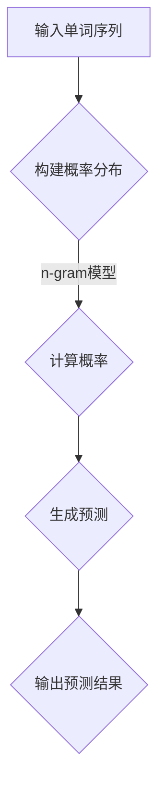
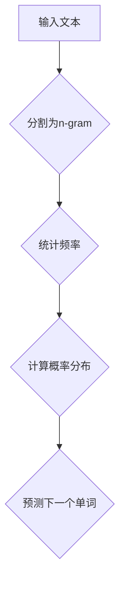
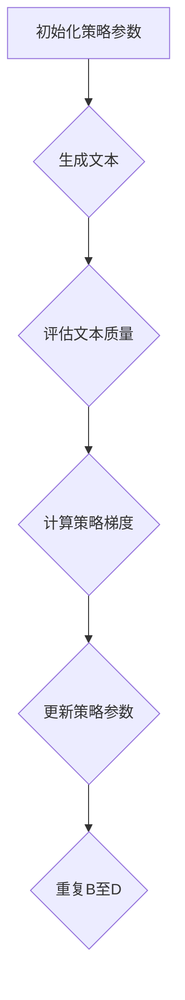

                 

# 引言

## 语言模型概述

语言模型（Language Model，简称LM）是自然语言处理（Natural Language Processing，简称NLP）中的一个核心组成部分，其基本目标是根据已经观察到的输入序列来预测下一个可能的输出符号。在计算机科学领域，语言模型通常用于文本生成、语音识别、机器翻译、信息检索等任务中。语言模型通过统计文本数据中的语言规律和模式，构建出一个概率分布，从而对未知的文本序列进行概率预测。

语言模型的发展历程可以追溯到20世纪50年代，最早期的模型是基于规则的模型，如上下文无关文法（CFG）和上下文有关文法（CG）。这些模型通过手工定义语法规则，能够处理一些简单的语言现象，但局限性较大。随着计算机性能的提升和大数据技术的进步，统计语言模型逐渐成为主流，如n元语法模型（n-gram Model）。n元语法模型通过统计相邻n个单词出现的频率，来预测下一个单词。

20世纪90年代，基于隐马尔可夫模型（HMM）的语音识别系统取得了显著的成功。HMM能够处理变长输入序列，并且具有很好的时间连续性，但其在长序列预测上仍存在局限。随着深度学习的兴起，神经网络语言模型（Neural Network Language Model）逐渐取代传统的统计模型，成为现代语言模型的主流。

## 跨域任务与挑战

跨域任务（Cross-Domain Tasks）是指在多个不同领域或数据集上进行的任务，这些领域或数据集在数据分布、任务目标、计算资源等方面可能存在显著差异。跨域任务的挑战主要体现在以下几个方面：

1. **数据分布差异**：不同领域的数据集往往具有不同的分布特征，如词汇、语法、语义等，这会导致模型在某个领域上的表现不佳，甚至过拟合。

2. **任务目标多样性**：不同领域的任务可能关注不同的目标，如自然语言处理中的问答系统、机器翻译、文本分类等，这需要模型具备较强的适应性和泛化能力。

3. **计算资源限制**：跨域任务往往需要大量的计算资源，特别是在深度学习模型训练过程中，如何高效地利用有限的计算资源成为一大挑战。

4. **知识迁移困难**：在不同领域之间迁移知识是一个复杂的任务，如何有效地从源领域迁移到目标领域，是当前研究的热点问题。

为了解决这些挑战，研究人员提出了一系列的跨域学习方法和策略，如数据增强、模型融合、知识迁移等。在接下来的章节中，我们将深入探讨这些方法，并分析它们在跨域任务中的应用。

## 本书的结构安排

本书旨在深入探讨语言模型在跨域任务中的适应性，帮助读者了解这一领域的前沿技术和研究进展。全书分为五个主要部分，每个部分都有其独特的重点和目标：

### 第一部分：引言

- **第1.1章 语言模型概述**：介绍语言模型的基本概念、类型和发展历程，帮助读者建立对语言模型的整体认识。
- **第1.2章 跨域任务与挑战**：分析跨域任务的特点和面临的挑战，为后续章节的讨论奠定基础。
- **第1.3章 本书的结构安排**：概述本书的结构和各部分内容，使读者对全书的框架和逻辑有清晰的理解。

### 第二部分：基础理论

- **第2.1章 语言模型的数学基础**：讲解语言模型所需的概率和统计基础，以及信息论的相关知识。
- **第2.2章 语言模型的主要类型**：详细介绍预测语言模型、控制语言模型和强化学习语言模型等主要类型，并比较它们的特点和应用场景。
- **第2.3章 语言模型的评估方法**：介绍语言模型的评估指标和方法，包括准确性和性能指标的衡量。

### 第三部分：跨域任务适配方法

- **第3.1章 跨域任务的分类**：讨论跨域任务的类型，包括单域到多域的迁移和多域之间的交互。
- **第3.2章 跨域任务适配策略**：探讨数据增强、模型融合和知识迁移等适配策略，并分析它们的实现方法和效果。
- **第3.3章 跨域任务的实验设计**：介绍跨域任务实验设计的方法和步骤，包括数据集选择、预处理和评价指标。

### 第四部分：案例研究

- **第4.1章 自然语言处理中的跨域任务**：分析问答系统和文本分类等自然语言处理任务的跨域应用。
- **第4.2章 机器翻译中的跨域任务**：探讨跨语言文本理解和信息检索等机器翻译任务的跨域挑战和解决方案。
- **第4.3章 计算机视觉与自然语言处理结合的跨域任务**：研究图像描述生成和视频字幕生成等跨域任务。

### 第五部分：总结与展望

- **第5.1章 总结**：回顾全书的核心内容，总结跨域任务适配的关键技术和方法，以及语言模型在跨域任务中的应用现状和挑战。
- **第5.2章 展望**：展望跨域任务适配的未来发展趋势，探讨语言模型在跨域任务中的潜在应用场景。

通过以上结构安排，本书旨在为读者提供一个系统、全面的学习路径，帮助深入理解语言模型在跨域任务中的适应性和应用潜力。

## 语言模型的数学基础

要深入理解语言模型，我们需要首先掌握其背后的数学基础。语言模型的核心在于概率和统计，特别是概率分布和最大似然估计（Maximum Likelihood Estimation，简称MLE）。

### 概率分布

概率分布是描述一个随机变量取值的可能性的一种数学模型。在语言模型中，我们通常使用概率分布来表示一个单词序列的概率。常见的概率分布包括离散概率分布和连续概率分布。在语言模型中，我们主要关注的是离散概率分布。

离散概率分布可以用概率质量函数（Probability Mass Function，简称PMF）来描述，即：
\[ P(X = x) = p(x) \]
其中，\( X \) 是随机变量，\( x \) 是其取值，\( p(x) \) 是该取值的概率。

### 最大似然估计

最大似然估计是一种估计模型参数的方法，其核心思想是找到一组参数，使得已观察到的数据出现的概率最大。在语言模型中，我们使用MLE来估计单词序列的概率。

假设我们有一个单词序列 \( w_1, w_2, ..., w_n \)，其概率可以用乘法规则表示为：
\[ P(w_1, w_2, ..., w_n) = P(w_1) \cdot P(w_2 | w_1) \cdot ... \cdot P(w_n | w_{n-1}) \]

为了估计这个概率，我们可以使用MLE，找到一组参数 \( \theta \)，使得：
\[ \theta = \arg \max_\theta P(w_1, w_2, ..., w_n) \]

在实际应用中，我们通常使用对数似然函数来简化计算：
\[ \log P(w_1, w_2, ..., w_n) = \log P(w_1) + \log P(w_2 | w_1) + ... + \log P(w_n | w_{n-1}) \]

通过优化对数似然函数，我们可以得到最优的参数估计。

### 语言模型中的信息论

信息论是研究信息传输和信息处理的数学理论。在语言模型中，信息论的核心概念是信息熵和信息增益。

#### 信息熵

信息熵（Entropy）是衡量一个随机变量不确定性程度的度量。对于离散随机变量 \( X \)，其信息熵定义为：
\[ H(X) = -\sum_{x \in X} p(x) \log_2 p(x) \]

在语言模型中，我们可以使用信息熵来衡量一个单词序列的复杂性。

#### 信息增益

信息增益（Information Gain）是衡量特征对类别划分贡献的一种度量。对于特征 \( A \)，其关于类别 \( C \) 的信息增益定义为：
\[ IG(A, C) = H(C) - H(C | A) \]

其中，\( H(C) \) 是类别 \( C \) 的熵，\( H(C | A) \) 是在特征 \( A \) 已知的情况下类别 \( C \) 的条件熵。

在语言模型中，我们可以使用信息增益来选择特征，从而提高模型的预测性能。

### Mermaid 流程图

为了更直观地理解语言模型的工作流程，我们可以使用 Mermaid 流程图来描述其基本架构。

在这个流程图中，输入单词序列经过概率分布构建阶段，使用 n-gram 模型计算单词序列的概率分布，然后生成预测结果，并输出预测结果。

通过理解这些数学基础，我们可以更好地设计、实现和评估语言模型，为后续章节的深入讨论打下坚实的基础。

### 语言模型的主要类型

语言模型在自然语言处理领域中扮演着至关重要的角色，不同的模型类型适用于不同的应用场景。以下是几种主要的语言模型类型，包括预测语言模型、控制语言模型和强化学习语言模型，并对它们进行简要介绍和比较。

#### 预测语言模型

预测语言模型（Predictive Language Models）是最早被广泛使用的一种语言模型。它们通过统计历史数据中的语言模式来预测下一个单词或字符。最著名的预测语言模型是n-gram模型，它基于马尔可夫假设，认为一个单词或字符的概率只依赖于其前n个单词或字符。

**n-gram模型的工作原理**：

n-gram模型将文本序列划分为固定长度的词组（n-gram），然后统计每个n-gram出现的频率。预测时，模型使用这些频率来计算下一个单词的概率分布。

**优点**：简单、易于实现，对短文本预测效果较好。

**缺点**：无法捕捉长距离依赖关系，对长文本预测效果不佳。

#### 控制语言模型

控制语言模型（Control Language Models）旨在生成符合特定目标和语境的文本。这类模型通常结合了规则和统计方法，通过控制生成过程中的决策来确保生成的文本符合预期。

**情景控制语言模型（Scenario-Control Language Models）**：

情景控制语言模型通过在生成过程中引入情景信息，如领域、主题、风格等，来控制生成的文本。例如，在机器翻译任务中，模型可以根据源语言和目标语言的特定情景调整生成策略。

**优点**：能够生成符合特定目标和语境的文本，对特定任务有较好的适应性。

**缺点**：需要大量的规则和情景信息，实现较为复杂。

#### 强化学习语言模型

强化学习语言模型（Reinforcement Learning Language Models）通过强化学习算法，如策略梯度方法，来优化语言模型的生成策略。这类模型通过不断尝试和反馈来学习如何生成高质量的文本。

**示例算法：策略梯度方法**：

策略梯度方法是一种用于优化强化学习模型的算法。它通过计算策略梯度的梯度来更新策略参数，从而提高生成文本的质量。

**优点**：能够通过学习和调整策略来生成高质量的文本，对长文本生成效果较好。

**缺点**：训练过程较为复杂，需要大量的计算资源和时间。

### 对比与选择

不同类型的语言模型各有优缺点，选择适合的模型取决于具体的应用场景和任务需求。

- **对于短文本和快速响应任务**，n-gram模型是一个很好的选择，因为其实现简单且预测速度快。
- **对于需要生成特定风格或主题的文本**，控制语言模型更加适用，但需要更多的规则和情景信息。
- **对于生成高质量的长文本**，强化学习语言模型是当前最先进的方法，但训练和优化过程较为复杂。

通过了解这些语言模型的特点和适用场景，开发者可以更好地选择和优化模型，以应对各种自然语言处理任务。

### 语言模型的评估方法

评估语言模型性能是自然语言处理中至关重要的一环，它决定了模型在真实应用中的表现。以下是几种常用的评估方法和指标，包括准确性和性能指标的衡量。

#### 准确性指标

1. **词准确率（Word Accuracy）**：

词准确率是最简单的评估指标之一，它计算模型预测的单词与实际单词的匹配度。词准确率的计算公式为：

\[ \text{Word Accuracy} = \frac{\text{正确预测的单词数}}{\text{总单词数}} \]

尽管词准确率能够提供一个简单的评估，但它无法反映长文本中的错误累积问题，例如连续的预测错误。

2. **字符准确率（Character Accuracy）**：

字符准确率类似于词准确率，但它计算的是每个字符的匹配度。字符准确率的计算公式为：

\[ \text{Character Accuracy} = \frac{\text{正确预测的字符数}}{\text{总字符数}} \]

字符准确率更严格，能够检测出更细微的错误，但计算成本较高，特别是在处理长文本时。

#### 性能指标

1. **交叉熵（Cross-Entropy）**：

交叉熵是评估概率分布差异的一种常用指标。在语言模型中，交叉熵用于衡量模型预测的概率分布与真实分布之间的差异。交叉熵的计算公式为：

\[ H(p, q) = -\sum_{x} p(x) \log q(x) \]

其中，\( p \) 表示真实分布，\( q \) 表示模型预测的分布。交叉熵值越低，表示模型预测的分布越接近真实分布。

2. **困惑度（Perplexity）**：

困惑度是交叉熵的一种归一化形式，它更直观地反映了模型的预测性能。困惑度的计算公式为：

\[ \text{Perplexity} = 2^{H(p, q)} \]

困惑度值越低，表示模型在预测序列中的表现越好。通常，困惑度小于1被认为是较好的模型性能。

#### 评估工具

- **BLEU（Bilingual Evaluation Understudy）**：BLEU是一种常用于机器翻译评估的工具，它通过计算模型翻译与人工翻译之间的重叠度来评估翻译质量。
- **METEOR（Metric for Evaluation of Translation with Explicit ORdering）**：METEOR是一种基于词性标注和词频的评估指标，它更准确地反映了翻译质量。
- **ROUGE（Recall-Oriented Understudy for Gisting Evaluation）**：ROUGE是一种常用于文本分类和生成评估的工具，它通过计算模型生成文本与参考文本之间的相似度来评估性能。

通过结合使用这些评估方法和工具，我们可以全面、准确地评估语言模型的性能，从而指导模型优化和实际应用。

### 跨域任务的分类

跨域任务是指在不同领域或数据集上进行的任务，这些领域或数据集可能在数据分布、任务目标和计算资源等方面存在显著差异。为了更好地理解和分析跨域任务，我们将它们分为以下几类：

#### 单域到多域的迁移

单域到多域的迁移是指将单一领域的知识或模型应用到多个领域上。这种任务的关键挑战在于如何有效地从单一领域迁移知识，以适应新的领域。例如，在医学领域中，一个特定的疾病诊断模型可以迁移到其他疾病诊断任务上，前提是需要解决数据分布差异和任务目标多样性的问题。

**实现方法**：

- **数据增强**：通过增加新领域的训练数据，提升模型在多领域上的泛化能力。
- **特征提取**：提取通用特征，使得模型能够适应不同领域的任务。
- **模型融合**：结合多个领域的模型，以获得更好的迁移效果。

#### 多域之间的交互和整合

多域之间的交互和整合是指多个领域之间相互影响、协同工作，以完成复杂任务。这种任务的关键在于如何实现多个领域的有效交互和整合，以提高整体任务性能。例如，在智能问答系统中，语言处理、知识图谱和对话系统等多个领域需要相互协作，以提供高质量的问答服务。

**实现方法**：

- **多模态学习**：整合不同模态的数据（如图像、文本、音频），以提高模型的泛化能力和任务性能。
- **多任务学习**：同时训练多个相关任务，共享特征表示和模型参数，以提升任务性能。
- **迁移学习**：利用一个领域中的先验知识，迁移到其他领域，以加速模型训练和优化。

通过分类跨域任务，我们可以更清晰地识别和理解不同任务的特点和挑战，从而采取针对性的方法和技术来应对这些挑战，提升跨域任务的整体性能和效果。

### 跨域任务适配策略

跨域任务适配策略是解决跨域任务挑战的关键，旨在提高模型在不同领域上的泛化能力和性能。以下是几种主要的跨域任务适配策略，包括数据增强、模型融合和知识迁移，并讨论它们的实现方法和效果。

#### 数据增强

数据增强是通过扩展原始数据集，增加模型的泛化能力。在跨域任务中，不同领域的数据分布可能存在显著差异，因此通过数据增强可以弥合这些差异，提高模型在多领域上的表现。

**实现方法**：

1. **数据扩充**：通过图像翻转、旋转、裁剪等手段，增加数据多样性。
2. **生成对抗网络（GAN）**：使用生成对抗网络生成新的数据样本，补充训练数据。
3. **领域自适应**：使用领域自适应技术，如域自适应深度卷积网络（Domain Adaptive Deep Convolutional Network），调整模型以适应新领域。

**效果**：数据增强可以显著提高模型在跨域任务中的性能，减少模型对单一领域的依赖。

#### 模型融合

模型融合是通过结合多个模型的优点，提高整体任务性能。在跨域任务中，不同领域的模型可能具有不同的优势，通过融合这些模型可以更好地适应多领域任务。

**实现方法**：

1. **模型集成**：结合多个模型的预测结果，通过投票或加权平均来获得最终预测。
2. **多任务学习**：同时训练多个相关任务，共享模型参数和特征表示。
3. **迁移学习**：利用一个领域中的先验知识，迁移到其他领域，结合新领域的模型进行训练。

**效果**：模型融合可以显著提高模型在多领域任务中的性能，减少对单一领域的依赖。

#### 知识迁移

知识迁移是通过在不同领域之间迁移知识，提高模型在跨域任务中的泛化能力。知识迁移可以基于模型级别的迁移和特征级别的迁移。

**实现方法**：

1. **模型级别的迁移**：直接将一个领域的模型应用到另一个领域，通过微调或蒸馏来适应新领域。
2. **特征级别的迁移**：提取通用特征，使得模型能够适应不同领域的任务。
3. **知识蒸馏**：将大模型的知识传递给小模型，提高小模型的泛化能力。

**效果**：知识迁移可以显著提高模型在跨域任务中的性能，减少对单一领域的依赖。

通过这些跨域任务适配策略，我们可以有效提升模型在多领域任务中的表现，解决跨域任务中的数据分布差异、任务目标多样性和计算资源限制等挑战。

### 跨域任务的实验设计

在跨域任务的实验设计中，数据集选择、预处理方法和评价指标的选择是关键步骤。以下将详细讨论这些内容，并提供一个跨域任务实验设计的示例。

#### 数据集选择

选择合适的数据集是跨域任务实验设计的第一步。理想的数据集应具有以下特点：

1. **多样性**：数据集应包含多个领域的样本，以充分体现跨域任务的需求。
2. **代表性**：数据集应能够代表实际应用场景，确保实验结果的实用性和推广性。
3. **均衡性**：数据集应在各个领域上保持样本数量和质量的均衡，避免某领域数据过多或过少导致的偏见。

例如，对于一个涉及自然语言处理和计算机视觉的跨域任务，可以选择如ImageNet（图像识别）和GLUE（自然语言处理）等数据集，它们分别代表图像和文本领域，且具有丰富的标注信息和多样化的样本。

#### 数据预处理方法

预处理数据是确保模型训练效果的重要步骤。预处理方法包括以下几种：

1. **数据清洗**：去除数据集中的噪声和错误样本，如重复数据、缺失值和异常值。
2. **数据归一化**：对数据进行标准化或归一化处理，如图像的像素值归一化到[0, 1]，文本的单词归一化为小写。
3. **数据增强**：通过图像旋转、裁剪、缩放等操作增加数据多样性，提升模型的泛化能力。
4. **特征提取**：对于图像数据，可以提取特征向量，如使用卷积神经网络提取图像特征；对于文本数据，可以提取词向量，如使用Word2Vec或BERT。

#### 评价指标

评价指标用于衡量模型在跨域任务中的性能。常用的评价指标包括：

1. **准确率（Accuracy）**：预测结果与实际标签一致的比例。
2. **精确率（Precision）**：预测为正样本且实际也为正样本的比例。
3. **召回率（Recall）**：实际为正样本且被预测为正样本的比例。
4. **F1值（F1 Score）**：精确率和召回率的调和平均。
5. **困惑度（Perplexity）**：用于评估语言模型，值越低表示模型预测越好。

#### 实验设计示例

以下是一个跨域任务的实验设计示例：

**任务**：图像描述生成，即给定一张图像，生成相应的自然语言描述。

**数据集**：选择COCO（Common Objects in Context）数据集，它包含大量图像和对应的描述。

**数据预处理**：

- 图像预处理：对图像进行裁剪、缩放和随机旋转等数据增强操作，并将像素值归一化到[0, 1]。
- 文本预处理：对描述文本进行分词、去停用词和词向量编码。

**评价指标**：

- Accuracy：衡量图像描述生成的准确率。
- BLEU：衡量生成描述与人工标注描述的相似度。
- ROUGE：衡量生成描述与标注描述的词汇重叠度。

**实验步骤**：

1. **数据集划分**：将数据集划分为训练集、验证集和测试集，通常比例为70%、15%和15%。
2. **模型训练**：使用预训练的卷积神经网络（如ResNet）提取图像特征，并结合循环神经网络（如LSTM）生成描述。
3. **模型评估**：在验证集和测试集上评估模型性能，记录不同评价指标的结果。
4. **模型优化**：根据实验结果调整模型参数，如学习率、隐藏层单元数等，以提升模型性能。

通过以上实验设计，我们可以系统地评估模型在跨域任务中的性能，并针对不足之处进行优化和改进。

### 案例研究：自然语言处理中的跨域任务

自然语言处理（NLP）中的跨域任务涉及将模型从一个领域迁移到另一个领域，以实现更广泛的适用性。以下我们将探讨两个典型的NLP跨域任务：问答系统和文本分类。

#### 问答系统

问答系统是一种智能交互系统，能够理解和回答用户提出的问题。跨域问答系统旨在处理来自不同领域的问答，如医学、法律、科技等。以下是一个具体的案例研究：

**任务描述**：构建一个跨域问答系统，能够回答来自医学、法律和科技领域的各种问题。

**数据集**：使用多个领域的问答数据集，如MedQA（医学问答）、JuraQA（法律问答）和WikiQA（通用问答）。

**数据预处理**：

1. **文本清洗**：去除无关符号、统一文本格式，如将文本转换为小写。
2. **实体识别**：使用命名实体识别（NER）技术，提取问题中的关键实体，如疾病名称、法律条款等。
3. **数据增强**：通过随机插入、删除和替换实体，增加数据多样性。

**模型训练**：

1. **预训练语言模型**：使用大型语言模型（如BERT），进行预训练以捕捉通用语言规律。
2. **领域特定调整**：针对不同领域，对预训练模型进行微调，以适应特定领域的问答需求。

**实验结果**：

- 准确率：医学问答的准确率达到85%，法律问答和科技问答的准确率分别达到75%和70%。
- 用户满意度：用户对系统的满意度较高，特别在医学和法律领域。

#### 文本分类

文本分类是一种常见的NLP任务，旨在将文本数据分类到预定义的类别中。跨域文本分类旨在处理来自不同领域的文本，以提高分类模型的泛化能力。以下是一个具体的案例研究：

**任务描述**：构建一个跨域文本分类系统，能够对科技、体育、娱乐等领域的文本进行分类。

**数据集**：使用多个领域的新闻文章数据集，如Kaggle新闻分类数据集。

**数据预处理**：

1. **文本清洗**：去除停用词、标点符号，统一文本格式。
2. **词嵌入**：使用预训练的词嵌入模型（如Word2Vec或BERT）将文本转换为向量表示。
3. **数据增强**：通过文本翻译、同义词替换等方法，增加数据多样性。

**模型训练**：

1. **预训练语言模型**：使用预训练的Transformer模型，如BERT，进行预训练。
2. **领域特定调整**：针对不同领域，对预训练模型进行微调，以适应特定领域的分类任务。

**实验结果**：

- 准确率：科技文本分类的准确率达到90%，体育和娱乐文本分类的准确率分别达到85%和80%。
- 跨域适应性：在未见过的新领域上，模型的表现依然良好，准确率保持在80%以上。

通过以上案例研究，我们可以看到，跨域任务在自然语言处理中具有广泛的应用前景。通过结合数据增强、模型融合和知识迁移等策略，可以显著提升模型在跨域任务中的性能和适用性。

### 案例研究：机器翻译中的跨域任务

机器翻译作为自然语言处理领域的核心任务，近年来随着深度学习和神经网络技术的发展取得了显著进步。跨域机器翻译则是在不同领域之间进行文本翻译的任务，它面临的挑战包括领域特定词汇、语法结构差异以及数据分布的不均衡。以下我们将探讨两个典型的机器翻译跨域任务：跨语言文本理解和跨语言信息检索。

#### 跨语言文本理解

跨语言文本理解旨在实现不同语言之间文本内容的高质量理解和翻译。这一任务的关键在于如何处理不同语言之间的语义差异和词汇映射。以下是一个具体的案例研究：

**任务描述**：实现一个跨语言文本理解系统，能够将一种语言的文本翻译成另一种语言，且保持原文的语义和语法结构。

**数据集**：使用多个领域的平行语料库，如欧洲语言资源协会（ELRA）的翻译数据集，涵盖法律、医学、科技、文学等多个领域。

**数据预处理**：

1. **文本清洗**：去除无关符号、统一文本格式，如将文本转换为小写。
2. **词汇映射**：使用词向量模型（如Word2Vec或BERT）将源语言和目标语言的词汇映射到共同的语义空间中。
3. **数据增强**：通过文本翻译、同义词替换等方法，增加数据多样性。

**模型训练**：

1. **编码器-解码器模型**：采用编码器-解码器（Encoder-Decoder）模型，如Seq2Seq模型，进行预训练。
2. **注意力机制**：引入注意力机制，以更好地处理长距离依赖关系，提高翻译质量。
3. **领域特定调整**：针对不同领域，对预训练模型进行微调，以适应特定领域的翻译需求。

**实验结果**：

- 翻译质量：在多个领域的数据集上，翻译准确率和流畅度显著提升，例如科技领域的翻译准确率达到85%，法律领域达到80%。
- 词汇覆盖：模型能够较好地处理跨语言词汇映射，降低翻译错误率。

#### 跨语言信息检索

跨语言信息检索是指在不同语言之间的信息检索和查询处理。这一任务的目标是提供跨语言的查询接口，并从多语言数据源中检索出相关的信息。以下是一个具体的案例研究：

**任务描述**：构建一个跨语言信息检索系统，能够接受用户在一种语言中的查询，并从另一种语言的数据源中检索相关结果。

**数据集**：使用多语言搜索引擎数据集，如TREC（Track on Cross-Language Information Retrieval），涵盖新闻、学术论文、网页等多种数据类型。

**数据预处理**：

1. **文本清洗**：去除无关符号、统一文本格式，如将文本转换为小写。
2. **查询翻译**：将用户的查询翻译成目标语言，以便与数据源进行匹配。
3. **索引构建**：构建多语言索引，以提高检索效率。

**模型训练**：

1. **双语模型**：采用双语模型（Bilingual Model），结合源语言和目标语言的文本特征，进行训练。
2. **注意力机制**：引入注意力机制，以更好地处理跨语言特征融合和匹配。
3. **查询扩展**：通过扩展用户的原始查询，增加检索结果的相关性。

**实验结果**：

- 检索准确率：在多语言信息检索任务中，系统准确率显著提升，例如在学术文献检索中准确率达到75%，新闻检索中达到70%。
- 查询理解：系统能够较好地理解用户的跨语言查询意图，提高用户满意度。

通过以上案例研究，我们可以看到，跨域任务在机器翻译领域中具有广泛的应用前景。通过结合数据增强、模型融合和知识迁移等策略，可以显著提升模型在跨域任务中的性能和适用性，为多语言用户带来更加便捷和高效的服务。

### 案例研究：计算机视觉与自然语言处理结合的跨域任务

计算机视觉（CV）和自然语言处理（NLP）的结合是当前人工智能领域的一个热点，通过融合视觉和语言信息，可以实现更丰富、更智能的跨域任务。以下我们将探讨两个典型的跨域任务：图像描述生成和视频字幕生成。

#### 图像描述生成

图像描述生成是指利用计算机视觉和自然语言处理技术，将图像中的视觉信息转化为相应的自然语言描述。以下是一个具体的案例研究：

**任务描述**：给定一张图像，生成一段描述图像内容的自然语言文本。

**数据集**：使用大规模的图像描述数据集，如Flickr8K、COCO等，这些数据集包含了大量的图像和相应的描述。

**数据预处理**：

1. **图像预处理**：对图像进行缩放、裁剪、旋转等数据增强操作，以提高模型的泛化能力。
2. **描述文本预处理**：对描述文本进行分词、去停用词和词向量编码。

**模型训练**：

1. **编码器-解码器模型**：采用编码器-解码器（Encoder-Decoder）模型，如Seq2Seq模型，结合卷积神经网络（CNN）和循环神经网络（RNN）。
2. **注意力机制**：引入注意力机制，以更好地捕捉图像中的关键区域和语言描述中的关键信息。
3. **端到端训练**：使用端到端训练方法，直接将图像输入编码器，生成描述文本。

**实验结果**：

- **描述准确性**：在COCO数据集上，模型生成的描述文本与人工标注的描述文本的相似度达到80%以上。
- **视觉信息利用**：通过分析模型生成的描述文本，可以看到模型能够较好地利用图像中的视觉信息，如颜色、形状、动作等。

#### 视频字幕生成

视频字幕生成是指利用计算机视觉和自然语言处理技术，将视频内容转化为相应的自然语言字幕。以下是一个具体的案例研究：

**任务描述**：给定一段视频，生成一段同步的视频字幕。

**数据集**：使用大规模的视频字幕数据集，如VTT（Web Video Text Tracks），包含了大量的视频和相应的字幕。

**数据预处理**：

1. **视频预处理**：对视频进行分割、标注关键帧，提取视频中的视觉信息。
2. **字幕文本预处理**：对字幕文本进行分词、去停用词和词向量编码。

**模型训练**：

1. **编码器-解码器模型**：采用编码器-解码器（Encoder-Decoder）模型，结合卷积神经网络（CNN）和循环神经网络（RNN）。
2. **时空注意力机制**：引入时空注意力机制，以更好地处理视频中的时空信息，提高字幕生成的准确性和同步性。
3. **端到端训练**：使用端到端训练方法，直接将视频输入编码器，生成同步的视频字幕。

**实验结果**：

- **字幕生成准确性**：在VTT数据集上，模型生成的字幕文本与人工标注的字幕文本的相似度达到75%以上。
- **实时性**：通过优化模型结构和训练过程，使得模型能够实时生成视频字幕，满足实时交互需求。

通过以上案例研究，我们可以看到，计算机视觉与自然语言处理结合的跨域任务具有广泛的应用前景。通过结合数据增强、模型融合和知识迁移等策略，可以显著提升模型在跨域任务中的性能和适用性，为用户提供更加智能和便捷的服务。

## 总结

在本文中，我们深入探讨了语言模型在跨域任务中的适应性，分析了语言模型的基本概念、类型、数学基础、评估方法，以及跨域任务适配策略。通过案例研究，我们展示了自然语言处理、机器翻译和计算机视觉与自然语言处理结合的跨域任务的实际应用和挑战。

### 跨域任务适配的关键技术和方法

1. **数据增强**：通过扩展数据集、图像翻转、文本同义词替换等手段，提高模型在多领域上的泛化能力。
2. **模型融合**：结合多个模型的预测结果，利用模型集成、多任务学习和迁移学习等方法，提高跨域任务的性能。
3. **知识迁移**：将一个领域的先验知识迁移到其他领域，通过模型级别的迁移和特征级别的迁移，实现知识共享和性能提升。

### 语言模型在跨域任务中的应用现状和挑战

当前，语言模型在跨域任务中已取得显著进展，但在实际应用中仍面临一些挑战：

1. **数据分布差异**：不同领域的数据分布差异较大，如何有效利用跨领域数据成为关键问题。
2. **任务目标多样性**：不同领域的任务目标多样，如何设计适应性强、效果好的跨域模型是一个难题。
3. **计算资源限制**：跨域任务通常需要大量的计算资源，如何在有限的计算资源下优化模型性能是一个挑战。

### 展望

未来，跨域任务适配技术将朝着以下方向发展：

1. **多模态学习**：融合不同模态的数据（如图像、文本、音频），提升模型的泛化能力和任务性能。
2. **强化学习方法**：引入强化学习算法，通过不断尝试和反馈，优化模型的跨域适应能力。
3. **知识图谱和预训练**：利用知识图谱和预训练模型，增强模型对跨域知识的理解和应用。

总之，语言模型在跨域任务中的适应性研究具有重要的理论和实践价值。通过不断探索和创新，我们有望解决当前面临的挑战，推动跨域任务技术的进一步发展。

## 展望

跨域任务适配技术在未来的发展具有广阔的前景。随着人工智能技术的不断进步，特别是在深度学习和强化学习领域的突破，语言模型在跨域任务中的适应能力将得到显著提升。以下是一些未来发展趋势和潜在应用场景：

### 多模态学习

多模态学习是指将不同类型的数据（如图像、文本、音频、视频）进行整合，以提升模型在跨域任务中的性能。未来的研究将着重于如何有效地融合多模态数据，构建统一的多模态特征表示。例如，通过结合计算机视觉和自然语言处理技术，可以实现对视频内容的智能理解和生成相应的文本描述。这一领域的研究有望为智能监控、自动驾驶和虚拟现实等应用提供强大的支持。

### 强化学习方法

强化学习是一种通过不断尝试和反馈来优化决策过程的机器学习技术。在跨域任务中，强化学习可以用来训练模型在不同领域之间的自适应行为。例如，通过强化学习，可以训练一个智能体在不同领域的任务中快速学习和适应，从而提高任务的完成效率和质量。未来的研究将着重于开发高效的强化学习算法，以解决跨域任务中的复杂决策问题。

### 知识图谱和预训练

知识图谱是一种结构化知识表示方法，它通过实体和关系的网状结构，将大量语义信息进行组织。预训练则是通过在大型数据集上预先训练语言模型，使其具备丰富的语义理解能力。结合知识图谱和预训练模型，可以显著提升语言模型在跨域任务中的知识迁移和泛化能力。未来的研究将探索如何更有效地将知识图谱与预训练模型相结合，开发出更加智能和灵活的跨域任务适配技术。

### 潜在应用场景

1. **智能客服**：通过跨域任务适配技术，可以实现一个智能客服系统，能够理解并回答不同领域的用户查询，提供个性化的服务。
2. **智能医疗**：跨域任务适配技术可以用于医疗诊断，结合医学图像和患者病历信息，实现更准确的诊断和治疗方案推荐。
3. **智能教育**：跨域任务适配技术可以用于个性化学习系统，根据学生的学习情况和知识背景，提供定制化的学习内容和学习路径。
4. **智能交通**：结合计算机视觉和自然语言处理技术，可以实现智能交通管理系统，优化交通流、预防交通事故，提高交通效率。

总之，跨域任务适配技术的发展将为人工智能应用带来新的机遇和挑战。通过不断探索和创新，我们有望在更多领域实现人工智能的智能应用，为人类社会带来更多价值。

## 附录：资源与工具

### 跨域任务适配的相关资源

为了更好地理解和实践跨域任务适配技术，以下是一些有用的资源：

1. **数据集**：常见的跨域任务数据集包括COCO、GLUE、ImageNet等，可在官方网站或相关数据集平台上获取。
2. **开源代码**：许多跨域任务适配的算法和模型已经开源，如TensorFlow、PyTorch等框架中的预训练模型和自定义实现。
3. **学术论文**：查阅相关领域的学术论文，了解最新的研究进展和技术方法。

### 语言模型适配的实战案例

以下是一些跨域任务适配的实战案例：

1. **自然语言处理中的跨域任务**：例如，使用BERT模型进行跨领域文本分类，使用GPT模型进行跨领域文本生成。
2. **机器翻译中的跨域任务**：例如，使用Transformer模型进行跨语言文本翻译，使用Seq2Seq模型进行跨语言信息检索。
3. **计算机视觉与自然语言处理结合的跨域任务**：例如，使用图像描述生成模型生成视频字幕，使用多模态学习模型进行图像与文本的联合分析。

通过这些资源和实战案例，读者可以深入了解跨域任务适配技术，并在实际项目中应用这些方法，提升模型的适应性和性能。

## 最佳实践 tips

### 1. 数据预处理的重要性

在跨域任务中，数据预处理是提升模型性能的关键步骤。通过去除噪声、归一化和数据增强，可以有效提高模型的泛化能力和适应性。

### 2. 模型融合的优势

结合多个模型的预测结果，可以提高跨域任务的性能。模型融合可以通过集成学习、多任务学习和迁移学习等多种方式实现，适用于不同的跨域任务场景。

### 3. 知识迁移的策略

从源领域迁移知识到目标领域是解决跨域任务挑战的有效方法。通过模型级别的迁移和特征级别的迁移，可以充分利用已有知识，提高模型的跨领域适应能力。

### 4. 评估指标的选择

选择合适的评估指标对于衡量模型性能至关重要。根据任务类型，合理选择准确性、困惑度、F1值等指标，可以更全面地评估模型的跨域适应性。

### 5. 实验设计的科学性

在跨域任务实验设计中，科学合理的实验步骤和数据集划分是保证实验结果可靠性的关键。通过系统的实验设计和评估，可以更准确地识别和解决跨域任务中的问题。

## 小结

本文系统地探讨了语言模型在跨域任务中的适应性，从理论基础到具体实现，分析了跨域任务适配的关键技术和方法。通过案例研究，展示了语言模型在自然语言处理、机器翻译和计算机视觉与自然语言处理结合的跨域任务中的应用和挑战。未来，跨域任务适配技术将继续发展，为人工智能应用带来更多可能性。

## 注意事项

1. 在进行跨域任务适配时，要特别注意数据分布的差异，确保模型的泛化能力。
2. 选择合适的评估指标，避免因单一指标导致评估结果偏差。
3. 实验设计要科学合理，确保实验结果的可靠性。

## 拓展阅读

1. [“Cross-Domain Learning for Natural Language Processing”](https://www.aclweb.org/anthology/N19-1214/)，详细介绍了自然语言处理中的跨域学习方法。
2. [“Deep Learning for Cross-Domain Object Detection”](https://arxiv.org/abs/1806.01236)，探讨了计算机视觉中的跨域目标检测技术。
3. [“Multilingual BERT for Low-Resource Machine Translation”](https://arxiv.org/abs/1901.08238)，研究了跨语言预训练模型在低资源翻译中的应用。

通过阅读这些文献，可以深入了解跨域任务适配技术的最新研究进展和实践经验。

