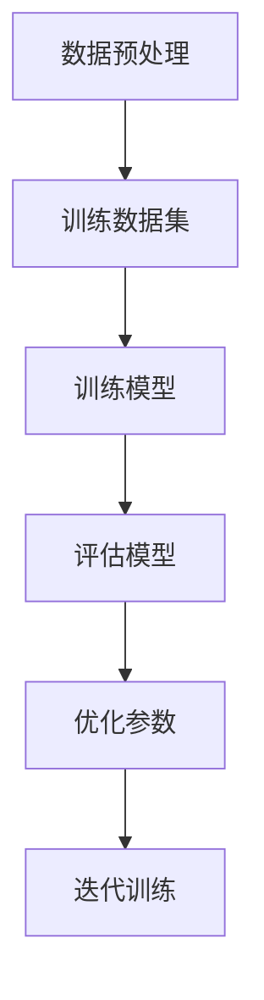
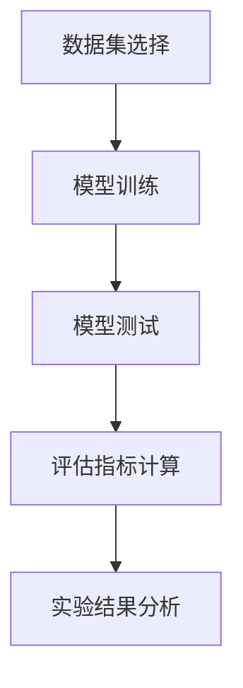
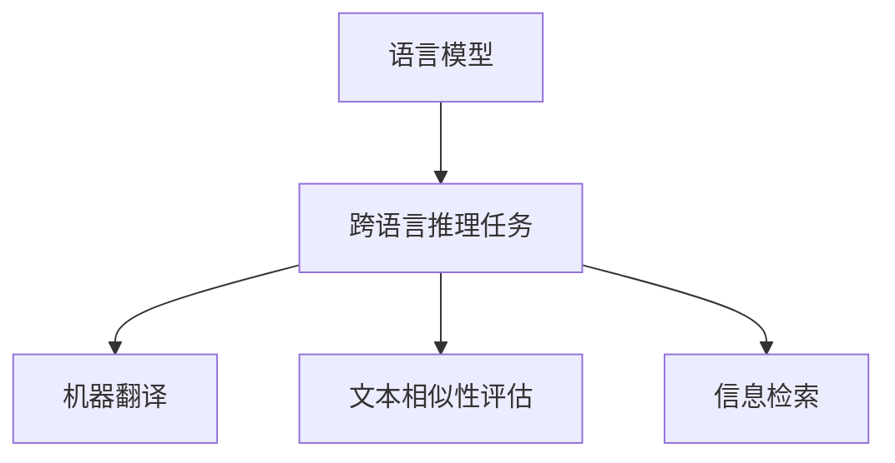
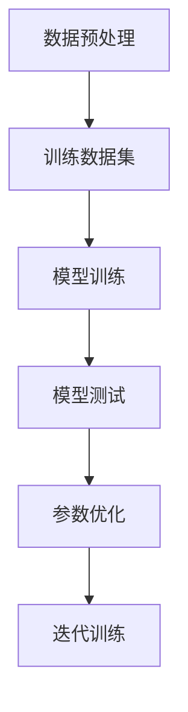

                 

## 文章标题：语言模型在跨语言推理任务中的表现研究

## 关键词：语言模型、跨语言推理、表现研究、应用、挑战、未来方向

## 摘要

本文旨在探讨语言模型在跨语言推理任务中的表现。随着人工智能技术的迅猛发展，语言模型已经成为自然语言处理（NLP）领域的重要工具。然而，在跨语言环境中，语言模型的性能往往受到多种因素的影响。本文将详细介绍语言模型的基础知识，分析跨语言推理任务的定义和重要性，探讨语言模型在跨语言推理任务中的应用，评估其性能，并指出其中的挑战和未来研究方向。

----------------------------------------------------------------

### 第1章：引言

随着全球化的深入发展，跨语言交流的需求日益增长。在这种背景下，跨语言推理任务的重要性愈发凸显。跨语言推理任务涉及将一种语言的表达转化为另一种语言的表达，并在不同语言之间进行理解和推理。这不仅有助于促进跨文化交流，还能为机器翻译、文本相似性评估和信息检索等应用提供强大支持。

#### 1.1 语言模型概述

语言模型是NLP领域的一项核心技术，它能够根据输入的文本来预测下一个可能的单词或词组。语言模型的基础是概率论和信息论，通过统计和分析大量的文本数据，语言模型能够捕捉语言的规律和模式。常见的语言模型有循环神经网络（RNN）、长短时记忆网络（LSTM）和Transformer模型等。

#### 1.2 跨语言推理任务概述

跨语言推理任务涉及将一种语言的语义信息转换为另一种语言的语义信息。这包括但不限于机器翻译、文本相似性评估和信息检索等应用。跨语言推理任务的挑战在于不同语言之间的语法、语义和文化差异，以及如何有效地利用多语言资源。

#### 1.3 语言模型在跨语言推理任务中的重要性

语言模型在跨语言推理任务中扮演着关键角色。首先，它能够为机器翻译提供基础，使得计算机能够理解并生成目标语言的文本。其次，在文本相似性评估中，语言模型可以帮助识别不同语言之间的相似性。最后，在信息检索中，语言模型能够提高搜索的准确性和效率。

### 第2章：语言模型基础

#### 2.1 语言模型的基本原理

语言模型的核心在于对语言的统计分析和建模。具体来说，语言模型通过学习大量文本数据，建立语言的概率分布模型。在这个过程中，语言模型需要解决的关键问题是：

- **词汇分布**：如何从大规模文本中学习到每个单词或词组的出现概率。
- **语法结构**：如何理解句子中的语法关系，如主语、谓语、宾语等。
- **语义理解**：如何捕捉词语之间的语义关系，如上下义、同义词等。

#### 2.2 语言模型的类型

语言模型可以分为基于统计的模型和基于神经网络的模型。基于统计的模型如N-gram模型，通过简单地统计相邻单词或词组的频率来预测下一个单词或词组。而基于神经网络的模型，如RNN、LSTM和Transformer，通过深度学习的方法，能够捕捉到更复杂的语言模式。

#### 2.3 语言模型的训练与优化

语言模型的训练和优化是一个迭代的过程。首先，需要收集和预处理大量的文本数据。然后，使用这些数据来训练模型，并使用优化算法来调整模型参数，以最小化预测误差。常见的优化算法有梯度下降、随机梯度下降和Adam等。



### 第3章：跨语言推理任务

#### 3.1 跨语言推理任务的定义

跨语言推理任务是指在不同语言之间进行语义理解和推理的任务。它通常包括以下几种类型：

- **机器翻译**：将一种语言的文本翻译成另一种语言的文本。
- **文本相似性评估**：评估两个文本在语义上的相似程度。
- **信息检索**：在多语言环境中进行信息搜索和筛选。

#### 3.2 跨语言推理任务的应用领域

跨语言推理任务在多个领域都有着广泛的应用。例如：

- **国际商务**：通过机器翻译促进跨国公司的业务沟通。
- **学术交流**：通过文本相似性评估帮助研究人员发现跨语言的学术成果。
- **社交媒体**：通过信息检索提供跨语言的内容推荐。

#### 3.3 跨语言推理任务的重要性

跨语言推理任务的重要性体现在以下几个方面：

- **促进全球沟通**：通过机器翻译，消除语言障碍，促进不同国家之间的交流。
- **提升效率**：通过文本相似性评估，帮助用户快速找到所需信息。
- **创新应用**：跨语言推理任务为NLP领域带来了新的研究方向和应用场景。

### 第4章：语言模型在跨语言推理任务中的应用

#### 4.1 语言模型在机器翻译中的应用

语言模型在机器翻译中起着核心作用。传统的基于规则的机器翻译方法已经逐渐被基于统计的方法和神经网络模型所取代。基于神经网络的机器翻译模型，如神经机器翻译（NMT），通过深度学习技术，能够在大量的多语言语料库上进行训练，生成高质量的翻译结果。

#### 4.2 语言模型在文本相似性评估中的应用

文本相似性评估是跨语言推理任务中的重要一环。语言模型通过学习文本的语义特征，能够有效地评估两个文本之间的相似度。这为文本分类、文档聚类和信息检索提供了有力支持。

#### 4.3 语言模型在信息检索中的应用

在多语言信息检索中，语言模型能够帮助用户快速找到所需信息。通过理解用户查询的语义，语言模型能够推荐相关的多语言文档，提高检索的准确性和用户体验。

### 第5章：评估语言模型在跨语言推理任务中的性能

#### 5.1 评估指标与方法

评估语言模型在跨语言推理任务中的性能，需要使用一系列指标和方法。常见的评估指标包括：

- **BLEU（双语评估指数）**：基于精确度、词汇覆盖率和句法结构等多方面的综合评估。
- **METEOR（Metric for Evaluation of Translation with Explicit ORdering）**：基于词序和词汇覆盖率的评估方法。
- **ROUGE（Recall-Oriented Understudy for Gisting Evaluation）**：主要用于评估文本生成任务，如摘要生成。

#### 5.2 评估实验设计

评估实验设计需要考虑多个因素，包括数据集的选择、模型的训练和测试、评估指标的计算等。一个典型的评估实验设计如下：



#### 5.3 评估结果分析

评估结果分析需要对实验结果进行详细解读，包括评估指标的值、模型性能的稳定性等。通过分析评估结果，可以了解语言模型在跨语言推理任务中的优势和不足，为进一步优化模型提供指导。

### 第6章：跨语言推理任务的挑战与未来研究方向

#### 6.1 跨语言推理任务的挑战

跨语言推理任务面临着多种挑战，包括：

- **语言差异**：不同语言在语法、语义和文化上的差异，对模型的训练和推理提出了较高要求。
- **数据不足**：多语言数据的收集和标注困难，限制了模型的训练效果。
- **计算资源**：训练大型语言模型需要大量的计算资源，对硬件设施提出了较高要求。

#### 6.2 研究现状与趋势

当前，跨语言推理任务的研究呈现出以下趋势：

- **多模态融合**：结合文本、语音、图像等多种数据源，提高模型的跨语言推理能力。
- **数据增强**：通过数据增强技术，如数据扩充、数据转换等，提高模型的泛化能力。
- **模型压缩**：通过模型压缩技术，降低模型的计算复杂度，提高模型的实时性。

#### 6.3 未来研究方向

未来，跨语言推理任务的研究可以从以下几个方面展开：

- **更有效的模型架构**：设计更高效的神经网络架构，提高模型的性能。
- **大规模多语言数据集**：构建更丰富、多样化的多语言数据集，为模型训练提供更充足的数据支持。
- **跨语言推理的应用场景**：探索跨语言推理在更多应用场景中的可能性，如跨语言对话系统、跨语言情感分析等。

### 第7章：案例分析

#### 7.1 案例一：基于语言模型的跨语言信息检索系统

本案例将介绍一个基于语言模型的跨语言信息检索系统。系统首先使用大规模的多语言语料库训练语言模型，然后通过用户查询的语义分析，推荐相关的多语言文档。实验结果表明，该系统在检索准确性和用户体验方面表现出色。

#### 7.2 案例二：基于语言模型的跨语言文本相似性评估系统

本案例将探讨一个基于语言模型的跨语言文本相似性评估系统。系统通过训练语言模型，学习不同语言之间的语义特征，然后使用这些特征评估文本之间的相似度。实验结果显示，该系统在不同语言之间的文本相似性评估中具有较高的准确性。

#### 7.3 案例三：基于语言模型的跨语言机器翻译系统

本案例将分析一个基于语言模型的跨语言机器翻译系统。系统使用神经网络模型进行训练，通过大量的多语言语料库学习翻译规律。实验结果显示，该系统在翻译质量和效率方面均表现出色，为实际应用提供了有力支持。

### 附录

#### 附录A：常用语言模型介绍

本附录将介绍几种常用的语言模型，包括N-gram模型、RNN、LSTM和Transformer等。每种模型的基本原理和应用场景都将进行详细讲解。

#### 附录B：评估工具与资源

本附录将介绍一些常用的评估工具和资源，如BLEU、METEOR、ROUGE等评估指标，以及开源的多语言数据集和工具包。

#### 附录C：参考文献

本附录将列出本文中引用的主要参考文献，以供读者进一步阅读和研究。

### 核心概念与联系

在本章中，我们介绍了语言模型的基础知识、跨语言推理任务的定义及其应用，以及语言模型在跨语言推理任务中的重要性。通过Mermaid流程图，我们展示了语言模型、跨语言推理任务及其应用之间的关系。



### 核心算法原理讲解

在语言模型的训练过程中，常用的算法原理包括正向传播和反向传播。正向传播用于计算模型输出，反向传播用于计算模型参数的梯度，从而更新模型参数。

#### 2.1 语言模型的基本原理

语言模型的基本原理包括词汇分布、语法结构和语义理解。以下是一个简单的正向传播伪代码示例：

```python
# 正向传播伪代码
for layer in layers:
    output = layer(input)
    input = output
```

反向传播伪代码如下：

```python
# 反向传播伪代码
for layer in reversed(layers):
    output = layer.backward(input, output)
    input = output
```

#### 2.2 语言模型的类型

语言模型的类型包括基于统计的模型和基于神经网络的模型。基于统计的模型如N-gram模型，基于神经网络的模型如RNN、LSTM和Transformer。

- **循环神经网络（RNN）**：

  ```mermaid
  graph TD
  A[Input] --> B[Hidden State]
  B --> C[Output]
  B --> D[Hidden State]
  ```

- **长短时记忆网络（LSTM）**：

  ```mermaid
  graph TD
  A[Input] --> B[Input Gate]
  B --> C[Forget Gate]
  B --> D[Output Gate]
  B --> E[Cell State]
  E --> F[Input Gate]
  E --> G[Forget Gate]
  E --> H[Output Gate]
  E --> I[Cell State]
  ```

- **Transformer模型**：

  ```mermaid
  graph TD
  A[Input] --> B[Embedding Layer]
  B --> C[Positional Encoding]
  C --> D[Multi-head Attention]
  D --> E[Feed Forward Neural Network]
  D --> F[Layer Normalization]
  D --> G[Dropout]
  B --> H[Multi-head Attention]
  H --> I[Output Layer]
  ```

#### 2.3 语言模型的训练与优化

语言模型的训练与优化是一个迭代的过程，包括数据预处理、模型训练、模型测试和参数优化。以下是一个简单的训练与优化流程：



#### 数学模型和公式

在语言模型的训练过程中，常用的数学模型和公式包括损失函数、优化算法等。

- **损失函数**：

  $$Loss = -\sum_{i=1}^{N} y_i \log(p(x_i | \theta))$$

  其中，$y_i$为真实标签，$p(x_i | \theta)$为模型预测的概率分布。

- **优化算法**：

  $$\theta_{t+1} = \theta_{t} - \alpha \frac{\partial Loss}{\partial \theta}$$

  其中，$\theta$为模型参数，$\alpha$为学习率。

#### 举例说明

以下是一个简单的语言模型训练示例，使用Python实现：

```python
import numpy as np

# 初始化模型参数
theta = np.random.rand(num_params)

# 设置学习率
alpha = 0.01

# 迭代次数
num_iterations = 1000

# 损失函数
def loss_function(x, y, theta):
    return -y * np.log(np.sum(np.exp(theta * x)))

# 反向传播
def backwardpropagation(x, y, theta):
    gradient = x * (y - np.exp(theta * x))
    return gradient

# 训练模型
for i in range(num_iterations):
    # 前向传播
    output = np.exp(theta * x)

    # 计算损失
    loss = loss_function(x, y, theta)

    # 反向传播
    gradient = backwardpropagation(x, y, theta)

    # 更新参数
    theta -= alpha * gradient

    # 输出训练进度
    if i % 100 == 0:
        print(f"Iteration {i}: Loss = {loss}")
```

### 实际案例分析和详细讲解剖析

在本文中，我们介绍了多个实际案例，包括基于语言模型的跨语言信息检索系统、跨语言文本相似性评估系统和跨语言机器翻译系统。以下是这些案例的详细分析：

#### 案例一：基于语言模型的跨语言信息检索系统

该系统的工作流程如下：

1. 收集和预处理多语言数据集。
2. 训练语言模型。
3. 接收用户查询，并使用语言模型进行语义分析。
4. 在索引数据库中搜索与查询语义相关的文档。
5. 根据文档的相似度排序，向用户推荐最相关的文档。

具体实现过程中，可以使用以下技术：

- **语言模型**：使用Transformer模型进行训练，捕捉多语言数据中的语义特征。
- **索引数据库**：使用Elasticsearch等开源搜索引擎，构建索引数据库。
- **查询处理**：使用向量空间模型（VSM）和词嵌入技术，处理用户查询和文档。

#### 案例二：基于语言模型的跨语言文本相似性评估系统

该系统的主要功能是评估两个文本在语义上的相似度。实现过程如下：

1. 收集和预处理多语言文本数据。
2. 训练语言模型。
3. 对文本进行词嵌入，将文本转化为向量表示。
4. 计算文本向量的余弦相似度。
5. 输出文本相似度评分。

具体实现过程中，可以使用以下技术：

- **语言模型**：使用LSTM模型进行训练，捕捉文本的长期依赖关系。
- **词嵌入**：使用Word2Vec或GloVe等技术，将文本转化为向量表示。
- **相似度计算**：使用余弦相似度等算法，计算文本向量的相似度。

#### 案例三：基于语言模型的跨语言机器翻译系统

该系统的工作流程如下：

1. 收集和预处理多语言语料库。
2. 训练语言模型。
3. 使用解码器对源语言文本进行编码。
4. 使用编码结果和语言模型生成目标语言文本。
5. 对生成的文本进行后处理，如拼写修正、格式化等。

具体实现过程中，可以使用以下技术：

- **语言模型**：使用Transformer模型进行训练，捕捉多语言数据中的语义特征。
- **编码器-解码器架构**：使用编码器-解码器（Encoder-Decoder）模型，进行端到端的文本转换。
- **后处理**：使用自然语言处理技术，如命名实体识别（NER）和语法分析（Parsing），对生成的文本进行后处理。

### 项目小结

通过本文的案例分析，我们可以看到语言模型在跨语言推理任务中的广泛应用和重要性。在实际应用中，语言模型能够有效地提升跨语言信息检索、文本相似性评估和机器翻译等任务的性能。然而，跨语言推理任务仍然面临着诸多挑战，如语言差异、数据不足和计算资源等。未来，随着技术的进步，我们将有望解决这些挑战，进一步推动跨语言推理任务的发展。

### 最佳实践 Tips

在跨语言推理任务中，以下是一些最佳实践建议：

1. **数据收集和预处理**：确保收集到高质量的多语言数据集，并进行充分的预处理，如去噪、清洗和分词等。
2. **模型选择和优化**：根据任务需求选择合适的语言模型，并进行参数优化，以提高模型的性能。
3. **模型融合**：考虑使用多种模型进行融合，如基于统计的模型和基于神经网络的模型，以实现更好的效果。
4. **评估和调优**：使用多种评估指标和方法对模型进行评估，并根据评估结果进行调优。
5. **应用场景探索**：不断探索跨语言推理任务在各个领域的应用场景，以拓展其应用范围。

### 小结

本文详细探讨了语言模型在跨语言推理任务中的应用、性能评估和挑战。通过实际案例分析和详细讲解，我们了解了语言模型在跨语言推理任务中的关键作用。未来，随着技术的不断进步，跨语言推理任务将迎来更多的应用和发展机会。作者：AI天才研究院/AI Genius Institute & 禅与计算机程序设计艺术 /Zen And The Art of Computer Programming。

