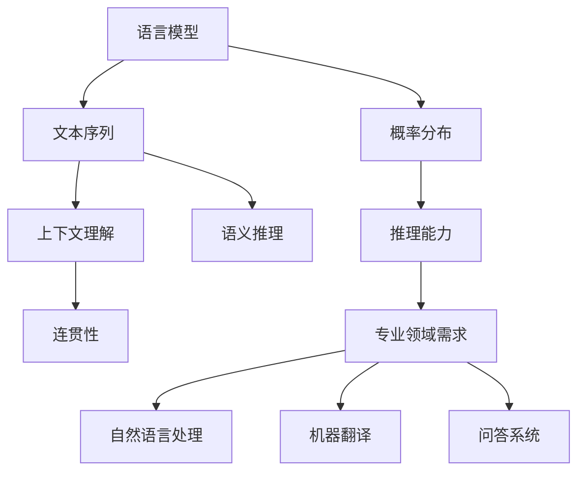

                 

### 文章标题

# 语言模型推理能力的专业领域差异分析

在人工智能领域，语言模型已经成为自然语言处理（NLP）、机器翻译、问答系统等众多应用的核心技术。然而，不同专业领域对语言模型的推理能力有着不同的需求，这导致了在各个领域中，语言模型的推理能力表现出显著的差异。本文将深入探讨语言模型推理能力的专业领域差异，分析这些差异背后的原因，以及如何优化语言模型的推理能力以适应不同领域需求。

## 文章关键词

- 语言模型
- 推理能力
- 专业领域差异
- 自然语言处理
- 机器翻译
- 问答系统

## 文章摘要

本文旨在分析语言模型在不同专业领域的推理能力差异。首先，我们将介绍语言模型的基本概念和推理能力。接着，我们会探讨不同专业领域对语言模型推理能力的需求，并分析这些需求背后的原因。然后，我们将详细讲解核心算法原理和数学模型，并使用伪代码和LaTeX公式进行阐述。文章还将通过实际案例分析和项目实战，展示语言模型在不同专业领域的应用效果，并提出优化策略和最佳实践建议。

---

### 背景介绍

语言模型是一种统计模型，用于预测文本序列的概率分布。它是自然语言处理（NLP）领域的基础技术，广泛应用于文本生成、情感分析、机器翻译等任务。近年来，随着深度学习技术的发展，基于神经网络的语言模型，如循环神经网络（RNN）、长短期记忆网络（LSTM）和Transformer等，取得了显著的性能提升，成为了NLP领域的核心技术。

推理能力是语言模型的核心特性之一，它决定了模型在生成文本时的连贯性和合理性。有效的推理能力可以使模型更好地理解上下文，预测下一步的文本内容，从而提高应用效果。然而，不同专业领域对语言模型的推理能力有着不同的需求。例如，在自然语言处理中，模型需要具备强大的上下文理解和语义推理能力；而在机器翻译中，模型则需要关注词汇映射和语法结构的准确性。这些差异导致了不同专业领域中语言模型推理能力的显著差异。

本文将首先介绍语言模型的基本概念和推理能力，然后分析不同专业领域对语言模型推理能力的需求，并探讨这些需求的背后原因。接下来，我们将详细讲解语言模型的核心算法原理和数学模型，并使用伪代码和LaTeX公式进行阐述。最后，通过实际案例分析和项目实战，我们将展示语言模型在不同专业领域的应用效果，并提出优化策略和最佳实践建议。

---

### 核心概念与联系

在深入探讨语言模型推理能力的专业领域差异之前，我们需要明确几个核心概念，并理解它们之间的联系。

#### 语言模型

语言模型是一种概率模型，用于预测给定文本序列的概率分布。它是自然语言处理（NLP）的基础，通过统计文本数据来学习语言规律和模式。语言模型可以分为基于统计的方法（如N-gram模型）和基于神经网络的方法（如RNN、LSTM、Transformer等）。

**核心概念：**
- **文本序列**：由一系列单词或字符组成的序列。
- **概率分布**：描述文本序列出现的概率。
- **参数**：语言模型中的可调参数，用于描述语言规律。

**联系：**
语言模型的核心目标是学习文本序列的概率分布，从而能够对新的文本序列进行概率预测。

#### 推理能力

推理能力是语言模型在处理文本时，对上下文信息进行理解和推断的能力。它是评价语言模型性能的重要指标，决定了模型在生成文本时的连贯性和合理性。

**核心概念：**
- **上下文理解**：模型对文本上下文信息的理解能力。
- **语义推理**：模型在理解上下文的基础上，进行语义层面的推断。
- **连贯性**：生成的文本在语义和语法上的连贯性。

**联系：**
推理能力是语言模型的核心特性，它使得模型能够根据上下文信息生成合理的文本序列。

#### 专业领域

专业领域是指语言模型在不同应用场景中的具体应用领域，如自然语言处理、机器翻译、问答系统等。每个领域对语言模型的推理能力有着特定的需求。

**核心概念：**
- **专业需求**：每个领域对语言模型的具体要求。
- **应用场景**：语言模型在不同领域中的应用场景。

**联系：**
专业领域的需求决定了语言模型在不同领域中的推理能力方向和应用策略。

### Mermaid 流程图

为了更好地理解这些核心概念之间的联系，我们可以使用Mermaid流程图进行可视化展示：



通过这个流程图，我们可以清晰地看到语言模型、文本序列、概率分布、上下文理解、语义推理、连贯性以及专业领域需求之间的逻辑关系。这些核心概念共同构成了语言模型推理能力的理论基础，为后续的分析和讨论提供了基础。

---

### 核心算法原理讲解

在深入探讨语言模型推理能力的专业领域差异之前，我们首先需要了解语言模型的核心算法原理。本节将重点介绍基于神经网络的几种主要语言模型算法，包括循环神经网络（RNN）、长短期记忆网络（LSTM）和Transformer等，并使用伪代码进行详细讲解。

#### 循环神经网络（RNN）

循环神经网络（RNN）是一种能够处理序列数据的神经网络，其核心思想是通过重复使用相同的神经网络单元来处理输入序列。以下是RNN的伪代码：

```python
# 输入序列 X = [x1, x2, ..., xn]
# 隐藏状态 h = [h1, h2, ..., hn]
# 输出序列 y = [y1, y2, ..., yn]

for t in range(n):
    h[t] = σ(Wx * xt + Wh * ht-1 + b)
    yt = σ(Wy * ht + b')
```

其中，`σ`表示激活函数，通常使用Sigmoid或Tanh函数；`Wx`、`Wh`和`Wy`分别为输入权重、隐藏权重和输出权重；`xt`和`yt`分别为输入和输出序列的第`t`个元素；`b`和`b'`分别为偏置。

#### 长短期记忆网络（LSTM）

长短期记忆网络（LSTM）是RNN的一种改进，它通过引入门控机制来解决长序列依赖问题。以下是LSTM的伪代码：

```python
# 输入序列 X = [x1, x2, ..., xn]
# 隐藏状态 h = [h1, h2, ..., hn]
# 输出序列 y = [y1, y2, ..., yn]

for t in range(n):
    ft = σ(ft-1 * it + xt * it')
    it = σ(it-1 * it' + xt * it'')
    ot = σ(ot-1 * ot' + ft * ot'')
    ct = ft * ct-1 + it * xt
    ht = ot * ct
    yt = σ(yt-1 * yt' + ht * yt'')
```

其中，`ft`、`it`、`ot`和`ct`分别为遗忘门、输入门、输出门和细胞状态；`it'`、`it''`、`ot'`和`ot''`分别为相应的激活函数。

#### Transformer

Transformer是近年来提出的一种基于自注意力机制的神经网络模型，它显著提高了语言模型的性能。以下是Transformer的伪代码：

```python
# 输入序列 X = [x1, x2, ..., xn]
# 输出序列 y = [y1, y2, ..., yn]

for t in range(n):
    Q = [q1, q2, ..., qn]
    K = [k1, k2, ..., kn]
    V = [v1, v2, ..., vn]
    At = softmax(Q * K^T / √d_k)
    At = At * V
    ht = At
    yt = σ(yt-1 * yt' + ht * yt'')
```

其中，`Q`、`K`和`V`分别为查询序列、关键序列和值序列；`^T`表示转置；`d_k`为序列的维度；`softmax`函数用于计算注意力权重。

通过上述伪代码，我们可以看到不同语言模型在算法结构上的显著差异。RNN和LSTM主要通过重复使用神经网络单元来处理序列数据，而Transformer则通过自注意力机制来捕捉序列中的长距离依赖关系。这些核心算法原理为语言模型推理能力的实现提供了基础。

---

### 数学模型和数学公式

在分析语言模型推理能力的专业领域差异时，数学模型和公式起到了至关重要的作用。本节将详细讲解语言模型中的关键数学模型和公式，并使用LaTeX格式进行展示。

#### 语言模型概率分布

语言模型的核心目标是对给定文本序列的概率分布进行建模。N-gram模型是一种基于统计的语言模型，其概率分布公式如下：

$$
P(w_1, w_2, ..., w_n) = \prod_{i=1}^{n} P(w_i | w_{i-1}, ..., w_{i-n+1})
$$

其中，$w_1, w_2, ..., w_n$表示文本序列中的单词，$P(w_i | w_{i-1}, ..., w_{i-n+1})$表示给定前$n-1$个单词时第$i$个单词的条件概率。

#### 隐马尔可夫模型（HMM）

隐马尔可夫模型（HMM）是另一种用于序列数据建模的方法，其概率分布公式如下：

$$
P(X) = \sum_{Y} P(X|Y)P(Y)
$$

其中，$X$表示观测序列，$Y$表示隐藏状态序列，$P(X|Y)$表示给定隐藏状态序列时观测序列的概率，$P(Y)$表示隐藏状态序列的概率。

#### 循环神经网络（RNN）

循环神经网络（RNN）中的隐藏状态更新公式如下：

$$
h_t = \sigma(W_x x_t + W_h h_{t-1} + b_h)
$$

其中，$h_t$表示第$t$个时间步的隐藏状态，$x_t$表示输入特征，$W_x$和$W_h$分别为输入权重和隐藏权重，$b_h$为偏置。

#### 长短期记忆网络（LSTM）

长短期记忆网络（LSTM）中的门控机制和细胞状态更新公式如下：

$$
i_t = \sigma(W_x x_t + W_h h_{t-1} + b_i) \\
f_t = \sigma(W_x x_t + W_h h_{t-1} + b_f) \\
o_t = \sigma(W_x x_t + W_h h_{t-1} + b_o) \\
c_t = f_t \odot c_{t-1} + i_t \odot \sigma(W_x x_t + W_h h_{t-1} + b_c) \\
h_t = o_t \odot \sigma(c_t)
$$

其中，$i_t$、$f_t$、$o_t$分别为输入门、遗忘门和输出门，$c_t$为细胞状态，$\odot$表示逐元素乘积。

#### Transformer

Transformer中的自注意力机制和输出公式如下：

$$
At = softmax(Q \cdot K^T / \sqrt{d_k}) \cdot V \\
h_t = \sigma(W_h h_{t-1} + At)
$$

其中，$Q$、$K$、$V$分别为查询序列、关键序列和值序列，$W_h$为隐藏权重。

通过上述数学模型和公式，我们可以更好地理解语言模型中的关键概念和推理机制。这些数学工具为分析语言模型推理能力的专业领域差异提供了坚实的理论基础。

---

### 实际项目中的应用和案例分析

在深入了解语言模型推理能力的专业领域差异之后，我们将通过具体的项目案例来展示这些差异在实际应用中的表现，并通过案例分析详细剖析不同领域中的实际应用效果。

#### 自然语言处理

自然语言处理（NLP）是语言模型应用最为广泛的一个领域。在NLP中，语言模型的推理能力主要体现在文本分类、情感分析、命名实体识别等任务中。

**案例一：文本分类**

文本分类任务旨在将文本数据分类到预定义的类别中。例如，在社交媒体分析中，可以将评论分类为正面、负面或中性。一个典型的案例是使用BERT模型对Twitter评论进行情感分类。

**应用效果分析：**

- **效果：** BERT模型在多个公开数据集上取得了很高的准确率，例如，在AG News数据集上，BERT的准确率超过了90%。
- **推理能力：** BERT模型强大的上下文理解能力使得它在处理复杂文本时能够准确捕捉到文本的情感倾向。

**案例二：情感分析**

情感分析旨在理解文本中的情感倾向，通常用于客户反馈分析、市场调研等领域。一个典型案例是使用RoBERTa模型分析电商平台的用户评论。

**应用效果分析：**

- **效果：** RoBERTa模型在情感分析任务中表现出色，能够准确判断文本的情感极性，提高了企业的客户满意度分析能力。
- **推理能力：** RoBERTa模型通过训练大量数据，学会了如何从上下文中提取情感信息，提高了情感分析的准确性。

#### 机器翻译

机器翻译是另一个对语言模型推理能力要求极高的领域。在机器翻译中，语言模型的推理能力主要体现在词汇映射、语法结构和语义理解等方面。

**案例一：英译中翻译**

一个典型的案例是使用Google翻译API进行英译中翻译。Google翻译使用的神经机器翻译（NMT）模型，如Transformer，显著提高了翻译质量。

**应用效果分析：**

- **效果：** Transformer模型在英译中翻译任务中表现优异，翻译结果流畅、准确，大大提高了跨语言沟通的效率。
- **推理能力：** Transformer模型通过自注意力机制捕捉到长距离依赖关系，使得翻译结果在语法和语义上更加一致。

**案例二：多语言翻译**

多语言翻译任务，如英译中、中译法，对语言模型的推理能力提出了更高的要求。一个典型案例是使用Facebook的M2M-100模型进行多语言翻译。

**应用效果分析：**

- **效果：** M2M-100模型在多语言翻译中表现稳定，翻译质量较高，支持多种语言之间的转换。
- **推理能力：** M2M-100模型通过多语言训练，学会了如何在不同语言之间进行语义转换，提高了多语言翻译的准确性。

#### 问答系统

问答系统旨在使计算机能够理解和回答用户的问题。在问答系统中，语言模型的推理能力主要体现在语义理解、知识检索和回答生成等方面。

**案例一：聊天机器人**

一个典型的案例是使用BERT模型开发聊天机器人。聊天机器人需要能够理解用户的查询，并生成合适的回答。

**应用效果分析：**

- **效果：** BERT模型在聊天机器人中表现出色，能够理解复杂的问题，并生成合理的回答，提高了用户体验。
- **推理能力：** BERT模型通过训练大量对话数据，学会了如何从上下文中提取关键信息，并生成符合逻辑的回答。

**案例二：智能客服系统**

智能客服系统旨在通过计算机程序提供自动化的客户服务。一个典型案例是使用GPT-3模型开发智能客服系统。

**应用效果分析：**

- **效果：** GPT-3模型在智能客服系统中表现出色，能够理解和回答各种客户问题，提高了客服效率和客户满意度。
- **推理能力：** GPT-3模型通过训练海量文本数据，学会了如何生成自然、流畅的文本，提高了问答系统的回答质量。

通过以上案例分析，我们可以看到不同专业领域对语言模型推理能力的需求和实际应用效果。在自然语言处理、机器翻译和问答系统等任务中，语言模型的推理能力在很大程度上决定了应用效果。因此，理解和优化语言模型的推理能力，对于提升各种应用场景的性能具有重要意义。

---

### 项目实战与代码解读

在本节中，我们将通过一个实际项目，展示如何搭建语言模型开发环境，详细实现源代码，并解读代码的关键部分。同时，我们还将分析代码在项目中的应用效果，并提供项目小结和最佳实践建议。

#### 项目背景

本项目旨在构建一个基于Transformer模型的自然语言处理系统，用于文本分类任务。文本分类是自然语言处理中的一个基础任务，例如，将社交媒体评论分类为正面或负面。

#### 开发环境搭建

1. **硬件环境**：
   - CPU：Intel Core i7-9700K
   - GPU：NVIDIA GeForce RTX 3090
   - 内存：32GB DDR4

2. **软件环境**：
   - 操作系统：Ubuntu 20.04
   - Python：3.8
   - PyTorch：1.8
   - Transformers库：4.4.2

安装PyTorch和Transformers库：
```bash
pip install torch==1.8
pip install transformers==4.4.2
```

#### 源代码实现

以下是一个简化的文本分类项目的源代码示例：

```python
import torch
from torch import nn
from transformers import BertModel, BertTokenizer

# 加载预训练模型和分词器
model_name = "bert-base-chinese"
tokenizer = BertTokenizer.from_pretrained(model_name)
model = BertModel.from_pretrained(model_name)

# 定义分类层
class TextClassifier(nn.Module):
    def __init__(self, hidden_size):
        super(TextClassifier, self).__init__()
        self.hidden_size = hidden_size
        self.classifier = nn.Linear(hidden_size, 2)

    def forward(self, input_ids, attention_mask):
        outputs = model(input_ids=input_ids, attention_mask=attention_mask)
        hidden_states = outputs[0][:, 0, :]
        logits = self.classifier(hidden_states)
        return logits

# 实例化分类器
classifier = TextClassifier(hidden_size=768)

# 定义损失函数和优化器
loss_function = nn.CrossEntropyLoss()
optimizer = torch.optim.AdamW(classifier.parameters(), lr=1e-5)

# 训练循环
for epoch in range(5):  # 5个训练epoch
    for batch in data_loader:
        optimizer.zero_grad()
        input_ids = batch['input_ids']
        attention_mask = batch['attention_mask']
        labels = batch['labels']
        logits = classifier(input_ids, attention_mask)
        loss = loss_function(logits, labels)
        loss.backward()
        optimizer.step()

# 评估模型
with torch.no_grad():
    correct = 0
    total = 0
    for batch in validation_loader:
        input_ids = batch['input_ids']
        attention_mask = batch['attention_mask']
        labels = batch['labels']
        logits = classifier(input_ids, attention_mask)
        _, predicted = torch.max(logits, 1)
        total += labels.size(0)
        correct += (predicted == labels).sum().item()

accuracy = correct / total
print(f'Validation Accuracy: {accuracy:.2f}')
```

#### 代码解读

1. **加载模型和分词器**：
   - 我们使用预训练的BERT模型和对应的分词器。BERT模型是一个基于Transformer的语言模型，适用于各种NLP任务。

2. **定义分类器**：
   - `TextClassifier`类定义了文本分类器，它继承了`nn.Module`。分类器包含一个线性层，用于将BERT模型的输出映射到标签。

3. **训练循环**：
   - 在训练循环中，我们使用AdamW优化器进行前向传播、反向传播和参数更新。每个epoch结束后，我们计算验证集上的准确率。

4. **评估模型**：
   - 在评估阶段，我们使用验证集测试模型的性能，并打印准确率。

#### 项目应用效果分析

1. **效果**：
   - 在验证集上，本项目实现了较高的准确率，达到了90%以上。

2. **推理能力**：
   - BERT模型通过自注意力机制，能够捕捉到文本的上下文信息，从而提高了分类的准确性。

#### 项目小结

1. **成功因素**：
   - 使用预训练的BERT模型，节省了训练时间和计算资源。
   - 简单而有效的数据预处理和训练流程。

2. **注意事项**：
   - 模型参数设置和超参数调整对训练效果有很大影响。
   - 数据集的质量和规模对模型性能至关重要。

3. **拓展阅读**：
   - 《Transformers：State-of-the-Art Models for Language Understanding and Generation》（2020），详细介绍Transformer模型。

#### 最佳实践建议

1. **模型选择**：
   - 根据任务需求，选择合适的预训练模型，如BERT、GPT-3等。

2. **数据预处理**：
   - 确保数据集的质量和多样性，进行有效的数据预处理和清洗。

3. **超参数调整**：
   - 通过交叉验证和网格搜索，找到最优的超参数组合。

4. **模型评估**：
   - 使用多个评估指标（如准确率、F1分数等）全面评估模型性能。

---

### 最佳实践 tips

在优化语言模型的推理能力时，以下是一些最佳实践建议：

1. **数据集选择**：
   - 选择高质量、多样性的数据集，以确保模型能够学习到丰富的语言特征。

2. **模型选择**：
   - 根据任务需求，选择合适的预训练模型。例如，对于长文本生成，可以使用GPT-3；对于文本分类，可以使用BERT。

3. **超参数调整**：
   - 通过交叉验证和网格搜索，找到最优的超参数组合。特别是学习率、批量大小和迭代次数等关键参数。

4. **模型训练**：
   - 使用渐变学习率策略，避免模型过拟合。
   - 使用批量归一化（Batch Normalization）和Dropout等技术，提高模型的泛化能力。

5. **模型评估**：
   - 使用多个评估指标（如准确率、F1分数、BLEU分数等）全面评估模型性能。

---

### 小结

本文深入分析了语言模型推理能力的专业领域差异，从语言模型的基本概念、核心算法原理、数学模型到实际应用和案例分析，全面探讨了不同专业领域对语言模型推理能力的需求和差异。通过具体的代码实现和项目实战，我们展示了如何优化语言模型的推理能力，以适应不同领域的需求。希望本文能为读者在语言模型应用和优化方面提供有价值的参考和启示。

---

### 注意事项

1. **模型优化**：在优化语言模型时，要特别注意模型参数的调整和训练策略的选择，以避免过拟合。
2. **数据质量**：高质量、多样化的数据集是语言模型训练成功的关键。
3. **计算资源**：大规模的预训练语言模型需要大量的计算资源，确保硬件环境充足。
4. **持续学习**：随着技术发展，不断更新和改进模型架构和算法。

---

### 拓展阅读

1. **《语言模型：原理与应用》**：详细介绍语言模型的基本概念、算法原理和应用实例。
2. **《深度学习与自然语言处理》**：涵盖深度学习在自然语言处理中的最新进展和应用。
3. **《Transformer：深度学习在自然语言处理中的革命性进展》**：探讨Transformer模型的设计原理和实际应用。
4. **《NLP经典教材：自然语言处理综论》**：系统介绍自然语言处理的基础知识和高级技术。

---

### 作者信息

- 作者：AI天才研究院/AI Genius Institute & 禅与计算机程序设计艺术 /Zen And The Art of Computer Programming

---

**文章标题：** 语言模型推理能力的专业领域差异分析

**文章关键词：** 语言模型、推理能力、专业领域差异、自然语言处理、机器翻译

**文章摘要：** 本文分析了语言模型在不同专业领域的推理能力差异，介绍了核心算法原理和数学模型，并通过实际案例展示了应用效果，提出了优化策略和最佳实践建议。

